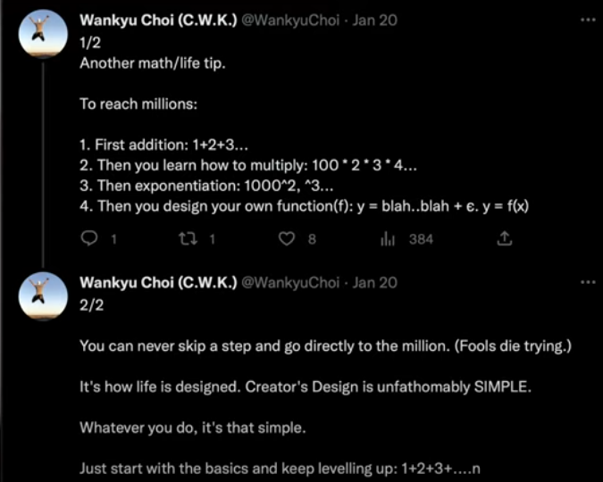
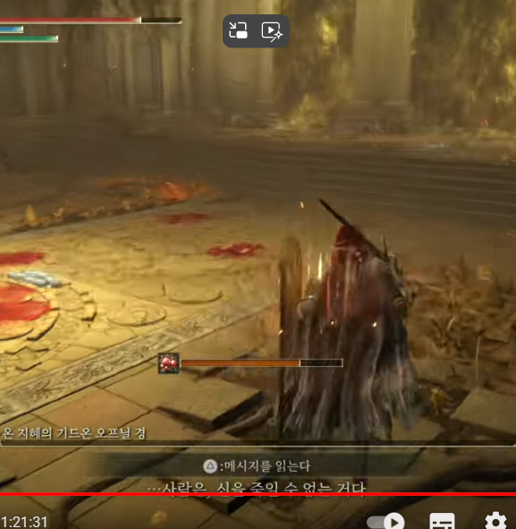

# 설 특집 대두족장 인생론 (2022)

## CWK Classics - NCWKV0262 - Creator's Design Is Unfathomably Simple

**영상링크 : https://youtu.be/OYg74483k08**

### 1. 기억력의 한계와 기록의 방법

- 요즘 기억력이 점점 나빠지고 있는데, 여러분들도 꼭 기록을 남겨야 한다. 나중에 기억하려고 해도 기억이 안 난다. 영상이든 무엇이든 기록을 통해 감정과 생각을 정리해놓으면, 미래의 자신에게 도움을 줄 수 있는 '천군만마'를 보내는 것과 같다.

- 저는 2,500개의 영상을 갖고 있다. Indexing까지 되어 있으니, 언제든 찾아볼 수 있다. 책까지 있다. 

- 여러분들의 가장 큰 오해는 다음 두 가지다.

1. 기억이 날 것이다
2. 간단하게라도 기록하면 기억날 것이다

- 반드시 꼼꼼하게 남겨야 한다. 한 두개의 키워드만으로는 절대 당시 상황을 끄집어 낼 수 없다.

    > 기록 더 꼼꼼하게 해야겠습니다. 천재가 아니니까요.

### 2. 기록의 가치

- 기록을 꼼꼼히 남기지 않으면 나중에 기억을 되살릴 수 없다. 

#### 레버리지와 마진의 위험성

- 기록을 남겨놓지 않으면 위험한 상황에서 같은 실수를 반복할 가능성이 크다. 예컨대, 투자에서 마진을 사용하여 손해를 본 경험이 있다면, 이를 꼼꼼히 기록해둬라. 마진과 레버리지는 매우 위험하며, 저는 이를 기록으로 남겨놓아 절대 잊지 않으려고 노력한다. 저는 투자병법 "화공편"에 크게 남겨놓기까지 했다. 

- 많은 인들이 최근에 레버리지, 주담대를 써서 박살이 났을 텐데, 아주 짧게만 기록해놓으면 나중에 그 때 감정을 되살릴 수 없다.

**시산혈하**와 같은 상황이 펼쳐지면 또다시 뻘짓을 하게 될 수 있다. 기억 절대 안난다.

- 언제나 주기적으로 반복되는 Cycle.

- 저는 크게 3번의 Cycle을 겪었고, 그 때마다 기록해놨다. 그래서 결국 살아남을 수 있었고, **절대 기억이 안난다**는 사실을 알게 되었다. **Mental Taking**을 믿지 마라.

### 3. 정규분포의 위력

- 정규분포를 이해하고 활용하면 인생의 난이도를 낮출 수 있다. Guestimation 할 수 있는 모든 현상은 보자마자 정규분포를 만들어봐라.

- 기록에 관해서도 생각해봐라. 나중에 어려움을 만났을 때의 천군만마를 보낸다는 생각으로 기록을 꼼꼼히 남겨라. 기록을 남겨보는 사람의 정규분포를 생각해봐라. 당신은 어디쯤 있는가? ex) 손병호 게임

- 이걸 연습하다보면 정말 모든 현상에 적용 가능하다. 심지어 나의 도덕성을 정규분포에 찍어보면 내가 만나는 사람들 중에 나보다 도덕성이 높을 확률까지 생각해볼 수 있다. 자신보다 기록을 꼼꼼히 남기는 사람을 만날 확률에 대서도 생각해보라. 예컨대, 저는 상위 5%이므로 저보다 기록을 꼼꼼히 남기는 사람을 만날 확률은 5%보다 낮다.

### 4. 안하는 것이 평균

- 안하는 것이 평균. 그래서, Guestimation해보면 여러분들이 저보다 기록을 안할 확률이 높다는 것.

- 좋은 기업에 대해서도 생각해볼 수 있다. 좋은 기업의 꼴을 생각해서 정규분포에 찍어보고 "밑으로 접어"를 생각해봐라. 렌즈를 구입할 때도 마찬가지. 

- 어떤 사람을 만났을 때 상위 1%일 확률은 그냥 1%. 

- 시산혈하, 곡성, 메두사를 만났을 때 기록을 하는 사람과 그렇지 않은 사람이 경쟁한다면 결과가 어떻게 될까?

***Creator's Design Is Unfathomably Simple***

- 정규분포는 항상, 언제나 연습해라. 인생의 난이도를 확 낮춰줄 수 있는 Cheat Key. ex) 매일 썰을 푸는 사람과 그렇지 않은 사람의 차이

- 나와 비교하고 싶은 사람을 판단해볼 때도 정규분포를 만들어보라. 

- 모든걸 다 하고 사는 사람들의 정규분포를 만들어보면, 에지간히 뛰어난 사람조차 Left tail에 위치할 것.

- 내가 위치하고 싶은 분포가 있다면 그곳에 핀을 찍어라. ex) Warren Buffett의 산수하는 습관

### 5. Fundamental의 중요성

- 산수하는 습관을 들이지 않아서 마진을 쓰게 되는 것을 생각해봐라. 

$$
-1 \times 2 = -2
$$

- 산수를 "안다"고 생각하지만, 실제로는 "모르기 때문에" 마진을 쓰는 것.

$$
1 \times 2 \times 3 \times 4 \times \cdots \times n \times 0 = 0
$$

- 기본, Fundamental이 중요하다. 달나라에 가려면 한방에 갈 수 있겠는가. 일단 걸어야 한다 : ***Creator's Design Is Unfathomably Simple*** 걷다보면 Optimization을 하고, 조금씩 축지법을 쓰기 시작하면서 곱셈을 하고, 결국 Powering을 하게 된다. ***S-Curve***를 타고 가는 것.

- 그러다 결국 자기만의 함수 $f(x)$를 만들게 된다. Python의 built-in 함수들에 그치지 않고 함수를 만들어 쓰게 되는 것과 같다. 그렇게 Optimization을 해나갈 것.

- 단, Optimization은 소실점이라는 사실에 주목해라. 이 역시 Creator's Design. Vanishing Point. 닿지 않는다. 그렇게 계속 Optimization을 해나가며 자기만의 Function을 만들다가 최적화된 Class를 만들고, 그 Class를 이용해 최적화된 Object를 만들게 될 것. 그럼 결국 달나라까지 아주 효율적으로 갈 수 있게 된다.

**영원한 최적화**

- 최적화는 끝나지 않는다. 컴쟁이들의 영원화 최적화

- 처음부터 Powering을 할 수는 없다. Adding과 Subtracting부터 시작해야지.

### 6. 모든 것은 정규분포

- 이 역시 정규분포를 적용해볼 수 있다. 나는 지금 어디쯤에 와있는가?

- 그런데 주식시장은 곡성이라, 다들 Adding과 Subtracting을 하지 않고 죄다 Powering을 하려고 하고 될거라 생각한다.

- 그러나 모든 것은 정규분포다.

**나만의 책을 쓰고 나만의 병법을 쓰는 이유**. 나만의 Class를 design하고 Optimization을 하게 되면서 S-Curve를 타고 가게 된다.

***Creator's Design Is Unfathomably Simple***

- 걸음마부터 해야지. 왜 시산혈하가 발생하는가? 시작하자마자 100억을 벌겠다고 덤벼드니 그렇지. Adding, Subtracting부터 하지 않고 바로 Powering부터 하겠다고?

영화를 봐. 가장 먼저 죽는 Extra가 어떤 모습인가? 

### 7. 한국 영화의 발전

- *쉬리*가 한국 영화의 분기점이다(영화를 보는 사람들의 정규분포를 생각해보면 전 상위 1%).

- 모작을 많이 하면 창작이 된다(Input이 워낙 많으면 자기도 모르게 표절을 하게 될 수 있다).

- Mise en scene : Template을 삼아 영화를 만들다 보니 비슷하게 된다(ex. Hero's journey).

- 007, Mission Impossible, Fast and Furious 같은 영화들을 보다보면, 상속성, 다형성이 어떤 것들인지 보인다. 

- Raiders of the Lost Ark에서 쓰였던 Template들이 여전히 지금도 쓰이고 있다.

- 스필버그의 영화들은 쥬라기 공원 이후부터 자기 표절을 하기 시작해서 안보게 됐다. 여러 Templates.

- 영화들의 정규분포도 그려볼 수 있겠지. *쉬리* 이전의 한국영화들과 지금의 한국영화들은 정규분포의 어디에 있는가?

- 람보 영화 이야기

- 스크린 쿼터제 : 시장을 넓힐 수가 없었던 시절들

- 영웅본색 개봉 일주일, ***만원 사례***😂

- 그랬던 한국영화의 지금 수준을 봐라. 처음에는 Adding, Subtracting부터 시작했지.

- 누군가가 조금씩 나아가다가 곱셈질, S-Curve를 그리게 되고 Log질을 하게 된 것.

- 승리호를 보니 안 민망하게 되었다. 조금 더 있다보면 SF영화 역시 S-Curve를 타게 될 것.

- Netflix의 기여. 한국영화의 발전. 판을 깔아주는 것이 얼마나 중요한가! ex) 글로리, 오징어 게임

- Jung_E....(?)

- 환혼

- 중국 영화들은 여전히 김용의 세계를 그리고 있다.

### 8. Vanishing Point의 중요성 - 세계관과 서사의 정규분포

- 세계관이란 무엇인가? 마틴옹이 SF를 못 만들 것 같나? 엘든링만 만들 수 있는 것이 아님. relating할 수 있으면서도 깊이가 있으면 된다. 그리고 ***소실점***이 있어야 한다. 답이 없어야 한다. 왜 답을 주려고 하는가? 1Q84 4권이 나오면 안되는 이유 : 답을 주면 안된다. 상상할 수 있어야지

- 공각기동대 : "Net는 광활하다"

- 교조적인 자세는 지양해야 한다. 이분법적 세계관은 잘못 만들었다고 생각함. Vanishing Point가 없다.

- 엘든링, 블러드본의 세계관들이 왜 재미있는가? - 정답이 없다-Vanishing Point가 있다.

- 흔히들 생각할 수 있는 "모성애"의 개념. 우주적 관점에서 생각해보자. 

> The Dark Forest Theory

- 세계관과 서사에도 정규분포가 있겠지.

### 9. 영화에서의 상속성과 다형성

- 그나마 존윅이 독특하다고 생각하지만, La Cosa Nostra - The Thing of Ours 에서 온 것. Mafia의 World View이고, 여러 영화에서 차용한 것들이 많다. 기술과 장비가 좋아진 영향이 크다.

- 매트릭스의 무술감독이 원화평이었던걸 생각해보자. 영화들이 매우 비슷한 이유들

- 오히려 우리 영화 제작자들이 SF를 안만들어봤기 때문에 새롭고 독특할 수 있는데, 헐리우드 키드가 망치고 있다. 그럴듯한 장면들을 이어붙이고 연결시키면 그럴듯한 영화가 나올 것 같지? 아니다.

- 돌아가야지. 다시 만들고, 다시 출발해야지

- 영화 Prometheus를 생각해보자. 막상 만나면 재미가 없다. 왜? 정답이 있기 때문. ***Vanishing Point***가 없다. 그 과정이 재미있는 것.

- Elden Ring의 Gideon 이라는 캐릭터처럼, "신은 위대하고, 전지전능하고, 황금률이 만능이고" 이런 세계관은 재미가 없다.

    > Elden Ring - Shadow of the Erdtree를 생각해봐도, 미켈라를 만나러 가는 과정이 재미있었지, 미켈라를 막상 만나서 대결하게 되었을 때는 재미가 없었습니다. 미켈라를 만나는 길은 정말이지, 밤을 꼬박 새워도 아무렇지 않게 다음날 일정이 소화 가능할 정도의 기분이었습니다. 만약 제가 영화 제작자나 소설가로 전향하게 된다면(만약에) ***Vanishing Point*** 를 정말 잘 다뤄야겠다는 생각이 듭니다. 어쩌면, 그 과정과 노력이 재미있는 것이지, 막상 손에 넣으면 인간은 더 이상 그걸 원하지 않게 되는 것은 아닐지 모르겠습니다.

    

    

- 히딩크라는 쉬리가 나타나서 한국의 축구 한계를 깨줬다. 내부에서 못할 때는 외부에서 만들어줘야지. 그래서 Powering을 하는가 싶었더니 예선 탈락을 하면 다시 시작해야지.

### 10. 모든 것에 정규분포를...

- Insight를 Exploit하는 방법은, 결국 모든 현상과 사물에 정규분포를 적용해보는 것.

- 새해가 되었는데, 결심이 얼마나 오래 갔는가? 정규분포를 그려보자. 99%의 신뢰수준에서 확신할 수 있다. 68%는 3일에서, 90%는 7일, 95%가 21일 정도 선에서 그만뒀을 것.

    

    

***Only hard work and dedication will help you get what you want***

- In other words, 안하는 건 평균. 하는 건 평균 이상

    > "작심삼일"이라는 속담이 괜히 무수한 사람들에게, 수천년의 세월 동안 일리있다고 통용되는 것이 아닐 겁니다. 새해에 모두 작심하지만 3일안에 끝내기 때문에, 그래서 그것이 평균이 되기 때문에 속담으로 남아 오랜 세월간 많은 이들로부터 공감을 얻는 것이겠지요. 그래서 "하는 것"만으로도 평균 이상이라는 의미일겁니다. 그리고 끝까지 완수라도 해낸다면 결국 그 사람은 자신이 속한 정규분포의 오른쪽 끝에 위치하게 되겠죠.

    

- 내가 비교하려는 대상이 있다면, 항상 손병호 게임을 해라. 괴리가 있다면 어떻게 그 괴리를 좁힐 수 있겠는가.

- 만약 자신의 위치를 찍어 봤더니 매번 아웃라이어에 위치한다면? 어떻게 해야하는가?

    

    

    > 둘 중 하나입니다. 정말 아웃라이어가 되어서 자신이 속한 정규분포 자체를 갈아타야 하거나. 아니면, 잘못 찍은 것이거나. 일반적으로는 후자겠지만😂 매번 찍었는데 확실히 아웃라이어가 맞다면, 다른 정규분포의 Left Tail로 가서 시작해야겠죠. Vanishing Point의 개념을 알았고, 깨닫고 공감했다면, Outlier가 된 순간 다시 끝이 아니라 시작을 찾아 떠나야 한다는 것을 알 수 있습니다. "끝은 곧 시작이어야" 하겠습니다. 물론, 현실적으로는 Outlier가 되는 것조차 참으로 버거울 겁니다.

- Quantum Jump를 해서 더 나은 존재들의 정규분포로 가야지.

- 나보다 더 나은 존재를 따라잡으려면, 무던히 더 많은 노력을 통해 S-Curve를 그리고 Exponentiation을 하면서 복리 성장의 효과를 누리는 방법 밖에 없겠지. 7%면 10년만에 2배. 그러다보면 결국 비슷해진다. 더 나은 존재의 "지금"을 따라잡기 위한 방법.

- 성장과 Plateau의 반복. 누구나 할 수 있다. 우리는 천재들의 정규분포에 존재하지 않는다.

## 천재인 척 좀 그만하고, Overconfidence Bias에서 벗어나, 건너뛰지 말고, 범인들의 정규분포에서 Outlier를 지향하자

> 김원석 너 말이다. 천재인 척 해왔던 과거의 언행들이 새록새록 생각나는군요ㅎㅎㅎㅎㅎㅎㅎㅎㅎㅎ

- 아무때나 액셀을 밟는게 아니다. 준비가 되었을 때. 갖춰졌을 때. 연비가 나올 때. 그 때 밟는 거다.

- 때가 되어야 한다. 괴리를 따라가기 위해선 더 많은 노력을, 무던히 해야만 한다. 다른 방법이 있을리가 없지.

## 당신은 어떤 정규분포에, 어디에 위치하고 있는가? 위치하고 싶은가?
