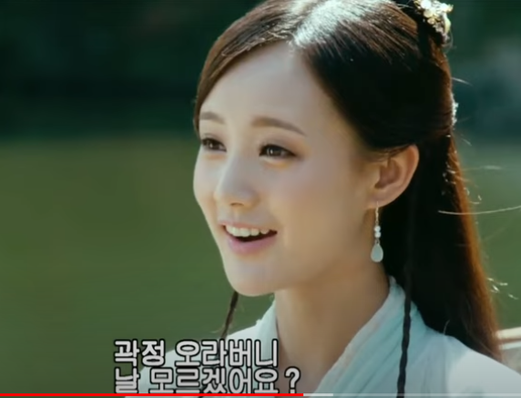

# [24 x n] 이제라도 어떻게 살 것인가, 알려줘도 어차피 아무도 안 따라하는 절대 비기 - 역사 통계적으로 검증된 잘 사는 법 (2022)

## CWK Classics - NCWKV0065 - Slow and Steady

**영상링크 : https://youtu.be/rhEgxLB8Ohc**

### 1. Introduction - 그림 그리기 재개

- 요즘 새벽에 그림을 그리고 있다.

- 빅뱅 Preset 1을 갈아엎고 잠깐 멈췄다가 다시 그림을 그리기 시작해서 어제 *사조영웅전* 목염자를 그렸다.

- 몇 달 쉬어서 그림 그리는 감이 떨어졌을 것 같아서 어느 정도 잃었는지 확인해볼겸 그렸다. 요즘 관심 갖게 된 *사조영웅전*을 그리고 있다.

- 김용 작가의 3부작 : **사조영웅전*, 신조협려, 의천도룡기*들을 읽을 계획인데 그냥 읽는 것보다는 상상도 하고 그림으로 옮겨보면 좋을 것 같아서 해보려고 한다.

- 눈으로 보는 것이 영감을 얻기에는 소설보다 좋다. 두 매체를 비교해보면 장단점이 있다. 소설로 읽으면 상상을 할 수 있겠지.

- *대부*  소설을 생각해보자. 소설이 영화보다 백만배 정도 재미있지만, 영화도 나름대로 장점이 있다. 그런데 영화를 먼저 본 사람들은 소설을 읽어도 대부는 말론 브란도, 마이클 꼴레오네는 알 파치노로 고정이 돼서 읽힐 것. 김용 작가의 소설들 역시 마찬가지로 드라마부터 보면 소설을 읽더라도 배역들이 배우로 고정되는 느낌을 받을 것

- 제가 그리기 위해 참고하는 *사조영웅전*은 2017년 버전이다. 여러 버전이 있지만, 최근의 버전은 최신이긴 해도 특유의 유치함이 있다. 그래도 캐릭터의 매력들이 느껴져서 참 좋다. 외모도 훌륭하고. 그래서 그림을 그리고 공부하는 사람들에게 도움이 된다. 

- 외모가 훌륭한 사람을 그리는 것이 그림 공부에 도움이 되는 이유는, 완벽한 동그라미도 못그리는데 일부러 찌그러진 원도 못그리는 원리는 생각해보면 된다. 예쁘고 잘생긴 사람들을 그리는 것에 이유가 있다.

- 그리고 드라마, 영화에 일반인 외모가 나오면 공감이 될까? 즉, 과연 러브 스토리를 일반인 외모로 등장시키면 공감이 될까? 일반인들은 서로 콩깍지라 사랑하는 것이잖아. 그런데 제3자 입장에선 갸우뚱 할 수 있거든🤣 ex) "내 머리 속의 지우개"에 일반인들이 등장하면 그 비극적 상황에 공감하는 정도가 적어지겠지

    > 예전에 '그들이 사는 세상'이라는 드라마를 본 적이 있는데, 드라마 PD들의 이야기를 다룬 드라마입니다. 거기서 이런 내용이 나옵니다. '대중들은 작품성 좋은 드라마 좋다고 떠들면서 오히려 많이들 보는건 유치찬란한 것들'이라고. '떠나보낸 사랑에 대한 후회가 크게 밀려와 찾으러 가는데 택시가 너무 안잡혀서 못가는 상황'을 그대로 드라마로 만들면 어느 누가 보고 싶겠냐고. 드라마와 영화는 현실의 투영이라지만, 적절한 생략이나 강조 없이 그대로를 옮겨놓으면 정말 아무도 안볼겁니다.

- 비율 나쁜 사람을 비슷하게 그리기는 것이 반대의 경우보다 훨씬 어렵다. 원을 의도적으로 찌그러뜨리며 그리기가 얼마나 어려운가?

- 그림에 대한 동기 부여 차원이든, 공부 차원이든 제가 미남미녀를 그리는 이유

### 2. 장기 이동평균선과 객체지향

- 본격적으로 그리기 시작한지 7-8개월 정도 됐다. 빅뱅 preset 1에서도 나름대로 발전 단계를 보여드렸는데, 그래도 "우상향하는구나"라는 생각이 든다. 계단식 상승. 운동 역시 마찬가지. Plateau가 오긴 한다. 그런데 그 Plateau를 넘어가면서 성장하는 것.

- 자전거 배우기를 생각해봐라. '안넘어지는 단계' 정도 오면 그 다음부터는 잘 넘어지지도 않는다. 외국어 배우기 역시 마찬가지. 일정 수준까지는 해놓는 것이 중요하다. 그 전에 관둬버리면 처음부터 다시 해야한다. "대두족장이 중국어를 다시 공부하는 이유" 영상. 이것 역시 ***객체지향***적으로 생각해볼 수 있다. 오랜세월 장기이평선을 만드는 것이 중요하다.

    > "모든 배움"을 객체로 삼아 객체지향적으로 생각해보면 하나의 공통분모를 끄집어낼 수 있을텐데, 그 중 하나를 "장기이평선 원리"라는 말씀으로 이해했습니다. 처음부터 자전거를 잘타고, 그림을 잘 그리는 사람이 있을 수 있습니다. 우리는 그런 사람을 "천재"라고 부릅니다. 하지만 우리는 천재가 아닙니다. 한두분야에서는 뛰어날 수 있겠지만, 극히 뛰어나기는 너무 힘듭니다. 그리고 그런 한두분야의 천재 역시 다른 분야에서는 천재가 아니기 마련입니다. 뛰어나지 않은 분야에서는 어김없이 "장기이평선"의 원리가 적용됩니다. 한두번 잠깐 하는 경우와, 지속적으로 꾸준히, 무던히 하는 경우의 장기이평선의 기울기, 길이는 완전히 다릅니다. 그리고 한두번 잠깐했을 때 재능을 보인 사람이라 하더라도, 지속적으로 꾸준히, 무던히 하는 사람의 장기이평선과 비교해보면 큰 차이가 있을 것이라는 내용이 아닐까 합니다.

- 모든 분야가 마찬가지. 기타를 배우는 것도 같다. 계속 까먹고, 매번 틀린다. 오래 안 치다가 돌아오면 "계속 틀리던" 장기 평균으로 돌아가게 된다. 올바르게 치려고 잠깐 교정을 하더라도 계속 하지 않으면 **"틀리게 쳤던"** 장기 평균을 이기지 못한다. 그래서 장기 평균을 **올바르게 치는 쪽**으로 옮겨가는 것이 중요하다.

- 제가 처음에 그런 패턴이 있다는 사실을 알고 익히고 나서, 무던히(성실히, Slow and Steady) 해보니까 바로 그게 지름길이더라. 내가 아무리 다른 지름길을 찾았고 잠깐 빨리 가는 것 같아도, 그 이전의 장기 평균을 못 이기더라. 급하게 수정하고 급하게 뭔가 꼼수로 배운 것은 장기적으로는 그 효과가 사라지더라.

- 그림 역시 마찬가지. 제가 정공법이 아닌 요령(꼼수)으로 그렸더니 약간 비주얼적으로 좋아보이기는 했지만 전체적인 품질까지 좋아진건 아니더라. 

- 살면서 다른 분야도 마찬가지더라라는 거지. 말, 외국어, 기타, 테크놀로지, 음향, 영상, 사진 등등 모든 분야가 전부 같다. 저는 그림이 새로 도전하는 분야지만 역시 그 단계를 거치고 있더라. 운동 할 때도 마찬가지였어. Hero's Journey라는 Template을 벗어나지 않는다. 결국 장기적으로 꼼수를 부리지 않고, Plateau를 만나면 넘어가면서 성장하는 패턴이라는 거지.

- Slow and Steady를 실천하는게 가장 중요한데 왜 그렇게 어렵냐면, Plateau가 너무 길다고 느껴지기 때문인거지. 많은 분들이 드로잉을 시작할 때 얼굴로 시작하는데, 정말 어렵다. 저 역시 그랬다. 유치한 그림체, 어린 그림체로 나오는 기간이 너무 길더라. 그래서 많이들 포기하게 되는 것 같다.

    > 모든 분야에 Plateau가 존재한다는 말씀 참 공감하게 됩니다. **초심자의 행운**을 만나 초반에는 잠깐 재미가 있고, 호기심이 생기지만 여지없이 Plateau, 어려운 구간에 들어서게 되면 그 때부터 저를 포함한 많은 사람들의 반응이 확실히 나뉘는 것 같습니다. 역시 정규분포를 그려보면, 시작하는 사람이 5%, Plateau를 만나 포기하는 사람이 4%, 결국 완수하는 사람은 1%가 되는 이치가 아닐까 싶습니다. Plateau를 만날 때마다 포기해왔던 과거가 많이 떠오르네요. 성장 과정에서 Plateau는 어찌보면 당연한 과정인데도, 마치 장애물처럼 여기고 포기하는건 여전히 Hero's Joureny Template과 객체지향을 모른다는 반증입니다.

- 그냥 꾸준히 해서 여러가지 시도를 계속 하는 수 밖에 없다. 그래서 그렇게 했다. 그러다보니, '아 그림은, 2D 세상을 3D 세상으로 옮기는 뺑끼구나!'라는 깨닫게 되더라. 머리로만 아는게 아니라 손에서 나와야 한다. Muscle Memory로 익히는 것. 근육과 뼈의 구조 같은 것들이 손으로 나오면서 응용을 하기 시작한다.

- 턱만 생각해봐도 3D Line이기 때문에 한두개의 Line으로 표현될수가 없는 것. 처음에는 Line으로 그리다가, 명암으로 그리기 시작. 명암을 넣기 시작하면 완전히 다른 그림이 되더라. 그래도 스케치를 하면서 느낌이 오기 시작했다. '채색을 하면 이렇게 되겠구나'. 마치 회귀분석과 같다. range가 생기면서 예측이 가능해진다. 오차가 커지지 않게 되고. 

- 우상향하는 range를 생각해봐도, 각도는 정확히 알 수 없지만 그래도 대충 예상이 되잖아.

- 인체의 line 역시 마찬가지. 명암에 따라 range가 그려지고 그걸 관통하는 Line을 그리는 거지. 그걸 예측해가면서 Line을 그리는거지. 이게 되면 실력이 한단계 오른거라 볼 수 있겠지. 흥얼흥얼거리는걸 기타로 칠 수 있는 단계로 가야하는데 말야.

### 3. 그림 그리기와 인생

- 캐릭터 모작. 디테일한 것들은 생략하고, 얼굴에 집중한다. 

- 얼굴은 정말 어렵다. 비율이나 선이 아주 약간만 틀어져도 완전히 다른 사람이 된다. 특히 잘 아는 사람, 친구, 가족을 그릴 때는 그 얼굴을 잘 알고 있기 때문에 매우 어렵다.  

- 제가 그림 그리는 영상 올리면 어차피 아무도 안보겠지만, 저는 상관이 없다. 이렇게 올리는 플랫폼 하나 정도는 있어야, 아주 약간의 부담 정도는 느껴져야 하게 되니까. "매일 올리자"라는 걸 OCD에게 걸어버리면 생활이 망가져 버려서 그렇게는 안하고, "꾸준히"라는 살짝의 부담 정도를 느끼려고 한다.

- 저는 세상을 보는 눈을 넓히고, 호라이즌 확장을 위해 그림 공부를 하고 있다.

- 최근 보고 있는 그림 강의는 콜로소에서 보고 있다. 동급 최강을 지향해야지!

- 강의를 52개 수강신청했다!

- 온라인 강의들을 Reference, 도서관으로 생각한다. 52개의 언제든 찾아볼 수 있는 책으로 생각한다.

    > 족장님 성향을 알고는 있었고, 이 에피소드 역시 알고 있었지만 새삼 다시 들으니 감탄이 나오네요. 생각해보면 52개의 강의 중에 나에게 어떤 것이 요긴하고 필요한지 처음에는 알 수 없죠. 그 시점도 알 수가 없습니다. 그런데 돈을 생각하거나, '에이 필요할 때마다 수강하자'라는 생각을 하면, 결국 그 강의를 영영 만나지 않게 될 가능성이 높아집니다. 항상 돈보다는 배움, 경험의 기회를 우선시하는 자세는 정말 귀감이 됩니다.

- 넷플릭스의 The Gray Man에 출연하는 여자 주인공을 그리는데(남자 주인공을 안그리는 이유🤣), 사실 인체 해부학을 생각해보면 남자를 그리긴 해야한다.

- 배우는게 있으면 응용을 해보는 거다. 명암을 표현해보니까, 여러가지에 대해 이해도가 높아졌다는 생각이 들더라.

- 모작을 하더라도 너무 똑같이 그리지 않으려고 한다. 사진이나 포스터를 보고 그리는데, 사진이나 포스터 역시 의도를 갖고 만들어낸 것이다. 사실 실제 배우는 그렇게 생기지 않았을 것이라는 점을 걷어내고자 일부러 완벽히 똑같이 그리지는 않으려 한다. 

- 스스로 느낀다. "성장했구나", "발전했구나"

- 곧 김정기님도 콜로소에 나와서 강의를 하기 시작한다. 특히 투시로 유명하신 분.

    > 부끄러운 이야기지만, 저 역시 이 때 그림 그리기를 시작했었습니다. 콜로소 기초 강의들도 수강 신청을 하고, 듣기도 하고, Wacom 태블릿도 적지 않은 돈을 주고 구매했었죠. 한동안은 재미있게 했었는데, 저한테는 그림보다 급하게 배워야할 것들이 너무 많다는 생각이 들었습니다. 그리고 결정적으로 당시 급격한 발전을 이루던 Generate AI의 이미지 생성을 보고 완전히 중단해버렸네요. 먼지가 쌓여가던 Wacom에게 너무 미안해서, 저보다 절실하게 원할 새로운 주인을 만나게 해줘야겠다는 생각이 들었습니다. 그리고 그림을 너무 그리고 싶어하던 분에게 헐값에 넘겼습니다. 그 분은 제가 알고 지내던 사이는 아니었고, 당x 플랫폼에서 알게 되신 분이었는데 여자 대학생이셨습니다. 무료 나눔을 할까 하다가, 그 분 입장에서도 어느 정도는 가격을 지불하시는게 나름대로의 의미가 있을 것 같고, 여러 의구심을 갖고 양수 자체를 거절할까봐 정말 "헐값"을 받고 팔았습니다. 저에게 있는 것보다는 훨씬 좋게 쓰이고 있을 겁니다. 

- *사조영웅전*의 곽정이라는 인물. 착하고, 바른 녀석. 이태원클라스 주인공 같은 느낌. 머리가 둔해서 늦게 배운다. 열심히 무던히 한다. 홍칠공이라는 절대 고수를 만나 배운다. 그런데 곽정은 왜 그렇게 여복이 많냐!🤣 미인들이 많이 나오는데 전부 곽정을 좋아한다. 예전의 토지 드라마가 생각나더라. 웬 절세미인들이 다 남자 주인공을 다 좋아한다. 황용 같은 캐릭터는 남자라면 누구나 바람직한 동네에 꼭 있어야 할 여동생 같은, 절대무공의 한결같은 인물인데, 곽정을 좋아한다. 위험에 빠질 때마다 지켜주기까지 하는 인물이다.

    

- 제가 얼굴 그리기에 집중하고 있는데, 무협의 등장인물들은 하체 부분에서 펑퍼짐한 옷들을 입고 있는 경우가 많아서 인체가 잘 안드러나고, 삑사리가 잘 안난다. 도포자락 같은거 몇개 그려주면 가려진다🤣 그래서 조금은 편하다. 비율이 좋은 인물들이 많이 나오기도 해서 여러 면에서 무협 인물 그리기는 참 좋다.

- 지금 제가 그리는 결과물들이 그렇게 좋은 편은 아니지만, 그래도 저의 시작을 감안하는 분들이 칭찬을 해주기도 한다. 

- 저 스스로 느끼는건, '그래도 박스권에서 놀지는 않고 있구나'라는 것. 

- 인생을 회귀분석해보면, 기울기가 나오잖아. 무던하게, 성실하게, 착하게, 열심히 살다보면 빠르지는 않더라도, Slow and Steady, 결과물이 보이기 시작하더라. 고개를 쳐들고 가기는 하겠구나라는 생각. 다음번에는 기울기가 조금씩 올라가겠구나라는 생각.

- 회귀분석이 점 잇기잖아. 급하게 올라가면 S-Curve겠고, 천천히라도 올라가면 그게 바로 "성장"이잖아. 우상향. 단기적으로는 살짝 떨어질 수도 있겠지만, 장기적으로, Zoom-Out해서 보면 우상향하는 그래프가 나오는 거지. 성장, 발전, 발달, 진화의 의미가 이런거겠지

    > 안다고 생각한 내용이었지만, 정말 다시 느낍니다. 몰랐구나. 왜 그렇게 빨리, 대충 가고 싶어하는건지...

- 포토샵이나 클립 스튜디오로 그리는데, 포토샵에는 아직 그림 그리는 과정을 녹화할 수 있는 기능이 없다. 포토샵에서 스크린 캐스팅 기능을 활용할 수는 있겠지만, 그림을 그리다가 멈추고 다시 시작할 때마다 계속 스크린 캐스팅 기능을 끄고 켜야 한다. 포토샵이 그림을 그리기 위해 태어난 프로그램이 아니기 때문일 것. 포토샵에서만 가능한 편한 기능들이 있기는 하다. 특히 Font 집어넣는 경우. 원근법 사용할 때도, Clip Studio는 아직 어렵고 귀찮은 방법을 사용해야 한다.

### 4. 꾸준함, 무던함

- 제가 그림 그리기만 이야기하는 것이 아니라, 무던함에 대해 이야기하는 것. 

- 벌써 중복인데, 올해가 시작됐을 때 다들 나름대로 정신 무장을 했을 거시다. 저랑 비슷하게 시작한 분들이 있었다. 얼마나 무던하게 해오셨냐. 나태해질 때마다 무던하게 하는 사람을 보면서 뒷통수를 한 대씩 맞아야 한다.

- 같이 함께 시작한 사람들이 있는데 머리와 감각이 좋은 사람들은 삐댈 가능성이 있다. 사조영웅전의 곽정과 양강이 그렇다. 양강은 토끼였다. 욕심이 많고, 빨리 가려고 하고. 타고난 능력도 출중했다. 곽정은 아니었다. 둔했다. 그럼 장기적으로 누가 이길까? "장기적으로" 누가 이길까? 단기적으로는 곽정이 양강에게 얻어 터진다. 그래도 보면 누가 결국 이기게 될지 알 수 있다. ***분명한 Hero's Journey*** 의 역사패턴으로 검증되는 이야기다. 거북이. 곽정이 이길거다. 둔하지만 무던함으로 버티는 아이. 착하고, 바르게 살려고 노력하는 녀석.

- '둔하다'는 평은 어떤 의미인가? 단기 성과의 의미겠지. 그런데 절대 고수들이 보면 보이는 면모는 그런 것들이 아니다. 장기적으로는 사실상 정해져있는 결과 같은거지. 그래서 가르쳐 보는 것이고, 가르쳐 주고 싶은 것이겠지. 항용 18장을 배우고 있는 곽정.

- 양강은 누가봐도 어른들한테 밉보이는 아이다. 옛말에 "어른들에게 밉보이지 말라"는 말이 있다. 곽정은 그런 인물이 아니지. 단기적으로는 양강이 뛰어나 보여도 말이야. 양강의 사부가 봐도 양강은 인성이 개판이라는게 보였다.

- 곽정을 가르친 강남칠협과 양강을 가르친 구척이 대결을 한 것이었는데(누가 더 잘 가르치나), 결과를 볼 필요가 없더라는 거지. 절대 고수가 보면 안다는거지. 엔딩이 안봐도 비디오라는 것. 중간은 볼 필요도 없다. 

- 연초에 뭔가 마음을 먹고 시작해도 항상 작심삼일이었던 사람들은 스스로의 과거 패턴을 생각해봐라. 단기적으로는 열심히 하는 것 같아도, 중기쯤 와서 봤을 때 connect the dot을 했을 때, 몇 분이나 계속 이을 수 있는가? 끊어졌다면 지금이라도 다시 이으면 되잖아. 

- 각오는 사라진지 오래고, 인생 뭐있어를 외치면서 살고 있는가. 그렇게 살면 엔딩 포인트 자체가 없어진다. 선을 이으려 해도 이을 수가 없다. 대부분이 그럴 것.

    > 이 역시 정규분포의 세상이기 때문일 겁니다.

- 제가 잘 못 그리는 그림을 계속 올리는 이유는 두가지

1. 나에게 부담을 주면서 계속 그리려고.
2. 조금씩 발전하는 모습을 보면 느끼는 사람들이 있을 것이거든. 그걸 같이 고민해보자는거지.

- dot, dot, dot, dot, dot을 보면 보인다.

- 그 사람이 어떻게 사는지를 알려면 그걸 보면 되잖아. Sampling이다. 인생 Sampling. 주기적으로 Sampling을 해봐. 그것 하나만 봐도 그 사람의 인생을 알 수 있다.

- 당신은 곽정의 엔딩인가 양강의 엔딩인가.

- 계속 이어간다면 Hero's Journey를 완수하는 곽정의 엔딩이겠지.

- 난 태생적으로 음악을 못하고 예술을 못하지만, 저의 무기가 있다. 바로 꾸준함, 무던함이다.

- *사조영웅전*을 영어로는, Shooting Condor 정도 될텐데 "새를 쏘는" 영웅. Little Hero 같은 의미인거지. Hero 같지 않은 hero. 곽정은 어떻게 보면 일반인보다도 떨어지는 애잖아. 평균보다도 떨어지는 사람. 그런데 그냥 무던히 하는 애인거야. 그래서 엔딩에 찍힐 포인트가 너무도 위대해보이는거야. 그래서 사조"영웅"전. 영웅 답지 않고 가장 비리비리해보이지만 영웅. Hero's Journey를 해내는 녀석. 그 사람의 인생 어느 때든 Sampling을 해봐도 나온다는 거지. 

- 올해도 절반 지났으니, 중간점검을 해봐야 한다. 주기적으로 Sampling을 해보면, 어떻게 살아왔는가, 어떻게 살아가야하는가를 알 수 있다. 이 역시 장기이평선을 생각해보자. 꾸준히 무던히 살아온 사람들은 기울기가 완만할테니 어렵지 않게 쭉 가면 되겠지만, 기울기가 그것보다 낮은 사람들은 목표가 저 위에 있다면 그것에 닿기 위해 도대체 얼마나 열심히 살아야겠는가. 세상 난이도, 인생 난이도가 어떻겠는가. 하루라도 빨리 깨닫는 것이 얼마나 중요한가. 

- 목표는 위로 보면서 나의 기울기, 나의 이평선은 아래로 꼴아박고 있다면, 어떻게 해야하겠나. 잘 생각해봐라. *사조영웅전*의 양강이 불행한 이유고, 곽정이 행복한 이유다.

- 곽정은 정말 왜 그렇게 복을 타고 났는가🤣 좋아할만한 애잖아. 이유가 있고. 바른 애잖아. 언제 Sampling을 해도 바른 애잖아. 그 시대에도 그렇게 드물었던거지. 희귀한 전설템. 

- 왜 그런 사람이 희귀할까. 블랙스완 출현 확률의 3승에 제가 도전하고 있다. 여러분 중에 그런 사람이 나오길 바란다. 있을까. 

    > 저도 무엇을 할 때든 항상 장기적으로 생각해야 한다는 말을 많이 해왔고 알고 있다고 생각했는데, 이 영상을 보면서 참 느낀게 많습니다. 왜 그렇게 빨리 가려다 넘어지고 조금 힘들면 포기하려 했는지... 지난 시간과 세월들이 너무 아깝습니다. 물론 늦었다고 생각할 때가 가장 빠른 법이겠죠. 족장님을 일찍 알게 되고 깨달으신 젊은 분들이 참 부럽다는 생각이 드네요. 그래도 이제부터라도 무던히, 꾸준히 해나가야겠습니다.