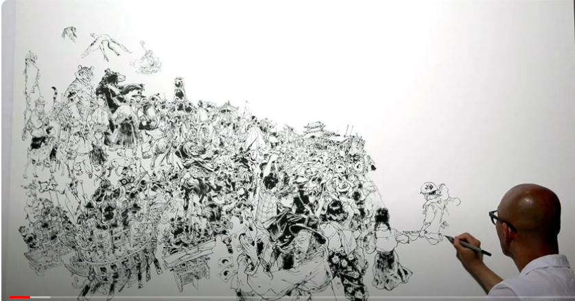
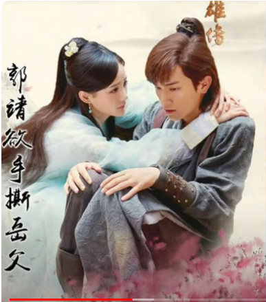
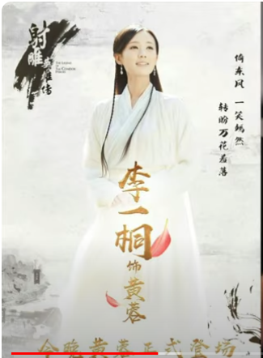
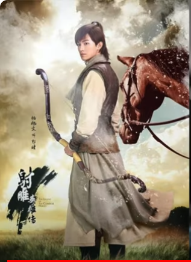
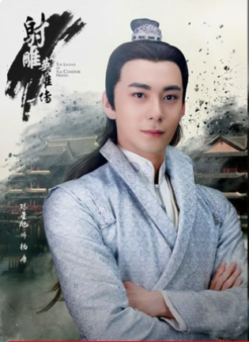
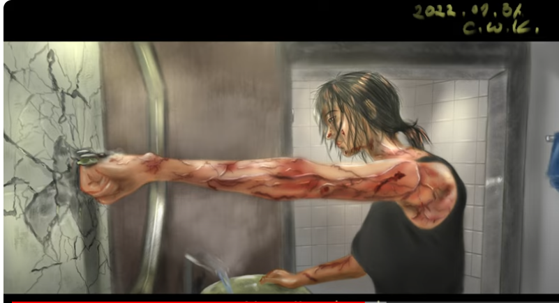
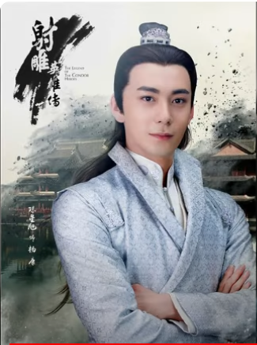
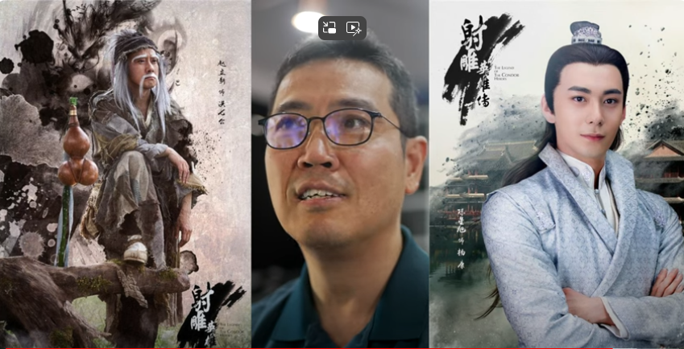

# [24 x n] 안 믿거나 믿기 싫거나 - 역사 통계적으로 검증된 잘못 사는 법 (2022)

## CWK Classics - NCWKV0079 - Hero's Journey, Act Like One

**영상링크 : https://youtu.be/zOsh9LfhgQE**

### 1. Introduction

- 콜로소에서 듣는 그림 강의도 듣고, 블렌더, 언리얼 엔진, 지브러시 등을 공부 차원에서 하고 있다.

- 강의 수강신청한 것이 54개가 됐다. 라이브러리 개념으로 활용한다.

- 나이 들수록 재미있는 것을 찾으면 열나게 해야 된다. 맛있는 것이 없어지듯 언제든 없어질 수 있다. 먹을 수 있을 때 챙겨 먹어야 한다.

    > 저만 해도 요즘 들어 그런 생각이 들기 시작하고 있습니다. 시간은 정말 빠르구나. 시간이 나를 기다려주지 않는구나. 어느새 이렇게 시간이 흘렀구나. 지나간 시간들이 아쉽지만, 여전히 엄청나게 많은 시간이 제 앞에 남아있다는 사실을 잊지 말아야겠습니다.

- 우리나라의 그림 대가이신 김정기라는 분이 계신다. "라이브 드로잉"으로 외국에서도 유명하다. 굉장히 큰 캔버스의 구석에서 시작해서 그림을 완성하는데, 하나의 큰 투시 그림을 그린다. 1,000명이 전장에서 싸우는걸 한 방에 그리시는 분이다. 콜로소에서 강의를 하시는 분들 중에도 가장 연배가 있으신 분일 거다. 김락희, 석정현 작가들도 스승이라고 하시는 분이니까(Sifu!). 아주 포스가 있으신 분이다. 절대 무공. 그런 절대 무공의 대가가 강의를 시작하셨으니 들어봐야지.

    

- 그런데 그 강의를 제가 너무 초반부터 들었으면 공감을 못했을 거다. 그런데 이제 열나게 터져보고 데여보니까, 그 과정을 거치고 나서 보니까 처음 그냥 봤다면 재미없어서 안봤을 수도 있는 것들이 보인다. '그림이란걸 이렇게도 볼 수 있구나' 싶다. 

    > 지금 이 영상은 제가 봤던 기억이 납니다. 그리 오래되지 않았기도 했고, 집중을 많이 해서 봤던 것 같아요. 그런데, 지금 다시 보니까, 느끼는게 참 많습니다. '내가 안다고 생각했었는데, 그게 아니었구나', '그동안 이렇게 저렇게 데여보고 다쳐보고 맞아보니까 내가 그 때는 몰랐던 내용이구나', '한참 후에 지나서 영상을 다시 봐도 또 그렇게 생각하겠구나' 라는 생각이 들어요. 나중에 지금을 돌이켜볼 때도 마찬가지겠죠. '그 때도 여전히 몰랐구나'

- 절대 무공을 배우러 간다고 해서 곧바로 그런 절대 무공을 배울 수 있는게 아니다. 사조영웅전, 신조협려, 의천도룡기 등을 봐도 알 수 있듯이 배우고 싶다고 해서 배울 수가 없고, 때가 있다. 저 역시 때가 있었던 것이라고 봐야지. 김정기님 강의를 듣는데 요즘 너무 재미있더라. 

    > 저마다의 때가 다를 뿐, 각자 때가 있다는 말은 참 공감하게 됩니다. 아무린 좋은 글귀, 아무리 좋은 문장, 아무리 좋은 교훈이 있어도 스스로 받아들일 준비나 능력이 안되어 있다면 결코 들어오지 않잖아요. 아는 것 같고, 알고 있는 것이라 생각했던 것들을 한참 시간이 지나 '그 때 그게 그 말이었구나' 싶은 때가 있구요.

- SNS에 보는 것처럼 화려하진 않고, 슥슥 그리시는데 정말 대가의 포스가 느껴진다. 강의에서 학교 이야기를 하시는데, 옛날 선생님들은 쓰레빠를 신고, 발가락 양말을 신고 오셨다는 이야기를 하는데, 저의 시대와 비슷한 이야기잖아. "탐구생활" 이야기를 하더라🤣 

- "문교부"에서 어느날 방학숙제를 탐구생활로 바꿨다. 그 계기는 잘 모르겠지만 갑작스런 Quantum Jump였다. 아이들의 정신세계에서도 이해가 안되는 책이 탐구생활이었다. 방학 때 숙제를 하지 말라는 취지였다. '숙제 시키지 말고 탐구 생활 하도록 하라는 것'. 

- (김정기님이)"탐구생활" 이야기를 하는 거면, 제가 3-4학년 때 탐구생활이 들어왔으니까, 그 분의 연배가 그 이전은 아니고 그 이후라는 거다. 그 생각이 들자 쎄한 느낌이 들더라. 저보다 연배가 있어 보이셨는데 말야. 손병호 게임을 해보면, '3-4학년 이후로 접어' 인데 말야. 나랑 같은 연배일 수 있는 것이고, 많으셔도 나보다 그렇게 나이가 많지 않으시다는 거잖아. 그래서 무심코 김정기님의 연배를 찾아봤는데, 75년생이시더라🤣 저보다 굉장히 젊으시더라. 땡~ 하는 느낌을 받았다. 제가 그 정도로 늙었다는 사실을 스스로 잊고 살고 있었다는 의미. "센세", "쉬푸" 느낌인데, 저보다 7-8년 어리신 것이더라고. 

- 제가 그 정도로 늙었습니다. 그런데, 저는 열심히 공부하고 있습니다. 사조영웅전의 곽정처럼, "무공을 왜 배워야 하는지도 모르고" 무던히 하는거죠.

### 2. 곽정과 무던함

- (사조영웅전의 주인공) 곽정이 운이 굉장히 좋다. 중고등학교 때 배웠던 "전기 소설의 우연성"이 굉장히 심한 것이 김용 소설이다. 중국이 굉장히 넓은 곳일텐데, 마치 한동네처럼 주요 인물들을 우연히 계속 만나는 식이다. 강호의 호걸들이 좁은 곳에서 우연히 계속 마주친다. 

- 사조영웅전의 진정한 교훈은, "반려자를 잘 만나야 한다"는 것이라고 생각한다🤣

    

- 황용이라는 처자, 절세미인인데 그 아둔한 곽정을 좋아한다. 곽정은 아둔하지만 전설템이지. 무던하고 바르고 착한. 황용이 곽정을 발견하고서는 죽고 못 산다. 그 넓은 중국 땅에서 단 한명을 발견한거지. 그 무던하고 바른, 미래가 보이는 젊은이를 발견한거지. 정말 아무한테도 안 뺏기려고 끝까지 목숨을 던져가며 지켜준다. 

    

- 저런 절세미인에 엄청나게 똑똑한 여인이 황용인데, 정말 끝까지 곽정의 곁을 지켜준다. 곽정의 삶을 샘플링을 해봤더니 어떻게 엔딩을 가져갈지 보이는 거지. 

- 곽정은 운이 좋다. 왜일까? 바르게 살아서겠지. 

- "어른들에게 밉보이지 말라"는 말 다시 생각해봐라. 어른들은 경험치가 많기 때문에 잘 알아본다. 관상도 잘보고. 관상은 통계의 과학이니까. 쳐다보면 대충 눈치를 깔 수 있다. 검정하기 위해 테스트도 해보고 겪어보고. 파악이 된다. 절대무공 강자라면 어떻겠는가. 더 잘보이지. 동서남북의 절대 강자들이고, 모든 산전수전을 겪었다. 그 중 한 둘이 villain이긴 하지만, 그런 빌런들 마저도 곽정은 인정한다. "바른 녀석". 

    > 아마 족장님께서도 따른다는 여러 사람들의 면모들, 언행들 하나만 봐도 열을 알 수 있을 겁니다. 저 포함 여러 사람들은 모를거라 생각하고 이런 말 이런 행동들을 슬며시 하지만, 다 알아보시겠죠. 일반적인 어른들보다도 족장님은 더 잘 알아보실 겁니다. 이 시점부터는 영상을 보는데 정말 뼈를 맞는 느낌이 들었습니다. 제 언행들이 하나씩 계속 떠올랐습니다. 아는 척, 하는 척했던 것들이요. 아마 다 알아보셨을 겁니다.

- 황용의 아버지인 동사(동쪽의 사악한 인간) 황약사도 곽정을 인정한다. 결국 인정하고서 혼인을 승낙하는 스토리. 그야말로 모두에게 인정받는 존재가 곽정. 홍칠공이 북쪽의 절대강자일텐데, 제자를 안키우는 사람이지만 곽정을 보고 워낙 전설템이다보니 조금 겪어보고 '무공을 전수해줘도 될 것 같다'는 생각이 들었을 것. 무공을 전수해줄지 말지 고민 중이었는데, 황용은 자신의 특기인 요리를 살려 홍칠공의 식탐을 공략했던 것. 그러면서 비법을 하나씩 전수를 받는다. 

- 물론, 결국 애들이 착했기 때문에 전수를 해준 거겠지. '쟤는 해줘도 되겠다'라는 생각이 들었을 것이고, 예뻐 보였겠지. 

- 어른들이 아이를 볼 때 괜찮아 보이면 그 느낌은 확실히 티가 난다. 영향력이 있는 어른이 안좋게 본다면, 그것 역시 확실히 티가 날텐데 그 때는 인생 잘 못 살고 있는지 스스로의 인생을 돌아봐야 한다. 그리고 그런 분의 인정을 계속 받는다면 잘 살고 있는 것이라고 봐야겠지. 황약사, 홍칠공 이런 사람들의 인정을 받는다고 생각해봐. 무공을 전수를 원래 아무한테나 안해주는 사람들일 정도로 깐깐하다. 그런 사람들이 인정하는게 곽정이었어.

- 저 역시 마찬가지. 제가 절대고수라는 말이 아니라, 저도 뭔가를 전수해주고 싶은 마음이 드는 존재를 $블랙스완^3$의 확률이라고 하는데 그런 존재가 발견되면 이뻐보이고 뭔가를 해주고 싶은 마음이 들 것이다. 외모가 이쁘다거나 그런게 아니라, 하는 짓이 이뻐 보인다는 거지. 자식 예쁜 것과는 조금 다르다. 특히 예쁜 애들이 있다. Teacher's pet 이 되기 위해 아양을 떠는게 아니라, 곽정같은 친구, 이태원 클라스 주인공 같은 친구. 물론 선생님도 바른 사람이어야겠지. 다른 불순한 의도가 없는 선생님을 기준으로. 순수한 어른의 입장에서 봤을 때 예쁜 친구들이 있다. 

### 3. Creator의 의도와 '어떻게 살 것인가.'

- 주변에서 곽정에게 계속 운이 좋다고 하는데, 왜 운이 좋을까? 왜일까? 그게 김용의 의도거든. 김용이라는 Creator가 애초에 의도를 하고 곽정이라는 캐릭터를 만든 거잖아. 곽정과 양강이 똑같이 출발을 했잖아. 양강이 조금 더 좋은 출발이었지. 그런데 끝까지 안봐도 결말을 알 수 있다. 양강 같은 친구는 결국 깨우치지 못한다. 정해진 Template. 갑자기 개과천선할리가 없거든. Creator의 의도인거지. 반면교사로 삼아라. 양강은 무던하지 않은, 토끼 캐릭터지. 

- 김용은 말한 거지. 곽정을 보고 배우라는 것. 

    > 아마 사조영웅전이 만화로도 있는 것으로 기억합니다. 제가 고등학교 때 언뜻 읽었던 기억이 있거든요. 그런데, 그 때는 이런 의미를 알리가 없었고, 그저 무협 만화로만 여기고 봤습니다. 끝까지 다 읽지도 못했던 것 같은데. 어쨋든 스토리를 보면서 대충은 감을 잡을 수는 있는 것 같습니다. 뭘 보든. '아 얘가 주인공, 착한 애', '아 얘는 잘났지만 나쁜 애'. 그 어린 나이에도 그런게 보이긴 합니다. 나쁜 애가 잘 나가게되면 '쟤 저러다 망할 것 같다' 이런 느낌. 그런데도 현실의 삶으로 올 때는 다시 경계를 세우고 적용을 안합니다. 

- 여러분들이 소설을 쓴다고 생각해봐. Template으로 캐릭터를, Protagonist를 찍어낸다고 생각해봐. 처음부터 잘난 캐릭터가 끝까지 가는건 재미없잖아. 일부러 아둔한 캐릭터를 만드는 거지. 목숨도 위태롭게 만들고. Hero's Journey를 겪도록 만드는 거지. 옆에서 도와주는 Herald들이 등장하고, Threshold를 넘을 때마다 Herald들이 등장한다. 얘가 의문을 품을 때마다 홍칠공 같은 사람들이 톡톡 쳐주면서 도와준다.

- 양강은 토끼다. 나중엔 운도 좋아서 왕자처럼 살았다. 그럼에도 욕심만 많고, 어떻게든 절대 무공을 빨리 취하려고 절대 강자들을 엄청 쫓아 다닌다. Teacher's pet이 되려고 안간힘을 쓰는 거지. 그럼에도 절대 고수들은 눈치를 채는 거지. "쟤는 싹수가~"라는 말을 하지.

    > 절대 고수들일 수록 정말 잘 보일 겁니다.

- 그런 싹수가 노란 사람들이 많이 보인다. 특히 여러분들 대다수가 배우고자 하는 것들, 특히 투자에 관련된 것들에 관해서는 정말 싹수가 노란 분들이 많이 보인다. 

    > 투자의 속성 때문이기도 하겠지만, 남자 특유의 중 2병 때문인게 훨씬 크겠죠. 저 역시 그랬구요.

- 제가 최근에 계속 그림만 그리고 있다. 빅뱅 preset 2로 오니까 이전에 그런 것들을 바라고 오신 분들은 90% 이상이 빠져 나갔다. 그 분들은 아마 열나게 깨지고 있을 것. 

- 그분들이 때가 안됐다는 걸 제가 아는 겁니다. 곽정을 가르치는 홍칠공 같은 사람들이 그런걸 모르겠냐. 본인들도 아픔이 있거든. 다 겪어본 것이겠고, 홍칠공, 황약사, 구양봉 역시 성장이라는 걸 하면서 반드시 부침을 겪어봤을 것이다. 그래서 다 보이는 것. 

- 저 역시 투자 분야에 있어서는 경험치가 보이는 거지. 여러분들의 행동들이 보이는 거야. 회귀분석을 하면 보이는 거야. 마음만 졸라 급한 사람들. 그런 사람들은 양강처럼 정말 박살이 나고 심신이 피폐해질 거다. 가족들도 불행해지겠지. 왜? 투자는 가족지대사잖아. 99%의 신뢰 수준에서 확실하다. 

- 이런걸 여러분들도 다 알텐데, 그럼에도 실천을 안하는 것이 신기하다. 

- 사조영웅전은 김용이 1950년대에 쓴 소설이다. 물론 정서는 예전의 것이지만. 주의해야할 것이 예전의 작품들을 요즘의 정서로 평가하는 것. 전기소설의 우연성 같은 것들을 요즘 잣대로 탓을 하면 오류가 있는 것. 그 때 가치관으로는, 마음에 안들면 그냥 죽이기도 했다. 절세미인 황용이 가장 많이 하는 말이 "죽여버릴까"다🤣 화근을 만들면 안된다는 맥락에서도 그냥 죽여버리기도 했다. 그 때의 가치관으로 이해해줘야 하는거지.

- 제가 징기스칸이나 나폴레옹을 안좋아하는 것 역시 요즘의 가치관이지. 그런데 그 때를 기준으로 봐도 그들은 욕심이 과했다. 그럼에도 요즘 가치관으로도 좋게 보는 경우들이 있더라. 

- 어쨌든, 인류 역사가 Hero's Journey Template을 안 벗어나더라는거야. 김용이라는 분이 1950년에 쓴 소설이 3부작이고, 남송 시대의 이야기인데도 한국은 고려인데도. 그 시절을 감안해서 쓴 것일텐데도 Hero's Journey, Hercules Template을 안 벗어나더라는거야.

- 모범답안이 있다는 것. 작가들이 그런 모범답안을 계속 가져다 쓰는 거지. 모범답안이 공개가 되고, 알려지고 하는데도 사람들은 애써 무시하는 거지.

- Hercules, 홍길동 스토리를 아는 사람들도 그렇고, 스타워즈든 뭐든 단 하나의 Hero's journey라도 아는 사람은 무조건 있을텐데. 아니, 자기 인생을 돌아봐도 그럴거야. 자신의 삶이 Hero's journey에서 얼마나 벗어나 있는지에 대한 감은 있을거야. "저게 맞는 걸텐데"라는 생각들 들거 아냐. 그런데도 곽정의 삶은 재미가 없잖아. 과연 누가 곽정의 삶을 살겠다고 나서겠어. 몇명이나.

    

    > 어쩌면 겉으로는 '잘살고 있다'고 외치지만, 스스로가 그 누구보다 잘 알고 있을 거에요. 저 역시도 본능적으로 압니다. 내가 얼마나 엇나가 있는지, 얼마나 이탈해있는지. 그래도 그냥 인정하지 않는 거죠. 그러다 크게 깨지고 터진 후에 타의로 돌아오게 됩니다.

- 양강의 삶이 훨씬 화려해보이고, 왕자의 삶이고. 거지의 삶보다는 낫다는 느낌일거 아냐. 인생 뭐 있어? 잠깐이라도 양강의 삶을 살자. 그리고 '난 저기서 딱 멈출 수 있어'라고 생각하는 거지. 소위 짱구를 굴리는 거지. 

    

- 그럼에도 여러분들에게 삘은 있을 것. 차선이 쫙 뻗어있고 그 차선을 따라가면 되겠다라는 삘은 있을 것. 그런데도 자꾸 끼어들기를 하고 싶은 거지. 저 쪽으로 가면 좀 빠르지 않을까. 새어 나가봤다가 피떡이 되고, 그렇게 또 가다보면 또 새어나가고. 반복되는 거지.

***인간은 오래 안맞아 보면 매 무서운 줄 모른다***

- 단면을 보면 양강 같은 삶이 있거든. 쟤는 샛길로 벗어난게 뻔한데, 그런데도 왜 잘사는거지? 쟤는 결국 피떡이 된다는걸 알면서도 긴가민가해지는거지. 잘사는 것처럼 보이니까. 그래서 살짝 따라가보기도 하는거지. 그걸 되풀이하는거야. 그것이 우리네 삶이라는거야. 

    > 스스로 바보 같이 느껴질 때가 있는 것 같습니다. 자신의 삶이니까 객관적으로 안보이고, 이렇게 해서 언제 가나. 언제 도착하나. 그런 생각 때문에 마음 급해지고 다른 길로 가는거죠. 그래도 알잖아요. 결국 아무것도 얻는게 없을거란걸.

- 제가 이런 썰을 왜 풀까? 여러분들이 공감한다고는 하면서도 실제로 그 길을 무던히도 가는 사람이 있을 확률이 $블랙스완^3$의 확률이라고. 제가 옆구리 찔러드리면 알 것 같아도 또 까먹잖아. 무던히 가야 하는 길이 맞다는걸 의심하게 되거든. 

    > 이 영상은 제가 분명히 봤는데도. 2년 만에 까먹었습니다!

- 그런데 생각해보면, 샛길로 빠지는 것도 의미가 있고 중요하다. 곽정도 의심한다. '내가 왜 무공을 배워야 하지?' 시련이 닥칠 때마다 짜증도 내고. 그런데 그 시련이 바로 Creator의 의도다. 

    

- 이게 전율해야 하는 힌트다. 김용이 곽정과 양강을 만들어서 밀고 간다. 작가들마다 스타일이 조금 다르긴 하지만, 김용 같은 작가는 아마 곽정이 이기는 Template을 정해놓고 썼을 거다. 스티븐 킹 같은 사람은 그냥 풀어놓고 '니들 어디까지 가는지 보자'라는 스타일일텐데, 그럼에도 마찬가지로 가는 길은 있을 거다. '역시 양강은 개판이네'로 흘러가는 거지. Creator가 공정한 기회를 줬다고 하더라도 곽정처럼 가는 애를 밀어주는 거지. 그렇게 돌아가야 하는 Universe를 만들어 놨을테니까. 

- 여러분 스스로도 Creator가 만든 캐릭터라고 생각해봐. 언뜻 보기에 양강이 주인공처럼 보일 수도 있잖아. 그런데 늘 곽정 같은 Little Big Hero들이 나중에는 주인공으로 부각이 되잖아. 그것이 진정한 Hero's Journey잖아. 오히려 평균보다 떨어지는 애였는데, 바른 정신을 가진 거북이니까, 상식을 가진 거북이고, 상식은 Creator의 의도잖아. 그렇게 터준 길을 따라가야지. Creator가 이 길로 가라는 삘이 오지 않는다면, 아직 시련을 덜 당한거다. 시련이 왔다면 '감사합니다'라고 해야지. 샛길로 갔던 나를 끌고 돌아와야지.

    > 조금 느린 것 같아도, 천천히 가는 것 같고, 바보 같아도 결국 그게 옳은 길이고 맞는 길이라는걸. 자꾸 되새겨야겠습니다. Hero's Journey를 벗어나는건 스스로 Outlier라고 생각하거나 Bug가 되겠다는 것이니까요.

- 저 역시 오래 안 맞아보거나, 새로운 분야에 도전하게 된다면 저조차 세태에 물들 때가 있다. 귀차니즘도 있고, 빨리 배우고 싶은 욕심도 있고. 그림이 그랬거든. 그렇게 하면 안된다는 걸 알고는 있었음에도. 

- 김정기님의 강의도 지금 봤으니 공감하는 것이겠지, 처음부터 봤다면 도움이 안된다고 생각해서 안봤을 것이라고. 지금 제가 뭘 하고 있냐면, 초반에 봤던 강의를 다시 보고 있다. 뭘 틀리는지를 이제 알고, 맞아보니까 아는 거지. Sifu들이 하던 말씀들이 이런 의미였구나 라는걸 맞아봐야 아는거지. '대두족장이 이거하라 저거하라, 이거 하지 마라 저거 하지 마라'라는 걸 말로만 들으면 아는 것 같지만, 맞아보면 그 때 아는 거지

    > 2년 동안 터지고 맞아보고 이 영상을 다시 보니 정말 느끼는게 많습니다. 물론 완전히 소화했다고 볼 수는 없겠지만, 분명한건 2년 전보다는 조금이라도 더 이해하게 되었다는 것이겠죠. 이렇게라도 다시 보게 되어서 정말 다행입니다.

- 여전히 동전 던지기하는 사람들이 많다. 그런 사람들이 저를 언급할 때 기분이 아주 안좋다. 제 의도는 전혀 그게 아닌데도, 저를 언급한다. 제시 리버모어의 삶을 사는 사람들인데도 '대두족장이 그러더라~'라고 하는거지. 그게 너무 기분이 안좋다. '그거 아닌데'. '덜 맞았구나'라고 하는거다. 그런 사람들이 너무 많다. 이 정도 맞았으면 알만한데, 돌아와야 하는데. 

    

- 저 역시 '왜 그렇게 안그려지지'라고 하는 건데, 맞아 봐야한다. 

- 외국어 왜 못한다고? 안틀리려고 그러니까. 틀려야 한다. 내가 틀리고, 부족한 부분 그런 것들을 자꾸 드러내는거야. 어떤 분야든. 코딩이든, 그림이든 뭐가 됐든 드러내는거야. 백만개쯤 드러냈어. 투자도 그렇고. 백만개쯤 내 허점이 드러나잖아? 그러면 그 구멍 백만개를 메우면 되는 거잖아. 그럼 천하무적이 되는거겠지. 텐샤우디. 물론 그렇게 갈 수는 없겠지만, 소실점을 향해서 갈 수 는 있겠네.

    > 저 역시 뭔가 아직 완성되지 않은 것 같고, 다듬어지지 않은 것을 드러낼 때는 정말 힘든 것 같습니다. 분명히 어딘가 틀려 있을 것이고, 잘못돼있을 것이고 부족하거든요. 그걸 남한테 보이는게 정말 쉽지 않더라구요. 그런데, 제가 몇번 해보니 확실히 그 효과가 다르더라구요. 왜 Open Source가 항상 이기는지, 백만분의 일 정도는 느낌이 왔어요. 그래서 이제는 그런 부분을 더 많이 드러내려고 노력하고 있습니다.

- 우상향하는게 보이는거잖아. 제 그림처럼, 잘 그린다는게 아니라 장기적으로는 '나아지고 있네'라는건 볼 수 있거든. 비교대상이 나니까. 내가 비교 대상인거잖아. 나의 어제와 오늘. 비결이랄게 없다. 그냥 구멍을 막아가는거잖아. 어제 부족했던 구멍을 애써서 막는 것. 그렇게 메우다 보면 뭉텅이로 구멍이 막힐 때가 있다. 예를 들어 얼굴 그릴 때 코 그리기가 저의 약점인데, 코만 집중적으로 그리다보니 구멍이 조금 막히더라고. 그러면서 얼굴을 그리는 것에 대한 (저의 옛날을 기준으로) 구멍이 많이 막혔다. 그럴 때 한단계 도약을하고 계단식 상승을 한다. 줌 아웃을 해서 보면 우상향하는거지. 

- 지금 또 Plateau가 왔다. 이런 시기에 맞아 보면서 알게 되고 과거로 돌아가는거지. 절대 무공의 사부들이 이야기했던 것들을 다시 보는거지. 이제는 스펀지처럼 흡수할 수 있는거지. 예전에는 나의 구멍이 뭔지를 몰랐지. 그 분들은 다 겪어 봐서 아는 것. 

    > 경험이라는 것은 얼마나 소중하고 중요한 것인가. 자신의 경험만큼, 경험의 폭만큼만 배울 수 있는 것 같습니다.

- 안 맞아보고, 매 무서운줄을 모르는데 어떻게 구멍이 뭔지를 알겠어. 맞아봐야 한다. 그게 경험이고 시련이다. Hero's Journey에 반드시 존재하는 구멍. 과거로 돌아가서 보면 조금씩 보인다. 

- 그래서 제가 54개 강의를 듣는거다. 구멍을 인지하면, 과거로 돌아가서 구멍에 대해 이야기했던 강의를 듣는거지. 

- 그런데 여러분들 공부를 어떻게 하시는지 생각해봐라. '돌려보지 마라'. 마음 자체가 빨리 빨리 배우고 싶다는거잖아. 

    > 그래도 제가 족장님 말 듣고 실천하는 것중에 하나가 '돌려보지 않기' 입니다. 그런데, 뭔가 궁금하거나 보고 싶은 영상이 생기면 신기하게도 어떻게 하면 빨리 볼 수 있는지부터 생각이 듭니다. 정말 신기하죠. 머리로는 알고 있고, 결국 돌려보지는 않긴 합니다. 그런데 어떻게 매번 그렇게 '빨리 볼 수 있는 방법'부터 생각이 드는 건지 너무 신기합니다. 평생 싸워야 할 것 같습니다.

- 성룡 영화 생각해보면, 성룡이 사부를 찾아갔는데, '오늘 당장 배우겠다'고 하는거지. 사부가 30-40년 폐관수련하고 면벽수도해서 얻은 무공을 딱 하루만에 얻겠다는 거지. 그런걸 보면 무슨 생각이 들어요? '싹수가 노란 놈이네.'라는 생각이 들거 아냐. Creator가 보기에도 그럴거다. 스티븐 킹의 마음으로 봐도 똑같겠지. '여전히 매무서운줄을 모르는 놈이네.'라는, 하룻강아지 범 무서운 줄 모른다는 생각이 들잖아. 

    > 생각해보면 정말 웃픈 이야기입니다. 누군가 제가 업으로 삼고 있는 일에 대해 단 하루만에 '너보다 잘 할 수 있어'라고 말한다면, 얼마나 웃길까요. 그런데, 제가 그래왔던 겁니다. 뭐가 됐든간에. 상대의 시간과 노력과 헌신을 Respect 하지 않는거죠. 아니 그냥 무시하는겁니다. 

- 그런데 대부분은 피떡이 되기 전에 양강의 삶을 살거든. 제시리버모어의 삶을 살거든. 그러다 끝난다. 개과천선하는 사례는 거의 없다. 개과천선을 한다는건 정말 어마무시하다는 거야. 그 정도는 블랙스완^10일 거다. 중간에 스스로 개과천선했다고 믿는 분들도 있을 거다. 그래도 끝까지 가봐야 안다. 양강도 중간에 개과천선하는듯 했거든. 그러다 다시 흑화된다. 그런데 저는 그럴 줄 알았다. 그런 Template이니까. 그렇게 살면 안된다는걸 알려주기 위해 김용이 만든 캐릭터다.

- 제시리버모어가 그런 캐릭터다. '저렇게 살면 안된다', '저렇게 살지 마라'라는걸 보여주기 위해 만든 캐릭터다. 이런 개념은 못해도 20대 때에는 감이 와야 하고, 30대에는 짜릿해야 하고, 40대는 불혹이잖아. 그 때쯤이면 Creator가 바라는게 이런거였어 라고 삘이 와야지. 블랙스완^3의 확률이야. 삘이 확 와서 평생 살 수 있는 사람이 몇이나 되겠어.

- 제가 매일 보여드리고 있다. 그림 그리는 행위로 보여드린다. 

- 제가 이런 잔소리라도 조금 해야 들으려는 분이 계신다. 느낌적 삘링은 그거지. 홍칠공이 항용 18장을 전수해주려고 하나보다. 절대무공. 그래서 그 초식을 5분만에 들어보려고 하는거지. 그러면서 막 돌려본다. 그렇게는 못한다. 알려줘도 못한다. 제가 지금 알려주고 있다. 태권도 품새 같은 거잖아. 품새 흉내내서 싸워서 이길 수 있어? 싸워봐야지. 힘이 들어가야지. 그 힘을 조절할 수 있어야지. 

- 품새 배우는데 반나절이면 되잖아. 한달쯤 지나서 어머님들 모시고 보여드리고 그랬던게 군대였는데, 한달 정도 지나면 자세가 나오잖아. 그게 정상이잖아. 그런데 5분만에 배우겠다고? 그리고 전장에 나가 싸워서 이기겠다고? 그런 사람들이 많다. 그리고는 무던히 하는 사람들을 비웃는다. '뭐하러 저렇게 살지'라고. 비웃잖아. 그런게 옳은 길로 보이면 왜 그렇게 안살아. 왜 그렇게 안사냐고. 자기가 더 낫다고 생각하는거지. 그 사람보다도. 여러분들이 항용 18장을 30년 동안 닦은 사람보다도 낫다고 생각하는거야. 

- 홍칠공이 몇십년간 수련한걸 5분만에 터득하겠다는거 아냐. 양강의 삶이잖아. 그럼 미래가 보여야지. 제가 이 영상 올리면 다들 고개 끄덕거리면서 보다가 며칠 지나면 또 양강의 삶을 살거다. 응. 그래서 블랙스완의 확률이라는거다.

- 여러분들이 그런 태도를 보일 때 어떤 생각인거냐면 '내가 너보다 나아'라는 거거든. 결국은 자기가 천하제일인거야. 누굴봐도 우습게 보이는거야. 당신이 10-20년 걸쳐서 배운 무공을 나는 낼름 먹을 수 있어. 너가 바보짓하는거야. 뭐하러 그렇게 무던히 살아? 라고 생각하는거잖아. 그런게 아니면 왜 안 따라하냐고. 곽정 같은 아둔한 친구라도 될 때까지 오래 수련하면 되잖아. 무조건 해선 안되고, '오래' '잘' 해야지. 아전인수하고 곡해하지 말고. 될 때까지 열심히 무던히 잘한다는 의미야. 그 답은 나와있다고. 

    > 이 분명한게 왜 안보였던걸까요. 시간이 아깝고, 빨리 이루고 싶고, 빨리 만들고 싶고. 그런데 그걸 이뤄낸 사람들도 바보가 아닙니다. 헌신하고 노력해서 earn한 건데, 그걸 이렇게저렇게 얼렁뚱땅 얻으려고 하는거죠. 얼마나 욕심이 뚱뚱한건지.

- 그런데도 '너보다 잘났으니까', '천하제일이니까'라는 생각을 하는거잖아. 

    

- 절대무공의 홍칠공보다, 항용 18장을, 너가 10년 걸렸다면 난 1년만에 할 수 있고, 너가 1년 걸렸다면 난 1개월만에 할 수 있고. 너가 하루 걸렸으면 난 10분만에 할 수 있어라고 빨리 배우려고만 하지. 그렇게 해서 체득이 되겠어? 

- 급하게 먹으면 체하잖아. 그거 모르는 사람 있어? 고개를 끄덕거리면서 이 내용도 보겠지. 요즘에 많이 맞아 본 분들도 그럴거 아냐. 그런데 뭐가 달라져? 안 달라지잖아. 원점으로 돌아오잖아. 매를 맞았을 때, 아플 때만 Leaking하듯 그 때만 듣는 척하는거잖아. 덜아프다 싶으면 또 옛날로 돌아오는거잖아.

- 그런 캐릭터를 누가 만든다고? Creator. 어떤 의도로? 반면교사로. **왜 그런 캐릭터로 사는거야**. 자기도 스스로 안다고. 그러면서도 그런 캐릭터로 사는거야. '난 양강처럼 사는구나', '제시리버모어처럼 사는구나'. '그 Model로 사는구나'. 여전하죠. 

- 부질없는 소리입니다. 그거 다 아는데도, 왜냐면 10년 넘게 했거든. 그런데도 오늘 김정기님을 항용 18장을 가르쳐주실 김정기님을 뵀는데 저보다 나이가 어리셔서🤣 그럼에도 Sifu고 라오쉬고, 센세시다. 전 꾸준히 배울겁니다. 그간에도, 그림 이전에도, 투자도 마찬가지이고, 외국어도 마찬가지이고, 코딩도 그렇고. 컴퓨팅, 디지털도 그렇고 어떤 분야든 상속성을 가져오는 거거든요. 무던히 하면 된다. 하면 된다. 어떻게? 열심히 잘할 때까지. 내 구멍을 막아가면서. 

- 구멍을 알아야하니까 무던히 맞아야지. 쪽팔리지만. 빈정대는 분들도 계시거든. 저딴걸 왜 올리냐고. 구멍을 알아야되니까 올리는거거든. 그려보는거야. 쪽팔린게 어딨어. 쪽팔리니까 초식할거야? 자꾸 밖에 나와서 틀려봐야돼. 틀려봐야돼. 맞아봐야돼. 그래야 구멍이 보여. 구멍의 개수를 세는거야. 몇개나 막으면 될까. 다 막진 못하더라도. 절반, 또 절반, 또 절반으로 줄어드는 때가 온다. 빨리 막고 싶어? 졸라 열심히 해. 그런데 백만개를 하루에 막겠다는 생각을 하지는 말라는거지. 

- 대가들이 하루아침에 됐겠냐고. 짧아야 10년이라고. 김정기님이 그러시더라. 원하는대로 그림이 나올 때까지 10년 걸렸다고. 그런데 뭘 하든 빨랑빨랑 하려고. 그게 어떤 캐릭터라고? 반면교사 캐릭터라고. 그렇게 살고 계신 분들이 너무 많아요. 

- 그래서 한마디 해드리고 싶었다. $블랙스완^3$, $블랙스완 ^ 10$ 이라도 확률이니까 한명은 있을 수 있거든. 그 한명에게 던져드리고 싶은거거든. 그걸 또 내가 해야될 일이라고 생각하거든. 이런 짓을 한다고 Creator가 싫어하진 않을거 아냐. Creator의 이쁨을 받는 행동이겠지. 미움을 받는 행동은 아닐거 아냐.

- Crateor가 만든 세상이니까 그 의도가 느낌이 올거아냐. 그걸 알아야지. 

    > 느리게 배우고, 착실히 배우고, 성실히 배우면서 진실된 노력을 해야겠습니다. 제발 좀 까먹지 말기를. 이 프로젝트를 시작하길 잘했습니다. 나중에 생각나면, 언제든 찾아볼 수 있잖아요. 감사합니다.
