# [24 x n] 파괴적 워크플로우의 함정 - 24xn 생산성 폭증의 기본 상식

**영상링크 : https://youtu.be/yn2P6D9W0Uc?si=1fiXLde0kkWtZAB8**

## 1. Intro

- 산책을 하고 왔는데 무척 덥다. 어제까지만 해도 선선했는데 오늘은 많이 더웠다.

- 마눌님과는 공동 관심사가 많다. 대화가 거의 끊이지 않는다. 전공도 같고, 언어쟁이 말쟁이 통번역쟁이기도 하니까 공동 관심사들에 대한 대화를 많이 나눈다. 게임도 좋아하고. 영화도 좋아하고, 음악은 좋아하는 분야가 다르다. 그래도 공동 관심사가 굉장히 많다. 서로 도와주기도 하고.

- 저희 부부가 20년을 살았는데, 일반적인 커플들과 비교하면 워낙 많이 대화를 나눠서 100년을 같이 산 것과 같다고 볼 수 있다. 서로 의견을 물어볼 수도 있고, 살아보니까 이런게 더 중요한 것 같다. 같이 시간을 보내는 취미보다도 공동 관심사가 있어서 그 주제에 관해 이야기를 나눌 수 있다면 그것이 더 중요한 것 같다. 취미를 같이 하려면 시간을 맞춰야 하는데 그게 정말 어렵잖아. 언제든 만나서 대화를 나눌 수 있는 것이 중요하지 않나 싶다. 모두가 그럴 수는 없겠지만.

    > 공감합니다. 취미를 같이 하는 것도 좋겠지만,서로 대화를 나눌 수 있는 공통의 관심사가 많다면 언제 어디서나 정말 시간 가는줄 모르고 생각과 감정을 나눌 수 있잖아요.

- 최근에 범죄도시 2를 극장에서 보고 왔는데, 좀 놀랬다. 사람을 거의 만날 이유가 없더라. 예전에는 예매를 하고 가도 표를 뽑았어야 했는데 이제는 그러지 않더라. 키오스크만 만난다. 팝콘 사는 것도 키오스크로 대체할 수 있는 시대다. 그런 직업, 간단하게 키오스크로 대체할 수 있는 직업들은 상당수 사라지지 않을까 생각이 들더라. 사라지는 직업들, 사라질 수 밖에 없는 직업들이 보인다. 검표원 한 분 만났는데, 그 분도 만나야할 필요가 없긴 했다. 실제 검표를 거치지 않고 들어간 관객도 있었다.

- 범죄도시 2는 범죄도시 1을 재밌게 보셨다면 재미있게 보실 거다. '범죄' 이야기라 조금 불편하긴 했지만, 그래도 재미있었다. 그래도 나쁜 놈들 때려주는 영화니까 약간의 통쾌함 같은걸 느낄 수는 있으니까. 

- 범죄도시 1은 넷플릭스에서는 내려가고 왓챠에서 봤다. 1과 2의 가장 큰 차이는 타격감인 것 같다. 게임을 하시는 분들은 타격감이 별로면 그 맛이 뚝떨어진다는 걸 알거다. 액션 영화도 타격감이 중요하잖아. 펀치를 날리는 캐릭터의 양감, 질감, 모션, 사운드, 상대의 액션이 합이 잘 맞아야 하는데, 1도 나무랄데 없었지만 2와는 차이가 크더라. 일단 사운드가 굉장히 다르더라. 2에서는 200% 뻥튀기가 되어서 약간 오바 느낌이 있긴 하다. 그래도 마동석의 양감과 질감이라서 어울리는 것 같다. 때리는 사운드를 너무 잘 만들었더라. 그래서 2 타격감이 너무 좋더라. 맞아주는 사람들과의 합도 너무 좋더라.

- 마동석씨가 2 제작진에 아예 들어가 있더라. 자신의 장점을 굉장히 잘 아는, 머리가 좋은 배우인 것 같다. 제가 마동석씨를 처음 본 것이 히트라는 고현정씨 출연하는 드라마였는데, 그 때와 비교하면 정말 격세지감이다. '저런 덩치있는 배우도 있구나' 정도의 느낌이었는데 정말 성장을 많이 한 것 같다. 통쾌한 액션을 보고 싶다면 추천한다. 적당히 웃기고, 마블리의 매력을 보기에 좋다. 3 까지는 무난하게 나올 것 같다. 신선도는 떨어지겠지만 그래도 3까지는 통할 것 같다. 1,000만 갈 것 같다는 생각이 들었다.

    > 마동석씨도 그렇고, 어떤 분야든 일정 수준 이상의 성과를 내는 분들은 기본적으로 머리가 정말 좋은 것 같습니다. 자신의 장점과 단점을 잘 아는 것뿐만 아니라, 어떻게 활용해야할지, 어떻게 평가를 받게 될지 같은 것들을 객관적으로 잘 안다는 것이 쉽지는 않잖아요. 

## 2. 컴퓨터 조립과 효율적인 호라이즌 확장

- 컴퓨터 조립하느냐고 물어보시는 분이 계셨다. 제가 컴 조립에 관해서는 예전에도 말씀을 드렸는데, 제가 지금 최종 갖고 있는 조립 PC는 Nvidia RTX 3090들어가는 것. 1년 반 정도 전에 Cyberpunk 2077 하려고 그 당시 동급 최강을 샀었다. 라이젠 권유하신 분도 계셨었는데, 인텔에 익숙하니까. 조립을 직접 안한지는 꽤 오래됐다. 10년 정도 됐다. 조립은 맨 마지막 단계인데, 이제는 안할 때가 됐다는 생각이 들더라. 그게 효율적이라고 판단을 했다. 노안이 찾아오신다 싶으면 보내줘야 한다. 젊은 분들이나 노안이 아직 심하지 않으신 분들은 감이 안올 거다. 조명이 없으면 안보이기 시작한다. 돋보기를 껴도 조명이 없으면 아예 안보이기 시작한다. 플래쉬 조명이 있어야 하고. 마치 X-File에 나오는 장비같다.

    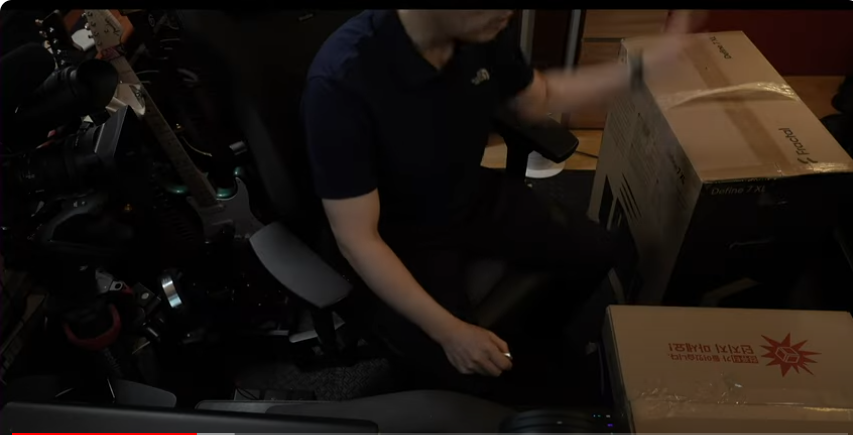
    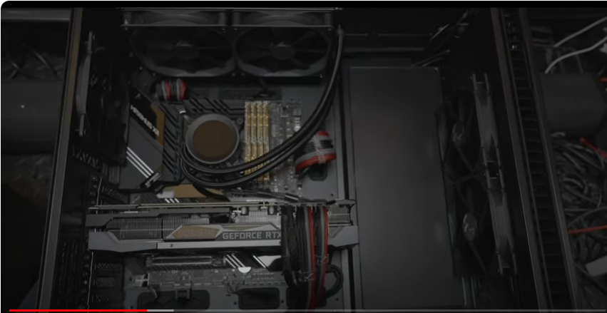
    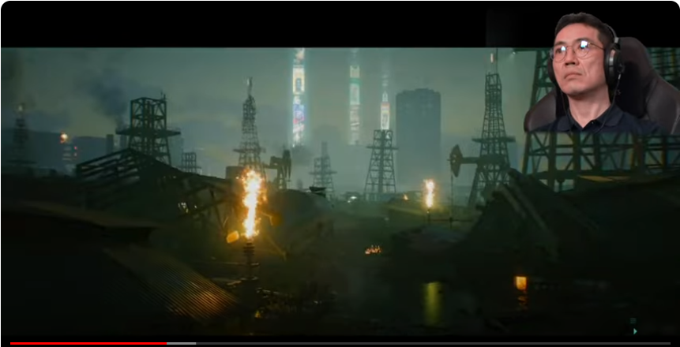

- 예전에 과거 영상에서 헤드 라이트 같은걸 쓰고 작업하는걸 보여드렸었다. strain한다고 하는데, 작업시간이 늘어날수록 사고칠 확률이 계속 올라간다.

- 지금과 달리 예전에는 노안이 아니었고 젊은 시절, 20대에도 286, 386 시대에는 지금처럼 ram도 모듈이 아니었다. 램 칩 하나하나를 꽂는 시절이었다. 그 때는 램을 엄청 꽂아도 1메가였다. 64kb 되는 칩을 수십개씩 꽂았다. 그러다가 몇개는 망실되고. 지금처럼 완전 모듈식으로 나오기 시작한게 얼마 안된다. 그 때는 눈 상태가 좋아도 사고칠 확률이 너무 높았다. 요즘에는 그런 일이 별로 없을 것 같지만, 여전히 작업 환경, 공간의 조건들이 충분히 좋아야 한다. 노안이 심한 사람들은 그럴 수 밖에 없다. 돋보기를 껴도 안보인다. 

    > 노안은 앞으로 저에게 닥칠 노화 현상 중 가장 걱정되는 것입니다. 족장님도 계속 말씀해오셨듯 노안이 오면 독서부터 시작해서 여러 생산성이 뚝뚝 떨어진다고 그러셨는데, 너무 걱정됩니다. 지금 이렇게 당연하게 보이는 것들이 당연하지 않게 보이게 된다니... 시간이 얼마 안남았네요.

- 내가 만약 록키라 해도 실전에 뛸 수 없는 나이가 되는걸 인정하게 되면 후배 양성을 위해 물러나야지. 박지성도 매번 박지성일 수가 없잖아. 그래도 노가다 십장을 하려 해도 알아야 십장을 해먹지. 프로여야 프로를 고용하지. 맡기더라도 그 단계까지 갈 때까지는 직접 해야 되는거지. 그런걸 내가 다 알아야, 목록을 뽑고 의뢰를 하는거지. 조립비만 내는거지.

    > 저 역시도 누군가 저에게 일을 맡길 때 저의 분야를 굉장히 잘 알고 있으신 분이 맡기는 경우와 그렇지 않은 경우가 차이가 있다고 느낍니다. 물론, 저의 성격이나 업무 스타일상 그것이 꼭 최종 성과의 차이로까지 이어지지는 않는 것 같습니다만, 그렇더라도 조금이라도 더 신경쓰게 되고 더 자세한 피드백을 드리려고 노력하게 되는 것 같습니다. 우수한 지휘관 밑의 병사들이 결국 우수하게 성과를 낼 확률이 높은 이치가 아닐까요. 

- 그리고 그게 효율적인게, 그 분들은 계속 조립을 하시는 분들이잖아. 그래서 능숙하고 효율적으로 진행을 하는거지. 짬밥을 생각해봐도 나는 기껏해야 3년에 한번씩 하는거라 늘지도 않는다. 부품들의 궁합을 맞추고 스펙을 보는 것이 호라이즌인데 그건 직전의 단계거든. 그 이후의 조립 단계는 나보다는 매일 하시는 분들이 훨씬 잘하지. 

- 그리고 궁합이 안맞는 제품을 내가 사서 조립한다고 생각해보면, 조립하면서 알게 되거든. 궁합이 안맞는다는걸. 그 과정에서 비용, 시간이 계속 낭비거든. 새로 부품 샀을 때도 또 삑사리 확률이 있는거고. 삑사리 제일 많이 나는 부분이 케이스나 쿨러 부분. 스펙과 상관없이 크기가 안맞을 수도 있다. RTX 3090이 굉장히 길어서 안맞을 때가 분명히 있다. 끼운 채로 케이스에 안맞는 식. 다 점검을 하고 판매처에서 보내주진 않거든. 그냥 받아보고 아는거거든. 조립하다가 반품해야 된다. 그런데 조립하시는 분들은 조립을 하다가 안맞으면 연락을 준다. '케이스에 안맞습니다. 보드에 끼운채로 안됩니다'라고. 그럼 바로 해결책이 나오거든. 그 자리에서. 훨씬 효율적이고 빠르다. 내가 직접 하다가 삑사리 나서 일주일씩 걸려버리면 내 레벨업에 전혀 도움이 안된다. 

    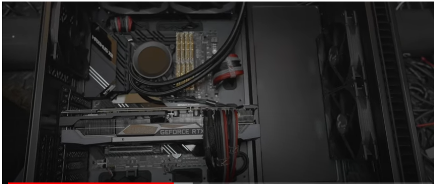

    > 레벨업에 도움이 되는 범위의 작업과 그렇지 않은 작업을 구별해내는건 별 것 아닌 것 같아도 하루이틀, 1년 2년 쌓이면 어마어마한 차이를 만들어낼 것 같습니다. 물론 그런 차이를 구별해낼 줄 아는 것조차 일정 수준의 호라이즌을 기반으로 가능한 것이긴 하지만, 객체지향적으로 조금만 생각해보면 충분히 가려낼 수 있지 않나 싶습니다. 아예 이런 개념조차 생각을 안하고 모든 작업을 반복해내는 것보다는 조금 틀리더라도 계속 생각을 하면서 구별해보는 것이 안전하기도 하고 맞다고 보여요.

- PC 조립에 있어서 어디까지가 호라이즌 확장에 도움이 되는지를 잘 판단해야 한다. 내가 끝까지 조립을 고집했던건, 나의 자존심 때문이었다. 헤드라이트를 사용하면서 조립하는 이유가 그거였다. 조립 상황이라면 사실 볼썽 사납고 안쓰러운 상황이었다. 딱봐도 '사고 가능성이 너무 높은데' 라는 생각이 들거든. 동급 최강 보드면 200만원씩 날라가는데 말야. 그런건 프로들한테 의뢰를 하는게 낫거든.

- 내 레벨업에 마이너스가 되는 것도 아니다. RTX 3090을 사용해서 PC를 조립했다는게 중요한거지. 어떤 보드와 그래픽 카드와 어떤 SSD를 궁합해서 쓰냐 같은게 중요한거지.

- SSD를 쓰는 세상이란 것도 신기하다. 하드디스크 제일 처음 샀던게 무려 20MB였다. 그 과정에서 지금도 그 책이 나오는지 모르겠는데, PC 조립 사양을 공부하는 책이 있다. 제가 마지막으로 조립할 때까지도 그 책을 샀다. 14th edition이었나 그럴 거다. 나중에는 내용이 너무 방대해지니까 CD와 DVD를 함께 동봉해줬다. 찾아보자.

    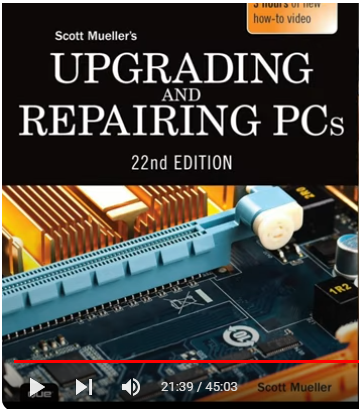

- 아마존에는 2015년이 마지막 판이다. 무려 22nd edition이다. 제가 마지막으로 산게 14th가 맞다면, 그 이후로 8년이 지난거다. 과거부터 PC의 역사가 들어있고, PC를 공부할 수 있는 책이었다. 이제는 이 책도 역사의 뒤안길로 사라지는거다. edition 이렇게까지 나오는거 보신적 있어요? 대단한거다. 이 책을 쓴 분도 나이가 있어서 힘드실거다. 안보실거다.

    > 족장님의 과거 컴퓨터 역사 이야기를 듣다보면, 저는 워낙 컴퓨터를 멀리하고 살아왔었기 때문에 그런 이야기들이 정말 신기하게 들립니다. 물론 저도 게임을 좋아하고 컴퓨터로 게임을 하기도 했지만, 제 동생이 컴퓨터에 워낙 관심이 많아서 여러가지 잡다한 것들을 다 해놨거든요. 전 그냥 편하게 게임만 했던거죠. 생각해보면 동생이 손재주도 참 좋고 호라이즌들도 다양합니다. 같은 형제인데도 어떻게 이렇게 달랐는지. 제 동생이 저보다 고수입니다. 

- 조립하시는 분들도 감안하실게, 어디까지가 호라이즌인지. 특히 노안 오신 분들은 더더욱. 비싼 장비와 부품들 훼손할 가능성이 너무 높다. 지금은 제가 맥프로를 쓰니까, 맥은 원래 맥의 컨셉 자체가 뚜껑을 까보라는건 아니었다. 맥스튜디오는 원점으로 돌아가서 뚜껑을 까볼 수 없는 스펙이고, 맥프로는 까보면서 확장을 하라는 시스템이니까. 맥프로는 완전 모듈화가 돼있다. 부품들이 덩치가 커서 깨먹을 가능성이 낮아서 아직도 직접 한다. 맥프로는 레고처럼 뺐다 꼈다하는 수준이라 훼손 가능성이 매우 낮은데, PC는 표준화라고 할 수 없거든. 보드만 해도 수십가지가 있고, 쿨러도 그렇고 다른 것들도 전부 제각각이다. 그 궁합을 맞춰서 아다리가 딱딱 맞을 확률이 높지가 않다. 한두번은 왔다갔다 해야 된다. 특히 동급최강을 조립한다면 훨씬 커진다. 표준이 아닌 케이스와 쿨러, 저처럼 소음 신경 많이 쓰는 분들은 무소음 쿨러 같은 것들로 교체하거든. 그럴거면 그냥 맡기는게 낫다. 즉, 나도 프로인데 프로를 고용하면 되는거다. 

    > 일단 본인이 프로의 레벨, 뭘 아는 수준까지는 가야 한다는 말씀이 참 좋은 것 같습니다. 그저 계속 남에게 일을 시키는 경우라면 호라이즌이 성장할 여지가 전혀 없잖아요. 계속 남에게 일을 맡기면서 호라이즌이 전혀 확장되지 않는 경우와, 호라이즌을 충분히 확장한 이후에 필요한 부분만 남에게 일을 맡기는 경우의 차이는 다른 호라이즌 확장의 여유와 여지까지 생긴다는 면에서 시간이 지날수록 차이가 커질 것 같습니다.

    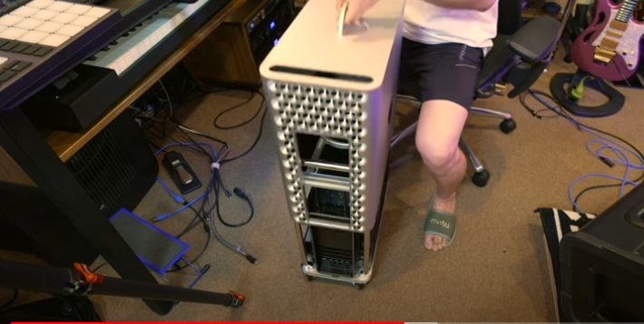

## 3. Destrutive workflow vs. Non-destructive workflow

- Destructive workflow에 대해서도 이야기를 하자면, 어느 분이 언급을 하셨었다. 생산성을 감안할 때 굉장히 중요한 개념이다. destructive workflow가 시간을 얼마나 깨먹는 것인지를 인지하고 살아야 한다.

- 예컨대, 포토샵에서 Layer 분리 안하고 전부 칠을 해버리면 뻘짓 가능성이 너무 높아진다. 그런데 레이어로 분리를 전부 해서 작업을 해버리면 레이어를 바꿀 수 있고 잘못된 부분만 수정할 수 있다. 오디오 작업도 마찬가지다. Undo를 할 수 있는거잖아. 가공을 한 상태와 안한 상태를 오가면서 작업을 할 수 있다. 포토샵 같은 소프트웨어에서 극명하게 드러난다. 그럼 오해를 할 수 있는데, 그런 분야에만 적용되는 것이 아니다. 가장 많이 하는 작업이 텍스트일 것 아니냐. 그런데 정말 많이들 워드프로세서로 하거든. 그런데 워드프로세서로 글을 쓸 때는 치장을 하면서 작업들을 하잖아. Text의 Source 개념이 없는거지. Source code 개념이 있어야지. 

    > 언제 한번 계란 오믈렛에 비유하셔서 말씀 하신 적이 있습니다. 누구나 한번씩은 일을 하든 뭘하든 겪어보는 경험이기는 합니다. 그런데 저는 그 경험을 그 범위 내에서만 적용한 경우가 대부분이었지, 다른 분야에까지 확장하면서 생산성 향상을 위해 노력하는 경우는 정말 드물었던 것 같습니다. 객체지향의 위력이 아닐 수 없습니다. 경계를 넘나들면서 생산성이 폭증을 하게 되는 비결이네요.

- 저는 유튜브 설명란에 올려야 하는 글 같은 것도 전부 모아놓고 활용할 수 있도록 하거든. 그런거 작업할 때도 sublime text라는 코딩 에디터를 쓴다. 나중에 치장해야 하는 단계가 필요하다면, Markdown이라는 포맷을 활용한다. 문서를 xml 다루듯이 다룬다. 나중에 렌더링 필요할 때나 렌더링하면 된다. 그건 장식 단계거든. 컴파일 단계란 말이지. 그런데 이미 치장을 다 해버리고 나면 찾고 바꾸기에서 문제가 생긴다. 어디가 텍스트고 어디가 포매팅을 위한 코딩 부분인지를 구별을 못하거든. 소스 코드 단계에서는 아주 쉽게 찾고 바꾸기를 할 수 있는데 포매팅을 하고나면 어려워지거든. 이미 디스트럭티브잖아. 

    > 족장님께서 여러차례 말씀하셨었는데, 저는 정말 에디터를 쓴지가 얼마 안됐습니다. 시도를 하긴 했었는데, 제 업무에는 큰 차이를 못 느낄 것 같았거든요. 저는 저에게 일을 맡기신 타인과 계속 문서를 주고 받아야 해서 초안 작성보다는 그 이후의 단계가 훨씬 긴 편이에요. 그럼에도, 막상 써보니 정말 다르더라구요. 특히나 요즘에 copilot까지 등장하면서 엄청나게 편리해진 것 같고, 결국 초안을 잘 써놔야 그 위에 자라나는 나무도 훌륭하기 때문에 생산성이 증가하지 않을 수가 없더라구요. 뭐든 일정 수준까지는 본격적으로 사용하고 적용을 해봐야 비로소 체감하게 되는 것 같습니다.

    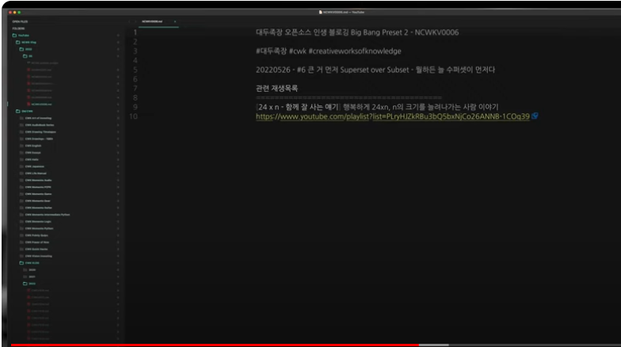

- 예를 들어 markdown으로 '대두족장'을 asterisk로 감싸면 볼드체거든. markdown으로. 그런데 랜더링을 했다고 가정하면, 대두족장이라는 볼드체가 보이면서 끝나거든 장식을 해버렸기 때문에. 소스를 잃어버린거잖아. 소스라면 별짓을 다할 수 있잖아. 그래서 저는 책을 쓸 때나 번역을 할 때도 텍스트 에디터를 사용했었다. 일을 할 때는 컴쟁이 마인드로, non destructive mind로 일을 했거든. 굉장히 생산성을 높여서 작업을 할 수 있었거든. 텍스트를 다루는데 정규식을 못다룬다면 생산성이 정말 뚝뚝 떨어진다. 정규식을 아는자와 모르는자. 24 x n에서 n의 크기가 얼마나 차이가 나는지 모른다. 정규식을 아는 사람은 포크레인이다. 모르는데 텍스트를 많이 다룬다면 그냥 삽질이다.

    > 이렇게 수십년을 살아오셨으니...ㅎㅎㅎ 그러신데도 여전히 생산성 향상을 위해 끝없이 노력하시고 계속 최적화를 하고 계시니 참 대단하십니다. 저도 정말 많이 노력해야겠어요. 노력을 '잘' 해야죠. 의식적으로 생각하면서, 어떻게 하면 생산성을 높일 수 있을지, 어떤게 짱구짓이고, 어떤게 호라이즌 확장에 도움되는 효율적인 작업인지 같은 것들을 생각해야죠.

- 예컨대,

    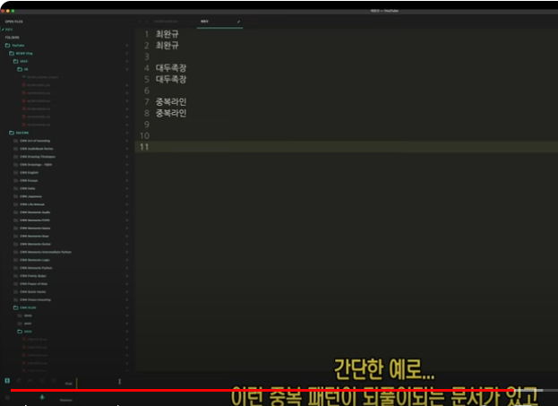
    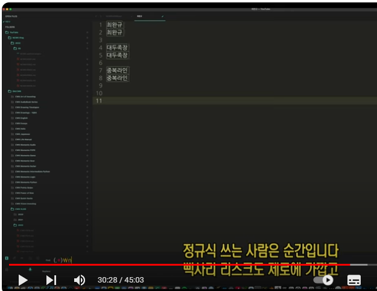
    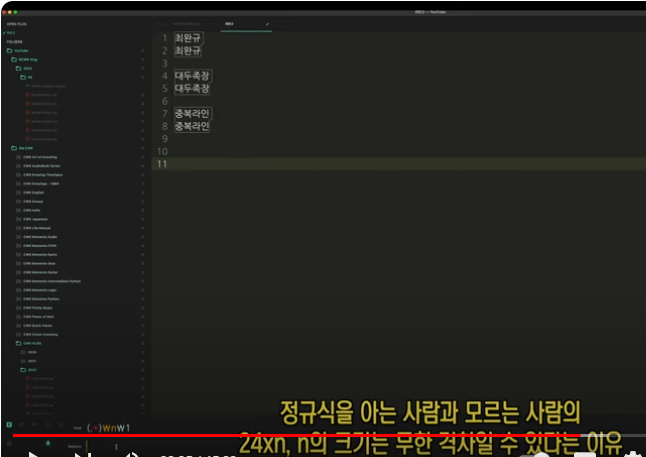

- 그정도로 무서운 무기다. 그런데 출판 작업할 때 출판사가 원했던건 한글문서나 워드문서였다. 그걸로 달라고 하거든. 그러면 제가 처음부터 프로세서로 작업했다면 정규식을 먹이고 그런게 안되거든. 정규식은 소스코드 차원에서 활용해야 하거든. 그럼 어떻게 해야되냐. 작업 단계, 글을 쓰고 번역을 하는 단계, 책을 만들어가는 단계에서는 텍스트를 쓰는 거지. 에디터를 쓰고 넘겨줄 때 그제서야 컴파일을 하는 것. 출판사에선 내가 처음부터 프로세서를 쓴 것으로 알겠지. 나중에 주고 받는 단계에서는 프로세서를 쓸 수 밖에 없게 된다. 이미 non destructive에서 destructive로 넘어갔잖아. 그 때부터는 생산성이 쭉쭉 떨어진다. 너무 화가 난다. 나중에는 프린팅 되어서 날아온다. 컴쟁이 회사면 최종단계까지 워드 파일로 주고 받지만, 한국 회사들은 인쇄해서 퀵으로 보내준다. 밑줄을 그으면서 빨간펜으로 칠까지 해야 된다. 1교, 2교, 3교 하면서 왔다갔다 해야 된다. 계속 destructive로 간다. 객체지향, 상속성 개념은 전혀 없다. 아날로그적으로 이어지는 destructive. 그걸 non destructive로 하면 1/100의 시간도 안 걸리거든.

    > 저도 최근에 쓰게 되면서 공감했던 것이, 확실히 혼자 작업을 하는 초안 작성에서는 심지어 작업이 재미있기 까지 합니다. 정규식 같은 기능들도 좋지만, 단락 나누기, 따옴표, 서식 등등 정말 효율적이고 편한 기능들이 너무 많습니다. 그리고 copilot 기능을 사용하면 순식간에 검색도 되고, 교정, 자동완성도 되고, 폴더에서 수백개의 문서에서 특정 키워드를 한방에 검색할 수도 있고. 한번 써보면 그 전으로 돌아갈 수가 없습니다. 아 그리고 저는 vs code와 cursor를 쓰는데, Monokai pro 테마가 정말 가독성을 엄청나게 올려주기도 합니다. 그러다가 워드프로세서를 써야되는 단계에서는 정말 그야말로 작업할 맛이 안납니다.

    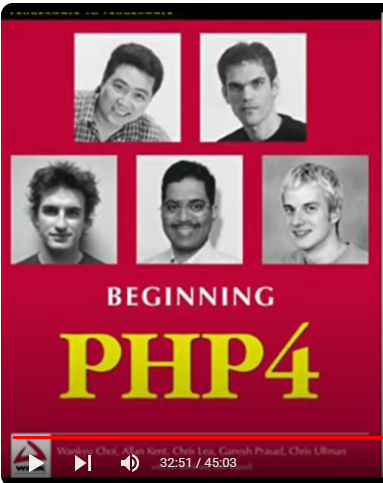

- 현실세계에서도 그렇다. 요리를 생각해보면, 10인분 정도를 끓여서 소분 냉동해놓고 먹는다고 가정하면, 그걸 처음부터 간을 딱 맞춰서 만들어놓는다고 생각해보자. 그게 destructive 개념이다. 이전으로 못 돌아간다. 용도를 바꾸려면 물을 타거나 하는 등의 변형을 가해야 한다. 그런데 처음부터 심심하게 만들어놓는다면(간단한 기본간만 하는거지). 육수의 기본은 한 번 끓이고 식혔다가 다시 끓여야 맛있는데, 아주 심심한 간으로 만들어 놓는다면, 나중에 간을 맞춰서 가면 되잖아. 그게 non destructive 개념이다. 나중에 간을 맞추는 건 쉬운데, 처음부터 간을 맞춰놓으면 열역학 제2법칙에 위배된다고 생각하면 된다. destructive와 non destructive의 차이다.

    > 경계를 넘나드시는 객체지향적 사고

- 한번 가면 돌아오지 못하는 강. 늘 non destructive한 방법을 찾아야 한다. 주기적으로 review를 해야 한다고 하잖아? 나쁜 습관은 계속 수정해야 하잖아. improve를 계속 해야 하잖아. 그런 개념이 있다. destructive로 하다가 원점으로 돌아가야 한다면 전부 버려야 하잖아. 국을 만드는데 너무 짜면 버려야 하고 시간, 비용 낭비잖아. 

    > 확실히 의식적으로라도 리뷰하는 습관을 가져야겠어요. 그냥 아무 생각없이 이전에 해왔던대로 하면 관성이 심해서 계속 반복하게 되잖아요. 끝없는 개선, 끝없는 최적화... 화장실에 'review' 포스트잇을 붙여야겠어요.

- 포토샵에서도 layer 없이 전부 하나로 했고, undo 할 수 없을 정도로 저장을 했고 껐다 켜면 히스토리까지 전부 날아가거든. layer도 하나고. 처음으로 돌아가서 수정하거나 스케치 단계로 돌아가고 싶다고 해도 처음부터 다시 그려야하는 수 밖에 없거든. 그런데 layer로 하면 수정이 쉽다. 그게 non destructive 개념이다.

- 그런 개념조차 없다면 24 x n에서 n이 1미만일거다. 그 개념을 계속 생각하면서 non-destructve 개념으로 몰아가면서 살아온다면 n의 크기가 꽤 클거다. 컴퓨터 세상이든 현실세상이든 undo, step back이 가능한지를 항상 생각해라. 자유롭게 step forward, step back이 가능해야지. 그게 non destructive work flow지.

    > 사실 저도 그렇고 누구나 한번씩은 느끼는 경험일텐데 족장님과의 차이는 이걸 다른 분야에까지 적용해보는 객체지향적 사고가 안된다는 것이겠죠. 의식적으로라도 계속 생각을 하면서 리뷰를 해야겠어요. 그러다보면 족장님만큼은 아니어도 과거의 저보다는 나아지겠죠.

    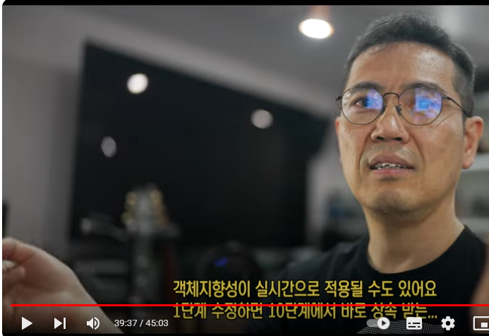

- 어느 단계든지 non-linear하게 왔다갔다. 단계별로 work flow가 전부 저장이 돼있는 거지. source code 단계에 대한 개념도 있어야지. presentation 단계인가, compile 단계인가 같은 것들 말야. 글을 쓸 때는 source code 단계여야 하거든. 치장하는 부분은 오래 안걸리거든. 글을 쓰면서 치장 하면 안된다. 포매팅은 전부 뒤로 몰아 놔야 한다. 치장하는데 든 시간 전부 낭비한거잖아.

    > 텍스트 에디터로 텍스트 작업을 하면서부터는 저도 체감하고 있습니다. 그 큰 차이를 알게 되었어요. 차이가 작더라도 누적된다고 생각하면...

- 얼굴은 나가지도 않는데, 화장 떡칠한것과 같지. 손 모델인데 얼굴 화장 한거지. 최종적으로 어떤 부분을 present할지가 결정될 때나 칠하는거지. 물론 공동작업할 때는 안맞을 수도 있지. 상대방을 배려를 해야 하니까. 그런데 자기가 작업하는 영역 내에서는 생산성을 높일 수 있거든. 1교를 하기 전에(출판사에 넘기기전에, 저자 탈고 전에)는 충분히 non-destructive하게 작업할 수 있거든. 생산성을 최대로 끌어올릴 수 있잖아. 

- 텍스트를 많이 쓰시는 분들은 source code 차원에서 하는가, 개념이 있는가, 렌더링, 컴파일, 프리젠테이션 단계들을 전부 섞어서 쓰고 있지 않는가. 워드프로세서로 글을 쓴다면 짤없이 전부 섞어서 쓰고 있는거다. 

- 텍스트 작업을 굉장히 많이 하시는 분들이라면 그 시간차이가 어마무시하다. 특히 정규식을 아는 분들은 더더욱 그렇다. 정규식을 처음 들어보셨다면, 어마무시한 성장의 여지라고 생각할 수 있다. 정규식을 지금부터 배워서 폭풍 성장할 수 있거든. 배우려 하는 분들만. 

    > 정규식이 정말 치트키 그 자체인 것 같습니다.

- 내일이 일요일이고 주말이니까 본인의 삶을 리뷰해보기도 좋잖아. 화장실에 앉아서 5분쯤 리마인드를 할 수 있잖아. 리마인더 앱을 사용해도 좋고. 화장실에 리뷰시간이라고 붙여놔라. 이번주엔 destructive하게 일한 부분이 어떤걸까 같은 것들. 짧게 짧게 생각해볼 수 있잖아. 그리고 습관이 되면 더 잘보이게 된다. 그러다가 non-destructive하게 일하는 누군가를 보면 확 눈에 들어오거든. '아 저런 사람은 저렇게 하는구나'라는 걸 보면 삽을 내동댕이치고 포크레인질을 하는거지. 

- 그러다보면 '시간이 없다'는 소리를 덜 하게 된다. 좋은 습관의 선순환이 이뤄진다. 제가 경험해서 자꾸 권해드리는거다. 

    > 그래서 제가 여전히 시간이 없나 봅니다.ㅎㅎ 