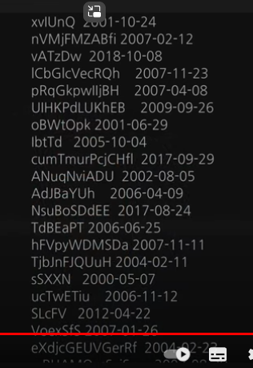

# 누구나 쓸 수 있는 24xn 포텐 폭증 컴쟁이 비밀병기 정규식

**영상링크 : https://youtu.be/xVg2i-20dIs**

## 1. Intro

- 오늘이 토요일이라, 저도 부담없이 쉬어볼까 했지만, 헤드셋을 쓰고(게임을 할 건 아니고), 저는 3년 전부터 바리깡으로 원빈처럼 머리를 깎는다. 자고 일어나면 머리가 엉망이 돼서 가리려고 헤드셋을 썼다.

- 방송을 오늘 굳이 짧게나마 하려는건, 며칠전에 24 x n 이야기를 했었다. 개인의 n의 크기가 모여서 국가 경쟁력이 되고, 국가 경쟁력이 모여서 글로벌 경쟁력이 되니까 universe에 긍정적인 영향을 주기 위해서 저는 모두의 n의 크기가 커졌으면 좋겠다. 제가 다른건 못 도와드려도 컴쟁이 마인드에서 도와드리려고 한다. 

    > 정말 예전부터 이렇게 한결같으셨네요. 이게 언제 올리신 영상인지는 모르겠습니다만, 여러 면에서 최근 영상은 아닌 것이 확실합니다.

- 그런데 여전히 프로그래밍을 무서워하시는 분들이 있다. 댓글로 한명이라도 시작하려는 분이 보이면, 저는 기분이 굉장히 좋다. '한 명은 전도를 했구나' 굉장히 보람을 느낍니다. 여전히 두려워하는 분들이 있다. 프로그래밍은 정말 무한 포텐이다.

- 프로그램보다는 조금 쉬운 방법을 알려드리겠다. 지금의 삽질 시간을 아껴줄만한 비법. 정규식이다. Regular Expression(regex). 우리말이든 영어로든 잘 안와닿는 표현이다. 이 세상 모든 것이 패턴이잖아요. 그 패턴을 인식하는 방법인데, 어떤 패턴이냐면 주로 텍스트 패턴을 인식하는 방법이다. 인간이 디지털 작업을 하면서 삽질을 하는것, 모든 작업을 하면서 가장 많은 삽질을 하는 분야가 숫자와 텍스트이다. 숫자는 그나마 엑셀 사용자가 많이 늘어서 생산성 향상이 많이 되었다.

    

- 그런데 워드 프로세서를 사용해버리면 반대로 생산성이 떨어진다. 여러차례 강조를 했는데, 말로는 "워드 프로세서"지만, 포장하는 소프트웨어다. 최종적으로 내가 쓴 글을 포장하는 것. 글을 쓰는 도구가 아니다.

- 글은, 일반 텍스트로, 플레인 텍스트로 써야 처리하기도 편하다. 처음부터 프로세서로 작업하면 나중에 포장만 하면 되는 것을, 중간에 입력 과정에서부터 가공하는 작업까지 굉장히 시간을 많이 잡아먹는다. 엑셀과는 다르다. 텍스트 편집기를 사용하시는 것이 최선이다.

## 2. Sublime Text

- 제가 대두족장 블로그에 정규식 편집기라는 것을 만든 적이 있다. 정규식 강좌를 연재한 적도 있고. 그 때는 윈도우에서 사용하는 울트라 에디터라는 것을 권해드렸다. 그런데 지금은 어차피 윈도우나 맥에서 돌아가는 최고의 프로그램인 sublime text를 권해드린다. 이름부터가 sublime다.

    

- 멋진 에디터다. 텍스트를 입력하고 찾고 바꾸기만 사용해봐도 확실히 다르다. 오늘 그 샘플을 딱 하나만 보여드리겠다. 너무 많이 보여드리면 겁을 내시더라고. 정말 간단한 사례 하나만 보여드린다. 

- submlime text를 유료로 또는 무료로 사용 가능하다. 꼭 sublime text가 아니더라도 정규식만 지원한다면 어떤 에디터든 상관이 없다. 정규식을 배워놓으면, 언제든 활용할 수 있다. 

- 실제로 제가 경험한 사례다. 어떤 분이 이런 텍스트 작업을 했다고 생각해자. 2000-01-02 이런 식의 내용이 있는 문서가 있다. 곳곳에 날짜가 박혀있는 것. 그 날짜 포맷이 2000-01-02로 되어있는 것. 이걸 어떤 이유에서든 바꿔야 한다고 생각해보자. 일월연도의 순서로. 누가봐도 이런 간단한 작업이 있다고 해보자. 이걸 수작업을 하면 굉장한 뻘짓이겠지. 누가봐도 삽질이다. 100개쯤 되면 시간, 오류가능성이 너무 크다. 이게 무슨 포맷이 정해져있다면 모를까, 곳곳에 숨어있다면 오류가능성이 폭증한다. 실제로 그런 분들이 계시고, 전도사로서 그걸 봤을 때 피눈물을 흘렸다. 더 무서운 건, 100개쯤에서 끝나면 하루 정도 고생하지만 200개 300개쯤 되고 게다가 300개쯤 들어있는 문서가 1,000개쯤 된다고 생각해보면... 정말 수작업을 하면...? 저 울거다. 분명히 컴쟁이들은 그렇게 안할 것. 누군가는 방법을 만들어놨을 것. 

- 이 문제를 생각해보면, 뭔가 딱 정해져있는 형식이 아니다. 2000년 뿐만 아니라 2001년, 1999년, 2017년... 월일도 계속 바뀌고. 이런 변수를 일일이 찾는 방법은 없다. 그래서 패턴 인식이 필요한 것. 변수도 아우를 수 있는 패턴을 지정해주는 방법이 필요하다. 그게 바로 정규식. 어떻게 하면 바꿀 수 있을까? 만약 아까같은 경우의 문서가 3,000개쯤 된다면 어떻게 해야할까. 만약 정규식을 아는 파워 유저라면 sublime text에서 특정 디렉토리, 특정 폴더를 지정하고 한꺼번에 파일을 바꿀 수도 있다. 그 안에 패턴이 수만개 존재한다고 해도 그냥 화장실 갔다오면 일이 끝나 있다.

- 프로그래머라면 포텐은 무한으로 열려있다. 프로그래머라면 그 패턴뿐만 아니라 다른 패턴들까지 무한대로 바꿀 수 있는 프로그래밍 스크립팅을 하겠다. 정규식을 끼워넣으면 되니까. 루프를 돌면서 그 안에서 작업할 수 있는. 그 안에서 어떤 작업을 하든 프로그래머 마음이니까. 프로그래머는 컴퓨터의 master이니까. 그런데 이걸 수작업을 한다? 그러면 컴퓨터가 master고. 여러분이 slave가 된다. 그걸 벗어나는 단계라면 sublime text 정도 되는 에디터에서 정규식을 사용하면 된다. 오늘 그 방법을 하나 살펴보겠다. 

- 그리고 이게 하나가 아니다. 포텐을 봐라. 가능성. 사례를 봤을 때. 저건 나한테 해당안되는데? 라고 생각하지 말고, 오만가지 중에 하나거든. 저걸 응용하면 나한테 엄청난 생산성 폭증 효과를 낼 수 있겠다고 생각해봐라. 어떻게 배울 수 있냐면, 구글링을 해보면 된다. 저는 여러분을 사랑합니다🤣 이러면 오글거리잖아요. 오글 육글 칠글 팔글 구글 위 구글 그렇게 구글링을 해보면 된다. 하다못해 대두족장 정규식이라고 쳐봐라. 그러면 제가 옛날에 올린 글들은 모두 막혀 있을거다. 그런데 신기하게도 퍼가신 분들이 계신다. 그래서 혹시라도 나올지도 모른다. 

    

- 예전에 대두족장 편집기라는걸 공개한 적도 있는데 그걸 다운로드해서 쓰시는 분들도 계신다. 어떤 방법도 좋은데, 가장 좋은건 정규식 관련 책을 하나 보는 것. 가장 좋은 것이 master ring Regular Expressions라는 건데, 권해드리기는 좀 그런 것이 매우 두껍다.

    

- 정규식에 관한한 최고의 권위 도서이다. 1/10만 보셔도 좋다. 뒷부분은 너무 전문적이고. 아마 생산성이 폭증할 것. 기하급수적으로 폭증할 것. 어려워서 기겁하실 수도 있다. 프로그래밍보다 난해하거든. 처음 접하는 분들은 너무 어렵다고 생각하실 수도 있다. 

- 인터넷에 쉽게 설명해놓으신 분들도 많다. 아쉽게도 전부 영어다. 그래서 제가 항상 강조하듯 영어를 알면 글로벌 인재가 될 수 있다. 우리말만 알면 정보 소스가 딱 한국에만 제한되잖아. 하다못해 파이널컷 챕터 마커를 유튜브 타임스탬프 링크로 바꾸는 그 정보를 얻을 때도 일본친구한테 정보를 얻었다. 제가 일본어를 조금은 하니까요. 못했다면 못 얻었겠지. 그런것처럼 외국어를 하면 호라이즌이 당연히 넓어진다. 

- 영어하면 글로브 전체를 아우르는 것. 정규식은 그렇게 어려운 영어가 아니니까 패턴만 보셔도 이해가 되실 것. 첫번째 난관만 넘어봐라. 하나만 넘으면 새로운 세상이 열릴것. 제가 장담하겠다.

- 프로그램에 어려움을 느끼시면 아까 그 문제를 어떻게 solve하는지를 보시면 좋으실것. 아마 제가 드릴 수 있는 최고의 선물이 될지도 모르겠다. 

- 이번 주말에 여러분들께 드리는 선물이다. 한번 보자.

## 3. 정규식 실제 사례

- 이 문서는 임의로 만들어본 문서다. 프로그래밍해서 뽑아본 문서. 시뮬레이션을 해본것. 실제로 이런 문서들을 만들어내는 분들도 계실테니까.

    

- 문자들의 패턴이 일정하지 않다. 일월연으로 쉽게 바꾸기가 너무 어렵잖아. 일반적인 찾고 바꾸기로는 할수가 없는 것. 

- sublime text로 가보자. 그냥 붙여넣기 한건데, 한 200개쯤 된다. 200줄 만들었으니까. 이런게 10,000개든 100,000개든 상관이 없다. 그게 무한 포텐의 의미. 

- 10줄이라면 손으로 바꿔도 되지. 그러면 저도 스크립트 안하거든. 그런게 이걸 매일 해내야 하거나 한 문서에 1,000개 10,000개 되고 문서가 100개 된다고 생각해보자. 그런데 정규식을 알면 이런게 가능해진다. 

    

- 패턴을 인식하는 것. 숫자가 하나 둘 셋 네개 계속된다. 그리고 대쉬 또는 하이픈이 있고, 숫자 두개 계속 되고, 또 숫자 두개 계속 된다는 패턴을 찾아내는 것. 그리고 나서 괄호를 쳐주면 나중에 바꾸기를 할 때 활용을 할 수 있거든. 자세히 보면 괄호가 세개. 그걸 3-2-1로 바꿔주겠다는 것. 이게 여러가지 활용을 할 수 있는데, 이 찾고 바꾸기에서 찾기만을 해서 find all 해서 해당 패턴을 찾기만 해도 돼요. 그럼 커서가 지금 200개가 나눠진거. 이것이 sublime text의 막강한 기능이다. 이걸 왔다갔다 하면서 쉼표로 바꿀 수도 있어요. 알아서 움직인다. 

    
    

- 그런데 우리는 연월일을 일월연으로 바꾸고 싶다. 그러면 괄호 순서를 3, 2, 1로 바꾸면 된다? 

    
    

- 그럼 문서가 백만개가 돼도 이걸 컴퓨터한테 일을 시키고 저는 밥을 먹고 오면 된다. 

- 정규식은 길게 안써도 된다. 아주 단순하게 써도 된다. 정규식도 아트라서, 정규식을 잘 쓰면 간단하고 명료하게 활용할 수도 있다. 정규식으로 할 수 있는 500만 가지 일들 중에 하나. 

- 여기서 포텐을 확인해보라. 가능성. 

    

- 그렇게 24 x n에서 n의 크기를 키울 수 있는 방법은 꼭 프로그래밍만 있는 것이 아니다. 정규식을 처음 들어보셨다면 여러분은 무한 포텐을 갖고 계신 거다.

    > 정규식은 생산성 향상 효과가 즉각적으로 나타나는 분야네요. 정말 파고들어 볼만한 가치가 있어보입니다. 족장님께서도 말씀하셨지만, 어떻게 상상하느냐에 따라 무한한 가능성이 열리는 분야이기 대문에 제대로 한번 배움직 합니다. 감사합니다.