# [24 x n] RegEx 정규식으로 바라본 세상 - 패턴 인식 튜토리얼 보스 공략

**영상링크 : https://youtu.be/dfNUORd-jFM**

## ***Intro***

- 여러분들 feedback을 보고, 또 '그 때가 됐구나'라는 걸 느낀다. '정규식 evangelist'로 날 뛸 때가 됐구나 하는거죠.

- 제가 주기적으로 정규식 이야기를 한다. 블로그, 카페 운영할 때도 그랬고, 회사 운영할 때도. 한번은 그 때 성탄절이었나 새해연휴였을 텐데 직원들에게 선물이랍시고 글을 써서 메일로 보냈던 기억이 난다. '그대들의 10년 후 미래를 생각하며' 많은 시간을 절약할 수 있는 방법을 알려주겠다고 했다.

- 마눌님께도 알려줬고, 이후에 마눌님 텍스트 작업을 할 때 그 시간을 단축해주려고 도와주려고도 했다. 그런데 안되더라. 10, 20, 30년 했는데도 안되는 것들은 어쩔 수 없는 면들이 있다. 마눌님의 텍스트 작업을 보면 답답하기도 하고, 그렇다고 도와주려고 하면 오히려 방해하는게 된다. 그런건 인지하셔야 한다. 꽤 오랫동안 노력해도 안되는건 안되는 것이다.

- 오래전부터 정규식은 주기적으로 강조를 해왔다. **일주일 할 일을 10초만에 하는 비법 전수** 와 같은 식으로. 이 wording 그대로를 구글에서 검색 해보면 나올거다. 아직도 블로그에 저장해둔 분들이 있다. 저 역시 제가 혼자보는 Archive 사이트에 저장해놓은게 있다. 정규식 강의하는 내용이다. 저 아니라도 정규식 관련 책을 보셔도 된다. 그리고 '대두족장 정규식'이라고만 쳐도 오픈소스 프로젝트들도 나올 거다. 그 소스는 아직 돌아다니는지는 모르겠다. 원래 저 혼자 쓰려고 만든거라 지저분한 소스다. 그래도 가져다 쓰시는 분들이 있다.

    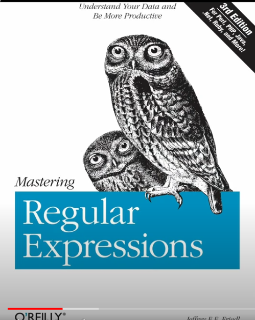

    > 결국 저도 이 책을 구매했습니다. 2007년 3rd edition이 마지막인데, 여전히 잘 팔리고 있습니다. 두껍고 어렵다고 해서 다른 쉬울 법한 책들도 찾아봤는데, 가장 권위가 있고 정규식의 알파이자 오메가라고 하고, 제가 정규식을 어떤 수준까지 관심 갖게 될지는 또 모르는 법이라 그냥 바이블을 샀습니다.

    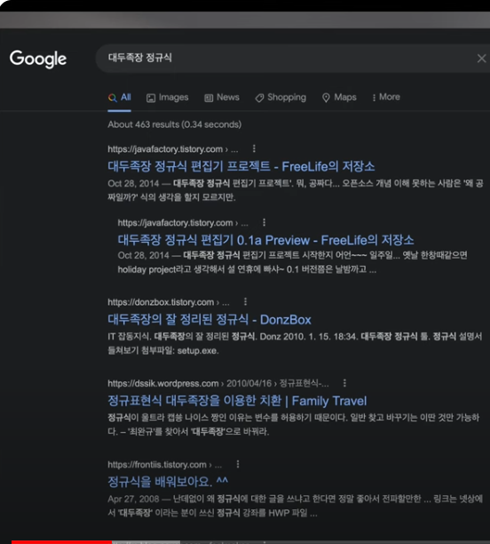

- Creative Works of Knowledge 사이트 운영할 때도 이야기했는데, 주기적으로 계속 얘기하게 된다.

- 빅뱅 preset 1에서도 이야기했지만, preset 2에서도 이야기하게 되는데, 24 x n을 이야기할 때 말을 안할 수가 없다. 가장 직접적으로 영향을 줄 수 있는 power tool이기 때문. 텍스트는 누구나 쓰니까. 그리고 그 과정에서 낭비하는 시간들이 워낙 많으니까. n의 크기가 1보다 크다는 정신으로 살아갈 수 있었던 계기는 다음의 것들이다.

1. 컴퓨터를 만난 것
2. 코딩을 시작한 것
3. 코딩을 안하더라도 일상 생활 속에서 텍스트 작업을 하면서 정규식을 활용하게 된것.

    > 제가 자랑은 아니지만, 워낙 오랫동안 컴맹으로 살아왔다보니 위의 것들은 전부 접할 생각이 없었습니다.... 이제부터라도 무한 포텐 살려보겠다고, 좋게 생각하겠습니다.

- 정규식을 쓰기 전과 후로 인생이 나뉜다.

- 정규식을 접해보셨는데 일상에서 활용을 안한다면 정규식에 대해 오해를 하고 있는 것. 작은 코딩 도구, 창의력 도구다. Artistic 한 면이 있다. 머리를 굉장히 굴려야 제대로 활용할 수 있는 도구다. 

- 나름대로의 언어다. 정해진 틀이 있는게 아니라서 활용하는 사람의 역량에 따라 활용도가 달라지는 power tool이다. 아이디어를 내서 다양하게 활용해보라. 이번에 다시 정규식 전도사가 되어야겠다는 생각이 들었다.

- open source, evangelist 정신에 따라 이야기를 해보겠다.

## ***정규식***

- 정규식을 활용하는 방법에는 여러가지가 있다. 

1. 가장 강력하게 활용 : 프로그래밍 언어 안에서 활용 - ex)Python regex 패키지 활용. 수많은 파일 처리 등
2. 정규식 툴 활용 : 대두족장 정규식 에디터 편집기처럼. 쉽게 활용할 수 있는 방법은 아님. terminal power tool 같은 것도 있음(vi, grep, sed, awk 등 터미널에서 사용하는 것)
3. 에디터 활용 : 정규식을 지원하는 sublime text 같은걸 활용. sublime text는 유료로 써볼만하다. sublime text 에디터 정도 되면 이 세상의 에디터가 아니다. 무한 포텐 있는 에디터라, 가장 강력한 정규식 파워툴이기도 하고. 
4. 가장 간단하게 지원 : word에서도 subset을 지원하는 것으로 기억하는데 지금은 모르겠다.

- Extended Regualr Expressions라고 하는데, 완전 full 정규식을 지원하는 프로그램은 잘 없을 거다. sublime text는 extend 수준. 본인이 알고 있는 패턴이 있는데 그게 안 먹히면 full version이 아닌거다. 무조건 superset이어야 한다. 괜히 subset 소프트웨어를 쓰면서 뻘짓을 할 수 있거든.

    

- 이 세상이 패턴인식이잖아. 패턴 인식을 할 수 있는 자와 아닌 자의 차이가 크다. 정규식을 써보면 패턴 인식이라는게 뭔지 삘이 오실 것

- 꼭 텍스트만 보는게 아니라 패턴을 인식하는 능력이 늘어나거든. 그 스킬 레벨업을 할 수 있음. 가장 쉽게 접할 수 있는건 sublime text 같은 정규식 지원 에디터나 툴을 활용하는 것.

    > 작은 습관들이 모여 큰 변화를 만들겠죠. 정규식을 쓰는 습관을 들이면, 더 많은 패턴, 더 큰 패턴을 인식할 수 있게 될 것 같습니다.

- 예컨대, 파일명을 100개 200개씩 바꿔야할 때, 폴더가 중첩되어 있고 하는 경우가 있다. 그럴 때는 일일이 할 필요가 없다. 누가 봐도 뻘짓이잖아. 그럴 때 recursive 할 수 있는게 정규식이거든. 

- 가장 범용으로 쓸 수 있는건 프로그래밍언어지만 매번 코딩을 해서 짤 수가 없잖아. 그래서 맥에서 쓰는 pathfinder 같은게 있거든. 일반적인 finder 탐색기에는 그런 기능이 없다. pathfinder 안에 batch rename 기능을 쓸 수가 있다. batch rename 안에 정규식을 넣을 수 있다. 

- Mac에는 Service라는 기능이 있다. automater. 간단하게 코딩을 할 수가 있다. 정규식을 사용할 부분에서만, 필요한 workflow에서만 자신이 직접 파워툴을 만드는 것. 제가 해드릴 수 있는건, 정규식을 다시 가르쳐드릴 순 없고, 자극만 드리는 것. '아 저런게 있구나', '저런건 내가 활용해볼 수 있겠구나', '24 x n을 폭증시켜줄 수 있겠구나' 라는 삘을 받아보셔.

## ***정규식 실제 사례***

- Html 태그들 가득한 지저분한 문서에서 html 태그 전부 날려버리는 걸 아까 언급했던 automater로 날려버리는걸 잠깐 보여드리겠다. 

- automater라는걸 실행하면, 예전에는 메뉴가 *services*로 되어있었는데 지금은 *workflow*나 *quick action*으로 되어 있다. 

    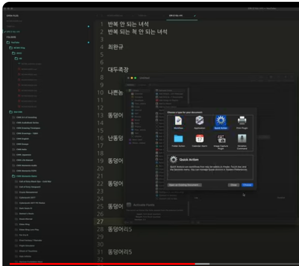

- *quick action*으로 가서 *shell script*를 만든다. 터미널에 있는 작은 툴로 regular expressions로 할 수 있다. 그리고 이걸 service로 등록해서 사용할 수 있다. 

- 그리고 텍스트 에디터 같은 곳에서 이렇게 생긴 문서가 있다고 가정해보자. 문서에 Html까지 엉망으로 섞여있는 것이 있다고 해보자.

    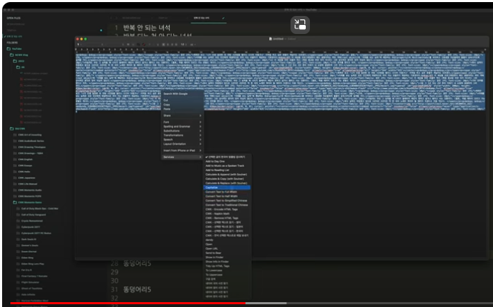

- 이럴 때 의미있는 텍스트만 남기고 싶다면, *services*라는 메뉴에서 아까 제가 만든 remove html tags, automater - snippet을 실행하면 된다. 아까 만든게 remove html tag다. 그러면 html 태그를 없애준다 다 날아가고, 의미있는 텍스트만 남는다.

    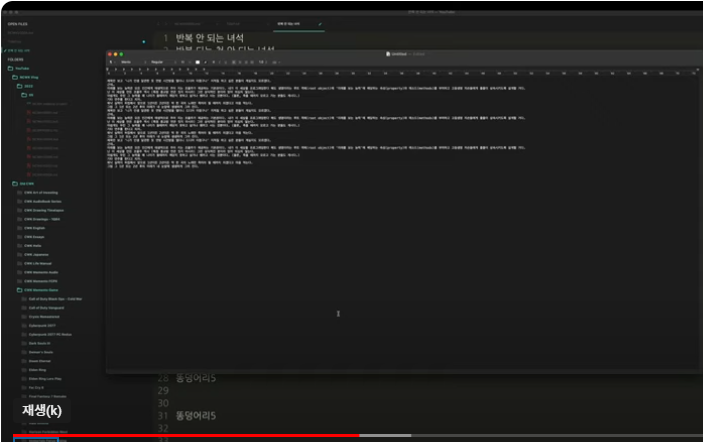

- 이걸 직접한다고 생각해보면, 1차적으로는 실수 리스크가 크다. 이건 리스크가 제로다. 이 문서가 백만개쯤 있다면 수작업으로는 불가능하다. 시간도 그렇고.

## ***Path Finder***

- 이번에는 path finder를 보겠다. 기본적으로 윈도우 탐색기 같은거다. Mac에는 finder라는게 있는데, 기능이 좀 부족하다. 

- batch rename 기능을 써보면, replace text라는건 일반적으로 텍스트를 치환 즉, 찾고 바꾸기를 하는 것이고, 여기서 replace regex를 쓰면 정규식으로 쓰고 바꾸겠다는 것. 

    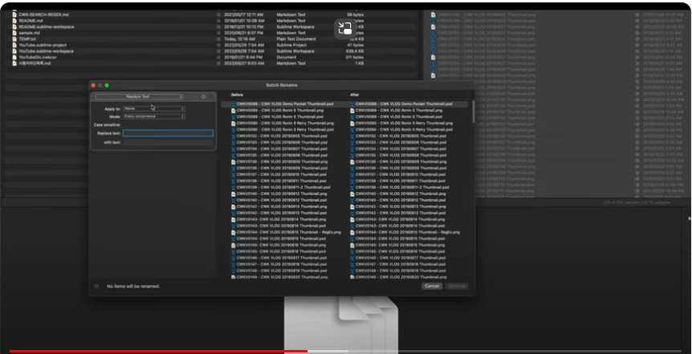

- 예전에는 20190605 이런식으로 naming을 했었다. 이걸 만약 어떤 needs 때문에 위치, 순서를 바꾸거나 2019-06-05 이런식으로 바꾸고 싶을 때 수작업을 100만개 문서로 한다고 해보자. 뻘짓이다.

- 바꿔보자. 바꾸면서 before-after가 실시간으로 보인다. 이렇게 바뀌겠다는 내용을 미리 볼 수 있다. `cwk vlog [0-9]+` '숫자가 몇개가 반복되더라도'를 표현하면 다른 원하는 어떤 식으로든 바꿀 수 있다. **정규식의 진짜 파워는 내가 찾은 것을 재활용할 수 있다는 것.** 그래서 찾은걸 괄호로 쳐주면, `cwk vlog ([0-9]+)` 나중에 재활용할 수 있다. path finder에서는 $표시를 쓴다. 찾은 것으로 순서를 바꿔보겠다. `$1 cwk vlog`로 하면 날짜가 먼저 나오고 `cwk vlog`가 나중에 나온다. 이건 날짜가 어떻게 생겼든 여섯자리 숫자라면 패턴으로 인식하는 것.

    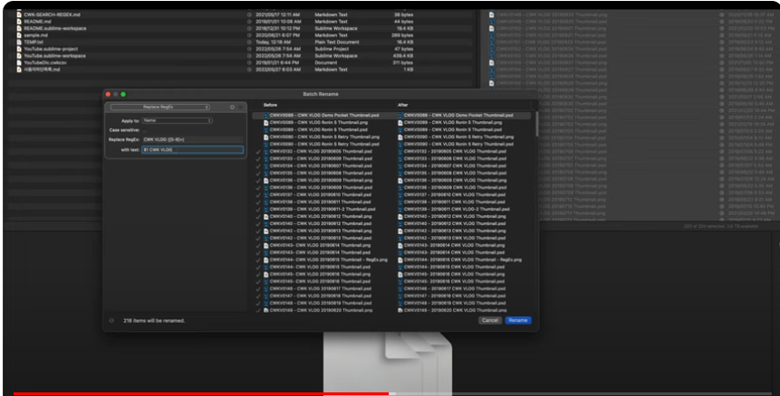

- 이걸 대쉬가 들어가는 것으로 바꿔보자. 앞에 네자리가 연도수, 두번째 찾는건 월일거고, 세번째 찾는건 일이겠지. `cwk vlog ([0-9][0-9][0-9][0-9])([0-9][0-9])([0-9][0-9])`. 그럼 이제 `$1-$2-$3 cwk vlog` 이러면 된다. 비포 애프터 보면 20190605가 2019-06-05로 바뀐다. 이게 파워다. 이러고 rename을 눌러주면 214개를 한번에 바꿔준다. 

- 지금 코딩하듯 짱구 굴린거다. 창의적으로. 정규식이라는 언어를 사용하는 것. 그걸로 컴퓨터랑 대화를 하는 것.

- 다시 정리하면, *path finder*에서 찾고 바꾸기를 할 때 이미 찾은 내용을 `$`로 사용하지만, 일반적으로는 `\`를 사용한다. 

## ***Sublime Text***

- 이번에는 sublime text를 보겠다. 

- 에전에 제가 빅뱅 preset 1에서 블러드본 스토리 공략할 때 깃헙에 공개를 했었다. 그 때의 문서다. 그 문서를 보면, 1회부터 있는데, 일본어도 있고 일본어와 영어를 다 하면서 공략을 했다. 3개 국어로 했다. 그러면서 관련 용어를 영어, 일본어, 우리말로 문서를 만들어 놓은 거다. 그렇게 공부도 한 거고. 그런데 이런 문서에서 한국어, 일본어, 영어를 가려내고 싶다면 어떻게 할까? 10초만 멈추고 고민해보자. 이미 찾은걸 뽑아낼 수 있다고 했다. 그걸 어떤 식으로든 뽑아내서 가공할 수 있다. 또는 이 문서에서 일본어만 날려버리고 싶다면 어떻게 하겠나. 막막하잖아. 이런 문서가 100만건 있다고 해보자. 수작업을 인간이 할 수가 없다. 한번 해보자

    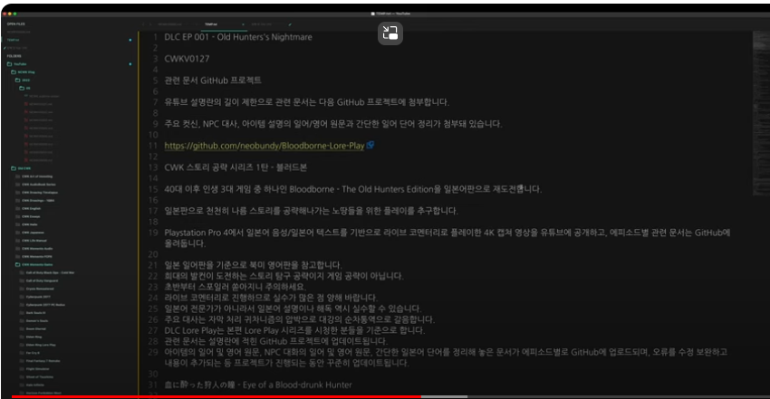

- 한국어 부터 해보자. find에다 집어넣으면 된다. regular expression을 쓰겠다고 하고, 패턴을 어떻게 쓰냐면, `[가-힣]` 이다. 즉, 우리나라 말이 가에서 힣으로 끝난다. 첫 글자가 '가'고, 끝글자가 '힣'이다. 코드값으로도 첫번째가 '가'고, 마지막 코드가 '힣'이다. 그래서 '가에서 힣까지 몇개가 반복되더라도'라는 패턴을 집어넣으면, `[가-힣]+` 한국어만 고른다. 격철, 공이치기, 쇠망치 이런것들은 전부 고른다. 그리고 날려버리고 싶으면 replace all을 누르면 된다.

- 이번에는 영어만 해보자. 영어는 쉽지. 영어는 대소문자가 있으니까, 대소문자만 가리면 되겠지. `[a-zA-Z]+` 하면 영어만 선택된다. 그리고 날리면 되지.

- 이번에는 일본어 해보자. 일본어는 히라가나와 한자의 첫글자와 끝글자 range를 지정해주는 것. `[一-龠ぁ-んァ-ン]+` 이다. 일본어만 선택하고 날리면 한국어와 영어만 남는다. 이걸 손으로 할 수 없겠지. 얼마나 많은 실수를 하겠냐. 수작업으로 가능하다고 해도 말야. 

- 한가지만 더 해보자. 이번엔 빅뱅 preset 2를 만들 때, 이전의 차단목록을 복사하면 사용자 ID를 집어넣는게 아니고, 사용자 ID가 대표하는, indicate하는 채널을 찾아내서 차단하는거다. 그걸 복사하면 이름이 중복이 된다. 문서가 이런 식으로 나온다. 보기가 별로고 쓸데없는 낭비다. 그런데 패턴이 있다. 같은 이름이 두줄로 반복되고 한칸씩 뉴라인 문자가 들어가 있다. 이건 나도 찾아내는 패턴이니까 컴퓨터도 찾아내겠지. 머리속으로 그 언어를 써서 컴퓨터한테 알려주는 거다. regular expression으로 대화하는 것. 

    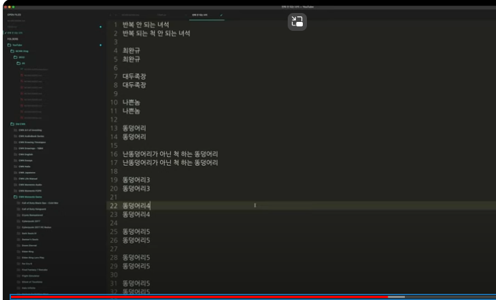

- 패턴이 반복되는걸 생각해보자. 이건 두 줄 중 한 줄은 남겨야 하는거니까, 괄호를 친다는 의미는 써먹겠다는 의미지. 괄호로 찾아낸 패턴을 나중에 써먹겠다는 의미잖아. *path finder*에서 `$` 기호로 사용한 것과 같은 의미인데, 여기서는 escape 문자 `\`를 써야 한다. 그게 일반적으로 쓰는 방법이다. 

- 괄호를 쓰고, `()` 어떤 문자가 `(.)` 몇번이나 반복되더라도 `(.+)` 이런걸 머리를 굴리면서 쓰는 거다. 컴퓨터와 대화를 하면서. 그러면 다 선택된다. 

    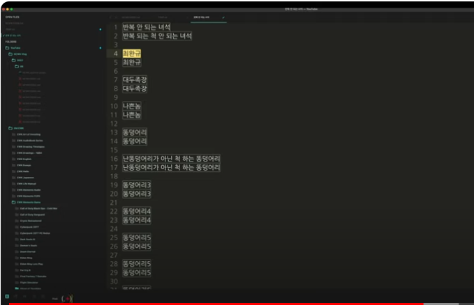

- 그런데 내가 원하는 패턴은 제외를 해야 되잖아. '반복 안 되는 녀석', '반복 되는 척 안 되는 녀석' 이런 패턴은 중복되는게 아니잖아. 그런데 중복되는 것들은 가운데 New Line 문자가 있으니까, `(.+)\n\1` 로 쓰면 된다. `\` 쓰고 `1`이라는 것은 이 앞에서 첫번째 괄호 패턴에서 찾아낸걸 재활용하겠다는 뜻이거든. 그럼 이제 날려야 하니까 replace에서 날리면 된다. replace에서 `\1` 로 하면 된다. 반복되는걸 두개를 찾았고, 그 중 하나만 날려야 하니까, 그리고 뉴라인 문자를 쓴다. 즉, `\1\n` 이 되겠지. 그러면 두번째 것이 다 날라간다.

- 그런데 이제 new line 문자가 보기 싫고, 위에 '반복 안 되는 녀석', '반복 되는 척 안 되는 녀석' 저건 살아남았고, 줄바꿈 문자가 계속 반복돼서 보기 싫으니까 정리해보자. 줄바꿈 문자가, `\n`, 몇개가 반복되든 `\n+` 하나로 퉁쳐라. replace에서 `\n`으로 알려주는 거다. 컴퓨터와 정규식으로 대화를 하는거지. 그럼 이런 문서가 나온다.

    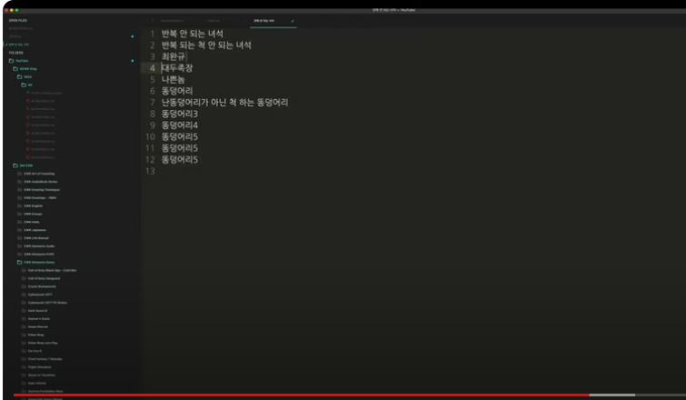

## ***Conclusion***

- 이게 백만건이 있다고 하더라도. 이걸 손으로 한다면 손으로 하는걸 보여드리겠다. 그건 사람이 할 짓이 아니잖아. 호모 사피엔스라면 그런 짓을 하면 안되지. 

- 늘 말씀드리지만 전 여러분에게 자극만 드릴 수 있다. 움직이느냐는 여러분 마음이고 선택이다. 딱 보셔도 활용만 가능하다면 24 x n 값이 폭증하지 않을까요. 전 매일 쓴다. 텍스트가 필요한 곳이면 어디든지. 오늘도 썼던 것들이다. batch rename도 했었고. 바꿔야할 파일 이름들이 한두개가 아닌데, 일일이 손으로 어떻게 바꾸겠어. 

- 그리고 이런 문서들도 계속 만든다면 저렇게 regular expression으로 바꿔야하는 일을 굉장히 많이 하겠지. 저는 유튜브 문서들도 이렇게 다 모아놓는다. 파일 설명란에 집어넣는 내용들. 굉장히 많이 사용한다. 1,800개 문서가 넘는다. 빅뱅 preset 1에 올라있는 파일들이 1,800개가 넘는다. 나중에 이 문서 내용을 바꾸고 싶다면, 일일이 손으로 바꿀 수가 없다. 

- sublime text가 좋은게 찾고 바꾸기 기능을 폴더별로 바꿀 수도 있고, root에서 subfolder까지 다 바꿀 수 있다. 한꺼번에 전부 바꿀 수 있다. 어떤 내용이든. 한계가 없다. 텍스트를 소스 코드로 생각해서 찾고 바꾸기를 regular expression으로 하면 무한 가능성으로 가공한다. 그리고 나서 GitHub을 사용하는 것.

- 깃헙을 유료나 무료로 사용할 수 있는데, repo의 개수와 private 리포 사용 여부에 차이가 있다. 아까 보였던 블러드본 스토리 공략 같은거 계속 버저닝을 하면서 깃헙에 올려놓는다. 프로그래밍 소스 코드처럼. 버저닝한다는건 non-destructive한 작업을 의미하잖아. step backward, step forward 할 수 있지. branching도 가능하고. 그게 깃헙 versioning의 장점이다.

- versioning을 안하면서 글을 쓴다면 뻘짓이다. destructive work flow니까. 내가 수정한 기록이 없잖아. 그 역사가 남아있지 않는거고. 남아있다면 step backward/forward를 할 수 있다. 그걸 github으로 활용하는거지. 그리고 나서 깃헙에 push를 하는 것. Mac 안에도 깃헙이 있고, 터미널 또는 sublime text를 만든 merge 프로그램을 사용하기도 한다. 버전 마다 어떤 내용을 수정했는지를 보면서 commit을 할 수 있다. commit을 하고 push를 하면 올라간다. 그러면 sync가 된거지. back up을 하면서 versioning을 하는 것. 

- 글에 versioning을 하면서, 언제든 reverting을 할 수 있는, 이전 단계로 돌아갈 수 있고, branching을 할 수 있는. 브랜칭 개념도 중요하다. 메인을 살려두면서 샛길로 가보는거다. 샛길로 가봤는데 좋다면 main과 합치는 것. 컴쟁이들은 이걸 많이 한다. 

- 텍스트를 코딩 소스로 생각하면 코딩 툴을 전부 가져다 쓸 수 있다. sublime text의 파워는 무한이다. 저는 그래서 sublime text에 plug in을 만들 수 있거든. python을 지원하니까. 끼워넣을 수 있다. cwk writing toolkit 이런걸 만들어서 쓴다. 이런게 coding을 할 수 있으면 무한으로 확장할 수 있는 거지. sublim text를 자기 입맛에 맞게 바꾸는 방법이지. 거기까지는 코딩을 안하면 매우 어려울 것.

- 그래도 sublime text에서 지원하는 regular expression만 사용하면서 텍스트 작업을 하면 수명이 100년이면 200년으로 살거다. 이건 믿거나 말거나도 아닌 팩트다. 오늘 보여준걸 손으로 한다고 생각해봐. 가장 중요한건 수작업할 때 삑사리가 난다는거다. 신뢰도가 확 떨어질 것. 이걸 컴퓨터 한테 시키면 삑사리 가능성이 거의 0다. 거들떠봐라. 시간 없다는 소리를 안하는 방법 중 하나다.

    > 늦었다고 생각할 때가 가장 빠른 법이겠죠😂 제가 웃는게 웃는게 아닙니다.