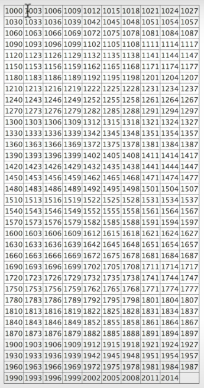
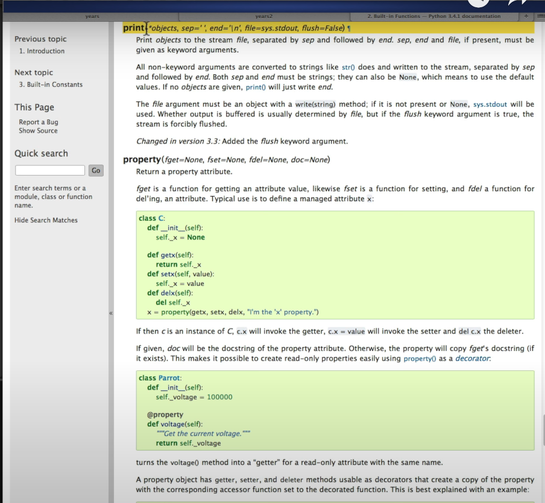
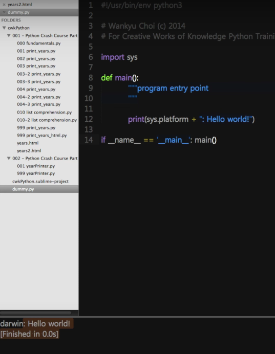
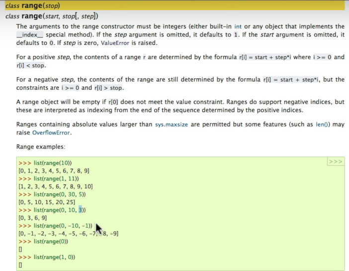
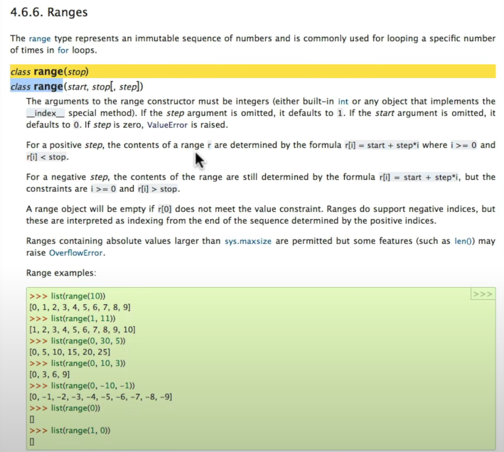
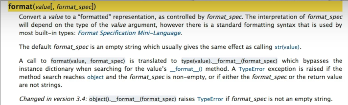
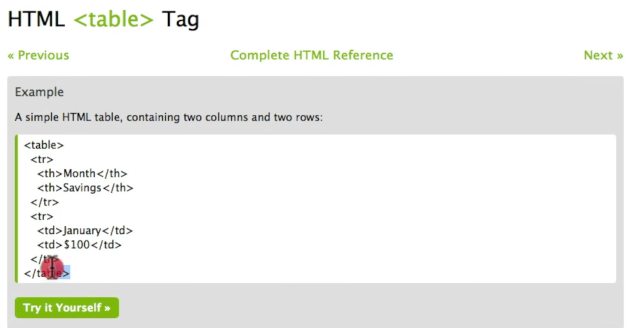

# 파이썬 속성강좌

**영상링크 : https://youtu.be/5c5rooYSXbs**

**대두족장 Python 속성 강좌 소스 : https://github.com/neobundy/cwkPython**

## ***Intro***

- 무려 2014. 5.에 올렸던 파이썬 속성 코스 재편집본이다.

- 내용은 크게 다르지 않고, 따로 손을 대지도 않았다. 배경음악이 거슬린다는 분들이 있어 음악 빼고 잡음 제거하고, 화질만 4k로 업스케일링.

- 속성 파이썬 강좌로는 지금봐도 크게 부족하지 않다고 생각한다. CWK Memento Python 시리즈 보기 전에 예습해두면 튼실한 토대가 되리라 믿는다. 

## ***Python 프로그램의 기본 구조***

- 오늘부터 본격적으로 Python Programming을 배워보겠다. 

- 페이스북 페이지에서는 연습문제를 드렸다. **1,000년에서 2,014년까지 3년씩 건너 뛰면서 한줄에 10개 연도씩 기재된 테이블을 만드는 것**이다. 사진으로는 아래와 같다. 여러분은 이걸 어떻게 만드시겠는가.

    

- 3년씩 또는 1년씩 건너뛰면서 기재되도록 할 수도 있다. 아니면 1,500년에서 2,014년 또는 1년에서 2,014년이 될 수도 있고, column이 10개가 아니라 25개가 될 수도 있고. 이걸 일일이 손으로 작성하시는 분들도 있겠지만, 만약 1년에서 2,014년까지면 어떻겠는가. 인간이 할 수 있는 짓은 아니다. 이걸 인간이 해야한다면 컴퓨터를 사용할 이유가 없다. 당연히 컴퓨터가 해야할 일이다. 컴퓨터에게 일을 시켜야 한다. 컴퓨터에게 일을 가장 시킬 수 있는 방법이 바로 programming이다. 차근차근 배워보자.

- programming을 하려면 기본 소스코드가 필요하다.

    ```python
    import sys

    def main():
        """ program entry point
        """

        print(sys.platform + ':Hello world!')
    ```

- `def main` 블럭 안에서 프로그램이 돌아간다. 프로그램이 시작하면 출발절이 바로 `def main`이다. 이 프로그램이 실행됐을 때 `main`을 가장 먼저 실행하라는 의미. 모듈이라는걸 배워야 구체적 의미를 알게 되지만, 일단 그 정도로만 생각하자. 

- `import sys`라는 건 `sys`라는 모듈을 `import`, 즉 가져다 쓰겠다는 의미다. 왜 가져다 쓰냐면, `sys.platform`이라고 하면, 내가 사용하는 운영체제 이름을 알 수 있기 때문이다. 어떻게 운영체제 이름을 알 수 있냐면, `sys`라는 모듈에 정의가 되어 있다. 남이 만들어놓은걸 그냥 가져다 쓴다고 생각하면 된다.

- `print` 함수는 뭔가를 출력해주는 함수다. 

- `print` 함수를 어떻게 사용할 수 있는지는 reference : 참고서/설명서를 활용해보면 된다. 구글링을 해보거나, 가장 좋은 방법은 파이썬 공식 문서를 찾아보는 것. 

    > python 공식 홈페이지 활용. 자신이 사용하는 python 버전에 맞는 documentation을 찾아보면 됩니다.

- 예컨대, `print` 함수를 알고 싶다면, quick search에서 `print`를 검색한다. print built-in function이라면서 설명이 자세히 나온다. 기본적인 사용법은 'signature'라는 부분을 활용하면 된다. 가장 먼저 object라는 부분이 내가 출력하고 싶은 부분이고, 그 다음에 separator는 뭔지, end는 뭔지가 쭉 나온다.

    

    > `print(*objects, sep=' ', end='\n', file=sys.stdout, flush=False)`

- 그 중 `end`만 보겠다. '내가 출력하고 싶은 것을 출력하고 나서 끄트머리에 뭘 넣을까'에 관한 내용이다. 기본적으로는 '개행문자'가 들어가 있다. `n`은 New Line을 의미한다. 

    > `new line character=Enter/Return key.`  
    > `end='\n'`

- `\`는 escape 문자라고 한다. 이것에 대해 궁금하면 다른 자료들을 찾아보라. 'escape'니까 탈출했다는 뜻. 원래의 의미, 기본적으로 갖고 있는 의미에서 탈출했다는 의미. `\n`을 이라고 하면 `n`이라는 문자의 기본 의미에서 탈출했다는 의미.

- escape가 왜 탈출의 그림이냐면, cape가 망토다. es는 ex라는 어원에서 온 것이므로 망토에서 벗어난다는 의미다. 누가 날 쫓아와서 내 망토를 잡은 상황에서 도마뱀이 꼬리를 자르듯 망토를 버리고 도망가는 그림.

- 위 코드를 실행하면 다음과 같이 나온다.

    `darwin : Hello world!`  
    `[Finished in 0.0s]`
    
- 제 운영체제는, `sys.platform'이 darwin이기 때문에 위와 같이 출력됐다. 여러분이 윈도우등 다른 운영체제를 사용하면 다르게 나오겠지. mac os 10에서는 darwin이라고 나온다. 

- `end='\n'`은 엔터를 한번 치는 효과가 있는 것. 이번에는 엔터 대신 아무것도 집어넣지 말라고 해보겠다.

    ```python
    import sys

    def main():
        """ program entry point
        """

        print(sys.platform + ':Hello world!', end='')
    ```

- 개행문자가 사라졌으므로 엔터를 친 효과가 없어진다. 또다른 escape 문자를 쳐보자. `\t`는 탭을 의미한다.

    ```python
    import sys

    def main():
        """ program entry point
        """

        print(sys.platform + ':Hello world!', end='\t')
    ```

- escape와 어떤 문자를 조합해도 상관 없다. 예를 들어 `-----------`를 넣어도 된다. 그럼 이렇게 나온다

    `darwin : Hello world!-----------[Finished in 0.0s]`

- 즉, 내가 원하는 내용을 print를 하고 나서 그 끄트머리에 뭘 넣을 것인가에 관한 사용법이다.

- 이렇게 배워나가면 된다. 이걸 까먹었다고 해도, 참고문서, reference를 보거나 다른 사람의 code를 가져와서 사용하면 된다.

    - ***모든 프로그래머들이 위와 같은 코드를 전부 머리에 기억하고 있는 것이 아님을 기억해라***

    - 가장 중요한건, 지난번에도 강조했지만, **Reading Comprehension(독해)** 다. 

    - 남의 소스 코드를 읽고, 활용해서 build on하거나 수정해서 내가 원하는 방향으로 끌고가면 그만이다. 영어 글을 읽었는데 이해가 안되면 사전 등을 찾아보는 것과 마찬가지다. 예를 들어 위와 같이 남의 `print` 코드 활용 예시를 봤는데, `end`가 뭔지 궁금하면 찾아보면 된다. 

        > python3부터는 print가 statement가 아니라 (built-in) function입니다.

        > 최근에는 GPT 같은 LLM이나 Copilot의 등장으로 더욱 쉽게 찾아볼 수 있겠습니다. 물론, 완벽한 정확도라고는 할 수 없지만, 이전에 비하면 굉장히 편리해진건 사실인듯 합니다.

    - 프로그램을 독해하는 능력을 꾸준히 늘려가는 것이 여러분들의 프로그램 실력이다.

- 어쨌든 위와 같은 코드 구조가 기본적인 골격이다. 저는 Sublime Text에서 빌드하는 시스템을 사용하고 있어서 바로 아래에 결과가 나오지만, 이 프로그램을 command line에서 실행할 수도 있다.

    

- 터미널을 열어서 아래와 같이 입력하면 실행파일을 만들겠다는 것이고,

    ```python 
    chmod +x dummy.py
    ```

- 실행해보면,  

    ```python
    ./dummy.py
    ```

- 다음과 같이 나온다.

    `darwin : Hello world!`

    - 이렇게 나올 수 있는 이유는, 아까의 sublime text 창 맨 위에 보면 'shebang line'이 있는데, shebang이라는 말은 영어에서 '몽땅 다', '전부 다'라는 의미다. ex) She wants the whole shebang. 원래 컴쟁이들이 말장난을 잘 한다. 

    - shebang line을 보면, 주석이 있는데, 주석은 interpretrer 프로그램을 실행할 때 실제 실행되지 않고 무시하는 라인이다. 설명을 달기 위한 것이다. 맨 앞의 `#`는 pound sign이라고 하거나 hash 문자라고 하는데, 이렇게 우물 정자를 쓰면 'comment' 처리하겠다는 의미다.

    > """ 와 같은 인용부호 3개를 쓴 것도 주석입니다. 함수 바로 아래 쓰면 docstring 기능을 합니다. 

    - 맨 윗줄을 보면, `#!/usr/bin/env python3`이라고 되어 있는데, `#`(hash)+`!`(bang)=shebang이라고 한다. ex) hey!!!!!를 hey bang bang bang bang bang 이라고 읽는다. 

    - shebang 라인을 이용하면 어떤 인터프리터를 사용해서 실행할지를 알려줄 수 있다. 그래서 command line에서 실행할 때 shell이 두문자 라인을 읽어들여서 이 소스 코드를 어떤 프로그램을 이용해서 실행할지 결정하게 되는 것.

    - 그래서 아래와 같이 command line에서 실행하면 `#!/usr/bin/env python3`을 읽어들여서 Python3를 실행하게 된다.

        ```python
        ./dummy.py
        ```

- 그래서 여러분들이 위의 기본 골격을 그대로 가져가 사용하시면 되고, `print(sys.platform + ':Hello world!')` 라인부터 코드를 수정해서 사용하면 된다. 예컨대, 아래와 같이 수정해서 쓸 수도 있다.

    ```python
    import sys

    def main():
        """ program entry point
        """

        print('hey!!!@@')
    ```

- 그래서 다른 사람들의 소스 코드를 보면 어떤 부분을 수정해야할지 알 수 있게 된다.

## ***Loops & Conditionals(뺑뺑이 돌기와 조건 분기)***

- 아까의 문서를 다시 보자. 1,000년부터 2,014년까지 한줄에 열개씩 3년씩 건너뛰면서 출력한 문서. 

    

- 이걸 수작업을 한다고 생각해보자. 1,000년에서 출발해서 2,014년까지 뺑뺑이를 돈다고 생각해볼 수 있다. 마치 우리 인생처럼. 그리고 3년씩 건너뛴다는 사실을 유념해야겠지. 그리고 한줄에 10개째 도달하면 줄바꿈을 해야된다.

- 'Loop와 조건'이 프로그래밍에서 가장 중요하다. 뺑뺑이를 돌면서 조건에 맞는지 아닌지를 판단하는 구조. 그래서 조건에 맞으면 A라는 작업을 하고, 조건에 맞지 않으면 B라는 작업을 하는 식. A, B, C, D 작업이 정해져 있겠고. 이건 마치 인생과 같다. 아래와 같은 프로그램을 돌려보자. 80년 동안 사는데, 어떤 해는 좋은 해였고, 어떤 해는 나쁜 해였다. 쭉 내려가다보면, 결국 죽는다. 34년은 괜찮았고, 나머지 46년은 나빴다는 것. 전반적으로 내 인생은 개판이었다는 의미. 계속 실행하면 전반적으로 좋았던 인생인지 나빴던 인생인지가 random하게 나온다. 딱 40년 나빴다면 40년 좋았던 것이므로 average가 되어서 참 지루한 인생이 됐겠지.

    ```python
    import random

    def good():
        print('I had a good year')

    def bad():
        print('I had a bad year')

    def main():
        """ program entry point
        """

        lifespan = 80
        age = 1
        good_year_count = 0

        while age <= lifespan:

            print("I'm {age} year(s) old".format(age = age))

            goodyear = random.choice([True, False])

            if goodyear:
                good_year_count += 1
                print('I had a good year')
            else:
                print('I had a bad year')

            age += 1

        print("I'm dying. I had {} good years in my entire life."format(good_year_count))

        bad_year_count = lifespan - good_year_count

        if bad_year_count == good_year_count:
            print("My life was boring.")
        elif bad_year_count < good_year_count:
            print("My life was good.")
        else:
            print("My life was bad.")
    ```

- 아까 처음에 보여드렸던 기본 골격과 같다.

### ***블럭(block) 지정 - 들여쓰기(indentation)***

- 파이썬이 다른 언어들과 굉장히 다른 특징 중 하나가, 들여쓰기다. 다른 프로그램들은 아래와 같이 블럭을 지정한다. 즉, curly braces를 쓰고 안에 들어가는 내용이 블럭이라고 한다.

    ```python
    {

        contents

    }
    ```

- 그런데 파이썬은 들여쓰기를 해서 블럭을 지정한다. 아래의 코드를 언뜻 봐도 `def main()`과 그 아래의 `print`는 레벨이 다르다. 한번 들여쓰기를 하면 그 부분이 동일 블럭이라는 의미가 된다. 

    ```python
    import sys

    def main():
        """ program entry point
        """

        print(sys.platform + ':Hello world!', end='\t')
    ```

- 두번 들여쓰기를 하면 레벨이 두단계 아래가 되고, 세번하면 세단계 아래가 된다. 

    ```python
        def main():
            """ program entry point
            """

            lifespan = 80
            age = 1
            good_year_count = 0

            while age <= lifespan:

                print("I'm {age} year(s) old".format(age = age))

                goodyear = random.choice([True, False])
    ```

- sublime text에서는 code folding 기능이 있어서, 블럭을 통째로 접어주는 것이 가능하다. 

    > 거의 모든 에디터와 IDE에도 있는 것 같습니다.

- 언뜻보기에 들여쓰기가 원시적으로 보이지만, 괄호를 사용하는 프로그램 언어를 써보면 이게 얼마나 획기적이고 가독성이 좋은지 알게 된다. '뭘 이렇게 엄격하게 들여쓰기까지 하나'라고 생각하실 수도 있는데, 짜증나는 일이 아니라 정말 편한 방법이다. 

### ***함수 정의***

- 함수를 정의하기 위해선 `def` (=define)를 쓴다. `main`이라는 함수를 정의하기 위해서는, `def main():`을 쓰면 된다. 

- `good` 함수를 정의하기 위해선, `def good():`, `bad` 함수를 정의하기 위해선 `def bad():`를 쓰면 된다.

- 그리고 그렇게 정의를 해준 후에 한블럭 들여쓰기를 해서 내용을 넣어주면 '이 함수는 이런 일을 하는 것'이 된다.

- 함수를 정의하는 이유는 가독성도 높일 수 있지만, 재활용을 할 수 있기 때문이다. 맨 처음에 `import random`을 했는데, 이 역시 `random`이라는 모듈을 가져다 쓸 수 있거든.

    ```python
    import random

    def good():
        print('I had a good year')

    def bad():
        print('I had a bad year')

    def main():
    ```

### ***프로그램 독해***

- 늘 프로그램 독해력을 길러야 한다. 아래 코드를 한번 읽어보자.

    ```python
    import random

    def good():
        print('I had a good year')

    def bad():
        print('I had a bad year')

    def main():
        """ program entry point
        """

        lifespan = 80       # 80년까지 산다
        age = 1     # 현재 나이는 1살에서 출발
        good_year_count = 0     # 좋은 해가 몇 번있었는지를 count할 건데 0에서 시작.

        while age <= lifespan:      # 나이가 80년 이하일 때까지 뺑뺑이를 돌겠다. 그런데 while 다음 줄 부터는 들여쓰기를 했기 때문에 while 블럭 안 까지만 뺑뺑이를 돌겠다는 의미다. 그래서 아래의 `age += 1` 라인까지만 해당된다. while 다음 부분은 뺑뺑이를 계속 돌게 되는 조건이고, 그 조건을 벗어나면 while 뺑뺑이를 벗어나게 된다. age가 lifespan보다 작거나 같을 때까지만 돌겠다는 의미다. 따라서 age가 80이 되면 뺑뺑이를 벗어나게 된다.

            print("I'm {age} year(s) old".format(age = age))      # 가장 먼저 지금 몇살인지를 출력하겠다

            goodyear = random.choice([True, False])     # 좋은 해가 될지 나쁜 해가 될지를 랜덤하게 결정하겠다. 아까 import한 random 모듈을 활용해서 choice. `choice`는 [] 안에 있는 것들 중 하나를 랜덤하게 골라주는 함수다. 여기서는 True, False 중 하나를 골라주겠다는 의미다. Python은 대소문자를 가리므로, `true`가 아니라 `True`로 써야한다(Sublime Text 설정 파일을 건드리다 보면 `true`가 나오는데, 그건 JSON 파일 형식이라 그렇다. python이 아니다).

            if goodyear:        # 만약 `goodyear`가 `True`라면
                good_year_count += 1        # `good_year_count`를 1 증가시키겠다
                print('I had a good year')  # 그리고 "I had a good year"을 출력하겠다. 그런데 우리가 위에서 `good()` 함수를 정의했기 때문에, 이 대신 `good()` 함수를 가져다 쓸 수도 있다. `print('I had a good year)`대신 `good()`을 쓰면 된다. 이래서 함수를 정의하면 여러번 가져다 쓸 수 있으므로 편하다. 
            else:       # '만약 `goodyear`가 False라면'을 의미한다. 만약 조건이 여러개라면 `elif`를 `if`와 `else` 사이에 추가해줄 수 있다. 여러개를 쓸 수도 있다.
                print('I had a bad year')   # "I had a bad year"을 출력하겠다. 마찬가지로 위에서 정의했던 `bad()` 함수를 가져다 쓸 수도 있다. `bad()`을 쓰면 된다.

            age += 1      # 그리고 한 살을 먹게 된다. 이 코드는 `age = age+1`를 간단하게 쓴 것. idiom.

        print("I'm dying. I had {} good years in my entire life.".format(good_year_count))      # 그리고 age가 lifespan보다 커지면서 while 블럭을 벗어나면, 즉 죽으면 몇번의 goodyear이 있었는지를 출력하겠다.

        bad_year_count = lifespan - good_year_count      # 그리고 수명에서 good year count를 빼주면 bad year count가 나온다. 

        if bad_year_count == good_year_count:       # 만약 bad year count와 good year count가 같다면
            print("My life was boring.")      # "My life was boring."을 출력하겠다.
        elif bad_year_count < good_year_count:      # 만약 bad year count가 good year count보다 작다면
            print("My life was good.")      # "My life was good."을 출력하겠다.
        else:       # 만약 bad year count가 good year count보다 크다면
            print("My life was bad.")       # "My life was bad."을 출력하겠다.
    ``` 

- 이렇게 프로그램을 읽어보면 어떤 일이 일어나는지 알 수 있게 된다. 

    > I'm 1 year(s) old  
    > I had a bad year  
    > I'm 2 year(s) old  
    > I had a good year  
    > I'm 3 year(s) old  
    > I had a bad year  
    > ...  
    > I'm 79 year(s) old  
    > I had a good year  
    > I'm 80 year(s) old  
    > I had a bad year  
    > I'm dying. I had 39 good years in my entire life.  
    > My life was bad.

- 위 내용만 이해하셔도 가장 기본적인 구조는 이해하신 것. 뺑뺑이를 돌면서 조건에 맞는지 아닌지를 판단하는 구조다. 그게 전부다.

### ***사례 적용***

- 우리의 목표인 아래 문제에 일부 적용해보자.

    

- 역시 마찬가지로 아래와 같은 기본 골격(dummy.py)에서 `print` 부분만 수정하면 된다.

    ```python
    import sys

    def main():
        """ program entry point
        """

        print(sys.platform + ':Hello world!', end='\t')

    if __name__ == '__main__':
    ```

- 아래와 같이 바꿔보자.

    ```python
    import sys

    def main():
        """ program entry point     # 프로그램 진입점
        """

        start = 1800     # 'start'를 1800으로 정의
        end = 2014      # `end`를 2014로 정의

        year = start     # 시작 년도는 1800

        # while 뺑뺑이를 돌겠다. 그런데, 2014년까지 돌겠다는 의미
        while year <= end:     # 현재 년도가 끝 년도보다 작거나 같을 때까지 뺑뺑이를 돌겠다.
            print(year)     # 현재 년도를 출력하겠다. 기본이 '개행문자'가 삽입되어 있기 때문에, 한줄에 하나씩 출력된다. 만약 `end='\t'`를 추가하면, 탭으로 구분되어 출력된다.
            year += 1      # 한바퀴 돌고 나면 시작 년도를 1살 더 먹겠다.

    if __name__ == '__main__':
    ```

- 위와 같이 `while loop`를 사용하는 것이 가장 기본적으로 loop를 도는 방법이다.

- loop와 조건이 가장 중요한 프로그램 개념임. `if`라는 것이 조건이라는 말도 쓰지만, 경우의 수라는 말도 쓴다. 어차피 조건에 맞는지 여부는 경우의 수 개념이기 때문

    > 조건에 따라 코드가 갈라지기 때문에 '분기'라는 말도 쓴다.

### ***if와 else 구문***

- 이번엔 if와 else 구문을 살펴보자. `if` 블럭은 조건이 맞으면 실행하고, `else` 블럭은 조건이 맞지 않으면 실행. 아래와 같은 코드를 독해하면서 짬밥을 쌓아갈 수도 있다. 복잡한 것은 별도로 '알고리즘(Algorithm)'이라고도 하는데, 여기 나오는 간단한 정도는 '알고리즘적 idiom' 정도라고 말할 수 있다.

- Operands(연산자) : *(곱셈), /(나눗셈), +(덧셈), -(뺄셈), %(나머지) 등등

    > 기본을 탄탄히 쌓고 싶다면, '알고리즘(Algorithm)'과 '데이터 구조(Data Structure)'를 공부하는 것이 좋습니다.

- 아래의 코드를 보자. 이걸 짤 수 있다는게 중요한 것이 아니라, 읽고 독해할 수 있는 능력이 중요하다.

    ```python
    import sys

    def main():
        """ program entry point     # 프로그램 진입점
        """

        start = 1000
        end = 2014
        step = 3        # 3년씩 건너뛰겠다. 2년씩 건너뛰려면 `step = 2`로 하면 된다.
        per_line = 10   # 10개씩 출력하겠다. 20개씩 출력하려면 `per_line = 20`으로 하면 된다.

        year = start
        count = 1
        while year <= end:
            if count % per_line == 0:     # count 해봤더니 그 값을(개수를) `per_line`(여기서는 10으로 정의)으로 나눴을 때 나머지가 0이 된다면(10의 배수가 된다면 - 10, 20, 30, 40, 50, 60, 70, 80, 90, 100), 
                print(year, end='\n')    # year 값을 출력하고 줄바꿈을 한다.
            else:
                print(year, end='\t')    # count 해봤더니 그 값이(개수가) 나머지가 0이 된다면(10의 배수가 아니라면), 탭으로 구분하겠다.
            year += step
            count += 1

    if __name__ == '__main__':
    ```

- 컴쟁이들이 잘하는 짓이, shorthand를 쓰는 것. 축약을 잘한다. 요컨대, 위 코드 중 while 부분을 아래와 같이 쓸 수도 있다. 프로그램에 익숙해지기 전까지는 이런 shorthand는 자제하라. 뽀대는 나지만 가독성이 떨어지는 방법. 그렇다고 빠른 것도 아님. 소스 코드 작성 목표는 뽀대보다는 좋은 가독성을 목표로 해라. C 계통에서 `?`을 써가면서 축약하는 분들도 계시지만, 좋아 보이지 않는다.

    ```python
        while year <= end:
            end_char = '\n' if count % per_line == 0 else '\t'      # 만약 count가 per_line의 배수라면, `end_char`라는 변수를 '\n'으로 정의하고, 그렇지 않으면 '\t'로 정의
            print(year, end=end_char)

        year += step
        count += 1
    ```

### ***for loop & iterators를 살펴보자.***

- iterate라는 동사 자체가 뺑뺑이를 의미한다. 따라서 iterator라는 단어는 '뺑뺑이를 돌게 도와주는 뭔가'라고 볼 수 있겠지. reiterate라고 쓰면, 자꾸 되풀이하는걸 강조해서 말하는 의미. ex)He reiterated his opposition.

- for, range 함수는 range 안에 포함된 원소 개수만큼 뺑뺑이를 돈다.

    ```python
    year = start
    count = 1
    for year in range(start, end+1):
        end_char = '\n' if count % per_line == 0 else '\t'
        print(year, end=end_char)
        count += 1
    ```

    - range라는 built-in 함수를 쓰지 않고 직접 만들어서 쓸 수도 있다. iterator라는 함수다.

        ```python
        def my_year_range(start, end, step=1):      # start에서 시작해서 end에서 끝나고, step만큼 건너뛰겠다. step 값을 지정하지 않으면 기본값은 1
            """
                iterator should yield resulting values 
            """

            result = start
            while result < end:     # 뺑뺑이를 도는데, result가 end보다 작다는 조건을 만족시키는 동안 while 블럭의 뺑뺑이를 돌겠다.
                yield result        # result를 출력하겠다.
                result += step     # 그 다음은 result를 step만큼 더해서 다시 뺑뺑이를 돌겠다.
        ```

    - yield와 return의 차이 : 위 코드에서 `yield`는 result를 출력하고 나서도 그 아랫 라인까지도 계속 실행하면서 뺑뺑이를 돈다. 즉 다음 번에는 result 값에 step을 더한 값으로 뺑뺑이를 돈다. 그런데 아래 코드에서와 같이 `return`은 result를 출력하고 나서 count를 올려주는 아랫 라인으로 안 넘어가기 때문에 뺑뺑이를 돌지 못해서 bug가 생긴다.

        ```python
        def my_year_range_with_bug(start, end, step=1):
            """
                iterator should yield resulting values
            """

            result = start
            while result < end:
                return result

                # the following line will never run
                result += step
        ```

    - 그래서 위 코드를 실행하면 아래와 같이 오류가 뜬다.

        > TypeError: 'int' object is not iterable

    - 즉, 위 코드가 돌려준 `integer`, 정수 객체는 뺑뺑이 돌 수 없다는 의미다. 뺑뺑이를 돌려면 list가 넘어와야 한다. 여러개의 원소를 포함하고 있는 list가 있어야 뺑뺑이를 돌 수 있거든. 

        ```python
        start = 1800
        end = 2014
        step = 1
        per_line = 10

        year = start
        count = 1
        for year in range(start, end+1):
            end_char = '\n' if count % per_line == 0 else '\t'
            print(year, end=end_char)

            year += step
            count += 1
        ```

    - 다시 위 코드를 보면, `for` 함수는 `range` 안에서 뺑뺑이를 돌면서 하나씩 꺼내 쓰는 것이다. start = 1800, end = 2014라는 range 안에서 1 step씩 건너뛰면서 하나씩 꺼내서 뺑뺑이를 도는 방법.

### ***custom function***

- 위와 같이 function definition을 계속 쓰고 있는데, custom function을 쓰면 굉장히 가독성이 좋아진다. 아래 코드를 보자. 위의 코드보다 훨씬 간단하게, 함수를 print_years라는 이름으로 정의해서 아주 간단하게 쓸 수 있다.

    ```python
    def print_years(start, end, step=1, per_line=10):

        year = start
        count = 1
        for year in range(start, end+1):
            end_char = '\n' if count % per_line == 0 else '\t'
            print(year, end=end_char)

            year += step
            count += 1
    ```
    ```python
    def main():
        """ program entry point
        """

        print_years(1800, 2014, 1, 10)

    if __name__ == '__main__':
    ```

- 위 코드에서 argument를 넘겨주면, 아래 코드에서 parameter로 받는다. 두 단어는 같은 의미고, 관점만 다르다.

- **note** : 함수의 기본은 $y = f(x)$. $x$ 값을 넘겨주면 함수가 어떤 일을 해서 $y$ 값을 돌려준다. $x$와 같은 argument는 복수가 될 수도 있다. 즉, $y = f(x, z)$처럼. 여러 인자를 넣을 수 있다.

    > 엄밀히 말하면, `함수`는 값을 돌려줘야 합니다. 돌려주지 않으면 procedure/subroutine이라고 합니다. 
    
- 예컨대, `print_years(1800, 2014, step=3, per_line=5)`와 같은 함수 역시 위의 설명처럼, 4개의 인자를 블랙박스 안에 넣어서 처리가 되어 값을 돌려받는 것이다.

    - 위 함수의 세번째, 네번째 인자에는 keyword argument가 들어간다. 

    - 첫번째 코드에서 아래와 같이 정의하였고,

        ```python
        def print_years(start, end, step=1, per_line=10):
        ```

    - 두번째 코드에서는 위의 코드의 인자 순서대로 넣어주는 것

        ```python
        print_years(1800, 2014, 1, 10)
        ```

        - 만약 step과 per_line을 지정해주지 않는다면, 첫번째 코드에서 지정해준 것과 같이 기본값을 사용하게 된다.

- 위와 같은 내용을 이해하고서 코드를 들여다보면 구조와 의미를 이해할 수 있게 된다. 이걸 이해하면, `객체지향성`까지 이해할 수 있는 토대가 된다. 세상 자체가 객체지향적이다. 학습 자체를 객체지향적으로 해야 한다. 하나를 알면 열을 알게 되는 것이 객체지향의 원리다.

- 만약 '`range`를 모르면 어떻게 해야하는가'라는 의문이 들 수 있는데, document를 찾아보면 된다. range라는 클래스의 사용방법과 signature를 볼 수 있다. 모르는 영어 단어가 나오면 구글링을 하거나 사전을 찾아보면 되는 것과 똑같다. 

    

    > GPT와 같은 LLM 또는 copilot에게 물어볼 수도 있겠습니다.

    > 영어와 마찬가지로 프로그래밍도 많이 읽을수록 실력이 좋아집니다.

- List는 따로 공부하셔라. range 안에 뭐든지 넣을 수 있다. 하다못해 문자열도 iterator로 활용 가능하다. 상상력을 발휘해보자.

## ***Data Types & String Formatting***

- 2014와 "2014"는 data type이 다르다. 2014은 integer(정수), "2014"은 string(문자열), 2014.0은 float(부동소수점)다.

    > floating point number = real number

    ```python
    print(type(2014))
    print(type("2014"))
    print(type(2014.0))
    ```

    - 위 코드의 출력은 아래와 같다.

    > <class 'int'>  
    > <class 'str'>  
    > <class 'float'>

- 아래의 코드를 보자.

    ```python
    year = 2014
    type(year)
    ```

- 위 코드의 출력은, `<class 'int'>`인데, `str(year)`를 입력해주면, `'2014'`이라는 문자열이 출력된다. 즉, 변수의 유형을 변환해주는 것(typecasting). integer를 string으로 변환해주는 것.

- 파이썬에서 데이터 타입은 객체다. 객체지향성을 갖고 있기 때문에, 나중에 객체지향성에 대한 설명을 듣고 이걸 보면 이해하기 쉬울 거다. 지금은, 데이터 타입을 비롯한 모든 변수는 객체라고만 생각하면 된다.

- range에 관한 document를 봐도, 다음과 같은데

    

    - range가 `class`라고 되어 있다. class는 객체를 만들어내는 거푸집 같은 것이라 생각하면 되는데, `range` 역시 class이므로 객체를 만들어내는 거푸집 같은 것이라 이해하면 되겠고 integer, float, sting 등등도 모두 class로 되어 있다.

- 모든 객체는 다음의 두 가지로 설명할 수 있다.

    1. Property(속성)
    2. Method(행동)(or Behavior)

    - 객체는 생명체라고 할 수 있는데, 모든 생명체는 속성과 행동으로 설명 가능하다.

    - 즉, `이름`이라는 property. e.g., person.name = 최완규 // 말을 하는 행동. e.g., person.speak()

- `string` 역시 객체이므로, Property와 Method를 가진다. 다음의 코드를 보자.

    ```python
    print("{} year(s) printed.".format(count-1))
    print("{0} year(s) printed: from {1} to {2}".format(count-1, start, end))
    print("{num} year(s) printed: from {start} to {end}".format(num=count-1, start=start, end=end))
    ```

    - 각 줄에서 `string` 이라는 객체가 할 수 있는 행동으로 `format`들을 선언한 것이다.

    - 그리고 각 줄에서 format에 들어갈 argument들을 각각 넣어줬다.

    - `format`을 document에서 찾아보면 다음과 같다.

        

        그리고 다시 코드를 보자.

        ```python
        print("{} year(s) printed.".format(count-1))
        print("{0} year(s) printed: from {1} to {2}".format(count-1, start, end))
        print("{num} year(s) printed: from {start} to {end}".format(num=count-1, start=start, end=end))
        ```

        - 첫째줄에서는 `{}` 안에 아무것도 없기 때문에, `format` 함수 안에 있는 첫번째 argument가 그대로 들어간다.

        - 둘째줄에서는 `{0}`이라는 표현이 있는데, 이는 `format` 함수 안에 있는 첫번째 argument(parameter)를 가리킨다. 즉, `count-1`이 들어간다. 그 다음은 `{1}`이라는 표현이 있는데, 이는 `format` 함수 안에 있는 두번째 argument를 가리킨다. 즉, `start`가 들어간다. 마지막으로 `{2}`는 `format` 함수 안에 있는 세번째 argument를 가리킨다. 즉, `end`가 들어간다.

        - 셋째줄과 같이 keyword를 줄 수도 있다. 즉, `num`, `start`, `end`라는 이름으로 각각의 argument들을 넣어줄 수 있다.

    - Python 2와 3에서 formatting 방법이 다르다.

## ***List Comprehension***

- There's more than one way to skin a cat. 즉, 하나의 일을 여러 방법으로 할 수 있다는 의미인데, 정답이라는 것이 없다. while loop를 쓸 수도 있지만, iterator를 사용해서 for loop를 쓸 수도 있다. 별의별 방법이 다 있다. 복잡하지만, 요긴하게 쓸 수 있는 방법으로 `list comprehension`이 있다. 알고 나면 정말 별게 아닌데 다소 어렵다.

    > 컴쟁이 용어는 그냥 영어로 익숙해지세요. 어차피 대부분 우리말을 쓰지 않습니다.

- 아래의 코드를 보자. 다시 강조하지만, 코딩에서 가장 중요한 건 독해 능력이다. 독해를 영어로 comprehension이라고 하는데, List comprehension의 경우에는 그 의미가 약간 다르다. comprehension에는, 두가지 뜻이 있다. comprise(구성하다)와 embrace(포함하다). 여기서 List comprehension은 embrace의 의미다. 

    ```python
    def main():
        """ program entry point
        """

        years_to_print = [str(y) for y in range(1800, 2014, 1)]

        print(years_to_print)
        print("\n\n")
        print("".join(years_to_print))
        print("=".join(years_to_print))
        print("\t".join(years_to_print))
    ```
- List라는게 별게 아니다. 아래의 코드를 보자

    ```python
    nums = [1, 2, 3, 4, 5]
    ```
    - 위 코드는 1부터 5까지의 숫자를 포함하는 리스트를 생성한다. 하나 이상의 원소를 가진 '목록'을 만드는 것

    - List로 할 수 있는 일들이 많다.

        ```python
        nums[2:]        # Slicing : 일부를 잘라냄
        ```
    `[3, 4, 5]`를 출력

    - list 역시 객체이므로 property와 method를 갖고 있고, 별의별 method들이 존재한다.

        ```python
        dir(list)
        ```
        `['__add__', '__class__', '__contains__', '__delattr__', '__delitem__', '__dir__', '__doc__', '__eq__', '__format__', '__ge__', '__getattribute__', '__getitem__', '__gt__', '__hash__', '__iadd__', '__imul__', '__init__', '__init_subclass__', '__iter__', '__le__', '__len__', '__lt__', '__mul__', '__ne__', '__new__', '__reduce__', '__reduce_ex__', '__repr__', '__reversed__', '__rmul__', '__setattr__', '__setitem__', '__sizeof__', '__str__', '__subclasshook__', 'append', 'clear', 'copy', 'count', 'extend', 'index', 'insert', 'pop', 'remove', 'reverse', 'sort']`

    - 위 코드는 list 객체의 method들을 출력한다. 

        - `append` : 리스트의 끝에 새로운 원소를 추가
        - `clear` : 리스트를 몽땅 제거
        - `index` : 리스트에서 원하는 원소의 위치를 찾음
        - `insert` : 리스트의 특정 위치에 원소를 삽입
        - `pop` : 리스트의 마지막 원소를 제거

- 그럼, list를 이렇게 간단히 선언하는 방법이 있음에도 왜 굳이 복잡한 `list comprehension`을 쓰는 것일까? list를 간단하게 변환할 수 있기 때문이다. 아래의 코드를 보자.

    ```python
    def main():
        """ program entry point
        """

        years_to_print = [str(y) for y in range(1800, 2014, 1)]     # list comprehension

        print(years_to_print)
        print("\n\n")
        print(" ".join(years_to_print))
        print("=".join(years_to_print))
        print("\t".join(years_to_print))
    ```

    - 위 코드를 쓰는 대신 range를 뽑아도 되지만, range를 뽑아내면 integer라는 정수값으로 넘어온다. 그리고 그 정수값을 typecasting을 하는 다단의 과정을 거쳐야 비로소 string이 된다.

    - 그런데 위와 같이 list comprehension을 쓰면, 한 줄로 끝난다. 

    - 위 코드의 출력값은 다음과 같다.

        `['1800', '1801', '1802', ..., '2013']`  
        `  `  
        `  `  
        `1800 1801 1802 1803 ... 2013`  
        `1800=1801=1802=1803=...=2013`  
        `1800    1801    1802    1803    ...    2013`

    - `join`이라는 method가 있는데, 세번째 `print` line을 보면, 공백 문자를 갖고 주어진 list를 연결하는 것. 

    - 네번째 `print` line을 보면, equal 문자를 갖고 주어진 list를 연결. 다섯번째 `print` line을 보면, tab 문자를 갖고 주어진 list를 연결. 

    - 하나의 line을 이해하면 다른 라인들까지 객체지향성을 통해 이해하기 쉬워진다. 

    - 이것이 list comprehension의 첫번째 용도. 기존의 list를 한방에 변환.

    - 변형을 가하면서 조건을 부여할 수도 있다. 기존의 list가 있는데, 특정 조건에 해당될 때만 그 원소를 집어넣으라는 것. 아래의 코드를 보자.

        ```python
        years_to_print = [str(y) for y in range(1800, 2014, 1) if y % 3 == 0]
        ```
    
    - 위 코드는 1800부터 2013까지의 숫자 중에서 3으로 나눴을 때 나머지가 0이 되는 숫자 즉, 3의 배수만 뽑아내는 것. 즉, 1800, 1803, 1806, ..., 2013와 같은 숫자들.

    - 위 코드를 추가하여 다음의 코드를 실행해보자

        ```python
        def main():
            """ program entry point
            """

            years_to_print = [str(y) for y in range(1800, 2014, 1) if y % 3 == 0]

            print(years_to_print)
            print("\n\n")
            print(" ".join(years_to_print))
            print("=".join(years_to_print))
            print("\t".join(years_to_print))
        ```

    - 위 코드의 출력값은 다음과 같다.

        `['1800', '1803', '1806', ..., '2013']`  
        `  `  
        `  `  
        `1800 1803 1806 1809 ... 2013`  
        `1800=1803=1806=1809=...=2013`  
        `1800    1803    1806    1809    ...    2013`

    - 위와 같이, 원하는 원소만 쭉쭉 뽑아낼 수 있다는 것이 list comprehension의 가장 주된 용도. 조건을 걸어서 원소들을 추려낼 때.

## ***문제의 해결***

- 자 이제 독해력이 객체지향적으로 좋아진 우리는 아래의 문제를 해결할 수 있다.

- 처음의 문제 그림을 다시 보자.

    

- 그리고 이를 출력하기 위한 프로그램을 보자. print_years1은 for loop를 활용한 코드이고, print_years2는 list comprehension을 활용한 코드다.

    ```python
    def print_years1(start_year, end_year, step=1, per_line=10):     # print_years1 함수 정의

        if start_year >= end_year:
            print("Invalid start({start}) and end({end}) years!".format(start=start_year, end=end_year))
            return      # 시작 연도가 끝 연도보다 크면 오류 메시지 출력

        count = 1
        for year in range(start_year, end_year+1, step):        # for loop를 활용
            end_char = '\n' if count % per_line == 0 else '\t'
            print(year, end=end_char)
            count += 1

        print("\n\n{num} years printed.".format(num=count-1))

    def print_years2(start_year, end_year, step=1, per_line=10):        # print_years2 함수 정의

        if start_year >= end_year:
            print("Invalid start({start}) and end({end}) years!".format(start=start_year, end=end_year))
            return      # 시작 연도가 끝 연도보다 크면 오류 메시지 출력

        years = range(start_year, end_year+1, step)      # list comprehension을 활용

        years_to_print = [str(y) + "\n" if (years.index(y) + 1) % per_line == 0 else str(y) + "\t" for y in years]      # list의 index method를 활용. 

        print("".join(years_to_print))

        print("\n\n{num} years printed.".format(num=len(years_to_print)))

    def main():
        print("\n\nPrint Years Version 1")
        print_years1(start_years=1800, end_years=2014, step=2, per_line=10)
        print("\n\nPrint Years Version 2")
        print_years2(start_years=1800, end_years=2014, step=2, per_line=10)

    if __name__ == '__main__': main()
    ```

    - list comprehension은 어렵다. 그러나 익숙해지면 편리하다.

    - 위 코드의 출력값은 다음과 같다.
        ```
        Print Years Version 1  
        1800	1802	1804	1806	1808	1810	1812	1814	1816	1818  
        1820	1822	1824	1826	1828	1830	1832	1834	1836	1838  
        1840	1842	1844	1846	1848	1850	1852	1854	1856	1858  
        1860	1862	1864	1866	1868	1870	1872	1874	1876	1878  
        1880	1882	1884	1886	1888	1890	1892	1894	1896	1898  
        1900	1902	1904	1906	1908	1910	1912	1914	1916	1918  
        1920	1922	1924	1926	1928	1930	1932	1934	1936	1938  
        1940	1942	1944	1946	1948	1950	1952	1954	1956	1958  
        1960	1962	1964	1966	1968	1970	1972	1974	1976	1978  
        1980	1982	1984	1986	1988	1990	1992	1994	1996	1998  
        2000	2002	2004	2006	2008	2010	2012	2014	

        Print Years Version 2  
        1800	1802	1804	1806	1808	1810	1812	1814	1816	1818  
        1820	1822	1824	1826	1828	1830	1832	1834	1836	1838  
        1840	1842	1844	1846	1848	1850	1852	1854	1856	1858   
        1860	1862	1864	1866	1868	1870	1872	1874	1876	1878   
        1880	1882	1884	1886	1888	1890	1892	1894	1896	1898  
        1900	1902	1904	1906	1908	1910	1912	1914	1916	1918  
        1920	1922	1924	1926	1928	1930	1932	1934	1936	1938  
        1940	1942	1944	1946	1948	1950	1952	1954	1956	1958  
        1960	1962	1964	1966	1968	1970	1972	1974	1976	1978  
        1980	1982	1984	1986	1988	1990	1992	1994	1996	1998  
        2000	2002	2004	2006	2008	2010	2012	2014	
        ```
    - 그런데 이건 절반의 해결이다. 이걸 뜯어내서 표로 만들어야 하잖아. 컴쟁이들은 그렇게 안한다. 처음부터 Html table tage로 뽑아내면 된다.

    ### ***Refactoring the Code***

    

    - table 태그는 위와 같이 `<table>`로 시작해서 `<table>`로 끝난다. 일종의 블럭을 지정한 것

    - 그 다음의 `<tr>`은 한 줄을 의미, `<th>`는 헤더셀, `<td`>는 한 셀을 의미.

    - 위 table 태그 역시 뺑뺑이를 도는 것임을 알 수 있다. 

    - 아래의 코드면 해결이 가능하겠지.

        ```python
        def print_header():
            return "<html><body>\n<table border=1>\n"  # 헤더 출력, border(경계선)를 1 pixel로 설정
            
        def print_footer():
            return "</table>\n</body>\n</html>"  # 푸터 출력, 테이블을 마감하는 내용을 출력
        
        def print_years(start_year, end_year, step=1, per_line=10):

            assert start_year < end_year, "Invalid start({start}) and end({end}) years!".format(start=start_year, end=end_year)     # 문제가 생길만한 조건에 부합하면 아예 오류를 일으키는 방법

            lines = []
            count = 1
            for year in range(start_year, end_year+1, step):
                start_tag = "\n<tr><td>" if count % per_line == 1 else "<td>"
                end_tag = "</td></tr>" if count % per_line == 0 else "</td>"
                lines.append(start_tag + str(year) + end_tag)
                count += 1

            for _ in range(count -1) per_line, per_line):       # _ : underscore, 문자를 사용하지 않고 뺑뺑이만 돌겠다는 것.
                lines.append("<td>&nbsp;</td>")     # 마감이 안된만큼만 뺑뺑이를 돌고 공백을 넣어서 셀을 마감해주라는 의미, `&nbsp`는 공백을 의미
            lines.append("</tr>\n")

            return "".join(lines)

        def main():

            with open('./years.html', 'w') as f:        # `years.html` 파일을 `w` 모드로 출력하라는 의미.
                print(print_header(), file=f)   # header 값을 years.html 파일에 출력
                print(print_years(start_year=1, end_year=2014, step=3, per_line=10), file=f)   # print_years 값을 years.html 파일에 출력
                print(print_footer(), file=f)   # footer 값을 years.html 파일에 출력

        if __name__ == '__main__': main()
        ```

## ***결론***

- 오늘 내용만으로도 Python의 기본은 살펴본 것

- 수작업으로 뺑뺑이를 도셨던 수많은 업무를 자동화할 수 있다. 인간이 뺑뺑이 돌았던 것들 중 컴퓨터가 대신 돌지 못하는 것은 없다고 생각하시면 된다.

- 제가 24 x n이라는 말을 자주 쓰는데, 여전히 어떤 의미인지를 물어보시는 분들이 계신다. 누군가는 24시간을 48시간으로 사시는 분들이 있다. 컴퓨터에 익숙하지 않고 수작업으로 하루에도 수십번씩 뺑뺑이를 돌고 계신다면, 그 분의 n은 0.1 또는 많이 봐줘야 0.5다. 그러면 24시간을 12시간으로 사는 것.

- n은 여러분 스스로 결정하는 것이다.

- 다음 시간에는 객체지향에 대해 설명하겠다. 이걸 처음 들어보신다면 세상이 정말 달리 보일 것이다.
