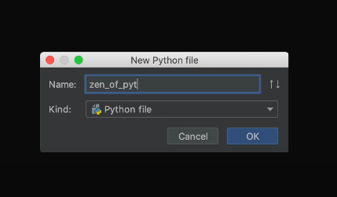
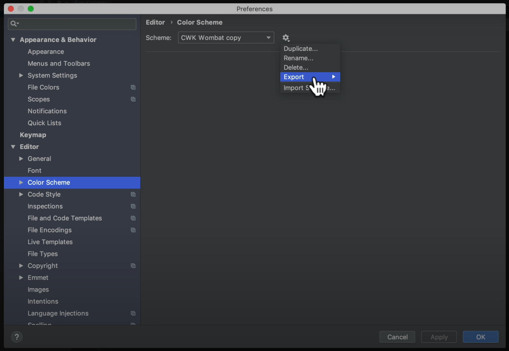
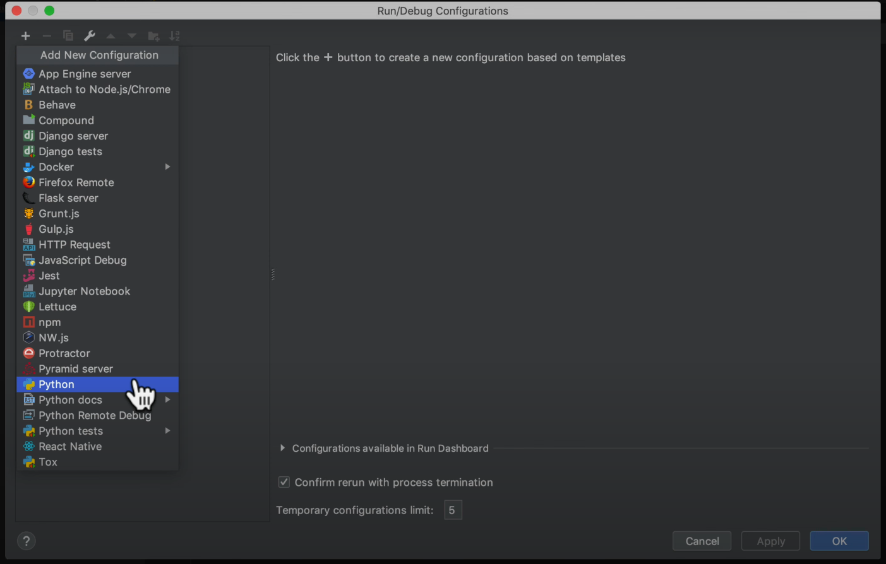
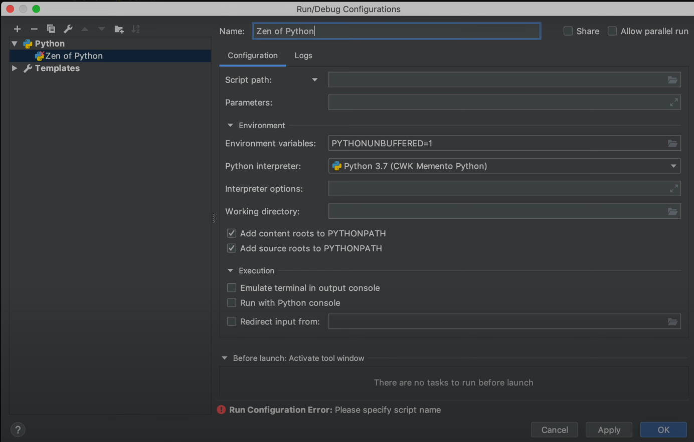
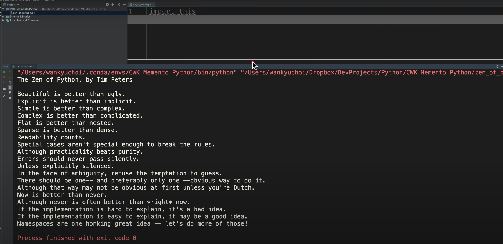
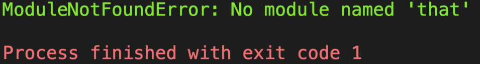

# Memento Python 초급 코스 Part 02 - 기본 이해, PyCharm 스크립트 실행환경

**영상링크 : https://youtu.be/5L4BosCLvgY**

**CWK Memento Python : https://github.com/neobundy/CWK-Memento-Python - 소스코드**

## ***Intro***

- Memento Python 두번째 시간이다. 오늘은 파이참에서 프로젝트를 실행하고 실행환경을 만드는 방법을 알아보겠다. 

- 한가지 양해를 구해야겠다. 예전에는 평균 방송 러닝 타임이 한시간을 넘어갔는데, 그럴 때마다 혼절하다시피 했다. 이해를 돕기 위해 잠깐 설명을 드리면, OCD 성격이다보니 10분 방송을 찍으면 그 10배인 100분이 소요된다. 잘못 찍으면 다시 찍어야 하니까. 내용에 따라 편집시간도 10배가 된다. 효과도 넣고 음악 넣고, 타이틀 붙이고 할일이 정말 많다. 여기에 다 완성되고 나서도 확인 절차를 거쳐야 하고, 유튜브에 올리고 나서 결과물을 확인하면 다른 경우들이 있기 때문에 검토도 해야 한다. 러닝타임을 전부 봐야 하니까 최소 두세배는 걸린다. 

- 러닝 타임이 10분이면 무려 20배에서 25배까지 최대 250분, 4시간 넘게 걸린다. 만약 한시간이면 하루가 넘어갈 수도 있다는 의미다. 

- 젊을 때는 버텼는데 40대 후반부터는 버겁다. 이제 반백이니까 무리하면 안된다. 

- 그래서 짧게, 자주, 길게 가는 전략으로 선회한다. 

- 20분도 긴데, 어제도 20분짜리 라이프 매뉴얼 주절거렸더니 오늘 기절하다시피 내리 잤다. 가급적 10분 안쪽으로 끊어가겠다. 대신 자주 올리겠다. 커피도 한모금씩 마셔가면서. 좋네요.

- 젊은 분들이라면 새겨 들으시길. 그 때 뿐이라니까.

## ***PyCharm Configuration***

- 처음 하시는 분들은 파이썬 3.7과 파이참 설치해보고 당황했을지도 모르겠다. 뭘 입력해도 실행도 안되고. 또 Mac처럼 내부적으로 파이썬이 설치되어 있는 운영체제라면, 프로젝트 만드는 단계부터 아리까리 했을 수 있다. 

- 오늘은 스크립트를 실행할 수 있는 환경까지 만들어보겠다.

- 먼저 파이참을 실행해서 프로젝트를 만들겠다. Create New Project를 클릭한다. 이름은 CWK Memento 등 아무렇게나 원하는 걸로 줘라. 커뮤니티 버전과 프로페셔널 버전이 템플릿 종류가 다르다. Django나 Flask처럼 웹애플리케이션 템플릿으로 개발할 수도 있다. 우리는 순수 Python으로 배우려는거니까 Pure Python을 선택한다. 

- Location, 저장위치는 아무곳이나. 

- Project Interpreter를 고른다. 그러면 Virtual Environment를 만들 수 있다. 초보자 분들을 위해, 이게 뭔가 싶은 용어들은 간단히 용어를 설명하고 넘어가겠지만, 지난 파이썬 초보 강좌 시리즈처럼 뽕빨을 내드리지는 못한다. 그래도 모르겠으면 따로 공부하시길.

- 예전 초보시리즈 보셔도 된다.

- 원래 컴퓨터 공부는 맨땅에 헤딩하는게 최고다. 

## ***Interpreter vs. Compiler***

- Interpereter는 내가 입력하는 프로그램 소스 코드를 실행해줄 통역사를 의미한다. 그러니까, 프로그램은 Interpreting과 Compiling으로 만들 수 있는데, 각각 통역사와 번역사라고 생각하면 편하다. 통역사는 대동하고 다녀야 하겠고, 번역사는 결과물을 받고 나면 작별해도 된다. 인터프리터는 컴퓨터한테 프로그래머가 입력한 소스 코드를 통역해주고, 컴파일러는 컴퓨터한테 번역을 해준다. 번역한 결과물이 실행코드, 실행파일이다. 

- **파이썬은 준 인터프리터 언어**다. 늘 파이썬 인터프리터와 소스 코드가 있어야 실행이 된다. C언어와 C++ 언어처럼 컴파일러 언어라면 번역을 하고 나서는 소스코드도 필요없다. 결과물로 실행파일을 얻을 수 있으니 그걸 들고 다니면 된다. 

- 물론 파이썬도 Basic처럼 순수 인터프리터는 아니어서 바이트 코드라는 중간 결과물을 얻을 수도 있고, 원한다면 실행파일도 얻을 수 있다. 그런데 거기까지 가면 너무 깊어지니까, 더 알고 싶으면 따로 공부하시길.

- 지금은 그냥 파이썬은 인터프리터 언어구나 정도만 알아두면 된다. 

- 프로젝트 인터프리터를 보면, 새로운 가상 개발 환경을 선택하라고 나온다. 그걸 클릭해보면, virtualenv, pipenv, conda가 나온다. env가 Environment의 약자다. Default로는 Virtualenv로 되어 있다. 

- 가상환경을 만드는 이유는 독립적인 완전체 개발환경을 구축하기 위해서다. 하다못해 파이썬 2.7부터 3.0, 3.4, 3.7까지 필요에 따라 수십개 버전을 설치하고, 온갖 패키지들이 얽히고 섥혀 있다해도 완전체 가상 환경을 만들어두면 서로 간섭 받지 않고 딱 그 가상환경에 가둬둘 수 있다. 아까 Mac도 언급했지만, Mac에 기본적인 파이썬이 깔려있기는 하다. 그런데 그게 2.7 버전이다. 잘못하면 꼬일 수 있다. 나는 3.0을 기준으로 개발했는데 시스템에는 2.7 대 인터프리터로 실행하려고 하니까 엉망이 될 수도 있다. 아예 실행이 안된다. 그래서 가상환경을 사용한다.

- 또 초보자를 위해 한마디 드리자면, 3.7 버전이 있는데 왜 굳이 2.x 대를 쓰느냐 2.x 대에서만 돌아가는 소스코드들이 겁나 많기 때문이다. 옛날 Y2K 때도 그랬지만 굳이 안바꿔도 되는 소스코드들이 많거든. **Ain't Broke? Don't Fix It!** 라는 정신을 발휘하는 것. 고장 안나고 잘 돌아가면 그냥 냅두라는 것. 그냥 그렇구나 하시길. 자세히 들어가면 또 한시간이다.

## ***Let's get started***

- Virtualenv, Pipenv, Conda는 각각 개성이 있는 가상환경 패키지인데, 저는 Conda 쓸 거다. 각각의 특성은 구글링으로 맨땅에 헤딩을 해보라.

- Conda를 고르면 파이썬 3.7로 자동으로 선택될거다. 인터프리터만 따로 바꿀 수도 있는데 우리는 그럴 필요 없으니 그냥 시키는대로 하자. 

- Create를 눌러서 프로젝트를 만든다.

- 그럼 시간이 좀 걸리고 프로젝트가 만들어진다. 

- 껍데기만 만들었으니 텅 비어있을 것. 

- 먼저 첫번째 파이썬 스크립트 파일을 추가한다. root folder를 선택하고 New를 누르고, 파이썬 파일을 선택한다. 그리고 Zen of python이라고 입력하고, Kind는 파이썬 파일로 내비두고 OK.

    

- 그 다음에 'import this'를 입력한다.

- 벌써 import만 입력하려고 해도 통합개발환경의 위력을 느낄 수 있다. 프로그래머가 뭘 할지 미리 예측해서 알려주는 것. tab key를 누르면 자동완성이 된다. 

- 처음 실행하시는 분들이라면 파이참 인터페이스가 저와 많이 다를 것.

- `command + ,`를 누르거나 파이참 preferences를 눌러서 환경설정 패널 불러서 입맛에 맞게 바궈주면 된다.

- Mac을 쓰시는 분들은 `command + ,`가 대부분 애플리케이션의 환경설정, preferences 단축키다. 컴쟁이에게 단축키는 사랑이다.

- preferences에서 에디터 Color Scheme 아이콘에 가보면, gear 아이콘이 있다. 이걸로 dupicate, 자신의 환경을 복제하거나, export, 저장해둘 수도 있다. 그런 다음에 다른 컴퓨터에 파이참을 설치하거나, import하면, 똑같은 환경을 유지할 수 있다. 

    

- import scheme, CWK.jar 이렇게 선택해서 import하는 식이다. 확장자가 jar인건, 파이참이 java로 만들어져서 랍니다. java 압축파일 이거든.

- 그런데 스크립트 파일까지 만들었는데 실행할 방법이 없다. tool bar에 보면, 실행 아이콘이 있는데 못 누르도록 grayed out 되어 있다. 실행환경도 만들어줘야 하기 때문이다. 이걸 **Run Configuration**이라고 한다. Add Configuration을 눌러도 되고, Menu에서 Run - Edit Configurations를 눌러도 된다. 

- 그럼 템플릿이 쭉 나오는데, 우리는 새로 하나 만들자

    

- 이름은 'Zen of Python'이라고 준다.

    

- 그리고 스크립트 경로(script path)에서 zen_of_python.py를 선택한다. 

- 나머지는 안건드려도 된다. 

- 초보자분들은 걱정 마셔라. 스크립트 파일 만들 때마다 이걸 매번 해야하는지. 원래 프로젝트라는게 덩치가 클 것이기 때문에 대부분 최종 실행되는 메인 스크립트는 몇개 안된다. 대부분 하나다. Entry Point라고 한다. 나머지는 죄다 메인 스크립트에 종속이 돼서 보조를 할 뿐이다. 앞으로 보면 알 것. 

- 그러니 실행환경을 만들어야 하는 경우는 특별한 경우 몇개 뿐이다. 

- Ok 눌러주면 이제 실행 tool bar가 활성화가 된다. 당당하게 run을 눌러주면 결과물이 나온다. 

    

- Python 인터프리터에서 실행했을 때와 같은 결과물이 나온다. 맨 아래에 `Process finished with exit code 0`이라고 되어 있다. 이건 아무 문제 없이 실행됐다는 것. 0 이외의 숫자는 에러를 의미한다. 

- 에러를 내보자. import this 대신 import that을 입력하자. 그런 다음 실행하면, 다음과 같이 나온다. exit code 1로 바꼈고, `No module named 'that'`이라고 뜬다. 'that'이라는 모듈이 없다고 투덜거리는 것

    

- 다시 버그를 잡기 위해 that을 this로 바꾸면 된다. 그런데 애초에 that을 입력할 때 자동 완성 예시에 아무것도 안나온다. 잘못됐다는 의미지. this는 나오는 반면에. tab 키를 누르면 완성이 된다. 말끔하게 버그를 잡았다.

- 여러분은 이제 프로그램 개발도 했고, 디버깅으로 버그까지 잡은 개발자다.

- 기절할 것 같다. 다음시간에도 파이썬의 똬리를 풀어보자.

    > 'Python'이라는 단어의 사전적 의미가 '비단뱀'이라 합니다.