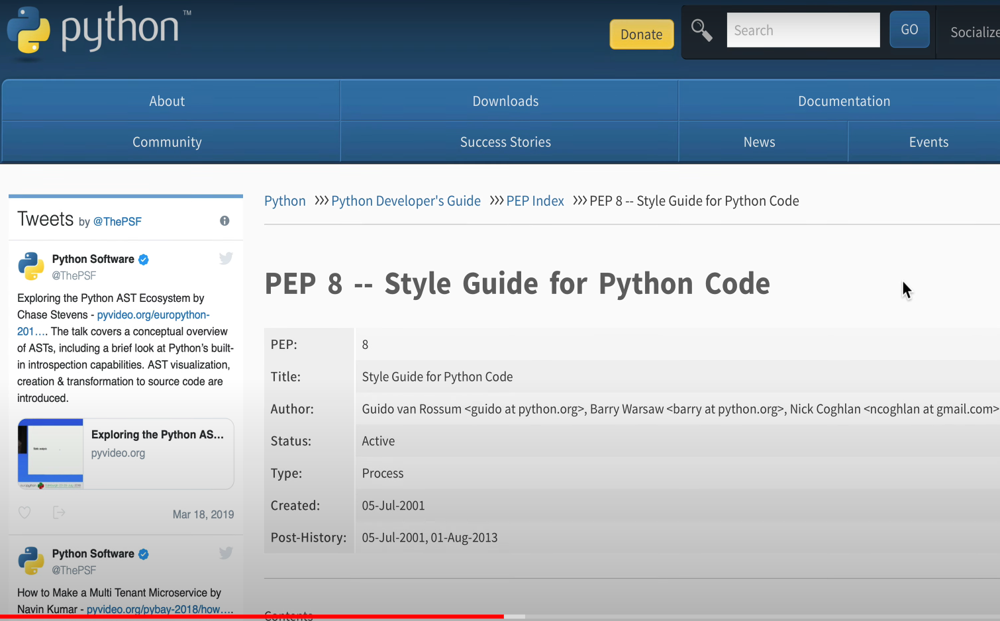
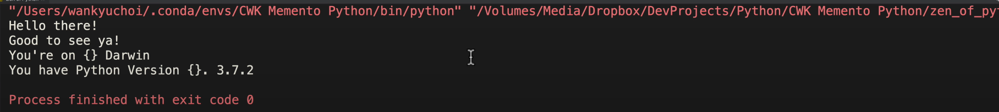

# Memento Python 초급 코스 Part 03 - 소스코드 해부

**영상링크 : https://youtu.be/48JzMBZYPYU**

**CWK Memento Python : https://github.com/neobundy/CWK-Memento-Python - 소스코드**

## ***Intro***

- 세번째 시간. 파이썬 프로그램의 기본 소스코드가 실행되는 원리에 대해 설명하겠다. 

- 세키로가 출시되어서 영상이 자주 올라오진 않을 것. 세키로 플레이 기간 동안에는 영상 업로드가 늦어질 수 있다.

    

## ***파이썬 소스 코드의 기본 뼈대***

- 지난번에 `import this`로 Zen of Python을 보여줬고, 파이썬 소스코드의 기본 뼈대가 한 눈에 들어오도록 정리해봤다.

    ```python
    def main():

        if True:
            print("Hello there!")
            print("Good to see ya!")

        print("You're on {}", platform.system())
        print("You have Python Version{}.".format(platform.python_version()))

    if __name__ == "__main__":
        main()
    ```

- 모든 소스 코드는 GitHub에 올려둘 예정. **대두 족장 GitHub 리포지토리**, https://github.com/neobundy/CWK-Memento-Python 에서 확인 가능. Git과 GitHub 사용법은 추후 설명드릴 기회가 있을 것. GitHub 아이디는 미리 만들어두시는 게 좋다. 비공개 프로젝트 만들 것 아니면 무료다.

- 세상은 여러 의미 단위로 나눠 패턴으로 인식할 수 있다. 매트릭스의 네오처럼. 그 의미 단위가 얼마나 넓고 자세하고 선명하냐만 다를 것.

- 위 코드를 잘보면 숲에서나 나무로, 나무에서 가지로 나눠지는 구조.

## ***주석(Comment) 활용***

### ***주석의 중요성***

- 주석은 프로그램 실행에 영향을 주지 않으며, 라인의 어느 위치에도 들어갈 수 있다. 코드의 이해도를 높이기 위해 작성된다.

- 주석은 hash, pound sign 등으로 다양하게 불린다.

- 귀찮더라도 주석을 열심히 다는 습관을 들여라. 갈수록 복잡해지기 마련이고, 시간이 지날수록 복잡다단해져서 작성자조차도 헷갈리게 된다. 특히 수정이라도 하려고 하면 알고리즘을 되새겨야 한다. 처음부터 좋은 습관을 들여라.

- 프로그래밍 언어 배울 때 책이나 영상을 눈으로만 배우는 사람들이 있는데, 그러면 평생 가도 실력이 늘지 않는다. 직접 입력해보고 뭔가 뜻대로 안되고 원인을 스스로 찾아내고 고치는 과정, 그리고 earn 하는 과정에서 배우는 것. 눈으로만 보면 상식만 늘 것이고, 컴쟁이 기질은 아니라는 것.

    

## ***엔트리 포인트와 함수***

- 위 코드를 다시 보자.

    ```python
    def zen_of_python():
        """Print the Zen of Python"""

        import this     # print the zen of python

    def main():
        """ Entry Point """
        if True:
            print("Hello there!")
            print("Good to see ya!")

        print("You're on {}", platform.system())
        print("You have Python Version{}.".format(platform.python_version()))

    if __name__ == "__main__":
        main()
    ```

    - 지난 시간에도 run configuration 만들면서 언급했던 Program Entry Point가 나온다. 

        > 말 그대로 진입점이라는 의미로 이해하면 되겠습니다. 코드의 Entry라는 거죠.

    - 함수가 두 개 정의되어 있다. `Zen of python`과 `main`이다. 지난 시간에 실행했던 `Import this`라는 걸 `zen of python`이라는 함수로 만들어서 언제든 호출할 수 있게 했다.

    - 지금부터는 눈높이를 약간 높이겠다. '해쉬' 문자는 라인 하나에 주석을 먹인다. 줄마다 먹이면 멀티라인 주석을 쓸 수 있는데 이런 내용들은 넘어가겠다.

    - 위 코드에서 """ 와 같은 주석을 썼다. Docstring이라는 문서화 기능에 쓰는 특별한 주석이다. **'** 와 같이 하나의 따옴표로 쓸 수도 있고, **"** 와 같이 쌍따옴표로 쓸 수도 있다. 짝을 맞춰줘야 하므로 하나만 써서는 안된다. 괄호도 마찬가지. cruly bracket : {}도 마찬가지.

    - Docstring은 아래와 같이 멀티라인 주석으로도 쓸 수 있다. 그런데 그냥 해쉬 문자를 쓰는게 best practice다.

    ```python
    """
    Entry Point

    """
    ```

    - Entry Point 함수 이름을 굳이 `main`이라고 하지 않아도 된다. 마지막에 `if` 조건문에서 main을 다시 정해주면 된다. `my_main`이라고 바꿔도 실행이 된다.

    - 처음 실행되는 함수도 꼭 Entry Point가 될 필요는 없다. 바꿀 수 있다. 예컨대, zen_of_python() 함수가 처음 실행되는 함수가 되도록 할 수도 있다.

    - 파이참에서는 `main`을 눌러보면 위에서 정의한 `main` 함수도 함께 선택된다. 이게 IDE의 위력이다. 이 Entry Point 함수를 다른 이름으로 바꿀 수도 있는데, 전통적으로 컴쟁이들은 Entry Point 함수를 `main`이라는 이름으로 쓴다. C언어는 매우 엄격하다. 그냥 `main`이다. 다른 걸 쓰면 안된다.

    ```python
    def my_main():
        """ Entry Point """
        
        if True:
            print("Hello there!")
            print("Good to see ya!")

        print("You're on {}", platform.system())
        print("You have Python Version{}.".format(platform.python_version()))

    if __name__ == "__main__":
        my_main()
    ```

## ***들여쓰기(Indentation)와 블럭(Block), 스코프(Scope)***

- 들여쓰기를 보면, 파이썬의 엄격함을 알 수 있다.

- **Block**의 개념. 들여써서 작성된 코드들. 한 Line도 블럭에 해당된다. 라인은 쪼개질 수도 있다. 멀티 라인에 걸쳐 입력된 코드가 사실은 달랑 한 줄일 수도 있고 한 블럭일 수도 있다. 

- 위 코드에서 `if` 조건문처럼 블럭이 달라지면, 조건문이나 정의가 미치는 영역, 범위가 달라진다. **Scope**라고 한다. 파이참은 Code Folding 기능을 제공한다. 블럭 단위로 접을 수 있다. 

- 들여쓰기는 유념해야 한다. 잘못 들여쓰면 실행되지 않는다. 들여쓰기를 통해 블록과 스코프가 구분된다.

- 들여쓰기는 일정하게 유지해야 하며, 들여쓰기 문자로는 탭이나 스페이스를 사용할 수 있다. 하지만 대부분의 프로그래머들은 스페이스를 사용하는 것을 선호하고, 저도 스페이스를 선호한다.

- 탭을 쓰면 특수 문자로 간주될 수 있어서, 나중에 코드를 수정할 때 고생할 가능성이 있다. 

- HBO에 Silicon Valley라는 드라마가 있다. 이거 죽여주게 재미있다. 날고 기는 OCD 컴쟁이들 Geek들이 등장한다. 한 에피소드에서 탭과 스페이스를 소재로 다룰 정도로 컴쟁이들에게는 대단히 민감한 문제다. 사실 그 에피소드는 컴쟁이가 아니면 이해가 안된다.

    


## ***PEP(Python Enhancement Proposals)***

- 파이참 메뉴에서 Edit - Convert Indents - to tabs로 바꾸면 Word Processor에서 맞춤법 경고하듯 해당 부위에 줄이 생기면서 PEP 제8항 위반이라고 알려준다. 물론 강요는 아니지만, 굳이 위반할 이유가 없다. 다 이유가 있어서 선배들이 style guide를 지키라고 조언해주는 것이니까.

- 다시 to space로 바꾸면 경고가 사라진다.

- 파이썬 커뮤니티에 PEP라는게 있다. 강요는 아니지만, 커뮤니티가 제안하는 스타일 가이드로, 미국 언론인들이 웬만하면 칼같이 지키는 가이드인 시카고 매뉴얼 오브 스타일 같은, 아주 숨막히는 가이드. 

    

- PEP가 그런 것. PEP에 따르면 탭보다는 스페이스를 선호한다고 되어 있다. PEP 8항을 보면, ***Tabs or Spaces?*** 가 있고, ***Spaces are the preferred indentation method***라고 되어 있다. 그리고 ***Tabs should be used solely to remain consistent with code that is already indented with tabs*** 라고 되어 있다. 기존 코드와의 일관성을 위한 것이 아니라면 탭을 쓰는 것이 권장된다. 그래서 아까 봤듯 PyCharm에서도 스페이스를 탭으로 바꾸면 경고를 해주는 것. PEP 위반이라는 취지.

    
  
- 들여쓰기는 스페이스 4개를 사용하는 것이 권장된다. 또는 8개를 쓸 수도 있는데, 4개가 상식적 표준. 8개면 4개의 두 배, 즉 두 번 들여써서 상위 블럭과 하위 블럭을 나누는 기준이 된다.

## ***블럭의 실제 예시***

- 아래 코드에서 `def main'과 `if` 조건문이 상하위 블럭을 나누는 기준이 된다. 그 안의 `if` 블럭은 두번째 하위 블럭이 된다. 공백이 8개니까. tab 키를 두번 치면 된다. tab 키를 두번 쳐도 자동으로 스페이스가 네번 입력된다. 

- 아래 코드에서 `print` 함수는 `if` 조건문이 성립되어야 실행된다. 들여쓰기를 했으니까. 상위 블럭이 조건을 만족해야 하위 블럭이 실행된다.

    ```python
    def main():
        """ Entry Point """
        if True:
            print("Hello there!")
            print("Good to see ya!")
    ```

- `if` 블럭에 있는 `print` 말고 그 아래의 `print` 함수들은 `if`와 레벨이 같다. 그것들은 `if` 조건문과 상관없이 최상위 블럭이니까 무조건 실행된다.

    ```python
    def main():
        """ Entry Point """
        if True:
            print("Hello there!")
            print("Good to see ya!")

        print("You're on {}", platform.system())
        print("You have Python Version{}.".format(platform.python_version()))
    ```

- 만약 위 코드에서 `if True`를 `if False`로 바꾸면, 하위 블럭인 `print("Hello there!")`, `print("Good to see ya!")`들은 실행이 안된다.

- 결과물은 운영체제와 파이썬에 따라 다를 것인데, Linux라면 플랫폼에 Linux라고 나올거고, Mac이라면 Darwin이라고 나오고, Windows라면 Windows라고 나올 것. Mac만 Darwin이라는 이름이 있다. Mac이 BSD Unix 기반의 소프트웨어에서 출발했기 때문. 역사가 궁금하면 구글링을 해봐라.

- 위 코드를 실행하면 저는 아래와 같이 나온다. 그런데, {} 안에 있는 변수가 출력되지 않았다.

    

- 이렇게 논리적인 오류도 일종의 버그다. Logical Bugs. 위 코드에서 원래 의도는 다음과 같은데 실수한 것이지. 

    ```python
        print("You're on {}".format(platform.system()))
        print("You have Pytho n Version{}.".format(platform.python_version()))
    ```

- 블럭을 Curly Bracket 등으로 지정하는 C나 C++, java 같은 언어는 멋대로 블럭을 지정할 수 있다. C나 java를 쓰던 컴쟁이들은 파이썬으로 넘어오면 기겁을 하기도 한다. 족쇄 같다고. 그런데 쓰다보면 오히려 장점이 된다. 

    ```C
    if main()

           {
       
       printf("Hello world\n");

    return 0;

    }
    ```

- 저도 PHP에서 파이썬을 처음 배웠을 때 그랬다. PHP가 curly bracket을 쓴다. 그래서 제 옛날 코드들이 엉망이다. 쓰다보면 indentation을 칼같이 지키는게 오히려 장점이 된다. C나 java 같은 언어에서 엉망인 코드를 쓰던 저같은 개발자도 파이썬으로 오면 강제로 깔끔을 떨 수 밖에 없게 된다. 이걸 지키다보면 오히려 curly bracket을 쓰는게 꼴보기가 싫어질 것.

- 프로그램 언어를 쓸 때 가장 많이 등장하는 'Hello world'라는 C 언어 소스 코드를 가지고 컴파일도 해보고 실행도 해보자.

- Mac에는 GCC(Gnu C Compiler)라고 하는 C, C++ 컴파일러를 설치할 수 있다. X code 깔고 관련 패키지를 몽땅 설치하면 사용 가능함. X code를 안깔았다면 GCC도 없을 것. 소스 파일 주고 컴파일하면, a.out이라는 실행 파일이 생성된다. 그걸 실행하면 터미널에 Hello world가 출력된다.

    ```C
    ~$ gcc helloworld.c
    ~$ ./a.out
    Hello world
    ```

- 다시 위의 C 코드 구조를 딱봐도 파이썬과 다르다. 다음과 같이 써도 무방.

    ```C
    if main()

           { printf("Hello world\n"); return 0;

    }
    ```

### ***프로그래밍 언어 학습의 핵심***

- **독해력(Reading Comprehension)**: 남의 소스 코드를 읽고 이해하는 능력이 최우선. 나중에 자신의 코드를 보고 수정하려 해도 독해력이 우선시되어야 하거든.

- **영어 학습 팁**: 영어로 된 책을 100권쯤 읽어라. 그 정도 노력도 안하고 빨리 익히려 하면 나쁜 심보다. 100권 읽으면 비법 같은거 안 물어볼 것. 

## ***쉬뱅 라인(Shebang Line)***

- 남의 소스코드들을 보다 보면 shebang line이라는 것을 볼 수 있다.

    ```python
    #!/usr/bin/env python3
    ```

- 위와 같이 생겼다. 

- shebang line은 terminal 같은 곳에서 script를 실행할 때 어떤 인터프리터를 사용할지 지정해주는 라인.

- pound 문자와 `!`를 공백 없이 붙여 써야 하고, 맨 첫줄, 첫 칼럼부터 써줘야 한다. 스크립트 파일의 첫 두바이트가 이 문자여야 한다. 그런 다음 사용할 인터프리터의 경로를 붙여준다.

- 이 느낌표를 영어로 exclamation mark(point)라고 한다. 구어로는 bang이라고 한다. 샵 문자를 트위터에서 Hashtag라고 한다. hash, pound sign이라고도 한다. Hash+bang = shebang

- the whole she bang이라고 하면, 해당 문맥에서 관련된 전체를 가리킴. ex) He's got a foxy wife, a bad crib, shitload of money, the whole shebang. Life is so unfair!

- 파이썬 인터프리터의 경로를 직접 입력하지 않고, 'env'라는 명령어를 사용하면 현재 환경에서 사용하는 인터프리터를 자동으로 알아내서 사용. 물론 절대 경로를 알아낼 수도 있지만, 절대 경로만큼 위험한 것도 없다. `env`를 쓰는 것이 best practice다.

- 윈도우라면, 어차피 `#`로 시작하기 때문에 그냥 무시하고 넘어간다. comment로 처리하기 때문.

- 파이참 같은 IDE를 사용하면 쉬뱅 라인을 사용할 일이 거의 없다. 

- 이제 맨 마지막 라인을 살펴보고 끝내자. 세키로를 하러 가야겠다😂

```python
if __name__ == "__main__":
    main()
```

- 이 조건문의 의미를 자연어로 풀면, 이 스크립트 파일이 패키지나 모듈로 사용되지 않고, 실제로 실행될 때 main 함수를 호출하라는 의미. 

- 함수를 불러서 실행하는 것을 '호출'이라고 한다. 이것도 영어로 그냥 'call'이라고 한다. 인간의 언어와 마찬가지로 프로그래밍 언어 역시 무수한 idiom을 배우게 된다. 위 코드 역시 idiom.

- `__`는 double underscore이기 때문에 Dunder score 라고 부른다. 유일하게 표절이 허용되는 분야가 프로그램 언어다. 공개된 소스라면 마음껏 베껴 써라.