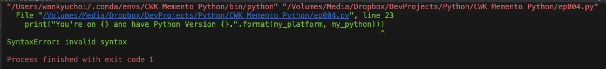
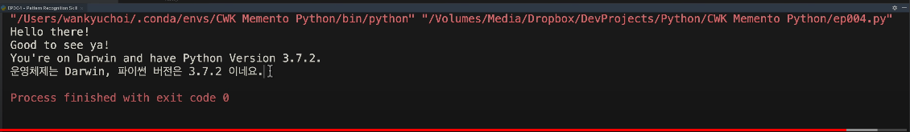

# Memento Python 초급 코스 Part 04 - 패턴인식 스킬 레벨업

**영상링크 : https://youtu.be/NfxIk2lr4vE**

## 1. Intro

- 세키로는 오랜만에 손이 바르르 떨리는 전율을 느끼게 해주는 아주 고마운 게임이

- 뭐 잡몹들도 보스급이다. 새로운 구역 갈 때마다 아주 심장이 벌렁 거려서 끝내준다.

- 오늘은 좀 간단하면서도 프로그래밍 입문 과정에서 정말 중요한 스킬을 짚어보도록 하겠다. 특히 간과하기 쉬운 부분이라 꼭 짚고 넘어가겠다. 

## 2. 패턴 인식 스킬과 Data Structure

- 패턴을 알아보는 스킬은 세상 누구나 타고난다. 그 스킬의 레벨이 조금씩 다를 뿐이다. 이퀄라이저는 저마다 다르게 타고 나기 때문이다.

- 그래도 타고난 이퀄라이저는 노력 여하에 따라서 최적화가 가능하다고 주야장천 떠들고 있다. 우리 모두 패턴 인식 스킬을  갈고 닦으면 자신에게 주어진 이퀄라이저 내에서 최적화해 나갈 수 있다.

- 지난 시간에 의미 단위 패턴을 영화 매트릭스의 네오처럼 숲과 나무, 가지 등으로 한눈에 확인하는 습관이 필요하다고 언급을 했었는데 이런 의미다. 하다 못해 파이썬 인터프리터 소스 코드를 해독할 때 패턴 인식이 기본이다.

    

### Data Structure

- 인터프리터는 `def`, `main`, `if`, `else`, `True` 이런 키워드나 심볼들을 만나면 일단 차곡차곡 내부적으로 쌓았다가 뺐다가 하면서 확인을 해 나간다. 서로 비교를 해 나가면서. 

1. LIFO
- 또다른 컴쟁이 필수 스킬 중 하나인 Data Structure, 자료 구조 모형에서 이걸 Stack 구조라고 하는데, 구내 식당 가보면 식판이 쌓여 있듯이 새 식판을 차곡차곡 Push하고 때가 될 때마다 하나씩 Pop을 해서 꺼내 쓴다고 한다.

    

- 그래서 후입 선출, Last In First Out, LIFO라고 한다. 즉 맨 마지막에 Push한 식판을 가장 먼저 쓴다는 뜻. 옛날엔 식판을 쌓는게 스프링 구조였다. 그래서 Push 하고 Pop 한다고 그랬다. 스프링을 누르고 튕겨 나오는 느낌이라 그래서 Push, Pop 이라고 한 것

2. FIFO
- 반대로 신제품 나올 때 애플 매장에 가서 줄을 서면 선입 선출, 먼저 온 손님을 먼저 서빙한다. 이걸 '줄'의 영어인 Queue를 써서 Queue 구조라고 한다. 

- 순서가 있는 줄은 라인이 아니라 Queue라고 한다. First In First Out, FIFO라고 읽는다. 기업에서 재고 관리할 때도 LIFO, 후입 선출로 인식을 하면 맨 나중에 산 재고를 먼저 비용 처리한다는 뜻이다.

- 재고가 선입 선출이라면 먼저 산 재료를 먼저 써서 비용으로 인식한다는 뜻. 대부분의 증권사 해외 주식 매수도 환율 적용 역시 선입 선출법이다. 미국 주식 사고팔 때 환율도 선입 선출이냐 후입 선출이냐를 가려서 매칭해야 된다. 주식을 사고팔 때마다 환율이 다르니까. 그래야 양도세 낼 때도 문제가 안 생긴다. 

-  가장 많이 쓰는 자료 구조 모형 중 두 개가 바로 Stack과 Queue니까 그냥 상식적으로도 꼭 알아두라. 컴쟁이들이 Stack이나 Queue, Push, Pop 이런 표현을 그냥 당연하다는 듯 툭툭 던진다.

- 컴쟁이들 사이트 이름에도 Stack Exchange 처럼 Stack이란 단어가 참 많다. 요즘은 보기 어려워졌지만 예전엔 메모리 오류 중에 가장 흔한 것 중 하나가 Stack Overflow 였다. 식판 쌓을 공간이 모자란다는 뜻.

3. Stack

- 언어 인터프리터나 컴파일러도 괄호 처럼 쌍을 이루는 Symbol을 처리할 때 가장 효율적인 자료 구조 중 하나가 스택.

- 아래 코드에 괄호가 겹겹이 쌓여있다. 괄호를 여는 심볼을 만날 때 Stack 구조에 Push를 하고, 나중에 쌍을 닫는 Symbol을 만날 때까지 Stack에서 Pop을 해본다. 그런데도 끝까지 안 나오면 오류를 뱉어내는 것. 이렇게 '여는 괄호'들을 Stack에 Push한 다음에 '닫는 괄호'를 만날 때마다 Pop을 해서 비교를 해 보는 것. 그러다가 매칭이 안 되면 오류를 뱉어 내는 것. 


    ```python
    def my_main():
        """ Entry Point """
        
        if True:
            print("Hello there!")
            print("Good to see ya!")
        else :
            print("What the hell....?")

        my_platform = platform.system()
        my_python = platform.python_version()

        print("You're on {} and have Python Version {}".format(my_platform, my_python))
        print("운영체제는 {}, 파이썬 버전은 {} 이네요.".format(my_platform, my_python))

    if __name__ == "__main__":
        my_main()
    ```

- 닫는 괄호가 등장했다면 분명 내부 Symbol Stack에 '여는 괄호'가 쌓여 있어야 하겠고 또 그 쌍이 칼같이 맞아야 한다. 여기서 지금 '여는 괄호' 개수가 '닫는 괄호' 개수와 다를 거라고 생각한다면 큰 착각이다. 당연히 똑같아야 된다. 개수가 틀리다면 프로그램이 돌아가질 않는다.

- 그래서 지난 시간에 인용 부호 쓸 때 큰 따옴표로 열었으면 큰 따옴표로 닫아야 한다고 말한 것. 쌍을 이루는 거면, Pair를 이루는 거면 무조건 개수가 맞아야 ehlsek.

- 아래 코드에서 Curly Bracket도 마찬가지. 개수가 분명히 딱딱 맞아야 한다.

    ```python
    print("You're on {} and have Python Version {}".format(my_platform, my_python))
    print("운영체제는 {}, 파이썬 버전은 {} 이네요.".format(my_platform, my_python))
    ```

- 따옴표도 마찬가지지만 괄호 역시 괄호로 열었으면 괄호로 닫아야 하고, Curly Bracket으로 열었으면 Curly Bracket으로 닫아야 한다. 위 코드와 같이 괄호가 첩첩이 쌓여도 인터프리터가 칼같이 잡아내는 건 내부적으로 Stack 같이 딱 어울리는 데이터 모형 자료 구조를 사용하고 있기 때문.

- 간단히 Stack이라고 했지만, 실제로는 파이썬 내부에서는 한결 발전된 모형을 쓰고 있을 것.

- 다 까 먹더라도 프로그래머라면 상식적으로 Data Structure, 자료 구조 데이터 모형과 같은, 데이터를 효율적으로 다루는 이론이 존재한다는 것 정도는 챙겨두라. 

- 자료 구조라는게 학교에서 컴퓨터를 전공하면 정교 과목으로 배울 정도로 중요한 주제. 상식이나 생산성 향상 수준을 넘어서 진정한 프로그래머가 되려면 어차피 자료 구조도 넘어야 할 산 중 하나. 호모 사피엔스 관점에서도 이런 소스 코드를 만나면 모르는 키워드나 심볼 논리 구조라고 하더라도 최소한 패턴이 눈에 들어와야 한다.

- 코드에서 `if`나 `else`를 처음 본다고 해도 '아 이게 뭔가 조건을 먹이는 것이고, 조건이 맞으면 `if` 블록이 실행되고 조건이 안 맞으면 `else` 블록이 실행되겠구나.' 이 정도는 눈치 까는 연습이 필요

- 여기서 한 발 더 나아가서 `if else` 조건문도 쌍을 이룬다. `if` 라는 키워드가 Stack에 안 쌓여 있는데 생뚱 맞게 `else`만 나온다면 인터프리터가 칼같이 오류를 잡아낼 것

- `print` 함수를 봐도 그렇죠. 꼭 매뉴얼을 찾아보지 않더라도 Print 함수의 윤곽이 한 눈에 들어와야 한다. 인터프리터 내부의 스택 자료 구조까지 아니더라도 내 눈에도 괄호가 쌍을 이뤄야 하니까 '여는 괄호'를 만났으면 '닫는 괄호'를 찾아야 하는 것. 그게 한눈에 들어와야 Print 함수의 뼈대 패턴을 인식한 것.

- PyCharm에서도 마찬가지인데, Print 함수를 보면 괄호가 참 많다. 앞으로 함수 쓰다 보면 이렇게 괄호 겹겹이 쌓이는 경우가 허다할 것. 제아무리 날고 기는 컴이라 해도 이렇게 괄호 쌍을 못 맞추는 경우가 있다. 막 수십개씩 쌓일 때도 있다. 그래서 PyCharm 같은 통합개발 환경을 쓰는 것.

- 아래 코드에서 맨 오른쪽 닫는 괄호 커서를 옮기거나 지워보면 쌍을 여는 괄호가 빨간색으로 처리된다. 닫는 괄호도 빨간색으로 처리되고 매칭을 시켜준다. 다시 써보면 매칭을 시켜준다. 괄호를 빼먹으면 '잘못 됐다'면서 빨간 줄이 생긴다.

    ```python
    print("You're on {} and have Python Version {}".format(my_platform, my_python))
    print("운영체제는 {}, 파이썬 버전은 {} 이네요.".format(my_platform, my_python))
    ```

## 3. Pattern Recognition Level Up!

- 다른 프로그래머가 사용한 Print 함수를 베껴 쓴다고 해도 손대지 말아야 할 부분과 변경 가능한 부분을 구분 수 있는 것도 이런 패턴 인식 스킬을 레벨업 할 수 있느냐에 달려 있다.

- 아래 코드를 다시 봐도 Print라는 키워드와 괄호는 손대면 안된다. 대괄호라고 부르는 Curly Bracket도 마찬가지. 그 다음에 오는 다른 변수들로 대체해주는 것일 테니까.

    ```python
    print("You're on {} and have Python Version {}".format(my_platform, my_python))
    print("운영체제는 {}, 파이썬 버전은 {} 이네요.".format(my_platform, my_python))
    ```

- 이 `{}`들은 `format` 함수 내의 변수들로 대체되잖아. 이 정도는 눈치 깔 수 있어야 한다.

- 위 코드의 패턴 전체를 보면 `Print ()`, `()` 안에 두 개 이상의 `{}` 쌍을 포함한 문자열, 그런 다음에 마침표. 그런 다음에 format 함수 그리고 format 함수 내부에 argument 또는 parameter로 `()` 안에 `{}` 개수와 맞는 변수 목록. 크게 보면 이런 패턴을 인식할 수 있다. 이 정도는 한 눈에 들어와야 패턴 인식이 가능한 프로그래머로 도약하는 것

- 그럼 `Print`와 `.` `format`이라는 키워드와 괄호쌍 이 구조들만 수정이 안 될뿐 `{}`의 개수도 바꿀 수 있고 그에 따라서 변수 개수도 바꿀 수 있겠지. 그럼 `Print` 함수에 이 문자열 집어넣는 건 거의 다 배운 것.

- 지난번의 `Print` 함수 두 줄짜리를 한 줄로 바꾼 것이라고 보면 된다. 이렇게 소스 코드를 번역을 한다고 해도 어딜 손대면 안 되는지 이런 거 역시 패턴을 인식할 줄 알아야 이렇게 바꿀 수도 있는 것. 엉뚱하게 위 코드에서 `Format`을 `포멧` 이렇게 바꾸면 안 되겠지.

- 있어요 이런 번역하시는 분들. 프로그래밍을 배우는 과정에서는 새로운 키워드나 함수 등이 나오면 이렇게 쪼르르 매뉴얼부터 보지 말고 패턴을 인식하고 나름대로 수정해 보는 연습을 한 다음에 확인하는 절차를 거치는게 좋다. 맨땅에 헤딩이린게 그런 것이다. 체득하는 과정.

- 인간에게 패턴 인식은 너무도 자연스럽고 정말 중요한 스킬. 자료 구조라는 거 자체가 세상의 모든 데이터를 패턴화 하려는 노력이거든. 식당에 가서 쌓인 식판을 봐도 스택 구조라는 모형이 보이고 동전이나 책이 쌓여 있어도 스택이 보이는 식.

- 그런데 책이 쌓여 있지 않고 옆으로 세워져 있으면 스택 구조가 아니거든. 그런게 패턴으로 보여야 된다. 신제품 나올 때 애플 스토어 앞에서 장사진 치고 있으면 라인이라고 하지 말고 '어 queue네?'라고 해야 한다.

- 컴쟁이라면 두말할 나위가 없겠지. 목숨 걸고 렙업해야 한다. 내가 프로그래밍과 함께 목구멍이 말라 비틀어지도록 배우라고 강조하는 정규식. Regular Expression 역시 패턴 인식이 생명. 간단하게라도 프로그래밍 스킬과 정규식 스킬을 챙겨두면 양손 무기인 이도류를 휘두루는 무사나 다름 없다. 앞으로는 에피소드별로 스크립트가 생길 것. 소스는 깃헙에서 확인할 수 있다.

## 4. Remind

- 파이참 Run Configuration 만드는 거 복습해보자. 

- Episode 네번째니까 에피소드 004, EP004.py라는 스크립트 파일을 만들자. 여기에 `Edit Configuration`을 해서 `+`를 눌러 추가한 것이고, 이름 바꿔주고 스크립트 path만 EP004를 선택한 것. 그런 다음 원하는 `run configuration`을 선택할 수 있겠지.

- Zen of Python을 선택하면 파이썬이 돌아갈 거고 EP004가 선택되면 EP004가 돌아가겠지. 실행해볼까요. 오류가 생겼다. 괄호가 하나 더 많다는 뜻. 이렇게 쌍 맞추기가 어렵다.

    

- (괄호 하나를 지우면) 지난번이랑 같은 결과가 나온다. 

    


- 이게 원래 두 줄이었는데, 한줄로 나온다는 것만 다르다. 한글로 번역도 해봤고. 이런 `Print` 함수를 보면 이렇게 수정해 보는 것. 그렇게 연습을 해 보는 것. 어느 부분을 바꿀 수 있는 건지.

- 그렇게 베껴 써보라. 표절이 유일하게 허용되는 분야가 소스 코드거든. 공개된 소스 코드라면 얼마든지 배껴 쓰라. 연구하고.