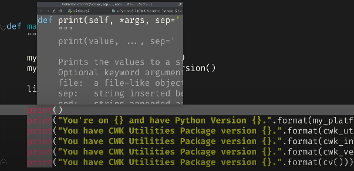
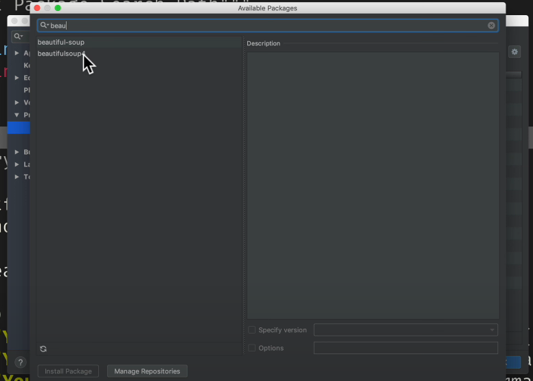
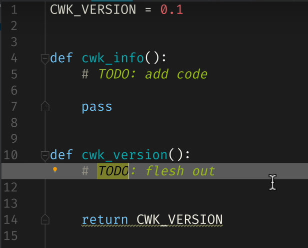
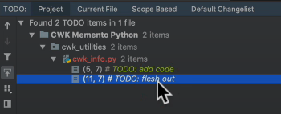
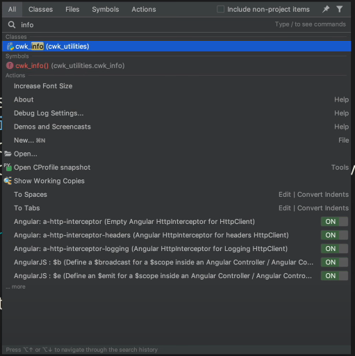
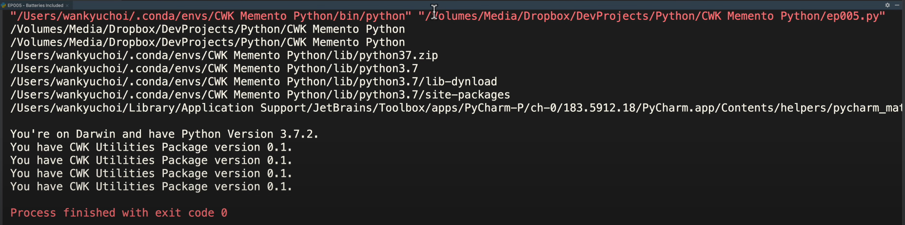
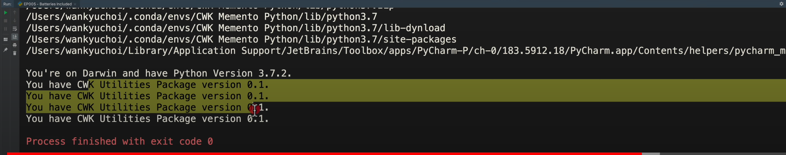
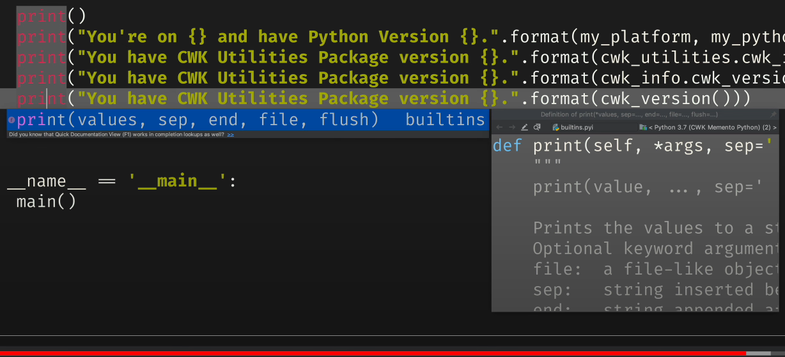
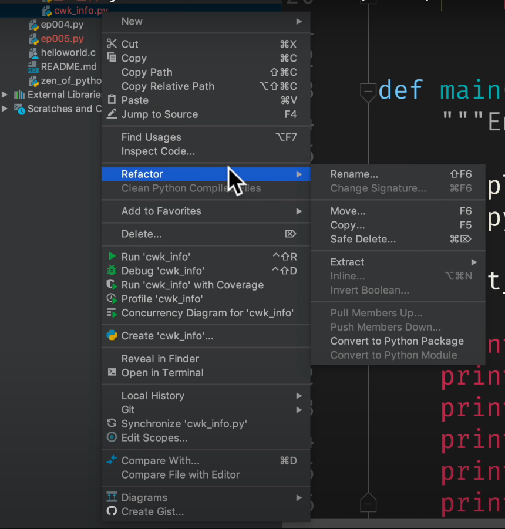
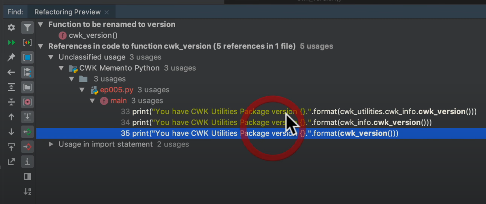

# Memento Python 초급 코스 Part 05 - 모듈, 패키지, 라이브러리

**영상링크 : https://youtu.be/fM_MNxMG5XU**

**CWK Memento Python : https://github.com/neobundy/CWK-Memento-Python - 소스코드**

## ***Intro***

가끔 컴퓨터 관련 흑역사도 소개해 드릴 생각. 역사는 미래를 볼 수 있는 답안지니까. 역사를 모르면 같은 실수를 반복하는 게 인간이다.

### ***과거의 컴퓨터 프로그래밍 역사***

요즘 분들은 잘 모르시겠지만, 나 대학교 시절까지만 해도 좀 잘 나간다 싶은 C언어 프로그래머들은 한글 라이브러리를 자체적으로 만들곤 했었다. 지금이랑 다르게 윈도우 같은 GUI 환경이 없던 MS-DOS 시절 이야기다. 한글을 쓰려면 화면을 그래픽 모드로 강제로 바꾸고, 뻘짓 많이 해야 했다. 그냥 언어 쓸 때보다 컴퓨터가 한참이나 느려진다. 그래서 Assembly Language라는 기계어에 가까운 언어까지 C언어 소스코드에 심어 가면서 한 방울이라도 성능을 더 짜내려고 애썼다.

아래아 한글이 당시에는 혁신적이었다. 하지만 개발자들이 공유하지 않고, 과도하게 욕심을 부려 팔아먹으려고 그랬다. 그래서 결국 돈 번 사람은 거의 없었던 것으로 기억한다. 결국, 나중에 마이크로소프트 윈도우에서 완성형 한글 유니코드로 표준화되면서 다 사라졌다. 엉뚱하게도 외국 기업이 천하를 평정한 셈.

난다 긴다하는 영웅호걸 다 죽고 듣보잡 황제가 천하를 통일하는 삼국지가 떠오른다. 

### ***Don't reinvent the wheel!***

***"Don't reinvent the wheel."*** . 바퀴는 이미 충분히 잘 만들어져 있으니, 여기에 build-on 하고 발전시키는 것이 다시 만드는 것보다 낫다는 의미. 내가 더 잘 만들 수 있다고 해봐야 시간낭비, 자원낭비하는 뻘짓. 진정한 컴쟁이들은 이미 잘 돌아가는 바퀴를 다시 만들지 않는다. 그냥 가져다 쓴다. 나눠 쓰는 것. 공유의 진정한 의미. 오픈 소스가 활성화돼있는 이유. 스노우 타이어를 만들어야 한다면 그냥 기본 바퀴를 가져다가 필요한 부분만 다시 만든다. 타이어 씌우고 체인 감아서. 

## ***파이썬의 라이브러리 구조***

파이썬의 Standard Library가 바로 이 바퀴 같은 Collection. 일반적으로는 3rd party package가 필요하지 않을 정도로 Library가 방대해서 "Batteries included"라는 표현을 자랑스럽게 쓸 정도. 우리나라와 다르게 영어권 제품들은 배터리가 잘 안들어 있거든. 거의 대부분 "Batteries not included"다. Library가 작으면 Package나 Module과 같은 레고 블럭틱한 표현들을 쓰는 것 뿐. 성격이 비슷한 모듈을 묶어서 Package, 성격이 비슷한 Package들을 묶어서 Library라고 한다. 간단히는,

- **Module**: 재활용할 함수들을 모아놓은 Python script file.
- **Package**: Module들을 모아놓은 folder.
- **Library**: 폴더 구조가 복잡해지면 라이브러리로 묶음

레고 역시 건물이나 탈 것을 만드는 것들은 다르게 생겼다. 그런 것처럼 모듈은 남이 만든 검증된 것을 사용할 수도 있고, 직접 만들 수도 있다. 반복적으로 자주 사용할 것 같은 코드를 한데 묶어 패키지로 만들고, 비슷한 종류가 많아지면 라이브러리로 묶을 수 있다.

## ***Library 사용법***

Third Party 인 경우 그 사용법은 어떻게 아는가? 앞서 언급했던 한글 라이브러리들의 문제점이 바로 그것이었다. 사용법이 통일되지 않아 다 따로 익혀야 했고, 컴쟁이들의 글쓰기 능력도 별로였어서 매뉴얼 읽기도 고역이었다. 

오늘날의 라이브러리나 패키지들 중 잘 쓰는 것들은 대부분 매뉴얼이 잘 갖춰져 있다. 특히 PyCharm 같은 통합개발환경(IDE)을 사용하면 매뉴얼을 따로 찾지 않아도 화면에 바로 띄워준다.



가물 거릴 때 reminder로 최고다. 예전에는 인쇄된 레퍼런스 책을 쟁여두고 썼지만, 이제는 잘 안본다. 매뉴얼 출간까지는 몇개월이 걸리는데 그 사이에 구닥다리가 되기 십상이다. 가급적 온라인 매뉴얼이나 IDE의 통합 기능을 사용하는 것이 훨씬 효율적.

## ***파이썬 객체지향 프로그래밍의 핵심 개념***

**상속성(Inheritance)** : 객체지향 프로그래밍의 핵심 개념 중 하나는 남이 만든 바퀴를 가져다 사용하는, .
**캡슐화(Encapsulation)** : 매뉴얼만 있으면 속을 뜯어보지 않아도 조립법을 익혀 블랙박스 처리가 가능해지는 것. 인터페이스만 알면 된다. 괜히 뜯어보다가 망가뜨릴 수도 있다.
**다형성(Polymorphism)** : 기본 바퀴를 발전시켜 스노우타이어를 만들듯 기본 패키지를 업그레이드하거나 개성을 부여하는 것.

객체지향성은 자꾸 짱구를 굴려서 적용하는 연습을 해야 한다. 아직 객체지향 프로그래밍까지 가려면 한참 남았다. 객체지향성은 한방에 이해 안되는 것이 정상.

파이썬 라이브러리는 기본 사양에 해당하는 Standard Library와 3rd party에서 개발한 확장 라이브러리로 나뉜다. 통계나 Data Science나, Finance 하고 싶을 때 Standard Library로는 부족함. 그럴 때 직접 만들지 말고 누군가 만들어놓은 라이브러리가 반드시 존재한다. Anaconda가 바로 스탠다드 라이브러리와 온갖 데이터 사이언스 패키지를 통합해놓은 배포판. 그래서 한방에 그거 깔자고 한 것. 당분간 표준 라이브러리와 정말 유용해서 스탠다드나 다름이 없는 Beautiful Soup 같은 패키지만 거들떠 볼 것. 첫술에 배부를 수는 없으니까.

## ***외부 패키지 설치와 활용***

파이참에서 외부 패키지 또는 라이브러리를 설치하는 방법을 살펴보겠다. 웹페이지를 긁어와서 분석하는 데 최고의 패키지인 Beautiful Soup를 설치해 보겠다. 우선 파이참에서 하는게 훨씬 편한데, 터미널에서부터 해보자. 정말 귀찮을 것.

### ***터미널에서 설치 방법***

개발 환경부터 바꿔주고 설치한다.

`CWK Memento Python$ source activate CWK Memento Python`  
`CWK Memento Python$ conda install beautifulsoup4`

- 한 패키지를 설치하려면 다른 패키지들까지 설치해줘야 하는 경우가 있다. 그럼 전부 설치해준다.

- 위와 같이 일일이 입력해야 한다. 

### ***파이참에서 설치 방법***

- 먼저 환경설정부터 불러 낸다. 단축키가 `command + ,` 이므로 눌러 주고, 

- `project CWK Memento Python`을 선택하고, `Project Interpreter`를 선택한다. 그러면 현재 깔려있는 패키지들이 나오고, 여기서 `+`키를 눌러준다. 그리고 beautiful soup를 입력해나가면 자동완성이 되면서 뜰 것

    

- 그리고 Beautiful Soup 4를 선택하고 `Install Package`를 눌러준다.

- 성공적으로 설치됐다고 나오고, 패키지 목록에 beautiful soup4가 추가 되어 있다. 

## ***파이참에서 패키지 만들기***

파이참에서 직접 패키지를 만들어 보겠다.

`Menu`에 가서 `New`를 누르고 `Python Package`를 선택한다. 그런 다음에 `My_Package`라고 이름을 입력하면 같은 이름의 폴더가 만들어 지고, 그 안에 `__init__.py` 파일이 생성된다. 패키지 초기화에 사용하는 파일인데, 안건드려도 된다. subfolder를 만들거면 그 안에도 같은 파일을 만들어줘야 한다. 이 제약이 python 3.3부터 풀렸다고는 하는데 관행이니까 지켜준다. 파이참도 자동으로 지켜준다.

모듈을 임포트할 때 인터프리터가 이 파일을 가장 먼저 실행한다. 그래서 사전 준비를 해줄 수 있다. Data Base를 초기화한다든지. 

`CWK utilities`라는 폴더가 그렇게 만든건데, 그 안을 들여다보면, `__init__.py` 파일이 있고, 그 안에 `cwk_info.py`라는 스크립트가 만들어져있다. 이게 모듈이다. 이 모듈을 들여다보면, `cwk_info()`, `cwk_version()`이라는 함수가 정의되어 있다. 둘다 아직 미완성이라서 `# TODO`가 주석으로 달려 있다.



`# TODO` 주석을 붙여두면 파이참에서 따로 관리할 수가 있다. 왼쪽 아래에 TODO 탭을 클릭하면 이동할 수가 있다. 이렇게 TODO만 제거해나가도 프로젝트가 완성되는 것. 



그리고 `cwk_info()`라는 함수를 보면, `pass`라는 명령어가 있다. 이건 말그대로 인터프리터한테 건너뛰라는 것. 아직 미완성이라 이렇게 건너뛰라는 명령어가 있는 것. 만약 `pass`가 없으면 에러가 난다. 블럭을 미완성으로 두고 싶으면(나중에 보충하고 싶으면) 어디서든 Pass를 써주면 된다.

파이참에서 가장 유명한 단축키가 `shift` 키를 두번 누르는 것. "search anywhere"라고 하는데, 검색창이 뜨고 뭐든 찾아준다. "info"를 검색해보면, "info"가 등장하는 파일이나 함수를 전부 찾아준다.



platform 패키지는 표준 라이브러리라, `import`만 써줘도 파이썬이 알아서 찾아준다. `sys` 패키지도 마찬가지.

```python
import platform
import sys
```

모듈을 찾는 경로는 파이썬이 환경변수로 관리한다. 아래와 같이 `list_search_path():`라는 함수를 만들어서 인터프리터가 확인하는 경로를 쭉 나열해보자.

```python
def list_search_path():
    """List Package Search Path"""

    for p in sys.path:
        print(p)
```



위와 같이 표준 라이브러리와, 현재 작업중인 폴더, 서드 파티 확장 라이브러리를 찾는 `site-packages` 폴더까지 보인다

위와 같이 `sys.path`에 경로를 추가하면 패키지 검색 경로를 확장할 수 있다.

import하는 방법은 최상위 폴더에 있다면 그냥 module 이름만 써주면 된다. 그런데 패키지 모듈을 만들었다면, 패키지 폴더 안에 경로와 스크립트 파일을 `.`으로 구분해줘야 한다. 아래 코드와 같다.

```python
import platform
import sys
import cwk_utilities.cwk_info
```

컴퓨터는 사람이 아니다. 인공지능 음성 비서들 때문에 착각하면 안되는데, 단 한치도 모호하거나 애매한 부분이 없어야 한다. 간단히 말해, 명제여야 한다. 모든 프로그래밍 언어는 **키워드**와 **키워드를 조합하는 문법**으로 이뤄진다. 즉, 위 코드에서 `import`가 키워드고, 다음 module 이름을 쓴다. 패키지로 묶여있다면, 폴더를 쓰고, `.`을 쓰고 그 다음에 스크립트 파일 이름을 쓴다. 이런게 rule number 1 프로그래밍 문법이라는 것.

내장 키워드 외에 개발자가 만들어내는 변수, 상수, 함수 같은 가변적 이름들도 한번 정하면 절대 달라지면 안된다. 지난 시간에도 this와 that이 그런 거였다. 전혀 다른걸 가리킨다. 

패키지와 모듈은 `.`을 찍어서 구분한다. 영어로는 Dot.

컴쟁이 용어들은 영어와 한글을 섞어 쓴다. 참조라는 표현도 원래 Refer, Reference를 번역한 건데, 같은 의미다. 웬만하면 앞으로도 영어로 할 것. 컴퓨터에 관한한 한글을 사랑하면 망한다. 컴퓨터가 한글과 안친하다. 한글로 익히면 분명히 후회한다. 음악도 마찬가지.

아래 코드를 보자.

```python
import platform
import sys
import cwk_utilities.cwk_info
from cwk_utilities.cwk_info import cwk_version
from cwk_utilities.cwk_info import cwk_version as cv
```

제가 만든 패키지를 여러 형태로 임포트하고 있다. 패키지와 모듈은, 즉 폴더와 스크립트 파일은 `.`으로 구분해줘야 한다. 폴더와 sub 폴더라면 폴더.sub폴더 식인 것. `from`을 쓰면, 해당 패키지에서 특정 모듈이나 함수만 import할 수도 있다. 그리고 as를 써서 별명을 붙여줄 수도 있다. 나중에 짧게 쓰기 위해. 그러나 best practice는 아님. 나중에 헷갈린다. 

아래 코드를 보자. `cwk_version():` 함수를 호출하면, `0.1`을 리턴한다.

```python
CWK_VERSION = 0.1

def cwk_version():
    # TODO : flesh out

    return CWK_VERSION
```

패키지를 어떻게 임포트했느냐에 따라서 함수를 호출하는 방법이 달라진다.

```python
print("You have CWK Utilities Package version {}.".format(cwk_utilities.cwk_info.cwk_version)
print("You have CWK Utilities Package version {}.".format(cwk_info.cwk_version)))
print("You have CWK Utilities Package version {}.".format(cwk_version()))
print("You have CWK Utilities Package version {}.".format(cv()))
```

run 해보면 다음과 같이 결과는 동일하다.



- 맨 윗줄은, cwk_utilities 패키지에서 cwk_info 모듈에서 cwk_version 함수를 찾았고,  
- 둘째줄은, cwk_info 모듈에서 cwk_version 함수를 찾았다.  
- 셋째줄은 함수만 찾았고,  
- 넷째줄에선 별명을 찾았다.  

### ***함수 정의 확인 단축키***

- Ctrl + Space: 함수 정의 간단하게 확인 가능
- Option + Space: 함수 정의 완벽히 확인 가능

다음 그림에서 왼쪽이 Ctrl + Sapce, 오른쪽이 Option + Space.



그리고 나서 그 함수가 정의된 파일로 곧장 이동할 수도 있다.

주의해야할 것은, 이 단축키들이 많이 쓰는 것들인데, Mac에서 쓰는 Utitlity들이랑 단축키가 겹칠 수도 있으니까 알아서 피해서 써야 한다. 전 알프레드라는 앱을 부를 때 Option + Space를 누르기 때문에 이런 경우는 바꿔줘야 겠지. 

## ***리팩토링***

또 함수 이름이나 패키지 이름 만들고 바꿔주려면 힘들텐데 이럴 때에 관해서도 IDE는 대비를 해놨다.

`cwk_info`라는걸 바꿔 보겠다. 

그냥 이름을 바꾸면 안되고, Refactor - Rename으로 하면 된다.



undo하면 refactor한 것도 되돌린다.

함수 이름도 마찬가지. 마찬가지로, Refactor-Rename으로 바꾸면 된다. 그러면 아래와 같이 함수를 어디서 참조했는지까지 나온다. 이걸 preview를 하고 리팩터를 하면 된다.



이제 여러분은 서드 파티 패키지까지 설치하고, 스스로 만들어 보고 리팩터링까지 해봤다. 리팩터링은 꽤 어렵다. 여러분은 명실상부한 개발자다. 