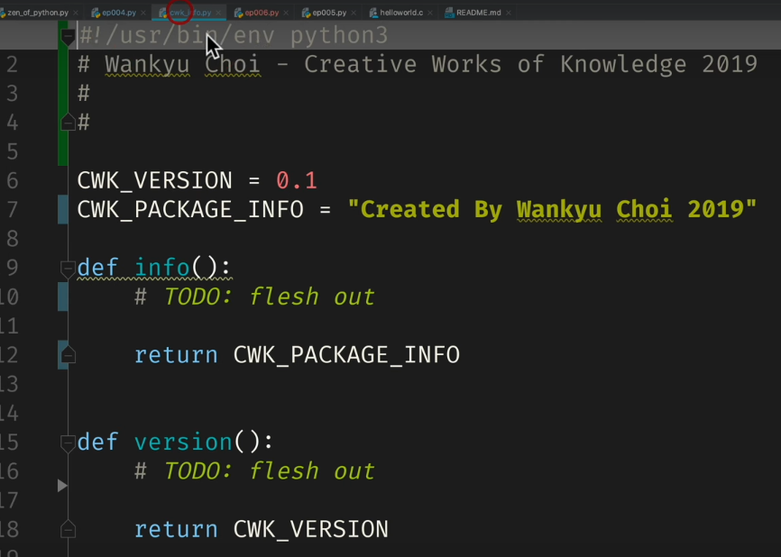

# Memento Python 초급 코스 Part 06 - 함수, Procedure, 인자, 매개변수

**영상링크 : https://youtu.be/ngqBI-GHeNU**

**CWK Memento Python : https://github.com/neobundy/CWK-Memento-Python(소스코드)**

## ***Intro***

오늘은 함수에 대해서 좀 더 자세히 알아보겠다. `print` 함수도 좀 더 자세히 살펴보겠다.

이사철이라 공사 소음이 많다. 포스트 처리를 하겠지만, 모든 소음을 다 잡아낼 순 없으니 양해바란다.

### ***`print` 함수***

아래 코드를 보자.

```python
print("Calling a procedure...")
add_procedure(1,1)

print("Calling a function...")
print(add_function())
print(add_function(2,5)*3)

if __name__ == "__main__":
    main()
```

위 코드에서 `print()` 호출은 과거에는 "print 문"이라고 했다. statement. 간단하게 Interpreter한테 내리는 명령에 해당하는 게 "Statement"이고, 결과값을 얻어내는 걸 "Expression"이라고 한다. 

아래 코드를 보자.

```python
def add_procedure(x,y)
    """
    add_procedure(x,y)

    Add and print.
    x:    first argument
    y:    second argument
    Returns
    """

    print(x+y)
```

여기 보면 `x + y` 이런 게 있는데, `x + y` 더해서 결과값을 얻는 '식'(Expression)이다. 이걸 *수식 표현*이라고도 하는데, 이렇게 번역은 거의 안 쓰니까 그냥 *수식*으로 알아두라. `x`, `y`의 내용에 따라서 값이 달라지는 '식'을 가리킨다.

`print()`가 Python 2.x대 버전에서는 statement였다. 단순한 명령이었다. 그래서 `()`와 같은 괄호가 아니라 `""`와 같은 인용 부호를 썼다. ex) `print_"okay"`.

그런데 함수로 업그레이드됐기 때문에 지금은 괄호를 써서 함수로 대접을 해줘야 한다. **함수는 괄호를 사용한다**.

지금까지 계속 봐왔던대로다. 이런걸 보면서 패턴 인식 스킬 레벨업 중이라면 단번에 눈에 들어왔을 것. 중고등학교 때 수학 배웠으니까 $f(x)=y$ 정도는 기억하실 것.

## ***함수와 매개변수***

함수를 까먹었어도 괜찮다. 여기서 $f(x)$는 function, 함수라는 뜻이고, `x` 값이 들어가면 `y` 값이 나오는 블랙 박스였다. 이때 $x$ 를 아규먼트(argument), 인자라고 하고 함수 구현의 관점에서 넘겨받을 때는 파라미터(parameter)라고 한다. 우리말로는 매개 변수라는 말을 쓰기도. 그냥 argument와 parameter는 같은 녀석을 가리키는데 관점만 다르다고 이해하면 된다. 그 이상은 고민할 필요 없다.

앞으로 argument는 `arg` 또는 그 복수인 `args`라는 약자로 자주 보게 될 거고, parameter를 줄인 `param` 또는 그 복수인 `params`도 자주 보게 될 것.

정리하면, `print(x)`를 쓰면 `x` argument를 넘겨주고, `x`라는 parameter를 받아서 뭔가 출력해주는 함수라는 뜻다. argument와 parameter는 관점만 다른 거예요.

`print(x)` 생김새가 딱 봐도 `print`라는 키워드, `()` 그리고 `x`라는 argument와 같은 symbol들로 구성되어 있고, 저마다 의미 단위가 갈린다. 패턴의 연속일 뿐이다. 아무리 복잡해 보이는 함수라도 최소한 저 symbol들과 의미 단위는 한 눈에 들어오고, 잘라 볼 수 있는 패턴 인식 스킬을 꾸준히 레벨업해야 한다.

## ***함수 호출 및 시그니처***

전문 용어로 저 함수가 외부와 소통하는 interface 선언부를 시그니처(signature)라고 한다. 함수를 호출하는 주체를 콜러Ccaller)라고 하고, 외부 함수에서 불렀다면 Calling Function(callin것nction)이고, 불려지는 함수는 called Function(called function)이라고 한한다.

그러니까 아래 코드에서

```python
def main():
    """Entry Point"""

    print("Calling a procedure...")
    add_procedure(1,1)

    print("Calling a function...")
    print(add_function())
    print(add_function(2,5)*3)

if __name__ == '__main__' :
    main()
```

`def main():`는 `add_procedure(1,1)`함수를 호출하는 calling function이고, `add_procedure` 함수는 `main()` 함수에서 불려지는 called function인 것.

## ***note***

영어 문법 배울 때 현재분사는 능동, 과거분사는 피동이라고 배운 것과 같다. 능동적으로 부르니까 호출 함수는 Calling Function, 피동적으로 호출되는 함수는 Called Function이다.

## ***Interface***

함수를 정의하거나 또는 선언할 때 소통 방법에 해당하는 interface를 선언한다.

```python
def add_function(x=1, y=1):
```

위 add function이 interface를 선언하고 있다.

컴퓨터에도 interface 단자들이 줄줄이 붙어있듯 함수도 어떤 데이터 유형의 argument를 몇 개나 주고 받을지 선언해야 한다. 이 선언, 정의라는 표현도 "declaration", "definition"이라는 영어를 더 자주 쓴다. Python에서 함수를 만들 때 `def`로 시작하는 이유. 

function을 줄여서 func라고 쓰는 언어도 있다. IOS와 Mac OS에서 app을 개발하는 애플의 언어 SWIFT가 func라고 쓴다. 전 이렇게 줄여쓰는건 질색

> `func greet(person: String) -> String`

그리고 어차피 SWIFT에서도 IDE를 쓰기 때문에 자동완성이 된다. 다분히 다른 언어와 달라야한다는 강박에서 나오는 것일뿐이라고 생각한다. 

BASIC처럼 아예 다르게 Subroutine의 약자인 `sub`를 쓰기도 한다. 

Procedure의 약자인 `proc`을 쓰기도 한다.

## ***note***

또 한 가지 짚고 넘어가겠다 역시 흑역사인데, BASIC은 우리말로는 베이식이다. 우리말이라면 몰라도 영어로는 베이식이 맞다. 원초적 본능도 '베이직 인스팅트'가 아니고, '베이직 인스팅트'가 맞다. 프랑스어로 할 때나 바직끄라고 읽는다. 우리말로 하면 '비주얼 베이직'이지만, 영어로 하겠다면 '비주얼 베이식'다. 


## ***Function vs. Procedure***

Function과 Procedure의 차이도 꼭 알아두라. 짚고 넘어가지 않으면 컴쟁이 정보들을 소화할 때 두고두고 헷갈릴테니까 짚고 넘어가겠다.

간단히 Function과 Procedure의 차이는 결과값을 돌려 주느냐(return)의 차이.

아래 코드를 보자

```python
def add_procedure(x,y)
    """
    add_procedure(x,y)

    Add and print.
    x:    first argument
    y:    second argument
    Returns
    """

    print(x+y)
```

위 코드는 Procedure인데 결과값을 돌려주지 않거든. 그냥 순차적으로 처리하고 만다. 

반면 아래의 코드를 보자

```python
def add_function(x=1, y=1):
    """
    add_procedure(x,y)

    Add and print.
    x:    first argument
    y:    second argument

    Returns the sum of x and y
    """

    return x+y

    print(x+y)
```

위 코드는 똑같은 기능을 하는데 결과값을 돌려 준다. 결과 없이 주어진 일을 순차적으로 처리하고 끝내는 Procedure. 영어 단어에서도 알 수 있다. procedure, 절차잖아. 지금으로선 print가 뭔가 출력하고 돌려주는 값은 없으니까 Procedure에 해당한다. 위의 `add_procedure`처럼. return 문이 없한다.

`z = add(x,y)` 처럼 x와 y를 더해서 z에 저장해 준다면 이건 Function. Function이 지금 X + Y 해서 return한다한다.그래서 함수, Function인 것.

Called Function인 add라는 함수가 뭔가 계산을 해서 그 결과값을 호출하는 함수, Calling Function에 돌려주는 것.

여기서 잠깐 퀴즈. 지난 시간에 만들었던 cwk utilities 패키지에 cwk info.py 아는 모듈이 있었다. 여기 version이라는 함수가 정의돼 있다.


 
이게 Procedure일까 Function 일까. 금방 봤으니까 알 수 있다. return 문이 있다. `CWK_VERSION`이라는 상수를 돌려준다. 그러니까 함수.

## ***note***
 
여기서 또 잠깐 영어 표현 짚고 넘어가겠다. 변수는 변하니까 Variable. 상수는 항상 그 값을 유지하니까 Constant.

이 Procedure와 Function을 구분하는건 또 컴쟁이 흑역사인데, Pascal이라는 엄격한 교육용 프로그래밍 언어에서 따지던 얘기. Pascal에서는 Function과 Procedure를 정말 엄격히 구분했다. 훨씬 많이 쓰던 C 언어에서는 Procedure를 결과값을 돌려주지 않는 보이드 Function이라 했다. 지금도 그렇게 쓰고 있고, 비주얼 베이식에서도 굳이 Procedure와 Function을 나눈다. 근데 요즘 대부분의 현대 언어에서는 부질 없는 얘기. 그냥 상식으로 알고 넘어가라. Python에서는 가리지 않다 그냥 `def`라는 키워드로 Procedure든 Function이든 만들 수 있다. Procedure냐 Function이냐는 return 문의 유무에 따라서 갈릴뿐. return 문이 있으면 Function인거고 없으면 그냥 Procedure. 
 
## ***Signature***

함수를 define, declare 할 때 Calling Function과 Called Function이 주고받을 argument의 개수와 데이터 유형을 정의해두는데, 이걸 원형, Proto type이라고 한다.
 
코드에서 `def ~`와 같은 선언부하고 `return ~` 결과값을 합쳐서 signature라 한다. 기본적으로는 이 선언부만 떼어내면 interface에 간단한 매뉴얼이 된다. interface라는 말이 Inter+Face, 얼굴을 맞대는 거잖아. 그렇게 소통을 하는 것. 그런데 어디에 뭐가 있는지 알아야 뽀뽀를 하지. 그래서 이걸 signature라고 하는데 signature 의미를 확장해보면 Procedure냐 Function도 포함되는 것. Function이라고 하면 어떤 유형의 결과값을 return 하는지도 알아야 한다.


## ***example***

오늘 예제를 보자. 오늘이 여섯 번째 시간이니까 run configuration도 여섯 번째 거를 실행하면 된다. run configuration 만드는 건 여러 차례 봤으니까 기억하실 거라고 믿는다.

이 `add_procedure'와 `add_function`이라는 두 개의 함수가 정의되어 있다. 딱 봐도 알겠지만 하나는 Procedure, 하나는 Function. 이름은 그냥 붙인 것. 강제로 Procedure나 Function이라는 이름을 붙여야 되는 건 당연히 아니다. 그 정도는 아실 거라고 믿는다. `add_procedure`는 return 값이 없으니까 Procedure인 거고, `add_function`은 return 값이 있으니까 Function. 이 return 값의 유무로 Procedure냐 Function이냐가 갈리는 것.

이 Procedure는 X, Y 변수를 argument로 받아서 그 안에서 결과값을 출력해 주지만 Function은 결과값을 return 한다.Calling Function에 돌려준다. Calling 함수 쪽에서 저장해서 다른 계산을 할 수도 있고 이렇게 그냥 출력할 수도 있다. 활용폭이 좀 더 넓어지고 융통성이 있는 것. 아래 코드와 같이.

```python
print("Calling a function...")
print(add_function())
print(add_function(2,5)*3)
```

또 `add_procedure`는 반드시 argument를 넘겨 줘야 한다. `add_function`은 기본값이 정해져 있다. 그래서 argument를 넘겨 주지 않으면 이 기본값을 사용. 여기서 `add_procedure`는 argument를 넘겨주고 있고 `add_Function`은 안 넘겨줄 수도 있고 넘겨 줄 수도 있다. 넘겨주면 넘겨주는 argument를 사용하고 안 넘겨주면 기본값인 1과 1을 사용. 아래 코드를 보자.

```python
def add_function(x=1, y=1):
    """
    add_procedure(x,y)

    Add and print.
    x:    first argument
    y:    second argument

    Returns the sum of x and y
    """

    return x+y

def main():
    """Entry Point"""

    print("Calling a function...")
    add_procedure(1,1)
    
    print("Calling a function...")
    print(add_function())
    print(add_function(2,5)*3)

if __name__ == "__main__":
    main()
```

## ***docstring과 Quick Reference***

패턴 인식 스킬이 한참 레벨 업되고 있을 것. 오늘은 이 큰 따옴표 세 개를 사용하는 docstring 주석을 좀 더 자세히 달아봤다. 함수 정의할 때는 이렇게 함수 signature, argument의 종류와 데이터 유형, return 값의 유무, return 값의 데이터 유형, 이런 것들을 정리해 놓는다. 이 docstring만 잘 달아놔도 나중에 특별한 유틸리티를 활용해서 문서화, Documentation을 쉽게 할 수 있다. 그러니까 템플릿으로 활용해라.

PyCharm의 Quick Reference 기능을 사용할 때도 깔끔한 정보를 확인할 수 있다. 아래와 같이.


이렇게 Built-in 함수 등 주석이 잘 달린 소스 코드에서 템플릿을 베껴 봐라. 자꾸 베껴 봐라. 공개된 소스 코드면. 나도 이 builtin.py에서 베껴 온 것.

예를 들어서 이렇게 가서 여기서 docstring 베껴온 것.


그니까 이걸 템플릿으로 활용해라. PyCharm에서 print만 입력해도 signature가 뜬다.
그리고 Builtins.py라는 모듈에 이 print 함수가 정의돼 있다는 것도 뜬다. 이 signature를 확인할 수 있다. 


Calling 함수와 Called 함수 간의 소통 방법인 interface만 확인하는 것.

어느 단자에 뭘 꼽아야 하는지 각 단자는 argument인 것이고, 그러니까 여러분이 사용하는 컴퓨터나 스마트폰도 interface가 있듯 외부 장비와 연결하는. 그거나 마찬가지다. 기기마다 단자 수랑 종류가 다르다. 아이폰은 아직까지는 라이트닝 케이블만 있다. 안드로이드 폰은 USB 단자가 대부분이고. 컴퓨터는 USB 단자뿐 아니라 다양한 다른 단자들이 몇 개씩 달려 있다. interface에 달린 개수와 종류가 다 다르다. 함수도 마찬가지다 함수 interface의 단자에 해당하는 argument 개수가 다르고 숫자, 문자, 리스트 등등 argument 데이터 유형도 달라진다. 그 함수를 만든 개발자 마음이다.

print 함수 signature 확인해 보면 앞에서 사용했던 것보다 훨씬 복잡하고 argument 개수도 많다.


interface 단자와 그 단자가 수용하는 케이블의 유형이 다르다는 뜻. argument를 꼭 다 꽉꽉 채워서 넘겨야 하는 건 아님. 어디까지가 필수이고 어디까지가 옵션인지는 메뉴얼을 보거나 이 signature를 확인해야 알 수 있다. 좀 자세히 확인해 보자.


이렇게 `=` 사인이 있는 argument는 옵션이란 뜻. argument를 넘겨 주지 않으면 기본값을 사용하겠다는 것. 이 `sep=' '`라는 argument가 공백으로 돼 있다. 안 넘겨 주면 공백으로 분리한다는 뜻. 뭘 분리하냐면 넘겨주는 변수 목록을. 그러니까 앞에 print할 목록들을 여러 개 넘겨 줄 수 있거든. 이 asterisk, `*`가 그런 뜻. 넘겨 줄 때 개수가 정해지는 복수의 변수들을 여러 개 넘겨줄 수 있다. 

> arg(s) -> argument(s)

그 변수들 목록을 공백으로 분리하겠다는 것. 이 공백 문자가 아니라 다른 걸 넣어주면, 이 separator argument를 기본값이 아니라 다른 걸 넣어주면 그 문자로 이 목록을 분리를 해준다. 그리고 이 separator부터는 기본값이 주어졌으니 옵션이라 뜻. 이 앞에 있는 변수 목록 이 목록만 건네주면 된다. 여러 개를 건네줄 수도 있고. asterisk가 붙어있다는건 안 건네줄 수도 있다는 뜻. 연계해서 무한대거든. 그러니까 아무것도 안 건네주고 그냥 print 함수만 호출하면 이 `end`라는 argument에 주어진 기본값인 줄 바꿈 문자, 뉴라인 문자, `\n`만 출력되게 된다.

가령 오늘 예제를 실행해 보면 줄줄이 붙어서 나온다.

```python
def main():
    """Entry Point"""

    print("Calling a procedure...")
    add_procedure(1,1)

    print("Calling a function...")
    print(add_function())
    print(add_function(2,5)*3)

if __name__ == '__main__' :
    main()
```

실행해보면 다음과 같다.

`Calling a procedure...`  
`2`  
`Calling a function...`  
`2`  
`21`  

줄을 띄우고 싶으면 아무 argument를 주지 않고 print 함수를 호출하면 된다. 아래와 같이.

```python
def main():
    """Entry Point"""

    print("Calling a procedure...")
    add_procedure(1,1)

    print()

    print("Calling a function...")
    print(add_function())
    print(add_function(2,5)*3)

if __name__ == '__main__' :
    main()
```

그러면 아까 Quick Reference에서 봤던 것처럼 이 뉴라인만 출력이 된다.


아래와 같다.

`Calling a procedure...`  
`2`  

`Calling a function...`  
`2`  
`21`  

## ***note***

온라인이든 내장 Quick reference 기능이든 아니면 소스 코드에서 확인을 하든, 들여다보고 공부하면 된다. 단 외우지는 마라. 그냥 감만 익히면 된다. 프로그래밍 처음 시작하는 분들이나 비컴쟁이 분들이 오해하는 부분인데 컴쟁이들이 저걸 다 머리에 채워 놓고 사는게 아니다. 그건 짱구 짓. 언제든 reference가 있는데 뭐 하러 담고 살겠어.

프로그래밍 언어는 영어처럼 인간의 언어가 아니다. 컴퓨터와 대화할 때는 어차피 컴퓨터를 쓰기 때문에 머리에 담고 있을 필요가 없다. 물론 익숙해지면 그냥 자연스레 외워지는 녀석들도 있지만 PyCharm에서 보듯 도구를 사용하면 대부분 물 흐르듯 참조가 가능. 그러니까 쓸데없는데 뇌의 프로세싱 파워나 메모리 공간을 낭비하지 마라.

누가 나한테 프로그래밍 언어 몇 가지나 하느냐 무슨 프로그램 다룰 줄 아느냐 이렇게 물어보면 그 질문 하나로 비컴쟁이 라는걸 알 수 있다. 컴쟁이한테는 무의미한 질문. 어느 하나만 배워도 다 배운 것. 키워드랑 문법, 기본 정신, 데이터 모형 이런 것만 다르고 조금씩 다른 것. 다 똑같다. 공통점이 훨씬 많거든. 소프트웨어도 마찬가지.

## Object-Orientation

왜? 객체 지향성 - Inheritance, polymorphism, Encapsulation

> Object-Orientation

Python이 하늘에서 그냥 뚝 떨어졌을까. Python을 만든 건 C언어다. Python 자체가 C 언어로 만들어졌다. 다른 언어로 구현되기도 하지만 대부분은 C로 구현된 이른바 CPython을 사용한다. Anaconda 배포판에 들어 있는 Interpreter 역시 C Python. 언어적으로도 아이디어를 많이 빌려 왔고. 고쳐야 할 건 또 많이 고쳤고 C도 원시 조상이 아니다. B라는 언어가 있었거든.

> ***Genesis of Programming Languages***  
> A begot B;  
> B begot C;  
> C begot Python...  

B에서 C가 나왔다. 창세기를 보는 거 같다. 누구는 누구를 낳고 누구는 누구를 낳고.

프로그래밍 언어는 딱 하나만 제대로 배우면 된다. 나머진 필요하면 다 거져 먹으면 된다. 제가 왜 수십개 언어를 안 하냐면 당장 필요 없으니까. 네오퀘스트라는 회사 운영할 때 날고 기던 PHP 지금은 왜 안 할까. 필요 없으니까. 필요하면 또 하겠지. 전 java 싫어한다. 그래서 안 하지만 네오퀘스트 운영할 때 채팅 서버가 필요해서 java로 만들었었다. 그 때도 배워서 만들었다 java를. 그때나 지금이나 싫기 마찬가지지만.

그러니까 초보자분들도 힘내세라. 영어나 일본어 중국어 같은 인간의 언어와 프로그래밍 언어는 다르다. 하나 배우면 끝난 것.

아직까지는 초보자분들을 위한 내용이다 여기서 다뤘다고 끝난 게 아니거든. 중급 내용이 시작되면 전부 더 자세히 다룰 것. 함수도 지금은 윤곽만 잡으면 되니까 여기까지만 설명하겠다.
