# Memento Python 초급 코스 Part 07 - 버전 관리, Git, GitHub

**영상링크 : https://youtu.be/e6ZAfvbGfRY**

**CWK Memento Python : https://github.com/neobundy/CWK-Memento-Python - 소스코드**

## ***Intro***
Memento Python 일곱 번째 시간인 오늘은 Version Control에 관해서 정리해 보겠다. Versioning, Version Contorl을 안 하는 프로그래머나 개발자는 없다고 봐야 함. Versioning을 안 한다면 뭔가 크게 잘못 배운 것. 상식적으로만 코딩을 배운다 해도 Versioning의 개념 정도는 꼭 챙겨 두시기 바람. 세상엔 딱 두 종류의 사람이 있어요. 문서 작업할 때 Versioning을 하는 사람과 안 하는 사람, 천당과 지옥을 오갈 수도 있다. 

## ***Backup과 Version Control의 차이***
Backup과는 또 다른 얘긴데, 단순한 Backup으로는 시시각각 저지르는 잘못을 바로 잡지 못한다. Mac에서 정말 유용한 Backup 기능이 Time Machine이다. 한번 보자. 파일 시스템 곳곳을 주기적으로 스냅샷으로 Backup해서 언제든 원하는 위치로 원상복구할 수 있는 기능. 어제로 돌아갈 수도 있고. Backup 용량에 따라서 한참 전후로 돌아갈 수도 있다. 무서운 기능이다.

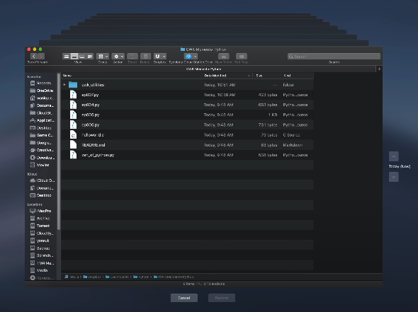

Backup은 보험 같은 거라 안 쓸 때는 비용이 아깝지만 꼭 써야 할 때는 이보다 아쉬운 게 또 없다. 저도 iMac 프로 사서 지금은 타임머신 Backup하면서 최근에 딱 한번 타임머신 돌려서 파일을 복구했는데 그래도 정말 결정적이었다. 가슴을 쓸어내리는 순간. 단순 Backup은 기존 파일 시스템을 통째로 덮어 쓰기 십상이기 때문에 원하는 스냅샷을 얻을 수가 없음.

돈 주고 쓰면 드랍박스에서도 버전인 기능이 추가된다. 이렇게 변경 내용 기록 살펴보면 수정한 내역이 뜬다. 그리고 복원할 수 있다. 이전 버전으로 돌아갈 수 있음. 'Revert 한다'고 하는데 최근 가장 많이 쓰는 Version Control 시스템이 Git라는 녀석이다. CVS나 Subversion 같은 다른 시스템을 쓰는 개발자들도 아직도 있다. 나도 이 CVS하고 Subversion을 거쳐서 Git에 안착을 했다.

## ***Git의 다양한 활용***
프로그래밍, 개발에만 Git를 쓸 수 있는 건 아니다. 일반적인 글을 쓸 때도 versioning을 할 수 있다. 주기적으로 스냅샷을 만들어 두는 것. 나도 글을 쓰거나 번역을 할 때 GitHub의 비공개 프로젝트를 만들고 자동 commit 스크립트를 셀 스크립트를 만들어서 주기적으로 업데이트를 한다. 과거에 bbc news를 번역할 때 auto commit 셀 스크립트를 돌렸습다.

git add로 모든 파일을 추가해 주고 commit을 한 다음에 원격 repository에 push한다. 그럼 Git Hub에 올라간다. 이렇게 shell 스크립트를 Cron이나 Keyboard Maestro 같은 유틸리티로 주기적으로 실행을 해주면 Versioning은 백그라운드에서 알아서 처리된다. 10분 단위로 해줄 수도 있고 OCD틱하게 1분 단위로 해줄 수도 있다. 물론 글을 일반 텍스트로 써야 한다는 제약이 따르겠지.

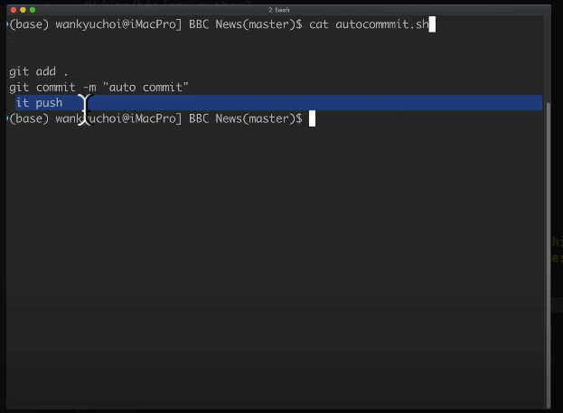

## ***소스와 프리젠테이션 - 워드 프로세서와 텍스트 에디터***

워드 프로세싱에 목을 메는 사용자라면 식겁할 소리일 수도 있지만 사실 일반 텍스트로 글을 써버렸다면 오히려 워드 프로세서로 돌아가지 못할 정도로 장점이 많다. 여기서 Source와 Presentation 개념을 구분할 줄 알아야 하는데, 프로그램이든 워드 문서든 소스가 있고 그 소스를 가공해서 프리젠테이션을 만드는 것. 비주얼적으로 포장을 하는 건 맨 나중에.

가령 프로그램 소스 코드라면 그 소스 코드를 이용해서 원하는 프로그램이라는 결과물 프리젠테이션이 나오는 거고 웹페이지나 워드, PDF 문서 역시 소스에 해당하는 텍스트가 먼저 있고 그 내용을 가공 처리해서 웹, 워드, PDF 등의 프리젠테이션으로 뽑아내주는 것. 워드 프로세서는 소스를 입력하자마자 바로 프리젠테이션 layer가 적용되기 때문에 편하긴 하지만 소스 차원에서 제어가 안 된다는 치명적인 단점.

Mac에서 사용하는 워드 프로세서인 페이지만 봐도 제목, 부제목, 본문으로, 소스와 프리젠테이션이 섞여 있다. 일반 텍스트로 소스를 만들었다면 웹, 워드, PDF 등 원하는 형태로 변환하는 건 어차피 컴퓨터가 알아서 한다. 소스 차원에서 관리가 가능하니까 변경 내용 추적이 수월해지고 크기도 현저히 위주로 들어서 네트워크상에서 공유하기도 편해진다.

그래서 수백 수천 명이 달라붙는 공동 작업도 식은 죽 먹기다. 또 워드 프로세서에서 글을 쓰면 글을 쓰는 도중에 장식을 하느라고 쓸데없이 손이 바빠진다. 원래 글쓰기 과정은 적어도 3단계로 나누어야 한다. 1단계에서는 순수하게 생각을 글로 옮기는 과정. 2단계에서는 글을 수정 보완하고 손질하는 과정. 3단계에서는 프리젠테이션을 고려해서 비주얼적으로 최종 장식하는 과정.

> Step 1. Outlining & Drafting  
> Step 2. Fleshing Out & Proofreading  
> Step 3. Presenatation & Publishing   

그런데 워드 프로세서에서는 1단계하고 2단계가 막 섞이고 3단계를 짬뽕하기 십상. 워드 프로세서를 사용하더라도 1, 2단계를 먼저 거치고 장식은 마지막에 하는 게 순서. 근데 못 쓸 버릇이 들 위험성이 너무 크지.

어차피 이런 과정을 거칠 작정이라면 애초에 일반 텍스트 문서로 글을 쓰지 않을 이유도 없다. 게다가 제가 추천하는 Sublime Text나 TextMate, BB Edit 등 유명 에디터의 기능은 마이크소프트 워드나 아래아 한글, 맥에서 사용하는 페이지 등이 따라갈 수가 없는 에디터들.

## ***Git, Git Hub***
워드나 아래아 한글이 발끝도 못 따라간다. 일반 텍스트 문서에서 간단한 치장이 가능한 Markdown까지 배우면 워드 프로세서에서 글을 쓸 이유는 사실상 사라진다. 구체적으로는 몰라도 된다. 그냥 호기심만 가지길. Git나 Git Hub이 꼭 개발에만 쓸 수 있는 게 아니구나. 그런 호기심만 생겨도 여러분의 텍스트 작업 생산성은 달나라를 넘어서 화성까지 갈 수 있다.

늘 호기심이 출발. 그 다음은 맨땅에 헤딩. 텍스트 작업이나 Markdown, Git에 관해서는 과거에 대해 영상을 올렸다. 그러니까 재생산하지는 않겠다. 과거 올린 영상 검색해서 거들떠 보시기 바란다. Git는 리눅스 커널의 아버지 Linus Torvalds가 개발한 분산 버전 관리 시스템, Distributed Version Control System. 버전 관리를 간단하게 말하면 **변경 내용 추적**이라고 할 수 있다.

이건 원시적인 아마 마이크로소프트워드에도 있는 기능이다. Git가 CVS subversion 같은 다른 중앙집중 Repo(sitory)하고 다른 점은 파일 보관소인 Repo(sitory)가 로컬에 존재한다. 기존 versioning 시스템은 공동 작업을 하든 혼자 쓰든 중앙 Repo에서 파일을 가져오고 올리고 했거든. 이 중앙 파일 보관소가 아작나면 데이터가 다 날아간다.

Git처럼 분산 시스템이라면 각 사용자의 로컬 머신에도 리포를 따로 둘 수 있다. 100명이 참여하는 프로젝트라면 Repo가 최소한 100개라는 뜻. 엄청난 용통성. Repo 하나가 아작나도 다른 리포에서 복구하면 그만이니까 Backup 효과는 말할 것도 없고 forking해서 가지를 치기도 쉽다. 실제로 Git 써보면 정말 빠르고 편함. CVS나 subversiong으로 돌아갈 이유가 없음.

이걸 만든 Linus는 크리에이터가 보낸 메신저 중 한 명. 시대의 천재. 그런 인간이 기존 versioning 시스템에 불만을 품고 몇 주만에 만들어낸 시스템. 개길 이유가 없겠고 받아들여야지. 먼저 터미널에서 내 프로젝트를 Git로 Version Control 하는 방법을 살펴보고 같은 Work flow를 PyCharm에서 적용해 보겠다. 그래야 또 PyCharm이 얼마나 편한지 실감하겠지.

먼저 MyProject라는 폴더를 하나 만들고 여기서 글을 쓴다고 가정해 보자. 그리고 파일을 하나 만들고. 여기서 글을 쓴다고 생각해 보자. 먼저 Git 사용이 처음이라면 글로벌 사용자 이름하고 이메일 주소를 설정해 줘야 한다. 이름이랑 이메일 주소. PyCharm에서도 처음 Git를 사용하면 이걸 물어본다. 딱 한 번 해주면 됨.

### ***Git 초기화 및 commit***
그리고 나서 최상위 폴더에 가서 MyProject가 지금 최상위 폴더지? Git init를 하면 해당 폴더에 `.git`라는 숨겨진 폴더가 생긴다. 저게 Repo. Repository. `.git`라는 숨겨진 폴더에 Git Repository하고 관리 시스템이 함께 들어간다. 그런 다음에 작업 중인 파일을 몽땅 Repo에 추가한다. `git add .`이라고 치면 된다.

### ***파일 추가 및 commit***
파일이 수백 개든, 수천 개든 한꺼번에 추가할 수 있다. `add`는 등록만 하는 거고 실제로 저장을 하려면 `commit`이라는 걸 해야 한다. 그러면 실제로 저장이 된다.

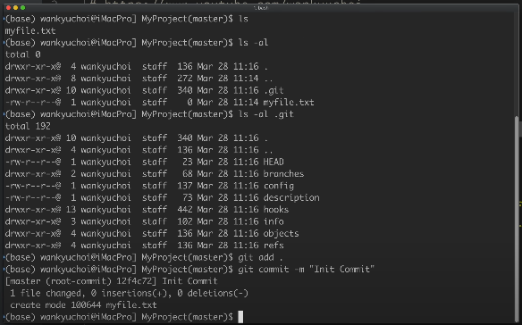

저 `-m`이라는 옵션은 메시지를 써주는 건데 간단한 설명을 적는 것. 앞서 언급했지만 수작업으로 이렇게 commit 할 수도 있고 저처럼 cron을 돌리거나 다른 유틸리티를 사용해서 주기적으로 Auto Commit 할 수도 있음.

쏠쏠한 타임머신 효과를 보려면 Commit을 자주 해줘야 하거든. 돈 드는거 아니니까 저장 공간 걱정할 필요도 없다. 무지하게 조금 잡아먹으니까. 실제로 CWK Memnto Project를 복사를 해서 추가 작업을 해보겠다.

> 실제로는 2GB~3GB 정도 되면 괜히 오류나고 느려지고 한다고 말씀하셨던 것 같습니다. 용량에는 문제가 없는데, 속도 저하 이슈가 생긴다고...

### ***SHA-1 Checksum***
Git Log를 쳐보면 이 암호틱한 7자리 숫자가 보인다. 이걸 'sha -1 Checksum'이라고 한다. 영어로 sha 또는 s-h-a라고 읽는다.

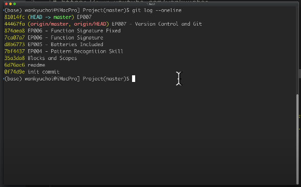

### ***revert와 commit***
수정이 가해진 체인지 세트를 가리키는 160비트 고유 값. 16진수 숫자로 나타내면 40자리가 되는데 이걸 앞 7자리만 보여주는 것. 운영체제 커널 정도라면 모를까 웬만한 프로젝트이면 7자리도 겹치는 경우가 거의 없다. 이 sha 값을 라벨로 이용해서 수정 내용을 추적하는 것. 특정 파일을 꺼내 오려면 Checkout을 쓰고 수정 내용을 되돌리려면 revert를 쓴다. revert를 해볼까?

그러면 돌아가게 된다. 이 `revert`도 commit이 된다. revert된 내역도 히스토리가 생긴다. 복잡해 보일 것. 당연하다 git도 두고두고 배워야 하는 녀석이라 한방에 이해되면 이상한 것. 그래도 배워두면 두고두고 가슴을 쓸어내릴 것. Version Control에서 무시하고 싶은 파일은 `.git ignore`라는 파일에 추가할 수 있다.

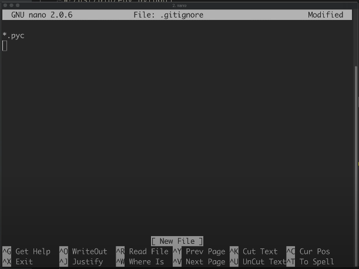

이렇게 해주면 Python이 컴파일에서 만들어내는 byte code 파일은 versioning 중에서 제외해줌.

### ***Git Ignore 설정***
PyCharm에서도 자체적으로 사용하는 파일들과 폴더들이 많다. 개발자가 신경 안 써도 되는. `.idea` 폴더하고 관련 파일이 대표적. 제외하고 싶은 파일은 ignore 해주자. 터미널에서 GitHub을 연동하는 건 과정이 꽤나 복잡하니까 건너 뛰겠다. PyCharm 쓰면 정말 간단.

## ***PyCharm에서 Git 사용***
이제 PyCharm에서 git를 써보자. CWK Memento Project는 이미 git로 관리를 하고 있으니까 처음부터 만들려면 새로운 프로젝트에서 시작해야겠지. 복습도 할 겸 PyCharm에서 git로 관리할 새로운 프로젝트를 아무거나 하나 만들어 보자. newproject, cwk gitproject라고 합시다. create 해주면 new window에서 만들고. 그럼 conda 환경으로 새로운 프로젝트를 만들어 준다.

### ***PyCharm에서 프로젝트 추가***
스크립트를 추가해보자. Python file, MyScript Package도 추가해보자. 

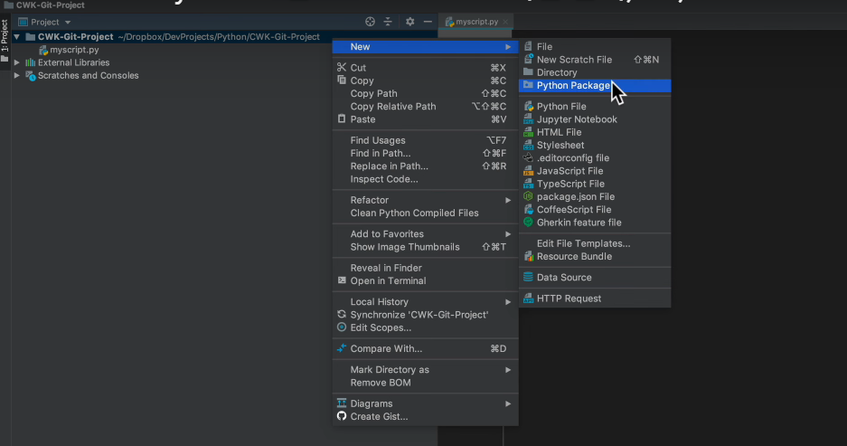

New Python Package, My Package, Package 안에도 모듈을 추가한다. My Module, 그런 다음에 VersionControlSystem, VCS 메뉴에 가서 Import Into VersionControl, Create Git Repository를 하자. Git Repo를 초기화해야 되니까.

그런 다음에 해당 프로젝트 폴더를 선택해준다. 그럼 이렇게 파일들이 빨간색으로 표시. 

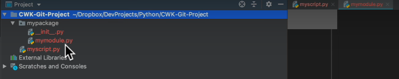

Repository를 만들었지만 아직 파일들을 등록 안 했기 때문. 먼저 아까도 언급했듯이 git ignore할 폴더와 파일들을 설정해 주겠다. 안 그러면 귀찮아진다. `Command + ,`를 눌러서 Preferences를 불러낸다.

### ***Ignore 설정***
그런 다음에 Version Control에 가서 Ignored Files에서 추가해 준다. Ignore All Files Matching, `.idea/`, .idea/\*, .idea/\*.\*, *.iml, *.xml까지 해준다.

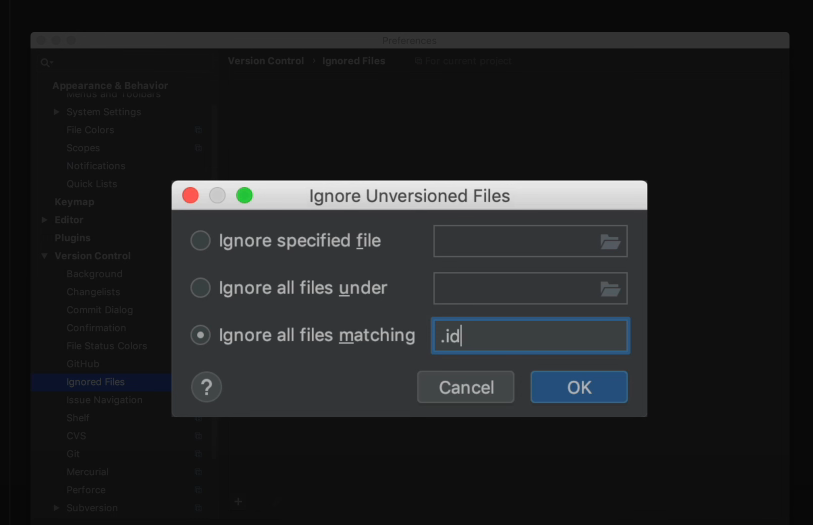

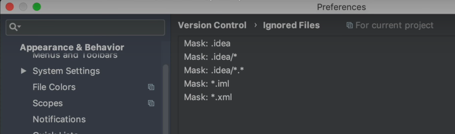

그리고 OK. 프로젝트의 최상위 폴더에서 우클릭을 해서 git add를 해준다. 그럼 등록이 되어서 이제 녹색으로 바뀐다.

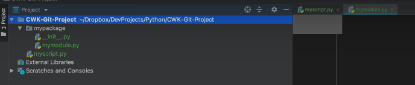

### ***Commit과 연동***
Version Control 탭에 내려와서 Unversioned Files가 3개가 보이지? 여기서 오른쪽 클릭을 해서 Commit를 한다. `Init Commit`라고 설명을 써주고 메시지를 써주고 Commit를 한다. 그러면 Commit가 잘 됐지. Git Hub에 올리고 싶으면 VCS 메뉴에 가서 Import Into Version Control, Share Project on Git Hub을 한다.

### ***GitHub와 연동***
지금 잠깐 Account Information을 가져오는 화면이 떴다. Git Hub에 연동이 안 돼 있는 분이라면 Git Hub 로그인 인증을 해줘야 할 것. 그리고 Repository 이름을 써주고. Share를 누르면 Git Hub에 연동이 된다. 그리고 Pushing을 하고. 그리고 Successfully Shared Project on Git Hub이라고 뜬다. 이렇게 내 Git Hub 계정에 가보면 CWK Git Project라고 만들어져 있다.

### ***GitHub에서의 Commit 확인***
들어가 보면 Commit이 잘 돼 있다. 프로젝트를 Commit할 때마다 Local Repository에도 적용을 하고 이렇게 Git 메뉴에 가서 Push를 해주면 Git Hub에도 올릴 수 있다. 반대로 Git Hub에서 가져오려면 내 Local Repo를 Git Hub Repo로 업데이트를 하려면 풀 끌어내리면 되겠고.

### ***GitHub에서 프로젝트 복제***
저처럼 오픈소스로 공개한 프로젝트를 Git Hub에 공개한 프로젝트를 Local Computer에 복사해 놓고 싶으면, Clone을 해오고 싶으면 VCS 메뉴에서 Git Clone 한 다음에 해당 URL을 적어 놓으면 된다. 그리고 카피에 넣을 디렉토리를 선택. 그럼 잘 가져온다. 이렇게 Local 로 copy를 했으면 앞으로는 pull만 해주면 계속 업데이트가 되겠지. 여러분들도 그렇게 업데이트를 해서 사용하면 된다.

### ***Git에서 파일 관리***
Version Control의 위력을 잠깐만 맛보자. 원하는 파일을 선택하고 우클릭해서 git 메뉴를 불러낸다. 그리고 show history를 보면 된다. 

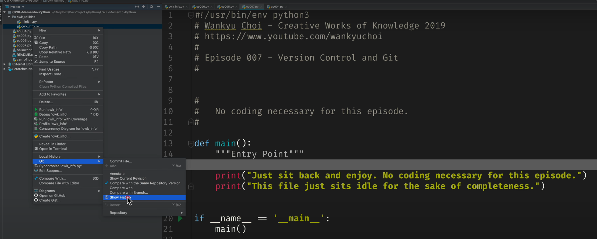

그간 commit한 기록들이 나온다. 프로젝트 진행률이 높다면 히스토리 내역이 장난이 아닐 것.

### ***Git의 히스토리와 Diff 기능***
`show diff`를 보자. 그러면 뭐가 달라졌는지 각 commit별로 보여줘서 깔끔하게 보인다.

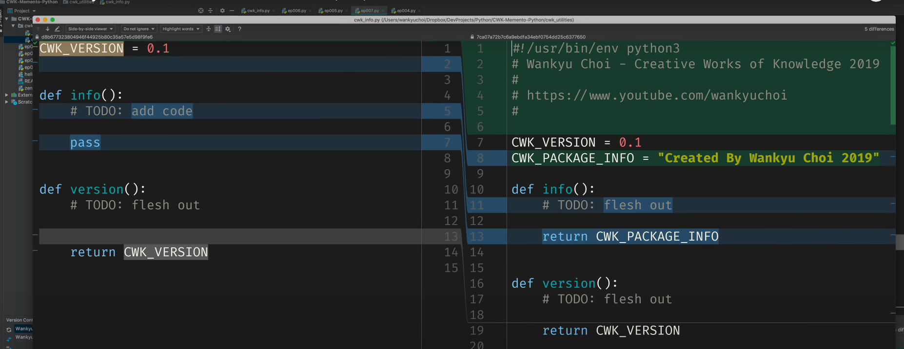

revert를 할 수도 있다.

## ***Sublime Merge***

sublime text 개발자들이 만든, sublime merge도 추천할만하다. sublime text editor를 주 개발도구로 쓴다면, 두말할 나위가 없고. 연동이 정말 잘 돼있다. versioning 내역을 참 깔끔하게 볼 수 있다.

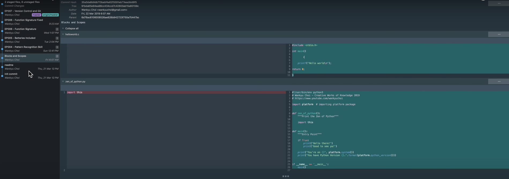

git가 텍스트 작업에 어떤 은총을 내려줄 수 있는지 삘이 와야 한다. 여러분은 이제 Version Control까지 할 수 있는 위풍당당 개발자다. 

주변에서 공사들을 하는데, 이걸 피해서 녹음하느라 목이 말이 아니었다.