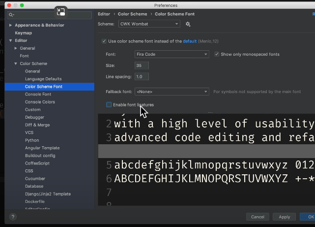
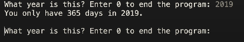
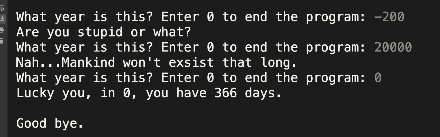

# Memento Python 초급 코스 Part 08 - 연산자와 조건문

**영상링크 : https://youtu.be/AO7tY_B6RTo**

**CWK Memento Python : https://github.com/neobundy/CWK-Memento-Python(소스코드)**

## ***Intro***
오늘은 연산자와 조건문에 관해서 살펴보겠다. +, -, /, * 등 유치원 산수에 등장할 만한 연산자는 건너 뛰겠다. 먼저 PyCharm에서 단축키 하나 짚고 넘어 가자. 특정 코드를 주석 처리하고 싶으면 `command` + `/`키를 누른다. `main` 함수에서 원하는 함수를 호출하고 다른 함수는 주석 처리해서 건너뛸 수 있다. 특정 코드를 잠시 건너뛰고 싶을 때 주석 처리하는 것이 팁. 일일이 Pound sign(`#`) 안 써줘도 `command` + `/` 누르면 이렇게 Toggle 해준다.

## ***산술 연산자***
먼저 산술 연산자, Arithmetic Operators를 보자. 영어로 연산자는 Operator, 연산에 사용되는 피연산자는 Operand라고 한다. 곱셈이 X가 아니라 Asterisk, `*`를 사용한다는 것은 엑셀 써본 분은 아실테고.

그것만 주의하면 된다. 나눗셈은 `/`. 나눗셈 기호를 두 번 쓰면 (`//`) 소수점 이하 버리고 몫만 취하겠다는 뜻. 영어로는 Floor Division이라고 한다. 이 `%` 문자를 사용하면 Modulo 연산자라고 하는데 (몫이 아닌) 나머지만 구한다. 영어로는 Remainder라고 한다. 이 Modulo 연산자에 관해서는 다시 자세히 설명하겠다. Asterisk를 두 개 쓰면(`**`) 거듭제곱 연산자(Exponential operator)다. ex) **2\*\*8 is 256**

> 2\*\*8 = $2^8$ = 256

## ***eqaul sign과 논리 연산자***
논리 연산자에서 가장 중요한 건, equal sign(`=`)과 double equal sign(`==`)이 완전히 다르다는 것. eqaul sign 하나만 쓰면 값을 대입하거나 할당할 때 쓰는 Assignment라는 뜻. 조건문에 eqaul sign 하나를 쓰면 조건을 확인하는 것이 아니라 해당 값으로 변수를 덮어 쓰는 결과. 따라서, 2019년을 확인한답시고 `if year = 2019`를 쓰면 `year` 라는 변수에 `2019`라는 값을 대입하는 결과. 

이 expression을 evaulation 하는 거니까 `year`에 `2019`라는 값을 덮어쓰는 것. `year`가 2019년인지 확인하려면 `==`을 써줘야 한다. 이 `==` sign이나 not equal sign, `!=`을 수학 기호처럼 보는 분은 해당 font가 Ligature라는 기능을 제공하기 때문. 혹시 이게 싫다면 Preferences 불러와서 Editor, Color Scheme, Color Scheme Font 여기서 Enable font Ligature라는 걸 Apply 하면 수학 기호로 보이는 것. 빼주면 일반 프로그래밍에서 사용하는 기호로 나타남.



### ***비교 연산자***
나머지는 산수 시간에 배운 것과 크게 다르지 않다

- `x > y` : x가 y보다 크다
- `x < y` : x가 y보다 작다
- `x == y` : x와 y가 같다
- `x != y` : x와 y가 다르다
- `x >= y` : x가 y보다 크거나 같다
- `x <= y` : x가 y보다 작거나 같다

이걸 반대로 쓰지 않도록 주의. 느낌표가 아닌 영어, 즉 `not`, `is`, `in`등의 연산자도 있는데 이건 객체와 관련됐거나 List나, Dictionary 과 같은 집합을 가리키는 set에 원소 확인할 때 사용하는 거니까 객체지향 프로그래밍 다루거나 데이터 유형 설명할 때 살펴볼 것.

## ***복잡한 연산 처리***
Root 값을 구하거나 좀 더 복잡한 연산을 하려면 Maht Library를 사용. 가령 Root 값 구하려면 Math Library의  `math.sqrt` 함수를 사용하면 된다. 당연히 Math Package를 import 해줘야 함

## ***연산자 우선순위***
연산자와 관련해서 또 한 가지 주의할 점은 우선순위, Precedence다. 가령 더하기보다 곱셈을 먼저 한다. 연산자가 등장하는 순서와는 상관이 없다. `format((2+2)*3, 2+2*3)` 와 같이 괄호로 Override 해주지 않으면 우선순위가 높은 연산자로 먼저 계산을 하게 된다. `2 + 2 * 3`은 2와 2를 먼저 더하는 게 아니라 뒤에 나오는 2와 3을 먼저 곱하고 2를 더 해줌. 산수 까먹었으면 다시 되새기자. 우선순위 무시하고 계산하면 10이 나오겠지만 우선순위를 고려하면 8이라는 값이 나와야 정상.

연산자 고유의 우선순위를 무시하려면 괄호로 묶어줘야 한다. `2+2`에 괄호를 써주면 곱하기보다 더하기를 먼저 계산해서 `(2+2)*3=12`가 되는 것. 산술 연산자 우선순위는 말 그대로 산수에서 배운 그대로.

앞서 살펴본 연산자 중에서 우선순위가 가장 높은 건 거듭제곱 연산자 Exponential Operator. 산수에서도 마찬가지. 연산자 우선 순위 헷갈린다 싶으면 무조건 자기가 원하는 우선순위에 괄호를 쓰라. 그게 논리적 오류를 막는 가장 확실한 방법.

## ***논리 연산자***
논리 연산자도 마찬가지인. `A and B`라고 하면 A가 거짓값이라면 B는 보지도 않고 넘어간다. `A or B`여야 A와 B 조건을 둘 다 확인. 논리 연산자는 언뜻 쉬워보여도 조건문 복잡해지면 논리적 버그의 온상이니까 주의 요망.

### ***Modulo 연산자 응용***
연산자는 단순히 계산에 사용한다고 생각하지 말고 어떻게 응용할지 알고리즘적으로 짱구를 굴려야 컴쟁이다. 가령 앞서 살펴본 나머지(remainder)를 구하는 Modulo 연산자를 생각해보자. `%`. 이걸 어떻게 활용할 수 있을까. 달랑 나머지 구하자고 만든 연산자는 아님. 세상에 널린 문제를 해결하기 위한 간단한 해법 중 하나. 예를 들어서 게시판 글이나 검색 결과 등을 나열할 때 한 화면에 10개, 20개, 30개씩 항목을 출력하고 싶을 때 Modulo 연산자를 사용.

10, 20, 30로 나눠서 나머지가 0이면 되니까. 가장 쉽게 Modulo 쓰임새를 이해하는 방법이 윤년(Leap Year) 계산할 때다. 조건문을 살펴보면서 한꺼번에 정리하자.

### ***예시: 윤년 계산***

아래 코드를 보자. 

```python
def is_leap_year1(year):
    """
    Is the given year leap year?
    Algorithm 1

    :return: Boolean
    """

    if year % 4 == 0:
        if year % 100 == 0:
            if year % 400 == 0:
                return True
            else:
                return False
        else:
            return True
    else:
        return False
```
```python
def is_leap_year2(year):
    """
    Is the given year leap year?
    Algorithm 2

    :return: Boolean
    """

    return year % 4 == 0 and (year % 100 != 0 or year % 400 == 0)
```

위에서 `is_leap_year`라는 함수를 두 개를 만들었는데, 올해가 윤년 즉, `leap_year`인지 확인하려면 다음 알고리즘을 거친다. 

1. 먼저 4의 배수라면 2단계, 아니라면 5단계로 넘어간다. 
2. 2단계에서는 100의 배수라면 3단계, 아니라면 4단계로 넘어간다.
3. 3단계에서는 400의 배수라면 4단계, 아니라면 5단계로 넘어간다. 
4. 이렇게 윤년이면 1년이 366일인 거고 윤년이 아니면 1년은 365일. 
5. 이걸 조건문으로 겹겹이 쌓은 게 is_leap_year1이라는 함수

## ***조건문과 나머지 연산***

특정 숫자의 배수가 아닌지는 해당 숫자로 나눠서 나머지가 0인지 확인. 그래서 `if year % 4 == 0`이라고 하면 4로 나눠서 나머지가 0이냐고 확인하는 것이겠지.

### ***조건문의 기본 구조***

조건문은 사실 Homo Sapiens라면 한 눈에 들어올 것. `if`가 주조건이고 아니면 `elif`, 나머지 조건은 `else`로 확인. `if`, `elif`, `elif`, `elif`, `elif`, `else`식으로 줄줄이 조건을 달 수도 있다. 조건문 자체는 어렵지 않지. 조건문으로 얼마나 효율적인 알고리즘을 만드냐가 관건.

### ***참값과 거짓값***
참고로 컴쟁이들은 참값을 1로 알고 있음. 내부적으로 컴퓨터가 참값을 1로 처리하기 때문. Python에서는 `True`라는 내부 keyword와 `1`의 의미가 같다. 이걸 Boolean 값이라고도 하고, 논리 연산자 역시 Boolean 연산자라고도 부른다. 반대로, 거짓, `False`는 내부에서 `0`을 뜻함. 그러니까 `return True`는 `return 1`과 같고 `return False`는 `return 0`과 같다.

### ***조건문과 Boolean 값***
하지만 멋쟁이 Pythonista들은 True와 False를 쓰니까 이걸로 가자. 그래도 여전히 다른 언어에서는 그냥 `1`과 `0`을 쓰는 경우가 허다. 특히 C 언어 source에는 이런 경우가 정말 많다. 조건문 Syntax 자체는 어렵지 않은데 조건문이 이렇게 줄줄이 쌓여 있으면 논리적 오류에 빠져서 논리적 버그를 양산할 위험성이 크다. 아래와 같은 경우.

> 조건이 덕지덕지 붙으면 어디서 뭐가 틀렸는지 확인하기도 어려울 것 같네요.

```python
while year != 0:
    year = int(input("What year is this? Enter 0 to end the program."))

    if year < 0:
        print("Are you stupid or what?")
        continue
    elif year >= 10000:
        print("Nah..Mankind won't exist that long.")
        continue

    if is_leap_year1(year) and is_leap_year2(year):
        print("Lucky you, in {}, you have 366 days.".format(year))
    else:
        print("You only have 365 days in {}.".format(year))
    print()

print("Good bye.")
```

### ***복잡한 조건문 처리***

정말 아무리 강조해도 지나치지 않은데 것이, 조건이 복잡해진다 싶으면 일단 글로 써서 앞서 본 것처럼 간단한 Bullet Point로라도 순서도를 그리고 코딩 하는 게 상책. 나중에 보면 감이 올 것. 복잡한 조건문에서 비롯되는 논리적 버그는 정말 잡아내기 어렵다. 프로그램이 실행 안 되는 것도 아닌데 결과만 엉뚱하게 나와 버리니 골치 아픔. 앞서 살펴봤듯 `is_leap_year1`은 윤년을 구하는 알고리즘 단계를 조건문으로 일일이 나열한 것. `is_leap_year2`는 이걸 한 방에 처리. 다시 코드를 보자.

```python
def is_leap_year1(year):
    """
    Is the given year leap year?
    Algorithm 1

    :return: Boolean
    """

    if year % 4 == 0:
        if year % 100 == 0:
            if year % 400 == 0:
                return True
            else:
                return False
        else:
            return True
    else:
        return False
```
```python
def is_leap_year2(year):
    """
    Is the given year leap year?
    Algorithm 2

    :return: Boolean
    """

    return year % 4 == 0 and (year % 100 != 0 or year % 400 == 0)
```

주어진 연도가 4의 배수**이면서** 100으로 나눠지면 안되거나 400의 배수여야 한다. 400의 배수면 짤없이 윤년인 거고 4의 배수일 때는 100의 배수가 아니어야 한다는 두 가지 조건으로 나눌 수 있으니까.

위 코드에서 `return` 다음에 나오는 논리 연산식, Expression을 evaulation 하면 `True`든지 `False`든지 Boolean 값이 나옴. 그걸 곧바로 호출 함수에 돌려주는 것.

## ***사용자 입력과 조건 처리***
이제 이 두 함수를 부르는 `check_leap_year`라는 함수를 살펴보자.

```python
def check_leap_year():
    """
    Check if the given year is leap year.

    :return: None
    """

    year = 2019

    while year != 0:
        year = int(input("What year is this? Enter 0 to end the program."))

        if year < 0:
            print("Are you stupid or what?")
            continue
        elif year >= 10000:
            print("Nah..Mankind won't exist that long.")
            continue

        if is_leap_year1(year) and is_leap_year2(year):
            print("Lucky you, in {}, you have 366 days.".format(year))
        else:
            print("You only have 365 days in {}.".format(year))
        print()

    print("Good bye.")

def main():
    """Entry Point"""

    # list_operators()
    check_leap_year()

if __name__ == "__main__":
    main()
```

main 함수에서 호출하는 함수. 토글을 해서 main 함수에서 check_leap_year를 호출하도록 바꿔놓자. 사용자에게 입력 값을 받으려면 input 내장 함수를 사용. 아래코드.

```python
while year != 0:
        year = int(input("What year is this? Enter 0 to end the program."))
```

 괄호 안에는 입력을 받을 때 출력할 문구를 써줄 수 있다. input 함수를 `int` 내장 함수로 감싸주고 있는데, `int`는 integer 즉, '정수'의 약자. 입력을 받는 시점에서는 2019년, '2019'라고 쳐도 숫자가 아닌 문자열, string 데이터이기 때문에 정수값, integer 데이터형으로 변환해줘야 된다. 문자열 그대로 산술 연산을 하면 오류가 난다. '2019'라는 string 즉, 문자열과 2019라는 integer 즉, 정수는 컴퓨터 내부적으로 엄연히 값이 다르다.

눈에 보이는 게 전부가 아님. 데이터 유형은 아직 안 배웠으니까 그러려니 하고 넘어가자. 나중에 자세히 다루겠다.


## ***While, Loop와 Continue***

위 코드에서 while Loop가 등장한다. input 연도가 0이면 goodbye. 프로그램을 끝낸다. 그렇지 않으면 뺑뺑이를 도는 구조. Loop는 다음 시간에 다룸. 눈도정만 찍어주자. while 다음에 조건이 등장하면 그 조건을 만족하는 한 뺑뺑이를 돈다.

그리고 숫자를 0미만으로 입력하거나 10000 이상으로 입력하면 `if-elif`. 핀잔을 주고 있다. 그런 다음에 continue 문을 쓰고 있다. 어차피 나머지 코드는 실행할 필요도 없으니까 Loop의 처음으로 돌아가라고 명령하고 싶을 때 continue 문을 쓴다. 이렇게 continue를 만나면 처음으로 돌아간다. 나머지는 실행을 안 하고 처음으로 돌아간다.

### ***실행 예시***

실행을 해보자



 올해는 윤년이 아니다.
 
 > 영상 촬영 시점이 2019년입니다

내년이 윤년이라고 나온다. -200을 입력하면 미쳤냐 그런다. 20000쯤 입력하면 그때까지 인류가 살아 있을 거냐고 핀잔을 주고 0을 입력하면 프로그램이 끝난다.



컴퓨터로 생산성을 높이는 가장 간단한 방법이 바로 조건문과 Loop 뺑뺑이 조합이다.

이제 Loop만 배우면 비약적인 생산성 향상이 가능해진다. 오늘도 이 아파트에서 공사를 하고 있어서 공사가 계속 되고 있다. 소음이 좀 들렸을지도 모르겠다. 아무리 포스트 처리를 해도 소음이 조금씩은 들릴 것. 그럼 다음 시간에 뺑뺑이 한번 제대로 돌아 봅시다.