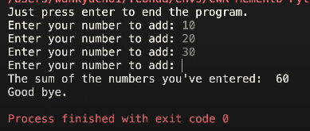
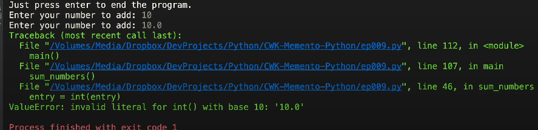
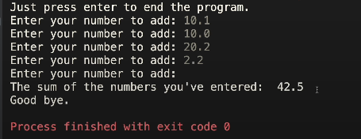
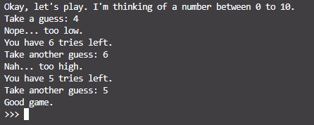
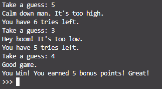
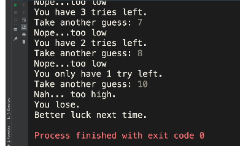
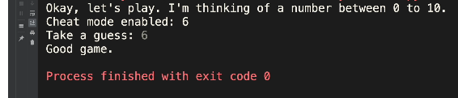

# Memento Python 초급 코스 Part 09 - 뺑뺑이 Loop 1부, while

**영상링크 : https://youtu.be/EgqWXSU8_C8**

## ***Intro***

봄철이라 이 아파트에 이사 오는 분들마다 계속 공사를 하고 있는데 올해는 예년보다 심하다. 3월 들어서만 벌써 3집째 공사를 하고 있다. 그러니 거의 매일 소음 속에서 살고 있는데 망치나 드릴 소리가 안 들린다고 궁금해하는 분이 있어서 잠깐 들려드리겠다. 요즘 제가 이 따위 환경에서 작업 중이다. 이걸 일일이 잘라내고 안 되겠다 싶으면 다시 녹음하고 그러니까 평소에도 런닝타임 몇 배 걸리는데 녹음이 훨씬 오래 걸린다.

그래도 오늘은 조금 소리가 작은 편이다. 원래 망치 소리하고 드릴 소리까지 나는데 이제는 공사가 어느 정도 마무리가 되어가는 건지 아마 타일 공사 중일 것. 잔망치 소리가 들리면 화장실에서 타일 공사 하는 것. 지금부터는 다시 소음 편집 들어갈 테니까 아마 안 들릴 것. 나는 이걸 계속 들으면서 해야 된다. 너무 시끄러우면 또 다시 녹음해야 되고 오늘부터는 당분간 뺑뺑이를 좀 돌아 봅시다.

## ***뺑뺑이와 Loop***
군대 다녀온 분들은 식겁 할 소리. 근데 진짜 뺑뺑이는 컴퓨터가 돌 테니까 걱정하지 마시고. 우린 프로그래머로서 컴퓨터의 마스터니까 slave인 컴퓨터한테 뺑뺑이 도는 법을 지시만 하면 된다. 세상에는 딱 두 종류 사람만 존재한다. 군대 갔다 온 분들은 딱 공감할 것. 뺑뺑이를 남한테 시키는 사람, 그 뺑뺑이를 직접 도는 사람. 적어도 컴퓨터 사용자인데 직접 뺑뺑이를 돈다면 컴퓨터의 노예다. 반성하고 성찰해야 한다.

먼저 용어 정리 몇 개 하고 넘어 갑시다. 뺑뺑이의 가장 일반적인 컴쟁의 용어는 Loop. 올가미같이 생긴 고리를 가리킨다. 밧줄로 만든 올가미처럼 뺑 돌아서 처음으로 돌아오기 때문에 Loop라고 한다. 부메랑처럼 얼마나 멀리 날아가든 원점으로 돌아오고 지정한 횟수만큼 뺑뺑이를 도는 게 Loop다. 근데 언제 뺑뺑이를 끝낼지 컴퓨터한테 만족 조건을 일부러 가르쳐 주지 않거나 논리적 오류로 1000년 10000년 가야 조건을 만족하지 못하면 이른바 무한 도전이 아닌 무한 Loop에 빠진다.

윈도우가 모래시계만 뱅뱅 돌면서 멍 때리거나 Mac에서 비치볼 뱅뱅 돌면서 프로그램이 맛이 가는 것도 무한 Loop에 빠졌기 때문인 경우가 허다하다. 무한 Loop는 강제 종료 말고는 답이 없다. 이걸 영어로는 Infinite Loop라고 한다. finite라고 하면 끝이 있는 것이고, 여기에 부정 접두어 in을 붙이면 발음이 달라져서 infinite가 돈다. 인파이 나이트가 아니고 인피니트라고 읽음.

그래서 무한하다는 뜻이 된다. 영어로도 꼭 알아두자. 컴쟁이 용어는 웬만하면 다 영어로 챙겨두는 게 상책. 이 Loop라는 말 말고도 반복, repetition을 가리키는 다른 표현들도 잘 쓰인다. 동사로는 iterate라고 하면 이것도 뺑뺑이를 가리킴. 특정한 일을 반복하는 것. 이걸 명사로 하면 iteration이 된다. 또 뺑뺑이를 돌게 도와주는 도우미 주체를 Python에서 iterator라고 한다.

그러니까 Loop를 도는 건 iteration, Loop를 돌도록 도와주는 도우미는 iterator라고 할 수 있다. iterator라는 말만 들어서는 모를 테고 직접 봐야 하는데 다음 시간에 for Loop를 다룰 때 영접하게 된다. 일단 무한 Loop 구경 한번 해보자? 이 infinite Loop라는 함수를 보면 기본적으로는 무한 Loop 돌기 딱 좋은 구조다. infinite라는 argument를 False로 주지 않으면 죽을 때까지 뺑뺑이를 돕다. 아래 코드를 보자

```python
def infinite_loop(infinite=True, max=100)
    """

    An example of an infinite loop.

    :param infinite: let the loop continue infinitely
    :param max: put the break
    :return: None
    """

    num=0
    while True:
        num += 1
        print("Going...", num)
        if not infinite and (num >= max):
            break

def sum_numbers(is_float=False):
    """
    Sum all numbers given

    :param is_float: if True, use real numbers
    :return: None
    """
```

infinite를 `False` 로 줘야 `max`만큼만 뺑뺑이를 돌고 멈춘다.

## ***while Loop와 조건***
오늘은 while Loop에 집중할 것. 주어진 조건이 만족하는 한 뺑뺑이를 도는 Loop다. `while True`니까 계속 뺑뺑이를 돌겠지. while 다음에 쓰는 조건이 참이어야 Loop를 돈다는 뜻. 거짓이면 Loop를 빠져나온다. 조건을 Loop 도입부에서 확인하기 때문에 조건이 거짓이면 아예 Loop를 한 번도 안 돌 수도 있다.

### ***continue와 break***
지난 시간에도 잠깐 살펴봤지만 Loop를 도는 도중에 나머지 코드 무시하고 Loop 처음으로 돌아가고 싶으면 `continue` 문을 쓴다고 했다. Loop를 특정 지점에서 탈출하고 싶으면 `break`를 쓴다. 탈옥을 Prison Break라고 한다.


그런 의미다. Loop 탈출, Loop break. 뺑뺑이를 돌다가도 `break` 문을 만나면 곧바로 탈출해서 Loop 다음 블록으로 나와 버린다. 눈치 깔 수 있겠지만 while에 원하는 조건을 달지 않고 가령 `while True`처럼 무한 Loop 조건을 달아놓고 무조건 한 번은 Loop를 돌게 한 다음에 마지막에서 `if` 문으로 탈출 조건을 확인한 다음 만족하면 `break`를 써서 탈출할 수도 있다.

```python
    while True:
        num += 1
        print("Going...", num)
        if not infinite and (num >= max):
            break
```

그러니까 프로그래밍 논리 구조, 알고리즘은 개발자 마음이다. 5만가지 방법이 존재하니까 상황에 맞게 효율적으로 짱구 굴리면 그만. 어쨌든 while Loop는 도입부인 while에 조건을 다는 게 가장 일반적. 무한 Loop 한번 돌려보겠다. 지난 시간에 `command`+`/`로 주석 처리하는 건 배웠지. infinite Loop를 돌려보겠다. 한없이 돌아간다

Going... 1  
Going... 2  
Going... 3  
Going... 4  
Going... 5  
Going... 6  
Going... 7  
Going... 8  
Going... 9  
Going... 10  
Going... 11  
Going... 12  
...  

프로그램을 강제로 종료해야 끝난다.

### ***Loop의 제한***
아까 infinite Loop가 `False`면 맥스값만큼만 돌고 멈춘다고 했지. 다시 돌려보겠다. 딱 100번까지 가고 멈춘다.

Going... 1  
Going... 2  
Going... 3  
Going... 4  
Going... 5  
Going... 6  
Going... 7  
Going... 8  
Going... 9  
Going... 10  
Going... 11  
Going... 12  
...  
Going... 100

다시 `command`+`/`로 주석 처리하고 1000번을 돌리고 싶으면 천번을 돈다. `infinite_loop(False, 1000)`. 다시 `command`+`/`로 주석 처리하고.

### ***Sum Numbers***

이번엔 `sum numbers`라는 함수를 살펴보겠다. Excel에서 쓰는 총계 함수, sum을 구현한 것. 사용자가 입력하는 숫자의 총계를 내준다. 그냥 엔터만 치면 뺑뺑이를 벗어난다.

`Just press enter to end the program` input 함수를 사용해서 entry라는 변수의 사용자 입력 값을 받는다. 사용자가 입력하는 숫자의 총계를 내준다. 아래 코드를 보자.

```python
def sum_numbers(is_float=False):
    """
    Sum all numbers given

    :param is_float: if True, use real numbers
    :return: None
    """

    total = 0
    print("Just press enter to end the program.")

    entry = input("Enter your number to add: ")

    while entry:
        if is_float:
            entry = float(entry)
        else:
            entry = int(entry)
        total += entry      # shorthand for total = total + entry
        entry = input("Enter your number to add: ")

    print("The sum of the numbers you've entered: ", total)
    print("Good bye.")
```

while 조건문이 좀 특이하다. 프로그래밍 언어가 익숙하지 않으신 분은 while 조건문이 이해가 안 갈 수도 있다. `while entry`라고 하면 entry 변수가 비어있지 않으면 즉, entry의 값이 할당되어 있으면 뺑뺑이를 계속 돌라는 뜻. 그러니까 entry 값이 비어있으면 Loop를 벗어난다. 그래서 enter만 누르면 프로그램을 종료하는 겁다.

기본적으로는 입력 값을 정수만 받는다. 그런데 맨 위의 `is_float=False'인 것을 `True`로 주면 실수로 입력 값을 받을 수 있다.

여기서 또 영어 표현 하나 짚고 넘어가자. 정수는 integer라고 했다. 실수는 영어로 `real number`라고 한다. 근데 실수를 '부동 소수점 실수'라고도 한다. 소수점의 위치가 정해져 있지 않다는 뜻. 소수점이 둥둥 떠다닌다고 해서 `floating point`라고도 한다. 그래서 데이터 타입 변환할 때 `int`를 쓰면 integer,  즉 정수인 거고 `float`를 쓰면 실수로 바꾸는 것. 입력을 받아서 `entry`에, `float`로 바꾸면 실수가 되는 거고 `integer`로 바꾸면 정수가 되는 것.

### ***데이터 타입 변환***

`total += entry`라는 건 `total = total + entry`의 idiom다. 데이터 타입에 대해서 한 가지만 더 강조하면 컴퓨터 내부적으로 문자 `10`과 숫자 `정수 10` `실수 10.0`은 각기 다른 방식으로 저장되고 처리되니까 유념하자. `10`하고 `10.0`은 엄연히 다른 숫자. 10은 정수고 10.0은 실수. 이렇게 while Loop를 돌면서 사용자의 입력값을 `total`이라는 변수에 더해주는 것.

뺑뺑뺑뺑뺑 돌면서. 그러다가 entry 값이 비어있으면 합계를 출력하고 끝낸다. 프로그램 돌려보자. 먼저 그냥 정수값만 입력 받아보겠다. 



그러면 이렇게 총계만 내주고 프로그램이 끝납다. 엔터만 입력하면.

일부러 실수를 입력해보자. 그럼 error가 난다.



`10.0`은 `int`가 아니다. 정수가 아니라 실수다. 그러니까 이 프로그램을 수정하려면 이 `is_float` 값을 `True`로 줘야겠지. 그러면 실수 값을 총계를 내준다.



## ***이미지 트레이닝***

이미지 트레이닝만으로도 코딩 실력이 는다. 무슨 말인가 하면 세상에 존재하는 문제나 현상 같은 걸 머릿속에서 코딩으로 그려보는 것. 가령 사용자 아이디와 비번 입력 받는 과정을 머릿속에서 코딩을 한번 해보라. 이렇게 while Loop를 돌면서 사용자 입력 확인하고 맞으면 탈출. 아니면 뺑뺑이를 돌다가 주어진 기회 안에 인증 못하면 계정 잠가 버리고 탈출. 뭐 이런 거 아닐까? 실제로 그렇게 코딩한다. 짬밥이 생기면 게임을 하다가도 이 부분은 대충 이렇게 코딩이 있겠구나. 대강의 윤곽은 잡아볼 수 있게 된다. 다른 분야도 마찬가지고. 결국 짬밥 문제.

그러니까 모든 걸 실제 코딩 해봐야 하는 건 아님. 짐작이 가능해지면 내 코딩 실력도 한참 강화됐다는 뜻. 실생활에서도 꾸준히 연습을 한번 해보라. while Loop는 별로 안 어렵지

## ***High Low 게임***

그럼 이번엔 게임을 하나 만들어 보자. 이제 여러분도 게임을 만들 수 있는 실력이 됐다. High Low 게임. 미국 꼬맹이들이 무리지어서 하는 게임인데 Low High 게임이라고도 하고 Lower or Higher, Higher or Lower 게임이라고도 한다.

게임 방식은 똑같다. 상대가 1에서 10처럼 주어진 범위 안에서 숫자를 랜덤하게 생각을 하고 맞춰보라고 하는 것. '카드 맞춰봐' 이런 것처럼 숫자를 하나 대면 정답보다 큰지 작은지만 알려준다. 맞췄으면 내가 이기는 것. 물론 Guess할 수 있는 횟수를 정해두고 그 횟수 안에서 못 맞추면 문제를 내는 녀석이 이긴다. 우리는 1에서 10까지 다섯번 기회를 주고 즉, `max_attempt` 다섯번 기회를 주고 맞춰보는 게임을 만들어 보자.

```python
import random

def high_low_game(cheat_mode=False):
    """
    A simple Python implementation of a High-Low number-guessing game

    :param cheat_mode: if True, enable cheat mode
    :retrun: None
    """

    answer = random.randint(1, 10)

    print("Okay, let's play. I'm thinking of a number between 1 to 10.")
    if cheat_mode:
            print("Cheat mode enabled: {}".format(answer))
    guess = int(input("Take a guess: "))

    max_attempt = 5

    while guess != answer:
        if guess > answer:
            print("Nah... too high.")
        elif guess < answer:
            print("Nope... too low.")

        # shorthand for max_attempt = max_attempt - 1
        # Python doesn't allow max_attempt++ nor max_attempt--

        max_attempt -= 1

        if max_attempt == 0:
            print("You lose.")
            print("Better luck next time.")
            break
        elif max_attempt == 1:
            print("You only have one try left.")
        else:
            print("You have {} tries left.".format(max_attempt))

        guess = int(input("Take another guess: "))

    else:
        print("Good game.")

def main():
    """Entry Point"""
    # infinite loop
    # infinite_loop()

    # put the break on loop after 1000 iterations
    # infinite_loop(False, 1000)

    # sum numbers
    high_low_game()

if __name__ == "__main__":
    main()
```

지금까지 쌓은 실력만으로도 이렇게 범위와 플레이어에게 주는 기회를 게임 시작할 때 직접 지정하게 할 수도 있다. 꼭 한번 수정해 보라. 그래야 실력이 는다. 이 정도는 여러분이 직접 코드를 수정할 수 있을 것. 연습 삼아서 꼭 해보라.

> 아래는 숫자만 수정해서 실행한 결과입니다.



### ***랜덤 모듈***
먼저 랜덤 값이라는 걸 이용하려면 random이라는 module을 import해야 한다. 위에 올라가면 random을 import하고 있다(`import random`). random module에 있는 `randint`, random integer겠지. 이 함수를 사용하자. `answer = random.randint(1, 10)` 주어진 범위 내에서 1에서 10까지 argument가 두 개 보인다. 시작, 끝, 1에서 10까지의 범위라는 의미. 그 범위내에서 random 정수 값을 return한다. 그럼 `answer`에 랜덤 숫자가 할당되겠지. 대입이 되겠지. random은 나중에 또 자세히 다룰 기회가 있을 테니까 여기서는 이 정도만. 말이 빨라질 때가 있다면, 망치질을 피해서 빨리 말을 하느라 그렇다. 양해바란다.

> ㅠㅠ


### ***max_attempt와 `-=` 연산자***
뺑뺑이를 돌 때마다 답을 맞추지 못하면 `max_attempt`를 하나씩 빼준다. 아까도 봤듯 `max_attempt -= 1`은 `max_attempt - 1`의 idiom. 이게 `-`가 아니고 `+`면 1을 증가시켜주는 것.

C 스타일 언어에서 Python으로 넘어온 분들이 자주 실수하는 것이 있다. 이 `++` 연산자하고 `--` 연산자가 파이썬에는 없다. 일부러 지원을 하지 않음. 그러니까 1값씩 증가를 시켜주거나 빼준다고 해도 위와 같은 idiom을 사용해야 한다. `++` 연산자, `--` 연산자가 아니라. 이 알고리즘을 보면 `max_attempt` 값이 0이 되면 모든 기회를 소진한 것.

그럼 `you'll lose. Better luck next time`. 그리고 Loop를 탈출. Loop break.

```python
        if max_attempt == 0:
            print("You lose.")
            print("Better luck next time.")
            break
```

### ***조건문 출력***
elif는 `max_attempt == 1` 즉, 기회가 한 번 남았을 때는 이 `tries`라는 게 복수 값이 아니고 단수로 출력이 되어 하니까 `you only have one try left`라고 출력을 해주고. 이 이상 남아있다면 `tries`라고 출력을 해주는 것. `if`, `elif`, `else` 이 조건문 복습하기 위한 수작이다.

### ***while Loop와 else 블록***

다시 코드를 보자.

```python
    while guess != answer:
        if guess > answer:
            print("Nah... too high.")
        elif guess < answer:
            print("Nope... too low.")

        # shorthand for max_attempt = max_attempt - 1
        # Python doesn't allow max_attempt++ nor max_attempt--

        max_attempt -= 1

        if max_attempt == 0:
            print("You lose.")
            print("Better luck next time.")
            break
        elif max_attempt == 1:
            print("You only have one try left.")
        else:
            print("You have {} tries left.".format(max_attempt))

        guess = int(input("Take another guess: "))

    else:
        print("Good game.")
```

`else` 블록이 `while` 블록과 같은 레벨의, 같은 indentation다. `while` 블록에 `else`를 달아줄 수 있다. `while` 블록에 `else`를 붙여주면 Loop가 이렇게 `break`로 탈출하지 않고 정상 종료됐을 때만 `else` 블록이 실행된다. `break`로 탈출하면, 그러니까 게임에서 졌으면 `else`가 실행이 안 되지. `else` 블록이. 그래서 `good game`이라는 게 출력이 안 된다.

물론 답을 맞추면 Loop를 탈출하도록 알고리즘을 바꿀 수도 있다. 연습 삼아서 직접 해보라. 이거랑 반대로 하면 되겠지. 남은 `max_attempt` 값을 가중치로 해서 보너스를 줄 수도 있을 것. 이것도 직접 해보라. 그럴듯한 `low-high` 게임이 될 것. 여기에 그래픽 껍데기를 입히면 진짜 번듯해질 것.

> 아래와 같이 수정해보았습니다.

```python
import random

def high_low_game(cheat_mode=False):
    """
    A simple Python implementation of a High-Low number-guessing game

    :param cheat_mode: if True, enable cheat mode
    :return: None
    """

    answer = random.randint(1, 10)

    print("Okay, let's play. I'm thinking of a number between 1 to 10.")
    if cheat_mode:
        print("Cheat mode enabled: {}".format(answer))

    max_attempt = 7

    while True:
        guess = int(input("Take a guess: "))

        if guess == answer:
            print("Good game.")
            if max_attempt > 4:
                print("You Win! You earned {} bonus points! Great!".format(max_attempt))
            break

        if guess > answer:
            print("Calm down man. It's too high.")
        elif guess < answer:
            print("Hey boom! It's too low.")

        max_attempt -= 1

        if max_attempt == 0:
            print("You lose.")
            print("Better luck next time.")
            break
        elif max_attempt == 2:
            print("You only have two tries left.")
        else:
            print("You have {} tries left.".format(max_attempt))

def main():
    """Entry Point"""

    high_low_game()

if __name__ == "__main__":
    main()
```

실행 결과입니다.



게임들이 원래 그렇게 만드는 것. 알고리즘을 먼저 만들고 거기다가 그래픽으로 옷을 입히는 것.

끝으로 `cheat_mode`라는 argument가 있다. default 값이 `False`지. 이걸 `True`로 바꾸면 cheat_mode로 정답을 보여주고 시작. cheat_mode라고는 하지만 debugging 모드라고 해도 된다. 실제로 프로그램이 제대로 작동하는지 확인하기 위한 것.

원래 게임의 cheat나 god mode가 게임 개발자들이 debugging을 위해서 만든 것. 앞으로 debugging을 위한 코드도 많이 보게 될 것. 그때 그때 짚어두도록 하겠다. 그럼 프로그램을 한번 돌려보자. 일단은 치트 모드 없이 해보겠다. 0에서 10, 범위 내에서 숫자를 게스해보라고 하자. 5를 먼저 쳐보면 너무 낮다고 하고, 기회가 4번 남았다.

그러면 높아야 하니까 6을 해볼까? 또 너무 낮다. 3번 남았고 그럼 7, 또 낮대, 8, 한 번 남았다. 10일 것 같은데 왠지? 졌다. 9다.



이번엔 치트 모드를 enable 하고 해보겠다. 치트 enabled니까 정답이 6이라고 알려준다. 6 한 방에 치면 게임이 끝난다. `good game`, GG 치는 것.



오늘은 while Loop를 살펴봤다. 파이선 Loop는 이제 시작. while Loop가 이해하기 가장 쉽기 때문에 먼저 다룬 것. 다음 시간엔 어마무시하게 유용한 for Loop를 다뤄보겠다. 뺑뺑이 Loop 이야기는 당분간 이어진다. 그만큼 내용도 많고 워낙 중요한 데다 심오한 프로그램을 개발하지 않더라도 정말 쓸모가 많은 게 Loop이기 때문. 비약적인 생산성 향상을 원하는 분이라면 다른 건 몰라도 조건과 Loop만큼은 꼼꼼히 정말 꼼꼼히 챙겨 두시기 바란다.

세상엔 딱 두종류 사람만 존재한다고 했다. 뺑뺑이를 남한테 시키는 사람, 그 뺑뺑이를 직접 도는 사람. 우리가 어떻게 살아야 할지는 자명하다. 마지막으로 망치 소리 한 번 더 듣자😂