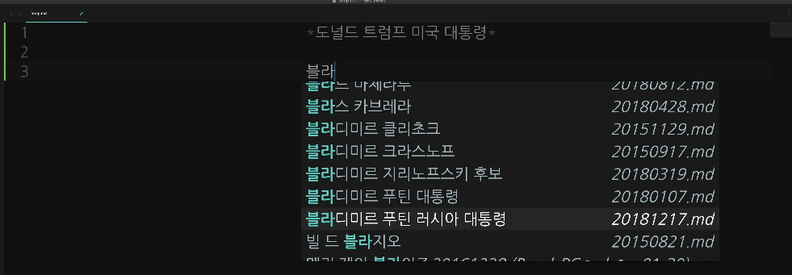
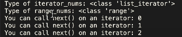
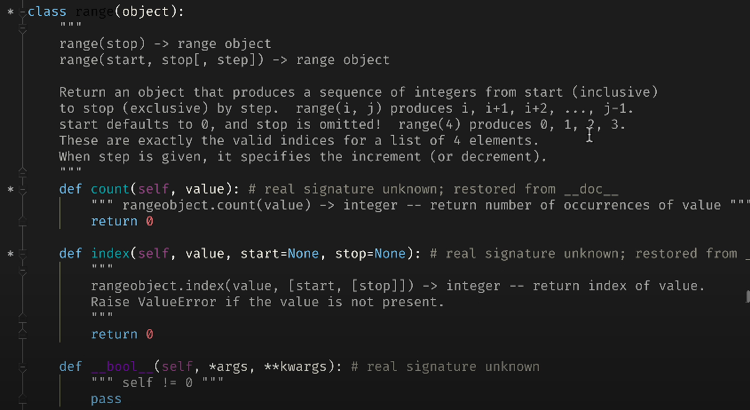
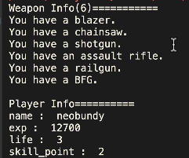
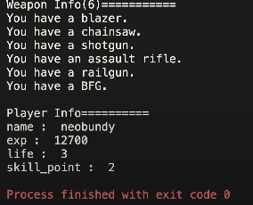

# Memento Python 초급 코스 Part 10 - 뺑뺑이 loop 2부, for 와 iterator

**영상링크 : https://youtu.be/S087RTY3VNA**

**CWK Memento Python : https://github.com/neobundy/CWK-Memento-Python(소스코드)**

## ***Intro***

지난 시간에 세상엔 딱 두 종류의 사람만 존재한다고 강조했다. 뺑뺑이를 돌게 시키는 사람과 직접 도는 사람. 하물며 컴퓨터한테 일을 시키지 못하고 스스로 뺑뺑이를 돌고 있다면 그건 Master인 사용자가 Slave인 컴퓨터한테 농락당하는 꼴. 아주 자존심 상해야 되는 상황. 사람한테 무시당하는 것도 짜증나는데, 기계한테 능멸 당하면 그건 용납해서는 안 된다.

간단히 실험해볼 수 있다. 컴퓨터 사용하면서 뭔가 똑같은 일을 대여섯 번 이상 반복하는 걸 거의 매일 주기적으로 뺑뺑이 돌고 있다면 그건 농락 당하고 있는 것. 예전에 워드 프로세서를 사용할 때 format을 `enter`랑 `space` 키로 맞추는 사람들이 의외로 많았다. 물론 지금도 있다. alignment 개념이 아예 없는 사람도 있고, 여전히 왼쪽, 가운데, 오른쪽 맞춤한다고 스페이스를 연타하는 사람들도 있다.

그럴 때마다 '이 비싼 첨단 장비를 이따위로 쓰라고 만들었을까' 생각해봐야 한다. 스스로 한 번만 돌이켜 보자. '나는 그 정도는 아니다'라고 생각할 수 있겠지. 대부분의 사람은 그 정도는 아니라고 생각할 것. 아무렴. 근데 정말로 똑같은 키를 대여섯 번씩 누르거나 같은 일을 반복하는 뺑뺑이 짓을 안 하고 산다고 장담할 수 있을까? 저도 그런 장담은 못 한다. 그래서 주기적인 리뷰가 필요한 것.

사람은 늘 나태해질 가능성이 높다. 일주일에 10분이라도 내가 요즘 뺑뺑이 도는 게 없는지 점검을 해봐야 한다. 제가 scripting을 하는 기준은 간단하다. 아무리 뺑뺑이를 돌더라도 일회성으로 끝나면 코딩 안 한다. 코딩하는 시간이 더 드니까. 마눌님 도와줄 때도 물어본다. 이거 한두번으로 끝나는 일이냐고. 그렇다고 하면 그냥 손으로 하라고 한다. 아무리 오래 걸려도. 그런데 특정 텍스트에서 단어 모으기, Corpus 같은거 할 때. 평생 뺑뺑이 돌 가능성이 있는 작업이라면 하루 종일 걸려서라도 코딩을 한다. 제 일도 그렇고, 하루 투자해서 평생 삽질을 막을 수 있으면 당연히 해야지. 뺑뺑이는 얼마나 시간을 낭비할지 한계가 없거든. 무한 뺑뺑이가 될 수도 있다.

문서 하나에서 마눌님이 표시한 단어를 뽑아내는 script를 만들어 둔다면 문서가 백개, 천개, 만개가 되어도 script를 돌리고 딴짓하면 되지만, 손으로 하기 시작하면 기하 급수적으로 시간 낭비가 심해진다. 다시 강조하지만, 생산성 향상을 위한 코딩의 기준은 간단함. 코딩하는 시간과 뺑뺑이로 낭비하는 시간을 비교. 1, 2회성 뺑뺑이인데다가 시간이 오래 걸리지 않는다면 그냥 직접 하는 게 낫다. 반대로 시간이 얼마나 걸릴지도 모르고, 두고두고 뺑뺑이 돌 것 같으면 코딩이 현명한 선택.

## ***반복 작업과 코딩 연습***

물론 코딩 연습을 위해 1, 2회성 뺑뺑이도 해보는 걸 추천. 예를 들어, 일반 번역사들, 코딩을 모르는 번역사분들이 워드 프로세서를 사용할 때. 저는 sublime text를 사용하는데, sublime text의 장점 중 하나가 python으로 plug-in을 만들 수 있다는 것. 기능을 입맛대로 무한 확장할 수 있다. 번역하거나 글을 쓸 때 마크다운으로 asterisk 처리를 해 두면 나중에 써먹을 만한 특정 표현들, 가령 유명인사 이름들, 타이틀을 표시해둘 수 있다. 이름들을 엄청 많이 써야 한다면, 예컨대 블라디미르 푸틴 러시아 대통령 같은 이름들을 표시를 해두고 모아두면 문서가 얼마나 엄청 많든지 다 긁어서 모아준다. 그럴 때 '블라' 쓰고 특정 키를 누르면 내가 원하는 단어를 선택 가능.



이걸 표시해두면, 긁어 모아주고 언제든 자동 완성하는 플러그인을 만든 거지.

코딩에 꽤 오랜 시간이 걸렸지만, 그 플러그인 덕분에 몇 백 배는 시간을 절약했을 것. 2014년부터 2018년까지 써먹었으니까. 같은 작업을 반복하다가 리뷰로 점검하는 과정에서 '이건 코딩이 필요하겠다'고 판단한 경우.

## ***for loop***

Python에서 while과 for loop만 사용하는 법을 익히면 컴퓨터의 노예가 되지 않고 주인이 될 수 있다. 주기적인 뺑뺑이 점검 타임을 가져야 하는 이유. 

### ***C 언어의 for loop***
Python의 for loop를 다루기 전에, 그 조상 격인 C 언어의 for loop를 구경해 보자. 그냥 눈으로만. C언어에서 for loop 도는 게 얼마나 번거롭고 성가신지. 지난번에 "Hello World C"라는 C 언어 소스코드 구경할 때는 terminal에서 compile해서 돌렸었다. 오늘은 PyCharm에서 만든 jet brains에서 다운로드 받을 수 있는 C와 C++ 통합 개발 환경인 CLion을 돌려보겠다. 아래 코드를 보자.

```C
int main() {

    int i;
    int entry_per_line = 5;

    for(i=0; i<100; i++) {
        if (i % entry_per_line == 0) {
            printf("\n");
        }
        printf("%d", i);
    }

    return 0;
}
```

어차피 intellij 기반이라 PyCharm이랑 거의 똑같이 생겼다  소스코드만 다르게 보일뿐. 이게 C 개발환경이다. C++ 개발환경이기도 하고. 여기서는 `entry_per_line`이라는 변수에 라인당 몇 개의 아이템을 출력할지 지정해주고 그 개수만큼 출력한 다음 줄바꿈을 하는 루틴. 여기에 for loop를 사용.

게시판 글이나 검색결과를 일정 단위로 자를 때 modulo 연산자, 나머지 연산자 사용한다고 했었다. 연산자 생김새는 거의 모든 언어가 비슷하다. C 언어와 Python 둘 다 `%` 기호를 사용. Python과 달리 C에서는 변수 사용 전에 선언을 미리 해야 하고, 데이터 타입도 알려줘야 한다. `int`는 integer.

C 언어 for loop는 괄호를 사용해 초기값, 한계값, loop를 돌 때마다 얼마씩 증가할지 지정해줄 수 있다. 각각은 `;`으로 다 구분되고. 이 loop를 도는 조건에 사용할 변수를 `i`. `i`는 index의 약자로 거의 관행으로 사용. 변수 두 개를 쓸 때는 `i`와 `j`로 쓴다. 강제는 아니다. 위의 for loop는 `i`라는 변수를 0으로 시작해 1씩 증가시키면서 100번 도는 것. `i++` 연산자는 Python에서 지원 안한다. 만약 2씩 증가시키려면 `i+=2` 이렇게 쓰면 된다. idiom이다. `i++`의 실행결과는 다음과 같다

0 1 2 3 4  
5 6 7 8 9  
10 11 12 13 14  
15 16 17 18 19  
20 21 22 23 24  
25 26 27 28 29  
30 31 32 33 34  
35 36 37 38 39  
40 41 42 43 44  
45 46 47 48 49  
50 51 52 53 54  
55 56 57 58 59  
60 61 62 63 64  
65 66 67 68 69  
70 71 72 73 74  
75 76 77 78 79  
80 81 82 83 84  
85 86 87 88 89  
90 91 92 93 94  
95 96 97 98 99 

`i+=2`의 실행결과는 다음과 같다.

0 2 4 6 8  
10 12 14 16 18  
20 22 24 26 28  
30 32 34 36 38  
40 42 44 46 48  
50 52 54 56 58  
60 62 64 66 68  
70 72 74 76 78  
80 82 84 86 88  
90 92 94 96 98  

Python에서는 print 함수만 써도 줄바꿈이 되지만, C언어에서는 줄바꿈을, `\n`을 써줘야 한다. `n`과 `\n`은 엄연히 다르다. `\`는 escape character라고 하는데, 탈출, 벗어나는 의미. ex+cape, 망토를 벗어던지고 달아나는 그림. `\t`가 되면 탭 문자를 출력하는 식. 위 코드에서 `\t`로 바꿔보면, 5개의 문자마다 tab으로 공백이 삽입된다.

escape 문자는 나올 때마다 챙겨두자. 

C언어는 Python보다 길고 번거롭다는 것만 느껴보자. 대충 느낌만 챙기자. Python도 C에서 아이디어를 많이 빌려왔기 때문에 형태는 비슷하다. Python처럼 복잡하지 않을 뿐.

그리고 이건 jet brains에서 만든 C 개발환경, CLion인데 객체지향성의 한 예다. PyCharm을 배웠더니 CLion은 그냥 쓸 수 있다. 전 CLion을 써본 적이 없다. 

> Inheritance  
> Polymorphism  
> Encapsulation  

어떤 소프트웨어든 배워두면 다른 것도 배우기 굉장히 쉬워진다. 이게 객체지향성의 위력. universe를 구동하는 엔진. reverse engineering하는 비결 중 하나다. 잘 익혀 두길.

## ***PyCharm의 for loop***

이제 PyCharm으로 돌아오자.

용어부터 정리해보자. 뺑뺑이를 Loop라고도 하지만, Iterator라고도 한다고 했다. 헷갈릴 수 있는게, Python 커뮤니티에서는 Loop와 Iterator를 똑같이 쓰기도 하고 구별하기도 한다. 그런데 배우는 입장에서는 어느 정도 융통성을 갖고 이해하기 쉬운 쪽으로 선택을 하는 것이 좋다. 

for loop 등을 통해 뺑뺑이를 돌 수 있는 객체는 iterable이라고 한다. 형용사도 되지만, '뺑뺑이를 돌 수 있는 객체'라는 명사도 된다. 여기에 iterator라는 건 행위자를 뜻하니까 실제 뺑뺑이를 도는 주체도 된다. 

목록에 해당되는 list 처럼 연속적인 데이터는 당연히 뺑뺑이를 돌 수 있는 iterable이겠지. 그러나 그 자체가 뺑뺑이를 돌지는 않기 때문에 iterator라고는 하지 않는다. iterable인데 iteraotr가 아닌걸 iterator로 변환하려면 `def iterator_example():` 함수처럼 `iter`라는 내장함수를 활용한다.

`int`나 `float` 내장함수 이용해서 문자열로 입력된 숫자를 실제 숫자로 변환하는 과정 살펴봤었지. iter도 마찬가지. 

list는 iter로 변환 안해줘도 loop에서 사용가능하지만, iterator는 아니라는 것. 헷갈릴 수 있어도 계속 듣다보면 감이 올 것

가령, 아래 코드를 보자.

```python
def iteraotr_example():
    """

    Is range() a iterator?

    :return: None
    """

    iterator_nums = iter([0, 1, 2])
    range_nums = range(0, 3)
```

위 코드에서 주어진 범위에 해당되는 list를 돌려주는 range 함수에서 `iter([0, 1, 2])`와 `range(0, 3)`은 결과값이 같다. 어차피 원소는 0, 1, 2로 리턴한다. 그런데 이 range가 돌려주는 list는 iterator는 아니다. 엄격쟁이 pythonista들이 'range 함수가 iterator'라고 하는 프로그래머를 만나면 눈에 불을 켜고 달려든다. 배우는 입장에서는 iterator라고 생각하는 게 솔직히 편함. 그런데 엄격히 따지면 아니라는 것. 아래 코드를 보자.

```python
    iterator_nums = iter([0, 1, 2])
    range_nums = range(0, 3)

    print("Type of iterator_nums: {}".format(type(iterator_nums)))
    print("Type of range_nums: {}".format(type(range_nums)))

    print("You can call next() on an iterator: {}".format(next(iterator_nums)))
    print("You can call next() on an iterator: {}".format(next(iterator_nums)))
    print("You can call next() on an iterator: {}".format(next(iterator_nums)))

    # print("You can call next() on an iterator: {}".format(next(iterator_nums)))

    # this throws an error
    print("You can't call next() on a non-iterator: {}".format(next(range_nums)))
```

원래 iterator 객체는 위의 `format(next(iterator_nums)))`에서 보듯 method를 호출하면 다음 항목을 넘겨주고 소진을 해나간다.

근데 `range`는 그게 안 됨. `iteration`을 도와주는 유틸리티 함수로 구현됐을 뿐 완전한 iterator로 구현된 건 아니거든. 난이도가 좀 높은 얘기라 아직은 몰라도 돼. 나중에 중급 영상을 만들 때 좀 더 자세히 설명할 때 짚겠다. 괜히 나중에 `range`를 iterator로 알았다가 아니라고 하는 컴퓨터 전문가를 만나서 당황하지 말라고 미리 설명하는 것.

다시 말하지만, Python을 처음 배울 때는 그냥 뺑뺑이 도우미 정도로만 이해하면 된다. 퉁치고 넘어가도 될 걸 굳이 장황하게 따질 필요가 없다. 너무 엄격하게 따지지 말고 유연하게 받아들이는 게 좋음. 그래서 `iterator_nums`라는 변수는 `[0, 1, 2]`의 원소가 담긴 list를 `iter` 내장함수로 iterator로 변환해. 반면 `range_nums`는 그냥 `range` 함수로 `[0, 1, 2]`의 시퀀스를 만들어줄 뿐.

타입을 출력해 보면 `iterator_nums`는 `iterator`로 나오고, `range_numms`는 `range` 로 나온다. `next()` 내장 함수를 `iterator`에 사용하면 원소를 하나씩 꺼내서 소진시켜 준다. 만약 원소가 3개인데 4번 호출하면 에러가 난다. 근데 `range_nums`처럼 iterator가 아니면 `next()`를 호출할 수 없고 에러가 날 것.

실행해보자. 



일단 `iterator` type은 `list_iterator` type으로 나오고, `range_nums`는 class가 `range`로 나온다. iterator가 아니라는 뜻. 그리고 `iterator`는 3번 호출할 때는 에러가 안 난다. `range_nums`에 iterator를 불렀을 때 "range object is not an iterator"라고 에러가 난다. 한 번을 더 불러서 네번을 부르면, 원소가 다 소진됐다고 에러가 났다고 나온다. 

이 정도만 챙기면 된다. 초보니까 너무 깊게 가지 말고 필요한 부분만 이해하고 넘어가면 된다. 나중에 또 나오니까 그때 다시 보면 된다.

## ***C 언어에서 Python으로 포팅하기***
이제 for loop로 넘어가자. C 언어에서 봤던 for loop를 옮겨놓은 `print_numbers` 함수를 보자. 아래 코드.

```python
def print_numbers(entry_per_line=5):
    """
    A simple for loop example.

    :param entry_per_line: number of entries to print per line
    :return: None
    """

    # note that 2nd arg for range is exclusive
    for num in range(0, 101):
        if num % entry_per_line == 0:
            print()
        print(num, end=" ")

    for num in range(0, 101, 2):
        if num % entry_per_line == 0:
            print()
        print(num, end=" ")
```

여기서 `range` 함수를 사용하는데, 용어 하나 짚고 넘어가겠다. 컴쟁이들이 다른 언어로 알고리즘을 옮기는 걸 번역하는걸 "forting"한다고 한다. C에서 만든 코드를 Python으로 forting했다고 말할 수 있다. 예를 들어, 윈도우에만 돌아가던 visual stuido를 Mac용으로 forting했다, 이런 식으로 말할 수 있다.

이 `print_numbers` 함수에서는 for loop가 두 개 있다. 둘 다 `range` 함수를 사용하고, C 언어의 for loop보다 훨씬 간결하고 효율적. iterator나 sequence, 그러니까 iterable에 다음 항목을 끄집어 내서 `num`이라는 변수에 저장한다. 그런 다음에 뺑뺑이를 도는 것. loop를 돌 때마다 차례대로 꺼내는 것. 만약 해당 항목이 소진되면 iterator, 그냥 유지되면 iterator가 아니게 된다. 만약 다 소진됐는데 `next()`를 부르면 에러가 난다.

`range` 함수를 quick reference로 살펴보자. 



Python에서는 모든 게 객체거든. 이 `range` 함수도 클래스로 정의가 되어 있는데. 일단 첫 번째 변수는 start고 두 번째 변수는 stop값. 세 번째 변수는 option으로 증가값을 가리킨다.

주의할 점은 `start`는 inclusive지만 `stop`은 exclusive라는 것. 무슨 말이냐면, `range(0, 100)`이라고 쓰면 C에서처럼 C의 `for` loop처럼 `range(0, 100)`이라고 쓰면 100을 포함 안 한다는 뜻. 101이라고 써야 100까지 도는 것. 그리고 첫 번째 loop는 세 번째 argument가 없으니까 1씩 증가. 두 번째 loop는 세 번째 argument를 2로 줬으니까 1이 아닌 2씩 증가.

아까 C에서 `i += 2`라고 한 것과 마찬가지. 돌려보겠습니다. 코멘트는 아래와 같이 주석으로 토글.

```python
def main():
    """Entry Point"""

    # iterator_example()
    print_numbers()
    # game_info()

if __name__ == "__main__":
    main()
```

그럼 C에서 구현한 `for` loop랑 결과가 같이 나옴. 이 `print()` 함수도 옵션 argument가 있다. 이 `end`가 `end`라는 옵션 argument가 줄 바꿈 문자 `\n`로 되어 있다. 이 옵션 argument인 `end`를 넘겨주지 않으면 줄 바꿈 문자 `\n`을 출력하지만, `end`를 다른 문자로 넘겨주면 줄 바꿈 대신 해당 문자를 출력. 여기서는 공백 문자를 출력하고 `entry_per_line`이랑 나머지 연산을 해서 "0"일 때만 줄 바꿈.

```python
    for num in range(0, 101):
        if num % entry_per_line == 0:
            print()
        print(num, end=" ")
```

그러니까 그냥 print라고만 쓰면 `end`가 기본값인 키워드 기본값인 줄 바꿈 문자를 출력하고, `print(end='  ')`이라고 해주면 기본값이 아니라 주어진 공백 문자를 사용.

## ***Python의 for loop와 Collection Types***
for loop를 사용해서 iterable에서 원소를 하다씩 꺼내서 뺑뺑이를 돌 수 있다고 했는데. 이렇게 하나 이상의 원소로 구성된 데이터 유형이나 자료 구조를 퉁쳐서 Collection Types라고 한다. Python에 무지하게 많다. 객체지향 프로그래밍을 하면 무한대로 늘려나갈 수도 있다. 여기서는 간단히 기본 콜렉션 타입만 살펴보겠다.

for loop를 제대로 사용하려면 이 collection type을 알아야 한다. collection type을 얼마나 잘 다룰 줄 아느냐에 따라 뺑뺑이 도는 스킬도 레벨업 할 수 있다. `int`는 정수, `float`는 부동소수점 실수, 그리고 문자도 알게 모르게 썼다, `str`, String. 이것들이 Python의 기본 내장된 데이터 유형들. 한 번에 소화하려면 힘들기 때문에 나올 때마다 조금씩 야금야금 공략하는 중이니까 한 번에 이해 안 된다고 좌절할 필요는 없다. 참고로 이 `String`이라는 문자열, 이름에서도 알 수 있듯이 `String`이라는 문자'열'이다. 여기도 원소가 있겠지. 예를 들어서 `weapon_name = 'gun'`에서 세개의 문자로 구성된 문자열이 되는 것. 첫번째 원소가 `'g'`고, 두번째 원소가 `'u'`고, 마지막 원소가 `'n'`인 것.

```python
weapon_name = 'gun' # weapon_name[0] = 'g'
```

컴쟁이는 원소를 셀 때 0부터 센다. 예를 들어 `gun`의 첫번째 원소가 `'g'`인 것. 실수하면 안 되는데 통계 언어인 R처럼 1부터 셈하는 언어도 가끔 있지만, 거의 99% 프로그래밍 언어가 0부터 센다. 그러니까 첫번째 원소는 1이 아니라 0. 

```python
weapon_name = 'gun' # weapon_name[1] = 'u'
```

위와 같이 1로 해주면 `'u'`가 된다. 원소를 가리키는 인덱스를 우리말로는 첨자라고 하는데 역시 잘 안쓰는 말이고 그냥 인덱스라고 한다. loop 뺑뺑이 제대로 돌려면 이 collection types에 빠삭해야하니까 꼼꼼히 다 챙겨 두시길.

어차피 오늘 다 못한다. 오늘은 맛만 볼 것. 아래 코드의 `game_info()`라는 함수의 대강을 살펴보면서 데이터 타입을 짚어보자. 

```python
    print("Weapon Info({})================".format(len(weapons)))
    for weapon in weapons:
        # the name of the given weapon starts with a vowel
        if weapon[0] in vowels:
            print("You have an {}.".format(weapon))
        # the name of the given weapon starts with a consonant
        else:
            print("You have a {}.".format(weapon))
    print()

    print("Player Info================")
    for(key, value) in player.items():
        print(key, ": ", value)
```

첫번째 `for` loop는 사용자가 득템한 무기들을 리스트로 나열해주고, 두번째 `for` loop는 사용자 정보를 출력. 무기를 나열하기 위해서는 `weapons`라는 리스트를 사용하고, 사용자 정보는 `player`라는 dictionary를 사용.

첫번째 for loop부터 살펴보자.

```python
    for weapon in weapons:
        # the name of the given weapon starts with a vowel
        if weapon[0] in vowels:
            print("You have an {}.".format(weapon))
        # the name of the given weapon starts with a consonant
        else:
            print("You have a {}.".format(weapon))
```

이 `weapons`라는 list에서 원소를 하나 꺼내서 `in`을 썼다. `in`이라는 연산자. `weapons`에서 원소를 하나 꺼내서, 처음부터 꺼내서 `weapon`이라는 변수에 저장을 한다. 그러고 나서 loop를 도는 것. loop를 돌 때마다 하나씩 꺼내는 것. 그러니까 loop를 돌 때마다 `weapons[0]`, `weapons[1]`, `weapons[2]`식으로 참조하는 것이나 마찬가지.

이쯤에서 Python다운, Python닉한 loop에 전율을 느껴야 된다. 느껴지는지 모르겠다. 이렇게 `weapons`의 원소 개수가 몇 개든 다 참조할 때까지 뺑이를 돌아준다. 물론 `weapons`의 개수는 `len()`이라는 내장함수로 알 수도 있지. 

```python
print("Weapon Info({})================".format(len(weapons)))
```

이 부정관사 `a`는 뒤에 모음이 오면 `an`으로 바꿔줘야 되지. 그래서 `if else`로 나눈 것. 조건은 `weapon`이라는 문자열의 첫 번째 문자가 `vowels` 모음 리스트의 원소이면 부정관사를 `an`으로 출력하라는 것.

이렇게 문자열은 단일 변수로 사용해도 되고, 문자들의 콜렉션으로 참조할 수 있다는 것도 챙기자.

두 번째 loop는 `player`라는 데이터가 dictionary이기 때문에 그냥 `player`라고만 쓰면 에러가 난다. 

```python
print("Player Info================")
    for(key, value) in player.items():
        print(key, ": ", value)
```

dictionary의 메서드 함수인 `items()`를 써서 key하고 value pair, 이 한 쌍을 돌려받아야 되거든. 그럼 이 두 개를 한 쌍으로 묶어서 하나씩 끄집어 보내준다. 그런 다음에 뺑뺑이를 돈다.

잠깐 실행을 해보고 데이터 유형을 살펴보자. 그럼 내가 가진 무기는 6개고. 



하나는 `blazer`, `chainsaw`, `shotgun`, `assault rifle`, `railgun`, `BFG`. `BFG`는 `Big Fucking Gun`의 약자. `Player Info`는 이름은 `Neo`, 경험치는 12700, 남은 생명 개수는 3개, 스킬 포인트는 2 이렇게. 그리고 다른 것들은 다 자음으로 시작하는데, 무기 이름이 `Assault Rifle`은 모음으로 시작. 모음으로 시작하니까 부정관사가 `an`으로 붙은 것.

### ***Collection Types***

이제 Collection Data Types를 살펴보자.

```python
    # vowels is a tuple
    vowels = ('a', 'e', 'i', 'o', 'u')
    # vowels2 is a set: an unordered collection with unique elements
    # set('aeiou') is the same as
    # vowels2 = {'a', 'e', 'i', 'o', 'u'}
    # vowels2 = set('aeiou')
    # weapons is a list
    weapons = ['blazer', 'chainsaw', 'shotgun', 'assault rifle', 'railgun', 'BFG']
    # player is a dictionary
    player = {'name': 'neobundy',
              'exp': 12700,
              'life': 3,
              'skill_point': 2
              }
```

맨 처음에 나오는 `vowels`는 부정관사를 `a`를 쓸지, `an`을 쓸지 weapon 이름의 첫 문자와 비교하기 위한 모음 콜렉션. 이건 리스트로 만들 수도 있다. 그런데 일부러 `tuple`이라는 걸로 만들었다. 괄호를 쓰면 tuple을 만들어준다. brakcet을 쓰면 list를 만들어주고요. 이렇게 대괄호, curly bracket을 쓰면 세트를 만들거나 dictionary를 만든다.

이 `tuple`은 영어권 프로그래머들도 발음이 확정이 안 되어 있다. '튜플'이라고 하고 '투플'이라고도 한다. 둘 다 발음 가능. '튜플'이 일반적. `tuple`과 `list`는 성질이 똑같다. 내용을 바꿀 수 있느냐 없느냐만 다름. 

Python에서는 변경 가능한 `mutable` 타입과 변경 불가한 `immutable` 타입이 있다. `Teenage Mutant Ninja Turtle`을 생각하면 된다. `mutant`가 돌연변이잖아. mutable과 어원이 같다. 변경 가능한 것이 `mutable`이고, 이걸 부정하면 `immutable`.

이 `tuple`이 바로 변경 불가인 `immutable` 타입. list는 `mutable`이라 첫 번째 원소를 pistol로, 다른 값으로 바꿀 수도 있다. `weapons[0] = 'pistol'` 이런 식으로 바꿀 수 있지만, `vowels`는 tuple이기 때문에 `vowles[0] = 'e'`와 같은 식으로 바꿀 수가 없다. `Tuples don't support item assignment`. 이거 그냥 돌리면 에러.

### ***note***
PyCharm 단축기 하나 짚고 넘어가자. `Command` + `X`를 누르면 해당 줄을 삭제. 그리고 `Command` + `D`를 누르면 해당 줄을 복제. 그리고 `Shift` + `Command` `화살표 키`를 누르면 줄을 이동할 수 있다. 그러니까 tuple은 한 번 선언하고 나서 값을 바꾸지 않으려고 할 때, 거의 상수로 사용할 때 필요한 데이터 유형.

immutable 타입들은 대부분 그럴 때 쓴다. 문자열도 아까 살펴봤듯 문자열 자체는 언제든 바꿀 수 있는 `mutable`이지만, 문자 하나하나는 바꿀 수 없는 `immutable`. 이 tuple과 list는 순서가 있기 때문에 정렬이 가능. 나중에 정렬하는 것도 보여드릴 것

### ***Set***
또 같은 값의 원소를 몇 번이고 추가할 수 있다. 똑같은 원소들이 막 줄줄이 달릴 수도 있다. 그런데 이 세트, 집합, 집합에 해당하는 set는 순서가 없고 고유값, 즉 유니크한 element만, 고유한 원소만 추가할 수 있다는 점이 다르다.

```python
# vowels2 is a set: an unordered collection with unique elements
```

duplicate이 있으면 안된다. 원소를 일일이 나열하고, curly bracket을 써도 세트를 만들 수 있고, `set()`라는 내장 함수를 사용한 다음에 이렇게 한꺼번에 써줘도 상관없다.

그런데 세트는 거의 쓸 일이 없다. 저도 거의 안 쓰는 것 같다. 그냥 저런게 있구나 하고 나중에 필요할 때 쓰면 된다.

### ***dictionary***

`weapons`는 list다. bracket으로 되어 있으니까. 쉼표로 각 원소를 구분하고. 0, 1, 2, 3, 4, 5. 첨자가. `player`는 dictionary 데이터 타입. 

```python
    player = {'name': 'neobundy',
              'exp': 12700,
              'life': 3,
              'skill_point': 2
              }
```

dictionary란, 키워드가 있고 해당 키워드를 라벨로 이용해서 값을 저장하고 싶을 때 사용하는 데이터 타입. 사용자 이름과 플레이어 이름, 경험치, 생명 수, 남은 생명 수, 스킬포인트 등을 저장할 수 있는 것. 이 라벨을 참조해서 키워드를 참조하고 값을 변경할 수 있는 것. 사전을 생각하면 된다. 사전을 보면, 단어마다 설명이 달려있다. 각 단어가 키워드, key에 해당되고 나머지 설명들이 value에 해당.

사용자 정보처럼 'neobundy'라는 이름은 문자열이고, 경험치 같은건 숫자. 이렇게 이질적인 데이터 타입들을 하나로 묶을 때, 관리하고 싶을 때 사용하는 데이터 구조가 dictionary.

나중에 객체지향 프로그래밍을 통해서 class를 배우면 player 같은 구조를 당연히 class로 구현하는게 정상. 아직 안배웠으니까 간단하게 dictionary로 구현. 

list와 달리 dictionary는 이렇게 key와 value가 한 쌍으로 묶여 있기 때문에, 이 두 번째 for loop에서 그냥 'player'라고 안 쓰고 player.items()라고 해서 `items()`라는 메서드 함수를 호출한다고 했다. 그래야 key, value 쌍을 넘겨받을 수 있다.

```python
print("Player Info================")
    for(key, value) in player.items():
        print(key, ": ", value)
```

그래서 돌려보면 아래와 같이 값을 확인할 수 있음



Python 강좌나 책을 보면 데이터 타입들, 특히 콜렉션 타입들을 interpreter에서 그냥 줄줄이 나열해서 몰아서 설명한다. 볼 때는 그냥 보면서 넘어가는데, 활용할 때 뭔소린가 하는 경우가 많아서 그런 방식은 지양. 지금처럼 실제 사용할 때마다 야금야금 이해하는게 더 빠른 방법. 지금 이해 안돼도 나중에 또 나온다. 호모 사피엔스는 그래야 잘 배운다. 망각곡선, Forgetting Curve. 한꺼번에 때려 외우려고 하면 오래 못간다. 야금야금과 주기적 반복이 최선책.

### ***for loop에서 else block***

for loop에 대해서 한 가지만 더 짚고 넘어가자면 while loop와 마찬가지로 else 블럭을 달 수 있다. 

while과 똑같이 break로 빠져나오지 않고 loop가 정상 종료 될 때만 실행되는 것 

여기서는 필요 없어서 안 달았다. 원래 loop에 else 블럭을 잘 안 쓴다. 그냥 조건문 달면 되거든. 뭔가 또 조건을 확인하고 싶으면 if 조건문 달면 된다. 굳이 else를 안 써도 된다. 써도 되고 안 써도 되고. 그러니까 그냥 이런 게 있다 정도만 알고 독해하는 데만 활용해도 그만.


정말 끝으로 조건문이 그렇듯이 loop는 중첩이 가능. loop block 내에서 또 for loop를 쓸 수도 있다. while loop를 쓸 수도 있고. loop가 중첩되면 뺑뺑이 안에서 또 뺑뺑이를 돈다. 중첩 loop는 나중에 나올 때 다시 다루겠다. 한꺼번에 너무 많이 먹으면 체하다까. loop는 끝날 때까지 아직 멀었다. 여전히 맛보기 수준. 아직 진정한 Pythonic loop의 파워는 근접도 못했다.

다음 시에는 컴쟁이를 위한 Python의 선물 중 하나라고 할 수 있는 list comprehension을 만나보겠다. 정말 우아하게 loop를 돌게 해주는 녀석. 

오늘도 좀길었네요 아직도 다른 집에서 공사가 계속되고 있는 터라 잔망치질을 피해가면서 녹음을 하느라고 목이 좀 많이 아프네요.