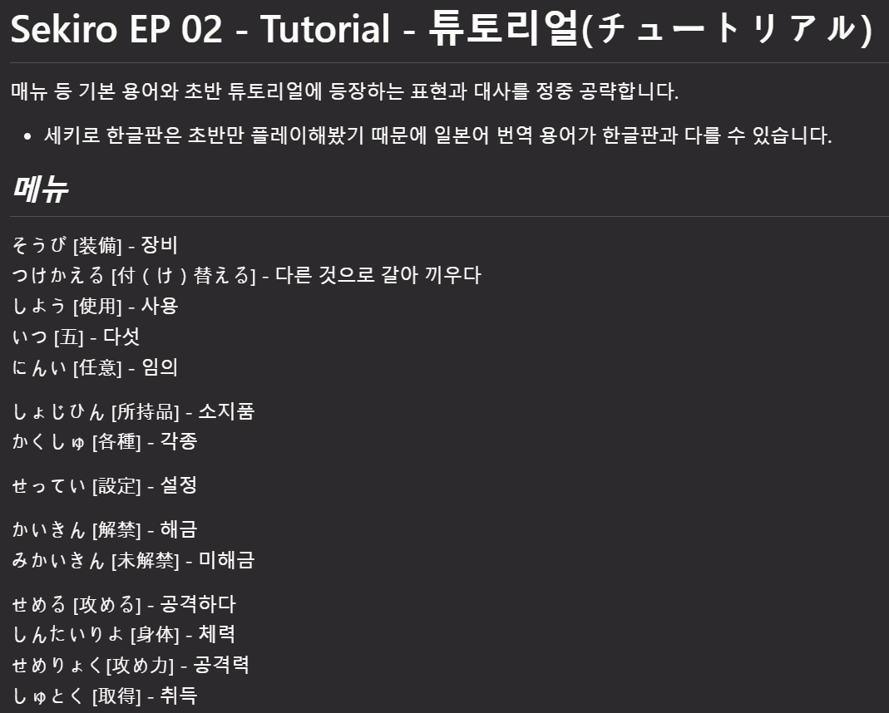

# Memento Python 초급 코스 Part 19 - 파일

**영상링크 : https://youtu.be/hBiHYu-lD1M**

**CWK Memento Python : https://github.com/neobundy/CWK-Memento-Python - 소스코드**

## ***Intro***

오늘은 file을 정리해보자고 했죠. 

## ***file - text, binary***

file은 크게 text와 binary file로 나뉩니다. 간단히 text는 아무 처리를 안해도 인간의 눈으로 읽을 수 있는 소스코드처럼 말 그대로 문서 file을 가리킵니다. 확장자가 text이거나 Markdown의 md 그리고 이렇게 programming의 소스코드 같은 거죠. 나머지는 죄다 binary file이라고 보면 됩니다. 가령 excel이나 word file도 binary고 그림 file도 binary죠. JPEG 같은 거. 아래의 개 그림 같은 거.


이게 제주도에서 찍은 사진인데요. 멋있죠? 완짱😂
 
binary file은 해당 file을 열어서 처리할 줄 아는 특별한 프로그램으로만 열 수 있습니다. text file은 멍텅구리 메모장으로도 열리죠. 솔직히 여기까지 왔는데 text랑 binary file을 구분 못하는 분은 없을 거라고 믿기 때문에 구차한 설명은 넘어가겠습니다.

### ***file 처리과정***

다른 언어라면 file 처리가 좀 까다로운데 Python은 정말 쉽습니다. 모든 언어에서 file 처리 과정은 똑같습니다.

1단계 file을 text 모드 또는 binary 모드로 읽어들인다. 아래 코드 참조

```python
    # r: read mode
    # w: write mode
    # a: append mode
    infile = open(source, "rt")
    outfile = open(dest, "wt")
    # outfile = open(dest, "at")
```

2단계 뺑뺑이를 돌면서 원하는 작업을 한다. 아래 코드 참조

```python
    for l in infile:
        # print(l.rstrip(), file=outfile)
        # print(l, end='', file=outfile)
        outfile.write(l)
```

3단계 file을 닫는다. 아래 코드 참조

```python
    outfile.close()
    print(f'{source} copied to {dest}.')
```

이게 전부예요. 중요한 게 **2단계 뺑뺑이를 도는 과정**이죠. 여러분이 상상력을 발휘하면 무슨 짓이든지 할 수 있습니다. 뺑뺑이를 하루 종일 돌 수도 있고 일주일 내내 돌 수도 있어요. 내가 도는 게 아니라 컴퓨터가 대신 돌아주는 거죠. 주의할 점은 읽기 모드로 열었다면 모를까(`infile = open(source, "rt")`). **쓰기 모드로 열었다면 반드시 file을 닫아줘야 합니다**. (`outfile = open(dest, "wt")`)(`outfile.close()`)

안 닫아주고 프로그램을 종료하면 file이 손상될 가능성이 높습니다. 게임하는 도중에 세이브도 안 했는데 전원이 나가는 상황. 그런 거 떠올리면 되죠. 

## ***file method***

이해하기 쉽도록 간단한 file 복사 함수 두 개를 만들어봤는데요. copy text File, copy binary File. 하나는 text를 복사하는 거고 하나는 binary file을 복사하는 겁니다. 아래코드 참조

```python
def copy_text_file(source, dest):
    """
    Copy A Text File

    :param source: source file
    :param dest: destination file
    :return: None
    """

    # r: read mode
    # w: write mode
    # a: append mode
    infile = open(source, "rt")
    outfile = open(dest, "wt")
    # outfile = open(dest, "at")

    for l in infile:
        # print(l.rstrip(), file=outfile)
        # print(l, end='', file=outfile)
        outfile.write(l)

    outfile.close()
    print(f'{source} copied to {dest}.')

def copy_binary_file(source, dest, buffer_size=10400):
    """
    Copy A Binary File

    :param source: source file
    :param dest: destination file
    :param buffer_size: size of the buffer
    :return: None
    """

    infile = open(source, "rb")
    outfile = open(dest, "wb")

    buf = infile.read(buffer_size)

    while buf:
        outfile.write(buf)
        buf = infile.read(buffer_size)

    outfile.close()

    print(f'{source} copied to {dest}.')
```

### ***copy text file***

먼저 이해하기 쉬운 copy text File을 먼저 볼까요? `source` argument로 주어진 파일 이름을 가지고 `dest` argument라는 이름을 가진 파일에 복사하는 함수거든요. 위 코드 중 해당 부분 아래코드 참조

```python
def copy_text_file(source, dest):
    """
    Copy A Text File

    :param source: source file
    :param dest: destination file
    :return: None
    """

    # r: read mode
    # w: write mode
    # a: append mode
    infile = open(source, "rt")
    outfile = open(dest, "wt")
    # outfile = open(dest, "at")

    for l in infile:
        # print(l.rstrip(), file=outfile)
        # print(l, end='', file=outfile)
        outfile.write(l)

    outfile.close()
    print(f'{source} copied to {dest}.')
```

#### ***open***

`open()` 함수로 file을 열 수 있는데 두 번째 argument를 가지고 text 또는 binary, 읽기 또는 쓰기 모드를 지정할 수 있습니다. `r`이면 read, 읽기 전용인 거고 `w`이면 write, 쓰기 전용, `a`면 append, 덧붙이기 모드인 겁니다.

그러니까 `"rt"`라면 read only text, `"wt"`라면 write text겠죠. `"rb"`면 read only binary일 거고 `"wb"`면 write binary겠죠. `"at"`면 append text일 거고요. 그러니까 이게 w, 쓰기 모드면 그리고 file이 기존에 있었으면, 기존의 내용을 **다 지워버리고 다시 쓰거든요**.

그러니까 기존 내용을 살리면서 더 하고 싶으면 append 모드를 쓰는 겁니다. 이렇게 소스를 `open()` 함수로 읽어서 text 읽기 모드로 열어주면 모든 라인을 통째로 읽어들여서 list로 만든 다음에 돌려줍니다. 아래코드 참조

```python
    infile = open(source, "rt")
    outfile = open(dest, "wt")
```

그래서 이렇게 `infile`에 담긴 list를 뺑뺑이 돌면서 라인 하나하나씩 끄집어내서 뭔가 작업을 할 수 있는 거죠. 아래코드 참조

```python
    for l in infile:
        # print(l.rstrip(), file=outfile)
        # print(l, end='', file=outfile)
        outfile.write(l)
```

아까 file 처리 단계에서 2단계의 뺑뺑이 과정에서 무슨 짓을 하느냐에 따라서 생산성은 태양계를 벗어날 수도 있는 겁니다. 위 코드와 같이 달랑 print 문을 사용하면서 오른쪽에 있는 화이트 스페이스를 날려주고 file에 써주는 게 전부거든요. 

상상력을 발휘하면 정말 무슨 짓이든 할 수 있습니다. write 모드로 file을 열면, `outfile`처럼 file 객체가 만들어지거든요. 이걸 다른 언어에서는 `file handle`이라고 하는데 특히 C 언어에서. 아직도 나도 file handle에 익숙한 세대라 file 객체라는 게 아직 덜 와닿아요. file handle보단. 그런데 python에서는 모든 게 객체니까 file도 객체입니다. 가끔 가다가 실수로 file hande이라는 말을 자꾸 쓰는데 이 file 객체를 사용해서 data를 쓸 수 있거든요.

file 객체에 `write()`를 사용하면 line을 그대로 써줍니다. 이 print 함수를 사용해도 돼요. print 함수의 두 번째 argument로 file 객체를 넘겨주면 그 file에 원하는 내용을 출력해 줍니다.

`rstrip()`을 하는 것은 오른쪽에 있는 화이트 스페이스를 날려주겠다는 뜻이죠. 안 그러면 줄 바꿈 문자가 두 번 들어가잖아요. 이 print의 end 키워드가 기본적으로 줄 바꿈 문자니까. 이거를 empty string으로 주지 않으면 rstrip을 해줘야 되는 거죠. 안 그러면 줄 바꿈 문자가 두 번 들어가요. 이 `outfile`에 write를 해주면 그냥 똑같이 복사를 하는 거고요. file method들은 이렇게 딱 봐도 쉽게 이해가 돼요. 그러니까 reference를 참조하거나 온라인 매뉴얼을 참고하시기 바랍니다. 

#### ***note : 줄 바꿈 문자***

이 줄 바꿈 문자도 잠깐 짚고 넘어가겠습니다. 아래코드(주석) 참조

```python
    # newline/linefeed: \n
    # carriage return: \r
    # mac, linux: \n
    # windows: \r\n
    # mac, linux: 'wankyu\n'
    # windows: 'wankyu\r\n'
```

Linux나 Mac이나 Unix 계열이라면 줄 바꿈 문자가 1byte로 처리됩니다. `\n`, newline 문자죠. linefeed 문자로 처리가 되는데요. window라면 carriage return이라는 문자가 추가돼서(`\r\n`) 2byte로 줄 바꿈을 합니다.

그러니까 `wankyu`라는 문자를 Mac이나 Linux에서 출력을 한다면, 줄 바꿈으로 해서 출력을 한다면, 이 줄 바꿈 문자까지 포함해서 7 byte잖아요. 그런데 window에서는 carriage return하고 linefeed가 같이 출력이 되기 때문에 8 byte가 됩니다. 어지간해서는 문제가 안 생기는데, 이렇게 다른(異) 기종 간에, Mac이나 window에서 왔다갔다 하면서 text 문서를 줄 바꿈 한다거나, 아니면 찾고 바꾸기를 한다거나 이럴 때, 줄 바꿈 문자 바꾼다고 linefeed만 바꿔주는 경우가 많거든요. 이럴 때 window text에서는 carriage return이 살아남기 때문에 문제가 생기는 경우들이 있어요. 나중에 혹시 이런 경우를 만나면, **'뭔가 줄 바꿈 문자랑 관련된 함정이 있었는데'** 정도만 떠올릴 수 있으면 됩니다. 그런 경우 안 생기면 그만인 거고요.

outfile은 쓰기 모드로 열었으니까 닫아줘야죠. 아래코드 참조

```python
    for l in infile:
        # print(l.rstrip(), file=outfile)
        # print(l, end='', file=outfile)
        outfile.write(l)

    outfile.close()
    print(f'{source} copied to {dest}.')
```

`close()` method로. `close()` method로 닫아줍니다. 

### ***copy binary file***

이번엔 binary copy 함수를 보죠. `source`, `dest`는 똑같고요. 아래코드 참조

```python
def copy_binary_file(source, dest, buffer_size=10400):
    """
    Copy A Binary File

    :param source: source file
    :param dest: destination file
    :param buffer_size: size of the buffer
    :return: None
    """

    infile = open(source, "rb")
    outfile = open(dest, "wb")

    buf = infile.read(buffer_size)

    while buf:
        outfile.write(buf)
        buf = infile.read(buffer_size)

    outfile.close()

    print(f'{source} copied to {dest}.')
```

`buffer_size`라는 세 번째 키워드 함수가 있죠. 그리고 기본 값이 10kbyte로 되어 있습니다. file 크기를 알 수가 없으니까, 처음에는. 야금야금 읽어들이는 게 최선입니다. 만약 여기다가 100기가짜리를 줬다면, 한꺼번에 읽어들였다가 큰일 날 수도 있으니까. 메모리가 동날 수도 있거든요. 

그리고 `open()` 함수에서 모드가 달라졌죠. read binary(`"rb"`). write binary(`"wb"`)로 바뀌었습니다. 

그런 다음에 이번에는 `infile` 객체에서 read method를 사용해서 주어진 buffer_size만큼 읽어들여서 `buf`라는 데 저장을 해줍니다. while loop에서는 이렇게 읽어들인 buffer가 비어있는지 확인을 하고, 비어있지 않다면 `outfile` 객체에서 write method를 사용해서 읽어들인 buffer를 써줍니다.

그리고 다시 한번 읽어들이죠. buffer_size만큼. 이 while loop 끝에서 buffer를 계속 채워줘야 읽어들일 거 아니에요. 물론, `while True:`라고 한 다음에 무한루프를 돌면서 buffer가 비었는지 조건문으로 확인을 하고, 비었으면 else block에서 `break`로 탈출해도 됩니다. 어느 쪽을 선택할지는 프로그래머 개취입니다.

`outfile`에 `write()` method를 사용해서 읽어들인 buffer 내용을 써주는 거고요(`outfile.write(buf)`). 그럼 복사가 완료됩니다. 다 끝났으면 outfile 객체를 닫아줘야겠죠. `close()` method로.

#### ***split_filename***

split_filename 함수는 utility 함수인데요. 예전에 한번 봤던 file 이름에서, 이름 부분과 확장자 부분을 dot_index로 찾아내서, `find()` method로 찾아내서, 문자열에서 이름 부분하고 확장자 부분으로 나눠주는 루틴입니다. 복습하는 셈 치고 한번 훑어보세요. 아래 코드 참조

```python
def split_filename(filename):
    """
    Split filename into name and extension parts

    :param filename: filename
    :return: name & extension tuple
    """

    dot_index = filename.find('.')
    name = filename[:dot_index]
    extension = filename[dot_index + 1:]

    return name, extension
```

`split_filename()`을 사용해서 name과 extension을 잘라낸 다음에, timestamp라는 걸 붙여서 원본 file하고 구분을 하고 있는데요. 아래코드 참조

```python
def main():
    """Entry Point"""

    timestamp = str(date.today())
    copy_suffix = '-' + timestamp + '.backup'

    print("=" * 10, "Text File", "=" * 10)

    source = 'ep019.py'
    name, ext = split_filename(source)
    dest = name + copy_suffix + '.' + ext

    copy_text_file(source, dest)
```

`timestamp`는 datetime package에서 date module을 import해야(`from datetime import date`) 사용할 수 있습니다. date module에서 `today()` method를 호출을 하면(`timestamp = str(date.today())`), 오늘 날짜를 timestamp에 담아줍니다. 그리고 copy suffix에다가 적당히 붙여주고, `.backup`이라는 걸 붙여주는 거죠. 그래서 소스 file `ep019.py`를, text file을 복사를 하면, 원본 이름과 확장자를 잘라서 그 가운데에다가 `copy suffix`를 붙인 다음에 복사를 해 주죠. binary file도 마찬가지고요. 돌려볼까요? 그럼, 아까 그 개의 사진도 복사가 되고, 이건 binary로 복사가 된거죠.


그리고 소스 코드는 텍스트로 복사가 된겁니다.

## ***세키로 일본어 단어장 예제***

지난 시간에도 잠깐 봤던 세키로 일본어 단어장 예제를 좀 더 확장해보겠습니다. 세키로 관련 단어를 정리한 문서를 한번 볼게요. 언뜻 봐도 패턴들이 보이죠. 아래 문서 참조

```
# Sekiro EP 02 - Tutorial - 튜토리얼(チュートリアル)

매뉴 등 기본 용어와 초반 튜토리얼에 등장하는 표현과 대사를 정중 공략합니다.

* 세키로 한글판은 초반만 플레이해봤기 때문에 일본어 번역 용어가 한글판과 다를 수 있습니다.

## ***메뉴***

そうび [装備] - 장비  
つけかえる [付（け）替える] - 다른 것으로 갈아 끼우다  
しよう [使用] - 사용  
いつ [五] - 다섯  
にんい [任意] - 임의  

しょじひん [所持品] - 소지품  
かくしゅ [各種] - 각종

せってい [設定] - 설정

かいきん [解禁] - 해금  
みかいきん [未解禁] - 미해금

せめる [攻める] - 공격하다  
しんたいりよ [身体] - 체력  
せめりょく[攻め力] - 공격력  
しゅとく [取得] - 취득  
```

패턴을 보면, 일본어로 시작하는 `そうび`, 처음부터 일본어로 시작하는 라인만 단어 설명이죠. 위에 내용들은 아니고. 처음 제목 부분도 그렇고 이렇게 부제목 부분도 그렇고 `#` 문자가 들어가 있는 것, 샵 문자가 들어가 있는 것들은 제목을 가리키고요. 그 아래는 본문이죠.

이 markdown에서 샵 문자 하나로 시작하면 가장 큰 제목을 가리키고요. 샵 문자가 두 개라면 heading 2, 두 번째 제목, 부제목을 가리킵니다. 그래서 PyCharm에서 markdown을 해석하면 이렇게 보이는 거죠. 아래 이미지 참조



제목, 내용, 부제목, 또 내용 이런식으로. 그러니까 단어 설명은 일단 패턴이 있어야 합니다. 일본어로 시작하고, 대시문자로 구분을 해서 키워드와 뜻을 설명하고 있는 거죠. 그러니까 이걸 if 조건문으로 바꾼다면 'if 첫 단어부터 일본어여야 한다' and '대시문자가 포함되어 있어야 한다'겠죠. 이 조건에 맞지 않으면 위의 라인들은 버리는 겁니다. 'delemiter'를 `-`로 정의하는 거죠. 그럼 루틴을 살펴볼까요? 아래 코드 참조

```python
    source = 'words.md'
    delim = '-'

    entries = [l.strip() for l in open(source, 'rt') if is_japanese(l[0]) and delim in l]

    japanese_dictionary = {}
    for e in entries:
        k, v = e.split(delim)
        japanese_dictionary[k.strip().replace(' ', '')] = v.strip()
        print(f"{k.strip().replace(' ', '')} means {v.strip()}.")

    print("=" * 10, "Write Japanese Dictionary Database", "=" * 10)
    dictionary_file = 'japanese_dictionary.cwkdb'
    print(japanese_dictionary)
    write_database(japanese_dictionary, dictionary_file)

    print("=" * 10, "Read Japanese Dictionary Database", "=" * 10)
    new_dic = read_database(dictionary_file)
    print(new_dic)
```

읽어들인 라인을 list comprehension으로 `entries`라는 list에 담고 있습니다.

list comprehension 조건문을 보면 아까 언급한 `if` 조건문 그대로죠. 근데 이 delimiter가 `-`고(`delim='-'`) delimiter가 라인에 포함되어 있는지 `in` 연산자를 사용해서 쓰는 것까지는 알겠는데(`delim in l`) `is_japanese`라는 함수, 이 함수는 뭔지 갑자기 갑툭튀 하니까 헷갈릴 수 있겠죠.

한번 살펴보겠습니다. idiom으로 쓸 수 있는 함수 세 개를 만들어뒀습니다. 아래코드 참조

```python
def is_korean(word):
    if re.match(r'(^[가-힣]+)', word):
        return True
    else:
        return False

def is_english(word):
    if re.match(r'(^[a-zA-Z]+)', word):
        return True
    else:
        return False

def is_japanese(word):
    if re.match(r'[一-龠あ-んア-ン]+', word):
        return True
    else:
        return False
```

`is_korean`, `is_english`, `is_japanese`라는 함수입니다. 이건 정규식 라이브러리가 필요하기 때문에 `import re`, regular expression의 약자입니다. regular expression package가 필요하기 때문에 import를 하고 있는 거고요.

> 코드 최상단에서 다음과 같이 package와 module을 import해주고 있습니다. 

```python
from datetime import date
import pickle
import re
```

### ***정규식 예제***

정규식은 나중에 다른 시리즈로 다룰 테니까 간단히 오늘은 그 가능성만 확인해 보도록 하겠습니다. 먼저 `is_korean` 함수가 이해하기가 가장 쉬울 겁니다. `re` 모듈의 `match()` method를 사용하면 주어진 정규식이 해당 문자열에 적용되는지 True or False 값을 돌려주는데 문자열 따옴표에 `r`을 붙이면 뭐라고 했다? raw string이라고 했죠. 정규식 표현 쓸 때 escape 문자 일일이 써주기 싫으니까 raw string을 쓰는 겁니다. 

맨 앞에 이 캐럿 문자(`^`) 있죠? 캐럿 문자는 정규식에서 line의 시작을 가리킵니다. line의 시작과 맞으면 `True`죠. 이 bracket은 sequence를 가리키는데요. 이 안에 sequence를 쓸 수 있어요. 이게 소문자 a-z라면 a부터 z까지, 대문자 A에서 Z면 대문자 A에서 Z까지. 모든 알파벳을 가리키거든요. 그래서 소문자 대문자를 다 써주면 모든 알파벳을 가리킵니다. 아래코드 참조

```python
def is_english(word):
    if re.match(r'(^[a-zA-Z]+)', word):
        return True
    else:
        return False
```

한글이라면 `가` `힣` 해주면 돼요. 한글은 `가`에서 시작해서 `힣`으로 끝나거든요. 그러면 우리나라에서 쓸 수 있는 모든 문자를 표현할 수 있어요. 이 `+` 문자는 앞에 정의된 정규식이 한 번 이상 계속될 수 있다는 뜻입니다. 그러니까 이렇게 표현한 정규식에 맞으면 `True`를 돌려주는 겁니다. 아래코드 참조

```python
def is_korean(word):
    if re.match(r'(^[가-힣]+)', word):
        return True
    else:
        return False
```

좀 어렵죠? 정규식도 책 이따시만한 책을 하나 봐야 할 정도로 굉장히 복잡한 내용이에요. 그러니까 이건 다음에 또 다른 시리즈로 다뤄보도록 할게요. 그날이 올지는 모르겠지만.

위와 같이 간단한 표현 하나만으로 주어진 단어가 또는 문자가 한글인지 확인할 수 있는 겁니다. 영어도 마찬가지고요. 일본어도 마찬가지예요. 일본어는 한자 부분(`一-龠`), 히라카나 부분(`あ-ん`), 카타카나 부분(`ア-ン`) 이렇게 세 개를 정의하고 있죠. 아래 코드 참조

```python
def is_japanese(word):
    if re.match(r'[一-龠あ-んア-ン]+', word):
        return True
    else:
        return False
```

이게 한 번 이상 반복되면 일본어라고 이 첫 번째 한자 부분 보면 이게 한일자거든요(`一`). 얘가 피리약자라고 합니다(`龠`). 그래서 약구라고 읽는데 이찌에서 약구까지입니다(`一-龠`). 그러니까 한자 전체를 가리키죠. 그리고 히라카나 아에서 응까지(`あ-ん`), 카타카나 아에서 응까지니까(`ア-ン`), 모든 일본어를 확인할 수 있습니다. 

이 dictionary를 만들어주는 for loop 뺑뺑이는 언뜻 복잡해 보여도 이 key와 value 값에서 화이트 스페이스 날려주고 화이트 스페이스 날려주고 공백은 또 없애주고. 키 값에서 공백은 없애주고. 그 정도만 정리를 하고 있는 거거든요. 보기보다는 간단한 내용입니다. 아래코드 참조

```python
    japanese_dictionary = {}
    for e in entries:
        k, v = e.split(delim)
        japanese_dictionary[k.strip().replace(' ', '')] = v.strip()
        print(f"{k.strip().replace(' ', '')} means {v.strip()}.")
```

읽어들인 entry를 delimiter로 나눠서 key와 value로 나눈 다음에 dictionary로 만들어주고 있는 거예요 다듬어서. 공백들 날려주고 화이트 스페이스 날려주고. 물론 컴쟁이라면 이렇게 dictionary를 만들었으면 어딘가 따로 저장을 해둬야 두고두고 써먹겠죠.

컴쟁이들이 persistence를 좋아하거든요. 프로그램에서만 돌고 쓰고 끝내면 지속가능하지 않잖아요. sustainable하지 않잖아요. persistent하지도 않고. 그러면 persistent한 게 뭐냐. file입니다. file에 저장을 해두면 두고두고 써먹을 수 있겠죠. 게임할 때도 save file 정말 중요하죠. save file 날리면 엔딩을 앞두고 있는 게임도 처음부터 다시 해야 될 수 있으니까요. 물론 컴쟁이라면 당근 이럴 때 data base package를 사용하겠지만 오늘은 간단하게 pickle이라는 package를 사용했습니다. 

역시 pickle을 import하고 있죠(`import pickle`). 피자 먹을 때 반찬 삼아서 먹는 pickle 있잖아요. 그 pickle 맞습니다. 객체 instance 상태를 스냅샷으로 그대로 얼려두는 걸 말합니다. dictionary도 객체 instance이기 때문에 pickle로 얼린 상태로 스냅샷 상태로 file에 저장해둘 수 있거든요. 이걸 'serialize 한다'는 표현을 쓰는데 그리고 읽어들여서 다시 dictionary로 만들면 'unserialize 한다'고 합니다. 그렇게 unserialize를 하면 얼리기 직전에 스냅샷 상태로 해동을 해주는 거죠. 

이 write database 함수를 보면 이 with문으로 open 함수를 불러서 f라는 file 객체를 만들어서 pickle의 `dump()` method를 사용해서 dictionary를 그 file 객체에 써주고 있는 거죠. 아래코드 참조

```python
def write_database(dic, dest):
    """

    Write the given dictionary into the destination file as a pickle

    :param dic: dictionary
    :param dest: destination file
    :return: None
    """

    with open(dest, 'wb') as f:
        pickle.dump(dic, f)
```

그러니까 객체 instance를 얼려서 스냅샷으로 얼려서 그대로 저장을 해주는 겁니다. 냉장고에 넣듯이. 이 with문이 또 갑툭튀하고 있죠. 이 with문을 쓰면 앞에서처럼 열린 file을 굳이 닫아주지 않아도 자동으로 처리를 해줍니다. 예외 처리도 간단해지거든요. 아직 예외 처리를 배우지 않았지만 예외 처리를 다 해줘야 돼요. 원래 file은. 앞뒤로 다 해주고 굉장히 복잡해져요. 코드가 그래서 예외 처리를 일부러 하지 않았는데요. 단순하게 코드를 쓰느라고 원래는 복잡하게 예외 처리를 해줘야 하는데, 그 예외 처리를 간단하게 하는 방법 중에 하나가 with문을 쓰는 겁니다. with statement.

지금까지 연마한 패턴 인식 기술만으로도 충분히 눈치 깔 수 있습니다. with open as file 객체죠. 이게 전부예요. read database 함수도 간단합니다. pickle 에서 `load()` method 를 사용해서 file 객체에 얼린 상태로 저장된 객체 instance를 불러와서 해동을 시켜서 그 스냅샷을 이 dictionary 에 담아주고 있는 거죠. 아래 코드 참조

```python
    dictionary_file = 'japanese_dictionary.cwkdb'
    print(japanese_dictionary)
```

`japanese_dictionary.cwkdb` 라는 이건 그냥 내가 만든 거예요 확장자는 별 의미 없어요.

간단 data base에 일본어 단어장 dictionary 객체를 스냅샷으로 저장해 두고 언제든지 불러 쓸 수 있게 됩니다. 마치 냉동고 같죠. 객체 instance를 얼렸다가 해동을 할 수 있는. 다시 말하지만 data base 사용하는 게 일반적입니다. data base는 또 따로 다뤄야 돼요. 그만큼 덩치가 큰 내용이기 때문에 따로 다룰 게 참 많네요. 대체 어디까지 가야지 끝날지. 

> 사실상 이 많은 내용들이 탄탄하게 기본으로 잘 다져져야 비로소 AI를 다룰 수 있는 자격이 갖춰지는 것이라고 보면 될 것 같습니다. 하루 가용가능한 시간 생각하면 절대 짧고 쉽게 끝날 여정이 아니네요.

어쨌든 file은 이 정도만 알아도 어지간히 사용할 수 있습니다. 나머지는 어차피 reference 참조하면서 상상력을 발휘하는 단계거든요. 한번 돌려볼게요. 

아까 file copy하는 건 이런 식으로 copy가 되고요. 아까 일본어 단어를 정리한 이 `words.md` 라는 file을 읽어들여서 key와 value로 구분을 하고 있죠. 그래야지 다양한 의미를 다룰 수 있을 테니까요. 이렇게 쭉 정리가 잘 되죠. dictionary로. 그런 다음에 또  pickle로 스냅샷을 저장합니다. `japanese_dictionary.cwkdb` 라는 곳에다가. 그런 다음에 읽어들여서 해동을 해서 다시 dictionary에 담아도 똑같은 스냅샷 상태를 유지하고 있죠. 아래 아웃풋 참조

output:
```
========== Text File ==========
ep019.py copied to ep019-2024-09-10.backup.py
========== Binary File ==========
dog.jpg copied to dog-2024-09-10.backup.jpg
========== Read Source Word List Text File ==========
そうび[装備] means 장비,
つけかえる[付（け）替える] means 다른 것으로 갈아 끼우다,
しよう[使用] means 사용,
いつ [五] means 다섯,
にんい [任意] means 임의,
しょじひん [所持品] means 소지품,
かくしゅ [各種] means 각종,
せってい [設定] means 설정,
かいきん [解禁] means 해금,
みかいきん [未解禁] means 미해금,
せめる [攻める] means 공격하다,
しんたいりよ [身体] means 체력,
せめりょく[攻め力] means 공격력,
しゅとく [取得] means 취득
========== Write Japanese Dictionary Database ==========
{'そうび[装備]': '장비', 'つけかえる[付（け）替える]': '다른 것으로 갈아 끼우다', 'しよう[使用]': '사용', 'いつ [五]': '다섯', 'にんい [任意]': '임의', 'しょじひん [所持品]': '소지품', 'かくしゅ [各種]': '각종', 'せってい [設定]': '설정', 'かいきん [解禁]': '해금', 'みかいきん [未解禁]': '미해금', 'せめる [攻める]': '공격하다', 'しんたいりよ [身体]': '체력', 'せめりょく[攻め力]': '공격력', 'しゅとく [取得]': '취득'}
========== Read Japanese Dictionary Database ==========
{'そうび[装備]': '장비', 'つけかえる[付（け）替える]': '다른 것으로 갈아 끼우다', 'しよう[使用]': '사용', 'いつ [五]': '다섯', 'にんい [任意]': '임의', 'しょじひん [所持品]': '소지품', 'かくしゅ [各種]': '각종', 'せってい [設定]': '설정', 'かいきん [解禁]': '해금', 'みかいきん [未解禁]': '미해금', 'せめる [攻める]': '공격하다', 'しんたいりよ [身体]': '체력', 'せめりょく[攻め力]': '공격력', 'しゅとく [取得]': '취득'}
```

이런 상상을 한번 해보세요. 여러분이 문서 작업을 합니다. 마이크로소프트 워드로 글을 쓴다고 해도 잠시 text로 저장 가능하잖아요. 그걸 Python에서 읽어들여서 라인당 뺑뺑이로 돌면서 무슨 짓이든지 할 수 있다는 겁니다. 그런 다음에 다시 text file로 저장을 하고. 워드로 다시 읽어들여서 새 단장을 해주면 프레젠테이션을 만들어주면, 어지간한 귀찮은 단순 작업은 다 날릴 수 있어요. 게다가 오늘 잠깐 맛본 정규식까지 곁들이면 두말할 나위가 없죠. 그 potential은. 

또 게다가 워드문서 자체를 읽어들여서 처리하는 package도 이미 Python에 만들어져 있습니다. Excel이라고 다를 게 없거든요. 웬만한 binary file 포맷도 거의 Python에서 바로 처리가 가능합니다. 컴쟁이는 바퀴 다시 안 만든다니까요. ***Don't reinvent the wheel.*** 

예외처리나 이런 자질구레한 내용이 남았지만 오늘 정리한 file까지 에피소드 19개만 잘 따라왔다고 해도 여러분은 이미 당당한 Pythonista입니다. 뭘 못하겠어요. Python이 수중에 있는데. 이제 다룰 줄 아는데.