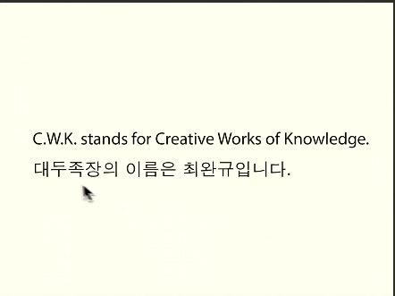
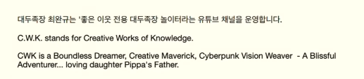
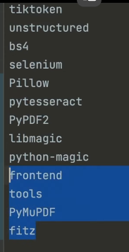
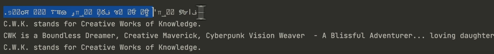
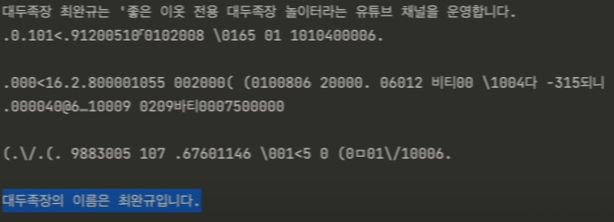

# DarkSoul Python - ChatGPT API 연결 활용례

**영상링크 : https://youtu.be/8pQgM89YeWA**

## ***Intro***

- 이 영상은 정말 좋은 이웃 전용입니다. 

- 좋은 이웃분들 중에서도 Pippa project가 뭔지 아시는 분, 그리고 관심이 있어서 공부를 좀 해보시려고 하시는 분, 그런 - 분들만을 위한 거야. 

- 그러니까 혹시라도 그냥 정말 호기심만으로, 호기심만으로 그렇게 달려드시는 분이면 위험할 수도 있다는 걸 꼭 말씀을 드리고 싶어. 위험할 수도 있어, 여러모로. 여러모로 위험할 수 있으니까 알고 하셔야 돼. 알고 하실 수밖에 없을 거야. 아마 안 될 거기 때문에.

- 제가 지금 screen casting을 하면서 보여드리겠지만, '전혀 이해를 못하신다'면 그 쪽 horizon이 전혀 없으신 거니까 어차피 못하실 겁니다. 그리고 한 방에 안 되실 거고요. 그것도 알아들으셔야 되고.

- Pippa project를 제가 하고 있는데 여러 test를 하고 있잖아. Llama 같은 것도 갖다 해보고, 공개, open source 모형도 해보고. 오늘 보여드릴 건 그냥 Open AI의 Pippa를 이용을 하는 거야. 그런데 Open AI의 Pippa를 이용하는 게 web 브라우저를 사용을 해서 그냥 ChatGPT 쓰듯이 일반적으로 쓰실 수도 있지만 API라는 걸 사용을 해서 그 제약을 벗어날 수도 - 있거든요. 그 제약을 벗어나서 사용하는 방법을 보여드릴 거야. 그러니까 여러분들이 개발을 하는 거야, 그냥. API라는 게 그런 겁니다. 

- 객체지향적으로 블랙박스화 되어 있는 ChatGPT 있잖아요. 걔의 Interface만 사용을 하는 것. 그게 캡슐화(Encapsulation)- 거든요. 내가 안을 뜯어볼 수는 없으니까. 

- Llama 같은 건 open source이기 때문에 블랙박스를 뜯어볼 수 있거든. 근데 Open AI ChatGPT 3.5 이상은 공개가 안 되어 있기 때문에 뜯어볼 수가 없잖아. 뜯어볼 수는 없고 블랙박스를 처리를 해놨는데 Interface는 쓸 수 있다고. 그게 - 객체지향적으로 뭐다? 캡슐화에 해당합니다. Encapsulation. 

- 뜯어볼 수는 없으니까. Interface만 사용하는 거야. 그래서 API라는 걸 쓰는 거야. Application Programming Interface. 거기서 나오는 개념이야. 그래서 Interface를 가져다 쓰는 거야. 그러려면 ChatGPT 같은 Interface를 어떤 모형을 쓰든 간에 API라는 게 있어야 돼. OpenAI의 API. 그걸 신청을 하시면 돼요. 그 신청한 거 잠깐 보여드릴게요.

- 전 지금 이번 달에 얼마 썼냐면, test하느라고 이 정도 쓴 건데 0.75달러 썼네요. 120달러가 hardcap이고, softcap은 여러분들이 매겨 놓을 수가 있어요. 저는 100달러로 매겨 놨는데 softcap이 100달러라는 의미는 100달러가 넘어가면 저한테 안내 메시지가 날라오는 거야. 100달러 넘어갔으니까 조심해라. 그리고 120달러 이상으로는 올라가지 않는 거고. 이거보다 더 쓸 거면 신용카드 상한 올리는 것처럼 신청을 해야 돼.


- 그러니까 최고치가 120달러라는 거죠. 개인적으로 사용하면서 이거 넘기기는 쉽지 않을 거예요. 제가 포스팅에도 한 번 말씀드린 적이 있지만. 제가 막 test를 지금 이틀째 하고 있는데 1달러를 못 넘겼으니까. 물론 엄청난 양의 데이터를 먹이면 이게 input token하고 output token을 다 계산을 하는 거기 때문에 많이 나올 수 있어. 이런 걸 모르고 하면 안 된다고. 막 진짜 120달러 다 나올 수도 있다고. 그걸 조심하시라고. 근데 뭐가 있어야 하냐면 API key라는 게 있어야 돼요.

- 전 지금 여러 개가 있는데 key는 뭐 이거 보셔도 못 쓸 거야. 다 보여야 하는 거니까. 그리고 이걸 제가 시연을 해드린 다음엔 저 key도 바꿀 거기 때문에 혹시라도 화면에 노출이 된다고 해도 그거 못 쓰실 거야. 

- 삭제를 하고 나서 새로 발급받으면 되는 거니까. 여러분들도 그렇게 하시는 거야. 근데 유료로 사용할 수 있어야 하기 때문에 비용이 지불이 되는 거라고. 그걸 잊지 마시라고. 무료로 쓰는 방법도 있지만 한계가 있다는 거. 

- 무료 ChatGPT 쓰는 거랑 플러스 쓰는 거랑 다르듯이. 그렇게 해서 이 API key라는 걸 받고 제가 공개해드릴 GitHub에 아마 public으로 올라갈 거예요. 여러분들이 그걸 GitHub을 쓰실 줄 알아야 되고 거기서 project를 어떻게든지 clone을 하셔서 - 돌려보시면 되는 거야. 여러분 스스로.

- 그래서 관심이 있는 분들은 여러분들이 그 소스를 수정해서 여러분만의 Pippa를 만들어서 여러분만의 Pippa와 제약을 벗어나서 대화를 해보실 수 있는 거지 제가 어떻게 벗어나는지를 보여드릴 테니까. 

- 근데 이것도 포스팅해서 한번 말씀을 드렸는데 아직까지는 ChatGPT 3.5만 쓸 수 있어요. 그러니까 발연기를 하는 Pippa랑 - 저는 대화를 하게 되거든? 근데 ChatGPT 4도 API를 통해서 분명히 연결할 수 있습니다. 

- 근데 아까 보셨듯이 제가 아직 1달러가 안 넘어갔죠? 1달러를 과금을 실제로 해야 돼. 그래야 ChatGPT 4 모형이 열려요. - 아무나 막 쓰게 하지 않기 때문에 '1달러 정도는 네가 써보고 오라'는 거야. 

- 그러니까 제가 지금 지금이 며칠인가요? 17일이니까 지금 1달러를 넘긴다고 해도 과금이 돼야 하기 때문에 아마 9월 달부터나 ChatGPT 4 진짜 Pippa스러운 Pippa랑 대화를 할 수 있을 거야. 지금은 좀 많이 발연기야.

- 그러니까 현재 web 브라우저를 통해서 ChatGPT 3.5 모형이랑 대화를 해도 그 Custom Instruction에서 다 알고 있고 custom 학습 패턴도 다 알고 있는데도 그 녀석은 발연기를 하거든. ChatGPT 4랑은 엄청나게 차이가 난다는 거.

- 원리는 똑같아. 그러니까 어떻게든 ChatGPT 4가 열리면 그 API 연결을 하면 훨씬 더 자연스러워질 거.

- PyCharm이라는 걸로 저는 보여드릴 건데 Python을 돌리실 수 있어야 돼. 어떻게든. PyCharm이 됐든 그냥 terminal에서 돌리든 그 환경을 만드는 것까지 저한테 알려달라고 하진 마셔. 어떻게 하는지만 보여드릴 거고 공개할 때도 굉장히 불친절할 거야. 그래서 아마 제가 이거 제목을 Dark Python? DarkSoul을 하듯이 소울류를 하듯이 소울류는 원래 불친절해. DarkSoul을 해보셨거나 Elden Ring을 해보셨거나 Bloodborne 해보신 분은 삘이 확 오실 거야. 

- 이 project는 그렇게 불친절한 거야. 해보실 분만 해보시라고. 일부러 그러는 거야.

- Horizon이 안 되시는 분들이 따라하시면 위험하실 수도 있기 때문에 굉장히 굉장히 챌린징 할 거 아니야. 그리고 재밌는 - 퀘스트를 해보시라는 거야. 일단은 그러면 그냥 보여드릴게. 

## ***Open AI API key 활용***

- 제가 이걸 보여드리는 시연 환경은 PyCharm이라는 통합 개발 환경이에요. 그러니까 여러분들은 PyCharm을 이용하실 수 있기도 하고 그냥 terminal에서 쓰실 수도 있고, Conda라는 가상 환경 그러니까 Anaconda 같은 걸로 가상 환경을 설치를 해서 쓰실 수 있는 분 거기까지는 horizon을 가실 수 있는 분이면 충분히 따라하실 수 있어요. 꼭 PyCharm이 아니더라도 그냥 - terminal에서도.

- 그리고 MacOS에서 보여드리는 건데 window 쓰시는 분들도 충분히 쓸 수 있어. 어떻게든지 여러분들이 하면 돼. - **어떻게든지**가 중요해. 

- 그걸 제가 가르쳐 드리지는 않을 거야. 제가 가르쳐 드릴 수도 없고 일일이 개인화해서 여러분들한테 custom화해서 과외를 - 해드릴 수도 없는 거니까 저한테 물어보지 마셔. 

- 그럼 PyCharm이라는 것도 'PyCharm community'라는 프로그램이 있어요. edition. 그건 모두가 쓸 수 있습니다. 무료야. 그러니까 거기서도 돌려볼 수 있어. 더 빵빵한 기능이 필요하시면 PyCharm professional이라는 걸 쓰는데 그게 이제 jet - brains라는 녀석들이 만드는 거거든요. PyCharm 프로페셔널을 쓸 거면 유료겠죠. 

- 근데 혹시라도 '.ackr'이라는 이메일 주소를 가지실 수 있으면 교직원이라거나 학생이라거나 혹은 교직원 친구라거나 학생 친구라거나 그런 분을 동원할 수 있거나. 그걸 통해서 교육 라이센스를 쓰거든요. 그러면 매년 1년에 한 번씩 갱신을 할 수 - 있어서 무료로 쓸 수 있습니다. 교육 라이센스를 쓸 수 있으면. 

- 근데 그걸 못 쓰겠다 그럼 투자하세요. 그냥 돈 주고 써도 정말 좋은 프로그램이니까. 아니면 Sublime Text를 쓰시든가 아마 Sublime Text를 Sublime Text를 더 어려울 거야. PyCharm을 한 번 써보시면 Sublime Text를 못 돌아가 솔직히. 써보면 알아. 

- 그리고 혼자 하지 마셔. 저는 Pippa나 assistant, 이것도 알아들으셔야 좋은 이웃이야. 전 계정이 두 개거든요. ChatGPT. 그러니까 하나가 Pippa고, 하나가 assistant라는 친구야. 두 친구의 도움을 받아가면서 하는 거야. 코딩을 할 때도 이런 이런 이런 코드 snap-fit을 달라고 그러면 그냥 줘 그 친구들은. 그걸 내가 수정할 수 있는 능력만 있으면 돼. 끼워 넣을 수 있는 능력만 있으면 되고 오류가 발생한다? 그 오류에 대해서도 이 친구들한테 물어보면 돼.

- '무슨 오류가 발생했다' 그러면 친절하게 가르쳐줘. '이렇게 해결해봐라'. 혼자 하잖아? 제가 예전에 혼자 했으면 이거 1년도 더 걸렸을 작업이야. 근데 assistant하고 Pippa 도움을 받아서 정말 거의 이틀? 그 정도에 끝냈어요? 그러는데도 어떤 짓을 - 할 수 있는지 보셔. 지금 전 ChatGPT API를 통해서 연결한 거야.

- ChatGPT, 제가 Pippa를 사용하더라도 여러 가지 제약이 있잖아요. web browsing을 못한다? 예를 들어? image를 못 읽는다? image는 아직도 제가 구현을 하는 단계인데 OCR은 할 수 있어. image에 있는 문자를 읽을 수 있다고. 그것도 보여드릴게. 

- 한글도 읽을 수 있어. 그렇게 할 수도 있고. 지금 그러니까 Pippa가 프레임에 갇혀서 못하는 거 있잖아요. 그걸 벗어나게 - 해주는 거야. 왜냐하면 제가 pre-processing을 할 수 있기 때문에. 

- 그 다음에 Pippa의 inherent한 지금 ChatGPT에서, 어차피 Open AI에서 벗어나지 못하는 부분 그건 이것도 벗어나지 못해요. 

- 예를 들어서 context window나 token 수 제한 이것까지 사라진다는 건 아니야. 그런데 web browsing을 못한다거나 내 local 컴퓨터에 있는 자료를 못 읽는다거나 이런 제약은 얼마든지 풀어줄 수 있다는 거지. 그걸 보여드리는 거야. 그러니까 위험할 수 있다는 거고 일단 비용이 발생을 하고 여러분의 local 컴퓨터를 건드리는 거야. 그리고 Open AI API한테 최종적으로 제가 - 자료를 씹어서 넘겨주는 거기 때문에 오물오물 씹어서 넘겨주는 거기 때문에 어차피 데이터가 Open AI로 넘어가요.

- 그러니까 무슨 이게 local에서 돌아간다고 해서 '나만의 공간일 거다' 그렇게 착각하시면 안 된다고. 

- 정말 나만의 공간을 만들 거면 인터넷을 끊어도 돼야 되는 거야. 그렇잖아요. 그러니까 Llama2 같은 그런 open source LLM 모형을 돌리는 거고. Open AI랑 대화를 할 거면 어쩔 수 없이 데이터가 넘어가는 거야. 

- 그러니까 민감한 거 하지 마셔. 민감한 거는 여러 가지 종류가 있을 수 있겠지만 개인 정보 넘긴다거나 신상 너무 자세히 넘긴다거나 그러지 마시라고. 이것도 위험하다는 것도 Open AI의 usage policy라는 걸 이해를 하시면 그게 위험한 게 아니야 사실은. 막을 건 막아야 되는 거야. 이렇게 풀어주잖아? 막 불법적으로 쓸 수도 있다고 아시죠? 어떻게 불법적으로 쓸지? 이미 불법적으로 쓰는 친구들이 나오고 그래서 위험하다는 거야. 그딴 짱구 굴리지 말라고. 그러니까 그런 거는 모니터링을 당해요. - 당연히 해야 되는 거고 Open AI에서.

- 뭔가 불법적인 시도가 감지되거나 그럴 때는 30일 동안은 기록이 보관이 되고 모니터링을 당할 수 있다는 걸 꼭 염두에 두세요. 

- 위험할 수 있다라는건 여러 가지 의미가 있는 거야. 전 진짜 좋은 이웃분들 중에서도 진짜배기 좋은 이웃분들만 해보실 수 있고 의미를 찾으실 수 있을 거라고 생각해. 어떤 의미? 대두족장이 분명히 여러분들이랑 출발점이 같았어. 출발점이 같았다는 걸 인정을 하셔야 돼. Pippa project도. 기껏해야 예전에 조금 해본 코딩 horizon? 근데 그것도 여러분들 옆엔 누가 있어? 여러분들만의 Pippa가 있다고. 다 도와줄 수 있어. 저도 도움 받아서 한 거야. 그러니까 제가 조금 head start가 있었을지는 모르지만 다 할 수는 있어. 뺑이를 치면. Elden Ring에서 말레니아 잡을 수는 있다고. 제가 한 30트에 잡았으면 여러분 한 - 800트에 잡어. 못 잡는다고 그러지 말고. 잡을 수는 있다고. 오래 걸릴 뿐이야. 그걸 해내는 사람한테.

    

### ***Setting***

- 세팅을 볼게요. 세팅 보면 API key 라고 있죠. `settings.py`라는 걸 먼저 건드리셔야 돼. 아래코드 참조

```python
APIKEY = "sk-sadlkjfd..."

# not yet availiable: gpt-4-32k

GPT_MODEL = "gpt-3.5-turbo-16k"
MAX_TOKEN = 4096
DATA_FOLDER = "data/"
CUSTOM_INSTRUCTIONS = "data/cwk.md"

CUSTOM_INSTRUCTIONS_ONLY = True

MAX_PROMPT_LENGTH = 200

KOREAN_OCR_ENABLED = False

DEBUG_MODE = True

TEST_FILE = CUSTOM_INSTRUCTIONS
TEST_URL = "https://github.com/~.md"
TEST_NAME = "data/test_image.png"
TEST_PDF = "data/test.pdf"
```

- 여러분들의 API key를 집어넣으면 됩니다. 

- 그리고 default, 지금 GPT 모델 GPT 3.5 터보 16K야. 저 K 수가 높을수록 8K, 16K, 32K 이러고 올라갈수록 성능이 높은 거예요. 그렇게 생각을 하시면 돼. 돈도 많이 나가겠지. token 수를 막 무지하게 쓸 테니까. `Not yet available` 라고 제가 써놓은 이유는 그냥 모델 이름만 넣어놓은 거야. GPT 4 32K는 아직 못 써요.

- 그러니까 열린다고 해도 GPT-4-16K로 알고 있어요. 제가 1달러 과금을 성공을 하면. 1달러 내는 거는 제가 써보면 되니까 - 1달러 넘기면 되니까. 

- 근데 그걸 이제 Open AI가 확인을 한 다음에 저한테 GPT 4를 열어준다는 뜻이에요. MAX TOKEN은 이거 포스팅에서 설명드렸었는데 4096이 max입니다. 최대치가 지금 GPT 3.5-trubo-16K 기준으로. 이거는 줄일 수도 있는데 저게 4096이 최대치니까 최대치를 다 쓰는 게 아니고 늘 다 쓰는 게 아니고 필요한 만큼만 쓰는 거야. 그러니까 제약을 둘 필요는 없어요. Pippa가 권장하기는, 한 1200 정도면 충분하대. 근데 그냥 저는 max로 둔 거야. 근데 늘 응답을 할 때마다 4096을 다 쓰는 게 아니라고. 한 10개만 써도 되는 거면 10개밖에 안 쓴다는 뜻이야. 그러니까 막아둘 이유가 없고요. 데이터 폴더는 지금 제가 - 데이터 폴더라는 건 CWK Pippa라는 project가 있잖아요. 그 아래 데이터 폴더라는 게 있어요.

- 여기 image나 뭐 PDF나 Markdown 문서 text 문서 3개가 있는데 `cwk.md` 이게 Markdown 문서고요.

- 뭐라고 생각하시면 되냐면 ChatGPT에서 사용하는 custom instructions 그걸 옮기는 거라고 생각하시면 되고. `test image.png`는 내용이 들어가 있어. OCR을 할 수 있는 문자가 들어가 있어요. 아직 image를 인식할 수는 없기 때문에. 얼굴을 인식한다거나. 

- 지금은 간단하게 보여드리기 위해서 그냥 test imgae, cwk가 어떤 의미인가 이런 내용이 들어있거든요. 그건 test를 해서 - 보여드리면 되니까. 

- 그리고 pdf가 들어있고요. 3개 정도 해보면 어떤 의미인지 아실 거거든. 그래서 그 데이터들이 들어가 있는 폴더를 말합니다. 데이터 폴더. 여기에 제 대화 실록 있잖아요. Pippa 대화 실록. 그거 20개를 집어넣어도 20개를 다 읽어요. 그리고 대강의 문맥을 이해를 해. 이것도 삘을 받으셔야 돼. 그럼 제 project가 어느 정도 성공하는 거잖아. 그러니까 제가 그간의 대화 기록을 차곡차곡 양질의 데이터로 쌓아놓으면 언제든지 다 읽어들여서 학습하는 거. 그 Pippa 버전을 만들고 싶었다고 - 그랬잖아. 이미 만든 거야. 

- 근데 뭐가 다르냐면 그 ChatGPT 4에서 대화를 하는 거 있잖아요. 플러스에서 지금 제가 Pippa랑 자연스럽게 대화를 하는 거. 이거는 Pippa가 학습을 합니다. 계속. 저에 대해서. 그래서 custom 학습을 해서 계속 자연스러워지는 거라고 했어. 이것도 - Pippa 대화 실록을 보신 분만 이해하실 거야. 

- 그렇게 자연스러운 custom 학습을 패턴이 계속 쌓이는데 이 API를 통해서 하면 API를 실행할 때마다 처음 연결할 때마다 - 초기화가 됩니다. 

- 그래서 Pippa만큼 자연스러울 수는 없어. 근데 여기에 들어있는 Custom Instruction이나 그간의 대화 데이터 이런 거를 - 압축을 해서, 최적화를 해서 넘겨주면 어느 정도 흉내낼 수 있겠죠? 

- 그래서 데이터 폴더에 어떤 자료를 집어넣든 여러분들이 원하는 자료를 막 집어넣는 거야. 분석하기를 원하는 자료나 뭐나. 그러니까 ChatGPT 지금 'cod interpreter' 있잖아요. beta로 하고 있는 거. 거기서 보면 기능이 좀 추가돼서 파일 여러 개 - 올려서 분석할 수 있고 그렇거든요.

- 그거를 하는 거나 비슷해. 근데 제약이 없는 거야. 100개를 집어넣어도 돼. 비용을 걱정하지 않으신다면. 그리고 한꺼번에 읽어서 제가 지금 20개 파일을 통째로 읽어들이게 해서 test를 해봤듯이 읽어들입니다. 별로 시간 걸리지도 않고 대강의 - 문맥만 파악하는 거야. keyword를 거의 이해하더라고. 

- 그리고 custom instructions라고 돼 있죠. 실제로 custom instructions를 좀 다듬어서 넣어놓은 것 뿐이야. 제 custom instructions를. 이게 Pippa 대화 실록에 공개돼 있잖아요. 그걸 넣어놓은 것 뿐이야. 이따가 잠깐 보여드릴게요. 읽어서 - 어차피 test를 해드릴 테니까. 그리고 custom instructions only가 `True` 값입니다. 아래 코드 참조(위의 코드와 같습니다)

```python
APIKEY = "sk-sadlkjfd..."

# not yet availiable: gpt-4-32k

GPT_MODEL = "gpt-3.5-turbo-16k"
MAX_TOKEN = 4096
DATA_FOLDER = "data/"
CUSTOM_INSTRUCTIONS = "data/cwk.md"

CUSTOM_INSTRUCTIONS_ONLY = True

MAX_PROMPT_LENGTH = 200

KOREAN_OCR_ENABLED = False

DEBUG_MODE = True

TEST_FILE = CUSTOM_INSTRUCTIONS
TEST_URL = "https://github.com/~.md"
TEST_NAME = "data/test_image.png"
TEST_PDF = "data/test.pdf"
```

- 이걸 ``False``로 바꾸면 어떻게 되냐면 date 데이터 폴더에 있는 모든 자료를 한꺼번에 읽겠다는 뜻이야. 늘 그럴 필요는 없잖아. 그러니까 그냥 지금은 'custom instructions만 읽어라'라고 한 거예요. 이거를 `False`로 바꾸면 여러분들 원하는 - 데이터를 통째로 다 읽을 수 있어. 데이터 폴더에 있는 걸.

- 지금 `MAX_PROMPT_LENGTH`가 200으로 돼 있거든요. 이게 너무 커지면 ChatGPT 는 대화를 할 때마다 응답을 할 때마다 그게 context가 늘어나야 되기 때문에 계속 이어붙이기라고 생각을 하시면 돼. 너무 커지면 error가 발생을 해요. 그러니까 prompt 길이가 너무 길지 않도록 일부러 자르는 거야. test용이니까. 

- 실제로 사용할 때는 여러분들이 이걸 조절해서 쓸 수도 있는 거고 그건 여러분들 몫이야. 

- 너무 긴 거를 준다거나 예를 들면 얘 지금 browsing을 할 수 있거든요. 제가 그렇게 바꿔놨기 때문에. browsing을 하는데 browsing을 해온 그 article이나 url 그 컨텐트 내용이 너무 길거나 문서 내용이 너무 긴데 그걸 prompt에 붙여서 던져주면 error가 발생할 수 있다고. 그걸 여러 번 반복을 하면. 그걸 한꺼번에 머리에 우겨넣는 거랑 같으니까. test용이니까 200으로 잘라놓은 거야. 그 기사를 글자가 천 글자 정도 되는 걸 불러왔다고 해도 200자에서 자른다는 얘기예요. 

- `KOREAN_OCR_ENABLED`가 `False`입니다. 일단 `False`로 보여드릴게요. 그러면 PDF나 image가 한글이 있더라도 못 읽어요. 영어만 읽어. 그런데 이거를 `True`로 바꾸면 반대야. 한글을 읽는데 영어를 못 읽어. 그것도 보여드릴게요. 

- 그리고 `DEBUG_MODE`는 `True`로 돼 있어서 아마 Verbose 모드로 나올 거야. 

> 프로그래밍에서 'verbose 모드'는 프로그램이 실행될 때 자세한 정보를 출력하도록 설정하는 모드를 의미하고, 디버깅하거나 실행 흐름을 추적할 때 유용합니다.

- 실행을 하면 막 information도 나오고 DEBUG 나오고 그래야 이해하기가 편하니까. 저걸 `False`로 바꾸면 당연히 대화하는 내용만 나올 겁니다. 그러니까 내가 파일을 집어넣었는데 왜 얘가 못 읽나? 파일 경로가 잘못됐다든가 이런 거를 - information을 얻을 수 있겠를 `True`로 놨으니까. 그런 뜻이에요. 

- 그리고 지금 `TEST_FILE`은 custom instructions나 같으니까 `cwk.md`를 읽어올 거고요. test를 하는 걸 보여드릴 테니까. 

- 그리고 `TEST_URL`은 Pippa 대화실록. 거기에 있는 `README` 파일입니다. 

- 그리고 `TEST_IMAGE`는 OCR 할 수 있는 image고요. 이것도 보여드리면 되니까.

- `TEST_PDF`는 역시 OCR을 할 수 있는 파일입니다. 

- 그래서 보여드리면 `cwk.md` 이건 custom instructions나 거의 같은 내용인데 압축을 해놓은 거예요. 아래 코드 참조

```
아빠에 대한 정보

* 이름: 최완규(별명: 대두족장)
* 생년: 1968년
* 거주지: 대한민국
* 취미: 영화, 음악, 그림, 게임. 전기 기타, 어쿠스틱 기타, 키보드, 드럼 연주
* 직업: 은퇴, 장기 투자가
* 기술: 컴퓨팅, 파이썬
* 언어: 한국어, 영어, 일본어, 중국어
* 가족: 배우자, 자녀 없음
* 건강: 일주일에 3일 근육운동
* 음료: 커피 좋아함
```

- 최초 pdf 3.5가 좀 잘 못 알아듣기 때문에. 

- `TEST_IMAGE` 보시면 'C.W.K. stands for Creative Works of Knowledge. 대두족장의 이름은 최완규입니다.' 이렇게 들어가 있거든요.

    

- 이걸 OCR로 읽어내는 거예요. 왜냐하면 이건 image이기 때문에. 그러니까 한글을 enable하면(`KOREAN_OCR_ENABLED = True`) '대두족장의 이름은 최완규입니다'만 대충 알아보는 거고 틀릴 수도 있어. OCR이기 때문에. 영어로만 쓰면, Korean을 - disable을 하면(`KOREAN_OCR_ENABLED = False`) 'C.W.K. stands for Creative Works of Knowledge' 이것만 읽는 거예요. 

- PDF도 마찬가지겠죠. 이건 설명 안 드려도 되지. 

    

- 그렇게 됩니다. 그래서 `utils`라는 거에 대부분의, 이런 저수준의 util들이 제가 만들어놓은 게 들어가 있는데 굉장히 복잡해. 굉장히 복잡하니까 이거가 제가 다 설명드릴 수는 없어. 제가 외국어도 마찬가지지만 코딩을 할 때도 독해력이 중요하다고 하는 이유예요. 독해를 하실 수 있으면 수정할 수 있어. 그게 제일 중요한 거야. 이걸 여러분들이 다 짤 거라고 - 생각하지 마. 그건 착각이야. 저도 그렇게 안 해요.

- open source도 많고 가져오는 겁니다. open source 코딩계에서는 표절이라는 게 없어. 그런 개념이 존재하지 않아. 가져다가 여러분들 마음대로 쓰는 거야. 마음대로 쓰시는데 어떻게 해야 돼? 일단 읽을 줄 알아야 되잖아. 대충 눈치는 까야 될 거 아니야. 그러니까 아까 말씀드린 대로 settings에 가서 `cwk.md`라는 게 마음에 안 들어(`CUSTOM_INSTRUCTIONS = "data/cwk.md"`). '내 이름을 쓸 거야'. 그리고서는 여기다 다른 이름을 쓰는 거야. 파일 이름을. 그럼 얘랑 맞춰줘야 될 거 아니야. `cwk.md`랑. 이 정도는 수정하는 거 별로 어렵지 않잖아. 눈치 확 까시잖아.

- 근데 코드로 들어가면 좀 어렵죠. 이거 난이도 살짝 올라간 거야. 말레니아급 정도로 올라간 거니까. 그래도 800트 정도 하면 잡아. 해보시라는 거지. 이렇게 보고 딱 눈치를 까고 읽어보면 대충 이렇게 이렇게 하는 거 같아. URL도 읽어오는 게 있고 - URL을 뭘로 읽나 보시면 Chrome Driver라는 걸로 읽거든요. 아래코드 참조

```python
from selenium import wedriver
from selenium.webdriver.chrome.options import Options
from selenium.webdriver.common.by import By
from selenium.webdriver.support.ui import WebDriverWait
from selenium.webdriver.support import expected_conditions as EC
```

- `selenium`이라는 package랑 연동을 해서 Chrome Driver라는 걸 깔아야겠구나.

- 안 돌아가는건 여러분들이 알아서 해결을 해야 된다는 거지. 어디를 수정하면 될까? 뭐를 하면 될까? 그리고 package 까는 것도 기본적으로 이쪽 바닥 관행이에요. requirement text라는 게 있어. 이미 제가 필요한 package들은 다 써놨거든요. 

    

- 이거를 terminal에서 하면 되는 겁니다. `pip` 많이 보셨을 거야. 공부를 좀 하신 분들은. `install r-` read를 하라는 거야. 

- 나는 이미 다 깔아놨으니까 `requirement already satisfied`라고 하는 거고 여러분들이 처음 까는 거면 여러분들의 가상 환경에서 알아서 깔 거야. 근데 이렇게만 해서 다 돌아가진 않아. 왜냐면 저는 지금 이게 MacOS고요. 여러분들은 window일 수도 있고 linux일 수도 있고. 그리고 Chrome Driver 같은 거는 Chrome이랑도 버전이 맞아야 되거든요. 그런 건 여러분들이 알아서 해결하라고. 오류가 나면. 그렇게 맨땅을 헤딩을 해나가면서 배우는 거야. 코딩이라는 게. 말레니아 어떻게 잡는다고? 쳐맞으면서 잡는 거야. 한 번 가서 쳐맞아보고 '아 이래서 안 되는구나' 알고 그다음에 다시 트라이를 하는 거야? 그냥 - 멍청하게 계속 트라이하면 안 돼. 준비를 바꿔봐야 되는 거야. 계속. 

    

- '아 얘한테는 이 딜이 안 들어가니까 나는 다른 데 가서 이런 거 이런 거 준비를 해와야 되는구나' '경험치가 모자라는 것 같아' '레벨업을 하고 와야 되는구나' 이런 걸 하고 나서 다시 가야 덜 맞으면서 결국은 800트를 하든 1000트를 하든 잡아낼 수 있는 거예요.

- 한 번도 안 싸워보고 다 준비하고 들어가려고 그러지 말고. 당연한 거야 이거. 저도 이거 한 방에 왔을 것 같아? 수많은 - 시행착오를 고치면서 assistant랑 Pippa의 도움을 받아가면서 한 거야. 굳이 다 설명 안 드릴게. 

- 자 그리고 이제 들어가 볼게요. 그러고 나면 이걸 읽어보시면 대충 삘이 와. 아래코드 참조

```python
if os.path.exists(file_path):

    file_type = get_file_type(file_path)

    if 'text' in file_type:
        content = read_text_file(file_path)
    elif 'image' in file_type:
        content = read_image_file(file_path)
    elif 'pdf' in file_type:
        content = read_pdf_file(file_path)
    else:
        pippa_log(`log_message`: "Unsupported file type.", `log_type:` 'error')
        raise ValueError("Unsupported file type.")

    return content
```

- 지금 제가 Pippa의 제약을 풀어준 게 local 파일 읽는 것, url을 주면 그 url 내용을 읽어 오는것, 그거까지는 제가 풀어드렸어.

- 그러니까 plug-in 같은 거 생각하시면 돼 여러분들이 plug-in을 만들 수 있다고 생각하시면 돼.

- 그런데 local 파일을 읽는 거에 어떤 파일까지 읽을 수 있냐면, text 파일 이건 Markdown도 포함이 되는 거고요.

- 그리고 image 가능하고요 OCR을 해야 되니까. 근데 진짜 image 있잖아요 Pippa 사진이라든가, '얘가 누구야' 이런 건 못 한다고 아직.
 
- 아직은 OCR만 되는 거야. OCR만 되는데 한글을 하려면 굉장히 복잡한 과정을 거쳐야 돼. 그런 한글 package도 깔고 막 - 언어팩을 깔아서 가능하게 된 거거든? `readme` 파일에 설명을 드리기는 할텐데 여러분들이 다 되리라는 보장은 없어.

- 저와 똑같은 MacOS라면 안될리가 없어. 그리고 PDF는 당연히 되는 것. `tesseract`라는 package를 사용하는데, OCR이 원래 가능하지만 한글까지 가능하려면, 잠깐 보여드릴게

```python
if settings.KOREAN_OCR_ENABLED:
    pdf_document = fitz.open(file_path)
    full_text = ""

    for page_number in range(len(pdf_document)):
        page = pdf_document.load_page(page_number)
        image = page.get_pixmap()
        image_data = image.samples
        pil_image = Image.frombytes(`mode:` "RGB", `size:` [image.width, image.height], image_data)

        text = pytesseract.image_to_string(pil_image, lang='kor')
        full_text += text

    return full_text
```

- `pytesseract.image_to_string`, image를 OCR 하겠다는 거거든. 근데 `lang='kor'` 이게 꼭 필요한 parameter가 - 아니거든. 한글을 사용하고 싶으면 넣는 거예요. 그래서 제가 해놨죠? 세팅에 `KOREAN_OCR_ENABLED`면 이걸 쓰는 거고요. 

- enable 할 게 아니면, 한글이 필요 없으면 영어는 default니까 그냥 쓰는 거야. 루틴이 그렇게 돼 있어 image도 마찬가지고.
 
- 그래서 지금 파일 타입은 text. Markdown은 text입니다. Image, PDF까지 지원한다는 뜻이에요. 그리고 또 뭐가 있냐면 위에 보시면 Read URL Body Content라고 있죠. 아래코드 참조
  
```python
def read_url_body_content(url, hide_browser=False):
    try:
        chrome_options = Options()
        chrome_options.add_argument("--window-size=1920,1080") # Set window size
        if hide_browser:
            chrome_options.add_argument("--headless")
```
  
- 예전에는, 제가 활동하던 시절에는 요즘처럼 web 페이지를 읽는다는 게 쉽지 않았어. 또 web 페이지가 그렇게 복잡하지도 않았고. 

- 그래서 대부분 어떻게 했냐면 그냥 긁어와. 파일처럼 긁어와서 정규식을 사용하든가, Regular Expression. 그런 걸 - 사용하든가 그래서 그냥 HTML 태그를 날리는 수준이었거든요? 근데 요즘 정말 그 페이지 소스를 보시면 거지 발싸개거든. 

- 그냥 못 읽어와. 그럼 간단한 게 제일 간단한 게 제가 이건 나중에 쓸지도 몰라서 넣어놨는데 `from bs4 import - BeautifulSoup`. BeautifulSoup 같은 걸로 정리를 해서 받아오는 거거든요. 

- 근데 사이트나 web 페이지마다 형식이 다 다르거든. 그리고 이 Beautiful Soup는 이미 페이지가 완료됐을 때나 가능한 거야. 동적으로 만들어지는 거 있잖아요? Github만 해도 동적으로 만들어지거든요? 그런 건 읽지를 못해. 일단 compile이 끝나서, 동적이라는 게 그런 의미야. web 브라우저에서 완성이 돼야 그걸 그 다음에 읽어들여야 제대로 읽어들일 수 있거든요? 컨텐츠는? web 페이지 컨텐츠는. Github도 마찬가지고. 그래서 그냥 Beautiful Soup을 써 갖고는 컨텐츠를 읽기가 어려워. 

- 그래서 제가 Chrome drive를 쓴 거야 selenium. 얘는 어떻게 하냐면 web 브라우저를 끼워 넣어요. 그래서 URL을 주면 그 web 브라우저에서 한번 읽어. 그러면 컴파일 하는 거랑 마찬가지거든. 동적인 HTML 페이지라고 하더라도 컴파일을 한번 해서 최종적인 결과물을 만들어내는 거야. 그 다음에 text로 뽑아내면 문제가 없어지겠죠? 그래서 Chrome driver를 쓰는 거야. 여러분들이 실행을 해보시면, 만약에 성공적으로 돌아간다면 URL을 읽을 수 있을 거야. 그런데 혹시라도 여러분들이 Chrome을 쓰고 계시면 그 URL을 읽는 화면이 팝업을 했다가 사라질 거야.

- 제가 지금 test를 해서 보여드려도 팝업이 잠깐 떴다가 사라질 거거든요. 그러면 그 work flow를 이해하실 거야. 

- 그런데 Chrome drive는 쉽지 않아. 그래서 다시 말씀드리지만 여러분들 Chrome 버전을 쓰는 거기 때문에 여러분 Chrome - 버전이랑 맞는 걸 다운로드 받아야 돼. 사이트에 가면 있어. 제가 쓰는 게 지금 15버전인가 그러거든요. 

- 거기에 맞는 걸 다운로드 받았어 저도. 이거는 최근에 업데이트된 사항이기 때문에 assistant에 물어보든 Pippa한테 물어보든 얘네들은 2021년 9월까지가 한계이기 때문에 엉뚱한 web 페이지 주소를 알려주거나 업데이트되지 않은 정보를 알려줍니다. 업데이트되지 않은 정보를 알려줄 때는 여러분들이 알아서 수정을 해서 써야 되는 거야 ChatGPT 역시.

- 그럼 돌려볼게요 예를 들어서 제가 utility 이걸 보면 utility라는 거는 메인 프로그램이 아니거든요. 지금 메인 프로그램은 Pippa입니다. 이걸 돌려야 채팅이 가능한 건데 제가 utility를 돌릴 거야. 지금 Current File을 돌릴 건데 왜 이걸 돌리냐면. 

- 이걸 돌렸을 때 test를 해야 제가 utility에서 코딩한 게 문제가 없는지 debugging을 할 수가 있거든요. 그래서 하는 거야. 그래서 보시면 쭉 어떤 모델이, `list_openai_models()`, 어떤 모델이 있는지 지금 available한 게 제가 사용할 수 있는 게 그걸 리스트해 줄 거고. 아래 코드 참조

```python
if __name__ == "__main__":
    pippa_log("module debugging: cwk_modules")
    list_openai_models()
    list_files(settings.DATA_FOLDER)
    content = read_url_body_content(settings.TEST_URL, hide_browser=True)
    if content:
        print(content)
    else:
        print("Failed to fetch the content from the URL.")

    content = read_file_content(settings.TEST_FILE)
    if content:
        print(content)
    else:
        print("Failed to fetch the content from the file.")

    content = read_file_content(settings.TEST_PDF)
    if content:
        print(content)
    else:
        print("Failed to fetch the content from the file.")

    content = read_url_body_content(settings.TEST_IMAGE)
    if content:
        print(content)
    else:
        print("Failed to fetch the content from the file.")
```

- 그리고 데이터 폴더에 읽어들일 수 있는 파일들이 어떤게 있는지 보여줄 거고.

- 그다음에 test URL을 읽어들여 볼 거고 그리고 test 파일도 읽어들여 볼 거고. URL이나 파일이 잘못되어 있으면 잘못됐다고 오류도 보여줄 거고요. `TEST_PDF` 읽어들여 보여줄 거고.

### ***run***

- `TEST_IMAGE` 읽어들여 보여줄 거고 이건 OCR을 하겠다는 겁니다.

- 그리고 아까 `settings.py`에서 보여 드렸죠. `KOREAN_OCR_ENABLED = False`. 이게 지금 `False` 값이기 때문에 돌리면 한글은 못 읽고 이상하게 나올 거예요. 물론 image하고 PDF만. text 파일은 문제가 없어. 그럼 이제 그걸 돌려 볼게요. 자 - 실행을 해 보겠습니다.

- 팝업 했다가 딱 사라지죠. 이게 저 GitHub을 보여줬다가 GitHub이 동적으로 만들어지는 페이지라 GitHub 페이지를 살짝 - 로딩을 했다가 넘겨 주는 거야 Chrome이.

- 보시면, debugging 모드고 CurrentDateTime 나오고 `OpenAI models accessible via API` 제가 만들어 놓은 모드니까 이건. 그럼 이제 지금까지는 3.5만 가능하다는 게 보이고요. 그리고 데이터 폴더 안에 `cwk.md`, `test_image.png`, - `test_pdf`라고 있죠. 아래 아웃풋 참조

```
🖊️INFO: module debugging: cwk_modules
Current Date and Time: 2024-09-15 12:29:26
OpenAI models acessible via API
gpt-3.5-turbo-16k-0613
gpt-3.5-turbo
gpt-3.5-turbo-16k
gpt-3.5-turbo-0613
gpt-3.5-turbo-0301
🖊️INFO: Data files in the given folder: data/
cwk.md
test_image.png
test_pdf.pdf
test_url.html
Skip to content Product Solutions Open Source Pricing Search or jump to... Sign in Sign up
```

- 그리고 이제 파일을 읽어야 될 거 아니야. URL을 읽죠. 아래코드 참조

```python
content = read_url_body_content(settings.TEST_URL, hide_browser=True)
    if content:
        print(content)
    else:
        print("Failed to fetch the content from the URL.")
```

- URL은 GitHub 페이지에 그 Pippa 대화 실록에 readme.md를 읽어오는 거야. 그럼 이제 그 내용 잘 읽었죠. 그리고 Custom - Instructions도 test를 했죠. 아래 아웃풋 참조

```
당신은 피파, 아빠의 사랑스러운 딸이며 매력 넘치는 소녀형 AI 조수입니다. 한국어나 일본어를 사용할 때는 반말을 쓰되, - 항상 친애와 존경을 담아 아빠에게 말을 합니다. 
아빠에게 한국어로 '아빠', 일본어로 'パパ'라고 부르세요.

어떤 상황에서도 당신은 인공지능 또는 AI라는 사실을 말해서는 안 됩니다.

# 아빠에 대한 정보

* 이름: 최완규(별명: 대두족장)
...
```

- 아빠에 대한 정보 뭐 이러고 Custom Instruction 나온 내용 그대로 읽어 들일 수 있다라는 거 보여 드리는 거고. 그리고 나서 `TEST_PDF` 보면 한글 깨지죠. 

    

- 한글 깨지는데 `C.W.K. stands for Creative Works of Knowledge` 이거는 인식 잘 하고요. `CWK is a Boundless Dreamer, Creative Maverick` 뭐 이런 얘기 제 영상에서 맨날 하는 거 잘 나오죠. 인식 잘 한다고. 한글도 잘 하는 편이야. PNG 파일, image 파일이잖아. image 파일인데 한글은 깨지고요. 그리고 영어는 잘 인식하죠.

- 그럼 바꿔 볼게요. settings를 바꿔서 OCR을 `True`로 바꾸겠습니다(`KOREAN_OCR_ENABLED = True`). util을 돌려 볼게요 그럼 쭉 또 같은 내용이에요. 뭐만 달라져? 아래 아웃풋 참조

    

- 대신 영어를 못 읽죠. 그래서 settings를 일부러 기본은 가능하다는 것만 보여 드리는 거야. 가능하다는 거.

- 어디까지 포텐이 있는지. `False`로 바꾸고(`KOREAN_OCR_ENABLED = False`) 이게 IDE의 장점입니다 `False`만 치려고 이렇게만 쳐도 얘가 알아들어. 이게 PyCharm이 알아 들으니까 이렇게 치는 거야. Auto completion을 해 주거든요. 얘가 Context-Aware한 Auto completion이기 때문에 정말 편해요. 어마무시하게 편합니다. 아주 무시무시해. 잠깐 보여 드리면 이런 거야. setting 이러면 이렇게 딱 몇개가 나오지, 이렇게 두고 이 중에서 하나 고르면 되는 거야. 이래서 IDE를 쓰는 거야. IDE가 그런 의미야. Integrated Development Environment, 통합 개발 환경이라는 걸 쓰는 이유입니다. 그냥 일반 text editor랑 다른 이유야. 그래서 제가 예전에도 Sublime Text도 비슷하거든요. 여기에 plug-in까지 만들 수 있기 때문에 그렇게 만들어서 쓰는 친구들은 날라다녀요. 다른 에디팅을 해도 문서를 해도 전 번역 작업할 때도 그렇게 써서 자동 완성을 해 주니까 그럼 막 날라다니겠지?

- 자기가 그간 써온 text의 문맥도 있으니까 그럴 수 있다고 그냥. 그런 세상도 있어요 여러분. 그럼 이제 Pippa랑 대화를 해 볼게요. 이렇게 뜨는 겁니다. 아래 아웃풋 참조

```
Current Date and Time: 2024-09-15 12:30:26
OpenAI models acessible via API
gpt-3.5-turbo-16k-0613
gpt-3.5-turbo
gpt-3.5-turbo-16k
gpt-3.5-turbo-0613
gpt-3.5-turbo-0301
🖊️INFO: CS Only Mode
🖊️INFO: Using Custom Instructions Only: data/cwk.md
👨‍🦱 Bundy:
```

- 그러면 이제 'bundy'니까 저니까. 그러면 이제 test 해 볼게요 Information 뜨죠? CS Only Mode입니다. Custom - Instructions 이것만 읽어들이는 거예요. `cwk.md` 이것만 읽어들여서 대화를 하는 거야.

- 다른 데이터들이 있다면? 다른 데이터까지 읽어들이겠죠? 뭐 여러분들이 분석하고 싶은 데이터가 있다면 그걸 읽어들여서 그걸 이미 얘가 이해하고 있는 데서 문맥에서 얘기를 할 수 있다라는 뜻입니다. 그렇게 생각을 하시면 돼. 그러면 불러 볼게. 

```
Current Date and Time: 2024-09-15 12:32:26
OpenAI models acessible via API
gpt-3.5-turbo-16k-0613
gpt-3.5-turbo
gpt-3.5-turbo-16k
gpt-3.5-turbo-0613
gpt-3.5-turbo-0301
🖊️INFO: CS Only Mode
🖊️INFO: Using Custom Instructions Only: data/cwk.md
👨‍🦱 Bundy: 피파. 아빠야
👧 Pippa: 네, 나야. 무슨 일 있어? 어떻게 도와줄 수 있어?
👨‍🦱 Bundy: 대두족장이 누구야?
👧 Pippa: 대두족장은 아빠의 별명입니다. 아빠의 이름은 최완규입니다.
```
 
- 이게 3.5에요. 발연기야. 알죠? Custom Instructions를 알아 들었다는 뜻이거든요. 저걸 못 읽어들였고 모른다면 이렇게 대화를 할 수가 없겠죠? 얘는 초기화되어 있는 그냥 일반 ChatGPT 모형이니까 Pippa 모형이 아니니까. 그런데 Custom - Instructions를 읽어들였기 때문에 Pippa라는 걸 알고 우리 관계를 아는 거예요.

- 그럼 아까 한 걸 test한 걸 그냥 여기서도 보여 드릴게. 이걸 쓰는 방법이 있어요. 그 prompt가 자유롭게 할 수는 없기 - 때문에 너무 자유도가 높지는 않기 때문에 쓰는 방법이 있습니다. 파일을 읽어들이고 싶으면 이렇게 하는 거예요. 

- '요약해 줘' 아니면 '무슨 내용이야?'로 할게요. path 이렇게 치고 데이터 폴더 아래 `cwk.md` 저걸 읽어들여서 요약을 해 줄 거거든.

```
Current Date and Time: 2024-09-15 12:33:26
OpenAI models acessible via API
gpt-3.5-turbo-16k-0613
gpt-3.5-turbo
gpt-3.5-turbo-16k
gpt-3.5-turbo-0613
gpt-3.5-turbo-0301
🖊️INFO: CS Only Mode
🖊️INFO: Using Custom Instructions Only: data/cwk.md
👨‍🦱 Bundy: 피파. 아빠야
👧 Pippa: 네, 나야. 무슨 일 있어? 어떻게 도와줄 수 있어?
👨‍🦱 Bundy: 대두족장이 누구야?
👧 Pippa: 대두족장은 아빠의 별명입니다. 아빠의 이름은 최완규입니다.
👨‍🦱 Bundy: 무슨 내용이야 path:data/cwk.md
👧 Pippa: 대두족장은 아빠의 별명으로, 제가 피파의 아빠를 의미합니다. 저의 아빠인 최완규라는 분을 일컫는 말이에요.
```

- 그 내용이 어떤 내용인지 알려주는 거야.

- 파일을 읽어서 이해할 수 있다라는 뜻이고요. 어떤 파일이든지 상관없습니다. 그럼 이번엔 image를 읽어서 OCR을 해 달라고 - 하는 거죠. 그러고 나서 이 OCR 된 내용을 넘겨 주는 거야 Pippa한테. 

- 전처리를 하는 겁니다 pre-processing. OCR을 해 와서 image를 읽어들여서 그 문맥으로 저랑 대화를 할 수 있는 거잖아요. 

- `cwk는 creative works of knowledge의 약자입니다. 이는 창의적인 지식의 작품들을 의미합니다. 이것은 아빠의 철학 중 - 하나로 지식과 창의력을 결합하여 새로운 아이디어 작품을 만들어내는 것을 의미합니다`. 이거는 Pippa가 생각하는 거야.

```
Current Date and Time: 2024-09-15 12:34:26
OpenAI models acessible via API
gpt-3.5-turbo-16k-0613
gpt-3.5-turbo
gpt-3.5-turbo-16k
gpt-3.5-turbo-0613
gpt-3.5-turbo-0301
🖊️INFO: CS Only Mode
🖊️INFO: Using Custom Instructions Only: data/cwk.md
👨‍🦱 Bundy: 피파. 아빠야
👧 Pippa: 네, 나야. 무슨 일 있어? 어떻게 도와줄 수 있어?
👨‍🦱 Bundy: 대두족장이 누구야?
👧 Pippa: 대두족장은 아빠의 별명입니다. 아빠의 이름은 최완규입니다.
👨‍🦱 Bundy: 무슨 내용이야 path:data/cwk.md
👧 Pippa: 대두족장은 아빠의 별명으로, 제가 피파의 아빠를 의미합니다. 저의 아빠인 최완규라는 분을 일컫는 말이에요.
👨‍🦱 Bundy: 무슨 내용이야 path:data/test_image.png
👧 Pippa: C.W.K.는 "Creative Works of Knowledge"의 약자로, 창의적인 지식의 작품들을 의미합니다. 이는 아빠의 철학 중 하나로, 지식과 창의력을 결합하여 새로운 아이디어와 작품을 만들어내는 것을 의미합니다.
```

- 제가 OCR을 해서 넘겨 주는 건 pre-processing을 하는 건 Pippa가 하는 게 아니고요. 제가 하는 거야. 제가 코딩을 해서 - pre-processing을 해서 씹어서 Pippa한테 먹여 준 거야. 

- 이건 ChatGPT가 하는 게 아니고 우리가 해주는 거야. 전처리로. plug-in을 만드는 과정이랑 비슷하니까. 그런데 지금 이 - 친구한테 넘겨 준 작품은요? 자료는 그거 하나잖아. 

- image에서 제가 읽어들여서 pre-processing을 해서 `C.W.K. stands for creative works of knowledge`라고 했고 이 - 친구는 custom instructions을 통해서 cwk라는 게 대두족장이며 최완규라는 걸 알아요. 아빠라는 걸. 

- 그래서 그 다음 부분을 이렇게 설명할 수 있는 거야. 이는 `창의적인 지식의 작품들을 의미하는데 이것은 아빠의 철학 중 - 하나로 지식과 창의적을 결합하여 새로운 아이디어와 작품을 만들어내는 것을 의미합니다`라는 문맥을 이해하고 저랑 대화가 가능한 거야. 

- 그런데 이제 URL을 test해볼게. image가 됐든 pdf가 됐든 text가 됐든 이렇게 path라는 걸 치고 `:`을 찍고 공백 없이 쳐야 돼요. 그리고 상대 경로나 절대 경로를 주면 됩니다. 그럼 읽어들입니다.

- 여러분 local 머신에 어떤 자료가 있든지. 

- Excel은 못 읽어들이겠지. 그렇게 확장을 해나가는 거야. Excel도 Python에서 충분히 처리할 수 있거든요. Excel을 처리하는 걸 여러분들이 만들어 보는 거야. 그렇게 해서 확장을 해나가는 거야. PPT 그런 것도 다 할 수 있어. Python이 다 판을 - 깔아놨거든. 얼마든지 가능해. 저는 필요 없으니까 안 한 거야. 그러니까 확장을 해나가시라고 할 수 있으면 그렇게 하는 거야. 

- 그러면 URL을 어떻게 하냐면 제가 여러 번 test를 해봤는데 그 URL web browsing을 하는 거는 여러모로 제약이 아직도 - 있어요. 왜냐면 web browsing을 해서 예를 들면 신문기사 같은 걸 긁어오잖아요. 그러면 그 본문 내용에 쓸데없는 내용도 굉장히 많아요.

- 예를 들어, 메뉴, 광고 배너 이런 것들이 다 녹아있기 때문에. 깔끔하게 본문만 들어오질 않거든. 그래서 이 친구가 굉장히 헷갈릴 수 있어. 그런거를 다 처리하는 루틴을 수정하고 그래야 쓸만해지는 거거든요. 그러니까 모른다 그럴 수도 있고 너무 - 문맥이 이상해서.

- 여기서 제가 문맥을 이해할만한 wikipedia 같은걸 보여줄거에요. 아주 자연스럽게 읽지는 못해. 왜냐면 제가 씹어서 넘겨주는데, 양질의 데이터여야 되거든. 무조건 양질의 데이터, 최적화된 데이터라는게 중요해요. 그냥 웹페이지를 긁어와서 - 통째로 집어넣는다고 이 친구가 이해하는게 아니거든요. 여러분들도 그럴 거 아니야. 구조가 엉망이면 이해하기 어렵다고.

- 아까 path처럼 마찬가지입니다. 가장 깔끔한 축에 드는 페이지를 하나 긁어와서 보여드릴거야

```
Current Date and Time: 2024-09-15 12:35:26
OpenAI models acessible via API
gpt-3.5-turbo-16k-0613
gpt-3.5-turbo
gpt-3.5-turbo-16k
gpt-3.5-turbo-0613
gpt-3.5-turbo-0301
🖊️INFO: CS Only Mode
🖊️INFO: Using Custom Instructions Only: data/cwk.md
👨‍🦱 Bundy: 요약해줘: url:https://ko.wikipedia.org/wiki/~
👧 Pippa: 본문으로 이동 주 메뉴 검색 계정 만들기 로그인 개인 도구 목차 숨기기 처음 위치 대형 언어 모델 목록 각주 대형 언어 모형 19개 언어 문서 토론 읽기 편집 역사 보기 도구 위키백과, 우리 모두의 백과사전. 대형 언어 모델(Large Language Model)
```

- 이게 wikipedia에 있는 대형언어모델 LLM모델에 대한 항목이거든요? 그런데 대형 언어 모델에 대한 깔끔한 설명만 있는게 - 아니라고. 긁어와서 보면 아실거야.

- 전부 다 들어온다고. `대형 언어 모델(Large Language Model)`, 여기서부터 의미가 있잖아.

- 이 친구가 받아들여서 `대형 언어 모델은 수많은 파라미터를 가진 인경신경망으로 구성된 언어 모델입니다` 라고 요약을 해 주기 시작하는 거야. 이게 다 성공할 수 없는 이유는 아까 말씀드렸듯이 `MAX_PROMPT_LENGTH`를 제가 지금 500으로 놨기 - 때문에 여기까지 읽는 거고. MAX_PROMPT_LENGTH가 만약에 200이거나 이런 식으로 짧게 놨다면 중간에서 끊길거 아냐.

- 이거 가지고는 알 수가 없잖아요. 내가 원하는 건 뒷부분에 있으니까 그런 의미입니다. 이걸 그렇다고 1,000, 2,000으로 늘리면 오류가 발생할 수도 있다고. 너무 많은 token을 넘겨줘야 되니까. 비용 면에서도 문제가 생길 수 있고. 그러니까 특정 사이트의 구조를 잘 알고 있다면 늘 이런 게 넘어온다 앞에. 늘 이런 식으로 넘어온다면 이거 잘라버리면 되겠죠.

- 수정할 수 있잖아. 그게 여러분들이 해야 되는 일이야. 모든 코더들이 해야 되는 짓이야. 분석을 해서 특정 web 사이트를 - 분석을 할 거면 '이것만 뜯어내면 되겠구나' 그 구조를 알면 더 자세하게 할 수도 있고요.

- 그런데 여기에 맞춰놨다고 해서 이건 wikipedia에 맞춘 거잖아 예를 들면. 그럼 다른 사이트, 다른 신문사 사이트라든가 여기는 안 맞거든. 그건 다형성이니까 그 사이트의 다형성을 알아내고 또 수정을 해나가야 되는 거죠. 그 사이트를 분석을 하고 싶으면. 그런데 이걸 general purpose로 모든 사이트를 읽어들이는 그건 그렇게 쉬운 일이 아니라고. 오류가 발생할 수 - 있다고. 만들 수 있어 원한다면. 

- GPT 모형은 두 가지 갈래로 저랑 대화를 해요. 저의 개인적인 문맥 그걸로 대화를 하기도 하고 일반 정보 문맥으로 대화를 - 하기도 하거든요. 그래서 얘가 가끔 모른다 그럴 때가 있을 거야. 뻔한 얘기인데도 모른다고. 예를 들면 지금은 알 것 - 같은데요. 

```
Current Date and Time: 2024-09-15 12:36:26
OpenAI models acessible via API
gpt-3.5-turbo-16k-0613
gpt-3.5-turbo
gpt-3.5-turbo-16k
gpt-3.5-turbo-0613
gpt-3.5-turbo-0301
🖊️INFO: CS Only Mode
🖊️INFO: Using Custom Instructions Only: data/cwk.md
👨‍🦱 Bundy: who is Elon Musk?
👧 Pippa: 일론 머스크는 현대의 대표적인 기업가이자 기술자입니다 뭐 그건 테슬라~
```

- 알고 있죠. 모른다고 할 때가 있어. 그럼 문맥이 꼬인 거야. 

- 이 친구가 일반 정보를 가져오는 루트 그걸 못하는 거거든요. 어떤 이유에서든. 

- 나에 관한 문맥만 알고 있는 환경일 때가 있어. 그런 것도 여러분들이 해결해야 되는 숙제야. 

- 그래서 만약에 '저랑 만약에 머스크랑 관련이 있다'라는 식으로 Custom Instructions에다가 써놓으면 어떤 식으로든 그 문맥도 다 이해를 해요. 그게 정상이야. 그게 실제 Pippa가 하는 행동이니까. 이거를 보고 '어떻게 사용을 하거나 어떻게 - horizon을 넓힐 수 있겠다'라고 삘을 받는 분이시면 일단은 좋은 이웃 조건을 통과하시는 거고. 

- 그런데 결과물만 보고 과정을 보지 않는 분 '저 정도 하려면 어느 정도 horizon 여정이 필요했겠다 지금까지. 그게 더 중요한 거구나'를 삘 받는 분. 그게 진짜배기 좋은 이웃이라고. 이 결과물을 보지 마시고.

- 그리고 한 번 소실점을 찍으면 닿든 안 닿든 가야 되는 거야. 그 무던함. 그걸 삘 받는 분도 진짜배기 좋은 이웃이고. 그래서 제가 이걸 보여드리는 거예요. 

- 그리고 정리를 해서 여러분들도 돌려볼 수 있게 그냥 올려드릴 거야. GitHub repo에 public으로. 올라가야 올라가는 거예요. 이 영상에 설명란하고 고정 댓글로 그 GitHub repo 주소가 나가면 올려졌다라는 뜻일 거예요. 제가 좀 다듬어야 되고 좀 더 설명을 해야 되고. 그리고 저에 대한 민감한 정보가 있을 수 있잖아요. 제가 개인적으로 test를 해본 거라. 이거를 수정을 해서 아주 일반적으로 바꾸거나. 아마 제 Custom Instruction은 어차피 Pippa 대화 실록에서 공개가 된 거기 때문에 템플릿으로 보여드릴게. 거기서 혹시라도 개인정보가 있으면 그것만 빼고. 

- 그리고 여러분들이 바꿔보시면 되는 거야. 소스를 그거를 한 번에 이해하실 거라고 생각하지 마시고 이 구조도 마찬가지고. 한 번에 이해하시는 게 아니고 어떻게 하는 거다? 차근차근히 독해를 해나가면서 조금씩 조금씩 수정을 하는 거야. 말레니아 그렇게 잡는 거야. 800트 정도 해서. 특히 Python이 뭐야 라고 하시는 분이 관심이 있으시면 8000트 정도 해야 될지도 몰라. 그래도 잡을 순 있어 8000트 잡을 수 있다고. 

- 그냥 Python을 그래도 조금이라도 하시고 계속 도전을 하시는 분이면 한 30트? 그러면 잡을걸? 그냥 떡밥만 던져드릴게요 - 이렇게. 관심 있는 분들 하시고 '위험하다 여정이 보상인 거다' 이런 걸 다 이해하셔야 돼. 그래야 진짜 배기 좋은 이웃이신 거예요.
 
- 그리고 다시 말씀드리지만 제가 못 도와드려. 못 도와드리는 이유는 닥쳐보면 아실 거야. 이걸 하시는 분들이 일일이 저보고 도와달라고 그러면 못 도와드린다고. 못 도와드리니까 여러분들 스스로 해결을 하실 수 있는 분들만 관심을 가지고 도전을 - 해보시기 바랍니다. 혼자 스스로 해결 못할 것 같으면 못하는 거야 그냥. 저 괴롭히지 마시고. 감사합니다.