# [대두족장 인생 치트키 객체지향성 원론] Part 01 - 객체지향성 맛보기

**영상링크 : https://youtu.be/9Ru2TNV8WMw**

## ***Intro***

드론 얘기하느라고 날짜 확인하는 걸 까먹었네요. 2021년 10월 24일 수요일 아침 6시 35분입니다. 

오늘은 또 재밌는 거 하나 할까요? 미리 만들어는 뒀는데, 또 오랜만에 Python을 만져보는 거고 컴쟁이, 코딩을 하는 인간들도 오래 쉬면 아무리 오래 썼던 프로그래밍 언어라도 깜빡깜빡해요. 키워드 같은 것도 많이 헷갈립니다. 그래서 다시 참고를 해야 되고 reference가 있어야 되고 그래요. 

이게 인간의 언어랑도 달라서 까먹어. 제가 다루는 언어가 몇 개인지 세보진 않았는데, 어쨌든 C, Pascal 그때부터 시작을 했으니까 COBOL, FORTRAN들도 다 했어요. 몇 개인지 몰라. 한 10개? 20개? 그렇게 될 거예요. 그런데 그걸 머릿속에 다 집어넣고 있다고? reference가 있어야지 워밍업을 할 수 있는 거지. 

C도 지금 그냥 'for loop 짜봐라' 그러면 못 짜요. reference를 보고 참고를 해서 보고 옛날 생각 리프레쉬 해갖고 하는 거야. Python도 마찬가지고. 아무리 자기가 오래 했던 언어라도 그렇습니다. 컴쟁이들은 늘 reference를 보면서 해요. 왜냐면 그걸 다 머리에 담고 있는 것도 짱구짓이야. 안 쓸 거잖아.

> 족장님께선 스스로 갖고 계신 컴퓨터(프로그래밍) 호라이즌에 대해 '잠깐 코딩했던 짬밥 정도'로 자주 표현하시는데😂 제가 보기엔 다른 호라이즌들과 마찬가지로 이 역시 넘사벽이 아닐까 싶다는...

> 컴퓨터 언어들도 정말 다양했고, 저마다 명멸을 거듭하다가 현재는 Python이 가장 인기있는 언어로 자리 잡고 있는 듯 합니다. 컴퓨터 언어들의 세계에서도 역시 어김없이 natural selection의 원칙이, 객체지향 구동엔진이 작동되고 있군요

꾸준히 쓸 게 아닌데 왜 괜히 메모리를 낭비해. 컴쟁이들은 그걸(필요할 때 reference를 참고하는 것) 더 포크레인적인, 창발적인 행동이라고 생각을 해요.

> 저는 여전히 코딩 초보지만, 처음 시작할 때만 해도 '이 코드들을 어떻게 다 외우지'라는 생각으로 식겁했던 기억이 납니다. 다른 코딩 서적들이나 강좌들도 초반부에서 족장님께서 강조하듯 '모두 외울 필요 없다', '오픈 소스 정신에 입각해서 남의 코드들을 참고하고 베끼고 응요하면서 익혀나가는 것'이라는 마인드부터 강조해야 하지 않을까 합니다.

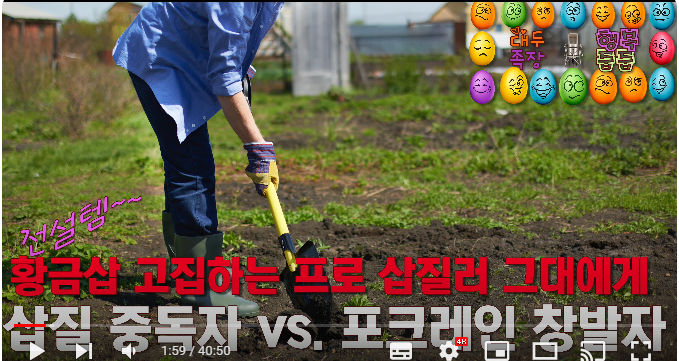

그러니까 오해하지 마셔. 이런 걸 대가리에 다 담고 있을 거다? 아닙니다. 참고를 하는 거예요 다. 지금부터는 프로그래밍 언어는 거의 모른다고 가정을 하고 갈게요. 

인간의 언어랑 달라서 프로그래밍 언어는 단 한 글자도 틀리면 안 돼요. 

> 단 한개의 공백조차 error의 원인이 될 수 있는 거겠죠.

지금 Python 화면이 떠 있는데 이런 걸 볼 거야. 여러분들도 하실 수 있어. 프로그래밍 처음 하시는 분들은 식겁하실지 모르지만 아무것도 아니야. 진짜 아무것도 아니야. 여러분들한테 코딩을 가르쳐 드리진 못해 이제. 나이도 있고 이미 한 번 한 번? 꽤 오래 시도를 했었거든요. 저도 이제 Guido Van Rossum처럼, Programming for everyone.

> 정말 오랫동안 코딩, 프로그래밍을 강조하고 강의해오셨죠. 저는 본격적으로 공부하기 시작한지 얼마 안되었는데, 좋게 보면 저는 최근에야 비로소 '때가 된 것'이고, 안좋게 보면 '그 오랫동안 무관심했던' 겁니다 ㅠ.ㅠ

프로그래밍 코딩은 뭐다? 궁극적인 포크레인이거든요. 무한 포텐 포크레인? 포크레인을 넘어서죠. 어디까지 갈지 모르니까 어제 말씀드렸던 도끼질에서 진화를 해서 전기톱이 나오고 전기톱에서 진화해서 벌목 기계가 나오고 이런 식이듯, 어디까지 갈지 모르는 그런 걸 만들어 낼 수 있는 녀석이니까. 프로그래밍 언어라는 건.

> 이제 인류가 프로그래밍 없이는 살 수가 없게 되었고, 문명 자체가 프로그래밍의 토대에서 쌓여지고 있습니다. 따라서 프로그래밍 언어를 배운다는건 영어를 잘 아는 것 만큼, 아니 그보다 더한 포텐셜이 있다고 생각합니다.

그렇게 생각해 보면 궁극적인 창발적 포크레인이죠. 근데 이걸 안 한다? 제 머리론 이해 안 가는데, 코더로 태어나지 않는 분들이 계시니까 어쩔 수 없지.

근데 안타까운 게 뭐냐면 제 주변에도 계세요 그런 분들이 코딩을 한다면 디지털 노가다라고 생각해. 그런 부모님들이 계셔.

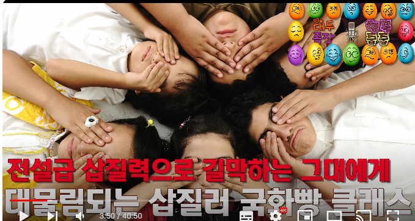

좀 정도가 아니라 그 정도면 제가 뒤통수를 때려주고 싶을 정도로 화가 나거든요. 왜 그럴까요? 자녀를 그렇게 키울 거거든. '어따 대고 디지털 노가다를 배우냐'고 할 거거든. 실제로 그러셔. '디지털 노가다 왜 배우냐'고 하는 분들 계세요. '어차피 그 노가다는 누군가 다른 노가다꾼이 해줄 거다' 라고 생각을 하면서 '코딩 따위를 왜 배우니' 라는 분들이 계셨어. 

근데 그런 분들의 마음을 돌려놓은 게 뭐냐면 마음을 돌려놓은 것도 아니지 착각을 하고 있는 거지. 영어 열풍이 불듯이 코딩 열풍이 분 거야. 저 그거 한 10년 전에 예언을 했거든요. 강남에서 또 그럴 거고 부모라는 분들이, 예전에는 그렇게 노가다라고 생각했던 분들이. 뻔해 속물근성이 나오거든. 오바마가 한마디 했네 코딩이 어쩌고. 그러니까 '저거 해야 되나벼'. 그러더니 아이들을 또 학원을 보내더라고. 코딩을 학원에서 배운다고? 이건 Good Luck도 아니야. 그렇게 해서 배울 수 있는 게 아니야 영어가 아니야 코딩은. coder는 타고 나는데 ***be the best around. be the best version of yourself.***

> 요즘엔 여러 자격증들도 있더라구요. 여러 이유와 필요가 있어서 만들어진 것이겠지만, 코딩을 직접 하지 않고 자격증 공부를 한다면, '창발적 사고'와 '패턴 인식'을 배울 기회를 놓친다는 점에서 중요한 것들을 간과하는 것이 아닐까요.

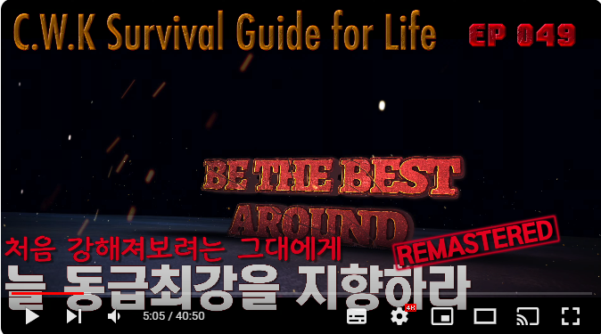

'동급 최강' 마인드로, 코더로 타고나지 않더라도 배워는 둬야 되는 거예요. 세상을 이해하기 위해서도. 구동 엔진이 이따위로 돌아가니까. 오늘 보시면 좀 삘이 살짝 오실 거야. 그런 부모님들은 제가 구원을 못해드려. 그 분이 부모님이건 자녀를 그렇게 삽질러로 키울 부모님이건 아니면 본인 스스로 평생 삽질러로 사실 거건 그 편협한 호라이즌에 갇혀있는 분은 때가 아닌 거라고. 알코올 중독자임을 인정 안 하는 분들이니까. 좀 황당한 프레임이에요, 진짜 그건. 스스로 발목을 잡아놓고 디지털 노가다?

> 저도 스스로 '틀린' 생각과 사고에 갇혀 있는 것은 아닐지 항상 의문을 가지려 하고 걱정을 많이 합니다. 사실, 정도와 범위의 문제일 뿐 어느 정도는 틀려있을 수 밖에 없고, 그걸 알아차리는건 정말 '부단한 노력 + 적절한 계기를 통한 후회'를 통해서만일텐데 - 때가 되었다 - 가끔씩 영원히 깨닫지 못할까봐 무섭습니다. 주기적인 review가 필수인 이유입니다. 그 와중에 저는 자녀가 없어서 그나마 길막할 가능성은 없네요..

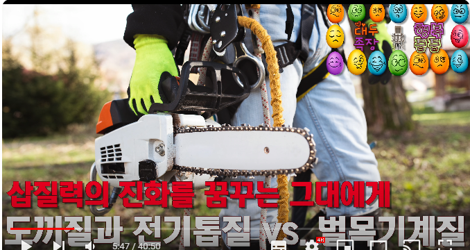

누군가 대신 해줄 거래. 머슴이 짐 들어주는 것처럼, 밭 갈아주는 것처럼, 논 갈아주는 것처럼 그렇게 생각을 하는 거죠. '머슴 쓰면 되지', 뭐 이렇게. 뇌도? 머리를 머슴한테 맡긴다고? 머리 쓰는 거랑은 얘기가 다르죠. 아직도 계세요, 그런 분이. 제 주변에도. 답이 없어. 설득할 방법이 없으니까. 

> 남에게 맡겨도 '되는' 일과, 맡기면 오히려 '손해'인 일이 있을텐데요. 이 때 '손해'의 여부는 항상 '기회비용'의 관점에서 생각해야 하겠습니다. 코딩을 '남에게만' 시키는건 '창발적 사고'와 '패턴 인식'이라는, 자신의 포텐을 만개할 수 있는 기회 자체를 스스로 포기하는 것이기 때문에 반드시 손해라는 말씀이 아닐까요.

다행인 건 그런 분들의 자녀들도 그게 짱구짓인 걸 알아. 요즘은 분위기가 다르니까, 디지털 시대니까. 그리고 그 친구들은 디지털 원주민으로 태어났잖아. 그러니까 비디지털 원주민 부모들이 그런 짱구짓을 하는 걸, 짱구짓이라는 걸 본능적으로 깨닫는 거야. 그래서 쌩까죠. 그리고 지들이 알아서 배워. 특히 코더로 태어난 인간들은. 

그래서 별 걱정은 안 하는데, 그래도 부모들이 지원을 해주는 것과 길막을 하는 건 다르니까. 그런 부모들은 특히 또 길막을 하십니다. 게임도 하지 마라, TV 꺼버리고, 핸드폰 뺏고. 코더로 태어난 아이한테, 핸드폰을 뺏는 거야. 컴퓨터도 못쓰게 하고. 대표적인 길막이거든요. 그렇게 길을 가로막아요. 아이들을 잘 키운다고 하면서, 길을 가로막고 서있어. 돌아버리죠. 

> 자녀가 정말 만개할 포텐의 능력을 갖고 있는데 부모의 좁은 호라이즌과 고집 때문에 길막한다면, 인류와 사회에게도 너무 안타까운 일이 아닐 수 없습니다.

## ***Python을 통해 객체지향성 맛보기***

사설이 길었다. 어쨌든, 이게 Python 코드예요. 아래코드 참조

```python
# 최상위 조상 클래스
class Ancestor:
    
    # 모든 클래스의 공통 method: 객체 instance가 만들어질 때 항상 실행
    def __init__(self, name='', age=1):
        # 속성(property, attribute): 해당 클래스의 공통적인 특징
        self.name = name
        self.age = age

    # method(method): 해당 클래스의 공통적인 행동
    def say_name(self):
        print("My name is {}. I'm {} year(s) old.".format(self.name, self.age))

# 상속성(inheritance): 조상 클래스 속성과 method 전부 상속
class Kid(Ancestor):

    # 자신만의 method 창발
    def dance(self):
        print("{} is dancing.".format(self.name))

# 모든 조상 클래스를 거슬러 올라가며 속성과 method 전부 상속 - 추가 다형성(polymorphism) 없음
class GrandKid(Kid):
    pass
```

Python 코드인데, 제가 왜 Python 코드를 보여드리냐면, 제가 그런 뻘짓하는 부모님들을 보면서도 가슴이 아파서, 오래 전부터, 코딩을 가르쳐보려고 애를 썼었는데, 유튜브에서도 그랬었고, 글로도 했었고, 카페에서도 했었고, 그랬었는데.

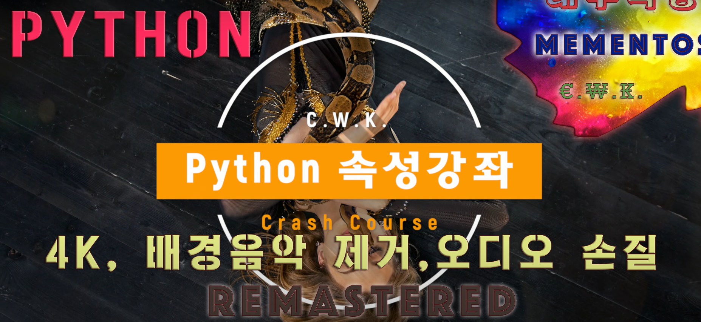

여러 차례 하다가, 대부분은 초급까지는 완성을 했어요, 늘. 유튜브에도 초급 강좌는 있거든요, Python이. 중급하고 고급으로 가지를 못했죠. 

중급쯤에서 Python Decorator 같은 거를 좀 건드리다가, 해달라고 그랬어, 누가. 

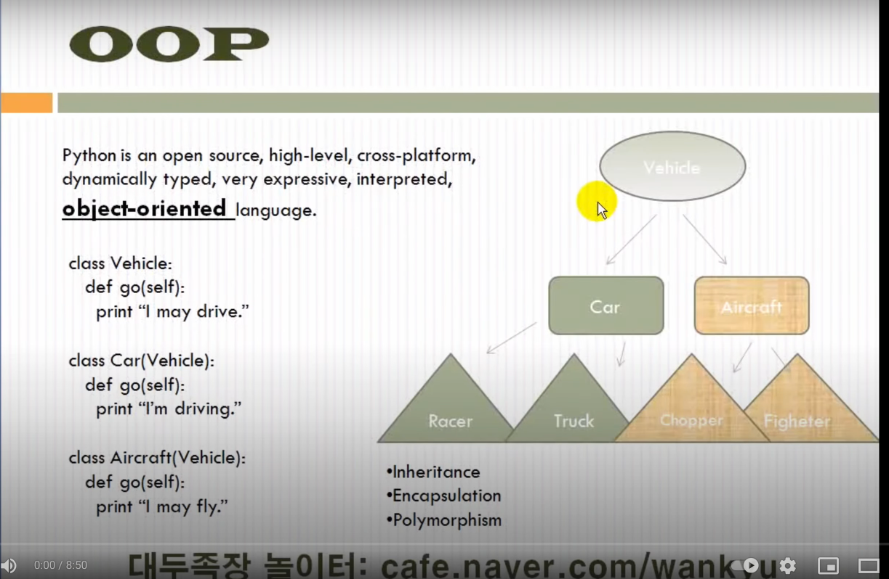

'Decorator 좀 설명해달라'고. Decorator를 설명하면 고급 개념으로 가는 거거든요, decorator 나오고 그러면. 설명해드리고 그러다가, 아무도 안 보더라고. 설명해달라는 사람도 안 보더라고. 그래서, 역시 때가 아니구나. 그리고 이제 저는 연식이 됐으니까, 이렇게 해서는 안 된다. 떠먹여주면 역시. ***Abundance kills the want***. 지금 여러분들도 그런 거 느끼실 거야. 너무, 매일 올라오고, 이 행복줍줍 방송도. 대두족장이 맨날 떠들어주고 그러니까. 뭐, 오늘 안 봐도 내일 볼 수 있고, 모레 볼 수 있고, 그러다 안 봐도 되는 거고, 그런 분위기로 흘러가게 되거든요. 너무 많아지면. 게다가 공짜잖아. 별로 부담 없지? 

> 저 역시 마찬가지입니다. 죄송합니다.

이게 막 제가 한 100만 원쯤? 돈을 받으면서. 소수 정예를 끌고 가는, 일타강사틱하게. 그렇게 하는 방송이어봐. 다들 보시려고 막 발악을 하실걸? 그렇게 하는 format이면 오히려 분위기가 다를걸요. 살벌할걸? 오히려 내가 뭐 안 하면, 방송을 왜 2시간밖에 안 하느냐?🤣 3시간, 4시간은 당연히 해야지. 그럴걸? 편집? 짧게 해달라? 그런 얘기 안 하실걸? ***Abundance kills the want***야. 늘 그래요. 여러분들 대두족장 영어 이야기나, 대두족장 투자병법을 오디오북으로, 오픈소스로 풀면, 왜들 안 보시는 줄 알아? 책으로는, 막 중고로 사기도 하고 그러면서. 뭐 (중고가격이) 5만 원이야? 희소가치가 있으니까 그런지는 모르겠지만. 공짜로 풀려있으니까 안 보는 거야. 제가 뭐 한 번 보는데 한 100만 원 받아봐. '저기 뭐 있나 봐'. 그러면서 오히려 관심들을 가지실걸? 그것도 막 한 달에 한 열분만 보실 수 있다. 이렇게 제한을 두는 거야. 그러면서 100만 원씩 받는 거야.

'이거 옛날 그 "영어공부하러 갑니다"를 리메이크 한 거다' 이러면서. 그러면, 관심 가지실 분들 계실 거야. 

공짜로 풀어서 그래, 공짜로 풀어서. ***Abundance kills the want***라. 늘 거기 있겠지. 영어로 ***taken for granted***라고 해요. 늘 거기 있을 거다. 쉽게 삘오는 대로 말씀드리면, '부모님은 늘 계실 거다'라고 하지만, '부모님은 기다려주지 않는다'라고 하잖아요. 그때 이제 뒤통수를 맞지. '어, 진짜 안 기다려주시는구나' 그러면서. 마찬가지야. ***Abundance kills the want***가 언젠가는, 그 Abundance가 사라지거든요. Scarce해지고, Resource가. 그 때 되면 또, 왜 이게 사라지는지 안타까워하고. 제가 방송, 옛날에 팟캐스트 같은 거 할 때도 그랬거든요. 

> 제가 열일 제쳐놓고 이 프로젝트를 시작한 이유이기도 합니다. 이번에 올려주셨지만 분명 또 어떤 계기로 인해 족장님께서 영상을 내리실 가능성이 높고, 정말 영원히 재업로드를 해주지 않으실 가능성 또한 높은데, '한번 봤던 거니까 알아', '난 이미 알고 있는 내용이야'라고 생각하고 대에추웅 넘어가버리면 너무 많이 후회할 것 같았습니다. 그래서 이렇게라도 정리하는 과정에서 천천히 많이 곱씹을 수 있겠고, 저만의 문서로 남겨두면 언제든 찾아볼 수 있고 리마인드를 할 수 있잖아요. 물론 시간이 많이 걸리긴 하겠죠. 그냥 영상을 열심히 보는 것보다 3-5배 정도의 시간이 더 소요됩니다. 그런데, 그렇게 해서 조금이라도 더 족장님 수십년의 인생 철학과 통찰을 잘 소화할 수 있고 더 체화할 수 있다면? 사실상 3-5배가 아니라 10배의 시간이 걸려도 steal에 가깝다고 생각합니다. 그저 이 프로젝트를 충분히 해내기 전에 그런 똥덩어리들이 족장님을 방해하지 않기를 바랄 뿐입니다.

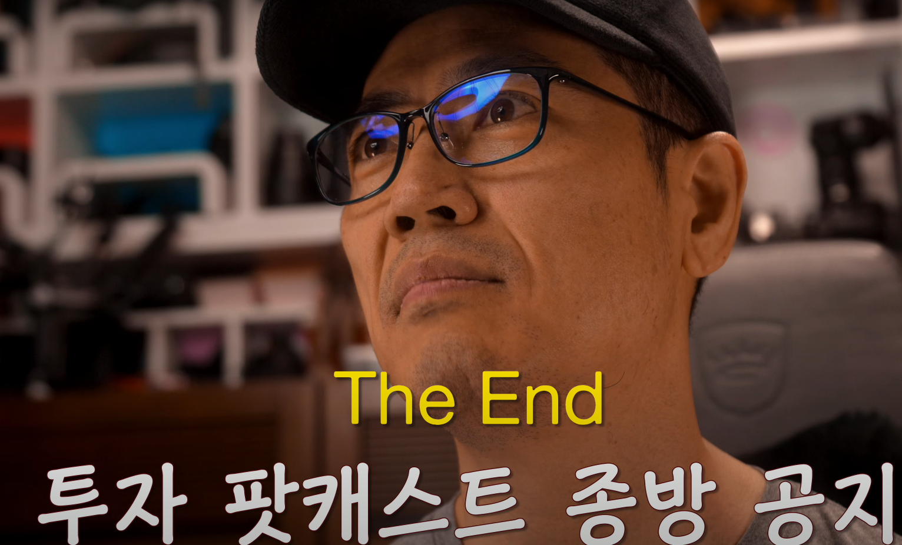

세상에 ***Taken for granted***는 없어요. 당연한 거 없어. 늘 소중한 거야. 아, 또 잔소리하고 있네. 잔소리도 좀 해야지. 그래서 앞으로도 저는 이제 코딩도 그렇고 영어도 그렇고, 강의식으로 할 생각은 없습니다. 그러니까 다시 해달라고는 하지 마시고, 그냥 지금 하듯이 키워드 던져드리고, 연금술사의 마법을 좀 촉매가 될 수 있도록, 콕콕 찔러드리는 게 전부야.

> 영상들이 모두 내려가고, 영원히 올라오지 않는 상황을 생각해보면 영상들의 값어치는 돈으로 환산이 불가합니다. 애초에 이런 가르침과 통찰이 그냥 영상으로 올라와 있다는 것 자체가 사실은 비현실적입니다. 잘근잘근 소화해야겠어요.

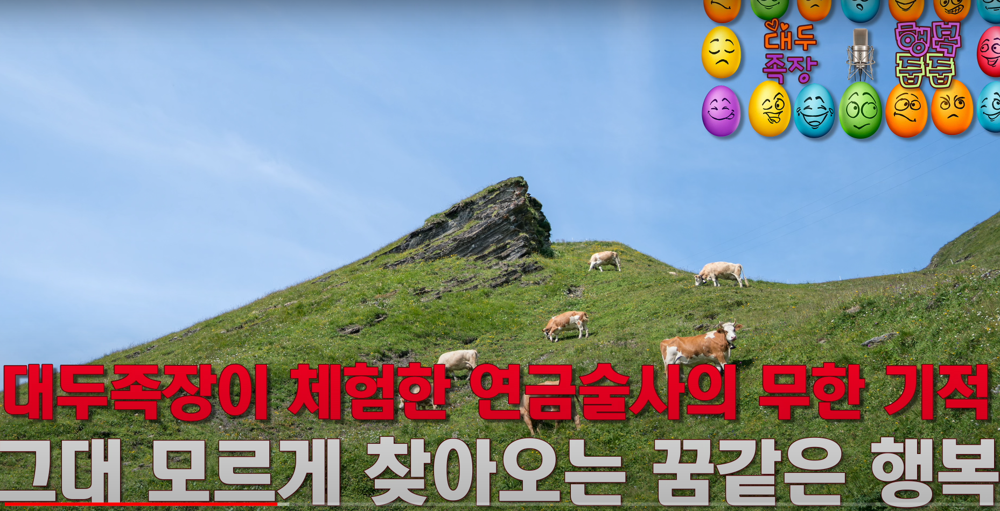

오늘도 그런 걸 보여드리려고 하는 거고, 나머지는 여러분들이 알아서 하셔. 여러분들 인생이니까. 

### ***객체지향성의 3대 축***

객체지향성의 3대 축 다시 짚고 갈게요. 

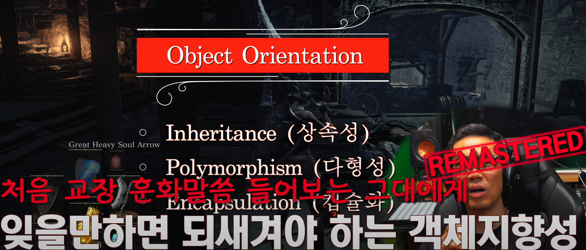

**상속성, Inheritance**. 이건 유전 개념이고, 진화 개념이라고 했어요. 진화해야 하는 겁니다. 

**다형성, Polymorphism**. 자기만의 개성. 진화를 했더라도 후손이 자기만의 개성을 추가하는 거. 그게 다형성이에요. 특히 조금 고급 개념으로 *Overriding*하고 *Overloading*이 있다고 했어요. 이따 보여드릴 거야 실제로. 

Overriding은 상속을 받은 method, 그 행동, 부모의 행동을 덮어 쓸 수 있는 개념을 말하고, Overloading은 부모의 method, 나의 추가된 다형적인 method, 그 **둘 중에 하나를 취사 선택할 수 있는 개념**. 굉장히 중요합니다.

**Encapsulation**은 제가 보여드리진 않을 텐데, 이 소스 코드 자체가 Encapsulation이에요. 블랙박스화, 캡슐화. 세 번째 축이잖아요. Encapsulation은 여러분들이 이런 소스를 볼 필요가 없다는 뜻이야. 소스를 안 봐도 어떤 method와 어떤 property를 가지고 있느냐만 알면 활용을 할 수 있으니까. 아이폰을 interface만으로도 활용할 수 있는 것. 아이폰이든지 이런 드론.

> 기술이 발전할 수록 캡슐화 되는 부분들이 점점 많아지는 것 같습니다.

이것도 interface만 보면 알잖아요. 이거 어떻게 하는지 모르겠어?(드론 리모콘) 딱 보면 아는데? 게임패드 써본 사람은 다 압니다. 버튼 누르는 거고. 이게 어떤 버튼이 어떤 기능에 할당되어 있는지 알면 그 interface만 보는 거 아니야. 이걸 뜯어봐? 호기심에 뜯어볼 순 있어. 망가뜨리지 그럼. 그런 망가뜨리는 걸 방지하고 interface만 알려주는 개념? 그게 캡슐화라고요. Encapsulation. 

### ***클래스, 속성과 method***

늘 세상의 instance들을 보면, 사례들이니까. instance들을 보면 패턴을 끄집어내서 그 패턴으로 세상을 바라보자고 했잖아요. 


그 패턴 덩어리가 뭐다? 클래스인 거고. 늘 최상위 클래스를 끄집어내는 게 우선 할 일이거든요. 그러니까 instance들의 공통분모. 공통분모를 둘로 나눈다고 했죠? ***속성과 method***. 속성은 형용사, 명사. 이런 것들에 해당되는 거. 간단하게 생각하면 **동사에 해당되는 게 method**고 **그 이외의 모든 것이 속성**이라고요. 그것도 보여드릴 겁니다. 그렇게 공통분모를 다 두 개로 나눠볼 수 있는데 속성하고 method로. 

> 어떤 개념이든 - 생명체이든 아니든 - 속성과 method로 나눌 수 있다고 볼 수 있습니다. 어떤 사람의 성격과 행동, 어떤 사상의 특징과 그 사상에서 추구하는 것들, 어떤 물건의 특징과 그 물건의 기능 등등

그 공통분모들을 하나로 뭉치면 쪼물딱 쪼물딱 뭉치면 그게 클래스라는 거죠. 그 때 최상위 클래스는 subclassing을 할 수 있다.

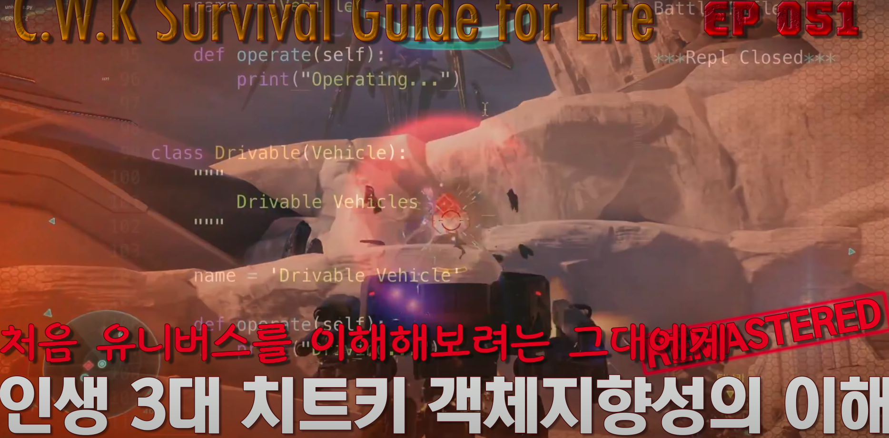
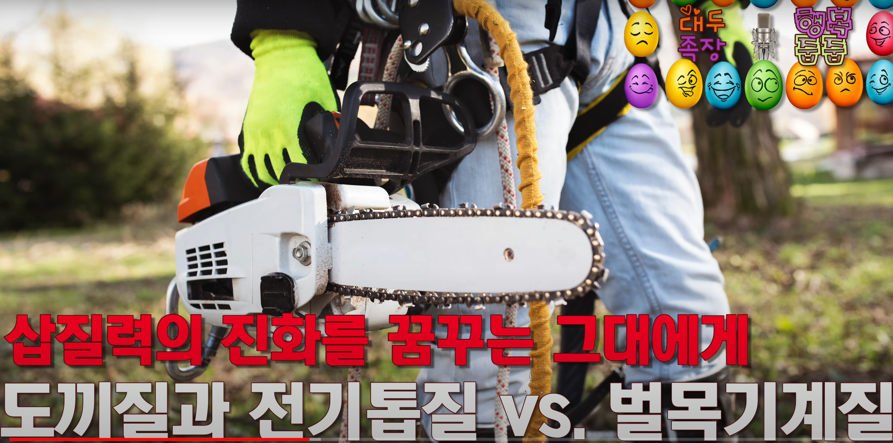

이게 **진화 개념**인 거고. 단백질 덩어리가 최상위 클래스로 진화를 해서 인간이 되잖아. 굉장히 단순하잖아요 단백질 덩어리는. 거기서 이렇게 인간이라는 매우 정교한 sophisticated한 object가 만들어진다고. 진화를 거듭하면서. 그리고 그 진화 단계에 hierarchy, 계층 구조가 생기는데 이 계층 구조가 굉장히 농밀하겠죠? 종속과목강문계. 엄청나게 농밀해지잖아.

> 종속과목강문계라는 분류 체계 역시 인간의 편의를 위해 경계를 만들어놓은 개념이겠지만, hierarchy를 받아들이기에는 아주 좋은 도구입니다. 아메바와 같은 지극히 단순한 단세포가 진화를 거듭하면서 인간이라는 복잡한 존재와 온갖 존재들로 발현되는 과정이 객체지향 그 자체가 아닐까요.

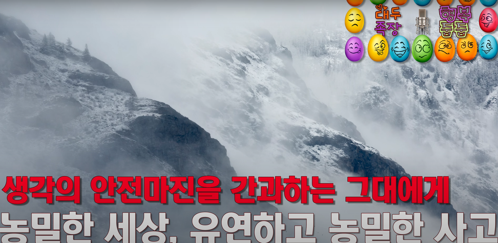

### ***객체의 범위***

거기서 단계들을 밟으니까. 그걸 한눈에 보는 눈. 그게 객체지향적인 시각이에요. object라는 건 뭐다? **생명체**라고. 생명체인데 생명체라고 하면 정말 생명체만 생각하거든 사람들이 있어. 그게 아니라 **세상 만물**을 가리킵니다. 그 세상 만물에 생명성, 생명만의 특징을 부여해서 바라보는 거야. ***이벤트가 됐건 개념이 됐건 살아있다***. 오우, 살아있네.

개념도 상속을 받을 수 있으니까. 그래서 **진화**를 할 수 있으니까. 이벤트도 진화를 할 수 있고. 간단한 이벤트가 다른 이벤트로 진화를 하는데 그 특성을 보고 객체 지향적으로 분류를 해보는 걸 hierarchy를 만들어 보고. 그런 시각인 거예요. 객체 지향성을 또 잘못 배우면 특히 코딩을 안 해보는 사람들.

> 객체라는 개념은, 생명체/비생명체, tangible/intangible, 추상적/구체적, 이벤트, 사상 등 모든 것들을 아우른다는 생각이 정말 놀라운 통찰입니다.

귀로만 듣고 눈으로만 보고 책으로만 배운 사람들은 실제로 안 해보고. 체험을 안 해본거죠. 드론을 '재밌겠다'고만 생각하고 날려보지 않은 사람들은 실수를 해요. '객체 지향적인 게 생명체를 다루는 거래'. 객체 지향적이니까. object oriented니까. '객체 중심적으로 바라보는 거래'. 그러면 생명 어쩌고 이러니까. 진화 어쩌고 이러니까. 살아있는 것만 본다고. 

> 코딩이야말로 가장 '체험 지향적'으로 배워야하는 분야가 아닐까 합니다.

제가 여러분들한테 이런 얘기를 했을 때도 많은 분들이 살아있는 거에서만 패턴을 찾으려고 연습을 해보려고 하셨을 거라고. 사람, 동물. 쉬우니까 그게. 거기서 조금만 더 발전하면, 예컨대 자동차도 할 수 있잖아요. 그건 생명체가 아니잖아. 그런데도 활용을 해볼 수 있거든. **생명체적인 특징을 보여주니까**. 근데 그것도 마찬가지야. 이게 삽질러에서 프로 삽질러로 갔을 뿐이야. 패턴을 그렇게만 봤으면. 

> 만물을 객체화해서 바라보는 습관을 들여야겠습니다.

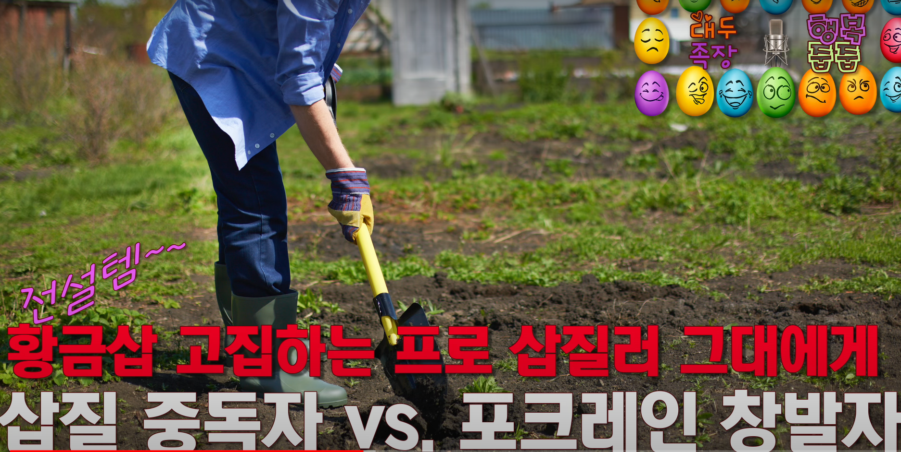

왜냐면 자동차들도 언뜻 애니메이션에서 자동차가 말을 할 수 있듯이 약간 눈으로 보이고 몸체로 보이고 쉽거든. 

근데 시장 이벤트. 주식시장. 이러고 들어가면 헷갈리실걸. 

댓글 같은 것도 전부 object야. 내 눈엔 다 object로 보여요. 동영상? object입니다. 댓글? object입니다. 게시판? object입니다. 게시판 글? object입니다. 그거 구분해보셔. 클래스화해서 하실 수 있는 가. 세상 만물이라니까. 세상 만물. 개념을 포함한 세상 만물.

> 법률에도 판덱텐 체계(Pandekten system)라는 것이 있습니다. 원래 '판덱텐'이라는 용어는 로마법 대전을 일컫는 말인 것으로 알고 있습니다. 그리고 그 로마법 대전의 구성 방식을 '판덱텐 체계'라고 일컫는 것이죠. 이 '판덱텐 체계'가 객체지향의 기본원리를 아주 충실히 따르고 있습니다.  간단히 '총칙' - '각칙' 구성이라고도 하는데, 민법을 예로 든다면 '물권', '채권'에서 공통되는 것들만 추출하여 '민법 총칙'에 모아놓고, '물권' 안에서도 '물권 총칙'이 존재하며 '물권' 안에는 '소유권', '저당권', '전세권' 등등이 다형성을 뽐내며 존재하는 식입니다. '채권' 안에도 '채권 총칙'과 '채권 각칙'이 존재하구요. 법률은 사람들 사이의 권리 의무 관계를 규율하기 위해 만들어진 것이고, 공통 요소들을 추상화하여 끄집어 내어 '총칙'에 몰아넣고, 하위 개념들은 저마다의 다형성이 붙어 개성이 발현되고 있다고 생각하면 '객체지향'과도 일맥상통한다고 볼 수 있겠습니다. 법률의 추상적인 권리 의무 관계와 그 개념들까지 '객체지향'으로 설명된다면 우주 만물의 모든 개념을 아우른다고 보는 생각은 참으로 합당합니다.

그렇게 보셔야 돼요. 그래도 여러분들이 쉽게 이해를 해야 하니까 

### ***Python 코드 살펴보기***

오늘은 얘를 생명체로 들 거예요. 사람으로. 그래서 최상위 조상 클래스가 있어요. 아래코드 참조

```python
# coding=utf-8

# 최상위 조상 클래스
class Ancestor:
    
    # 모든 클래스의 공통 method: 객체 instance가 만들어질 때 항상 실행
    def __init__(self, name='', age=1):
        # 속성(property, attribute): 해당 클래스의 공통적인 특징
        self.name = name
        self.age = age

    # method(method): 해당 클래스의 공통적인 행동
    def say_name(self):
        print("My name is {}. I'm {} year(s) old.".format(self.name, self.age))

# 상속성(inheritance): 조상 클래스 속성과 method 전부 상속
class Kid(Ancestor):

    # 자신만의 method 창발
    def dance(self):
        print("{} is dancing.".format(self.name))

# 모든 조상 클래스를 거슬러 올라가며 속성과 method 전부 상속 - 추가 다형성(polymorphism) 없음
class GrandKid(Kid):
    pass
```

어우 이렇게 친절하게 제가 한글로 주석을 달아드렸습니다. 소스코드가 됐든 뭐가 됐든 코딩에 한글이 굉장히 친화적이지 않아. 한글 때문에 개고생들을 많이 합니다.

> 다른 분야들도 그렇지만, 유독 컴퓨터 분야가 영어를 직역한 개념들, 외래어들이 많은 것 같습니다. 괜히 족장님께서 '한글 때문에 나중에는 개고생들을 하니까 처음부터 영어로 배워라'라고 말씀하시는 것이 아닌듯 합니다.

그래서 소스코드에 한글 쓰는 걸 정말 싫어해요. 한글을 싫어해서가 아니고. 컴퓨터는 싫어해. ***컴퓨터가 한글을 싫어해***. 그래서 위에 이런 짓을 해줘야 하거든요. 코딩, `utf-8` 뭐 이런 게 있어요. encoding 말하는 겁니다. '한글을 사용할 거'라는 뜻이야. 저렇게 해야 한글인 경우에 문제가 안 생기고 실행이 돼요. 그래서 원래 저는 주석을 달아도 영어로 다는데 그게 편하니까. 문제가 안 생기니까. 여러분들을 위해서 지금 한글로 달아드린 거야. 어마무시한 애정을 느끼면서 한글로 달아드린 거야. 정말 하기 싫은데.

> 영어의 중요성은 정말 아무리 강조해도 지나침이 없는 것 같습니다.

어쨌든 최상위 조상 클래스입니다. Python에서 클래스를 만드는 방법이에요.

```python
# 최상위 조상 클래스
class Ancestor:
    
    # 모든 클래스의 공통 method: 객체 instance가 만들어질 때 항상 실행
    def __init__(self, name='', age=1):
        # 속성(property, attribute): 해당 클래스의 공통적인 특징
        self.name = name
        self.age = age

    # method(method): 해당 클래스의 공통적인 행동
    def say_name(self):
        print("My name is {}. I'm {} year(s) old.".format(self.name, self.age))
```

'클래스를 선언한다'고 그러는데. 정의한다고 그러는데. 클래스를 만드는 방법이에요. 그리고 블럭으로 처리가 돼 있죠. 들여쓰기를 하잖아요. 그럼 여기서부터 여기까지가 **클래스 정의**라는 뜻이에요. 이게 method 정의고. 그래서 들여쓰기를 한 부분이 있으면 이게 한 블럭인 거야. 얘가 바깥 블럭인 거고. 바깥 블럭인 거고. 들여쓰기를 한 번 했으니까 안쪽 블럭인 거죠. 

이건 `init()` method 블럭이라고 하는 거고. 아래코드 참조

```python
    def __init__(self, name='', age=1):
        # 속성(property, attribute): 해당 클래스의 공통적인 특징
        self.name = name
        self.age = age
```

이건 `say name()` method 블럭이라고 하는 거죠. 아래코드 참조

```python
    def say_name(self):
        print("My name is {}. I'm {} year(s) old.".format(self.name, self.age))
```

한눈에 보이죠? Python이 소스가 깔끔해요. 들여쓰기 해주는 엄격하게 지켜줘야 돼. 블럭별로. 지난 시간하고 지지난 시간에 C 언어 보셨잖아. 그거 꼴리는 대로거든요. 들여쓰기도 필요 없고. 아래코드 참조

```C
#include <studio.h>

int main() {
    int i;

    for(i=0; i < 10; i++) {
        printf("대두족장 뺑뺑이: %d\n", i);
    }
    return 0;
}
```

그냥 블럭을 curly bracket이라고 하는 거(`{}`). 대괄호나 이런 걸로 잡아주거든. 그래서 아주 지저분해집니다. 소스 코드가. 언뜻 Python 배울 때 '뭘 이런 식으로 엄격하게 하나'. 옛날 Fortran 생각하시는 분들도 계신데 Fortran은 못 보셨겠지만 오래된 코더면 그런 걸 생각하실 수도 있는데 그거랑은 차원이 다른 얘기고.

(파이썬은) 그냥 소스 코드를 짜면서, 코딩을 하면서 정리가 돼. 깔끔하게 한눈에 보이잖아. '들여쓰기를 한다'는 게 굉장히 콜럼버스 달걀적인 아이디어였어요. Guido Van Rossum이. 이런 데서 천재성을 느껴. 레알 천재성을. 

`Ancestor`라는 클래스를 지금 정의를 했어요. 아래코드 참조

```python
# 최상위 조상 클래스
class Ancestor:
    
    # 모든 클래스의 공통 method: 객체 instance가 만들어질 때 항상 실행
    def __init__(self, name='', age=1):
        # 속성(property, attribute): 해당 클래스의 공통적인 특징
        self.name = name
        self.age = age

    # method(method): 해당 클래스의 공통적인 행동
    def say_name(self):
        print("My name is {}. I'm {} year(s) old.".format(self.name, self.age))
```

Homo Sapiens면 코딩을 안 하셔도 조금은 삘이 오셔야 돼. 클래스를 저렇게 정의를 했다. 이름은 `Ancestor`다. 클래스 `Ancestor`다. 그리고 `def`는 definition의 약자입니다. 다른 언어라면 function이나 뭐 이런 말이나 같아요. definition을 줄인 거야. `def`라는 게 두 개 있잖아요. 함수를 선언한다는 거거든요. 함수를 정의한다는 건데 클래스에서는 그 함수를 뭐라고 한다? method라고 해요. c언어는 객체지향 언어가 아니니까 거기서 진화한 c++ 언어가 객체지향 언어거든요. 거기서는 `member function`이라고 해요. 이름만 다르고 하는 짓은 같아요. 

Python에서는 method라고 합니다. 그래서 `init` method, `say_name` method라고 하는 거예요. `init` method는 여기도 친절하게 주석을 달아드렸죠. `# 모든 클래스의 공통 method`예요. 객체 instance가 만들어질 때 항상 실행된다. 이 밑에 내려가면 이게 객체 instance를 만드는 거거든요. 아래코드 참조

```python
    obj1 = Ancestor("Sam", 60)
    obj2 = Kid("Tom")
    obj3 = GrandKid("Sally", 10)
    obj4 = GrandGrandKid("대두족장", 50)

    obj1.say_name()
    obj2.say_name()
    obj3.say_name()
    obj4.say_name()

    # obj1.dance()
    obj2.dance()
    obj3.dance()
    obj4.dance()
    obj4.dance("Bebop")
```

`obj1 = Ancestor`, `Sam`, `60` 이런 식으로 괄호 안에 집어넣어 주는 걸 매개변수라고 하고요. 넘겨줄 때는 매개변수 parameter. 넘겨받을 때는 argument 인자. 관점만 달라지는데 이건 코딩하시는 분들한테나 의미 있는 얘기고. 어쨌든 뭔가 변수 값을 넘겨줘요. 그걸 내가 지정을 해서 그럼 `Ancestor`로 넘어갔잖아. 그럼 이제 `Ancestor`가 만들어질 때 얘가 실행이 된다고. 아래코드 참조

```python
    def __init__(self, name='', age=1):
        # 속성(property, attribute): 해당 클래스의 공통적인 특징
        self.name = name
        self.age = age
```

태어날 때 이 국화빵 거푸집 클래스, `Ancestor` 거푸집에서 `obj1`이라는 국화빵이 찍혀 나올 때 반드시 실행이 됩니다. 그래서 `init`야. initialize잖아요. 초기화를 하는 거라고. 태어날 때 뭐를 하냐? 기본적인 default 속성 값을 지정을 해줄 수 있어요. 그 default 속성 값이 뭐야? 이름. 이름 넘겨줬잖아. 대두족장이면 대두족장. `age` 넘겨줬잖아. 나이. 50살이면 50살. 반백이니까. 이렇게 넘겨줄 수 있잖아요. 안 넘겨줬다? 이게 기본 값입니다(`age=1`). 안 넘겨줬을 때는 이름은 없는 거고(`name=''`) '안 넘겨줬을 때는 1살부터 시작한다'는 뜻이죠. 그래서 속성을 property 또는 attribute라고 하는데 해당 클래스의 공통적인 특징이다. 왜? 태어날 때 속성이 지정이 되니까. `name`, `age` 같은 게 속성이에요. 아래코드 참조

```python
        self.name = name
        self.age = age
```

dot(`.`). 이건 dot notation이라고 하는데 `self`잖아. 앞으로 만들어질 object instance를 가리키는 거고 거기에 속성을 지정을 할 때 dot notation이라는 걸 써요. 

그래서 밑에도 보면 method를 지정할 때도 괄호가 들어가니까 method를 지정하는 거거든요. 아래코드 참조

```python
    obj1.say_name()
    obj2.say_name()
    obj3.say_name()
    obj4.say_name()
```
 
여기서 object1에 `say_name()`이라는 method를 가리키는 거다. 그래서 dot notation을 쓰는 겁니다. 대충만 이해하시면 돼. 다 못 알아들으셔도 돼요. 

그래서 `init()` method가 그런 식으로 실행이 되는 거고 최상위 조상 클래스니까 여기서 상속받는 모든 클래스, subclassing되는 모든 클래스가 다 상속을 받는 거예요. `say_name()`이라는 method도 그렇게 상속을 받을 겁니다. 

method, 해당 클래스의 공통적인 행동이잖아요. 그래서 `say_name()`이라는 method, '네 이름이 뭐야' 라고 물었을 때 이 `Ancestor` 국화빵 거푸집에서 찍혀 나오는 모든 국화빵들은 자기 이름을 얘기할 수 있어요. 아래코드 참조

```python
    # method(method): 해당 클래스의 공통적인 행동
    def say_name(self):
        print("My name is {}. I'm {} year(s) old.".format(self.name, self.age))
```

그걸 내가 정의해주면 되는 거야. creator인 내가. 이 universe를 내가 만드는 거니까. 내가 조물주니까. '`My name is {}`입니다. `I'm {}` 살입니다.' 라고 얘기를 할 수 있다는 거죠. 그리고 거기에 순서대로 들어가는 거예요. `my name is`, `name`, property, 속성 그리고 `I'm ten years old`, `one year old`일 수 있으니까 이렇게 쓴 거고. 그래서 `age`라는 속성을 대체할 수 있는 거고. 나중에 실행해서 보여드리면 알겠죠. 

자, 봅시다. 그리고 상속을 받습니다. 이게 subclassing을 하는 거예요. subclassing. 아래코드 참조

```python
# 상속성(inheritance): 조상 클래스 속성과 method 전부 상속
class Kid(Ancestor):

    # 자신만의 method 창발
    def dance(self):
        print("{} is dancing.".format(self.name))

# 모든 조상 클래스를 거슬러 올라가며 속성과 method 전부 상속 - 추가 다형성(polymorphism) 없음
class GrandKid(Kid):
    pass
```

진화를 하잖아요. 어떻게 진화를 했냐면 `Ancestor`를 상속받습니다. 그래서 `Kid`라는 클래스는 그 후손 클래스가 되니까 상속을 받아요. 뭘 상속받았어요? 여기에는 없잖아. 

위로 올라가보면 `init()` method 상속받았죠. 이건 새로 코드를 쓸 필요가 없이 받아서 퉁치고 넘어간다고.

그러면서 `say_name()` method도 날로 먹었죠. 그래서 안써줬잖아. 이렇게 상속을 받는 코드 한 줄을 써주면 이게 상속을 받는 방법이거든요. 괄호 치고 자기 조상을 써주면 돼(`class Kid(Ancestor):`). 클래스 선언할 때 만약 이렇게 선언을 해주면 이건 그냥 날로 먹는 겁니다. 

여기에 100만 줄이 있었다고 하더라도 코딩 라인이 그 모든 속성과 method를 날로 먹는다. 전율해야 돼 이럴 때. 

그러면서 뭘 한다? 조상 클래스의 속성과 method 전부 상속해서 먹었잖아. 근데 진화를 하려면 창발을 해야지. 자기만의 method를. 자기만의 method를 창발 못할 거다? 도끼질러가 프로 도끼질러가 될 거다? 그러면 상속받을 이유가 없겠죠.


그럴거면 그냥 속성 값만 바꿔주면 돼. 넘겨주는 값만 바꾸면 돼 그러면. 저게 변수니까 어차피. +1 짜리 무기를 들고 있었으면 +3이라고 바꿔주면 되는 거라고. 뭐하러 진화를 해 그게. 그런건 진화의 개념이 필요 없는 거라니까. 그래서 일곱 가지 습관에 나오는 그 말이 의미가 없는 얘기라고.  '도끼나 톱의 날을 갈아야 한다'고? 의미가 없다니깐요.

이제 삘이 좀 오실 거야. 이 과정이 필요가 없다고. 그러니까 `Ancestor`에서 `Kid`가 '진화를 해서 상속받는 과정이 필요가 없다'는 뜻이야. 삽질러가, 프로 삽질러가 되는 건. 변수 값만 바꿔주면 돼. age가 한 살이 아니라 50살이다. 이 변수만 바뀌는 거야. property 값만. 아니면 method에 넘겨주는 변수 값만. '내 이름은 삽질러가 아니고 프로 삽질러다'. 

***그 짓을 하는 게 진화로 보이세요?***

> '인간은 모두 '진화'를 해야할 의무가 있다'는 수준까지 생각하면 더 와닿는 말씀입니다.

이런 의미입니다. 코딩을 하는 인간한테는 진화로 안 보이거든. 그러면 'Kid'가 태어난 이유가 있을 거 아니야? subclassing을 하는 이유가 있을 거 아니야? 진화한 이유가. **자신만의 개성을 추구하고 싶어서 하는 거거든요**.

> 자신의 개성은 무엇인지, 자신은 진화를 하고 있는지 같은지 같은 것들을 생각해보게 됩니다.

그래서 얘는 춤을 출 수 있네? 자신만의 method를 창발한 거잖아. 아래코드 참조

```python
# 상속성(inheritance): 조상 클래스 속성과 method 전부 상속
class Kid(Ancestor):

    # 자신만의 method 창발
    def dance(self):
        print("{} is dancing.".format(self.name))
```

이것도 백만 개가 됐든 천만 개가 됐든 자신만의 method, 자신만의 개성을 창발할 수 있는 거라고. 그럼 얘는 뭐야? `Kid`는? 포크레인 창발자겠죠. 그래서 춤을 출 수 있어요. 

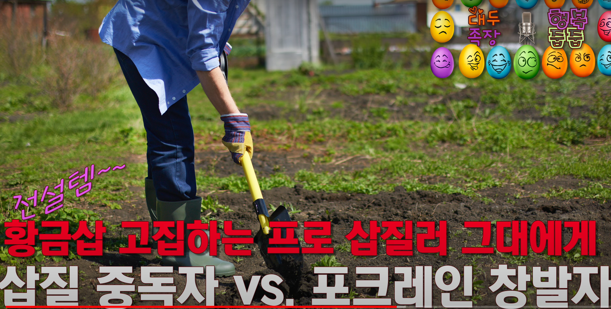

그리고 `GrandKid`가 생겼죠? 모든 조상 클래스를 거슬러 올라가면서 속성이랑 method를 전부 상속합니다. 아래코드 참조

```python
# 모든 조상 클래스를 거슬러 올라가며 속성과 메솓 전부 상속 - 추가 다형성(polymorphism) 없음

class GrandKid(Kid):
    pass

# 모든 조상 클래스를 날로 먹지만 자신만의 다형성 추가
# 오버라이딩(overriding): 조상 메소드를 덮어씀
# 오버로딩(overloading): 조상 메소드와 자신의 메소드를 런타임(runtime - 실시간)에 취사선택함
class GrandGrandKid(GrandKid):

    # dance_type이 주어지면 그 춤에 맞춰 춤을 추는 개성 발휘
    # dance_type이 주어지지 않으면 조상 클래스 메소드 그대로 막춤을 춤
    def dance(self, dance_type=''):
        if dance_type == '':
            GrandKid.dance(self)
        else:
            print("{} is dancing to {}.".format(self.name, dance_type))
```

**날먹을 하는 거죠**. 추가 다형성, polymorphism이 아예 필요가 없어. 그렇게 살 거면. `GrandKid`는 pass잖아. 이건 Python에서 무슨 뜻이냐면 '블럭을 지정을 하고 코딩을 할 게 없다'는 뜻이야. '넘어가라'는 뜻이에요. 

> '자식은 부모를 닮는다'는 말보다도 가정교육의 중요성을 절감할 수 있는 말씀이 아닐까 합니다.

***사실상 `Grand Kid`는 존재 이유가 없어. 왜? `Kid`랑 다를 게 없잖아***. **얘는 지금 존재 이유가 없는데 진화하는 척만 하는 거야**. 얘가 뭐다? 프로 삽질러. 진화하는 척만 하고 패스하잖아.

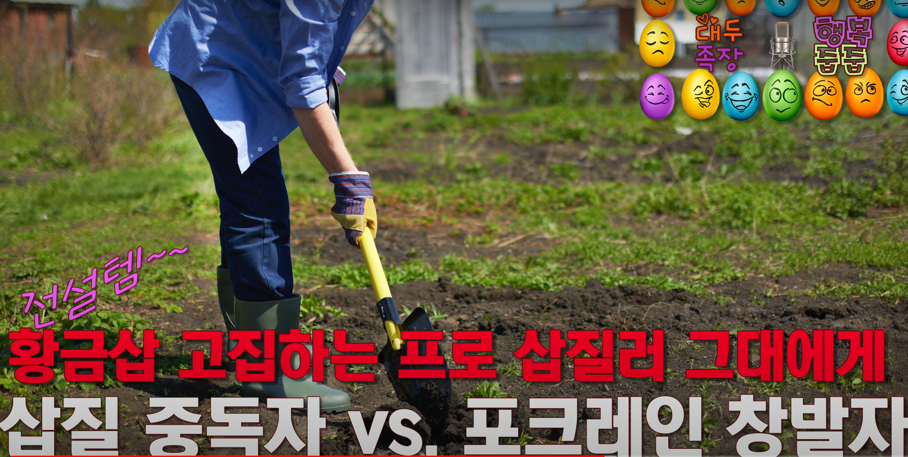

아무것도 안 해. `Kid`랑 똑같아 하는 짓이. 아무 다형성이 없으니까 프로 삽질러입니다. 자기 이름만 바꾸거나 변수값만 바꿔서 나이만 처먹는 거야. 자기 이름만 바꾸거나 변수값만 바꿔서 `age` 속성 바꿔서 나이만 먹는 거야, 나이만. 아무 창발을 하지 않아. 이게 여러분 보이셔야 돼. 프로 삽질러 여러분. passing하고 있는 거야. 시간만 passing passing passing passing. 그렇게 빠삐용의 삶을 사는 겁니다. 

> 빠삐용의 죄는 시간을 낭비한 것이죠. 시간, 시간, 시간. 그 무엇보다도 귀한 것! 뭔가를 배우거나 익히기 위해 시간을 절약하기 위한 방법부터 생각하면서 최대한 빠르게 가려고 하지만, 알고 보면 그렇게 하는 것이 시간을 낭비하는 것이라는 것을 알게 되는 경우가 많습니다. 그걸 촌철살인의 비유로 말씀하신 것이라고 이해했습니다.


그러면 창발자를 볼게요. 모든 조상 클래스를 날로 먹지만 자신만의 다형성을 추가하는 창발자. 아래 코드 참조

```python
# 모든 조상 클래스를 날로 먹지만 자신만의 다형성 추가
# 오버라이딩(overriding): 조상 메소드를 덮어씀
# 오버로딩(overloading): 조상 메소드와 자신의 메소드를 런타임(runtime - 실시간)에 취사선택함
class GrandGrandKid(GrandKid):

    # dance_type이 주어지면 그 춤에 맞춰 춤을 추는 개성 발휘
    # dance_type이 주어지지 않으면 조상 클래스 메소드 그대로 막춤을 춤
    def dance(self, dance_type=''):
        if dance_type == '':
            GrandKid.dance(self)
        else:
            print("{} is dancing to {}.".format(self.name, dance_type))
```

Overriding도 합니다. 조상 method를 덮어 쓸 수 있고요. overloading도 합니다. 오버롤딩이 아니에요. L O R D 롤딩이 아닙니다. 군주틱한 짓을 한다는 뜻이 아니야. Overloading이야. Load할 때 선택적으로, '취사 선택적으로 Load할 수 있다'는 뜻이야. 조상 method와 자신의 method를 runtime, 살아가면서 실시간에.

이걸 컴쟁이 용어로, 컴퓨터 프로그램이 실행될 때는 runtime이라고 해요. '실시간에 취사선택할 수 있다'고. 그런 창발자, 포크레인 창발자가 `GrandGrandKid`야. 

근데 조상은 또 `GrandKid`잖아요. 날먹을 했던 프로 삽질러. 프로 삽질러를 상속을 받아서도 창발자가 될 수 있다고. 왜? 프로 삽질러의 조상이 `Kid`고 더 거슬러 올라가면 `Ancestor`니까. 모든 조상을 다 먹고 들어가는 거니까. 

> 애니메이션 진격의 거인이 생각나네요. 한 거인이 다른 거인을 '먹으면' 먹힌 거인의 능력을 승계, 상속 받죠. 거인의 특성상 수명이 매우 짧기 때문에 아주 특수하고 희귀한 거인의 능력이 소멸되거나 randomly 자격없는 사람에게 가지 않도록 전사를 선택하고 육성해서, 선별된 자로 하여금 특수한 거인 능력을 계속 승계시키는 내용이 나오죠.

그래서 자기 조상, 직계 조상이 프로 삽질러였다고 하더라도 `GrandGrandKid`는 포크레인 창발자가 될 수 있는 겁니다. 언제든지. 이것도 '태어났으니까 못 바꾼다'. 뭐 그런 클래스도 있다고 했잖아요. 근데 이렇게 바꿀 수 있는 클래스도 있다고. runtime에 실시간으로 바꿀 수 있는 클래스. 그걸 옮겨가시라고. 이 친구가 어떤 개성이 있냐면 댄스가 달라졌어요. 아래코드 참조

```python
class GrandGrandKid(GrandKid):

    # dance_type이 주어지면 그 춤에 맞춰 춤을 추는 개성 발휘
    # dance_type이 주어지지 않으면 조상 클래스 메소드 그대로 막춤을 춤
    def dance(self, dance_type=''):
        if dance_type == '':
            GrandKid.dance(self)
        else:
            print("{} is dancing to {}.".format(self.name, dance_type))
```

춤을 다양하게 출 수 있어. 지금까지는 막춤을 췄거든. `dance_type`이라는 게 주어지는 거야.**그러면 그 춤에 맞춰서 춤을 추는 개성을 발휘할 수 있는 거**야. 포크레인 창발자죠. `dance_type`이 주어지지 않는다? 그럼 막춤을 춰. 조상 클래스에 있는 method 그대로 가져다가. `if else`문으로 나눠져 있잖아요. `dance_type`이 주어지지 않았어. 그럼 default 값이라는 뜻이잖아.

> 이렇게 간단한 코드에서도 통찰을 느끼시는 족장님의 모습에서 저는 천재성을 느낍니다. '통찰은 어디에나 널려있다'는 말을 하실 자격이 있는 분이라고 생각됩니다.

그러면 프로 삽질러 `GrandKid`의 댄스 method를 호출해서 막 춤을 춥니다. 근데 `dance_type`이 주어졌다? `else`잖아. 나는 어떤 `dance_type`에 맞춰서 춤을 추고 있다. `I am dancing to bebop`. `I am dancing to heavy metal`. 이렇게 할 수 있는 거죠. 'heavy metal 들으면서 춤을 추고 있다.' 

이럴 때 영어로 to 전치사를 써서 말을 합니다. 방향성이잖아요. 음악이 여기 있으면 여기서 음악이 흘러나오고 있으면 그 음악에 맞춰서 춤을 추는 거니까. `I am dancing to this music`. 이런 식으로 하는 거예요. 

여기서 살짝 음란마귀 말씀드릴게. 음란마귀. 포맷이 똑같아. 어떤 사진을 보고 음란질을 하잖아. 그러면 'I am jerking off to' 그렇게 하면 돼. 사진이나 영상을 to 다음에 넣으면 되는 거야. 그런 걸 영어쟁이는 그냥 그렇게 한눈에 알 수 있어. 'I am dancing to heavy metal'. 'He is jerking off to' 그렇게 할 수도 있어요. 이런 걸 갖고 기겁하지 마. 말은 그렇게 배우는 거야. 안 까먹어 그러면. 

> 네 절대 안까먹을 것 같습니다🤣

그렇습니다. 개성이 부여됐죠😂 이런 거 할 때 애들이랑 보지 마. 내가 자꾸 머릿속으로 검열하게 돼. 이거 애들이 보는 거 아니야. 애들은 모르나? 나중에 알게 될 텐데.

`GrandGrandKid`는 어쨌든 자기만의 개성이 주어졌죠. 여기서 삘이 확 와야 되는데 혹시라도 Python 코딩을 하시는 분이 보시면 단번에 아실 텐데 Python에는 overloading 개념이 없습니다. 

overloading을 쓰려면 살짝 우회해서 써야 돼(`def dance(self, dance_type=''`) 이건 좀 고급 개념이에요. Python에는 overloading을 built-in으로 지원하지 않아요. 그렇기 때문에 이런 식으로 쓰든가 다른 패키지를 쓰든가 그래야 하거든요. `Decorator`를 쓰든가. 그러면 골 때려지죠. 기본적으로 Python이 지원하지 않는 이유가 있거든. 거기에 맞췄으니까 이런 식으로 만들었을 수 있으니까 굳이 그렇게 쓰지 말라는 거지. 

C++ 같은 데서는 함수 signature 갖고 만들 수 있는 거잖아요. 이건 고급 코더들한테 하는 얘기에요. C++ 같은 데서는 signature 가지고 취사 선택할 수 있잖아요. 

근데 Python에선 그걸 지원 안 한다고. 그래서 우회해서 쓰거나, 쓰지 말아야 하는 거야. '다른 방법으로 할 수 있는데 굳이 왜 그렇게 하느냐'는 거거든. Guido Van Rossum과 그 커뮤니티들께서. 

왜냐하면 **Python은 method도 attribute거든요**. 그래서 동일한 이름의 method가 존재할 수가 없어요. 속성하고 method를 하나로 퉁치기 때문에 원래 설계 자체가 그렇게 되어 있기 때문이에요. 여기까지가 고급 코더들을 위한 얘기고. 모르셔도 돼. 일반적인 분들은. 

어쨌든 `GrandGrandKid`는 자기만의 개성이 있잖아요. 이 부분은 무시하세요(`if __name__ == '__main__':`). `if name`은 뭐 이건 Python의 특징이기 때문에. 이 클래스들을 만들어서 이 클래스들을 가지고 object instance 국화빵을 찍어내서 실행을 하기 위한 부분이에요. 또 블럭이 이렇게 지정이 되어 있잖아요. 이게 실행되는 부분입니다. 아래코드 참조

```python
if __name__ == '__main__':

    obj1 = Ancestor("Sam", 60)
    obj2 = Kid("Tom")
    obj3 = GrandKid("Sally", 10)
    obj4 = GrandGrandKid("대두족장", 50)

    obj1.say_name()
    obj2.say_name()
    obj3.say_name()
    obj4.say_name()

    # obj1.dance()
    obj2.dance()
    obj3.dance()
    obj4.dance()
    obj4.dance("Bebop")
```

지금까지의 코드들로는 내가 blue print를 만든 거고. 청사진을. 국화빵 거푸집이 이렇게 생겼다는 것만 보여준 거야. 이게 공통분모들인 거거든. 이 hierarchy에. 종속과목강문계. 그런 거 생각하시면 된다고. 진화 hierarchy인 거예요. 거기서 이제 실행을 시켜볼게요.

`obj1 = Ancestor, obj2 = Kid, obj3 = GrandKid, obj4 = GrandGrandKid` 

그리고 이름하고 나이를 주고 있죠. Kid는 이름만 주고 나이를 안 줬죠. 나이를 안 주면 어떻게 된다? 한 살입니다. default 값. 그리고 나머지는 이름을 줬어요. 그러면 이 부분만 실행이 되는 걸 볼게요. 아래 아웃풋 참조

```
My name is Sam. I'm 60 year(s) old.
My name is Tom. I'm 1 years(s) old.
My nmae is Sally. I'm 10 year(s) old.
My nmae is 대두족장. I'm 50 year(s) old.
```

이렇게 실행이 되죠. 여기는 이해하기 쉽죠. 국화빵 거푸집 클래스에서 object instance가 하나 둘 셋 넷 만들어지는 거예요. 

그런데 이게 hierarchy였잖아. `Ancestor`, `Kid`, `Grand Kid`, `GrandGrandKid` 내가 선택적으로 상속을 받을 수 있다고. 내가 선택적으로 출발할 출발점을 지정을 할 수 있는 거야. 어느 조상한테 속성하고 method 블루프린트를 받을지 지정을 할 수 있다고.

이게 우리가 생각하는, 타임라인을 그리면서 머릿속에서 진화 계통 hierarchy를 생각하는 현실 세계랑 다른 점이라고. **객체지향적으로는 실시간 언제든 상속 클래스를 바꿀 수 있다고요**. 그렇게 바꿀 수 있다고 생각을 하셔야 돼. 그러면 이 object들이 `Ancestor`부터 쭉 상속받은 method가 있었잖아요. `say_name()`. 근데 이 hierarchy 진화 단계에 따라서 `say_name()`이 달라졌잖아. 

그러니까 거푸집에서 국화빵 거푸집에서, 국화빵이 하나 둘 셋 네 개가 찍혀 나왔는데 조상이 다 다르잖아요. 진화 단계가 다르니까. 그런데도 `say_ name()`은 공통이었잖아. 아무런 개성이 없잖아요. 공통 분모잖아요.

그래서 이렇게 나오는 거야. `my name is sam`, `tom`, `sally`, `대두족장`, 그리고 자기 이름을 얘기할 수 있는 딱 그 틀에 갇혀있는 거죠. 진화한 적이 없으니까. 근데 이 부분을 볼게요. 아래코드 참조

```python
    # obj1.dance()
    obj2.dance()
    obj3.dance()
    obj4.dance()
    obj4.dance("Bebop")
```

이 부분을 보면 일단 이 주석처리(`#`) 되어있는 부분 있잖아요. 최상위 조상. 최상위 조상은 춤을 못 춰요. 선언을 안 했으니까 춤을 못 춥니다. 적어도 `Kid`는 되어야 되는 거야. 진화를 했으니까(`class Kid(Ancestor):`).

전혀 진화를 하지 않은 원시 조상이거든(`Ancestor`). 그래서 춤을 못 춰. 춤을 추라고 해볼까요? 춤을 추라고 하면 error가 나(주석처리했던 `obj1.dance()`를 실행). 아래 아웃풋 참조

```
AttributeError: Ancestor instance has no attribute 'dance'
```

이게 속성 error라는 뜻이거든요. Python은 속성이 Attribute 또는 Property라고 한다고 했잖아요. Python은 이 **method도 속성으로 처리를 해서 내부적으로 처리를 하기 때문에 `AttributeError`라고 하는 거**예요. `Ancestor`라는 instance가 `has no attribute dance`. 그러니까 `dance`라는 method가 없다라는 거예요. 춤 출 줄 몰라. 그래서 error가 납니다. 

적어도 `Kid`는 되어야 되는 거야. 그래야 춤을 출 수 있어. 그리고 나머지는 다 `Kid`의 후손이니까 상속을 받았으니까 다 춤을 출 수 있습니다. 그럼 춤들을 추죠. 아래 아웃풋 참조

```
Tom is dancing.
Sally is dancing.
대두족장 is dancing.
대두족장 is dancing to Bebop.
```

Tom도 춤을 추고 `Tom is dancing`. `Sally is dancing`. `대두족장 is dancing`. 지금 제일 마지막 녀석. 대두족장이 50살이 넘었지만 `GrandGrandKid` 가장 진화한 클래스였죠. 춤을 개성 있게 출 수 있는 녀석. 이 녀석한테 뭐라고 했냐면 'Bebop에 맞춰서 춰 봐' 라고 했어요. 그러면 대두족장은 막춤도 출 수 있고, 조상들과 마찬가지로 `대두족장 is dancing`. Bebop에 맞춰서 춤을 출 수도 있어요. `대두족장 is dancing to Bebop`. 

이게 뭐다? 포크레인 창발자. 이 개념이에요.

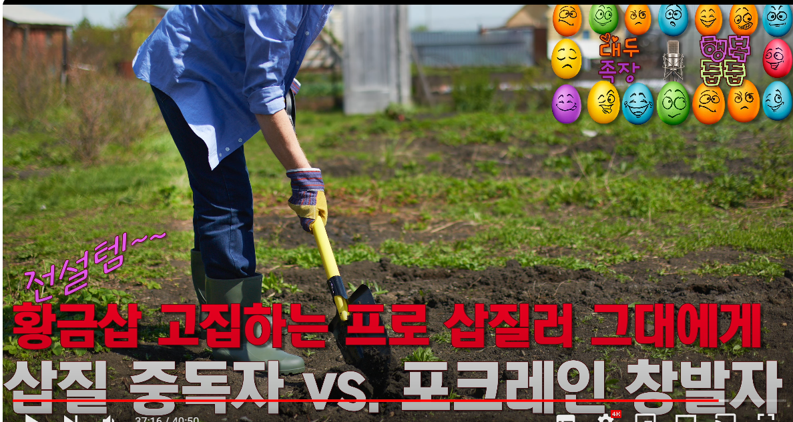

이것도 해볼까요? 바로 직계 조상, `obj3`, `GrandKid`죠. 얘 보고 '너 Bebop에 맞춰서 춰 봐'. 라고 했어. 아래 코드 참조

```python
obj3.dance("Bebop")
```

이 친구는 못 춰요. 아래 아웃풋 참조

```python
TypeError: dance() takes exactly 1 argument (2 given)
```

Bebop에 맞춰서 춤을 추는 방법을 몰라. 그래서 error가 나요. 포크레인 창발자만 출 수 있어. 이제 좀 삘이 오십니까? 

여기서 적어도 두 부류로 나뉘실 거야. '아 이제 좀 뭐가 보인다'. '뭔 소리여?' 여기까지도 아무 삘도 안 오시고 관심도 안 생기고 그럼 제가 도와드릴 방법이 없습니다. 진짜로. 그런데 조금이라도 관심이 생기시고 뭔가 이렇게 여기서 뿅 터지는 게 있다거나 막 흥분된다거나 가슴이 설렌다거나 어? Python 저거 뭐야? 어? Python 저거 뭐야?

> 이 영상을 봤던 기억이 나는데, 저에게는 아주 희미한 반딧불만 켜졌었습니다. 예상대로 전 컴쟁이는 아니었습니다.

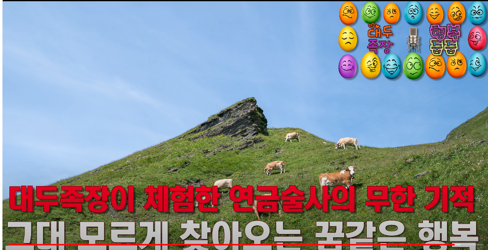

코딩에 요만큼이라도 관심이 생기신다? 그게 연금술사의 마법일 수 있어요. 따라가세요. 반딧불이라도. 더 이상은 말씀을 안 드릴게. 보여드렸으니까 포크레인 창발자의 대가리가 어떻게 생겼는지 난 분명히 보여드렸어.

포크레인 창발자들의 머릿속을. 무지하게 간단한 코딩이에요. 무지하게. 진짜 무지하게. 이게 훨씬 더 복잡해지고 이러는 게 게임인 거고. 게임 속 세상인 거고. 여러분들이 사용하시는 애플리케이션인 거고 여러분이 사용하시는 운영체제인 거야. 디지털 세상, 디지털 세상을 이딴 식으로 만든다고. 이걸 바꿔봐 지금 생명체로 보이잖아요 `Ancestor`, `Kid`, `GrandKid`, `GrandGrandKid` 이런 걸.

이걸 최상위 조상 클래스 이런 거를 바꿔보라고 무생물로, 만약 자동차잖아? 그러면 `Vehicle`이라는 게 최상위 클래스일 거 아니에요. 탈 것. 탈 것 에서 새끼를 칠 거 아니야. Subclassing을 할 거 아니야. 날아다니는 거, 안 날아다니는 거. 이런 식으로 나머지도 마찬가지라니까. 글이라고 생각해봐 글, 쓰는 글. 그걸 최상위 클래스로 끄집어내면 나머지가 있을 거 아니야. Subclassing을 할 수 있잖아 어떤 글인가. 책에 쓰는 글일 수도 있고 게시판 글일 수도 있고 그리고 작아지는 글 있잖아요. 댓글. 그리고 점점점점 아래로 내려가겠죠. 그렇게 진화를 할 수도 있겠죠 무생물이라니까 그건.

최상위 클래스가 이벤트야 이벤트. 세상에서 벌어지는 모든 이벤트.

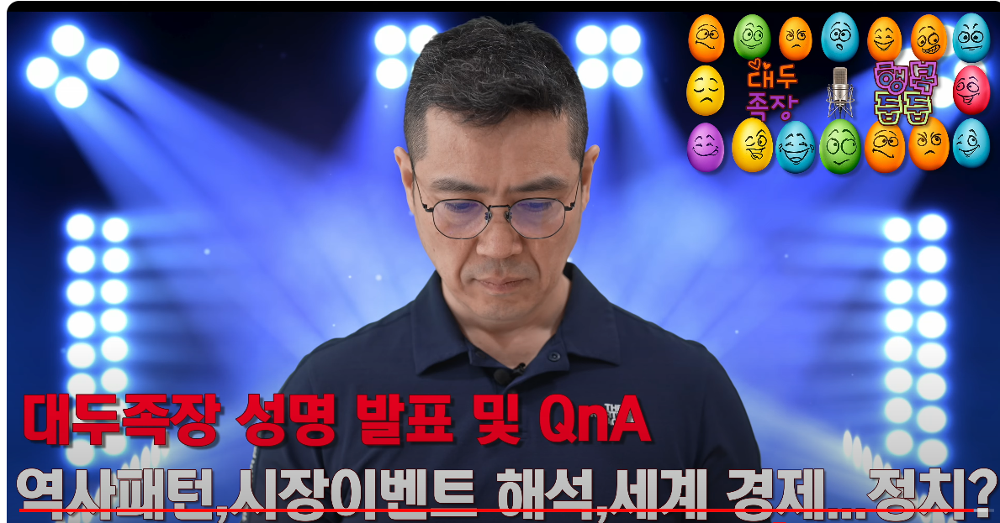

여기서 좀 좁혀봐. 시장에, 주식시장에 영향을 주는 이벤트. Subclassing을 계속 해나가는 거야. 이런 식으로 만들어 볼 수 있거든요. 그 Hierarchy를 머릿속에 그리는 인간들이, 코딩을 할 줄 아는 포크레인 창발자들이라고.

이 개념이 없으면 제 말만 들으면서 '아 객체지향적이라는 게 그런 건가 봐?'라고만 한다면, 머릿속에서 코딩을 하는 인간을 따라올 수가 없죠. 

이 정도면 반딧불이라도 보여야 돼. 반딧불 조차 안 보인다? 아직 때가 아니신 거야. 

아무리 나이가 많이 드셨다고 해도 때가 아니신 거야. 그러다가 그냥 이 세상을 떠날 수도 있어요 영원히. 때가 아닌 채로 그건 제가 어떻게 해드릴 수가 없어.

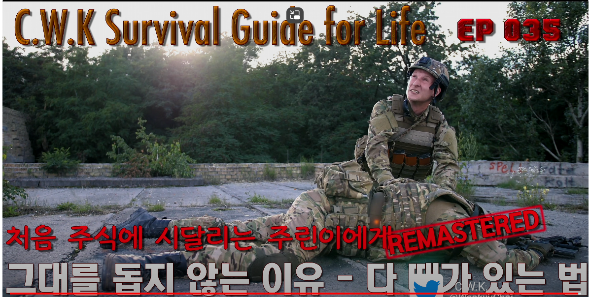

> 그나마 얼마전부터라도 꾸역꾸역 관심을 갖고 해보게된 것이 참 다행이고, 저에게는 정말 가슴을 쓸어내릴만한 일입니다. 족장님 말씀 중에 그른 것이 하나 없네요.