# [대두족장 인생 치트키 객체지향성 원론] Part 02 - 객체지향적 universe(2015. 10. 29.)

**영상링크 : https://youtu.be/Al3Kne7Mk2Y**

## ***Intro***

```
인생 3대 치트키 중 하나인 객체지향성에 관한 기본 설명 영상 2개의 리마스터 버전입니다..

세상은 객체지향성 치트키를 가진자와... 못 가진자로 나뉩니다.

그대의 인생은 달라질 수밖에 없습니다.

허벅지 찔러가며 끝까지 이겨내고, 이해해 체득하신 분만...

믿거나 말거나...
```

꼭 프로그래머가 아니더라도 인간은 대체로 세상을 객체지향적으로 바라보기 마련입니다. 가령 생명이 없는 사물을 봐도 애니메이션 캐릭터처럼 의인화해서 생각하는 게 그런 의미입니다. 

인간이 만물의 영장인 이유도 그런 객체지향적인 사고방식 덕분일지도 모릅니다. **세상 만물은 딱 두 가지 특질로 설명이 가능합니다.** '설명이 가능하다'는 건 '문제가 생겼을 때 해결도 가능하다'는 뜻입니다. 

또 말로 설명이 가능하다는 걸 컴퓨터에 적용한다면, **세상 만물을 딱 두 가지 특질로 포장을 해서 컴퓨터 모델링이 가능하다**는 뜻입니다. 

가령 강아지를 보세요. 강아지는 **개별적인 특징과 행동**으로 설명이 가능합니다. 훨씬 복잡한 인간도 마찬가지지만. 

몰티즈라면 털 색깔은 새하얀데 눈은 까맣고 꼬리는 짧습니다. 이름도 붙일 수 있죠. 숫자로 나이를 나타낼 수도 있습니다. 배고픈 상태를 참이나 거짓값으로 표현할 수도 있습니다. 

이런 데이터는 몰티즈의 상태를 나타내줍니다. 몰티즈는 또 행동으로 설명할 수도 있습니다. 큰 개보다는 작은 소리로 짖고요. 코카스패니얼보다는 식탐이 덜해서 적당히 먹습니다. 여느 개들처럼 주인말도 잘 듣습니다. 

행동을 통해 몰티즈의 상태가 바뀌기도 합니다. 먹으면 참(`True`)이었던 배고픔의 상태가 거짓(`False`)으로 바뀌는 식이죠. 물론 식탐견들은 늘 배고픈 상태가 참이기도 합니다. 몰티즈를 컴퓨터로 모델링한다면 이처럼 개별적인 특징에 해당하는 속성과 몰티즈가 할 수 있는 행동만 나열하면 그만입니다. 아래코드 참조

```python
class Maltese:
    
    def __init__(self, name='Unknown', color='white'):
        self.name = name
        self.color = color
    
    def bark(self):
        print("Arf Arf!")

    def eat(self):
        pass

    def sleep(self):
        pass
```

저는 `인간`이잖아요. 눈은 두 개, 귀도 두 개, 코는 하나, 입도 하나, 머리카락은 까만데 나이가 좀 들어서 이제 희끗희끗하죠. 체형은 보통이고요. 국적은 한국입니다. 이름은 최완규, 필명은 대두족장. 보통 사람들이 하는 행동은 다 할 줄 압니다. 말하고 듣고 보고 걷거나 달리고 먹고 싸고 잠도 자고 일도 합니다. 

> 하나의 메소드를 정리해보자면 다음과 같습니다.

```python
class Human:
    
    def __init__(self, name='Unknown', nationality='Unknown', age=1, hair_color='black'):
        self.name = name             
        self.nationality = nationality
        self.age = age
        self.hair_color = hair_color
        
    def speak(self, words):
        print(f"{self.name} says: {words}")
    
person = Human(name='김원석', nationality='Korean', age=37, hair_color='black')

print(person.name)         
print(person.nationality)  

person.speak("안녕하세요!")  
```

output:
```
김원석
Korean
김원석 says: 안녕하세요!
```

**대단히 복잡해 보이는 인간도 결국 속성과 행동으로 설명이 가능한 거죠**. 얼마나 복잡한 존재인가에 따라 구체적인 속성과 행동이 많고 적고, 복잡해질 뿐입니다. 객체지향 프로그래밍에서 객체, object를 설명하는 방법입니다. 데이터에 해당하는 **속성과 행동**으로 설명하는 거죠. 속성은 영어로 property 또는 attribute라고 하는데요. 행동은 behavior라고 합니다. 실제 프로그래밍에서는 method 또는 member function이란 말을 많이 씁니다. Python에서는 method라고 합니다.

속성과 method가 다 attribute이기 때문에 'attribute하고 property를 구분해야 한다'고 하는 그런 골수, 학자틱한 프로그래머들도 있는데 개념 정쟁일 뿐이니까 이해하는데 아무런 도움이 안 돼요. 기본적인 것만 받아들이시기 바랍니다. 다른 분야도 마찬가지지만 용어 가지고 왈가왈부할 필요는 없다고 생각합니다. **정작 중요한 건 개념이니까요**. 개념을 제대로 받아들이기만 하면 되거든요.

프로그래밍을 해보면 알지만 함수로 표현하는 코드 블럭은 거의 method에 해당합니다. 나머지 데이터 변수들은 속성이겠죠. 객체지향이 아닌 conventional한 프로그램을 procedure 혹은 functional 프로그램이라고 하는데요. 이런 프로그램들의 소스코드를 들여다보면 데이터와 함수가 거미줄처럼 연결돼 있어서 그런 데이터와 함수들의 연속입니다. 관련 데이터와 함수를 하나의 완전체, 블랙박스로 포장한 게 바로 객체입니다. 

영어로는 이 완전체를 self-contained entity라고 하는데요. 혼자 '모든 니즈를 만족시킨다'는 뜻입니다. 사실 세상 만물이 다 그렇습니다. 사물을 딱 봤을 때 딱 자동차다, 카메라다, 컴퓨터다, 고양이다, 강아지다, 인간이다, 이렇게 한눈에 알아볼 수 있는 게 다 완전체이기 때문입니다. 인간도 그런 예입니다. 그 자체로 완전하죠. 두 사람이 합체해야 한 인간이 되는 건 아니니까요. 나의 반쪽, significant other 이런 거 얘기하는 건 이따위 얘기는 다 철학적인 거고요. 생물학적으로는 인간은 엄연한 완전체입니다. 

프로그래머는 최적화된 솔루션에 목숨을 거는 종자들입니다. 컴퓨터가 등장하기 전에도 그런 종자들이 있었는데 컴퓨터가 생기고 나서 프로그래머란 타이틀이 붙었을 뿐입니다. 

세상에서 가장 최적화된 솔루션을 그 존재만으로 증명해 주는 게 바로 생명입니다. 진화와 자연 선택을 통해서 생명은 늘 최적화를 거듭하죠. 지금 보면 콜롬버스 달걀이지만 어느 순간 광야를 달리던 초인 프로그래머가 있어서 문득 깨닫게 된 겁니다. 불현듯. ***생명에 답이 있나니***. 그렇게 탄생한 게 객체지향 프로그래밍 개념입니다. 

## ***객체지향 universe***

오늘은 Intermediate Python Programming, 중급 Python 프로그래밍 트랙의 첫 번째 시간으로 객체지향 프로그래밍 개념의 맛을 보는 시간입니다. 여러분도 젖과 꿀이 흐르는 객체지향 프로그래밍의 신천지에 오신 걸 환영합니다.

첫 시간인 오늘은 코딩을 하지 않겠습니다 소스 코드를 쳐다보지도 않겠습니다. 오늘은 보기 싫더라도 제 얼굴만 보세요. 부담없이 객체지향이라는 개념의 간만 보려고 합니다. 

개념적인 설명과 함께 현실 세계의 사례를 들어드리려고 하는데요. 코딩은 다음 시간부터 합니다. 

지난 시간에 '어느 순간 광야를 달리던 초인 프로그래머가 있어서 불현듯 깨달았다'고 했습니다. ***생명에 답이 있나니***. 

그렇게 탄생한 게 객체지향 프로그래밍 개념이라고 했는데요. ***'최적화된 솔루션을 자연선택(natural selection)을 통해서 진화하는 생명체에서 찾자'*** 그래서 객체지향의 상속성(Inheritance)이니, 캡슐화(Encapsulation)니, 다형성(Polymorphism)이니, Self-Containtment니, Information Hiding이니 그런 개념들이 등장하는 겁니다. 다 진화하는 생명의 특징이거든요. 

아버지가 곱슬이면 아들도 곱슬입니다. 저도 곱슬인데요. 아버지는 더 심한 곱슬이셨어요. 누가 봐도 닮았지만 아들은 아버지에 없는 개성이 있습니다. 아버지와 아들의 속이 어떻게 만들어졌는지 알 필요도 없습니다. 어느 인간을 제대로 이해하겠다고, 살아있는데, 해부해보거나 그러진 않잖아요. 딱 보면 그 아버지의 그 아들이고 고집센 최씨 가문의 후손들일 뿐입니다. 

아버지가 곱슬이면 아들도 곱슬인데 이건 유전 때문입니다. 객체지향 프로그래머들은 **Inheritance, 상속성**이라는 표현을 쓰는데요. 이 표현이 좀 헷갈리긴 합니다. 원래 유전에 가까운 개념입니다. 그러니까 상속성이라고 하면 유전을 떠올리시기 바랍니다. 컴퓨터 Window에서 이미지 버튼 있잖아요. 이 이미지 버튼은 일반 버튼의 자식입니다. 

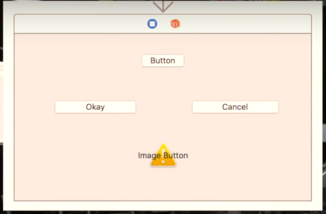

메모장은 Window의 자식이고, Word도 Window의 자식으로, Window의 특성과 행동을 그대로 상속받습니다.

나머지 개성에 해당하는 기능들만 구현하는 겁니다. 이 Window들이 다 최소화, 최대화, X 표시 있는 닫기 버튼, 이런 왼쪽 상단에 있는 버튼들 다 똑같지 않습니까? 

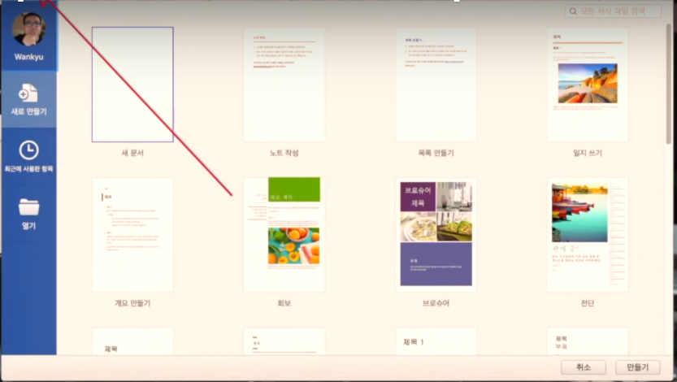

'같은 조상에서 나왔다'는 뜻이죠. 누가 봐도 닮았지만 아들은 아버지에게는 없는 개성이 있습니다. 딱봐도 Window의 자식들이지만 메모장, 워드패드, 엑셀, 워드, 웹브라우저 저마다 추가된 기능이나 수정된 기능들이 있습니다. 

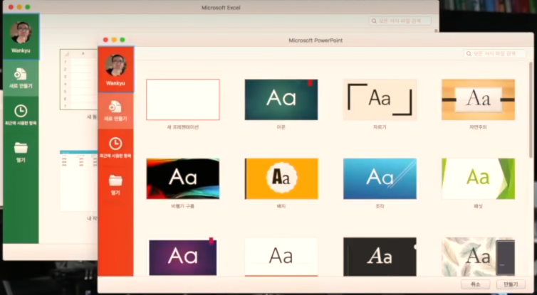

외관도 다르죠. 쓰임새도 제각각입니다. **다형성, polymorphism**의 예입니다. 말이 참 어렵죠? polymorphism.

아버지 따라서 곱슬이긴 하지만 스트레이트 파마를 하면 생머리처럼 다닐 수도 있습니다. 저도 젊었을 때 곱슬머리 정말 싫어했거든요. 지금은 그러려니 하고 살지만 **객체지향에서 조상의 속성이나 행동을 무시할 수 있는데요**. Overriding, Overloading 이런 기능을 통해서 선별적으로 달면 삼키고 쓰면 뱉으면서 유전적 특질을 선별적으로 물려받을 수 있습니다. 

아버지든 아들이든 소통하겠답시고 속을 뜯어볼 필요는 없습니다. 입으로 말을 하고 귀로 듣고 손짓 발짓 할 줄 아니까, 딱 봐도 인간 interface를 갖고 있잖아요. TV를 사면 사용하는 방법하고 단자 연결 방법만 알면 됩니다. 수리를 한다면 모를까 속을 뜯어보지는 않습니다. Window의 버튼이나 입력창 등이 다 객체인데요.

Interface만 알면 되지, 어떻게 구현되어 있는지 속을 뜯어볼 필요는 없습니다. 버튼 객체를 사용하려는 객체지향 프로그래머는 버튼에 이름을 써주는 Label이라는 속성이 있고 클릭을 하면 뭔가 반응을 하는 `click()` method가 있다는 것만 매뉴얼을 통해서 알 뿐입니다. 


Label 속성에 `cancel`이라는 문자열을 저장을 하고 사용자가 해당 버튼을 누르면 하려던 짓을 취소하는 함수를 구현하는 게 전부라는 뜻입니다.

화면에 버튼을 그리고, 지우는 그런 기본적인 기능은 객체가 다 알아서 합니다. 그 사용법만 익히면 된다는 뜻이죠. 나중에 더 자세히 살펴보겠지만 **캡슐화**의 간단한 예입니다. 정보를 숨기고 싶어서이기도 하기 때문에 **Information Hiding**이라는 표현을 쓰기도 합니다. 

프로그래머가 아니더라도 객체지향 개념을 알아두면 여러모로 피가 되고 살이 됩니다. 어떤 문제든 해석하는 능력이 달라지거든요. 솔루션의 질도 달라지죠. 

예를 들어서 간판을 만들어 파는 공장이 있다고 생각해보세요. 근데 고객들이 요구하는 테두리 디자인만 다른 겁니다. 

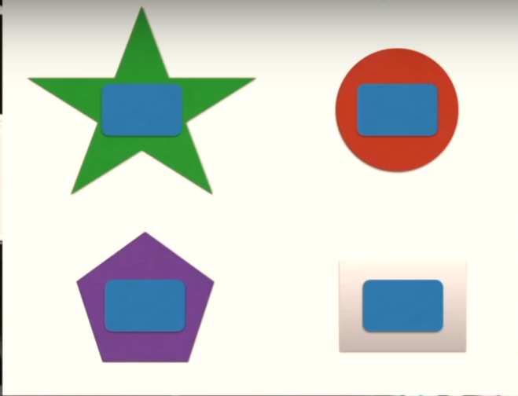

테두리 디자인이 100개쯤 되면 제작 공정을 100개 다 따로 만들어야 될까요. 참 짱구스러운 오스트랄로피테쿠스적인 발상이잖아요. 우린 호모 사피엔스니까 절대 이런 짱구짓을 안 할 겁니다. 간판을 생명체, 그러니까 객체로 바라보면 되거든요. 객체지향적으로 바라보면 공통되는 부분 있잖아요. 가운데 부분. 그 부분만 상속성을 이용을 하고 달라지는 테두리 부분 이 부분은 다형성을 적용하는 겁니다.

외주를 준다면 하청업체에는 어떻게 끼워 맞춰야 할지 그 interface 규격만 알려주면 되겠죠.

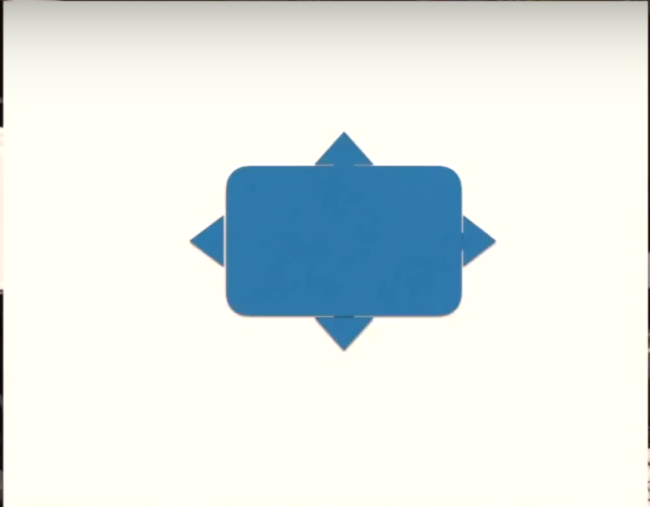

공통 부분은 내가 만들 테니까 그 공정을, 일일이 기업 비밀을 알려줄 필요가 없을 겁니다. **Information Hiding, 캡슐화**가 떠오르는 제목이죠. 아이폰이나 갤럭시 같은 휴대폰 케이스 뭐 이런 악세사리들 있잖아요. 다 따로 만들잖아요. 바로 그런 예입니다. 

### ***오디오 interface 사례***

제가 사용하는 오디오 interface 기기들인데요. 

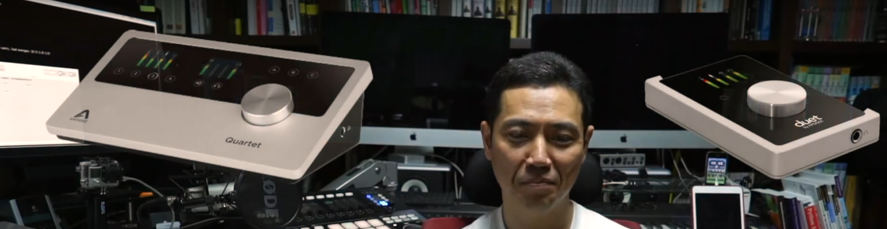

Quartet은 데스크탑용이고(Apogee Quartet) Duet은 노트북용으로 사용합니다. 기타나 마이크, 미디기기, 모니터링 스피커 등을 꼽아서 사용할 수 있는 좀 고급형 음향 interface 인데요. 이름에서도 알 수 있듯이 Quartet은 4개까지 입력기기를 연결할 수 있습니다. 기타 2대, 베이스 1대, 마이크, 보컬기기까지 연결해서 이렇게 한 밴드가 연주를 할 수도 있는데요.

Duet은 입력 채널이 2개입니다. 그리고 Apogee라는 회사에서 One이라는 기기도 만드는데요. 입력 채널이 1개라는 뜻이겠죠. Apogee라는 회사가 이런 입력 장치들을 어떻게 디자인하고 만들지 한번 생각해 보세요. 여러분 모두 슬기슬기 사람 호모사피엔스니까 굳이 구체적으로 설명하진 않겠습니다. 딱 삘이 와야 되거든요. 

다만 이 기기들만 봐도 객체지향적으로 필요한 단자만 사용하도록 Interface를 갖춘 캡슐화와 동일 엔진을 상속받으면서 입출력 단자와 외형이라는 디자인적인 면, 그런 개성만 달라지는 상속성, 다형성의 솔루션이 눈에 들어와야 됩니다. 

이거 속이 어떻게 생겼는지 보겠다고 뜯어 보시겠어요? Interface 단자만 신경을 쓰는 게 정상이거든요. 제가 Quartet을 먼저 사고 Duet은 나중에 샀습니다. 

근데 Quartet 써봤으니까 Duet은 어땠을까요? 매뉴얼 볼 필요도 없었습니다. 무슨 뜻일까요? 같은 class에 속하는 놈들이니까 사용법이 뻔한 거죠. 

2종 운전면허 무사고로 오래 유지를 하면 나라에서 1종 면허를 내주는 원리입니다. 객체지향성이 우리 삶 구석구석에 녹아 있다는 뜻이죠. 제가 농담반 진담반으로 이런 말을 자주 하는데 '조물주도 객체지향 프로그래머일거다'. 농담입니다. 진담일 수도 있어요. 

Quartet은 제가 주로 워크스테이션으로 사용하는 MacPRO에 연결돼 있습니다. 지금 사용하는 마이크 역시 Quartet에 연결돼 있기 때문에 빼서 보여드릴 수는 없는데 이미지로 대체를 하고 있습니다. 

Duet은 거실 노트북에 연결돼 있어서 밖에서 기타 칠 때 사용하거든요. 근데 Quartet과 달라서 크기가 작아서 break-out 단자라는 지저분한 케이블 범위가 따라옵니다. 악기를 2개 연결할 수 있는 케이블 2개랑 모니터링 스피커를 연결하는 좌우 케이블 2개 총 4개가 주렁주렁 달려 있죠. 이걸 한번 보여드릴까요?


Apogee Duet이라는 오디오 interface입니다. 제가 노트북에 사용을 하는데 break-out 케이블이라는 게 있어서 입력 단자 2개하고 출력 단자 2개 이렇게 있습니다.


출력 단자 2개는 모니터링 스피커에 연결을 하는 거고, 입력 단자 2개는 기타 하나 마이크 하나 아니면 기타 2대 기타 하나 베이스 1대 이렇게 연결할 수 있는 단자인데요. 전 기타 하나 사용한다고 그랬잖아요. 그리고 마루에서 쓰니까 모니터링 스피커를 쓸 일도 없고 헤드폰 연결해서 쓰거든요. 

그러면 단자가 하나만 필요합니다. 나머지 셋은 주렁주렁 달려있고 그냥 볼썽 사납기만 하죠. 관리하기도 귀찮고. 기타 여기다 연결하고 얘만 있으면 되잖아요. 이걸 어떻게 해결해야 할까? 캡슐화를 하면 됩니다. 객체지향적인 솔루션을 마련을 하는 거죠 한번 해볼까요? 좀 kludge한 방법이긴 하지만.

이렇게 encapsulation을 하면 information hiding이 되죠. 불필요한 단자들을 다 숨길 수 있습니다.


그 회로구조도 다 숨길 수 있고. 엉뚱한 단자에 꽂아서 기타 소리가 안 나서 다시 뽑았다 끼고 이런 뻘짓도 방지할 수 있죠. 딱 이 단자에만 꽂으면 되니까.

```
물론 더 현실적인 대안은 입력 채널 하나 짜리 Apogee One을 사는 거겠지만, 확장성을 고려해서 이미 Duet을 샀을 경우를 가정한 겁니다:-) by 대두족장님
```

### ***자동차 사례***

이렇게 break-out 단자는 이미 연결이 돼 있을 거고요. 굉장히 간단해졌죠? 캡슐화의 예입니다. 객체지향적으로 세상을 바라보면 이처럼 정말 세상이 달라 보입니다. 우리 주변에 객체지향성을 드러내주는 사물과 이벤트가 수두룩 하거든요. 온 우주 만물이 객체지향적입니다. 자전거와 자동차, 탱크의 관계를 한번 보세요. 탈 것은 자전거를 낳고, 자전거는 자동차를 낳고, 자동차는 탱크를 낳으니 뭐 이런 세상입니다.

K7이라는 자동차가 어디서 왔을까요? 아무리 혁신적인 차라고 해도 처음부터 다시 만드는 경우는 거의 없습니다. 뻘짓이죠? K5, K3 이런 조상 class가 분명히 존재합니다. 아이폰 1, 2, 3, 4, 5, 6, 7, 7까지는 안 나왔죠 6, 6S, 6+ 이 정도면 감이 오시죠?

### ***게임 사례***

프로그래밍으로 따지면 객체지향성이 가장 잘 드러나는 게 게임입니다. 1번 권총, 2번 기관총, 3번 rail gun 이런 것들도 무기의 계층 구조가 진화를 하잖아요. 

Human 캐릭터와 Elf 캐릭터, 난장이 캐릭터 이런 플레이어 class와 1번 고블린 몬스터, 2번 트롤 몬스터, 3번 오그 몬스터 등 

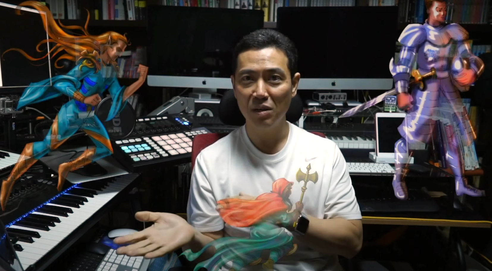

이런 몹 class도 전형적인 객체지향의 상속성, 다형성, 캡슐화를 적용합니다. 

어딘가 비슷하면서 다른 개성. Human 캐릭터하고 Elf 캐릭터하고 과연 다른 종족일까요? 전혀 다른 종족일까요? 얘네들도 저 꼭대기까지 거슬러 올라가면 같은 조상이 나올 수밖에 없습니다.

'공통되는 속성과 method가 여러 개 존재한다' 싶으면 같은 조상에서 새끼쳤을 가능성이 높은 거거든요. 간단히 말해서 Python에서도 모든 게 객체인데요. 죄다 object라는 class에서 새끼친 놈들입니다. 하다못해 연산자까지.

## ***우주 만물이 객체***

우주 만물은 어떨까요? 똑같습니다. object 혹은 thing이라고 일반화할 만한 그런 존재에서 세상 만물, 우주 만물이 상속을 받은 겁니다. 


우리 모두가 이 세상 만물, 우주 만물과 인간까지 그런 object 혹은 thing이라는 일반화할 만한 존재에서 상속을 받은 형제, 자매, 동족들이라는 거죠. 


거슬러 올라가면 뿌리가 같은 겁니다. 우주 만물이 100여 개의 기본 원소로 구성되어 있는 게 우연이 아니라는 뜻입니다.

제가 찬 이 시계하고 생명체, 인간인 제가 구성만 다르고 비율만 다를 뿐 동일한 100여 개의 원소로 만들어져 있다는 거 이거 팩트잖아요. 믿기세요? 믿어야죠 팩트인데. 

가령 Human이든 Elf든 체력하고 정신력, 이런 수치라는 속성이 있고 치유하고 죽는 method가 존재합니다. 공통되는 부분을 굳이 따로 구현할 필요가 없겠죠. 캐릭터 또는 플레이어라는 꼭대기 조상을 만들어서 공통 부분을 상속을 받으면 그만일 겁니다. 그리고 달라지는 부분들만 개성을 가질 수 있도록 진화를 시키면 그만이죠. 

## ***프로그래밍 언어와 객체지향***

우리 생명체가 진화와 자연 선택을 거치면서 최적화하는 짓이랑 똑같습니다. 1980년대 말까지만 해도 객체지향 프로그래밍이 지금처럼 일반화되질 않았습니다. 누가 뭐래도 C가 대세였거든요. Herbert Schildt의 그 ***Born to Code in C*** 같은, 그 C 언어 관련 서적이 인기를 누리던 때입니다. 


객체지향 관련 책이라고 해봤자 볼랜드 파스칼 같은 상용 언어에서 매뉴얼로 제공하는 게 전부였거든요. 워낙 자료가 부족하다 보니까 저도 그런 매뉴얼을 통해서 객체지향을 배웠습니다. 더럽게 어려웠죠. 대부분 먼 세상에서 무슨 소린가 싶었고. 

근데 일단 코딩을 좀 해보면 개념이 쏙쏙 들어오기 시작합니다. 말로만 할 때랑은 다르죠. 객체지향의 달걀을 테이블에 처음 세운 콜럼버스 프로그래머, 그 프로그래머의 혜안에 감탄하게 됩니다. 

객체지향 프로그래밍 언어가 인기를 끌기 전에는 C 언어처럼 이른바 순차적인 프로그램 코드를 실행하는 procedural programming 혹은 functional programming 언어가 대세였는데요. 대세라기보다는 객체지향이 그만큼 토대가 약했기 때문에 대안이 없었기 때문에 어쩔 수 없었던 상황이죠. 

요즘은 거의 모든 프로그래밍 언어가 객체지향성을 지원합니다. 비 객체지향적인 기존 procedural 또는 functional programming의 최대 단점은 **체계적으로 모듈화해서 디자인을 하고, 그렇게 디자인한 거를 유지하고 debugging하고 이런 게 정말 어렵다**는 데 있습니다.

덩치가 커지면 아무리 잘 짠 소스코드라도 걸레되기 십상이거든요. 이런 코드를 수십 명, 수백 명이 달라붙어서 공동 작업을 하니까 중복되는 뻘짓도 많아지고 개발도 오래 걸리고 debugging도 어렵고 거의 진짜 악몽의 연속인거죠.

객체 지향성을 도입하면 먼저 상속을 받을 수 있으니까 중복되는 코드가 현저히 줄어듭니다. 중복되는 부분이 줄어들면 당연히 이해하기도 쉽고 유지관리도 편하니까 버그도 적겠죠. 우스운 게 객체지향 프로그래밍을 하다보면 그 전에는 대체 procedural programming으로 이걸 어떻게 해결했을까 기억이 안 나요.

앞서 설명했다시피 **현실 세계에서는 태생적 습관으로 객체지향적으로 솔루션을 떠올리는 인간**이지만 디지털 세계에서는 '이상하게 왜 이렇게 오래 걸렸을까' 객체지향성을 솔루션 problem solving에 적용을 하는데. 시행착오겠죠. 시행착오를 거치는 게 생명의 특징입니다. 그게 객체지향적인 거죠. 콜롬부스 달걀이고.

> 경계를 허물고 분야를 넘나드는 사고의 위력과 중요성이 아닐까 싶습니다.

물론 **모든 프로그래머가 객체지향 프로그래밍을 항상 하는 건 아닙니다**. 아직도 특별한 이유로 procedural이나 functional programming 언어를 사용하는 경우가 있습니다. 모기 잡는데 청룡언월도를 쓸 수는 없으니까 견문발검이잖아요. 그때그때 필요할 때만 쓰는 겁니다 적재적소에. 

말로는 어려워도 실제 샘플 코드를 보면서 설명을 들으면 참 쉽습니다. 그래도 개념적인 이해가 필요하기 때문에 오늘 그 기반을 다져 봤는데요.

객체지향에 맛들이면 과거로 절대 안 돌아갑니다. 말 그대로 은혜 받은 거죠. 


오늘은 여기까지 할 텐데요. 오늘은 객체지향 프로그래밍에 대한 관심을 유도하기 위한 시간이었을 뿐입니다. 처음 접하는 분이라면 Class가 뭔지 객체가 뭔지 Instance가 뭔지 아까 잠깐 언급했습니다만 상속성, 캡슐화, 다형성 뭐 이런 말들이 확 안 와닿을 텐데요.

그런 개념들이 확 와닿다 못해 온몸에 흠씬 젖어들 때까지 죽어라 달려보는 게 중급 Python 프로그래밍 트랙의 목표입니다. 다음 시간에도 객체지향 프로그래밍의 축복을 축복과 은혜가 이어질 겁니다.


드디어 class와 객체를 영접하는 순간이 오는 거죠. 참고로 괜한 오해를 살까 봐 짚어두고 넘어가겠습니다. 전 특정 종교만을 고집하지 않는 자유인입니다. 객체지향 교회 신도라고 할까요?

## ***객체지향 우주와 게임과 과학과 역사와 정치와... 기타 등등***

### ***Intro***

기타 연습을 하다 보면 새로운 노래를 접하더라도 기존에 연습했던 기법이나 Phrase가 등장하게 마련인데요. 한 번 익힌 Idiom이나 Phrase, Riff 같은 거는 다른 솔로에 나와도 금방 적응을 합니다. 

다르게 말하면 뽀록으로 익히면 다른 솔로를 춰도 뽀록질이 계속된다는 뜻이죠. **뽀록질도 상속이 되니까요**. 객체지향 프로그램에서도 조상 class의 버그가 후손까지 그대로 이어집니다. 버그도 물려받는 거죠.

> 빨리 가려하지 말고 천천히, 기본을 잘 다지면서 나아가는 것이 중요한 이유겠죠.

유전적인 병력 같은 건데요. 집안에 당뇨나 암 환자가 있으면 왠지 신경 쓰이잖아요. 지식도 마찬가지입니다. **안다고 생각하는 건 퉁치고 넘어가기 십상인데 이것도 상속성의 부작용 중의 하나입니다**. 

**안다고 캡슐화 해버리고 상속성을 활용해서 다른 새로운 지식을 얻을 때도 다형성을 인정하지 않는 거죠**. 뭔가 배울 때 열린 마음을 가져야 한다는 건 기존 지식을 상속받고 캡슐화하면서도 다형성을 부여하라는 뜻입니다.

초보 통번역쟁이들이 잘하는 실수인데요. 아무리 쉬운 단어도 다형성이 존재합니다. 예를 들어서 'Qualified'라는 단어를 자격이 있는 걸로만 알고 있으면 주식쟁이들이 익숙한 회계 감사할 때 쓰는 '한정 의견'이라는 거 이때도 Qualified를 오역하기 십상입니다. 

Qualified가 한정 의견이라는 건 아주 부정적인 얘기거든요. '회사가 만들어낸 재무제표를 믿지 못하겠다'는 뜻입니다. 원래 영어에 한정사라는 게 있잖아요. 형용사 같은 것도 한정사인데 그게 한정사를 Qualifiers라고 하거든요. 자격이라는 테두리 안에다가 한정을 해놓는 거기 때문에 자격이라는 말이 있듯이.

일반적인 범위를 계속 줄여주는 거니까 한정사라는 말을 쓰는 겁니다. 또 'Complication'이라는 말이 복잡하다고만 알고 있으면 애플이 만든 애플와치 계기판을 Complication이라고 할 때 헷갈리게 되거든요. 복잡한 걸로 상속받아 버리면 애플와치의 Complication이라는 다형성은 포기하는 겁니다. 뻘짓이죠.

### ***물리학의 역사와 객체지향***

지식이라는 게 원래 영원한 정답이 없는 거거든요. 워낙 유기적인 거라 생명체처럼 진화를 거듭합니다. 20세기 초까지만 해도 과학자들 특히 물리학자들은 '세상에 더 이상 배울 게 없다' 한탄을 할 정도로 자뻑하던 시절인데요. 뉴턴 때문이죠. 그때만 해도 세상 섭리를 까발려준 과학자니까. 

그렇게 뉴턴의 버그를 상속을 받다가 아인슈타인이라는 다형성에 개박살이 납니다. 원래 버그라는 게 항상 버그는 아니거든요. 멀쩡하던 것도 시간이나 상황이 달라져서 버그가 됩니다. 

밀레니엄 버그도 그런 예였는데요. 가령 제가 연재 방송하면서 이 방송하면서 숫자를 붙이는데 001 002 003 이런 식으로 붙이거든요. 세 자리로 한정을 하고 있죠. 설마 999회 이상 하겠냐는 생각인 거죠. 세상일 모르는 거거든요. 1,000회까지 가면 엄연한 버그입니다.

```
실제로 유튜브 복귀해서는 그 버그를 수정해
CWKV1003 식으로 4자리 숫자를 썼네요
```

실제로 과거 사이트 운영할 때도 게시판을 만들었었는데 네오보드라는 게시판. 그 게시판 댓글 정렬 알고리즘이 그런 식이었거든요. 이 숫자에 따라서 정렬을 하는 거였는데 1,000개 이상 달리는 글이 있었다면 엄연히 버그입니다.

```
5자리로 가면... 영원불멸을 꿈꾸는 거고ㅠ.ㅠ
```

당시는 '설마' 했지만 요즘은 달릴 수 있거든요. 1,000개 이상. 

뉴턴의 고전역학을 아인슈타인이 Overriding해서 다형성을 부여했죠. 절대자로 추앙받던 아인슈타인도 결국 보어의 도전을 받습니다. 이거 워낙 유명한 사진인데요.

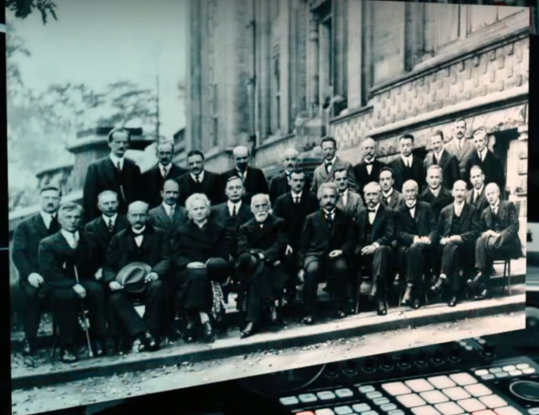

철옹성이던 아인슈타인 학파가 Debugging 당해서 코펜하겐 학파의 다형성에 닥치고 Burrow 탔던 경우입니다. 어느 과학자의 이론도 영원한 진리로 남지는 않습니다. 지구에만 적용되던 뉴턴 역학이 우주에 적용되지 않는다는 걸 보여준 게 아인슈타인의 상대성 이론이잖아요. 지구에서는 버그가 없지만 우주에서는 Debugging이 필요한 겁니다. 

또 이 두 양반 이론 모두 양자역학자들이 상속성을 활용을 해서 나름의 이론으로 다형성으로 Overriding 했듯이 아원자 세계에는 씨알도 안 먹힙니다.

얼마 전에는 또 빛보다 빠른 뭔가가 발견이 돼서 우주에도 상대성 이론이 딱 들어맞는 건 아니라는 반론이 제기되고 있는데요. 또다른 다형성의 도전으로 아인슈타인 이론을 무턱대고 상속받던 시대가 이제 저만치 가고 있는 거죠. 

결국 광속을 뛰어넘는 우주선이나 시간여행이 공상과학이 아닐 수도 있다는 거죠. 반길만한 일입니다. 객체지향적인 다형성 덕분입니다. 그런데도 학교에서 아직도 이런 이론이 깨져도 학교에선 아직도 가르칩니다. 왜 그럴까요?

가령 물리화학 시간에 무턱대고 양자역학부터 가르치지 않거든요. 이미 오래 전에 Debugging 당해서 깨져버린 돌턴의 원자모형부터 가르칩니다.

돌턴부터 시작해서 탐슨, 러더포드, 보어 이렇게 이어지는 원자 모형 버그를 줄줄이 보여주다가 뒷부분에 가서야 아원자 세계는 확률의 세계이니라 하는 Orbital 현대 원자 모형을 보여주거든요. 결국 앞에 나온 모형들은 죄다 Debugging 당한 상속성의 잔재일 뿐이거든요. Orbital도 언젠가 깨질지도 모릅니다. 그래도 배웁니다. 

새로운 다형성의 도전을 받을 때까지 100% 쓸모없는 건 아니거든요. 상속 받아서 쓸 부분은 쓰고, 나머지는 Overriding해서 다형성을 인정하는 거죠. 상대성 이론이 깨진다고 해서 다 갖다 버리는 게 아니라는 겁니다. 여전히 지구는 뉴턴의 고전 역학으로 돌아갑니다. 

상속 받았다고 해서 내가 상속받은 특질만 사용하는 게 아니라 필요하면 언제든 조상의 특질을 가져다 쓰는 게 객체지향 프로그래밍 상속성의 개념입니다. 생명체의 유전하고 가장 큰 차이점이죠. 종족 class 계층 구조를 언제든 거슬러 올라가면서 입맛대로 골라 쓸 수 있거든요. 지금 상황이 고전역학에 필요하면 뉴턴 역학을 쓰고 상대성 이론이 필요하면 아인슈타인을 쓰고 아원자 세계틱한 상황이라면 양자역학 이론을 집어다 쓰는 겁니다. 뉴턴이 없었다면 아인슈타인이 존재했을까요?

뉴턴 역학을 배웠기 때문에 아인슈타인도 새로운 발견을 할 수 있었던 거고요. 보어도 아인슈타인을 배웠기에 양자역학의 기틀을 마련할 수 있었을 겁니다. **난쟁이는 거인의 어깨를 밟고 일어섭니다**. 그래야 키가 훨씬 커지죠 ***Standing on the shoulders of giants*** 그 말이에요. 

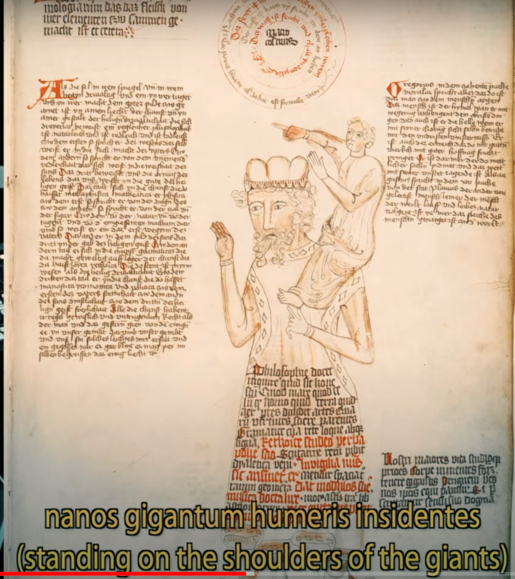

인간은 오래전부터 이걸 알고 있었어요. 그래서 그런 표현이 라틴어로도 존재하는 거거든요. 한 가지 유념해야 할 건 **고집부리면 안 됩니다**. 아인슈타인이 등장했을 때도 고전역학자들이 꼰대짓을 했거든요. 꼰대짓 하면 안 돼요. 우습게도 아인슈타인도 보어를 만났을 때는 역시 꼰대짓을 했습니다. 


'신은 주사위 놀이를 하지 않는다' 자기 틀만 고집했죠. 보어라고 다를까요? 파인만이 등장하니까 '요즘 젊은 것들은' 이렇게 혀를 찼거든요. 또 파인만이라고 달랐을까요? 요즘 과학자들도 피터지게 싸웁니다. 상속을 받고 캡슐화는 하면서, 자기 것들은 이기적으로 다 챙기면서 다형성은 인정하려고 들지 않는 게 인간의 기본적인 attribute, property 내지는 속성입니다. 우리가 뭔가 배우고 적용하는 과정마저도 지극히 객체지향적인 솔루션이라는 거죠. 

> 지금의 물리학과 과학도 먼 훗날에는 분명히 부족하고 틀린 부분들이 많이 보일만한 수준이겠죠. 설렙니다.

### ***정치의 역사와 객체지향***

나쁜 예지만 정치인들이 치고받을 때 쓰는 이전투구 치사빤스 유치뽕 전략전술 있잖아요. 이거 다 자기들이 생각해낸 걸까요? 아니거든요.

가깝게는 조선 사색당파, 붕당정치 이런 데서 배운 꼼수들이거든요. 나뭇잎에 꿀 발라서 벌레 먹인 다음에 주초위왕 사건 만들어내고 민망하잖아요 얼굴 뜨겁고. 그런 나쁜 버릇 다 상속받아서 요즘 세상에 맞는 다형성으로 손질한 것 뿐입니다. 

조광조가 중종이 등용한 사람이었는데 중종 눈치를 보다가 좀 과하게 설친다 싶으니까 중종도 짜증을 냈거든요. 괘씸하다 싶고. 훈구파가 그런 중종의 속내를 읽은 거죠. 조광조한테 밀리고 왕 눈치를 살피다가 '기회는 찬스다' 그러고 그런 뻘짓을 한 겁니다. 중종이 몰랐을까요? 거기다가 꿀 바르고 그랬다는 걸. 서로 니즈가 맞으니까. 

SNS나 게시판에 댓글 공작하는 거 있잖아요. 이것도 뭐 새로운 겁니까? 현대판 서동요잖아요. 이 서동요틱한 유언비어 공작은 중국 역사 거슬러 올라가면 대표적인 경국지색 중 하나인 포사까지 거슬러 올라갑니다. 주나라 포사. 동네 꼬마애들 노래 부르게 하는 것까지 똑같거든요. 'History repeats itself' '역사는 되풀이된다'는 말은 결국 상속받는다는 겁니다. 

> 'History doesn't repeat itself, but it often rhymes'라는 마크 트웨인의 말이 있지만, 족장님의 'History reapeats itself'라는 말씀은 마크 트웨인의 말보다 넓은 의미입니다. 즉, 마크 트웨인의 말도 '역사는 반복된다'라는 의미겠지만 '완전히 똑같지는 않다'는 점을 강조하는 것일테고, 그 안에 객체지향의 통찰이 녹아 있다는 사실은 동일합니다. 즉, 두 분의 말씀 모두 '역사는 반복된다'는 의미에서는 동일합니다(서동요와 댓글 부대가 완전히 '똑같지는 않지만' '유사하죠'). 요컨대, 'History doesn't repeat itself, but it often rhymes'는 'History reapeats itself' 안에 포섭됩니다.

사실 조선 정치인들도 그딴 꼼수 다 보고 배운 겁니다. 누구한테? 이 양반들 배운 역사가 똑같잖아요. 나라에서 배우라는 역사 교과서가 '춘추' 달랑 하나니까.

중국 춘추전국시대만한 꼼수의 향연이 없거든요. 세계사를 통틀어서. 춘추전국시대만 배워도 사실 세계사 다 배우는 겁니다. 그래서 그렇게 책들이 많이 나오는 거거든요. 모든 패턴이 다 있어요. '정복 황제는 2대, 길어야 3대 이상 못 간다라'는 패턴도 춘추오패 시절부터 상속받은 겁니다. 뭐 서양엔 알렉산더도 있잖아요. 춘추오패 죄다 당대에서 끝나거든요. 이후는 정말 비참합니다. 황제 시신 썩고 구더기 나오고 난리도 아니에요. 역사는 세상 사는 모범 답안지입니다. 

역사를 아는 사람은 답을 보고 푸는 거거든요. '아 이거 이렇게 흘러가겠구나' 통계적인 상식이라, 통계 정말 무섭습니다. 그러니까 위정자들이 역사를 왜곡하고 뭐 그러는 거겠죠. 뭐 특정 정권이나 정부를 지칭하는 건 아닙니다. 제가 지금 한 말에 주어가 없으니까요. 그냥 일반론입니다. 

### ***생명의 진화와 객체지향***

말이 심하게 옆으로 샜는데 객체지향은 이처럼 최적화를 거듭하는 솔루션입니다. **자기가 알아서 최적화를 해요. 생명의 특징**이라고 했잖아요. 수백만, 수천만 년 전의 생명체와 요즘의 생명체는 전혀 다르죠.

이걸 누가 닦고 조이고 뭐 이렇게 해서 만들어졌습니까 아니거든요. 지가 알아서 최적화해서 여기까지 온 겁니다. 여기까지 진화를 한 거죠. 조물주 그러니까 절대자가 있어서 세상을 창조했다면, 지금껏 인간이 짱구 굴릴 수 있었던 가장 최적화된, 스스로 진화한 가장 최적화된 솔루션. 단연 객체 지향성으로 이 세상을 만들었다고 생각합니다. 

> 생명에 탑재된 엔진 자체에 '객체지향' 솔루션이 프로그래밍된 것이라는... 정말 놀라운 통찰입니다.

객체지향이라고 하니까 대단히 어렵게 느껴지지만 'object oriented'라는 말은 결국 'focusing on object'. '**객체를 제일 중요하게 여긴다**'는 뜻입니다. 그게 전부예요. '**객체 위주로 온 우주를 바라본다는 개념**'이죠. '**객체가 곧 우주의 주인공**'이라는 거죠. '생명본'이라는 뜻이죠. 

객체 지향 프로그래밍 개념을 어느 정도 이해하셨다면 주변을 한번 둘러보세요. 객체 지향적으로. 제 말이 무슨 뜻인지 감이 오실 겁니다. 온 세상 아니 온 우주에 객체 지향의 기운이 감도는 걸 피부로 느끼실 수 있을 거예요

### ***Pay if forward***

***pay if forward***라는 영화가 있는데요. 제가 참 좋아하는 영화였는데 오픈소스 운동의 기본 정신이기도 합니다.


**내가 남에게 선의를 베풀면 또 그 남은, 그 누군가는 그 정신을 이어받아서 또 누군가에게 선의를 베풀죠**. 선의의 선순환 고리가 만들어지는 겁니다. 나한테 갚을 필요 없고 다른 이한테 꼬리에 꼬리를 물면서 베풀고 사는 고리 그게 만들어지는 거죠. 

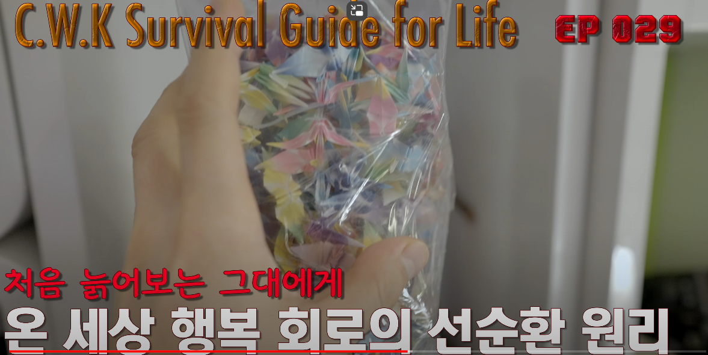

저를 통해서 객체 지향을 배운 여러분이 또 누군가에게 객체 지향을 가르칠 수 있습니다.


똑같이 가르칠 수도 있지만 여기에 보태거나 빼거나 첨삭을 해서, 아니면 자기 생각을 다듬어서 가르치는 분도 있을 거예요. 당연한 겁니다. 그게 캡슐화, 상속성, 다형성, encapsulation, inheritance, polymorphism 이걸 세 축으로 하는 객체 지향성의 본질이니까요.

 ***pay it forward*** 이 나눔의 정신도 최적화된 객체 지향 솔루션의 정말 좋은 예입니다. 

## ***간단한 게임 소스코드를 통해 배워보는 객체지향***

### ***Intro***

객체지향 프로그래밍 두 번째 맛보기 시간입니다. 너무 갑작스럽게 복잡한 객체지향 소스 코드를 들이밀면 받아들이기 어렵기 때문에 가속도 이론을 적용할 겁니다. 초반에는 천천히 친숙해지다가 후반으로 갈수록 속도를 붙여서 내리 달릴 건데요. 

뭐든 기초가 튼튼해야 하거든요. 1000m 달리기 하는데 처음부터 스프린트하면 완주 못하잖아요. 오늘은 간단히 캡슐화, 상속성, 다형성의 뼈대를 보여주는 코드를 분석해 보도록 하겠습니다. 

객체지향적인 분석 능력도 연습하면 짬밥이 쌓입니다. 처음 보는 동물이라도 종속강문계까지는 아니더라도 '대충 고양이과 동물이다' 뭐 이런 큰 범주 정도는 떠올릴 수 있는 게, 자주 봐서 그렇잖아요. 객체지향적인 분석력을 키우려면 모든 사물을 진화가 가능한 생명체로 바라봐야 됩니다. 

가령 자동차도 진화를 하잖아요. 느린 차가 빠른 차로, 일반차가 전투무기로, 나중에는 007 본드카처럼 날개도 달 수 있습니다. 그러니까 진짜 동식물만 생명이라고 생각하면 안 됩니다. 적어도 객체지향적으로는 우주 만물과 이벤트까지도 죄다 생명체, 그러니까 객체입니다. 지금 화면에 보시는 게 요즘 제가 신나게 달리고 있는 'Halo 5 Guardians'라는 게임인데요.

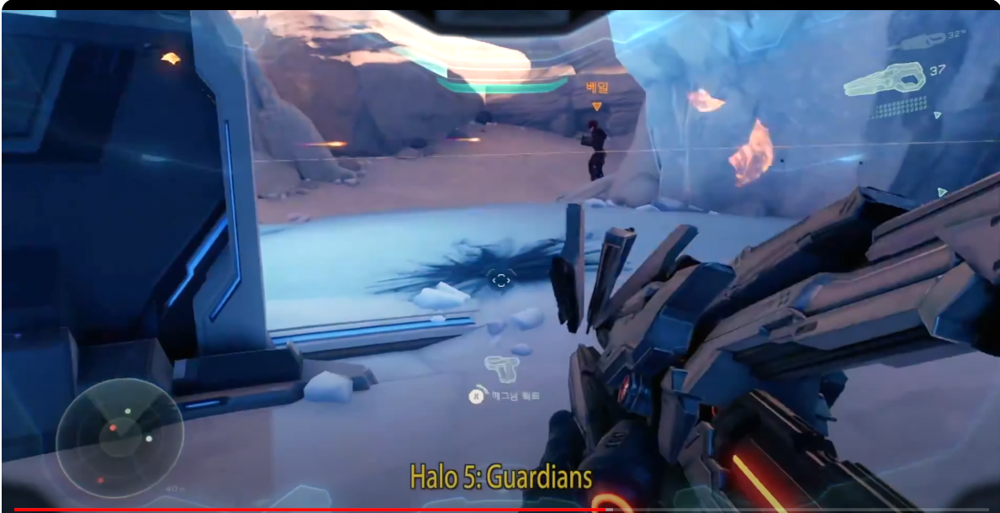

더럽게 못하죠? 제가 발컨입니다. 컨트롤이 발로 하는 컨트롤이라고 해서. 이걸 한번 객체지향적으로 분석해보도록 하겠습니다. 큰 그림으로 눈에 보이는 모든 걸 분류해보는 건데요. 

딱 봐도 일단 인간하고 외계인의 싸움이겠죠? 인간 부류와 외계인 부류로 나눌 수 있습니다. 그런 큰 부류를 객체지향 프로그래밍에서는 Class라고 합니다. 그러니까 뭐든지 비슷한 것들은 하나로 묶어보는 거예요. 그런 연습을 한번 해보세요. 

### ***Halo의 소스 코드와 객체지향***

동물은 동물끼리, 식물은 식물끼리 자동차는 자동차끼리, 비행기는 비행기끼리. 비행기하고 자동차를 하나로 봤더니 탈 것이네? 뭐 이런 거죠. Class란 말 자체가 그런 구성원들을 하나로 묶은 단위를 가리키거든요. 집합체를 가리킵니다. 그 집합체의 이름을 Class라고 하는 거죠. 인간이라는 Class를 한번 볼까요? 

Class는 그냥 개념적인 청사진에 불과합니다. 아래코드 참조

```python
class Human:
    pass

class Civilian(Human):
    pass

class Soldier(Civilian):
    pass

class Alien:
    pass

class Prophet(Alien):
    pass

class Elite(Alien):
    pass

class Brute(Alien):
    pass
```

국화빵 찍어내는 기계, 거푸집 같은 거거든요. 거푸집으로 하나하나 찍어낸 병사, 사령관, 박사 뭐 이런 인간 하나하나를  다 객체, 또는 instance, 또는 객체 instance라고 합니다.

Instance라는 말이 낯설지도 모르겠는데요. 영어로 for example, 이거를 for instance라고도 하거든요. Instance라는 게 각각의 사례를 가리켜요. 그러니까 해당 Class의 개별적인 사례라는 거죠. 찍어낸 사례, 국화빵 하나하나, 거푸집으로 찍어낸 뭔가 하나하나. 그래서 Object Instance, 또는 객체 Instance라고 하는 겁니다. 객체, Instance, 객체 Instance 다 같은 말인데요. 이 중에서 '객체'만 일반적인 포괄적 개념으로도 사용합니다.

#### ***Human Class***

여기서 지금 인간 Class라고 퉁쳐서 얘기한 건데(`Class Human:`), 인간 Class는 민간인 자손 Class, 군인 자손 Class 이렇게 나눌 수 있겠죠. 비전투원하고 전투원하고는 구분하는 게 좋을 테니까요. 이렇게 확연히 속성이나 method가 달라질 것 같으면 Class를 세분화하는 게 정석입니다. 물론 민간인도 총 들고 싸울 수 있어요. 근데 정식 군인 Class하고는 전투력이 다르겠죠. 

참고로 영어로 civilian이라고 하면 순수한 일반 시민을 가리킵니다. 관공서에서 일하는 누구도 civilian이 아닙니다. 하다못해 소방관도 civilian이 아닙니다. 

또 원한다면 민간인은 전문가, 비전문가 이렇게 후손 Class를 더 세분화할 수도 있고.

군인 Class는 장교나 사령관 후손 Class, 일반 사병 후손 Class 뭐 이렇게 새끼칠 수도 있습니다. 그러니까 꼭대기에 인간 Class가 있고 인간 Class가 군인 Class를 낳고, 군인 Class가 사병 Class를 낳는 거죠. 

사병의 아버지는 군인, 군인의 아버지는 인간, 사병의 할아버지가 또 인간. 뭐 이렇게 되는 겁니다. 물론 어차피 군인도 민간인에서 출발을 해서 훈련을 받고 군인이 되는 거잖아요. 그러니까 민간인 단계를 거쳐서 상속을 받아서 군인이 될 수도 있습니다. 

#### ***Alien Class***

그럼 Covenant라는 외계인 종족을 한번 볼까요? 아래코드 참조

```python
class Alien:
    pass

class Prophet(Alien):
    pass

class Elite(Alien):
    pass

class Brute(Alien):
    pass
```

외계 종족 class는 크게 종교적 지도자, 사제 class하고 머리가 좀 좋은데 힘은 좀 달리는, 정예부대 엘리트라는 class가 있거든요. 그리고 또 머리는 좀 딸리는데 힘은 엄청나게 좋은 brute라는 단순무식한 class가 있습니다.

수 없는 인간 직업과 외계인 종족이 등장하지만 설명하기 편하게 여기까지만 하겠습니다. 이 모든 Class들이 서로 교감을 하고 Interaction을 한다는 거를 염두에 두세요. **서로 Interaction을 할 수 있는 것들은 모두 객체**입니다. 

#### ***Weapon Class***

그럼 무기를 한번 볼까요? 아래 코드 참조

```python
class Weapon:
    pass

class Rifle(Weapon):
    pass

class AssaultRifle(Weapon):
    pass

class BattleRifle(Weapon):
    pass

class PlasmaRifle(Weapon):
    pass

class EnergyRifle(Weapon):
    pass
```

만물을 객체로 분석하라고 했죠. 하다못해 무기하고 탈 것까지도 Class로 분류할 수 있습니다. 눈에 보이는 걸 다 종류를 나눠서 분석을 해보세요. 

예를 들어서 가장 꼭대기에는 당연히 Weapon이 있겠죠. 그냥 추상화된 Abstraction Class, 그 Weapon Class를 소총(Rifle)이라는 Class로 상속받습니다. 권총하고는 다를 테니까요. 이건 긴 총이니까. 

그리고 그 Rifle을 좀 더 공격력이 좋은 AssaultRifle로 상속받습니다. 그리고 그 AssaultRifle이 더 좋다고 하기는 뭐해요. 호불호가 갈리는데 BattleRifle이라는 점사하는 총이 있는데, 조준경이 달려서 멀리 있는 놈을 쏘긴 좋거든요. 

그러니까 얘를 AssaultRifle을 곧바로 상속받아서 BattleRifle을 만든다고 할 수도 없고, 뭐 그렇게 받을 수도 있겠지만 그냥 weapon에서 상속받는 거라고 생각을 하겠습니다.

PlasmaRifle은 인간 무기가 아니고 외계인 무기거든요. 외계인 무기를 따로 구분할 수도 있습니다. 그냥 간단하게 보여 드리기 위해서 weapon에서 상속받는 걸로 설명을 했는데 EnergyRifle은 PlasmaRifle보다 더 센 건데요. 이것도 구현하기 나름이에요. PlasmaRifle에서 상속을 받아서 구현할 수도 있고, 아예 개념이 다르다 싶으면 weapon Class에서 상속받아서 만들 수도 있거든요. 

#### ***Vehicle Class***

탈 걸 볼까요? Vehicle에서 상속을 받아보겠습니다. 아래코드 참조

```python
class Vehicle:
    pass

class Mongoose(Vehicle):
    pass

class Gungoose(Vehicle):
    pass

class Warthog(Vehicle):
    pass

class BattleTank(Vehicle):
    pass

class Phantom(Vehicle):
    pass

class Ghost(Vehicle):
    pass
```

가장 꼭대기에 있는 거니까. 꼭 이런 식으로 Top Down이 아니어도 되거든요. 기업 분석할 때도 그러잖아요. Top Down 분석이 있고 Bottom Up 분석이 있다고 하는데, 예를 들어서 한국이라는 나라의, 전자 산업의, 삼성전자라는 회사 이런 식으로 위에서부터 아래로 큰 범위에서 작은 범위로 구체적으로 들어가는 분석 방식을 Top Down 방식이라고 하잖아요. 삼성전자가 속한 전자산업 이 전자산업에 속한 한국이라는 나라, 이렇게 위로 올라가면 Bottom Up이라고 합니다. 

그러니까 Class를 디자인할 때도 Top Down으로 생각할 수도 있고 Bottom Up으로 생각할 수도 있어요. 일단 뭔가 Class를 다 만들고 보니까 공통점이 보이는 거예요. 그런 공통점들을 하나로 묶어서 위로 올라가서 그 공통점만 묶은 Class를 하나 조상 Class를 다 뽑아야 되는 거죠. 다 뽑아낼 수도 있고 조상 Class가 먼저 생각이 나서 상속을 하는 Class를 만들 수도 있고. Top Down, Bottom Up 뭐 그때그때 활용을 하시기 나름입니다. 이 탈 것들도 인간의 탈 것과 외계인의 탈 것으로 나뉠 수 있거든요. 이것도 구현하기 나름이겠지만 이 Mongoose는 간단한 탈 것입니다. 그냥 타고 돌아다니는. 총이 안 달려 있어요. 이 Mongoose에다 총을 달면 Gungoose가 됩니다. 

그대로 Vehicle로 받아도 되겠지만 이 Mongoose를 만약에 이렇게 상속받을 수도 있거든요. 아래코드 참조

```python
class Mongoose(Vehicle):
    pass

class Gungoose(Mongoose):
    pass
```

Gungoose는 Mongoose랑 똑같은데 총만 달린 거예요. 그럼 총 부분만 구현을 하면 되겠죠 나머지 부분은 다 이 Mongoose에 구현이 돼 있을 테니까요.

Warthog는 Gungoose보다 훨씬 센데요. 앞에 굉장히 센 기관총이 달려 있어서 장갑차 같은 개념이죠. 이것도 뭐 Gungoose에서 받을 수도 있고 얘랑 완전히 다르다고 하면 Vehicle에서 받아서 완전히 다른 Class로 구현을 할 수도 있습니다. 

얘보다 훨씬 센 탱크도 있거든요. BattleTank, Scorpion이라는 탱크를 구현하는 방법을 새로 탱크 Class를 만들어서 할 수도 있고.

Phantom이라는 건 날틀입니다. 아래코드 참조

```python
class Phantom(Vehicle):
    pass

class Ghost(Vehicle):
    pass

class Wraith(Vehicle):
    pass

class Scarab(Vehicle):
    pass

class Banshee(Vehicle):
    pass

class GameObject:
    pass
```
    
현대 과학으로 따지면 전투기에 해당하는 건데. 미래의 우주선이거든요. 외계인의 탈 것인데요. 기본 차량에 해당하는 Ghost라는 게 있고요. 근데 얘는 총을 쏠 수 있어요. Wraith라는 거는 탱크에 해당합니다. Scarab이라는 건 엄청나게 큰 탱크고요. Banshee라는 게 날틀입니다. 재밌는 거는 이렇게 한번 생각을 해 볼까요. 

이 탈 것들을 비교를 해 봤더니 고정되어 있는 것도 있어요 안 움직이고. 탈 수는 있는데 탈 수는 있는데, 기관총 같은, 고정되어 있는 포탑 같은 그런 것들은 안 움직이잖아요. 그게 탈 것이라는 개념이거든요. 

움직이지는 않는데 내가 들어가서 뭔가 할 수 있는. 그런 것들하고 이렇게 타고 돌아다닐 수 있는 거하고 차이가 나겠죠. 아래코드 참조

```python
class Drivable(Vehicle):
    """
        Drivable Vehicles
    """

    name = 'Drivable Vehicle'

    def operate(self):
        print("Driving...")

class Flyable(Drivable):
    """
        Flyable Classes
    """

    name = 'Flyable Vehicle'
```

그럼 따로 한번 만들어 볼까요. `Vehicle`에서 상속을 받는데 운전을 할 수 있는 거 굴러가는 건 `Drivable`이라는 새로운 Class를 만드는 거예요. 그리고 날아다니는 것도 사실은 구동이 가능한 거니까 `Drivable`에서 상속을 받아도 되겠죠. Vehicle에서 받아도 되고요. 기본 기능이 똑같다면. 그냥 전투기도 활주로에서 달릴 순 있잖아요. 날개가 달렸다는 것만 다른 거지. 

그럼 `Flyable`이 `Drivable`에서 상속을 받아서 새로운 Class를 만들 수도 있는 거죠. 디자인을 하기 나름입니다.

근데 또 하나 생각해 봐야 될 게 아까 Top Down 얘기하고 Bottom Up 얘기했잖아요. 이렇게 Class들을 쭉 만들다 보니까 굉장히 중복되는 부분이 많다고 느껴지는 게 있거든요. 

이 Halo라는 Universe에도 모든 객체들이 공통점들이 있습니다. 이건 현실 속 우주 만물도 마찬가지인데 가장 대표적인 게 이름이죠. Phantom, Ghost, Wraith 이거는 Class 이름이니까요. 다른 이름들도 있을 거 아니에요. 자기들만의 고유명사 이름들이 조금씩 다를 수도 있고요. 

그럼 이 이름과 관련된 속성 그리고 method는 굳이 따로 정의할 필요가 없겠죠. 이거 뭐 Homo Sapiens라면 딱 눈에 보이는 거니까요. 죄다 공통되는 부분일테고 개성이 필요하다면 일단 상속을 받은 다음에 Overriding을 해서 다형성을 부여하면 그만입니다. 그러니까 대부분 컴퓨터 universe에는 맨 꼭대기 조상에 해당하는 범용 Object Class가 존재합니다. 

#### ***소스 코드 분석***

하다 못해 Python Universe에도 가장 꼭대기 Class에는 범용 객체 Class라는 게 존재합니다. Python에서 모든 게 객체거든요. 얘의 꼭대기 조상이 Object입니다. 그렇게 꼭대기 조상 Class를 만들어 두면 디자인을 다 하고 나서라도 공통적인 걸 뭔가 수정을 하고 싶다거나 그간 만들어진 모든 Class에 공통적으로 추가할 속성이나 method가 있는데 나중에 생각이 난 거예요. 

그럼 어떻게 하면 될까요. 꼭대기 조상 Class 처리하면 되거든요. 그 꼭대기 조상 Class를 하나 만들어 볼게요. 아래코드 참조

```python
class GameObject:
    pass

class Human(GameObject):
    pass

class Alien(GameObject):
    pass

class Weapon(GameObject):
    pass

class Vehicle(GameObject):
    pass

class Drivable(Vehicle):
    pass
```

`GameObject`라고 하나 만드는 겁니다. 이건 게임이니까. 그리고 `GameObject`에서 Human이 `GameObject`에서 상속받고 Alien도 `GameObject`에서 상속받고 weapon도 그렇게 상속받고 vehicle도 상속받고. 이런 식으로 내려가는 거죠. 그리고 `GameObject`에다가 자기가 원하는 속성 같은걸 부여를 하는 겁니다. 

> 전율할만한 객체지향 프로그래밍의 위력입니다.

`name`이라는 속성이 있다고 생각을 해보세요. 그리고 그 `name`을 세팅하는, `name`에다가 값을 저장하는 이름을 주는 그 method가 `set_name()`이고 그 이름이 뭔지 확인하는 method가 `get_name()`이라고 한다면 BattleRifle을 하나 만들어 볼까요. 아래코드 참조

```python
class GameObject:

    def set_name(self, name='Noname'):
        self.name = name

    def get_name(self):
        return self.name

class BattleRifle(Weapon):

    name = "Battle Rifle"

    def __init__(self):

        self.set_name(name = 'Battle Rifle')
```

BattleRifle을 만들 때 얘만 이름을 정해주면 돼요. name은 이렇게 해주거나(`name = "Battle Rifle"`), 이런 식으로 해주면(`self.set_name(name = 'Battle Rifle')`) 방법은 두 가지거든요. 이런 식으로 해주면 중복되는 부분은 다 위에서 상속을 받고 자기만의 개성이 생기는 거죠(`name = "Battle Rifle"`). 

Class 계층 구조를 다 만든 다음이라도 맨 꼭대기 조상 Class인 그 `GameObject`에 `name`이라는 속성하고 `set_name()`, `get_name()`이라는 두 method를 정의를 하면 곧바로 이 모든 자손 Class들이 `Human` `Alien` `Weapon` `Vehicle` 어떤 Class 객체라도 소스 코드를 추가하거나 수정할 일이 없이 `GameObject`라는 꼭대기 조상 Class에 정의된 속성하고 method를 그대로 상속 받아서 쓴다는 겁니다. 

이 Battle Rifle이 몇 단계를 새끼쳐서 나온 자손이잖아요. 저 밑에 있는 손주잖아요. 그런데도 이렇게 줄줄이 유전을 받아서 그 집안 내력을 유지를 하는 겁니다. 이런 식으로 자기 이름을 정해주면 그만인거죠. 

여기서 갸웃하실 수 있는데요. 이 `self`라는 건 뭐고 이 `init` method라는 건 뭔가. 이건 웬 뜬금없는 키워드들인가 궁금해하실 텐데 이 **self라는 키워드는 앞으로 이 Class가 거푸집으로 찍어낼 객체 Instance 자체**를 가리킵니다. 아직 개념적인 청사진만 존재할 뿐이잖아요. 실체가 없는 거거든요. 이건 지금 블루프린트만 만들어 놓은 거예요. 언젠가 찍어낼 거다 이렇게. 설계도만 그려놓은 거거든요. 그 실체를 만들기 전에 참조를 하려면 뭔가 특별한 방법이 필요하겠죠. 그게 바로 self라는 키워드입니다. '앞으로 만들어질 나'. java 같은 C++ 계열 언어에서는 `this`라는 키워드를 씁니다. `this`든 `self`든 삘이 오잖아요. '나'를 가리키니까.

이 `__init__` method는 객체 Instance가 처음 만들어질 때 자동으로 호출되는 초기화 method입니다. Constructor라고도 합니다. 미주알 고주알 따지는 프로그래머는 'Constructor랑 개념이 다르다' 이렇게 주장을 하기도 해요. 그냥 가볍게 쌩까주세요. 그런 논란은 실력 쌓인 다음에 기웃거려도 늦지 않습니다. 

또 `set_name()`, `get_name()` method에서 보듯이 모든 method의 첫 parameter는 객체 자신입니다. 아래코드 참조

```python
class GameObject:

    def set_name(self, name='Noname'):
        self.name = name

    def get_name(self):
        return self.name

class BattleRifle(Weapon):

    name = "Battle Rifle"

    def __init__(self):

        self.set_name(name = 'Battle Rifle')
```

그렇죠? 그래서 `self`를 먼저 써 주는 건데요. 해당 method를 처리할 대상이 바로 객체 자신이라는 뜻입니다. 아마 감이 아직 안 오실 거예요. 처음에는 헷갈려도 소스코드를 좀 보고 몇 번 돌려보면 언젠가는 "유레카" 하시게 됩니다. 걱정하지 마세요. 

그래서 진도를 빨리 안 나가려고 하는 거거든요. 제가 원래 성격이 되게 급한데 객체지향 프로그래밍은 뽀록질로 배우면 진짜 무간지옥입니다. 천천히 가더라도 개념을 확실히 잡으세요. 이해 안 되면 일단 멈춰서 이해될 때까지 관련 소스코드를 한 줄 한 줄 따라가면서 독해력을 키우시기 바랍니다. 프로그래밍 배울 때 제일 중요한 게 소스코드 독해력입니다. 영어 배울 때도 reading comprehension이 제일 중요해요.

지금까지 본 소스코드는 죄다 class만 정의하고 있는데요. 객체는 지금 단 한 개도 만든 게 없어요. 그러니까 설계도만 만들었고 거푸집만 만들고 돌아다녔지 건물 하나 지은 게 없어요. 

객체 Instance를 실제로 만들어야 그제야 Halo라는 게임 Universe에 해당 생명체가 태어나는 겁니다. 

잊지 마세요. 생명체라고 했지만 **모든 만물이 객체입니다.** 

객체 Instance를 만드는 방법은 간단합니다. 원하는 Class 이름을 써주고 괄호를 써주고 여기다 만약에 parameter를 줘야 된다면 argument를 넘겨야 된다면 넘기는 argument를 써주면 됩니다. 아래코드 참조

```python
a_rifle = BattleRifle()
print(a_rifle.get_name())
```

변수에 지정을 해 주면 됩니다. 그러면 이 변수가 `BattleRifle`이라는 Class가 찍어낸, 만들어놓은, Initiate한 객체 Instance의 메모리 주소를 담게 됩니다. 

그렇게 메모리 속에 사는, 메모리 Universe에 사는 객체를 참조할 수 있게 해주는 거죠. 얘 이름을 불러봐 볼까요? 아래 아웃풋 참조

output:
```
Battle Rifle
```

이름을 불렀더니 `Battle Rifle`이라고 답을 합니다. 

아까 `set_name()` method를 어떻게 정의했는지 보겠습니다. Battl eRifle이라고 되어 있잖아요. 아래코드 참조

```python
class BattleRifle(Weapon):
    """
        Battle Rifle: Human Weapon
    """

    def __init__(self):
        self.set_name(name = 'Battle Rifle')
```

`Weapon`에서 상속을 받았죠? 그럼 `Weapon`으로 가볼까요? `Weapon`으로 가보면 제일 먼저 `Weapon`도 `GameObject`에서 받았습니다. 아래 코드 참조

```python
class GameObject:
    """
        Topmost Object Class in Halo Universe
    """

    name = 'Noname'

    def set_name(self, name = 'Noname'):
        self.name = name

    def get_name(self):
        retrun self.name
```

그러니까 `GameObject`를 상속을 받았기 때문에, `GameObject`의 모든 만물, 모든 객체에는 지금 `name`이라는 속성이 있다는 뜻이고 `set_name()`과 `get_name()`으로 그 `name`이라는 속성을 설정하거나 참조할 수 있다는 뜻입니다. 

이 `GameObject`를 상속을 받은 게 `Weapon`이고요. `Weapon`은 아무것도 하는 게 없어요. 그냥 건너뛉니다. 상속을 받았기 때문에 건너뛰는 거죠. 아래코드 참조

```python
class Weapon(GameObject):
    """
        Weapon Class
    """

    pass
```

그걸 BattleRifle이 상속을 받았어요. 아래코드 참조

```python
class BattleRifle(Weapon):
    """
        Battle Rifle: Human Weapon
    """
```

상속을 받아서 이름만 바꿔주고 있습니다. 그렇게 `GameObject`에서 상속을 받은 `Weapon` Class를 또 상속을 받아서 `BattleRifle`이라는 Class를 정의를 하고 있는데요. 

그렇게 하면 이 앞에서 `BattleRifle`이라는 Class에서 객체를 instantiate를 하면 이 순간에 이 `__init__()` method가 호출이 되는 겁니다 자동빵으로. 

그런데 이름을 안 줬죠. parameter를 안 넘겨줬습니다. 그러니까 argument가 들어온 게 없으니까 default 값이 그대로 들어가는 겁니다. 그래서 `set_name()` method를 호출을 해서 이 `set_name()` method는 어디에 정의되어 있어요? 제일 꼭대기, `GameObject`라는 Class, 조상 Class에 정의되어 있는 걸 그대로 가져다가 상속해서 쓰는 겁니다. 그래서 자기 이름을 정하는 거죠.

지금 `__init__()` method를 제가 보여드리려고, Constructor를 보여드리려고 이렇게 구현을 했는데 사실 이것만 한다고 하면 이렇게 할 필요는 없어요. 그냥 자기 속성만 정의를 해주면 그만입니다(`name = 'Battle Rifle'`). 

그럼 `get_name()` method는 어디서 불러오는 걸까요? `a_rifle`이라는건 객체의 reference라고 했잖아요. 메모리 주소를 참조할 뿐입니다. 그러면 어디에 사는 객체인지 추적을 해서 그 객체의 `get_name()` method를 불러오는 겁니다. 'BattleRifle'에 갔더니 `get_name()` method가 없어요. 그럼 어디로 가야겠어요? `Weapon`, 아버지 Class로 가야겠죠. 아버지 Class로 갔더니 없어요.

그럼 어디로 가야겠어요? 할아버지 Class로 가야겠죠. `GameObject`로 올라갔더니 할아버지 Class에 있네요. 

이번에는 Vehicle Class를 한번 볼까요? Vehicle Class를 보면 좀 바꿔놨는데요. Vehicle Class를 보면 역시 `GameObject`에서 만물의 아버지인 `GameObject`에서 상속을 받습니다. 아래코드 참조

```python
class Vehicle(GameObject):
    """
        Vehicle Class
    """

    name = 'Vehicle'

    def operate(self):
        print("Operating...")
```

그리고 `name`은 `Vehicle`이라고 되어 있고요. `operate()`라는 새로운 method를 정의하고 있습니다. 다형성이 생겨나기 시작하는 거죠. 아버지는 없는 거니까. 그리고 뭔가 작동을 합니다. 이 탈 것은 움직일 수도 있고 안 움직일 수도 있다고 했잖아요.

그러니까 움직이는 건 `Drivable`라는 새로운 Class, 좀 더 발전한 Class로 상속받기로 했습니다. 아래코드 참조

```python
class Drivable(Vehicle):
    """
        Drivable Vehicles
    """

    name = 'Drivable Vehicle'

    def operate(self):
        print("Driving...")
```

좀 더 발전한 `Drivable`라는 Class도, `Vehicle`의 상속을 받는데 이름은 'Drivable Vehicle'이고 그런데 `operate()`라는 method를 Override하고 있습니다. 아버지를 무시하고 자기만의 개성을 갖게 되는 겁니다. 

`Vehicle`은 그냥 가만히 서서 작동을 하거나 그런 포괄적인 개념으로 뭔가를 구현을 했는데, 이 `Drivable`라는 Class는 운전을 하죠. 탈 것이 움직입니다. 그런 내용을 구현하겠다는 의미를 지금 추상적으로 보여드리고 있는 겁니다. 

그리고 `Flyable`도 움직이기는 해야 될 테니까 여기서(`Drivable` Class에서) 뭔가 method를 수백 개, 수천 개 만들었을 수도 있잖아요. 그걸 그대로 상속을 받으면서 자기 개성만 살리면 되는 거거든요. 그래서 `Vehicle`에서 받지 않고 `Drivable`에서 상속을 받습니다. 그리고 나서 이름은 'Flyable Vehicle'. 그 다음에 `operate()` method는 뭔가 나는 걸 구현하면 되겠죠. 날 수 있는 기능들을. 날면서 총을 쏜다든가. 뭐든지 할 수 있습니다. 아래코드 참조

```python
class Flyable(Drivable):
    """
        Flyable Vehicles
    """

    name = 'Flyable Vehicle'

    def operate(self):
        print("Flying...")
```

`Vehicle`이 제일 꼭대기에 있었죠. `GameObject`때 바로 다음에 있었습니다. 그 다음에 `Vehicle` 밑에 `Vehicle`에서 상속을 받은 Warthog라는 장갑차가 있었고요. 그러니까 인간이 타는 거고. Banshee는 외계인이 타는 날틀입니다. 외계인의 전투기 같은 거죠. 실행을 해볼까요? 아래 코드 및 아웃풋 참조

```python
a_vehicle = Vehicle()
print(a_vehicle.get_name())

a_warthog = Warthog()
print(a_warthog.get_name())

a_banshee = Banshee()
print(a_banshee.get_name())

a_vehicle = Vehicle()
a_vehicle.operate()

a_warthog = Warthog()
a_warthog.operate()

a_banshee = Banshee()
a_banshee.operate()
```

output:
```
Vehicle
Warthog
Banshee
Operating...
Driving...
Flying...
```

보시다시피 `Vehicle`의 `operate()` method는 `operating`이라고 나오죠. Warthog의 `operate()` method는 `driving`이라고 나오고 `banshee`의 `operate()` method는 `flying`이라고 나옵니다. 

설계도가 그렇게 만들어져 있으니까 당연한 거죠. 보시다시피 일단 Class 디자인을 하고 나면 `name`이라는 속성이 있고 `get_name()`, `send_name()`이라는 method가 있고 탈 것들 Class는 `operate()`라는 method가 있다. 

이것들이 다 Class의 interface인 거거든요. 이 Class들, 객체를 instantiate 했다고 하면 객체들, 이 객체의 사용법만 알면 되는 거잖아요.

실제로 프로그래밍을 할 때 다 매뉴얼들이 있거든요. 도움말들이 있고. 그 자료들을 찾아보게 됩니다. 이 객체 사용법은 어떻게 되는지. Window 프로그래밍을 할 때도, 버튼은 어떻게 사용하는지 Label은 어떻게 사용하는지, Window는 어떻게 사용하는지 다 도움말 자료가 있어요. 객체 사용법이 있고. Class 사용법이 있고. 그렇게 해서 쓰는 거거든요. 

객체를 만들고 Class를 만든 프로그래머가 지 마음대로 정한 이름들인데 어떻게 알겠어요. 유추할 수 있는 건 아니거든요. 오픈 소스라면 모를까. compile된 소스라고 하면 내용을 뜯어볼 수 있는 것도 아니고 블랙박스라고 했으니까. 그게 또 캡슐화니까 사실 뜯어보라고 하는 것도 아니거든요. 캡슐화의 장점을 버리는 거잖아요. 속이 어떻게 구현되어 있는지는 어차피 캡슐화되어 있으니까 블랙박스로 여기는 겁니다.

### ***정리***

지금까지 보여드린 게 가장 단순화한 상속성, 다형성, 캡슐화의 예입니다. 

오늘 소개해드린 소스코드는 설명을 위해서 군살을 다 빼고 아주 원시적인 형태로 만든 겁니다. 시간도 없어서 그냥 뚝딱 만든 거기도 하고 좀 지저분합니다. 

당분간 객체지향 프로그래밍 개념을 설명하기 위해서 다듬어 나갈 텐데요. 처음 말씀드렸다시피 비슷한 것들끼리 하나의 카테고리로 묶어보는 연습들을 하세요. 그 카테고리가 바로 Class가 되는 겁니다. 다 또 하나의 자손 Class들. 그런 후보가 되는 거죠. 

그러니까 언뜻 다르게 보이는 이 세상 만물을 하나의 범주로 묶어보는 비슷한 것들끼리 이렇게 묶어보는 연습을 한번 해보세요. 그러면 카테고리가 생길 거 아니에요. 동식물 카테고리가 생기듯이. 종속강문계가 생기듯이.

탈것, 날틀 이런 게 생기듯이 외계인, 인간, 군인, 민간인 이렇게 생기듯이 그런 것들을 다 나눠보는 연습을 하시면 객체지향적인 사고를 하시는데, 그런 훈련을 하는 데 큰 도움이 될 겁니다. 

그렇게 나눠본 카테고리들이 다 하나하나의 Class입니다. 그렇게 해서 찍어내 객체 instance들이 다 만들어지는 거고요. 

다음 시간에도 우주전쟁은 계속됩니다. 그때까지 객체지향적 사고 및 분석력을 연습해보시기 바랍니다.