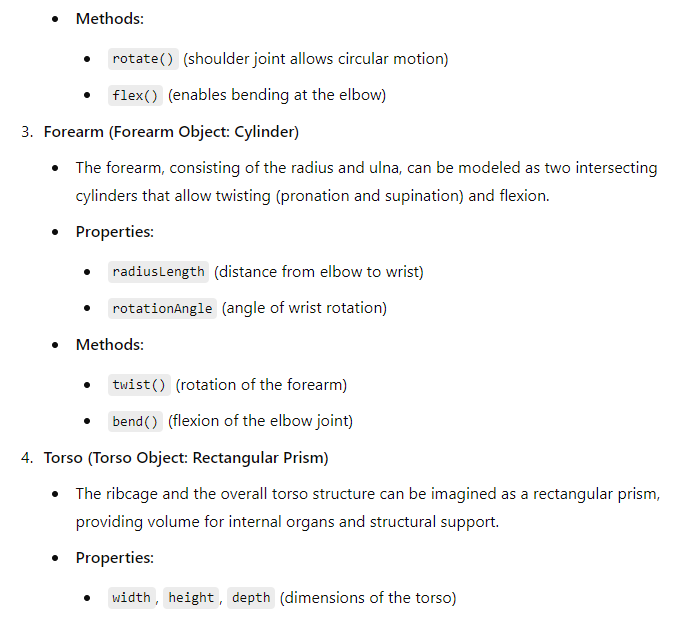

# [대두족장 인생 치트키 객체지향성 원론] Part 03 - 숙제(퀴즈)

**영상링크 : https://youtu.be/2Cyr_jDs2G8**

## ***숙제 주의 사항***

안 지키면 효과 없음

원론 part 01, 02 숙지하고 고정댓글에 달린 문제 다 풀고 오셔야 합니다.

서두를수록 시간낭비일 뿐이니 slow & steady.

---

객체지향성의 기본은 세상 만물 + 개념을 진화 가능한 생명체로 단순화하는 연습입니다.

"A와 B의 공통분모와 개성"이 아니라 "A와 B는 동일 조상 클래스에서 상속 받으며, A와 B는 다형성이 추가된다"라는 식으로 설명해야 하는 이윱니다.

말로 해야 합니다.

본인 목소리를 귀로 들으면서 하세요. 각잡고 문장이 이어지도록 또박 또박 제스처를 써가며 강단에 선 듯 설명하세요. 얼버부리면 효과 없습니다. 일타 강사가 되세요.

녹음 또는 영상 촬영하세요. 카메라 보면서 청중에게 설명하듯 하면 한결 쉽고 재미있습니다.

각 문제는 3-5분 정도 설명할 수 있어야 합니다. 단답형으로 대충하면 효과 없습니다.

정답 없습니다. 본인이 만족할 때까지 반복하세요.

---

## ***퀴즈***

### ***1***

세상 만물(개념 포함)은 속성(properties)과 메소드(methods)로 설명할 수 있습니다. 

객체지향성에서는 도트 노테이션을 사용합니다. a.name은 속성 a.speak()는 메소드입니다.

예) 렌즈
속성: lens.name = SEL2470GM
메소드: lens.zoom()

예) 유튜브 동영상
속성: vid.title = "대두족장 객체지향성 원론".vid.num_likes = 100
메소드: vid.play(), vid.pause()

다음을 속성과 메소드로 설명해 보세요. 속성은 명사/형용사, 메소드는 동사여야 합니다.

인간, 게시판 글, 피아노, 휴대폰, Ben E. King의 "Stand By Me"

---

'인간'을 객체지향적 관점에서 설명하는 관점은 여러개가 있을 수 있어. 예를 들어, 한 인간은 '이름', '키', '몸무게', '성별' 등의 속성을, 메소드는 '먹을 수 있다', '걸을 수 있다', '생각할 수 있다' 등이 있다고 설명할 수도 있지만, 더 넓은 관점 - 생물학적 관점 - 에서 설명한다면 인간은 '포유류', '척추동물', '동물' 등으로부터 상속 받고, 다른 동물들과 차별화되는 다형성이 있다고 설명할 수도 있지.

좁은 관점에서는, '나'라는 인간과 '홍길동'이라는 인간을 구분하는 관점에서 설명해볼 수도 있겠네. 같은 인간이고 같은 한반도 태생이지만 이름이 다르고, 성격도 다르고, 키, 능력치 등 많은 면에서 다르지.

넓은 관점에서는, '침팬지'와 '인간'은 같은 '포유류'로부터 상속받았지만, '인간'은 말을 할 줄 알고, '침팬지'는 그럴 수 없다는 점을 생각해볼 수 있어. 물론, '생물'과 '무생물'이라는 클래스를 생각해보면 '침팬지'와 '인간'은 같은 '생물'로부터 상속 받았다고 볼 수도 있겠고.

---

게시판 글의 속성으로는 '제목', '작성자', '작성일자' 등이 있고, 메소드로는 '저장', '삭제', '수정', '좋아요' 등이 있을 수 있는데, 이는 다른 게시판 글과 비교/대조해본다면 비교적 쉽게 설명이 가능해. 그리고 더 넓은 관점에서도 설명해볼 수도 있어. 게시판 글과 '대자보 글'은 같은 '공연성 있는 글'로부터 상속 받았다고 볼 수 있고, 그래서 제목, 내용, 작성자, 작성일자 등의 속성은 같지만, '대자보 글'은 '게시판 글'과는 달리 온라인에 게시되지 않았기 때문에 '저장', '삭제', '수정'이라는 메소드는 없다고 볼 수도 있어. 

객체지향의 렌즈를 필요할 때마다 줌 인, 줌 아웃을 자유롭게 할 수 있어야 하겠고, 그 렌즈의 배율을 경우에 따라 정확히 조절하는 것도 아주 중요한 능력이야. 렌즈의 배율을 결정하는 안목은 역시 숱한 시행착오를 통해 만들어지겠지.

---

피아노 역시 마찬가지로 좁거나 넓은 관점에서 설명할 수 있어. 한 피아노는 '브랜드', '색상', '모델명' 등의 속성을, '연주', '멈춤', '뚜껑 열기', '조율' 등의 메소드를 가질 수 있어. 한 피아노를 다른 피아노와 구별하는 관점에서, 아주 좁은 관점에서 설명해볼 수도 있겠고, '피아노'를 '오르간'과 구별되도록 하는 관점에서 본다면, 둘다 '건반악기'라는 조상 클래스에서 상속 받았지만 세밀하게 따져본다면 '피아노'와 '오르간'이 구별되는 속성과 메소드가 있다고 설명할 수도 있지. 아예 '피아노'를 '북'과 구별되도록 하는 관점에서 본다면, '악기'라는 조상 클래스에서 상속 받았지만 '피아노'는 건반을, '북'은 그 자체를 두드려서 연주하는 악기라는 점에서 다형성을 발휘하고 있다고 설명할 수도 있고. 

---

휴대폰도 같아. 한 휴대폰은 '브랜드', '색상', '모델명' 등의 속성을, '전화걸기', '문자 보내기', '인터넷', '촬영' 등의 메소드를 가질 수 있어. 한 휴대폰을 다른 휴대폰과 구별하는 관점에서 설명해볼 수 있는데, '삼성' 폰과 '아이폰'은 같은 휴대폰 클래스에서 상속 받았지만 '브랜드', '내장된 칩', '상대방에게 알림없이 통화 녹음 기능' 등 속성과 메소드 면에서 다양한 차이들을 보여. 더 넓은 관점에서 본다면, '휴대폰'과 '냉장고'는 '전자제품'이라는 조상 클래스에서 상속 받지만, '냉장고'는 '냉장', '냉동', '냉장고 문 열기' 등의 메소드를 가진다는 점에서 휴대폰과 구별돼.

---

'Stand By Me'는 '노래'야. 유형의 물체는 아니지만, 무형의 개념 역시 하나의 '객체'이기 때문에 얼마든지 객체지향적으로 설명이 가능하겠지? '아티스트', '장르', '발매일' 등의 속성을 갖고 있고, '재생', '일시정지', '멈춤', '반복' 등의 메소드를 가져. 물론, 이런 메소드를 수행하는 것이 '재생기기'라는 객체일 수 있지만, 어떤 관점에서 보느냐에 따라 메소드를 정의하는 방법도 달라질거야. 'Stand By Me'와 'Yesterday'라는 노래는 같은 '음악'이라는 조상 클래스에서 상속 받았지만, '아티스트', '발매일' 등의 속성에서는 다형성을 보이고, 메소드에서는 대부분 공통돼. 반면, 'Stand By Me'와 '피아노'는 '음악'이라는 조상 클래스에서 상속을 받았지만, 속성과 메소드에서는 많은 차이를 보여.

### ***2***

세상 만물을 그려본다면 점(vertex), 선(edge), 면(face)으로 단순화할 수 있습니다. 점->선->면 순으로 진화합니다. 면은 선에서, 선은 점에서 상속 받습니다.

세상에 곡선은 없습니다. 객체지향적으로 설명해보세요

---

세상 만물을 '점에서 면으로 진화하는 것'으로 설명한다면, '선'과 '면'은 '점'이라는 가장 원시적인 조상 클래스로부터 상속 받아 각각의 다형성을 발휘하는 것으로 볼 수 있겠어.

'점'의 속성으로는 '위치(position)'가 있겠네. 이는 '선'과 '면' 역시 일종의 '위치'라는 속성이 있다는 점에서 조상 클래스 '점'의 속성으로 보는건 타당하겠어, '점'의 메소드로는 '이동(move)'이 있어. 마찬가지로 '선'과 '면' 역시 '이동'이 가능하다는 점에서 조상 클래스의 속성으로 적합하겠어. 

'선'은 '점'으로부터 상속 받으니까 '점'의 속성과 메소드를 갖고 있지만, 다형성으로 '길이' 같은 속성은 '점' 클래스에는 없는 거야. '선'의 메소드로는 '늘리기', '줄이기' 같은걸 생각해볼 수 있겠다. 

'면'은 '선'의 연속 또는 집합이야. 선들이 일종의 닫힌 곡선을 만들면서 '면'이 돼. '선'에서 상속 받으니까 자동으로 '점'과 '선'의 속성 및 메소드를 가져. 다형성으로 '면적 확대', '면적 축소'와 같은 메소드가 있겠어.

자 이제 '세상에 곡선이 없는 이유'를 설명해보자.

우선, '곡선' 역시 '점'으로부터 상속을 받는데, '곡선'은 무한히 많은 점의 연속 또는 무한히 짧은 직선의 연속이라고 볼 수 있어. 해상도를 무한대에 가깝게 높여봐. 결국 그 매끄러워 보이던 '곡선'도 실체를 드러내면서 결국 점 또는 직선을 이어붙인 모습을 보일거야. 이건 미적분학에서 곡선의 기울기를 계산하는 원리를 생각해보면 이해가 될 거야. 곡선이 접하는 '선'을 찾아낼 수 있는데, 접하는 지점에는 '점' 또는 아주 짧은 '직선'이 있거든. 그렇게 보면 '곡선'이라는 객체나 클래스를 별도로 만들어야할 필요가 없어. '점'이나 무한대에 가깝게 짧은 '직선'을 이어붙인 것이 '곡선'이기 때문이야. 물론 특별한 경우라면 객체지향의 렌즈 배율을 조절해서 '곡선'이라는 클래스가 생각해 볼 수도 있겠지. 그렇지만, '점', '선', '면'이라는 객체와 클래스로 사실상 모든 도형이나 형태가 설명 가능해.

### ***3***

진짜 생명체만 객체로 오해하면 안됩니다. 세상 만물+개념까지도 진화 가능한 생명체로 보여야 합니다. 생물학에서 다루는 생명체가 아닙니다.

민주주의 조상 클래스를 객체지향적으로 설명하세요.

---

우선 '민주주의'는 정치 체제야. 동일하게 '민주주의'를 표방하는 나라들 간에도 구체적으로 살펴보면 엄청난 다형성들을 보이기 때문에 이 역시 객체지향 렌즈의 배율을 조절해서 비교/대조되는 객체나 클래스의 레벨이 아주 다양해질 수 있어. 

일반적인 수준에서 '민주주의'와 비교/대조되는 객체 또는 클래스를 생각해보자. '귀족제', '독재'가 떠올라. 조상 클래스를 설명하기 위해서는 공통분모를 생각하는 것이 도움이 돼. '민주주의', '귀족제', '독재'의 공통점은 뭐야? 너무 다른 것 같지만 몇가지 공통점을 찾아볼 수 있어. '권력의 배분 방식'이라는 것이고, '시민들의 대표성을 결정하는 방식', '시민들의 정치적 자유와 평등을 결정하는 방식'이라는 거야. 공통 메소드 역시 '통치', '권력행사', '입법', '사법' 등이 있겠어. 물론 저마다 속성의 정도와 메소드의 방식이 매우 다르지만 그럼에도 분명한 공통분모를 끄집어낼 수 있어. 

각 공통점을 기반으로 '민주주의'의 조상 클래스를 생각해본다면 '정치체제'가 있겠구나. 이는 '귀족제', '독재'의 조상 클래스이기도 하겠지. '정치체제'로부터 속성과 메소드를 상속 받아서 저마다의 다형성으로 overriding하는 온갖 정치체제들을 생각해볼 수 있어. 민주주의와 귀족제, 독재라는 카테고리 안에도 무수히 많은 변형들이 있잖아. 이 모든 것들의 조상 클래스는 '정치체제'일거야.

### ***4***

모든 클래스의 최고 조상 클래스는 어차피 가장 단순화된 Generic Object 여야 합니다. 따라서 특정 클래스의 조상 클래스를 찾으려면 Generic Object에서 어느 정도 진화한 종특이 드러나는 클래스여야 합니다.

```
GenericObject👉...👉Weapon👉...👉Pistol
GenericObject👉...👉Weapon👉...👉Missile
GenericObject👉...👉Vehicle👉...👉Bicycle
GenericObject👉...👉Vehicle👉...👉Helicopter
GenericObject👉...👉Vehicle👉...👉Boat
GenericObject👉...👉Vehicle👉...👉WeaponizedVehicle👉...👉Tank
```

종특 조상 클래스: Weapon, Vehicle

다시, 민주주의의 조상 클래스를 객체지향적으로 설명하세요.

---

필요에 따라 객체지향 분석의 렌즈 배율을 달리해야 하는데, 모든 생명체/비생명체, 유형적/무형적 객체의 조상 클래스라는 것도 존재하고(문제의 `GenericObject`처럼), 어떤 현상, 사물, 사람을 볼 때 곧바로 최상위 클래스만 생각해버리면 의미있는 분석이 될 수 없거든. 

'객체지향적 분석'을 치트키라고 하는건, 어떤 객체를 제대로 이해하기 위한 유일한 방법이 비교/대조이기 때문이면서 동시에 가장 쉽고 빠르게 이해할 수 있는 방법이기 때문인데, 렌즈 배율을 아무렇게나 설정하거나 대~충 광각 렌즈만 활용한다면 분석을 할 수 있겠어. 이건 마치, '세종대왕'과 '나'를 비교 분석하고 '세종대왕'을 닮기 위한 노력들을 생각해보겠다면서 막바로 '인간' 클래스로 퉁쳐버리는 것과 다를바 없어. 생각해보니 이건 성장의 가능성 없는 자뻑 종자들이 하는 짓과 동일하네. 역시 뭐든 '제대로' 해내는 것이 중요해.

'민주주의'를 파악한다면서 그와 비슷한 수준의 다른 객체를 비교/대조하는 것이 아니라 문제에서 주어진 것처럼 `GenericObject`까지 올라가버린다면 '민주주의'의 본질을 제대로 파악할 수 없을거야.

이전 문제에서 '민주주의' 조상 클래스로 '정치체제'를 살펴봤는데, 이것도 사실은 너무 상위 클래스로 올라가버린 거야. 렌즈 배율을 조금만 확대해서, 아주 약간만 윗단계로 올라가서 살펴본다면 더욱 '민주주의'를 잘 이해할 수 있어. 

예를 들어, '**다수(민중)에 의한 정치체제**'를 생각해볼 수 있어. 이 클래스는 권력이 다수, 대중, 민중에게서 나오며 그들이 직접 또는 대표를 통해 통치 과정에 참여하는 모든 정치 체제를 포함하는 거야. 이 조상 클래스 바로 아래에는 '민주주의' 클래스가 있겠고, 그 바로 아래에는 '직접 민주주의', '간접 민주주의' 등과 같은 하위 클래스들이 있지. 

'다수(민중)에 의한 정치체제' 바로 아래이면서 '민주주의' 클래스와 동등한 레벨의 클래스로는, '전체주의', '포퓰리즘' 같은 것들이 있을 수 있어. 이런 클래스/객체들은 '대중, 다수'의 뜻을 따르는 것이긴 하지만 '민주주의'와는 분명한 차이가 있잖아.

그리고 '귀족정', '독재정' 등의 조상 클래스로 '소수(개인)에 의한 통치'를 생각해볼 수 있겠지. '소수에 의한 통치' 클래스의 레벨은 '다수(민중)에 의한 통치' 클래스의 그것과 동등해. 이 둘은 '정치체제' 클래스로부터 상속을 받아 각각의 다형성을 발휘하는 것이지. 단순화해서 표현해보자면 다음과 같을 거야.

정치체제👉다수(민중)에 의한 정치체제👉민주주의👉직접 민주주의
정치체제👉다수(민중)에 의한 정치체제👉민주주의👉간접 민주주의
정치체제👉다수(민중)에 의한 정치체제👉전체주의
정치체제👉다수(민중)에 의한 정치체제👉포퓰리즘
정치체제👉소수(개인)에 의한 정치체제👉귀족정
정치체제👉소수(개인)에 의한 정치체제👉독재정

확실히 객체지향 분석의 렌즈 배율을 최대한 촘촘하게도, 최대한 넓게도 설정해보는 시도를 해보니 한 클래스/객체를 제대로 파악할 수 있구나. 그 배율을 얼마나 빠르고 정확하게, 유의미하게 설정해내느냐는 분석하는 사람의 호라이즌에 따라 결정되는 것이겠고.

호라이즌+훈련(시행착오)에 목숨을 걸어야 하는 이유야. 그래야만 진정한 객체지향 분석을 할 수 있는거잖아. 말로만 할게 아니라 계속 시도하고, 실험해봐야 진정한 치트키로 활용할 수 있는 거지.

again, 뭐든 제대로 해야해. 대충, 빨리, 마음 급하게 하면 아무 효과도 없어. 인물 분석하겠다면서 렌즈 배율 조절 한번도 안하고 그냥 '인간' 클래스로 퉁쳐버리는거야. 

잘해내는 사람들은 원래 천재이거나 그만큼 노력을 많이 했기 때문이야. 나랑은 아무런 상관이 없어. 뱁새가 황새를 쫓아가다가 가랑이가 찢어지는 법이지. 나는 나만의 여정을 가면 돼.

서유기의 손오공을 봐. 이미 근두운을 타고 한번에 수만리를 날 수 있었지만, 결국 부처님 손바닥 안이었고 14년간 81개의 고난을 겪어내야 비로소 성불할 수 있었어. 손오공보다 능력은 부족하지만 훨씬 빠르게, 쉽게 도달한 천재도 분명 있었을 거야. 석가모니는 6년의 고행 끝에 비로소 깨달음을 얻었지만 입적하는 80세까지 끝없이 수행했다고 하잖아.

조금 느리더라도 제대로 해내는게 중요한거야. 물론, 그게 24 x n의 크기가 작은 것에 대한 변명이 되어선 안되겠지.

### ***5***

내연기관차와 전기차의 차이를 객체지향적으로 설명하세요.

조상 클래스, 상속성과 다형성이 드러나야 합니다.

---

우선 내연기관차(Internal Combustion Engine Vehicle)와 전기차(Electric Vehicle)의 공통점부터 생각해보자. 객체지향 분석의 step 1은 상속성부터 캐치해내는 거니까.

둘다 `차량(Vehicle)`이라는 조상 클래스로부터 상속을 받았을 거야. 조상 클래스를 쉽게 찾는 방법 중 하나는 그 단어의 어원 또는 단어에 상위 클래스 개념의 단어가 있는지를 살펴보는거야. 

그런데, `차량`에도 여러 종류가 있고, 여러 레벨의 하위 클래스들이 있어. 객체지향의 렌즈 배율을 조절해봐. `Flyable`, `Drivable`과 같은 하위 클래스들도 있겠지? 아니면 그냥 속성으로 `차량`이 `Flyable`, `Drivable`을 가지면서 그 값을 `True` 또는 `False`로 설정하는 것도 가능할거야.

그럼 `차량` 클래스 아래에 `전기차`, `내연기관차` 클래스들이 오면 되겠다. 객체지향 분석의 목적이 어디에 있느냐에 따라 클래스를 어떻게 설정할지가 달라져. 렌즈를 빠르게, 천천히 조절해보면 충분해.

내연기관차와 전기차의 조상 클래스로 `차량` 클래스를 파악했으니, `차량` 클래스의 속성과 메소드만 생각해보면 내연기관차와 전기차가 어떤 점을 상속 받았고 어떤 점에서 다형성을 발휘하는지 파악해보는 것이 용이해졌어. 

`차량` 클래스로부터 상속받은 속성들로는, `동력원`, `운행 방식`을 생각해볼 수 있어. 상속받은 메소드로는 `이동`, `정지`, `가속`, `감속` 등이 있겠지.

내연기관차와 전기차의 가장 큰 차이는 `동력원`에 있어. 내연기관차는 `기름`을, 전기차는 `전기`를 동력원으로 사용해. 내연기관차는 `기름`으로 작은 폭발을 일으켜서 동력을 만들어내고 실린더를 움직여서 운행하는 반면, 전기차는 `전기`를 배터리에서 가져와서 모터를 움직여서 운행해.

렌즈 배율을 아주 확대해서 살펴보면, `전기차`는 Software Defined Vehicle(SDV)의 중요성이 부각될 정도로 `소프트웨어`의 역할이 크고(점차 커지고 - 결국 전기차 기업의 경쟁력은 차량과 소프트웨어 친화성을 얼마나 잘 구현해내느냐에 달려있다고 볼 수도 있어), `내연기관차`는 `하드웨어`의 역할이 크다는 점도 생각해볼 수 있어.

렌즈 배율을 조절하면서, 어떤 관점에서 볼지에 따라 다양한 설명이 가능해지는 걸 다시 한번 확인했어. 

### ***6***

한국어, 영어, 일본어, 중국어의 조상 클래스를 설명하세요.

한국어, 영어, 일본어, 중국어의 상속성과 다형성을 설명하세요.

그 언어를 몰라도 상식선에서 객체지향적으로 설명은 할 수 있어야 합니다.

---

객체들의 조상 클래스를 찾으려면 우선 상속성부터 뽑아야겠지.

일단, `의사소통의 수단`이고 `매개`야. 자신의 감정을 표현하거나, 정보를 전달하거나, 명령을 내리거나, 질문을 하기 위한 수단으로 활용된다는 의미지.

그리고, `사고의 수단`이기도 해. Yann LeCun 같은 학자는 '사고하기 위해 언어가 반드시 필요한 것이 아니다'라는 취지로 말하고, 
확실히 수학적인 부분은 반드시 언어가 필요한 것이 아니긴 하지. 그러나, 언어가 없다면 대부분의 사고 범위는 제한될 수 밖에 없고, 언어로 인해 사고의 선명함이 증가되는 것은 부인할 수 없어. 사고의 폭이나 풍부함이 언어에 의해 제한되기도, 넓어지기도 한다는 점에서 사고와 언어는 아주 밀접한 관련이 있다고 봐야해.

문득 '수학적 개념'으로만 의사소통하는 외계 종족을 떠올려 볼 수도 있겠어.

한국어에만 국한된 것이 아니라 영어 단어까지 생각해보면 더욱 선명하고 풍부한 사고가 이뤄질 수 있잖아. 사고와 언어의 관련성은 절대 무시할 수 없어.
예를 들어, 'Procrastination'라는 단어를 생각해보자. 한국어로는 '미루기', '행동 지연' 정도로 번역할 수 있지만, 'Procrastination'은 단순한 지연이라기 보다는 '안좋은 결과'를 예상하면서도 미루는 행동을 의미해. 결국 'Procrastination'을 행하는 사람의 심리적, 패턴적 특성이 중요한 의미를 담고 있다는 거야. 이렇게 사고의 폭과 깊이가 더해지는거지.

그리고 각 언어는 `문자`를 갖고 있어. 내가 아는한 모든 언어는 그에 상응하는 `문자`가 있어. `문자`가 있다면 그에 맞는 `문법`도 존재하지. 문법을 활용할 때 비로소 언어는 '단순한 문자의 나열'에 그치지 않을 수 있어. `문법`으로 인해 그 문자들이 의미를 갖게 되고, 그 의미를 통해 저수준 또는 고수준의 `의사소통`이 가능해져.

영화 'Arrival'에 등장하는 외계의 언어까지 생각해보자. 'Arrival'에 등장하는 외계의 언어는 시간의 흐름을 '비선형적'으로 인식할 수 있게 하는 언어로, '시간'적인 개념까지 '언어'로써 표현할 수 있는 언어야. 

영화 한편이 주는 통찰과 호라이즌이 너무 다양하네. 나는 'Arrival'을 통해 자신의 운명을 바꿀 수 있는 '선택의 힘'만 알아차렸다고 생각했는데 부지불식 간에 언어학적 호라이즌까지 조금이나마 넓힐 수 있었어.

그리고 컴퓨터 언어도 생각해볼 수 있어. 'Python', 'C', 'C++' 같은 것들. 나는 Python만 찔끔 아는 수준이지만, 각 언어마다의 `문자`와 `문법`이 있고, 그 `문자`와 `문법`을 통해 `의사소통`이 가능해지는거야. 그리고, 컴퓨터 언어 역시 `사고의 수단`이 될 수 있지.

청각 장애인들의 수화도 언어야. 수화의 동작을 그림으로 그리면 `문자`가 되고, 그 `문자`들의 조합이 `문법`이 되고, 그 `문자`와 `문법`을 통해 `의사소통`이 가능해지는거야. 그리고, 수화 역시 `사고의 수단`이 되는거지.

언어들은 모두 `의사소통의 수단`이고, `사고의 수단`이고, `문자`와 `문법`을 가지고 있다는 사실을 알 수 있어.

소름 돋는다. 외계의 언어부터 청각 장애인들의 언어까지 객체지향적으로 분석하면 비교 대조가 가능해지고, 더 선명하게 이해할 수 있어.

그야말로 치트키구나. 모든 개념은 비교와 대조를 행할 때 비로소 온전히 이해될 수 있어. 

자 이제 한국어, 영어, 일본어, 중국어의 조상 클래스를 생각해보자. 가장 쉽게 생각해볼 수 있는 조상 클래스는 `인간의 언어` 클래스야.

아니면 `Language` 클래스에 `Human=True` 라는 속성을 넣어서 `HumanLanguage`와 `AlienLanguage`의 클래스 구분을 할 수도 있어. 

`인간의 언어` 클래스와 동등한 래스로는 `컴퓨터 언어`, `외계어` 등이 있겠네. `외계어`는 아직 발견된 것이 없지만, 'Arrival'에 등장하는 외계의 언어를 객체로 생각해볼 수 있겠어.

`Language` 클래스는 `의사소통`, `문자`, `문법`을 가지고 있어야겠지. 그리고, `인간의 언어` 클래스의 하위 클래스로 `동양 언어`와 `서양 언어`라는 클래스가 있어. 그런데, 단순히 지역적인 분류로 나누는 것보다는 특징으로 구분하는 것이 그 언어의 특징을 더 잘 파악
하기 쉬울 수 있어. 그렇게 따지면 족장님께서 말씀해오셨듯, 중국어와 영어를 한 그룹으로 묶고, 한국어와 일본어를 한 그룹으로 묶는 것이 적절할 수 있어.

일단 나의 지식 범위 내에서 지역적인 분류로써 `EasternLanguage`와 `WesternLanguage`로 구분해보자. Python에서는 가급적 객체나 클래스를 소문자로 시작하는 것이 관례라고 해. 이건 pep 8의 가이드이기도 하지.

하지만, 오늘은 선명한 사고를 위해 약간의 예외를 허용하자.

`한국어`와 `영어`, `일본어`, `중국어`들의 조상 클래스를, `Language` 클래스 또는 `HumanLanguage`로 정의하고, 속성들로는 `communication`, `thinking`, `characters`, `grammar`들을, `describe`라는 단순한 메소드를 생각해볼 수 있어.

그리고 그 하위 클래스로 지역적 분류에 따라 'EasternLanguage'와 'WesternLanguage' 라는 하위 클래스들을 생각해볼 수 있겠지. 지역에 따른 하위 클래스들에는 `region`이라는 속성으로 overriding 할 수 있어.

그리고 `한국어`, `영어`, `중국어`, `일본어`의 각 객체들은 조상들로부터 속성과 메소드를 쭉 상속받으면서 저마다의 독특한 특성을 통해 다형성을 보여줄 수 있겠지.

와 이쯤되니까 언어에 관한 호라이즌의 한계를 느끼게 되는데 그래도 더 나아가보자.

일단 한국어의 특징으로는, 아주 뚜렷한 `높임말` 체계가 있어. `높임말`은 한국어의 가장 큰 특징 중 하나로 상대에 대한 존경이나 예의를 아주 세밀한 수준으로까지 표현할 수 있어. 

영어의 특징으로는, `관사`의 사용이 아주 뚜렷해. `a`, `an`, `the`와 같은 관사들을 사용해서 명사를 구체화하거나 일반화할 수 있어.

중국어에서는 `성조`가 아주 뚜렷한 것으로 알고 있어. 

일본어의 뚜렷한 특징은 잘 모르겠지만, `가타카나`를 통한 외래어의 적극적 수용이 그 특징 중 하나로 알고 있어.

언어학에 대한 호라이즌이 넓고 깊은 사람들은 이런 특징들을 통해 언어의 특성을 파악할 수 있겠지. 그리고 그 특징의 정도를 아주 세밀하게 구분할 수 있는 속성들까지 파악할 수 있을거야. 이렇게 생각해보니, '객체지향적 분석과 사고'의 핵심은 결국 '호라이즌'이라는 것을 느끼게 된다. 

나는 `지역적 특징`으로만 분류했지만, `언어학적 특징`으로 분류한다면 또 다른 결과가 나올 수 있겠지. 그 외에 `기원`에 따른 분류를 할 수도 있을 것 같아.

언어학적 호라이즌이 아주 풍부한 사람의 객체지향적 분석이 너무 궁금하다. 그런 사람이라면 각 언어의 특징을 통해 그 언어가 가지는 '문화적 특성'까지 고려해서 분석이 가능할거야. 

---

저의 위 썰을 GPT o1-preview 에게 인풋으로 넣고 분석을 맡겼더니 다음과 같이 답변을 하였습니다.

객체지향적으로 언어들을 분석할 때, 풍부한 언어학적 호라이즌을 통해 각 언어의 
문화적 특성까지 고려해보자. 먼저, 모든 언어는 의사소통과 사고의 수단이며, 
문자와 문법을 가지고 있다는 공통점이 있다. 이 점을 기반으로 최상위 클래스인 Language를 정의할 수 있다.

그 다음으로 언어의 기원과 계통에 따라 하위 클래스를 나눌 수 있다. 
예를 들어, 인도유럽어족의 영어, 중국티베트어족의 중국어, 알타이어족의 
한국어와 일본어 등이 있다. 각 언어족 클래스는 해당 언어들이 공유하는 
문법적 특징과 역사적 배경을 속성으로 가질 수 있다.

이제 개별 언어로 내려와서, 각 언어의 독특한 특징을 생각해보자. 
한국어는 높임말 체계를 통해 사회적 위계와 예의를 표현하는 데 탁월하다. 
이는 한국 문화에서 존중과 조화를 중시하는 가치관이 반영된 것이다. 
또한, 한글이라는 독창적인 문자 체계를 사용하며, 음소 문자로서 발음과 문자의 일치도가 높다.

영어는 관사를 통해 명사의 특정성과 수를 명확하게 구분한다. 
이는 개체의 개별성과 명확성을 중요시하는 서구 문화의 영향을 받았다. 
또한, 라틴 문자를 사용하며, 전 세계적으로 통용되는 국제어로서의 지위를 가지고 있다.

중국어는 성조를 사용하여 단어의 의미를 구분한다. 
이는 중국어가 단음절어 중심의 언어이기 때문에 음의 높낮이로 의미를 
풍부하게 만드는 방법이다. 한자를 사용하는데, 이는 표의 문자로서 
하나의 글자가 의미를 담고 있어 역사와 전통이 깊다.

일본어는 가타카나를 통해 외래어를 적극적으로 수용한다. 이는 일본 
문화가 외부의 것을 받아들이고 자신들의 것으로 재해석하는 데 
능숙하다는 것을 보여준다. 또한, 히라가나, 가타카나, 한자를 혼용하여 사용하는 복잡한 문자 체계를 가지고 있다.

이러한 분석을 통해 각 언어의 문화적, 역사적 배경과 그에 따른 
언어적 특징을 객체지향적으로 모델링할 수 있다. 이는 단순히 
언어의 구조를 이해하는 것을 넘어, 그 언어를 사용하는 사람들의 
사고방식과 문화까지 깊이 있게 파악하는 데 도움을 준다. 
결국, 객체지향적 분석은 우리의 호라이즌을 넓혀주며, 서로 
다른 언어와 문화 사이의 공통점과 차이점을 명확하게 
이해할 수 있게 해주는 강력한 도구임을 다시 한 번 깨닫게 된다.

### ***7***

음악 배울 때 다장조(C Major)와 라단조(A Minor)에서 출발하는 이유를 객체지향적으로 설명하세요.

---

나의 음악 관련 호라이즌이 극히 좁기 때문에 아주 기초적인 수준에서만 썰을 풀 수 있을 것 같아.

우선 장조와 단조의 개념부터 생각해보자. 다장조(C Major)는 'C(도) - B(시)'의 음들로 이뤄져있어. C로 시작하기 때문에 C Major가 되는 거지. 라단조(A Minor)는 'A(라) - G(솔)' 음들로 이뤄져있어. 마찬가지로 A로 시작하기 때문에 A Minor가 되는 거지. 내가 알기로 장조와 단조는 '온음 - 반음'의 구성으로 구별되는데, 더 간단히는 노래의 끝나는 음이 '도'냐, '라'냐로 대략적인 파악이 가능해.

특히 C Major와 A Minor는 반음 올리거나(#) 내린(b) 음을 쓰지 않고 화음도 그 안에서 결정돼. 이건 피아노를 기준으로 보면 검은 건반은 쓰지 않고 흰 건반만으로 연주가 가능한거야.

즉, A 음으로 시작해서 검은 건반을 쓰지 않으면 A Minor가 되는 거고, C 음으로 시작해서 검은 건반을 쓰지 않으면 C Major가 되는 식이지.

그리고 여기서 적절히 검은 건반을 추가하면서 변화를 주면 여러 조성을 만들어낼 수 있어.

결국, C Major와 A Minor는 아주 기본적인 클래스에 해당돼. 이 둘은 검은 건반, 반음을 사용하지 않기 때문에 가장 단순한 구조를 갖고 있어. 

그래서 피아노를 배울 때도 가장 먼저 배우는 것이고, 간단하게 익힐 수 있는 조성인 거지.

음악을 처음 배울 때 복잡한 조성, 검은 건반들을 가득 사용한 조성들부터 배우면 그 많은 조성들을 전부 개별적으로 외우고 익혀야 하니까 어떤 패턴이나 체계를 파악하기 너무 힘들어. 반면 처음부터 C Major와 A Minor를 익히면 그 다음부터는 그 토대에 적절히 개성들만 부여하는 식으로, 마치 레고에서 foundation block을 만들어 놓고 그 위에 여러 블럭들을 쌓으면서 온갖 것들을 만들어내는 것과 같아. 그래야 큰 그림이 보이고 조성에 대한 이해도와 응용력이 높아질 수 있어.

이렇게 보면 온갖 다양한 조성들의 조상 클래스를 C Major와 A Minor로 정의할 수 있고, C Major와 A Minor에서 상속 받은 속성과 메소드를 기초로 조금씩 변화를 부여하면서 다형성을 발현하면 얼마든지 다양한 조성들을 만들어낼 수 있어.

그래서 음악을 배울 때 C Major와 A Minor에서 출발하는 것이 효율적이고 효과적인 거야.

---

마찬가지로 GPT o1-preview 에게 물어봤습니다. 이번에는 그냥 질문만 던져봤는데, 아주 깔끔하게 답변을 해준 것 같습니다.

다른 인풋 지식도 없고, pre-trained된 모델 그 자체라서 질문만으로 모든 맥락과 내용을 파악하고 답변한 것입니다.


### ***8***

그림 배울 때 기본 도형(정육면체, 구, 원통, 원뿔)을 활용하는 이유를 객체지향적으로 설명하세요.

---

사실 질문 자체에 많은 힌트가 있어. 예를 들어 질문이 '그림을 배울 때 어떤 형체를 활용해야 하는가', '어떤 단계부터 시작해야 하는가' 였다면 답을 생각해내기가 무척 어려웠을거야. 그런데 이 질문은 '기본 도형을 활용해야 한다'라는 당위를 제시하고 있고, 지금 '객체지향'을 응용하고 적용해보는 연습을 하고 있기 때문에 답이 어느 정도는 제시된 것 같아.

일단, 세상은 3D이고 이를 캔버스든 화면에든 2D라는 차원으로 축소해서 표현하는 것이 그림이고 drawing이야. 삼체에도 나오는 '**차원 축소**' 공격을 생각해봐. 차원을 축소할 때는 많은 것들을 생략해야돼(그래서 차원 축소 공격이 그토록 강력한 거겠지). 그래서 일단 3D의 입체감있는 만물들을 2D로 표현하기 위해서는 형태에서 어떤 요소가 특징적인지를 잘 포착할 수 있어야 돼. 이를 가려낼 줄 아는 '눈'이 중요하다는 거야. 다른 형태와 비교할 때 어떤 요소가 특징적인지를 알아내려면 그 형태의 껍데기 안에 있는 '속살'을 볼 줄 알아야해.

결국 가장 기본이 되는 간단한 도형들부터 제대로 표현할 줄 알아야 해. 그리고 나서 그런 기본 도형들에 여러 변형을 주면서 복잡한 도형들을 그려낼 수 있겠고, 그렇게 그려낸 복잡한 도형들을 조합해서 더 복잡한 도형들을 만들어낼 수 있어. 그리고 이 과정을 통해 세상의 3D 만물을 그려내는 것이 훨씬 쉬워질거야.

예를 들어, 빌딩을 생각해보자. 빌딩은 아주 단순하게 생각해보면 직육면체야. 그리고 직육면체는 정육면체의 변형이지. 처음부터 '빌딩' 그 자체를 그리려 한다면 그 복잡성 때문에 너무 어려울거야. 다시 강조하지만, 그림은 차원 축소의 예술이야. 빌딩에서 중요한 것들과 중요하지 않은 것들을 가려낼 수 있어야 하고, 중요한 것들을 간결하게 표현해낼 수 있어야 해. 그러려면, 빌딩을 구성하는 가장 기본적인 형태인 직육면체를 제대로 그릴 줄 알아야 '어떤 요소가 빌딩 답게 보이도록 하는가', '저 빌딩과 다른 빌딩의 차이점은 어디서 오는가' 같은 것들이 포착될 거야.

마찬가지로, 에펠탑을 그린다고 생각해보자. 에펠탑의 기본 도형은 원뿔 또는 삼각뿔이라고 할 수 있어. 에펠탑을 축소된 차원에서 표현하기 위해서는 일단 원뿔 또는 삼각뿔부터 제대로 그릴 줄 알아야겠지. 그리고 그 원뿔 또는 삼각뿔에 여러 변형을 주면서 '에펠탑으로 느껴지도록', '에펠탑으로 보여지도록' 그려낼 수 있을거야. 그런 다음에 에펠탑들의 배경이라든가 에펠탑 주변까지 신경쓸 수 있겠지. 만약 원뿔 또는 삼각뿔을 제대로 그려낼 수 없다면 에펠탑을 그리는 것은 무척이나 어려울거야. 아니 불가능할지도 몰라.

사람을 그릴 때도 마찬가지야. 사람을 크게 머리, 몸통, 팔, 다리로 구분할 수 있을텐데 각각은 구, 직육면체, 원통으로 표현할 수 있어. 이 역시 차원축소의 예술이기 때문에 반드시 뭔가를 생략하고 뭔가는 강조해야할텐데, 가장 기초적인 형태에 해당되는 기본 도형들을 잘 표현하고 활용할 수 있어야만 그 위에 레고 블럭들을 쌓아가듯 더 복잡한 형태들을 그려낼 수 있을거야.

가장 복잡한 구조물이라 할 수 있는 '사그라다 파밀리아'를 생각해보자. 가우디가 '사그라다 파밀리아'를 그려내기 위해 여러 기본도형들을 활용했다는건 알려진 사실이야. 세상 복잡해보이는 그 구조물조차 여러 다양한 기본도형의 조합이고 변형이며 다형성 of 다형성이라는 거지. 가우디가 건축과 그림 실력을 기르는 과정을 잘 모르지만, 분명히 '기본 도형'을 그 누구보다 능숙하게 다뤘을 것이라는 건 분명할거야.

객체지향적으로 정리해보자면, 세상의 만물들은 3D에 해당되고 그 조상 클래스에는 기본 도형 클래스가 있어. 그리고 그 기본 도형 클래스로부터 상속받은 속성과 메소드를 활용해서 다양한 도형들을 만들어낼 수 있는거야. 그리고 그런 도형들에서 각각의 개성과 다형성들을 overriding한다면 그럴듯한 차원 축소가 가능해질거야. 

bottom-up 방식으로 접근한다면, 어떤 사물이나 형태를 그리려고 할 때 abstraction을 통해 그 사물이나 형태를 가장 기초적인 형태로 분해해볼 수 있겠고, 그렇게 한다면 훨씬 쉽게 '차원 축소'를 할 때 중요한 것과 중요하지 않은 것들을 구분해낼 수 있을거야. 

이는 달리 말하면, drawing에서 기본 도형들을 잘 그리는 것이 그야말로 '기본기'에 해당된다고 볼 수 있는거야. 기본기라는 펀더멘털이 탄탄해야만 그 위에 거대한 성이든, 아파트든, 복합 쇼핑몰이든 올릴 수 있는거야. 그림을 배우려 한다면 다양한 형태와 실물들을 그리는 것도 중요하지만 그보다도 기본 도형을 능숙하게, 잘 그려낼 줄 아는 능력부터 갖춰야할 거야. 그림 뿐만 아니라 모든 배움에 있어서도, 기본적인 구조와 원리를 먼저 잘 이해하고 익히는 것이 중요하겠지.

---

GPT o1-preview 에게 물어봤습니다. 이번에도 그냥 질문만 던져봤는데, '객체지향적'이라는 맥락은 다소 약하게 포함이 되어 있는 것 같습니다. 그래도 중요한 원리나 개념들에 대해서는 짚어내고 있네요.


### ***9***

인체(여러분 몸)에서 정육면체, 구, 원통, 원뿔 등 기본 도형에서 진화할 수 있는 부위를 찾아 객체지향적으로 설명해보세요.

예) 머리의 상악 위쪽 부분(아래턱이 하악) 두개골은 구에 해당하고 상완은 원통 또는 직육면체에 가깝습니다.

---

인체를 잘개잘개 쪼개보자. 마치 발골을 하듯 말야. '인체를 발골한다'는 표현이 조금 섬뜩하긴 하지만 인체 각각의 부위에서 기본 도형들을 찾아내기 위해선 가장 적합한 표현이니까.

하체는 크게 발바닥과 발가락, 종아리, 대퇴부로 나눠져. 발목 아래는 발가락과 발바닥으로 나눌 수 있고.
상체는 크게 손바닥과 손가락, 전완, 상완, 복부-가슴/등, 목, 두개골로 나눌 수 있어.

이 중에서 `대퇴부-정강이-발바닥-발가락`과 `상완-전완-손바닥-손가락`의 속성과 메소드는 서로 매우 비슷해. 어느 한쪽이 다른 한쪽을 상속 받았다고도 표현할 수 있을 정도야. 관절의 개수와 자유도, 움직임의 범위가 비슷하고 뼈의 구조도 비슷해. 물론 세밀하게 들어가면 `상완-손가락`의 자유도가 `대퇴부-발가락`의 것보다 더 높고 관절의 개수도 많지만, 기본적으로는 비슷하다고 봐도 무방하지.

`대퇴부-정강이`와 `상완-전완`의 기본 형태는 모두 `원통`을 상속 받고 있고, 메소드로 '접었다 펴거나 회전하는 동작'을 상속 받고 있어. 좀 더 세밀하게 들여다보면서 다형성을 파악해보자.

우선 `대퇴부`는 `정강이`를 접었다 펴는 메소드를 위해 대퇴이두근과 대퇴사두근이 붙어 있어. 그리고 이와 비슷한 구조로 `상완`은 `전완`을 접었다 펴는 메소드를 위해 상완이두근과 상완삼두근이 붙어 있지.

대퇴이두근과 대퇴사두근의 크기가 상완이두근과 상완삼두근의 크기보다 다소 크고 두께도 상완의 그것들보다 두꺼운 식으로 다형성을 발현하고 있어. 잘 발달된 대퇴부의 근육들은 구에 가까운 형태를 보여주기도 하지. 상완부의 근육들은 아무리 발달해도 구에 가까워지지는 않거든.

마찬가지로 정강이의 신근과 굴근이 전완의 신근과 굴근보다 다소 크고 근육의 두께도 더 두꺼워. 그러면서도 각각 발바닥을 접었다 펴거나 회전하는 메소드, 손바닥을 접었다 펴거나 회전하는 메소드를 상속 받고 있지.

즉 `대퇴부-정강이`와 `상완-전완`은 기본적으로 `원통`이라는 형태적 속성과 '접었다 펴는' 동작을 상속 받지만 크기와 모양에서 다형성을 보여주고 있어.

`발바닥-발가락`과 `손바닥-손가락` 역시 비슷해. 마찬가지로 어느 한쪽이 다른 한쪽을 상속받았다고도 표현할 수 있겠어. 

`발바닥`과 `손바닥`은 기본도형 중 직육면체로부터 상속 받았어. 다만, `발바닥`은 옆에서 보면 삼각뿔에 가까운 모습으로 다형성을 보여주고 있고, `손바닥`은 높이가 낮고 가로와 세로 길이가 비슷한 모습으로 다형성이 발현되고 있어.

`발가락`과 `손가락`은 기본도형 중 원통으로부터 상속을 받고 있는데, `발가락`은 앞으로만 뻗어있고 자유도가 그리 높지 않은 다형성을, `손가락`의 경우 네 개는 앞을 향해 뻗어 있지만 엄지손가락은 옆으로 뻗어있어. 그리고 `손가락`은 `발가락`보다 훨씬 높은 자유도를 다형성으로 보여주고 있어. 메소드는 똑같이 뭔가를 잡거나 펼 수 있어. 물론 그 정도에서는 다형성을 보여주고 있지.

`복부`에서 `가슴/등`까지 이어지는 몸통의 기본 형태는 두툼한 직육면체로부터 상속 받고 있어. 그러면서도 광배근, 승모근, 능형근, 소원근이 등의 입체감을 더해주고, 대흉근, 소흉근, 복사근과 복직근이 가슴과 복부의 입체감을 더해주고 있지. 구체적으로 보자면 광배근은 기본도형 삼각뿔로부터, 승모근은 기본도형 원뿔로부터 상속받고 있고, 대흉근은 기본도형 직육면체로부터 상속받고 있어. 더 세밀하게 보자면 근육들은 근섬유의 다발이기 때문에 작은 원통들의 집합체로 볼 수도 있겠지.

`목`은 기본도형 중 원통으로부터 상속받고 있어. 다른 부위보다도 목은 기본도형에서 다형성을 많이 부여하지 않는 형태를 보여주고 있네. 그 안으로 들어가면 온갖 다양한 근육들이 가장 중요한 목의 신경과 혈관들을 보호하면서 두개골을 여러 방향으로 움직이도록 하는 메소드를 갖고 있어. `목`의 메소드는 몸의 다른 부위와 달리 '회전'이 강조되고 있어. 

두개골은 구로부터 상속 받고 있어. 그러면서 눈, 코, 입, 귀라는 다양한 구조물들이 붙어서 일반적이고 기본적인 구와는 다른 개성/다형성을 보여주고 있지. 구체적으로 보자면, 눈은 작은 구형, 코는 삼각뿔, 입은 직육면체, 귀는 원뿔로부터 상속 받고 있어. 

정리하고 보니 인체는 크게 `목(원통)-두개골(구)`, `상완(원통)-전완(원통)-손바닥(직육면체)`, `대퇴부(원통)-정강이(원통)-발바닥(직육면체)`의 구조물들이 `등/가슴/복부(직육면체)`에 붙어있는 형태로 이뤄져있네. 목의 근육들이 두개골을 움직이는 메소드, 상완이 전완을 움직이는 메소드, 전완이 손바닥을 움직이는 메소드, 대퇴부가 정강이를, 정강이가 발바각을 움직이는 메소드를 갖고 있고, '접었다 편다'는 메소드를 모두 상속받고 있다고 볼 수도 있지. 

만약 인체의 형태를 아주 간단한 도형으로 표현하자면, `원통과 그에 딸린 직육면체`로 표현할 수 있을 것 같아. 원통이 직육면체를 움직이는 거지.

결국 인체는 `원통`과 `직육면체`의 형태, '접었다 펴거나 회전하는' 메소드를 상속 받아서 그 필요와 움직임에 따라 구체적으로 뼈와 근육을 더하거나 빼는 식으로 다형성을 보여주고 있어.

정말 발골이라도 한 기분이네. 그러면서도 객체지향의 섭리가 인체 곳곳에 녹아있는 걸 발견하니 새삼 놀랍고 신기하다.

게임 The Last of Us 2에서 주인공 엘리가 좀비들이 온갖 다형성을 발현하며 진화한걸 보고 'Fucking Nature'라고 외치던 장면이 떠올라. '진화'와 '객체지향'은 정말 소름끼치도록 효율적이고 놀랍네.

---

GPT에게 물어봤습니다. 다만, o1 모델들은 제가 할당량들을 모두 소진하여 물어볼 수 없었고, 4o 모델 보다는 제가 커스터마이징하고 knowledge들을 인풋으로 넣은 모델이 더 만족스러운 답변을 내놨습니다. 놀라운 점과 아쉬운 점이 함께 있는데, 중요한건 질문만으로도 일단 ''객체지향'을 이해하고 적용과 응용을 해낸다'는 점인 것 같습니다. 그도 그럴 것이, '객체지향성'은 만물에 적용되는 원리이고 따라서 인간이 만들어낸 데이터셋 곳곳에 녹아들어 있을 수 밖에 없습니다. 패턴 파악이 본업인 AI라면 당연히 눈치를 잘 챌겁니다.





### ***10***

맛의 기본은 짠맛, 단맛, 기름맛이며, 동양쪽으로 오면 감칠맛(우마미)이 추가되고 대부분 요리는 향신료와 양념으로 마무리됩니다.

라면이 맛있는 이유를 객체지향적으로 설명하세요.

신라면과 나가사끼 짬뽕 라면의 진화 계층 구조(조상 클래스)를 그려보세요.

신라면과 나가사끼 짬뽕 라면을 객체지향적으로 설명해보세요.

---

우선 질문에 전제가 있어. 맛의 기본은 짠맛, 단맛, 기름맛이고, 감칠맛이 추가된다. 그리고 향신료와 양념으로 마무리. 

생각해보면, 맛있는 음식은 일단 "단짠"이야. 아주 쉽게 피넛버터 밀크 셰이크와 초코우유에 일부러 약간의 소금을 뿌려 먹는 경우를 생각해봐도 그렇지. 거기에 기름맛이 추가되는 경우라면, 짬뽕, 짜장면까지 생각난다. 된장찌개, 갈비찜도 생각나고....

아무튼 위와 같은 맛있는 음식들은 질문에서도 전제로 주어졌듯 기본적으로 짠맛, 단맛, 기름맛, 감칠맛의 배합이야. 음식에 따라서는 각 맛들의 강약이 달라지기도 하지만, 공통적으로는 서로 적절한 비율이 유지되어야 한다는 거야. 

일단 기본 소스 또는 육수를 만든 뒤에 음식의 재료와 경우에 따라 맛 한 두개를 조금 더 해주는 식이라는 거지. 언뜻 생각하면 감칠맛이 많을 수록 좋을 것 같지만, 감칠맛의 역할에는 다른 맛들을 증폭시켜주는 것도 있거든. 그리고 감칠맛만 너무 강하게 느껴지면 쉽게 질릴 수 있어. 그래서 그저 감칠맛만 존재하는 것보다는 짠맛과 단맛, 기름맛이 함께 어우러질 때 각 맛들이 돋보이면서 진정으로 맛있는 음식이 되는거지.

자 이제 라면을 생각해보자. 문제는 '라면이 맛있는 이유'를 설명하는거야. 라면이 맛있는 음식이라는 사실에 대해서는 여러 사람들이 모두 동의하겠지. 왜 그럴까? 

맛있는 음식들을 생각해보자. 분명 라면도 '맛있는 음식'이라는 조상 클래스에서 공통된 속성을 상속 받았을 거야. 그리고 라면은 자기만의 다형성을 override하면서 개성을 보여주고 있을거야. 

'맛있는 음식들' - 짬뽕, 짜장면, 된장찌개, 갈비찜, 김치찌개 등이 있는데 생각해보니 특정 '메뉴'가 맛있다기 보다는 그 메뉴를 어떻게 만드냐에 따라 맛있는지 여부가 결정되는 거네. 그러니까 '맛있는 음식'을 메뉴들로 정의하면 안되겠어. 

'맛있는' 짬뽕, '맛있는' 짜장면, '맛있는' 된장찌개, '맛있는' 갈비찜들을 생각해보자. 각 메뉴들을 잘하는 식당들과 맛있게 먹었던 경우들이 생각나. 그럼 그 '맛있는' 음식들의 공통점은 뭐야? 질문에 이미 답이 있지만, 우선 달고 짜. 너무 강하지 않지. 그러면서 볶거나 고기와 함께 끓여서 기름이 우러나와야지. 육수에는 감칠맛도 더해지고. 와 진짜 배고파진다. 확실히 너무 짜거나 너무 달면 맛이 없어. 배합 비율이 중요해. 적절히 각 맛들이 튀지 않으면서 느껴져야 맛있는 음식이야. 

그렇게 따져보면 라면은 '맛있는' 음식이라는 조상 클래스로부터 `단맛 짠맛 기름맛 감칠맛의 적절한 배합`이라는 속성을 상속 받았네. 지금 떠오르는 참깨라면, 신라면, 열라면, 진라면, 사골곰탕면은 `단맛 짠맛 기름맛 감칠맛의 적절한 배합`이라는 기본 상속성에서 출발하되 각각 고소한맛, 매운맛, 아주 매운맛, 적당히 매운맛, 강한 감칠맛이라는 다형성을 보여주고 있어. 애초에 태어날 때부터 작정하고 맛있는 음식 지향이라는 거지.

그럼 신라면과 나가사키 짬뽕 라면의 진화 계층 구조(조상 클래스)를 그려보자. 

우선 신라면과 나가사키 짬뽕 라면의 조상 클래스는 `라면`이야. `라면` 클래스는 `단맛 짠맛 기름맛 감칠맛의 적절한 배합`이라는 속성을 `맛있는 음식` 클래스로부터 상속 받았어. 여기에 더해서, `라면` 클래스는 `면음식` 클래스, `국물음식` 클래스로부터 각각 `면`과 `국물`이라는 속성을 다중 상속 받는다고 볼 수 있겠어. 결국 `라면` 클래스는 세가지 클래스로부터 각각의 속성들을 상속 받는거야.

`신라면`과 `나가사키 짬뽕 라면`의 조상 클래스까지 나왔으니 이 둘을 객체지향적으로 설명해보는건 조금 수월해졌어. 

`신라면`은 `라면` 클래스의 속성들을 상속 받고 `매운맛`이라는 다형성을 override하였고, `나가사키 짬뽕 라면`은 `흰 국물`, `해물의 감칠맛`이라는 다형성을 override하였어. 라면은 기본적으로 `빨간 국물`로 정의하면 `나가사키 짬뽕 라면`의 `흰 국물`이 다형성이라는 사실을 알 수 있어.

전통적으로 steady seller인 라면들은 전부 `빨간 국물`이야. `나가사키 짬뽕 라면`의 흰 국물이 초반에는 돌풍을 보여줬지만, 잠깐의 유행으로 끝났던 이유를 조금은 알 것 같아.

---

GPT가 라면의 종류까지 알까 의문이었는데, 생각보다 너무 잘 분석해서 놀랐습니다. customize된 모델이라 그런 것 같기도 합니다. 약간 수정이 필요한 부분도 있지만 전반적으로 제가 캐치하지 못했던 부분들이 꽤 많네요. 라면의 메뉴들도 전부 한국어이니까 아무래도 한국어로 질문할 때 제대로 된 답변을 할 가능성이 높은 것 같습니다. 


그리고 claude 3.5 sonnet에게도(cursor ai) 물어봤습니다. GPT에 비해 다소 부족해보이네요.


### ***11***

소리는 파동에서 상속받습니다. 빛 역시 파동에서 상속 받지만, 빛은 입자에서도 다중 상속을 받습니다. 파동이라는 조상 클래스 덕분에 소리와 빛은 장애물을 피하는 방식이 비슷합니다. 조상 클래스가 파동이고, 후손 클래스가 오버라이드하지 않는 한 이 파동 성질은 사라지지 않습니다.

물 수제비 역시 파동입니다.

물 수제비, 소리, 빛의 파동성을 객체지향적으로 설명해 보세요.

물 수제비, 소리, 빛이 장애물을 만났을 때 어떤 행태를 보이는지, 왜 그러는지 객체지향적으로 설명해보세요.

빛은 입자에서도 다중 상속을 받기 때문에 직진성도 있습니다. 당구공 튀듯 장애물에서 튕겨가기도 합니다. 빛의 파동성과 입자성을 실생활 경험을 살려 객체지향적으로 설명해보세요. 불꺼진 방에서 불켜진 공간으로 이어지는 문을 살짝만 열어봐도 알 수 있습니다.

---

`파동`은 '파도'를 생각해보거나, '돌을 물에 던졌을 때 돌이 떨어진 곳에서 발생한 동심원이 점점 크게 퍼져나가는 현상'을 생각해보면 돼. `마루`와 `골`, `파장`, `진폭` 같은 속성을 갖고 있어. 구체적인 내용들이 정확히 기억나지는 않는데, 파도의 단면을 잘라 옆에서 봤을 때 최고점, 최저점, 고점과 고점 사이의 거리, 중앙선에서 고점까지의 거리와 같은 개념들이야.

`파동`의 method를 생각해보자. 기본적으로 `매질의 흐름을 따라 뻗어나가기`를 갖고 있어. 돌을 물에 던진 후 동심원 뻗어나가는 현상을 생각하면 이해가 빠를거야. 그리고 `간섭`과 `회절`. `간섭`은 `파동`이 겹쳐질 때 일어나는 현상이야. 같은 크기의 두 파동이 서로 만나면 그 파동의 합은 더 세지기도 하고 더 약해지기도 해. `마루`와 `마루`가 만나느냐 아니면 `마루`와 `골`이 만나느냐로 결정된다고 기억해. 직관적으로 생각해봐도, 한 파도의 높은 부분과 다른 파도의 높은 부분이 만나면 파도의 높이가 더 높아지고, 한 파도의 높은 부분과 다른 파도의 낮은 부분이 만나면 서로 상쇄되는 현상과 비슷하지. `회절`은 `파동`이 장애물을 만났을 때 그 뒤쪽까지 퍼지는 현상으로 알고 있어.

`입자`는 발사된 총알을 생각해보면 비슷할거야. 발사된 총알은 앞으로 쭉 뻗어 나가지. 그리고 장애물을 만나면 충돌하는데, 충돌된 면의 강도가 발사된 총알의 파괴력보다 강하면 총알은 튕겨나오고, 그렇지 않다면 총알이 면을 뚫고 지나가. `빛`이 장애물을 만났을 때 튕겨나가거나 뚫고 지나가는 현상은 `빛`의 입자성을 보여주는 거야. `입자`는 `직진성`이라는 속성과 `반사`라는 method를 갖고 있다고 정리하면 될 것 같아.

이제 `물 수제비`, `소리`, `빛의 파동성`을 객체지향적으로 설명해보자. 질문을 잘 읽어보면, 이미 각 객체들의 조상 클래스를 `파동`이라고 전제하고 있고 `빛의 파동성`에만 집중하라는거야. 각 객체 모두 `파동`의 속성으로서 `마루`, `골`, `파장`, `진폭`을 상속 받고 있고, method로서 `앞으로 뻗어나가기`, `간섭`과 `회질`을 상속받아. 각 객체들의 다형성으로는 어떤 것들이 있을까? 물리학 호라이즌의 한계를 슬슬 느끼는데, 일단 각 객체들의 '매질'이 확연히 달라. `물 수제비`의 매질은 `물(액체)`이고, `소리`의 매질은 `공기` 뿐만 아니라 `액체`, 심지어 `고체`가 될 수도 있어. 바다 안에서 들리는 고래들의 울음소리, 윗층에서 연주하는 피아노 소리 같은 것들을 생각해보면 이해돼. `빛`은 매질이 필요없다고 알고 있어. 그래서 `매질의 흐름을 따라 뻗어나가기`라는 속성을 `False`로 받는다고 보면 돼.

그럼 `물 수제비`, `소리`, `빛`이 장애물을 만났을 때 어떤 현상이 일어나는지를 객체지향적으로 설명해보자.

우선 각 객체들은 전부 `파동`으로부터 상속을 받았으니 `파동`의 메소드를 보일거야. 즉, `매질의 흐름을 따라 뻗어나가기`, `간섭`, `회절` 현상을 보이지. `물 수제비`의 경우 `물`의 흐름대로 뻗어나가다가 `물`의 흐름이 장애물을 만나면 그에 따라 `파동`이 퍼지는 방향이 바뀔거야. 하지만 장애물이 없는 부분은 `회절` 현상을 보이면서 장애물의 뒤쪽으로 뻗어나가고, 만난 `파동`들은 서로 `간섭` 현상을 보일 거야.

`소리`의 경우 `공기`를 통해 뻗어나가니 마찬가지로 `공기`의 흐름이 바뀐다면 그에 따라 퍼져나가는 방향도 바뀔거야. 그러면서도 `물 수제비`와 마찬가지로 `회절` 현상을 보이기 때문에 장애물이 뒤쪽에서도 뻗어나갈 것이고, `간섭` 현상을 통해 소리가 더 강해지거나 작아지기도 할거야. 

`빛`은 `파동`과 `입자`로부터 다중상속을 받아. 기본적인 `파동`과 달리 `매질`이 필요없이 뻗어나가. 그런데 `매질`의 흐름이 바뀌는 일이 없더라도 `입자`로부터 상속받은 `직진성` 때문에 장애물을 만났을 때는 마치 총알처럼 반사가 되거나 투과되어서 직진해. 그리고 `파동`으로부터 상속 받은 `회절`과 `간섭` 현상을 보이겠지. 이건 문제에서도 주어진 것처럼 `불꺼진 방에서 불켜진 공간으로 이어지는 문을 살짝 열어보는 경우`를 생각해보면 이해가 쉬워. 문을 여는 순간 빛의 직진성(`입자`로부터의 상속) 때문에 문을 연 방향대로 빛이 주로 퍼져나오지만, 한편으로는 `회절` 현상 때문에(`파동`으로부터의 상속) 주변이 다소 밝아지는 현상까지 관찰되는 거야.

---

물리학을 생각해본지 오래돼서 유독 힘든 문제였습니다. GPT o1-preview에게 물어보겠습니다. 


---

Claude 3.5 sonnet에게 물어봤습니다.


---

문제의 취지를 잘 생각해보면, '과학적 정확도'보다는, '파동'과 '입자'의 속성, 메소드를 생각해보고 `물`, `소리`, `빛`을 객체지향적으로 설명해보는 시도가 훨씬 중요한 것 같습니다. 그런 점에서 두 LLM 모두 요점을 잘 파악하고 있는 것으로 보이네요. 특히 GPT의 답변 수준이 굉장히 높은 편인데, 심지어 java 언어까지 활용해서 코드를 작성해주고 있습니다. 프롬프트에 '최대한 높은 수준으로'라는 요청을 넣은 영향인 것 같습니다. 둘 모두 `매질`에 관한 내용이 없다는 점은 아쉽습니다.

### ***12***

이 유니버스가 객체지향적 엔진이라는 이유를 설명해 보세요.

인생이 객체지향적인 이유를 설명해보세요.

---

문제만으로도 굉장히 아름답고 멋지다는 생각이 들어.

이 유니버스의 구동 엔진을 궁금해하지 않을 사람이 과연 있을까. 고대 수메르와 이집트 시대부터 현대에 이르기까지 살아왔던 모든 사람들이 답을 알고자 했던 질문일거야. '어떻게 살아야 하는가'에 대한 답은 사람들마다 다양할 수 있겠지만, '이 유니버스는 어떻게 작동하는가'에 대한 답은 하나일거야. 이 유니버스가 재현될 수 있는 '과학적' 현상이라면 기저에 반드시 그 원리가 존재할거야. 그리고 그 원리가 '객체지향적 엔진'이라는 거잖아. 한번 생각해보자.

나는 유니버스가 객체지향적 엔진이라는 이유를 연역적(Top Down)인 관점과 귀납적(Bottom Up)인 관점에서 설명해보고 싶어. 

1. 연역적 관점

  내가 만약 유니버스를 창조한다고 생각해보자. 또는, 창조자가 없지만 우주를 관통하는 하나의 원리가 있다고 생각해봐. 아니면, 그냥 내가 개발자가 되어서 게임을 만든다고 생각해봐도 좋아. 내가 Creator야. 
  
  일일이 모든 존재와 현상들, 사건들을 만들어낼 수 없어. 모든 인과관계, 모든 탄생과 소멸에 관여할 수도 없고. 게임속 인물들, 사건들, 장소들, 아이템들 하나하나 전부 만드는 것도 당연히 불가능해. 아니, 가부가 문제가 아냐. 아무리 '전지전능'한 존재고 능력치와 체력이 남아돌아도 굳이 그렇게 할 이유를 찾을 수는 없어(은하수를 여행하는 히치하이커를 위한 안내서에서처럼 내가 Creator가 아니라 그냥 지구라는 거대한 슈퍼컴퓨터를 만들어서 시뮬레이션을 돌리고 가장 중요한 질문의 답을 찾는 실험 같은걸 한다 하더라도 그렇게 모든걸 일일이 만들지는 않을거야). 이유가 없는데도 그렇게 수고스러운 일을 벌일 리가 없잖아. 즉, 할 수 있어도 하지 않을거야. 그럴바엔 만들지 않는게 남는거야. 정말 '전지전능'하다면 오히려 아주 단순하면서도 가장 효율적인 원리를 찾아내서 그 원리로 작동되는 게임을 만들겠지.
  
  게임 속 세상에서 보상을 받는 존재들이(Long Term에서) 우연하거나 기적만을 노리는 성향을 보유했다거나, 다른 존재들에게 고통과 혼돈을 유발하는 존재들인 게임도 만들지 않을거야. 그런 세상을 보는게 무슨 재미가 있고 만든 보람이 있겠어. 차라리 은하와 블랙홀을 갖고 놀겠어.
  
  천편일률적인 존재들이나 완벽히 똑같은 사건들로만 가득한 게임도 만들지 않을거야. 너무 지루하잖아. 한 상태(state)에 안주하면서 영원히 변하지 않는 바위를 바라보는 것과 다를바가 없거든.
  
  끝없이 움직이고 변화하며 안주하지 않고 계속 나아가고 알아서 교정까지 되는, 말 그대로 '진화하는(evolutionary)' 존재와 현상들, 사건들로 가득하면서 동시에 '그럴만한 자격이 있는' 존재들에게 보상을 주는 게임을 추구할거야. 
  
  그런 게임을 어떻게 만들래?
  
  나는 전지전능하니까 최초에 아주 간단하고 효율적인 작동 원리를 만들어서 게임 세계의 구동 엔진에 박아넣을거야. 그리고 아주 오랜 시간동안 고고히 돌아가도록 만드는거야. 물론 내가 완벽하지 않기 때문에 게임도 완벽할 수는 없을거야. 아무리 애써 제거하려 해도 error term을 아예 0으로 만들 수는 없거든. 만약 그게 가능하다면 뭐하러 굳이 게임을 만들고 지켜보겠어. 그리고 가끔은 그런 error term에서 탄생하는 존재들, 사건들의 영향력이나 파괴력이 커질 수도 있고 그런 우연성을 지켜보는 것도 흥미로울거야. 하지만 그게 선을 넘으면 debugging을 해야겠지. 아예 처음부터 다시 build를 해야할 수도 있어. 디버깅을 하더라도 게임 세계의 균형은 유지하고, 게임 세계의 질서를 건들지 않으면서 계속되는 진화를 지켜볼 수 있도록 만들거야.
  
  그런 게임이 있다면 정말 뿌듯하고 재미있게 바라보고 즐길거야. 가끔은 그 세상에 직접 참여하는걸 참지 못할 정도로 흥미로울거야! 그리고 '누군가들에게' 슬며시 손길을 내밀기도 할거야. 아 물론 내가 만든 게임이 망가지는걸 원치는 않기 때문에 '슬며시' 가 중요해ㅎㅎ 
  
  그런 게임을 만들 수 있는 엔진으로 나는 기꺼이 객체지향성을 선택할거야.
  
  가장 효율적이고 가장 잘 적응한 존재가 살아남고(Fittest!), 그런 존재들이 더 많은 후손을 낳고, 그 후손들 역시 더 많은 후손을 낳는 과정에서 온갖 다형성을 발현하고 테스트하며 끝없이 '진화'하려는 존재들에게 보상이 주어지는  게임의 규칙(이렇게 생각해보니 '출생율' 저하가 얼마나 위험한 문명 붕괴의 신호인지 새삼 느끼게 된다. 출생율이 추락하는건 애초에 객체지향 엔진의 가장 중요한 작동원리인 '상속성'과 '다형성'이 발현되지 않도록 만들어). 그리고 그 규칙은 생명체와 같은 '존재들' 뿐만 아니라 '존재들'에게 영향을 주는 비생명체들, 예컨대 '역사적 사건들'도 따르도록 만들어야지. '존재들'은 자신들의 경험을 통해 크게 배우기 때문에 '사건들'에도 그런 규칙이 녹아들지 않으면 '존재들'은 규칙을 잊고 나중에는 규칙과 반대로 살게 될거거든(또는 '존재들'이 '사건들'을 만들기 때문에 '사건들'에도 자연스레 규칙이 투영된다고 볼 수도 있어). 즉, '존재들'과 '사건들'이 서로 상호작용까지 해야 해. 
  
  나는 전지전능하니까 모든 존재들과 사건들을 하나의 단위 - '객체' - 로 다루면서 그것들이 상호작용하는 아주 간단한 원리, 그 하나만을 만들어낼거야. 디버깅도 얼마나 쉬워. 고쳐야 하는 범위를 파악해서 그 범위의 조상 클래스를 찾아내고 그 클래스 하나만 고치면 모든 후손 클래스를 한방에 고칠 수 있잖아. 그리고 그렇게 디버깅한 객체들이 다시 다른 객체들과 상호작용하면서 세상을 만들어가는거야. 아주 가끔 필요할 때만 개입하면 돼('슬며시' 도와주는 것이 너무 즐겁고 뿌듯할 정도로 '될성싶은' 속성의 객체가 있을때만). 
  
  그런 게임을 만든다면 나는 정말 즐거울거야. 기꺼이 만들고 싶을거야. 만들지 않을 이유가 없고, 그 게임의 엔진으로 객체지향적 엔진을 선택하지 않을 이유가 없어. 너무 효율적이고, 스스로 교정하고 끝없이 발전해. 지루하지도 않고 아름다워. 

  그리고 이 원리를 정말 절감하고 체화하고 실제로 실현해내기 위해 많은 노력을 하는 족장님 같은 극소수의 존재가 있다면 가끔씩 도와주기도 할거야. 그 과정에서 정말 많은 보람을 느낄거야.
  
  객체지향적 엔진은 최선의 선택이 아니야. 유일한 선택이야.

2. 귀납적 관점

  귀납적 관점에서 이 유니버스가 객체지향적 엔진으로 작동되고 있다는 사실을 파악하는 것은 어찌보면 아주 쉬워. 그리고 이 귀납적 관점에서의 파악은 'Creator가 존재한다'는 가정 없이도 '이 유니버스가 객체지향적 엔진이다'라는 명제를 입증할 수 있는 방법이기도 해.
  
  왜냐면, 모든 존재들과 사건들에 일관되게 숨겨져 작동되는 원리를 발견해서 '객체지향성'으로 정리한 것이기 때문이야. 족장님 표현에 따르면, '진화론을 리버스 엔지니어링' 한거잖아. '객체지향성'을 발견하고 프로그래밍에 접목시킨 천재는 아마 지독하게 뛰어난 관찰능력을 갖고 있음에 틀림없어. 그리고 그 천재는 '자연선택'과 '돌연변이적 존재'의 본질적 의미와 필요성에 대해 그 누구보다 통찰력있는 깨달음을 갖고 있었다는 것에 베팅할 수 있어. 
  
  '생명체의 진화 방식을 보니 이토록 효율적이고 디버깅까지 쉬우면서 무한한 발전 가능성을 갖고 있는 원리가 없더라', '반복되는 역사적 사건들의 패턴을 보니 이토록 효율적이고 디버깅까지 쉬우면서 무한한 발전 가능성을 갖고 있는 원리가 없더라'라는 깨달음이 그 천재에게 찾아왔을거야. Creator가 슬며시 손길을 내밀었을지 모르지. 
  
  마치 '인수분해 공식'을 찾아내는 것과 같아. 수백 수천가지의 산식들을 보고 '인수분해 공식'을 찾아냈고, 그 공식을 training set이 아닌 test set에 적용해보니 모든 산식들이 '인수분해 공식'으로 아름답게 정리되는 걸 발견했겠지. 
  
  '객체지향성'은 이 유니버스를 지독히 잘 관찰한 누군가가 '공식'으로 찾아낸 결과물이기 때문에, 이 유니버스가 객체지향적 엔진으로 구동되는건 어찌보면 당연한 결과일거야.

이제 인생이 객체지향적인 이유를 생각해보자.

'인생'이라는 것도 하나의 '객체'야. 왜 아니겠어. Creator가 세상을 만들 때 '존재들'을 '객체'로 만들었고, 그 객체들이 살아가는 과정과 결과가 인생이니까 '인생'도 '객체'일 수밖에 없어. 그리고 Creator는 '인생' 역시 하나의 '객체'로 아주 쉽게 관리하고 고쳐나가도록 셋팅을 해놨을거야. '객체지향성'으로 작동되는 유니버스에서 만들어진 모든 개념과 존재들은 객체고, '객체지향성'으로 작동될거야. 

또 달리 말하면, 개개인의 인생들이 모여 역사적 사건을 만드는데, 그 역사적 사건이 '객체지향'으로 정리된다면, 개개인의 인생들 그와 상호 작용을 하면서 '객체지향성'으로 수렴된다고 볼 수도 있어. 그리고 그런 객체지향적인 역사적 사건은 다시 개개인의 인생들과 상호작용하면서 다시 객체지향성을 강화해.

E.H. carr라는 저명한 역사가가 '역사는 현재와의 끊임없는 대화(History is an unending dialogue between the past and the present)'라고 말한 것 역시 '객체지향성'으로 이해할 수 있어. 과거의 객체들이 현재의 객체들과 상호작용하면서 미래의 객체들을 만들어가는 과정이니까.

인생이 객체지향적이라면, 우리가 인생을 성공적으로, 행복하게 살기 위해 반드시 객체지향의 원리를 이해하고 체화해야 한다는 것을 의미해. '반드시'라는게 중요해. 옵션이 아니야. 유니버스도, 인생도 전부 객체지향적인데 우리가 객체지향적 원리를 외면한다면 이 유니버스가 아닌 다른 유니버스를 지향하겠다는 거잖아. 우리는 다른 유니버스로 갈 수 있는 방법을 몰라. 

그리고 Creator가 존재한다면 어떤 유니버스든 객체지향적으로 만들었을거야. 어차피 객체지향성을 배워야 한다는거야. 객체지향적으로 만들되, 그 안의 객체들에만 다형성을 '지구'와 다르게 overriding하면 될 뿐이야.

과거의 실수나 경험을 상속받아 더 나은 결정을 내리려고 끊임없이 노력하고, 그렇게 '자격있는' 존재들이 보상을 받아갈 때 비로소 개인 차원의 진화뿐만 아니라 사회 차원의 진화까지 이어질 수 있어. 개개인의 객체지향적 노력들이 사회의 발전에도 이바지하는 원리일거야. 

'객체지향'은 터득하기 정말 어렵지만, 나를 위해서도, 후손을 위해서도 반드시 터득해야할 원리야. 

왜 족장님께서 '젖과 꿀이 흐르는 객체지향'이라고 말씀하셨는지 아주 조금 이해가 돼.

---

저의 GPT 커스터마이즈드 모델 중 하나인 Max에게 문제와 저의 답변을 모두 넣고 대화를 나눠봤습니다.


## ***무한반복***

성장하려면 리뷰하세요

12번까지 다 하셨으면 원론 영상 part 01, 02 다시 보고 오셔요. 다시 풀어보세요.

여기까지 했으면...

상위 0.0000000000001% 인정. 참 잘했어요.

---

리뷰를 하면서 많이 수정한 것도, 적게 수정한 것도 있지만 확실한건 결국 나의 호라이즌을 벗어날 수 없다는 것. 일부러 한번 퀴즈를 풀고 시간을 가지면서 뇌가 곱씹도록 여유를 갖고 리뷰를 했는데도, 여전히 정말 많이 부족하다. 호라이즌이 커져야 많은 것들이 보일텐데, 호라이즌이 좁아도 너무 좁다.

머리로 알고 눈에 바르는게 중요한게 아니라 제대로 절감하고 체화해야 한다.

십년 후에 다시 이걸 읽고 있는 너는 어떤 삶을 살아 왔고 어떤 사람이 되었니?

충분하니? 자신있게 earn 했다고 말할 수 있니?

"My family is with me today. They wanted to come with me. To be honest with you, I wasn't sure how I'd feel coming back here. Every day I think about what you said to me that day on the bridge. I tried to live my life the best that I could. I hope that was enough. I hope that, at least in your eyes, I've earned what all of you have done for me."

https://www.youtube.com/watch?v=stjB-y5fQ_Q

2024.  10.  3.  PM 11:55