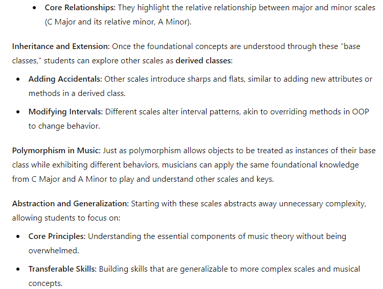
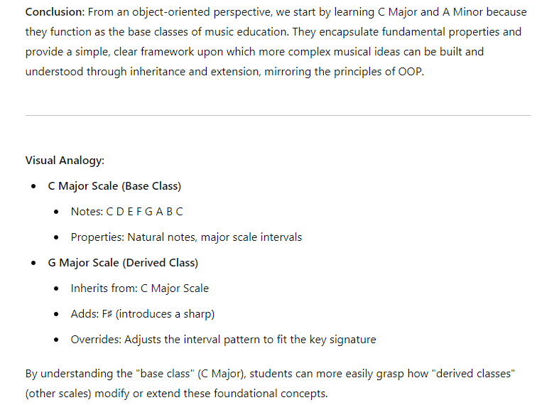
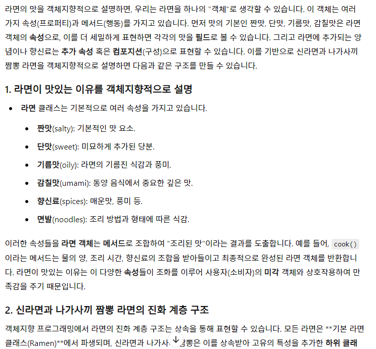

# [대두족장 인생 치트키 객체지향성 원론] Part 03 - 숙제(퀴즈)

**영상링크 : https://youtu.be/2Cyr_jDs2G8**

## ***숙제 주의 사항***

안 지키면 효과 없음

원론 part 01, 02 숙지하고 고정댓글에 달린 문제 다 풀고 오셔야 합니다.

서두를수록 시간낭비일 뿐이니 slow & steady.

```
객체지향성의 기본은 세상 만물 + 개념을 진화 가능한 생명체로 단순화하는 연습입니다.

"A와 B의 공통분모와 개성"이 아니라 "A와 B는 동일 조상 클래스에서 상속 받으며, A와 B는 다형성이 추가된다"라는 식으로 설명해야 하는 이윱니다.

말로 해야 합니다.

본인 목소리를 귀로 들으면서 하세요. 각잡고 문장이 이어지도록 또박 또박 제스처를 써가며 강단에 선 듯 설명하세요. 얼버부리면 효과 없습니다. 일타 강사가 되세요.

녹음 또는 영상 촬영하세요. 카메라 보면서 청중에게 설명하듯 하면 한결 쉽고 재미있습니다.

각 문제는 3-5분 정도 설명할 수 있어야 합니다. 단답형으로 대충하면 효과 없습니다.

정답 없습니다. 본인이 만족할 때까지 반복하세요.
```

## ***퀴즈***

### ***1***

세상 만물(개념 포함)은 속성(properties)과 메소드(methods)로 설명할 수 있습니다. 

객체지향성에서는 도트 노테이션을 사용합니다. a.name은 속성 a.speak()는 메소드입니다.

예) 렌즈
속성: lens.name = SEL2470GM
메소드: lens.zoom()

예) 유튜브 동영상
속성: vid.title = "대두족장 객체지향성 원론".vid.num_likes = 100
메소드: vid.play(), vid.pause()

다음을 속성과 메소드로 설명해 보세요. 속성은 명사/형용사, 메소드는 동사여야 합니다.

인간, 게시판 글, 피아노, 휴대폰, Ben E. King의 "Stand By Me"

```
아주 단순하게는, '속성'을 특성(특징)/상태, '메소드'를 행동/활동으로 정의할 수 있겠습니다.

[인간(Human)]

# 속성
Human.name = "WonSeok Kim"  # Human은 이름을 가지고 있다.
Human.height = 174         # Human은 키를 가지고 있다.
Human.weight = 75          # Human은 몸무게를 가지고 있다.
Human.sex = "male"         # Human은 성별을 가지고 있다.
Human.emotion = "happy"    # Human은 감정을 가지고 있다.

# 메소드
Human.speak()   # Human은 말할 수 있다.
Human.eat()     # Human은 먹을 수 있다.
Human.walk()    # Human은 걸을 수 있다.
Human.think()   # Human은 생각할 수 있다.

```
```
[게시판 글(Post)]

# 속성
Post.title = "대두족장 객체지향성 원론 숙제(퀴즈)"  # Post는 제목을 가지고 있다.
Post.author = "WonSeok Kim"  # Post는 작성자를 가지고 있다.
Post.date_created = "2024-09-17"  # Post는 작성일자를 가지고 있다.

# 메소드
Post.save()     # Post는 저장할 수 있다.
Post.delete()   # Post는 삭제할 수 있다.
Post.correct()  # Post는 수정할 수 있다.
Post.like()     # Post는 좋아요를 누를 수 있다.
```
```
[피아노(Piano)]

# 속성
Piano.brand = "Steinway"  # Piano는 브랜드를 갖고 있다.
Piano.color = "Black"    # Piano는 색깔을 갖고 있다.
Piano.model = "B-211"    # Piano는 모델을 갖고 있다.

# 메소드
Piano.play()   # Piano는 연주할 수 있다.
Piano.stop()   # Piano는 멈출 수 있다.
Piano.open_lid()   # Piano는 뚜껑을 열 수 있다.
Piano.tune()   # Piano는 조율할 수 있다.
```
```
[휴대폰(Phone)]

# 속성
Phone.brand = "Apple"  # Phone은 브랜드를 갖고 있다.
Phone.color = "White"  # Phone은 색깔을 갖고 있다.
Phone.model = "iPhone 15 Pro"  # Phone은 모델명을 갖고 있다.

# 메소드
Phone.call()   # Phone은 전화를 걸 수 있다.
Phone.text()   # Phone은 문자를 보낼 수 있다.
Phone.internet()   # Phone은 인터넷을 할 수 있다.
Phone.camera()     # Phone은 촬영할 수 있다.
```
```
[Stand By Me]

# 속성
Stand By Me.artist = "Ben E. King"  # Stand By Me는 아티스트를 가지고 있다.
Stand By Me.genre = "R&B"  # Stand By Me는 장르를 가지고 있다.
Stand By Me.release_year = "1961-04-24"  # Stand By Me는 발매일을 가지고 있다.

# 메소드
Stand By Me.play()  # Stand By Me는 재생할 수 있다.
Stand By Me.pause()  # Stand By Me는 일시정지할 수 있다.
Stand By Me.stop()  # Stand By Me는 멈출 수 있다.
Stand By Me.repeat()  # Stand By Me는 반복할 수 있다.
```

### ***2***

세상 만물을 그려본다면 점(vertex), 선(edge), 면(face)으로 단순화할 수 있습니다. 점->선->면 순으로 진화합니다. 면은 선에서, 선은 점에서 상속 받습니다.

세상에 곡선은 없습니다. 객체지향적으로 설명해보세요

```
세상 만물을 '점에서 면으로 진화하는 것'으로 설명한다면, 선과 면은 점이라는 가장 원시적인 조상 클래스로부터 상속 받아 각각의 다형성을 보이는 것으로 볼 수 있습니다. 

즉, '점'은 공간에서 '위치(position)'라는 속성을 갖습니다. '이동(move)'라는 method를 가집니다. '선'은 '점'으로부터 상속 받으므로 '점'의 속성(위치)과 '이동'이라는 method를 가지며, 다형성으로써 '길이 계산(length)'과 같은 method를 overriding함으로써 개성을 갖습니다.

'면'은 '선'의 연속입니다. 선들이 일종의 닫힌 곡선을 형성하며 면적을 가집니다. '선'에서 상속 받으므로 '선'의 속성과 method를 가지며, 다형성으로써 '면적 계산(area)'과 같은 method를 overriding함으로써 개성을 갖습니다.

'곡선'은 "무한히 '짧은 직선'의 연속 및 합"으로 표현할 수 있겠고, 따라서 '곡선'이라는 새로운 클래스가 필요하지 않습니다. 이는 미적분학에서 '곡선'을 극한의 수준에서 무한히 작은 직선의 합으로 계산하는 이치와 동일합니다. 즉, '곡선'은 직선의 또다른 형태, 즉 다형성으로 설명 가능합니다.

따라서 '세상에 곡선은 없습니다'
```

### ***3***

진짜 생명체만 객체로 오해하면 안됩니다. 세상 만물+개념까지도 진화 가능한 생명체로 보여야 합니다. 생물학에서 다루는 생명체가 아닙니다.

민주주의 조상 클래스를 객체지향적으로 설명하세요.

```
'조상 클래스로부터 상속받아 각자의 다형성을 발현한다'고 보는 것이 '객체지향'을 제대로 이해하는 방법이겠습니다만, 객체지향의 3대 축인 '상속성', '다형성', '캡슐화'에 더해 '추상화(Abstraction)'를 활용한다면 한 객체의 조상 클래스를 좀 더 용이하게 파악할 수 있겠고, 따라서 세상 만물을 더욱더 '객체지향적'으로 바라보는데 도움이 됩니다.

우선 '민주주의'의 속성(특징) 중 어떤 것에 초점을 맞추느냐에 따라 비교 분석의 대상이 달라질 수 있습니다. '민주주의'를 정치 체제의 관점에서 본다면 다른 비교 대상으로 '귀족제'와 '독재(군주제)'가 있고, 경제 체제의 관점에서 본다면 '사회주의'가 비교 대상으로 적절합니다. 엄밀히는, 민주주의-사회주의, 자본주의-공산주의가 통상적인 구분입니다만, 여기서는 민주주의와 사회주의의 특성상 자본주의와 공산주의를 속성으로 갖게 된다는 측면이 있기 때문에 '경제 체제'로서의 속성을 기준으로도 분석해보겠습니다. 정치 체제란 '국가의 권력을 어떻게 나누고 운영하는지'에 관한 것이고, 경제 체제는 '자원을 어떻게 배분하고 소유하는지'에 관한 것입니다.

정치 체제의 속성으로는 `통치 방식(Governance)`, `대표성(Representation)`, `(정치적) 자유(Freedom)`, '(정치적) 평등(Equality)'이 있습니다. 

경제 체제의 속성으로는 `사유재산(Property)`, `(재산권 행사의) 자유(Freedom)`, `(결과적) 평등(Equality)`이 있습니다.

위의 기준에 따라 정리해보면 아래와 같습니다.

[민주주의의 속성]
- 정치적 속성
    `통치(governance)` - '선출된 대표들'에 의한 통치(의사결정)('governance'를 '통치'로 번역하는 것이 적절한가에 관하여는 의문이 있습니다)
    `대표성(representation)` - 모든 시민들의 참여
    `자유(freedom)` - 모든 시민들의 정치적 자유 보장
    `평등(equality)` - 모든 시민들의 정치적 평등
- 경제적 속성
    `사유재산(property)` - True
    `자유(freedom)` - 모든 시민들의 재산권 행사의 자유 보장
    `결과적 평등(equality)` - False

[민주주의의 method]
`시민들의 투표(vote)`
`시민들 또는 대표들의 입법(legislation)`
`시민들 또는 정당성을 부여받은 존재(법관)의 판결(judgement)`이 있습니다.

[독재의 속성] - 정치적 속성만 짚겠습니다.
`통치(governance)` - 왕 또는 군주와 같이 '한 명 또는 소수의 통치자'
`대표성(representation)` - 없음
`자유(freedom)` - 정치적 자유 없음
`평등(equality)` - 정치적 평등 없음

[독재의 method]
`왕 또는 군주의 판결(judgement)`
`왕 또는 군주의 명령(rule)

[귀족제의 속성] - 마찬가지로, 정치적 속성만 짚겠습니다.
`통치(governance)` - 소수 엘리트의 통치
`대표성(representation)` - 제한적 대표성
`자유(freedom)` - 제한적 자유
`평등(equality)` - 제한적 평등

[귀족제의 method]
`소수 엘리트의 통치(rule)`
`소수 엘리트의 법 제정(legislation)`
`소수 엘리트의 판결(judgement)`

[사회주의의 속성] - 여기서는 경제적 속성만 짚겠습니다.
`사유재산(property)` - False
`자유(freedom)` - 사회를 위해 국민들의 재산권 행사의 자유 제한
`결과적 평등(equality)` - True

[사회주의의 method]
`자원의 재분배`

이제 `민주주의의 조상 클래스`를 설명해보겠습니다.

[정치 체제의 관점에서]

민주주의, 귀족제, 독재의 공통 분모가 되는 속성들로는, `권력을 행사하고 국가를 통치하는 주체(Governance)`, `통치주체가 국민들을 얼마나 잘 대표하는지(Representation)`, `시민들의 정치적 자유(Freedom)가 얼마나 보장되는지`, `시민들의 정치적 참여의 기회(Equality)가 얼마나 보장되는지`가 있습니다. 

따라서 정치 체제의 관점에서 민주주의의 조상 클래스는 `class PoliticalSystem`으로 정의할 수 있겠고, 그 parameter로는 `Governance`, `Representation`, `Freedom`, `Equality`가 있습니다. 

[경제 체제의 관점에서]

민주주의와 사회주의의 공통 분모가 되는 속성들은 `사유재산(Property)`과 `경제적 평등(Equality)`, `재산권 행사의 자유(Freedom)`가 있습니다. 

따라서 경제 체제의 관점에서 민주주의의 조상 클래스는 `class EconomicSystem`으로 정의할 수 있겠고, 그 parameter로는 `Property`, `Equality`, `Freedom`가 있습니다.
```
```python
민주주의의 조상 클래스를 코드로 작성해본다면 다음과 같습니다.

class PoliticalSystem:
    def __init__(self, governance, representation, freedom, equality):
        self.governance = governance  # 통치 주체
        self.representation = representation  # 대표성
        self.freedom = freedom  # 정치적 자유
        self.equality = equality  # 정치적 평등

    def describe_system(self):
        return f"Governance: {self.governance}, Representation: {self.representation}, Freedom: {self.freedom}, Equality: {self.equality}"

class EconomicSystem:
    def __init__(self, property, equality, freedom):
        self.property = property  # 사유재산
        self.equality = equality  # 경제적 평등
        self.freedom = freedom  # 재산권 자유

    def describe_system(self):
        return f"Property: {self.property}, Equality: {self.equality}, Freedom: {self.freedom}"
```

### ***4***

모든 클래스의 최고 조상 클래스는 어차피 가장 단순화된 Generic Object 여야 합니다. 따라서 특정 클래스의 조상 클래스를 찾으려면 Generic Object에서 어느 정도 진화한 종특이 드러나는 클래스여야 합니다.

```
GenericObject👉...👉Weapon👉...👉Pistol
GenericObject👉...👉Weapon👉...👉Missile
GenericObject👉...👉Vehicle👉...👉Bicycle
GenericObject👉...👉Vehicle👉...👉Helicopter
GenericObject👉...👉Vehicle👉...👉Boat
GenericObject👉...👉Vehicle👉...👉WeaponizedVehicle👉...👉Tank
```

종특 조상 클래스: Weapon, Vehicle

다시, 민주주의의 조상 클래스를 객체지향적으로 설명하세요.

```
위에서는 제가 '민주주의'를 정치 체제(Political System)와 경제 체제(Economic System)로 나누어 답변하였지만, GenericObject를 고려한다면 정치 체제와 경제 체제를 통합하는 조상 클래스까지 설명 가능하겠습니다.

즉, 제가 위에서 답변한 내용은 아래와 같이 정리될텐데,

GenericObject👉...👉PoliticalSystem👉...👉Democracy, Aristocracy, Dictatorship
GenericObject👉...👉EconomicSystem👉...👉Democracy(Capitalism), Socialism(Communism)

PoliticalSystem과 EconomicSystem의 조상 클래스를 아우르는 바로 윗단계의 조상 클래스로 `System` 클래스가 있습니다.  `System` 클래스는 PoliticalSystem은 물론 EconomicSystem, CulturalSystem, SocialSystem 등등을 모두 아우르는 상위 클래스이고, 각각의 하위 System들은 `System` 클래스가 갖고 있는 속성과 method들을 상속 받으면서 각자의 다형성으로 overriding하여 개성을 발현합니다.

`System` 클래스의 속성으로는, `목적(Purpose)`, `구조(Structure)`를 생각해볼 수 있습니다.

소스코드로는, 다음과 같습니다. 제가 사회체제, 문화체제 등에 관하여는 잘 알지 못하여 정확하지 않을 수 있습니다.
```
```python
class System:
    def __init__(self, purpose, structure):
        self.purpose = purpose  # 목적
        self.structure = structure  # 구조

    def describe(self):
        return f"System with purpose: {self.purpose}, Structured as: {self.structure}"
```
```
GenericObject👉...👉System👉PoliticalSystem👉Democracy, Dictatorship, Aristocracy
GenericObject👉...👉System👉EconomicSystem👉Democracy(Capitalism), Socialism(Communism)
GenericObject👉...👉System👉CulturalSystem👉TraditionalCulture, ModernCulture, Multiculture
GenericObject👉...👉System👉SocialSystem👉ClassSociety, EgalitarianSociety
```

### ***5***

내연기관차와 전기차의 차이를 객체지향적으로 설명하세요.

조상 클래스, 상속성과 다형성이 드러나야 합니다.

```
우선 내연기관차(Internal Combustion Engine Vehicle)와 전기차(Electric Vehicle)의 공통점과 차이점부터 살펴보면,

[공통점]

둘 모두 `flyable`이 아니고 `탈 것(Vehicle)`이며, `drivable(autonomous)`의 유무로 구분 가능하며,  `동력기관(Power_Unit)`, `동력원(Power_Source)`을 가지고 있습니다. 그리고 `이동(Move)`, `멈춤(Stop)`을 할 수 있습니다. 

[차이점]

ICE 차량은 `엔진(engine)`을 가지고 있고 `연료(fuel)`를 소모해 작은 폭발을 일으켜 `실린더(cylinder)`를 움직여 `운전(drive)`합니다. 가솔린(gasoline), 디젤(diesel) 등이 대표적인 `연료 타입(fuel type)`입니다. `마력(horsepower)`, `토크(torque)` 등이 성능을 결정짓는 요소이고, `변속기(transmission)`를 통해 속도를 조절합니다.

반면, EV는 `모터(Motor)`를 가지고 있고, `전기(Electricity)`를 소모해 `운전(Drive)`합니다. `배터리(Battery)`가 대표적인 `전기 저장 장치(Electric Storage Device)`이고, `충전기(Charger)`를 통해 전기를 충전합니다. `충전 시간(Charge Time)`, `주행 거리(Driving Range)` 등이 성능을 결정짓는 요소이고, `인버터(Inverter)`를 통해 직류 전기를 교류로 변환합니다.

이를 Bottom Up 방식으로 분석해보면, `(Drivable) Vehicle` 조상 클래스가 있겠고, 둘의 차이점들이 곧 각각의 개성 및 다형성이라고 할 수 있습니다.

따라서, 다음과 같습니다.

GenericObject👉...👉Vehicle👉...👉Drivable Vehicle👉ICE Vehicle
GenericObject👉...👉Vehicle👉...👉Drivable Vehicle👉EV
```
```
그리고 다음과 같이 코드로 작성해볼 수 있습니다.
```
```python

# Vehicle 클래스: 모든 탈 것의 기본 클래스
class Vehicle:
    def __init__(self, name, power_unit, power_source, seats):
        self.name = name  # 탈 것의 이름
        self.power_unit = power_unit  # 동력 기관 (엔진 또는 모터)
        self.power_source = power_source  # 동력원 (연료 또는 전기)
        self.seats = seats  # 좌석 수
        self.flyable = False  # 비행 가능 여부

    def move(self):
        print(f"{self.name}가 {self.power_source}로 구동되는 {self.power_unit}을 사용하여 이동합니다.")

    def stop(self):
        print(f"{self.name}가 멈췄습니다.")

    def show_info(self):
        print(f"탈 것 이름: {self.name}")
        print(f"동력 기관: {self.power_unit}")
        print(f"동력원: {self.power_source}")
        print(f"좌석 수: {self.seats}")
        print(f"비행 가능 여부: {'예' if self.flyable else '아니오'}")

# DrivableVehicle 클래스: 운전 가능한 탈 것
class DrivableVehicle(Vehicle):
    def __init__(self, name, power_unit, power_source, seats, autonomous=False):
        super().__init__(name, power_unit, power_source, seats)
        self.autonomous = autonomous  # 자율주행 여부

    def drive(self):
        if self.autonomous:
            print(f"{self.name}가 자율주행 모드로 주행합니다.")
        else:
            print(f"{self.name}가 운전됩니다.")

    def show_info(self):
        super().show_info()
        print(f"자율주행: {'예' if self.autonomous else '아니오'}")

# ICEVehicle 클래스: 내연기관차
class ICEVehicle(DrivableVehicle):
    def __init__(self, name, engine, fuel_type, horsepower, torque, transmission, seats, autonomous=False):
        super().__init__(name, engine, fuel_type, seats, autonomous)
        self.engine = engine  # 엔진
        self.fuel_type = fuel_type  # 연료 타입
        self.horsepower = horsepower  # 마력
        self.torque = torque  # 토크
        self.transmission = transmission  # 변속기

    def ignite(self):
        print(f"{self.name}의 {self.engine}이 점화되었습니다. 실린더가 움직입니다.")

    def change_gear(self):
        print(f"{self.name}의 {self.transmission} 변속기가 기어를 변경합니다.")

    def show_performance(self):
        print(f"{self.name}의 성능:")
        print(f"마력: {self.horsepower}hp")
        print(f"토크: {self.torque}Nm")
        print(f"변속기: {self.transmission}")

    def show_info(self):
        super().show_info()
        print(f"엔진: {self.engine}")
        print(f"연료 타입: {self.fuel_type}")
        self.show_performance()

# ElectricVehicle 클래스: 전기차
class ElectricVehicle(DrivableVehicle):
    def __init__(self, name, motor, battery_capacity, charge_time, driving_range, seats, autonomous=False):
        super().__init__(name, motor, "전기", seats, autonomous)
        self.motor = motor  # 모터
        self.battery_capacity = battery_capacity  # 배터리 용량 (kWh)
        self.charge_time = charge_time  # 충전 시간
        self.driving_range = driving_range  # 주행 거리 (km)
        self.inverter = "표준 인버터"  # 인버터

    def charge_battery(self):
        print(f"{self.name}의 배터리를 충전 중입니다.")

    def convert_current(self):
        print(f"{self.name}의 인버터가 직류를 교류로 변환하고 있습니다.")

    def show_performance(self):
        print(f"{self.name}의 성능:")
        print(f"배터리 용량: {self.battery_capacity}kWh")
        print(f"충전 시간: {self.charge_time}시간")
        print(f"주행 거리: {self.driving_range}km")

    def show_info(self):
        super().show_info()
        print(f"모터: {self.motor}")
        self.show_performance()

# 객체 생성 및 사용 예시

# ICE 차량 객체 생성
bmw = ICEVehicle(
    name="BMW 3 시리즈",
    engine="V6 엔진",
    fuel_type="가솔린",
    horsepower=300,
    torque=400,
    transmission="자동",
    seats=5,
    autonomous=False
)

# EV 차량 객체 생성
tesla = ElectricVehicle(
    name="테슬라 모델 3",
    motor="전기 모터",
    battery_capacity=75,
    charge_time=8,
    driving_range=500,
    seats=5,
    autonomous=True
)

# 메소드 호출
print("\n[ 내연기관차 정보 ]")
bmw.show_info()
bmw.move()
bmw.drive()
bmw.ignite()
bmw.change_gear()
bmw.stop()

print("\n[ 전기차 정보 ]")
tesla.show_info()
tesla.move()
tesla.drive()
tesla.charge_battery()
tesla.convert_current()
tesla.stop()
```

output:
```
[ 내연기관차 정보 ]
탈 것 이름: BMW 3 시리즈
동력 기관: V6 엔진
동력원: 가솔린
좌석 수: 5
비행 가능 여부: 아니오
자율주행: 아니오
엔진: V6 엔진
연료 타입: 가솔린
BMW 3 시리즈의 성능:
마력: 300hp
토크: 400Nm
변속기: 자동
BMW 3 시리즈가 가솔린로 구동되는 V6 엔진을 사용하여 이동합니다.
BMW 3 시리즈가 운전됩니다.
BMW 3 시리즈의 V6 엔진이 점화되었습니다. 실린더가 움직입니다.
BMW 3 시리즈의 자동 변속기가 기어를 변경합니다.
BMW 3 시리즈가 멈췄습니다.

[ 전기차 정보 ]
탈 것 이름: 테슬라 모델 3
동력 기관: 전기 모터
동력원: 전기
좌석 수: 5
비행 가능 여부: 아니오
자율주행: 예
모터: 전기 모터
테슬라 모델 3의 성능:
배터리 용량: 75kWh
충전 시간: 8시간
주행 거리: 500km
테슬라 모델 3가 전기로 구동되는 전기 모터을 사용하여 이동합니다.
테슬라 모델 3가 자율주행 모드로 주행합니다.
테슬라 모델 3의 배터리를 충전 중입니다.
테슬라 모델 3의 인버터가 직류를 교류로 변환하고 있습니다.
테슬라 모델 3가 멈췄습니다.
```
```
쉽게 생각하고 덤볐다가, 정말 엄청 헤맸습니다. 진짜 맨땅에 헤딩한 느낌입니다😂
```


### ***6***

한국어, 영어, 일본어, 중국어의 조상 클래스를 설명하세요.

한국어, 영어, 일본어, 중국어의 상속성과 다형성을 설명하세요.

그 언어를 몰라도 상식선에서 객체지향적으로 설명은 할 수 있어야 합니다.

-------------------
객체들의 조상 클래스를 찾으려면 각 객체들의 공통점부터 생각해봐야겠지. 뭐가 같은게 있어야 상속을 받았다고 할 수 있는 것이고
조상 클래스가 존재할거잖아.

같은 점이 1도 없는데 '객체지향적 분석'하겠다고 노력하면 결국 시간낭비일 수 있다는거지. 물론, 분석하는 사람의 호라이즌이
얼마나 넓고 좁으냐에 따라 그 공통점이 보일 수도, 안보일 수도 있겠고, 시도하는 과정에서 몰랐던 공통점과 차이점 등을 알게돼서
객체지향적 분석이 '가능해질 수도' 있겠지만 기본적으로 '상식선'에서 파악해서 '평균의 수준'에서는 행할 수 있어야 하니까.

각 언어들의 공통점들을 찾아보자. 속성과 메소드를 따지기 전에 그냥 공통점부터 생각해보는거야. 일단, `의사소통의 수단`이고 
매개야. 자신의 감정을 표현하거나, 정보를 전달하거나, 명령을 내리거나, 질문을 하기 위한 수단이지.

그리고, `사고의 수단`이기도 해. Yann Lecun 같은 학자는 '사고하기 위해 언어가 반드시 필요한 것이 아니다'라는 취지로 말하고, 
확실히 수학적인 부분은 반드시 언어가 필요한 것이 아니긴 하지. 그러나, 언어가 없다면 대부분의 사고 범위는 제한될 수 밖에 없고, 언어로 인해 사고의
선명함이 증가되는 것은 부인할 수 없어. 사고의 폭이나 풍부함이 언어에 의해 제한되기도, 넓어지기도 한다는 점에서 사고와 언어는 아주 밀접한 관련이 있다고 봐야해.

문득 '수학적 개념'으로만 의사소통하는 외계 종족을 생각해볼 수도 있겠다. 호라이즌이 곧 어디까지 상상할 수 있는지를 결정해.

영어 단어를 통해 더욱 선명하고 풍부하게 사고가 이뤄질 수 있는 개념들을 생각해보면 사고와 언어의 관련성은 절대 무시할 수 없어.
예를 들어, 'Procrastination'라는 단어를 생각해보자. 한국어로는 '미루기', '행동 지연' 정도로 번역할 수 있지만, 'Procrastination'은 단순한 지연보다는 심리적 요인과 패턴을 포함한
개념으로 알고 있어. 일시적이고 일회적인 것과는 약간 다른 개념이지.

그리고 각 언어는 `문자`를 갖고 있어. 내가 아는한 모든 언어는 그에 상응하는 `문자`가 있어. `문자`가 있다면 그에 맞는 `문법`도 존재하지.
즉, 모든 언어들은 단순한 문자의 나열에 그치지 않는다는 거야. `문법`이 있어야 그 문자들이 의미를 갖게 되고, 그 의미를 통해 `의사소통`이 가능해지잖아.

영화 'Arrival'에 등장하는 외계의 언어까지 생각해보자. 'Arrival'에 등장하는 외계의 언어는 시간의 흐름을 '비선형적'으로 인식할 수 있게 하는 언어로, '시간'적인 개념까지 '언어'로써 표현할 수 있는 언어야. 

영화 한편이 주는 통찰과 호라이즌이 너무 다양하네. 나는 'Arrival'을 통해 자신의 운명을 바꿀 수 있는 '선택의 힘'만 알아차렸다고 생각했는데 부지불식 간에 언어학적 호라이즌까지 조금이나마 넓힐 수 있었어.

놀랍다.

아무튼 분명히 외계의 언어 역시 `의사소통의 수단`이고, `사고의 수단`이고, `문자`와 `문법`을 가지고 있다는 사실을 알 수 있어.

청각 장애인들의 수화도 언어야. 수화의 동작을 그림으로 그리면 `문자`가 되고, 그 `문자`들의 조합이 `문법`이 되고, 그 `문자`와 `문법`을 통해 `의사소통`이 가능해지는거야. 그리고, 수화 역시 `사고의 수단`이 되는거지.

소름 돋는다. 외계의 언어부터 청각 장애인들의 언어까지 객체지향적으로 분석하면 비교 대조가 가능해지고, 더 선명하게 이해할 수 있어.

그야말로 치트키구나. 모든 개념은 비교와 대조를 행할 때 비로소 온전히 이해될 수 있어. 객체지향이 그토록 중요한 이유겠지.

자 이제 조상 클래스를 생각해보자. 가장 쉽게 파악할 수 있는 한국어, 영어, 일본어, 중국어의 조상 클래스는 `인간의 언어` 클래스야.

아니면 `Language` 클래스에 `HumanLanguage`와 `AlienLanguage`의 클래스 구분을 위해 `Human=True` 라는 속성을 넣을 수도 있어.

`Language` 클래스는 `의사소통`, `사고`, `문자`, `문법`을 가지고 있어야겠지. 그리고, `인간의 언어` 클래스의 하위 클래스로 `동양 언어`와 `서양 언어`라는 클래스가
있겠어. 그런데, 단순히 지역적인 분류로 나누는 것보다는 특징으로 구분하는 것이 더 그 언어의 특징을 파악
하기 쉬울 수도 있어. 그렇게 따지면 족장님께서 말씀해오셨듯, 중국어와 영어를 한 그룹으로 묶고, 한국어와 일본어를 한 그룹으로 묶는 것이 적절할 수 있어.

일단 나의 지식 범위 내에서 지역적인 분류로써 `EasternLanguage`와 `WesternLanguage`로 구분해보자. Python에서는 가급적 객체나 클래스를 소문자로 시작하는 것이 관례라고 해. 이건 pep 8의 가이드이기도 하지.

하지만, 오늘은 선명한 사고를 위해 약간의 예외를 허용하자.

`한국어`와 `영어`, `일본어`, `중국어`들의 조상 클래스를, `Language` 클래스 또는 `HumanLanguage`로 정의하고, 속성들로는 `communication`, `thinking`, `characters`, `grammar`들을, `describe`라는 단순한 메소드를 생각해볼 수 있어.

그리고 그 하위 클래스로 지역적 분류에 따라 'EasternLanguage'와 'WesternLanguage' 라는 하위 클래스들을 생각해볼 수 있겠지. 지역에 따른 하위 클래스들에는 `region`이라는 속성으로 overriding 할 수 있어.

그리고 `한국어`, `영어`, `중국어`, `일본어`의 각 객체들은 조상들로부터 속성과 메소드를 쭉 상속받으면서 저마다의 독특한 특성을 통해 다형성을 보여줄 수 있겠지.

와 이쯤되니까 언어에 관한 호라이즌의 한계를 느끼게 되는데 그래도 더 나아가보자.

일단 한국어의 특징으로는, 아주 뚜렷한 `높임말` 체계가 있어. `높임말`은 한국어의 가장 큰 특징 중 하나로 상대에 대한 존경이나 예의를 아주 세밀한 수준으로까지 표현할 수 있어. 

영어의 특징으로는, `관사`의 사용이 아주 뚜렷해. `a`, `an`, `the`와 같은 관사들을 사용해서 명사를 구체화하거나 일반화할 수 있어.

중국어에서는 `성조`가 아주 뚜렷한 것으로 알고 있어. `성조`에 따라 단어의 뜻이 달라지기 때문에 `성조`를 정확하게 발음하는 것이 중요한 것으로 알고 있어.

일본어의 뚜렷한 특징은 잘 모르겠지만, `가타카나`를 통한 외래어의 적극적 수용이 그 특징 중 하나로 알고 있어.

언어학에 대한 호라이즌이 넓고 깊은 사람들은 이런 특징들을 통해 언어의 특성을 파악할 수 있겠지. 그리고 그 특징의 정도를 아주 세밀하게 구분할 수 있는 속성들까지 파악할 수 있을거야. 이렇게 생각해보니, '객체지향적 분석과 사고'의 핵심은 결국 '호라이즌'이라는 것을 느끼게 된다. 

나는 `지역적 특징`으로만 분류했지만, `언어학적 특징`으로 분류한다면 또 다른 결과가 나올 수 있겠지. 그 외에 `기원`에 따른 분류를 할 수도 있을 것 같아.

언어학적 호라이즌이 아주 풍부한 사람의 객체지향적 분석이 너무 궁금하다. 그런 사람이라면 각 언어의 특징을 통해 그 언어가 가지는 '문화적 특성'까지 고려해서 분석이 가능할거야. 

```
저의 위 썰을 GPT o1-preview 에게 인풋으로 넣고 분석을 맡겼더니 다음과 같이 답변을 하였습니다.

객체지향적으로 언어들을 분석할 때, 풍부한 언어학적 호라이즌을 통해 각 언어의 
문화적 특성까지 고려해보자. 먼저, 모든 언어는 의사소통과 사고의 수단이며, 
문자와 문법을 가지고 있다는 공통점이 있다. 이 점을 기반으로 최상위 클래스인 Language를 정의할 수 있다.

그 다음으로 언어의 기원과 계통에 따라 하위 클래스를 나눌 수 있다. 
예를 들어, 인도유럽어족의 영어, 중국티베트어족의 중국어, 알타이어족의 
한국어와 일본어 등이 있다. 각 언어족 클래스는 해당 언어들이 공유하는 
문법적 특징과 역사적 배경을 속성으로 가질 수 있다.

이제 개별 언어로 내려와서, 각 언어의 독특한 특징을 생각해보자. 
한국어는 높임말 체계를 통해 사회적 위계와 예의를 표현하는 데 탁월하다. 
이는 한국 문화에서 존중과 조화를 중시하는 가치관이 반영된 것이다. 
또한, 한글이라는 독창적인 문자 체계를 사용하며, 음소 문자로서 발음과 문자의 일치도가 높다.

영어는 관사를 통해 명사의 특정성과 수를 명확하게 구분한다. 
이는 개체의 개별성과 명확성을 중요시하는 서구 문화의 영향을 받았다. 
또한, 라틴 문자를 사용하며, 전 세계적으로 통용되는 국제어로서의 지위를 가지고 있다.

중국어는 성조를 사용하여 단어의 의미를 구분한다. 
이는 중국어가 단음절어 중심의 언어이기 때문에 음의 높낮이로 의미를 
풍부하게 만드는 방법이다. 한자를 사용하는데, 이는 표의 문자로서 
하나의 글자가 의미를 담고 있어 역사와 전통이 깊다.

일본어는 가타카나를 통해 외래어를 적극적으로 수용한다. 이는 일본 
문화가 외부의 것을 받아들이고 자신들의 것으로 재해석하는 데 
능숙하다는 것을 보여준다. 또한, 히라가나, 가타카나, 한자를 혼용하여 사용하는 복잡한 문자 체계를 가지고 있다.

이러한 분석을 통해 각 언어의 문화적, 역사적 배경과 그에 따른 
언어적 특징을 객체지향적으로 모델링할 수 있다. 이는 단순히 
언어의 구조를 이해하는 것을 넘어, 그 언어를 사용하는 사람들의 
사고방식과 문화까지 깊이 있게 파악하는 데 도움을 준다. 
결국, 객체지향적 분석은 우리의 호라이즌을 넓혀주며, 서로 
다른 언어와 문화 사이의 공통점과 차이점을 명확하게 
이해할 수 있게 해주는 강력한 도구임을 다시 한 번 깨닫게 된다.
```

살짝 아쉽긴 하지만, 역시 제가 몰랐던 내용들까지 포함되어서 나름 만족스럽습니다.

### ***7***

음악 배울 때 다장조(C Major)와 라단조(A Minor)에서 출발하는 이유를 객체지향적으로 설명하세요.

---

나의 음악 관련 호라이즌이 극히 좁기 때문에 아주 기초적인 수준에서만 썰을 풀 수 있을 것 같아.

우선 장조와 단조의 개념부터 생각해보자. 다장조(C Major)는 'C(도) - B(시)'의 음들로 이뤄져있어. C로 시작하기 때문에 C Major가 되는 거지. 라단조(A Minor)는 'A(라) - G(솔)' 음들로 이뤄져있어. 마찬가지로 A로 시작하기 때문에 A Minor가 되는 거지. 내가 알기로 장조와 단조는 '온음 - 반음'의 구성으로 구별되는데, 더 간단히는 노래의 끝나는 음이 '도'냐, '라'냐로 대략적인 파악이 가능해.

특히 C Major와 A Minor는 반음 올리거나(#) 내린(b) 음을 쓰지 않고 화음도 그 안에서 결정돼. 이건 피아노를 기준으로 보면 검은 건반은 쓰지 않고 흰 건반만으로 연주가 가능한거야.

즉, A 음으로 시작해서 검은 건반을 쓰지 않으면 A Minor가 되는 거고, C 음으로 시작해서 검은 건반을 쓰지 않으면 C Major가 되는 식이지.

그리고 여기서 적절히 검은 건반을 추가하면서 변화를 주면 여러 조성을 만들어낼 수 있어.

결국, C Major와 A Minor는 아주 기본적인 클래스에 해당돼. 이 둘은 검은 건반, 반음을 사용하지 않기 때문에 가장 단순한 구조를 갖고 있어. 

그래서 피아노를 배울 때도 가장 먼저 배우는 것이고, 간단하게 익힐 수 있는 조성인 거지.

음악을 처음 배울 때 복잡한 조성, 검은 건반들을 가득 사용한 조성들부터 배우면 그 많은 조성들을 전부 개별적으로 외우고 익혀야 하니까 어떤 패턴이나 체계를 파악하기 너무 힘들어. 반면 처음부터 C Major와 A Minor를 익히면 그 다음부터는 그 토대에 적절히 개성들만 부여하는 식으로, 마치 레고에서 foundation block을 만들어 놓고 그 위에 여러 블럭들을 쌓으면서 온갖 것들을 만들어내는 것과 같아. 그래야 큰 그림이 보이고 조성에 대한 이해도와 응용력이 높아질 수 있어.

이렇게 보면 온갖 다양한 조성들의 조상 클래스를 C Major와 A Minor로 정의할 수 있고, C Major와 A Minor에서 상속 받은 속성과 메소드를 기초로 조금씩 변화를 부여하면서 다형성을 발현하면 얼마든지 다양한 조성들을 만들어낼 수 있어.

그래서 음악을 배울 때 C Major와 A Minor에서 출발하는 것이 효율적이고 효과적인 거야.

---

마찬가지로 GPT o1-preview 에게 물어봤습니다. 이번에는 그냥 질문만 던져봤는데, 아주 깔끔하게 답변을 해준 것 같습니다.

다른 인풋 지식도 없고, pre-trained된 모델 그 자체라서 질문만으로 모든 맥락과 내용을 파악하고 답변한 것입니다.





### ***8***

그림 배울 때 기본 도형(정육면체, 구, 원통, 원뿔)을 활용하는 이유를 객체지향적으로 설명하세요.

---

사실 질문 자체에 많은 힌트가 있어. 예를 들어 질문이 '그림을 배울 때 어떤 형체를 활용해야 하는가', '어떤 단계부터 시작해야 하는가' 였다면 답을 생각해내기가 무척 어려웠을거야. 그런데 이 질문은 '기본 도형을 활용해야 한다'라는 당위를 제시하고 있고, 지금 '객체지향'을 응용하고 적용해보는 연습을 하고 있기 때문에 답이 어느 정도는 제시된 것 같아.

일단, 세상은 3D이고 이를 캔버스든 화면에든 2D라는 차원으로 축소해서 표현하는 것이 그림이고 drawing이야. 삼체에도 나오는 **'차원 축소'** 공격을 생각해봐. 차원을 축소할 때는 많은 것들을 생략해야돼(그래서 차원 축소 공격이 상상할 수 없을 정도로 강력한 거지). 그래서 일단 3D의 입체감있는 만물들을 2D로 표현하기 위해서는 형태에서 어떤 요소가 특징적인지를 잘 포착할 수 있어야 돼. 이를 가려낼 줄 아는 '눈'이 중요하다는 거야. 다른 형태와 비교할 때 어떤 요소가 특징적인지를 알아내려면 그 형태의 껍데기 안에 있는 '속살'을 볼 줄 알아야해.

그럼 결국 3D 도형부터 확실히 이해하고, 잘 그려내 봄으로써 이를 잘 포착해낼 수 있는 '눈'을 갖추는 것이 무엇보다 중요하겠지. 

결국 가장 기본이 되는 간단한 도형들부터 제대로 표현할 줄 알아야 해. 그리고 나서 그런 기본 도형들에 여러 변형을 주면서 복잡한 도형들을 그려낼 수 있겠고, 그렇게 그려낸 복잡한 도형들을 조합해서 더 복잡한 도형들을 만들어낼 수 있어. 그리고 그렇게 복잡한 도형을 그려낼 줄 안다면 세상의 3D 만물을 그려내는 것이 훨씬 수월해질거야.

예를 들어, 빌딩을 생각해보자. 빌딩은 아주 단순하게 생각해보면 직육면체야. 그리고 직육면체는 정육면체의 변형이지. 처음부터 '빌딩' 그 자체를 그리려 한다면 그 복잡성 때문에 너무 어려울거야. 다시 강조하지만, 그림은 차원 축소의 예술이야. 빌딩에서 중요한 것들과 중요하지 않은 것들을 가려낼 수 있어야 하고, 중요한 것들을 간결하게 표현해낼 수 있어야 해. 그러려면, 빌딩을 구성하는 가장 기본적인 형태인 직육면체를 제대로 그릴 줄 알아야 '어떤 요소가 빌딩 답게 보이도록 하는가', '저 빌딩과 다른 빌딩의 차이점은 어디서 오는가' 같은 것들이 포착될 거야.

마찬가지로, 에펠탑을 그린다고 생각해보자. 에펠탑의 기본 도형은 원뿔 또는 삼각뿔이라고 할 수 있어. 에펠탑을 축소된 차원에서 표현하기 위해서는 일단 원뿔 또는 삼각뿔부터 제대로 그릴 줄 알아야겠지. 그리고 그 원뿔 또는 삼각뿔에 여러 변형을 주면서 '에펠탑으로 느껴지도록', '에펠탑으로 보여지도록' 그려낼 수 있을거야. 그런 다음에 에펠탑들의 배경이라든가 에펠탑 주변까지 신경쓸 수 있겠지. 만약 원뿔 또는 삼각뿔을 제대로 그려낼 수 없다면 에펠탑을 그리는 것은 무척이나 어려울거야. 아니 불가능할지도 몰라.

사람을 그릴 때도 마찬가지야. 사람을 크게 머리, 몸통, 팔, 다리로 구분할 수 있을텐데 각각은 구, 직육면체, 원통으로 표현할 수 있어. 이 역시 차원축소의 예술이기 때문에 반드시 뭔가를 생략하고 뭔가는 강조해야할텐데, 가장 기초적인 형태에 해당되는 기본 도형들을 잘 표현하고 활용할 수 있어야만 그 위에 레고 블럭들을 쌓아가듯 더 복잡한 형태들을 그려낼 수 있을거야.

가장 복잡한 구조물이라 할 수 있는 '사그라다 파밀리아'를 생각해보자. 가우디가 '사그라다 파밀리아'를 그려내기 위해 여러 기본도형들을 활용했다는건 알려진 사실이야. 세상 복잡해보이는 그 구조물조차 여러 다양한 기본도형의 조합이고 변형이며 다형성 of 다형성이라는 거지. 가우디가 건축과 그림 실력을 기르는 과정을 잘 모르지만, 분명히 '기본 도형'을 그 누구보다 능숙하게 다뤘을 것이라는 건 분명할거야.

객체지향적으로 정리해보자면, 세상의 만물들을 3D에 해당되고 그 조상 클래스에는 기본 도형 클래스가 있어. 그리고 그 기본 도형 클래스로부터 상속받은 속성과 메소드를 활용해서 다양한 도형들을 만들어낼 수 있는거야. 그리고 그런 도형들에서 각각의 개성과 다형성들을 overriding한다면 그럴듯한 차원 축소가 가능해질거야. bottom-up 방식으로 접근한다면, 어떤 사물이나 형태를 그리려고 할 때 abstraction을 통해 그 사물이나 형태를 가장 기초적인 형태로 분해해볼 수 있겠고, 그렇게 한다면 훨씬 쉽게 '차원 축소'를 할 때 중요한 것과 중요하지 않은 것들을 구분해낼 수 있을거야. 

이는 달리 말하면, drawing에서 기본 도형들을 잘 그리는 것은 그야말로 '기본기'에 해당돼. 기본기라는 바닥 다지기가 탄탄해야만 그 위에 거대한 성이든, 아파트든, 복합 쇼핑몰이든 올릴 수 있는거야. 그림을 배우려 한다면 다양한 형태와 실물들을 그리는 것도 중요하지만 그보다도 기본 도형을 능숙하게, 잘 그려낼 줄 아는 능력이 훨씬 중요한 이유야. 그림 뿐만 아니라 모든 배움에 있어서도, 기본적인 구조와 원리를 먼저 잘 이해하고 익히는 것이 중요하겠지.

---

GPT o1-preview 에게 물어봤습니다. 이번에도 그냥 질문만 던져봤는데, '객체지향적'이라는 맥락은 다소 약하게 포함이 되어 있는 것 같습니다. 그래도 중요한 원리나 개념들에 대해서는 짚어내고 있네요.


### ***9***

인체(여러분 몸)에서 정육면체, 구, 원통, 원뿔 등 기본 도형에서 진화할 수 있는 부위를 찾아 객체지향적으로 설명해보세요.

예) 머리의 상악 위쪽 부분(아래턱이 하악) 두개골은 구에 해당하고 상완은 원통 또는 직육면체에 가깝습니다.

---

우선, 인체의 각 부위들을 생각해보자. 해부학에 대한 호라이즌이 넓지 않기 때문에 넓고 깊은 이야기는 할 수 없겠지만, 그동안 운동을 해오면서 파악한 뼈와 근육의 구조로 설명을 시도해보자.

인체를 잘개잘개 쪼개보자. 마치 발골을 하듯 말야. '인체를 발골한다'는 표현이 조금 섬뜩하긴 하지만 인체 각각의 부위에서 기본 도형들을 찾아내기 위해선 가장 적합한 표현이니까.

하체는 크게 발바닥과 발가락, 종아리, 대퇴부로 나눠져. 발목 아래는 발가락과 발바닥으로 나눌 수 있고.
상체는 크게 손바닥과 손가락, 전완, 상완, 복부-가슴/등, 목, 두개골로 나눌 수 있어.

이 중에서 `대퇴부-정강이-발바닥-발가락`과 `상완-전완-손바닥-손가락`의 속성과 메소드는 서로 매우 비슷해. 어느 한쪽이 다른 한쪽을 상속 받았다고도 표현할 수 있을 정도야. 관절의 개수와 자유도, 움직임의 범위가 비슷하고 뼈의 구조도 비슷해. 물론 세밀하게 들어가면 `상완-손가락`의 자유도가 `대퇴부-발가락`의 것보다 더 높고 관절의 개수도 많지만, 기본적으로는 비슷하다고 봐도 무방하지.

`대퇴부-정강이`와 `상완-전완`의 기본 형태는 모두 `원통`을 상속 받고 있고, 메소드로 '접었다 펴거나 회전하는 동작'을 상속 받고 있어. 좀 더 세밀하게 들여다보면서 다형성을 파악해보자.

우선 `대퇴부`는 `정강이`를 접었다 펴는 메소드를 위해 대퇴이두근과 대퇴사두근이 붙어 있어. 그리고 이와 비슷한 구조로 `상완`은 `전완`을 접었다 펴는 메소드를 위해 상완이두근과 상완삼두근이 붙어 있지.

대퇴이두근과 대퇴사두근의 크기가 상완이두근과 상완삼두근의 크기보다 다소 크고 두께도 상완의 그것들보다 두꺼운 식으로 다형성을 발현하고 있어. 잘 발달된 대퇴부의 근육들은 구에 가까운 형태를 보여주기도 하지. 상완부의 근육들은 아무리 발달해도 구에 가까워지지는 않거든.

마찬가지로 정강이의 신근과 굴근이 전완의 신근과 굴근보다 다소 크고 근육의 두께도 더 두꺼워. 그러면서도 각각 발바닥을 접었다 펴거나 회전하는 메소드, 손바닥을 접었다 펴거나 회전하는 메소드를 상속 받고 있지.

즉 `대퇴부-정강이`와 `상완-전완`은 기본적으로 `원통`이라는 형태적 속성과 '접었다 펴는' 동작을 상속 받지만 크기와 모양에서 다형성을 보여주고 있어.

`발바닥-발가락`과 `손바닥-손가락` 역시 비슷해. 마찬가지로 어느 한쪽이 다른 한쪽을 상속받았다고도 표현할 수 있겠어. 

`발바닥`과 `손바닥`은 기본도형 중 직육면체로부터 상속 받았어. 다만, `발바닥`은 옆에서 보면 삼각뿔에 가까운 모습으로 다형성을 보여주고 있고, `손바닥`은 높이가 낮고 가로와 세로 길이가 비슷한 모습으로 다형성이 발현되고 있어.

`발가락`과 `손가락`은 기본도형 중 원통으로부터 상속을 받고 있는데, `발가락`은 앞으로만 뻗어있고 자유도가 그리 높지 않은 다형성을, `손가락`의 경우 네 개는 앞을 향해 뻗어 있지만 엄지손가락은 옆으로 뻗어있어. 그리고 `손가락`은 `발가락`보다 훨씬 높은 자유도를 다형성으로 보여주고 있어. 메소드는 똑같이 뭔가를 잡거나 펼 수 있어. 물론 그 정도에서는 다형성을 보여주고 있지.

`복부`에서 `가슴/등`까지 이어지는 몸통의 기본 형태는 두툼한 직육면체로부터 상속 받고 있어. 그러면서도 광배근, 승모근, 능형근, 소원근이 등의 입체감을 더해주고, 대흉근, 소흉근, 복사근과 복직근이 가슴과 복부의 입체감을 더해주고 있지. 구체적으로 보자면 광배근은 기본도형 삼각뿔로부터, 승모근은 기본도형 원뿔로부터 상속받고 있고, 대흉근은 기본도형 직육면체로부터 상속받고 있어. 더 세밀하게 보자면 근육들은 근섬유의 다발이기 때문에 작은 원통들의 집합체로 볼 수도 있겠지.

`목`은 기본도형 중 원통으로부터 상속받고 있어. 다른 부위보다도 목은 기본도형에서 다형성을 많이 부여하지 않는 형태를 보여주고 있네. 그 안으로 들어가면 온갖 다양한 근육들이 가장 중요한 목의 신경과 혈관들을 보호하면서 두개골을 여러 방향으로 움직이도록 하는 메소드를 갖고 있어. `목`의 메소드는 몸의 다른 부위와 달리 '회전'이 강조되고 있어. 

두개골은 구로부터 상속 받고 있어. 그러면서 눈, 코, 입, 귀라는 다양한 구조물들이 붙어서 일반적이고 기본적인 구와는 다른 개성/다형성을 보여주고 있지. 구체적으로 보자면, 눈은 작은 구형, 코는 삼각뿔, 입은 직육면체, 귀는 원뿔로부터 상속 받고 있어. 

정리하고 보니 인체는 크게 `목(원통)-두개골(구)`, `상완(원통)-전완(원통)-손바닥(직육면체)`, `대퇴부(원통)-정강이(원통)-발바닥(직육면체)`의 구조물들이 `등/가슴/복부(직육면체)`에 붙어있는 형태로 이뤄져있네. 목의 근육들이 두개골을 움직이는 메소드, 상완이 전완을 움직이는 메소드, 전완이 손바닥을 움직이는 메소드, 대퇴부가 정강이를, 정강이가 발바각을 움직이는 메소드를 갖고 있고, '접었다 편다'는 메소드를 모두 상속받고 있다고 볼 수도 있지. 

만약 인체의 형태를 아주 간단한 도형으로 표현하자면, `원통과 그에 딸린 직육면체`로 표현할 수 있을 것 같아. 원통이 직육면체를 움직이는 거지.

결국 인체는 `원통`과 `직육면체`의 형태, '접었다 펴거나 회전하는' 메소드를 상속 받아서 그 필요와 움직임에 따라 구체적으로 뼈와 근육을 더하거나 빼는 식으로 다형성을 보여주고 있어.

정말 발골이라도 한 기분이네. 그러면서도 객체지향의 섭리가 인체 곳곳에 녹아있는 걸 발견하니 새삼 놀랍고 신기하다.

게임 The Last of Us 2에서 주인공 엘리가 좀비들이 온갖 다형성을 발현하며 진화한걸 보고 'Fucking Nature'라고 외치던 장면이 떠올라. '진화'와 '객체지향'은 정말 소름끼치도록 효율적이고 놀랍네.

---

GPT에게 물어봤습니다. 다만, o1 모델들은 제가 할당량들을 모두 소진하여 물어볼 수 없었고, 4o 모델 보다는 제가 커스터마이징하고 knowledge들을 인풋으로 넣은 모델이 더 만족스러운 답변을 내놨습니다. 놀라운 점과 아쉬운 점이 함께 있는데, 중요한건 질문만으로도 일단 ''객체지향'을 이해하고 적용과 응용을 해낸다'는 점인 것 같습니다. 그도 그럴 것이, '객체지향성'은 만물에 적용되는 원리이고 따라서 인간이 만들어낸 데이터셋 곳곳에 녹아들어 있을 수 밖에 없습니다. 패턴 파악이 본업인 AI라면 당연히 눈치를 잘 챌겁니다.


### ***10***

맛의 기본은 짠맛, 단맛, 기름맛이며, 동양쪽으로 오면 감칠맛(우마미)이 추가되고 대부분 요리는 향신료와 양념으로 마무리됩니다.

라면이 맛있는 이유를 객체지향적으로 설명하세요.

신라면과 나가사끼 짬뽕 라면의 진화 계층 구조(조상 클래스)를 그려보세요.

신라면과 나가사끼 짬뽕 라면을 객체지향적으로 설명해보세요.

---

우선 질문에 전제가 있어. 맛의 기본은 짠맛, 단맛, 기름맛이고, 감칠맛이 추가된다. 그리고 향신료와 양념으로 마무리. 

생각해보면, 맛있는 음식은 일단 "단짠"이야. 아주 원초적으로 피넛버터 밀크 셰이크와 초코우유에 일부러 약간의 소금을 뿌려 먹는 경우를 생각해봐도 그렇지. 거기에 기름맛이 추가되는 경우라면, 짬뽕, 짜장면까지 생각난다. 된장찌개, 갈비찜도 생각나고....

아무튼 위와 같은 맛있는 음식들은 질문에서도 전제로 주어졌듯 기본적으로 짠맛, 단맛, 기름맛, 감칠맛의 배합이야. 음식에 따라서는 각 맛들의 강약이 달라지기도 하지만, 공통적으로는 서로 적절한 비율이 유지되어야 한다는 거야. 

일단 기본 소스 또는 육수를 만든 뒤에 음식의 재료와 경우에 따라 맛 한 두개를 조금 더 해주는 식이라는 거지. 언뜻 생각하면 감칠맛이 많을 수록 좋을 것 같지만, 감칠맛의 역할에는 다른 맛들을 증폭시켜주는 것도 있거든. 그리고 감칠맛만 너무 강하게 느껴지면 쉽게 질릴 수 있어. 그래서 그저 감칠맛만 존재하는 것보다는 짠맛과 단맛, 기름맛이 함께 어우러질 때 각 맛들이 돋보이면서 진정으로 맛있는 음식이 되는거지.

자 이제 라면을 생각해보자. 문제는 '라면이 맛있는 이유'를 설명하는거야. 라면이 맛있는 음식이라는 사실에 대해서는 여러 사람들이 모두 동의하겠지. 왜 그럴까? 

우선 맛있는 음식들을 생각해보자. 분명 라면도 '맛있는 음식'이라는 조상 클래스에서 공통된 속성을 상속 받았을 거야. 그리고 라면은 자기만의 다형성을 override하면서 개성을 보여주고 있을거야. 

'맛있는 음식들' - 짬뽕, 짜장면, 된장찌개, 갈비찜, 김치찌개 등이 있는데 생각해보니 특정 '메뉴'가 맛있다기 보다는 그 메뉴를 어떻게 만드냐에 따라 맛있는지 여부가 결정되는 거네. 그러니까 '맛있는 음식'을 메뉴들로 정의하면 안되겠어. 

'맛있는' 짬뽕, '맛있는' 짜장면, '맛있는' 된장찌개, '맛있는' 갈비찜들을 생각해보자. 각 메뉴들을 잘하는 식당들과 맛있게 먹었던 경우들이 생각나. 그럼 그 '맛있는' 음식들의 공통점은 뭐야? 질문에 이미 답이 있지만, 우선 달고 짜. 너무 강하지 않지. 그러면서 볶거나 고기와 함께 끓여서 기름이 우러나와야지. 육수에는 감칠맛도 더해지고. 와 진짜 배고파진다. 확실히 너무 짜거나 너무 달면 맛이 없어. 배합 비율이 중요해. 적절히 각 맛들이 튀지 않으면서 느껴져야 맛있는 음식이야. 

그렇게 따져보면 라면은 '맛있는' 음식이라는 조상 클래스로부터 `단맛 짠맛 기름맛 감칠맛의 적절한 배합`이라는 속성을 상속 받았네. 지금 떠오르는 참깨라면, 신라면, 열라면, 진라면, 사골곰탕면은 `단맛 짠맛 기름맛 감칠맛의 적절한 배합`이라는 기본 상속성에서 출발하되 각각 고소한맛, 매운맛, 아주 매운맛, 적당히 매운맛, 강한 감칠맛이라는 다형성을 보여주고 있어. 애초에 태어날 때부터 작정하고 맛있는 음식 지향이라는 거지.

그럼 신라면과 나가사키 짬뽕 라면의 진화 계층 구조(조상 클래스)를 그려보자. 

우선 신라면과 나가사키 짬뽕 라면의 조상 클래스는 `라면`이야. `라면` 클래스는 `단맛 짠맛 기름맛 감칠맛의 적절한 배합`이라는 속성을 `맛있는 음식` 클래스로부터 상속 받았어. 여기에 더해서, `라면` 클래스는 `면음식` 클래스, `국물음식` 클래스로부터 각각 `면`과 `국물`이라는 속성을 다중 상속 받는다고 볼 수 있겠어. 결국 `라면` 클래스는 세가지 클래스로부터 각각의 속성들을 상속 받는거야.

`신라면`과 `나가사키 짬뽕 라면`의 조상 클래스까지 나왔으니 이 둘을 객체지향적으로 설명해보는건 조금 수월해졌어. 

`신라면`은 `라면` 클래스의 속성들을 상속 받고 `매운맛`이라는 다형성을 override하였고, `나가사키 짬뽕 라면`은 `흰 국물`, `해물의 감칠맛`이라는 다형성을 override하였어. 라면은 기본적으로 `빨간 국물`로 정의하면 `나가사키 짬뽕 라면`의 `흰 국물`이 다형성이라는 사실을 알 수 있어.

전통적으로 steady seller인 라면들은 전부 `빨간 국물`이야. `나가사키 짬뽕 라면`의 흰 국물이 초반에는 돌풍을 보여줬지만, 잠깐의 유행으로 끝났던 이유를 조금은 알 것 같아.

---

GPT가 라면의 종류까지 알까 의문이었는데, 생각보다 너무 잘 분석해서 놀랐습니다. customize된 모델이라 그런 것 같기도 합니다. 약간 수정이 필요한 부분도 있지만 전반적으로 제가 캐치하지 못했던 부분들이 꽤 많네요. 라면의 메뉴들도 전부 한국어이니까 아무래도 한국어로 질문할 때 제대로 된 답변을 할 가능성이 높은 것 같습니다. 




그리고 claude 3.5 sonnet에게도(cursor ai) 물어봤습니다. GPT에 비해 다소 부족해보이네요.


### ***11***

소리는 파동에서 상속받습니다. 빛 역시 파동에서 상속 받지만, 빛은 입자에서도 다중 상속을 받습니다. 파동이라는 조상 클래스 덕분에 소리와 빛은 장애물을 피하는 방식이 비슷합니다. 조상 클래스가 파동이고, 후손 클래스가 오버라이드하지 않는 한 이 파동 성질은 사라지지 않습니다.

물 수제비 역시 파동입니다.

물 수제비, 소리, 빛의 파동성을 객체지향적으로 설명해 보세요.

물 수제비, 소리, 빛이 장애물을 만났을 때 어떤 행태를 보이는지, 왜 그러는지 객체지향적으로 설명해보세요.

빛은 입자에서도 다중 상속을 받기 때문에 직진성도 있습니다. 당구공 튀듯 장애물에서 튕겨가기도 합니다. 빛의 파동성과 입자성을 실생활 경험을 살려 객체지향적으로 설명해보세요. 불꺼진 방에서 불켜진 공간으로 이어지는 문을 살짝만 열어봐도 알 수 있습니다.

### ***12***

이 유니버스가 객체지향적 엔진이라는 이유를 설명해 보세요.

인생이 객체지향적인 이유를 설명해보세요.

## ***무한반복***

성장하려면 리뷰하세요

12번까지 다 하셨으면 원론 영상 part 01, 02 다시 보고 오셔요. 다시 풀어보세요.

여기까지 했으면...

상위 0.0000000000001% 인정. 참 잘했어요.
