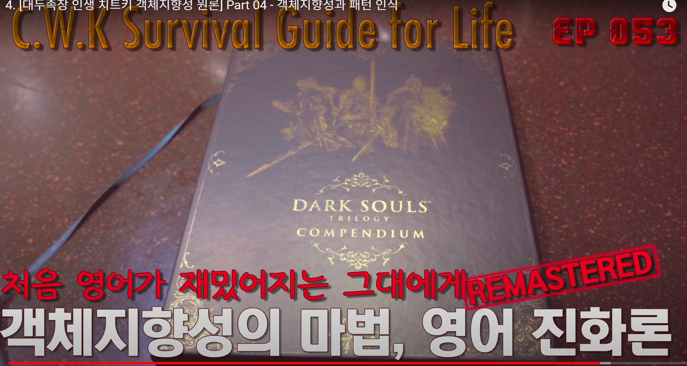

# [대두족장 인생 치트키 객체지향성 원론] Part 04 - 객체지향성과 패턴 인식

**영상링크 : https://youtu.be/iNKsJm1xBTA**

2021.11.9. 

요즘 아이들도 똑같겠지만, 그건 뭐 변하지 않는 거니까 사람이. 저 어렸을 때도 맛있는 반찬이 나오면 그 때는 또 풍족할 때가 아니니까 맛있는 반찬이 나오면 그것만 눈이 고정돼 있죠. 너무 그 반찬만 집어 먹으면 혼나니까 눈치 보이고. 이제 눈은 거의 고정돼 있는데 다른 반찬도 가끔 집어 먹으면서, 김치도 집어 먹으면서 소세지 먹고, 다른 것도 집어 먹고 소세지 먹고, 소세지 소세지 김치 소세지 소세지 소세지 김치 이러는 거죠. 그렇게 소세지만 좋아하고 요즘 아이들이 그렇게 먹으면 아마 아토피 걸리죠. 소세지 같은 음식이 아이들 피부병의 원인이니까 HBO 홈페이지에 가서 발암물질에 대해서 찾아보면, HBO가 공인한 발암물질을 찾아보면 저희들이 그냥 먹는 음식들이 있잖아요. 그게 나옵니다. 놀랍게도 근데 그걸 먹고 있거든. 그게 제일 맛있어. 음식료 업체들이 그런 제품들을 만들어서 파는 거고.

> 'WHO를 말씀하시는거구나~' 라고 맥락을 생각하며 새겨들었습니다^^

몸에 안 좋은걸 뻔히 아는데 그렇게 파는 거야. 제가 일전에 자주 소개해 드리는 맛의 비결 얘기할 때 객체지향적으로 얘기할 때 소개해 드리는 책이 'fat salt sugar', 짠맛 단맛 기름맛, 기름맛 짠맛 단맛이죠. 제목으로 보면. 그게 원래 요리에 관한 책이 아니고 음식료 업체의 그런 뻘짓, 횡포 어렸을 때부터 아이들을 중독시켜서 나중에 어른이 돼서도 그 중독에서 벗어나지 못하게 만드는, 단맛에 사로잡히고 짠맛에 사로잡히고 기름맛에 사로잡혀서 벗어나지 못하게 만드는, 그 실체를 까발리는 책이거든요. 근데 그게 맛의 기본 원리이기 때문에 '왜 중독되는가'를 설명하기 위해서 fat salt sugar를 설명하는 거. 그 책을 한 번이라도 보신 분은, 거들떠라도 보신 분은 이해하실 텐데 그만큼 안 좋은 거죠. 편식도 안 좋고 안 좋은 음식을 먹는 걸 보는 어른들의 심정도 안 좋고. 그런데 그렇게 소시지만 편식하시는 분들이 아직도 많아요. 제 채널에 그걸 보는 제 심정은 '저거 발암물질인데'

그런 심정인 거고. 제가 계속 패턴 인식 얘기하고 '큰 그림 봐라' '이렇게 작은 패턴만 보지 말고 빠져나와서 큰 그림을 봐라' 그렇게 얘기를 해도 여전히 막막하신 분들도 계실 거야.

'그게 뭔 소린가' 그건 연습 안 하면 안 됩니다. 이 편협한 사고에 사로잡혀 있는, 그 습관이 장기평균이라고 했잖아요 많은 분들이. 그러니까 나와도 '뭘 보라는 거야' 그러는 거죠.

> '객체지향성'에 대해선 워낙 많이 말씀하셨어서, 저를 포함해 족장님을 짧게라도 팔로잉 해온 사람이라면 모두 들어본 적이 있을겁니다. 그리고 몇번 연습해보면 대에추웅 알 것 같기도 하고. 그런데 이 영상을 보면서도 느낀 거지만, 진짜 끊임없이 써먹어보고 훈련해봐야 됩니다. 그러지 않으면 알 것 같았다가도 까먹고, 알았다 하더라도 그 위력을 제대로 활용하는 레벨까지는 갈 길이 한참 남았거든요. 저는 앞에서 숙제를 모두 마쳤는데도, 이 영상을 보면 여전히 '몰랐구나', '모르는구나' 싶습니다. 평생 갈고 닦아야 하는 스킬이라는거죠. 희미하게 보이는 아주 가느다란 빛줄기를 놓치지 않으려 애를 써가면서...

힌트 하나 드릴까 이것도 많은 분들이 간과하고 계셨을 거예요 자문해 보세요 힌트 하나 드릴 테니까.

예전에 제가 올린 그 1300번째 '4년 트윗의 역사' 거기에 있던 트윗이에요 

원래는 영어로 올렸었습니다. 

'what is common between so-called long-term investment portfolios in the hands of day traders and savings accounts in the hands of gamblers' 

그러니까 장기 포트폴리오라는 걸 day trader가 운영하는 거, day trader 손에 맡기는 거, 그리고 저축계좌 이런 걸 노름꾼 손에 맡기는 거 공통점이 뭘까. 'if you ask me... Their days are numbered. Doomed. Their owners will rob them. Just a matter of when, but sooner than later.' 

그러니까 이런 계좌는 오래 못 간다는 거잖아요. 어차피 day trader나 투기를 하는 사람이나 노름꾼이 곶감 빼먹듯이 빼먹을 테니까 금방 바닥이 날 거라는 거죠. 얼마 안 가서 바닥날 거다. 

'Still, they're talking about separating gambling accounts from long-term ones.' 그런데도 '노름하는 계좌랑 투기하는 계좌랑 장기 계좌를 분리하면 어떨까, 경계를 세우면 어떨까, 그걸 내가 못 넘지 않을까' 이런 뻘짓을 한다는 거죠.

> X에서 '족장님 가르침 열심히 따른다'면서도 이러고 있는 사람들 참 많더라구요. '근묵자흑'이라 일부러라도 피해야할 판에 서로 가까이하고 팔로우 하면서 서로 물 들이고 물 들어가는 모습들을 이래저래 참 많이 봤었습니다. 근데 정말 웃픈 사실은, 족장님께서 보시기엔 저 역시 그들과 매한가지일거고, 똑같은 카테고리 안에 넣어놓으셨을 거라는거죠. 그러면서도 저는 이렇게 그들과 다른 '척'을 하고 있습니다. 도긴개긴이고 결국 부처님 손바닥 안이거늘...

'We already have a term for that, stupid' 그게 얼마나 뻘짓인지 지적을 하는 거예요. 'mental accounting bias' 얼마나 그런 뻘짓들을 오래 했으면 행태재무학에서도 이미 용어가 만들어져 있다고요. 'mental accounting bias' 머릿속에서 없는 경계를 만드는 거야. 존재하지 않는 경계인데 머릿속에서 만들면 왠지 그 경계를 따라서 내가 뭔가 할 수 있을 것 같고, 그게 억제를 시켜줄 것 같고. 노름 계좌와 투기 계좌와 장기 비전투자 계좌 딱 나눠서 '난 이걸 분리해서 사용할 수 있다' 이게 뭐랑 같냐면요. 없는 경계를, 저 큰 바다를 보고 거기 경계가 있다고 착각하는 거예요. 여러분들 지도 보면 막 오대양육대주 이렇게 경계 있는 거 같잖아. 그게 실제 경계가 있어요? 경계가 있어요? 없다니까.

그 바다 아무 경계도 없어. 그걸 이런 식으로 mental accounting을 하는 거예요. 경계가 있다고 착각하는 거죠. 뻘짓입니다. 대표적인 뻘짓 중에 하나예요. 'What matters is your total portfolio return' 결국은 바다는 하나라는 거야. total portfolio return이 중요한 거거든요. 내가 100만 개로 계좌를 나눴다고 하더라도 'to be ruined by your gambling habits no matter how many separate buckets you use' 100만 개로 나눴다고 하더라도 투기 성향이 있는 사람은 결국은 그 존재하지도 않았던 경계가 무너지기 때문에. 그리고 억지로 계좌를 나눠놓았다고 하더라도 결국은 토탈이잖아요. 그 수익률은 합쳐지는 거라고.

그리고 언젠가는 투기했던 포트폴리오에서 이 장기 포트폴리오를 갉아먹을 거기 때문에. 투기를 다 날려먹을 거 아니에요 투기계좌를. 그럼 하나씩 하나씩 또 빼먹는다고. 

조금만 더 옮겨서 해볼까? 조금만 더 옮겨서 해볼까? 그러다가 나중에 봤더니 장기 포트폴리오도 바닥이 난 거죠. 대표적인 뻘짓입니다. 그래서 전체를 보는 그림이어야 돼. 전체를. Total Portfolio Return. Mental Bias로 경계를 나누는 게 아니야. 이게 힌트죠. 여기서 이게 와야 되거든요. 세상도 그렇게 봐야 한다고. 

무슨 우리가 학교에서 공부를 하니까 과목이 있잖아. 선생님들도 다르고. 다 달라 보이죠. 경계가 있는 것 같고. 근데 여기서 짬밥을 조금씩 조금씩 쌓잖아. 조금씩 조금씩 짬밥을 쌓으면 제가 '호라이즌이 포개진다'는 의미거든요. 

이러고 날라간다는 의미고. 포개지니까 더해지는 게 아니고 경계가 무너지기 시작합니다. 거기서 얻은 인사이트나 깨달음 같은 게 서로 영향을 주거든요.

> '경계를 허물어라', '통섭' 이런 말들이 한 때 참 유행이었고, 그래서 대학교들도 여러 전공을 믹스하고 자유롭게 넘나들며 배울 수 있는 커리큘럼을 만들었었죠. 그런데 실제로 이렇게 경계를 넘나들면서 이 분야의 지식을 다른 분야에 접목시켜보거나, 이 분야의 통찰을 다른 분야에 적용해보거나 하는 노력이나 시도들은 왜 그렇게 해보지 않았을까요. 참으로 놀랍고 신기하지 않을 수가 없습니다. 그나마 다행인건, '객체지향'을 익힌 컴쟁이들마저도 그러지 않는다는 건데(다행인지 불행인지😂), 제가 정말 고민을 많이 해봤습니다. '왜 족장님은 알았고, 저는 몰랐을까', '아니 심지어 객체지향으로 밥을 먹고 사는 컴쟁이들은 왜 몰랐던걸까', 저와 족장님 모두 똑같이 '경계를 허물어라', '분야간 통섭이 중요하다'는 통찰을 접했는데 왜 나는 몰랐고 족장님은 갈고 닦아 인생 치트키로 활용하신걸까'. 제 나름대로 답을 찾았는데, 아래에서 이야기해보겠습니다.

그러다 보면 이렇게 올라와서 보게 돼. 경계가 없었던 거구나. 제가 얼마 전에도. 그런 말씀 드렸잖아요. 사진이나 영상은 빛의 예술이다. Exposure Triangle.

그런 얘기를 하면, 그걸 처음에 공부하는 사람이, 그것만 생각한다니까. 광량에 대해서 공부하고 과학적인 상식이라고만 생각을 하는 거야. 과학이 뭐야. 산수잖아요. 산수가 뭐야. 이 유니버스의 치트키라니까. 그럼 이 유니버스를 구동하는 원리에 들어가 있을 거 아니에요. 그래서 빼서 보면 그 원리는 어디든 적용된다니까. 그게 토탈 포트폴리오 리턴이야. 다른데도 적용이 된다고. 경계가 있는 게 아니고. 그래서 빼서 보면 '아 이게 에너지에 대한 거구나'. '에너지는 포개지면 폭증하는구나'. 더해지는 게 아니고 '로그질을 하는구나'. 그걸 알게 돼요. 

그래서 제가 행복 이런 거 얘기할 때 그런 얘기를 하는 거야. 과학적인 상식이라고요. 근데 그걸 과학으로만 보는 사람은 그 그림을 못 봐. 행복이 곱해진다는 사실을 그 패턴을 뽑아내질 못한다고. 그게 편협한 시각의 폐해야. 여전히 장르가 있다고 생각하세요? 과학, 역사, 뭐 우리가 학교에서 배우듯이 그렇게 장르가 있다. 정치, 문화, 객체지향성도 계속 강조를 하거든요. 인생, 제가 인생 치트키라고 할 정도면 어마무시한 무기잖아.

솔직히 그걸 들으셨던 몇 분이나 객체지향성에 대해서 관심을 가져보셨나요? 

사실은 객체지향성을 공부하면 뭐. 산수, 통계 이걸 안 할 수가 없거든요. 먹고 들어가는 거야. 깔고 들어가는 거야. 왜 깔고 들어가느냐 하면 코딩이거든요. 코딩의 기본은, 하나는 산수고 하나는 통계야. 좀 깊이 들어가면. 그러니까 당연히 하게 돼 있어요. 그래서 약간 난이도가 높은 거고 객체지향성이. 

몇 분이나 객체지향성에 대해서 파고들어 보셨습니까? 제가 치트키라고까지 얘기를 했는데. 뭐 제 채널에 오래 오셨고 저를 오래 아셨는데도 전 객체지향성에 대해서는 10년 넘게 주절거리고 있으니까. 그런데도 아직도, '뭐 저건 먼 사람들 얘기다', '내가 할 건 아니다' 이렇게 착각을 하고 계신 분이 계시다면 제가 도와드릴 길이 없어. 

인생 치트키라고 얘기했어요. 치트키. 

치트키라는 게 뭐냐면 이것도 혹시 모르시는 분 계신가? 이건 예능에서도 막 쓰는 말이라. 게임의 난이도가 아무리 높다고 해도 치트키가 있잖아요. 특히 가드 모드 같은 거. 가드 모드가 신 모드입니다. 맞아도 안 죽어. 그래서 게임을 당연히 100% 깨게 돼 있어. 막보도 눈 감고 잡아. 가드 모드니까. 치트키가 그렇게 무서운 거거든요. 치트잖아. 난이도를 무너뜨리는 꼼수 중에 하나라고. 

근데 이게 정당한 꼼수야. 진짜 꼼수가 아니고. 난이도가 언뜻 높아 보이는 이 게임, 인생 게임. 유니버스 엔진. 이거를 이해하는 치트키라고요. 그렇게까지 말씀을 드렸는데 객체지향성을 모르고 계시면, 객체지향성을 누군가는 이미 알고 있고 저는 오래 전에 알았으니까. 1980년대 후반부터 공부를 했으니까. 객체지향성이 이제 막 나오기 시작했을 때부터 공부를 했으니까. 꽤 오래됐죠. 이런 사람이 있다고 치세요. A라는 그룹이 있어요. 이렇게. 요즘 코딩을 하는 컴쟁이들은 거의 다 압니다. 기본이기 때문에. 그리고 B라는 그룹은 저처럼 이렇게 자꾸 자극을 줘서 객체지향성이라는 게 이렇게 무서운 치트키입니다. 거기서 자극을 받아서 '그래 나도 한 번 해볼까?' 그리고 봤더니 '어? 정말 치트키네' 라고 깨달은 부류가 있을 거고 못 깨달은 부류도 있을 겁니다. 그런 부류가 있을 거예요. 그런데 C라는 부류는 '아 저건 내가 갈 길이 아닌가 봐' 난 객알못. 게임알못 하듯이 게임을 알지 못하는 부류라고 생각을 해서. 그냥 그렇게 자기가 족쇄를 채우는 거죠. 

> 찔끔 이해하게된 요즘은 객체지향성에 대해 주변에 전도하지 않을래야 않을 수가 없겠더라구요. 그래도 '정확하게', '제대로' 전도하는 것이 중요하기 때문에 아주 조심스럽지만요.

'난 객알못이야. 객체지향성은 모르겠어. 너무 어려워' 이러고 있는 부류가 있어요. 뭐 인생 그렇게 살아도 상관없다니까. 자기 선택이니까. 

그런데 A, B, C 이 세 부류가 경쟁을 하는 사회라고 생각을 해보세요. C가 살아남을 수 있을까? 전 단언할 수 있는데 경쟁을 해야 한다면 살아남기 어렵습니다. 도태될 거예요. 치트키를 쓰는 사람이랑 그냥 고생을 하는 사람이랑 경쟁을 해서 멀티 플레이를 해서 게임 속에서. C그룹이 살아남을 가능성은 제로에 가깝습니다. 그건 당연한 상식이에요. 여러분들이 저를 경쟁자로 봐 한번. 그냥 주절주절거리는 노땅, 뭐 그렇게 생각하지 마시고 경쟁을 한다고 생각해봐. 이길 자신이 있냐니까. 치트키를 다 쓰고 있는 사람인데 제가 강조를 하니까, 인생 3대 치트키라고. 산수 통계도 하고 역사패턴도 보고 객체지향성도 알고 패턴을 한눈에 끄집어대는 스킬이 있고, 이렇게 보는 게 아니에요. 이렇게 보면 큰 패턴을 가려낼 수 있는, 객체지향적으로 세상을 바라보니까 그게 습관이 된 사람이니까. 30년 동안. 그런 사람 이기겠냐고. 객체지향성 얘기를 하면 어려워 보이지만 도입부에 해당하는 객체지향성의 3대 축 정도만 이해를 해도 치트키로 충분히 활용할 수 있다니까요. 

> 그냥 간단하게 주식을 생각해보면 됩니다. '시장에서 돈 벌려면 나를 이겨야 한다'는 족장님 말씀을 단 한번이라도 진지하게 생각해봤다면, 족장님을 따르면서 곡성 안에 들어와있는 사람들은  이 딜레마 - 족장님을 이기지 못하는데 어떻게 돈을 벌어서 살아나가겠다는 것인가 - 를 어떻게 해결해야 할지를 밤새 고민해봐야 합니다. 해결책이 나오는 것과는 별개로요. 그냥 '어떻게 되겠지'라며 별 생각 없이 남아있다는 것 자체가 위험하다는 겁니다. '객체지향적으로' 그런 객체들은 절대 돈을 벌어서 살아나갈 수가 없거든요. 족장님께서 말씀하셨듯, '스스로 Bug를 자처하거나 Outlier라고 자뻑하는 것'입니다. 다소 늦었지만, 족장님의 위 말씀이 크리티컬하게 와닿은 순간 전 도저히 시장에 남아있을 수가 없었습니다. '내가 썩은 동앗줄을 잡고 있구나'라는 생각이 들었습니다. 그래서 나갔었습니다. 한동안은 아예 X에도 들어오지 않고 영어 습득에 매진하면서 관심을 껐습니다. 그런데, 제가 간과했던 것이 있었습니다. 결국 시장은 '곡성'이었다는 것이고, 나의 모든 꿈과 욕망과 희망을 실현시켜줄 것 같은 미켈라의 눈을 정면으로 바라봤다는 것이죠. 그리고 결국 돌아왔죠. 그리고 이대로면, '객체지향적으로' 남아있는 저의 곡성 여행은 불을 보듯 뻔하게 정해져 있기 때문에 특단의 조치가 필요했습니다. 그래서 나름대로 '장치'를 만들었습니다. 제 입장에선 정말 견고한 장치고 특단의 장치입니다. 그럼에도, 언젠가 다가올 저의 doom's day를 기다리고 있습니다. 만약 곡성에 들어와있으면서 족장님을 따르는 분들 중에 이 글을 보시는 분이 진짜 혹여라도 계신다면 정말 족장님의 저 말씀을 critical하게 생각해보시는 것을 권해드립니다... '객체지향성'을 조금이라도 이해하신다면, 정말 잠이 오지 않아야 합니다😂

> '왜 똑같이 "경계를 허물어라"는 말을 들어놓고도 족장님은 30년간 수행하고, 저는 지나쳤는가'라는 의문에 대한 저의 답은, 결국 '남의 말을 critical하게 듣는 습관'의 차이라는 겁니다. 족장님께서 다른 영상에서 잠깐 말씀하신 바 있습니다만, 이게 정말 중요한 차이라고 생각했습니다. 달리 말하면, 그냥 '좋은 말 하나보다', '훌륭한 말이지', '알 것 같아' 라면서 넘기는 습관이구요. 이 차이 하나가 정말 많은 걸 결정짓습니다. 물론, 살면서 모든 말, 모든 통찰을 critical하게 받아들일 수는 없을 겁니다. 저마다 때가 있기도 하고, Normalization은 생존을 위해 필요한거니까요. 하지만 이런 경각심조차 없다면, 인생을 바꿔줄 수도 있는 모든 통찰을 매번 스킵하고 빨리감기 해버린 뒤에 후회할 겁니다.

제가 도입부에 말씀드린 멘탈 어카운팅 바이어스하고, 토탈 포트폴리오 리턴, 이걸 '아 이건 행태 재무학이나 투자에 관련된 거구나' 라고 이렇게 갇혀서 생각하는 게 객체지향성을 모르거나, 객체지향성을 제대로 활용하지 못하는 일부 컴쟁이. 있어요. 일부 컴쟁이들의 시각인 거예요. 습관을 잘못 들여서. 이렇게 나와서 보면 다 적용이 된다고. 우리 인생에도 적용이 되는 말이라고 인생의 짬밥.

인생의 내공을 생각해봐. 이걸 장르별로 구분할 수 있다고 생각해요? 

이게 결국 모인 거라니까? 누군가의 인성 성품, 이게 한 군데에서는 좋고 장르별로 누군가의 자선사업, 자선사업하는 장르에서는 좋은 사람이고 일생을 살아온 짬밥에서는 그냥 그냥 그런 사람이고. 이게 가능해요? 합쳐져야 되는 거잖아. 

토탈 포트폴리오 리턴이라고요. 토탈 인생 리턴이라고. 그게 그 사람의 내공이고 그게 바로 그 사람이야. 모든 경험과 모든 메모리와 모든 기억 이거의 총합이 그 사람이잖아요. 그 사람의 삶을 평가할 때 그렇게 해야 되는 거죠. 허물도 알아야 되는 거고 공도 알아야 되는 거고. 그렇게 따져야 되는 거잖아. 그럼 뭐가 달라? 여러분들이 빌게이츠라는 인물을 봤을 때 자선사업하는 면만 보고 '좋은 사람이다' 그 빛만 보는 거잖아요. 눈이 멀 정도로 눈부신.

근데 그간 살아온 궤적이나 지금도 뒷구녕에서 살고 있는 좀 어두운 면 이건 못 본다면, 그 빛에 눈이 멀어있는 거거든요. 괜히 경계를 세워서 그 안에 들어가서 멘탈 어카운팅을 하고 있는 거야. 토탈 포트폴리오 리턴을 보지 못하고. 빌 게이츠 사는 사람의 인생을 토탈로 보지 못하는 거라고. 뭐가 달라요?

> 약간 맥락을 벗어난 이야기지만, '특정 전문직에게 요구되는 고도의 윤리 같은건 없다. 모두가, 인생의 모든 순간에 이상적인 사람이 되는 것을 지향해야 한다'라는 취지의 찰리 멍거의 말을 기억합니다. 제 기억에서 왜곡되었을 수 있고, 찰리 멍거가 생각했던 취지와 다르게 받아들인 걸 수 있으며, 찰리 멍거와 저는 개미와 코끼리 만큼 차이가 나기 때문에 함부로 인용할 것도 아님을 알고 있습니다. 그럼에도, 제 인생의 결절점에서 '어떤 선택을 해야 하고 어떤 모습이어야 하는가'에 관해 항상 영롱하게 빛나는 등대 역할을 해주는 몇가지 지침 중 하나입니다.

이게 객체지향성의 힘입니다. 객체지향적으로 바라보면 인스턴스들이 있다고요. 이건 알아서 공부하세요. 못 알아들으셔도 '나는 평생 못 알아들을 거야 객알못이니까' 그건 제가 도와드릴 방법이 없다니까. 여기서 삘 받고 자극 받고 뒤통수를 한 대 얻어 맞으시고. '아 진짜 공부해야겠다' 막 불안해야 돼.

'저걸 아는 사람들이랑 경쟁한다면 나는 당연히 밀리겠구나' 그런 위기감을 느껴야 되는데 못 느끼시면 내가 할 말이 없으니까. 이렇게 인스턴스들만 있으면, 객체지향성에서 말하는 클래스라는 건 국화빵 거푸집이고, 그 템플릿 여기서 찍혀 나온 국화빵 하나하나를 인스턴스라고 하는 거거든요. 그래서 영어에 for instance가 있는 거라니까. 예를 들어 한 사례 사례 사례 사례들이니까. 이 사례 사례 사례들을 모으면, 얘네들의 공통점 공통분모를 쫙 모으면 거푸집이 나오겠죠. 그게 템플릿이었으니까. 그 클래스를 뽑아낼 수 있다고. 그게 제가 말하는 패턴이에요. 그 패턴을 인식하는 거라고 '이 패턴에서 찍혀 나온 이벤트이겠구나'. '이 패턴에서 찍혀 나온 인스턴스이겠구나' 뭐가 다르냐니까. 객체지향성으로 설명 안 되는 이벤트가 사실상 존재할 수가 없다니까 왜?

이 유니버스가 객체지향적으로 만들어져 있다고. 영웅담 얘기하잖아요 제가. 

> 그나마 숙제도 하고, 족장님 영상들 정리를 하고 왔더니 쬐끔이나마 어떤 말씀 하시는지 이전보다는 이해가 되는 것 같아 기쁩니다.

히어로스 저니. 여러분들이 모두 히어로스 저니를 경험하고 있거든요. 그 히어로스 저니 하나하나가 인스턴스예요. for instance 하는 것처럼 그쵸? 그리고 제가 영상을 만들어서 '이런 템플릿이 있습니다. 헤라클레스 때부터 전해져 내려오는', 모범적인 사례인 거고 헤라클레스는. '그 템플릿이 있습니다' 라고 말씀드렸을 때 그 템플릿이 히어로스 저니라는 클래스라고. 그 거푸집에서 찍혀 나온 국화빵들인 거라고. 히어로스 저니 하나하나 인스턴스가. 조금씩 다를 뿐이야. 조금씩. 그 대빵 클래스에서 찍혀 나와서 거기서 진화를 해나간 녀석들도 있고, 좀 더 세분화가 돼서 조상 객체나 조상 클래스, 아주 예전에 히어로스 저니랑 조금씩 조금씩 달라 보여도, 그 조상 클래스에서 상속을 받아서 공통분모는 계속 유지를 하면서 진화를 해나가거든요. 진화를 해나간다는게 아래로 내려갈수록 진화를 해나갈수록 복잡해지거든요.

복잡해집니다. 그렇게 개성을 추가해 나가니까. 공통분모만 있는 게 아니고 추가해나가니까.

다형성이라는 게 생긴다고. Polymorphism이라는 게. 그렇게 밑으로 내려가면, 복잡해지면 단점이 뭐냐면 복잡하니까 패턴을 보기가 어려워요. 그래서 편협한 시각을 가지면 단순했던 조상 객체 조상 클래스, 얘네들을, 대빵 패턴을 끄집어내기가 어려운 거라고. 근데 너무도 많은 분들이 이러고 사시는 거라고.

테슬라만 바라보잖아? 주식쟁이 여러분? 3년 동안 테슬라를 공부하고 있잖아?

> '투자에는 실라버스가 없다'라는 말씀이 이런 의미겠죠. 족장님께서 테슬라 외에도 여러 기업들을 성공적으로 잘 발굴해내시는 이유일거구요. 

그러면 인스턴스 하나 공부하는 거잖아. 그 인스턴스 패턴만 공부하는 거라고요. 아주 작은 사례 하나만 공부를 하는 거야. 그러면 넥스트 테슬라 넥스트 테슬라 여러분 그러잖아. 테슬라 패턴을 끄집어내야 될 거 아니야. 

S-curve의 초입 티핑 포인트에 있는 기업을 끄집어내려면, 테슬라를 찍어낸 이 히어로스 져니를 찍어낸 템플릿 대빵 클래스 그 거푸집을 찾아내야 될 거 아니에요. 그게 패턴이라고. 그러려면 어떻게 해야겠어요. 테슬라라는 국화빵 하나를 먹어보고 막 잘라보고 난도질 해보고 뜯어보고 보여 그게? 국화빵 하나인데 국화빵이 세상에 얼마나 많은데.

국화빵도 다양합니다. 호두를 집어넣은 것도 있고 뭐 다양한 맛을 내는 것도 있고. 그럼 나와서 국화빵이라는 대빵 클래스부터 보기 시작해야 될 거 아니에요. 단순화해서. 진화되기 전에 복잡해지기 전에 대빵 클래스. 그걸 보는 능력, 그걸 기르면 그게 객체지향성을 치트키로 활용하는 인간들이에요. 이 말을 듣고 컴쟁이 분들 중에서도 '객체지향성이 그런거였어?'

실제로 그런 분이 계셨으니까. 객체지향성을 코딩할 때만 활용하셨던 분이면 치트키가 있는데도 인생에 활용을 못하고 사신거라고. 뭐 어쩔 수 없는 현실이야. 이렇게만 보면 안 보인다고. '객체지향성이 컴퓨터에서만 얘기하는 거다' '코딩할 때만 활용하는 거다' 똑같은 패턴입니다. 

객체지향성을 활용한다는 그 인스턴스 하나만 보는 거야. 끄집어내서 객체지향성을 어떻게 활용할 수 있는지 모든 이 유니버스, 유니버스 구동 엔진 자체에 적용할 수 있다는 사실을 간과하게 되는 이유라고. 컴퓨터 코딩이라는 벽을 세워서 멘탈 어카운팅을 하니까 이러고 들어가니까. 

뒤에서 빵 터지는게 있는 하루가 되시길 바래요. 지금까지 이렇게 열변을 토했는데도 '객체지향성은 난이도가 좀 높은 치트키다, 인생 치트키다' 그렇게까지 말씀을 드렸는데 '난이도가 높으니까 난 객알못일거야' 그렇게 생각하셨다면 난이도가 살짝 높은 치트키라는게 뭘까요. 그만큼 위력이 빵빵하다는거야. 객체지향성을 이해하고 활용하는 자, 절대 못 따라갑니다. 믿거나 말거나가 아니고 이건 믿을 필요도 없어 의심할 필요도 없고.

> 책을 읽거나 공부를 하면서 지식을 얻을 때도 일종의 도파민이 분비됨을 느낍니다. 다음의 영상들은 제가 관심있어 하는 언어 공부에 집중된 내용들이라 도파민이 더욱 많이 뿜어져 나올 것 같습니다.