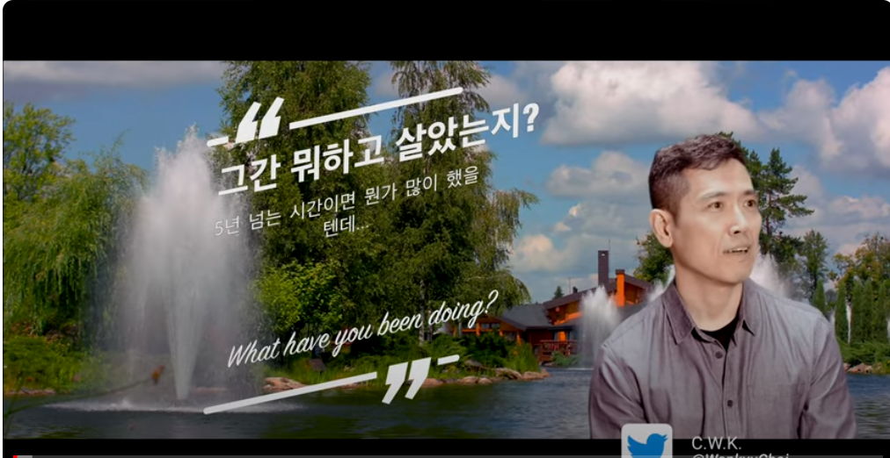
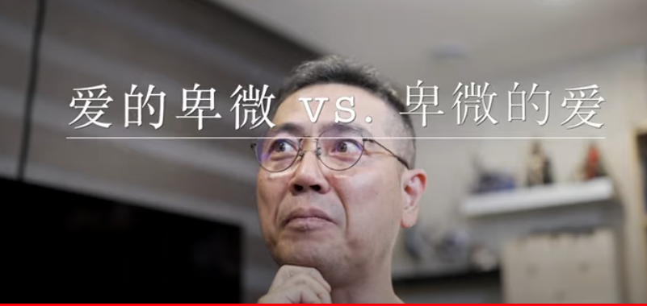

# [대두족장 인생 치트키 객체지향성 원론] Part 06 - 객체지향적 언어 공부 2부(다국어 하는 객체지향적 비기)

**영상링크 : https://youtu.be/0aIM6f6x0Bc**

> 언어 학습에 대해 여러 면에서 아주 좋은 통찰을 알려주신 영상이었습니다. 어떻게 하면 즐기면서 언어를 학습할 수 있는지, 어떤 길로 가야 효율적으로 언어를 학습할 수 있는지 등 정말 살아 숨쉬는 교과서를 읽는 느낌이었습니다. 사실 외국어 학습에는 '왕도', '정해진 길' 이라는 것이 딱 정해져 있지는 않겠지만, 족장님처럼 공부하고 학습한다면 언어가 안늘 수가 없을 것 같습니다. 제가 600시간 영어 드라마, 영화, 애니 무자막 시청을 했던 경험도 있다 보니 좀 더 많은 것들이 와닿았던 내용이었습니다. 제가 600시간 무자막으로 시청을 했던 것은, 'Steven Krashen' 박사의 Language Acquisition에 관한 영상과, 족장님의 영어 학습 방법에 관한 내용들의 공통 분모를 생각했기 때문입니다. Krashen 박사의 영상 링크는 https://www.youtube.com/watch?v=NiTsduRreug 입니다. 'How do we acquire language?'라는 질문에 대한 Krashen 박사 나름의 답변에 관한 것인데 정말 많이 와닿았던 영상입니다. 물론! 모국어로서의 언어를 학습하는 것과, 모국어가 아닌 제2외국어를 학습하는 것은 완전히 다른 영역일 수 있고, 다른 방법이 필요할지도 모르며, 모국어를 습득하는 것만큼의 효율과 결과를 보장하는 방법을 찾기란 정말 쉽지 않을 겁니다. 그런데, 족장님께서도 말씀하셨듯, 결국  뭘 들어본게 있고 읽어본게 있어야 언어를 잘 구사할 수 있다는 사실은 외국어든 모국어든 변함이 없습니다. 그래서 대량의 input이 필요하다고 생각을 했는데, input의 quality가 매우 중요합니다. 'quality'를 오해하면 안되는데, 제아무리 한국어를 잘 구사하는 사람이라도 대학원생을 상대로 하는 물리학자의 양자역학 강의는 이해할 수 없습니다. 마찬가지로 한국어를 아무리 잘 구사하더라도 경제 상식이 전혀 없는 사람이라면 한국은행 총재의 연설을 100번을 들어도 이해할 수 없을 것입니다. input을 잘 선정해야 실질적인 언어 실력의 향상을 기대할 수 있습니다. 우리는 모두 아무런 사전 언어 지식 없이 모국어를 익힙니다. 그리고 그 과정에서 '듣기'-'흉내내며 말하기'-'읽기'-'말하기'-'쓰기'의 순서로 언어를 습득합니다. 최초의 '듣기' 단계는 거의 상황과 맥락만으로 '음성'이 어떤 의미인지를 대략적으로 유추하고 추론할 수 있는 수준이어야 합니다. 사실상 우리는 모두 '무자막 시청' 단계부터 언어 습득을 시작했습니다. comprehensible input이라고 하는데, 뭘 모르는지도 모르는 저의 말보다는 저 영상을 보시면 조금 더 이해가 쉬우실 겁니다. 족장님께서는 좀 더 현실적으로 효율적인 학습 방법을 제안하고 있으신 것 같습니다. 대략 어떤 언어를 아주 기초적인 어휘 수준에서 알아듣기까지는 약 2,000시간의 listening input이 필요하다고 합니다. 2,000시간이면 하루도 빠짐없이 매일 3시간 씩 들어도 600일입니다. 그리고 읽기, 쓰기, 말하기 등의 단계까지 모두 거치려면 정말 한 언어당 10년씩은 걸릴 겁니다. 그럴바엔, LLM도 있겠다, Reading Comprehenshion에 몰빵을 하는 것이 훨씬 효율적이라는 말씀이신 것 같습니다. 어차피 듣기도 자막이 있으면 읽기에 가까워지니까요. 저의 일천한 경험으로는, 정말 몰입해서 흥미를 느낄 수 있는 '맥락과 상황만으로 이해가 가능한' 영상으로 충분히 들어줌으로써 귀를 해당 언어에 노출을 시킨 뒤 '따라 말하기' - '오디오를 들으며 활자를 함께 읽기' - '본격적인 읽기' - '말하기' - '쓰기'의 순서로 'Acquisition'을 하기 위해 노력한 방법이 효과가 있었습니다. 족장님의 방법론을 따라할 때 유의해야할 것은, 저를 비롯한 대부분의 사람들이 '외국어' 하나를 제대로 습득하거나 연구해본 사실이 없다는 점입니다. 즉, 객체지향적 언어 학습을 위한 토대가 마련이 안되어 있다는 것이죠. 그래서 저는 영어에 많은 시간을 투자했던 것인데, 나름대로의 효과를 봤던 것 같습니다. 제2외국어는 족장님의 방법을 적극 활용한다면, 좀 더 효율적이고 AI 시대에 적합한 외국어 학습이 되지 않을까 싶습니다.

> 여담입니다만, 요즘 X에 거의 접속하지 않고 있습니다. 족장님의 게시물만 보고 있습니다. 저는 요즘 그 어느 때보다 시장과 최대한 멀어지기를(워낙 일이 바빴어서 원치 않아도 멀어질 수 밖에 없었던 상황이었습니다만) 원하고 있습니다. 시장이 정말 심상치 않은 것 같습니다. 시장을 예측하는 것은 아니고, 시장을 예측할 줄은 당연히 모릅니다. 버핏도 못한다는 걸 제가 할 수 있을리가 없죠. 그런데, 이런 일화가 떠오릅니다. 댐에 아주 작은 균열이 생깁니다. 티도 안납니다. 바로 앞에서도 현미경을 들이대지 않으면 보이지 않을 정도로 작습니다. 아니면, 댐 한쪽 틈에 비버가 나뭇가지들을 넣어서 집을 짓는다고 생각해볼 수도 있습니다. 비버가 댐 근처에 집을 짓는건 흔한 일이라 아무도 주의를 기울이지 않습니다. 그리고 점점 그 아주 작았던 균열이 계속 커집니다. 비버의 집이 댐의 틈을 점점 비집고 들어갑니다. 그러면서 균열과 틈이 점점 커지고 누적됩니다. 그러다가 어느 날 나뭇가지 한 더미가 흘러내려가다가 그 균열과 틈을 아주 살짝 때립니다. 그리고 쾅! 댐이 무너집니다. 아니면 폭우가 와서 거세진 물줄기가 그 균열과 틈을 때리고 댐이 무너졌다고 생각해도 좋을 것 같습니다. 요지는, '언제', '무엇이' 그 댐을 무너뜨릴지는 절대 알 수 없습니다. '절대' 알 수 없다는 것이 중요합니다. 사람들은 댐이 무너지고 나면 그 결과를 분석합니다. 그 사후적 분석에서는 단 하나의 원인을 찾으려 합니다. 그런데 사실 마지막 1타를 때린 나뭇가지나 폭우보다는 그동안 계속 누적되어 왔던 균열과 틈이 훨씬 중요합니다. 그리고 그걸 알아보는 것이, 하루에도 수백개씩 흘러내려가는 나뭇가지나 일년에도 몇번씩 오는 폭우 중 어떤 것이 댐을 무너뜨리는 막타일지 예측하는 것보다 비교도 안될 정도로 쉽습니다. 어떤 나뭇가지냐, 어떤 폭우냐보다도 '언제인지'를 맞추는 것은 불가능에 가까울 정도로 어려울 것입니다. 그래서 '균열과 틈의 누적'을 알아보는 것이 무척 중요합니다. '누적'은 보입니다. 균열과 틈의 누적을 찾아내고 이를 보수하면 됩니다. 어떤 나뭇가지가, 어떤 폭우가 댐을 무너뜨릴지 예측하는 것보다 쉽죠. 다른 예시를 하나 들어보면, 모래알을 매초 한개씩 쌓고 있다고 가정해보겠습니다. 모래알이 하나씩 계속 쌓입니다. 위태롭게 계속 쌓여갑니다. 그러다가, 어느 한 개의 모래 알갱이가 모래의 '누적'을 무너뜨립니다. '누적'을 무너뜨리는 모래 알갱이 한개가 언제, 어떤 것이 될지는 알 수 없습니다. 그러나, 누구라도 모래의 누적을 알아볼 수는 있습니다. '아 저렇게 계속 쌓여가다간 언젠간 무너지겠다'. 아무리 모래 누적이 높이 쌓여도, '무너진다'는 사실에는 변함이 없습니다. 'This time is different'일까요? 그 착각이 오래 지속될 수록 '누적'의 붕괴가 필연이 될 뿐입니다. '누적'의 붕괴가 disaster에 가까워질 뿐입니다. 버핏이 '시장을 예측하지 못한다'고 말하는건 아마 이런 차원의 이야기일거라고 감히 생각해봅니다. 버핏이 그렇게 말하면서도 그토록 훌륭한 마켓 타이머인 이유는, '시점'을 맞추는건 정말 불가능하지만, '누적'을 알아보기 때문일 겁니다. 족장님께서도 매번 말씀하시는 것이, '언제인지는 중요하지 않다', '일어날 일은 일어나고 만다'는 것입니다. 댐의 균열과 틈이 제 아무리 커지더라도 '언제', '어떤 계기'로 댐이 무너질지는 절대 알 수 없습니다. 하지만 반드시 무너집니다. 매초마다 떨어지는 모래 알갱이 중 대체 어떤 모래 알갱이 한개가, 언제 모래더미를 무너뜨릴지는 '절대' 알 수 없습니다. 그러나, 매초 떨어져 쌓인 모래 알갱이의 누적은 반드시 무너집니다. 시장이 심상치 않다고 느끼는 이유는 여러가지가 있습니다만, 정말 많은 사람들이 X에서 올리는 글들을 볼 때마다 'This time is different'라고 한 목소리로 외치는 것 같습니다. 그렇게 외치는 사람들의 수가 너무 많고 소리가 너무 커서 섬뜩합니다. 그리고 market crash의 중요한 지표 중 하나라고 여겨지는 T10y와 T2y의 금리차 역전 현상이 과거 그 어느 때보다 깊고 강력하게 왔다 갔다는 사실도 있습니다. 물론, 이 지표는 결과적이고 상관관계이지 인과관계가 아니기도 하고, 실제 This time is different일 수도 있습니다. 그런데, 정말 중요한건 대비를 하는 사람이 아무도 없다는 겁니다. '누적'이 선명해지고 있다는 것입니다. 착각이 길고 클수록 현실을 깨닫기 위해 필요한 고통은 비례해서 커집니다. disaster가 됩니다. 정말 그 어느 때보다 큰 폭풍이 오고 있는지도 모르겠습니다. 아 그렇다고 제가 완전히 시장을 떠난 것은 아닙니다. 전 한번 경험해서 알고 있습니다. 완전히 떠날 수 없다는 것을요. 그래도 충분히 대비는 하고 있습니다. 정말 고통스러운 현실이 펼쳐지지 않기를 바랄 뿐입니다. 

행복하게 살려고. 지금도 행복하게 살긴 사는데 더 행복하게 살려고. 

아무도 관심 없을 테니까 패스. 그냥 잘 살았습니다. 운동도 하고 공부도 하고. 일도 하고 주로 일을 많이 했네요.

영어쟁이가 어디 가나요? 워낙 외국어에 관심이 많아서 원래 예전부터 집적대왔던 불어, 프랑스어라고 하죠? 아재 냄새가 나네 불어라고 하니까. 고등학교 땐 불어라고 했거든요. 불어, 일본어, 중국어 여기에 독일어, 스페인어, 이탈리아어, 러시아어 심지어 아랍어까지 깔짝대고 다녔어요. 근데 새로 시작하는 언어는 역시 영어나 일본어 수준까지 끌어올리기에는 나이를 생각했을 때 능력도 딸리고, 남은 시간도 많지 않다는 판단이 들었거든요. 그래서 중국어까지만 투자를 하기로 했습니다. 영어, 일본어, 중국어는 꾸준히 배우고 있고요. 세상 어떤 분야든 마스터라는 말을 좋아하지 않거든요. 세상에 다 배우는 건 없으니까, '여기까지가 끝이다' 그런 건 없으니까. 계속 배워나가는 거죠. 일본어나 중국어 얘기를 할지도 모릅니다. 일본어는 좀 하는 편인데, 중국어는 윤바리 형님이랑 친했던 그 이래 워낙 오래 안해서 처음부터 다시 하는 수준이고요. 그래도 여전히 외국어는 주 관심 분야입니다.

이건 아주 오래전에 한번 소개를 해드렸었는데 제가 쓰는 생산성 툴 중에, 생산성 개선 향상 툴 중에, 저는 맥을 사용하니까 키보드 마에스트로라는 녀석이 있어요. 

말 그대로 키보드 마에스트로니까 단축키 생산성, 어마무시하게 생산성을 높여줄 수 있는 녀석인데, 창의력 도구고 단순히 단축키만 사용하는게 아니고 이걸 응용을 해서 약간의 프로그래밍 마인드가 좀 있어야 되고, 코딩 마인드가 있어야 할 수 있고. 레고 블록 조합하듯이 그렇게 해서, 워크플로우를 만들어서 생산성을 높일 수 있는 도구니까. 저 ios 같은 데서 shortcut 있잖아요. 그것도 워크플로우를 막 조합을 하잖아? 레고 블록처럼. 뭐 그런 거나 마찬가지입니다. 키보드 마에스트로가 훨씬 더 sophisticated 되어있는, 그런 도구라는 차이만 있는데, 제가 외국어를 접할 때 응용하는 것 그것만 말씀을 드릴게. 다른 것들은 좀 너무 복잡하니까. 오늘은 외국어에 국한돼서 그 키보드 마에스트로를 한번 살펴보면, 하다 못해 제가 발음을 읽고 싶다고 하더라도, 그러니까 '샹와이 샤오로 예팅 위' 이런걸 중국어를 읽고 싶어, 중국어를 읽고 싶으면, 

제가 컨트롤 옵션 커맨드, 이게 한 손으로 잡기가 편하니까. 이걸 기준으로 9번이 중국어 거든요. 숫자 9번이. `샹와이 샤오로 예팅위` 이거를 제가 왜 중국어하고 일본어하고 헷갈린다고 하냐면 산 그 샹와이 샬로우 예팅 위 이거를 그냥 일본어로도 읽을 수 있거든. 일본어가 0번이거든요.

일단 뫼산자를 일본어는 야마로 읽잖아. 힛도어도, 사람인도 일본어로는 기도라고 읽어야 되고. 아니면 니혼진 하듯이 진으로 읽어야 하고. 근데 중국어로 읽으면 그걸 뤤이라고 읽거나 이래야 되는 거 잖아요. 인민 패가 그래서 인민 비 잖아. 렌민 비라고 읽는 거 잖아요. 제 사성이 엉망 이라서 제 발음을 중국어 발음으로 생각하시면 안 되고 인민 패를 렌민 비라고 읽는 이유잖아. 렌이라고 읽는 거잖아.

이 노래 가수 이름이 임연인데 발음이 인, 사람 인이랑 비슷하니까 렌 렌이라고 한다고 했잖아요. 중국어가 권설음 발음이, 굉장히 혀를 이렇게 말아서 하는 발음이 굉장히 섹시할 수 있거든요. 그래서 이렇게 보이스가 약간 허스키한 가수가 이런 렌 렌 같은 가수가 권설음 발음으로 이렇게 귀에다 속삭여주면 뿅 가는 거지. 그래서 그러는 거거든. 권설음 발음을 들으면, `렌 렌` 이게 권설음 발음이거든. 이러는 게.

그것도 있잖아 왜. 니 취팔러마 그러는 거. 너 밥 먹었니? 그러는 거. 취팔러마 그건데, 그것도 그렇다고 하거든요. 중국인, 현지 중국인들도, 현지인들도 그걸 꼭 권설음으로만 발음하지 않는다고 하거든. 원래 치판너마 그러면 발음이 잘못됐다고 지적을 당하는 거거든. 취팔러마 이래야 되는 거거든. 취 해갖고 그것도 혀를 좀 말아줘야 되는데, 혀를 마는 발음이 있고 안 마는 발음이 있거든요. 발음기호로 ch로 쓰면 혀를 말아야 되는 거고, 취 이런 식으로 치, 치 우리 식으로 치, 치아 할 때 치, 이러고 발음하면 틀리는 거거든 원래. 그런데 현지인들도 그렇게 발음하는 경우가 많다고 해요. 귀찮으니까. 권설음이 귀찮거든. 니 취팔러마 이렇게 하려면 귀찮으니까 치판너마라고 해도 알아듣는다는 거지. 발음 얘기는 좀 지나서 할게. 어쨌든 이런 식으로 찾아봅니다. 그런데 제가 또 한 번 그 얘기 했었죠. 이건 북경어라고. 중국 본토? 중국 본토 발음이 이거고. `샹와이 샤오로 예팅위` 이게 중국 본토 발음이고요. 여기다 이제 쉬프트를 제가 입력을 하면 대만 발음이 되거든요. 그러니까 어차피 한 손으로 잡아야 되니까 키보드를. 

컨트롤 옵션 커맨드를 이렇게 누르고 잡을 수 있게. 그건 이렇게 잡죠. 이렇게 잡고 쉬프트만 추가하면 이걸 대만 발음으로 읽어주거든. `샹와이 샤오로 예팅위` 우리도 지역마다 다르잖아. 그러니까 만약에 나중에 우리가 남북한이 통일이 되면. 그쪽에도 표준어가 있잖아. 그런 것처럼 지금 대만하고 북경도 그렇거든. 

`샹와이 샤오로 예팅위`

이게 대만 발음이고. 

`샹와이 샤오로 예팅위`

이게 북경 발음이거든요. 그러니까 우리가 알고 있는 거랑 많이 달라. 지역에 따라서 중국어도. 그리고 영웅본색 같은 거. 그 제작은 저걸로 했거든요. 광동어로 했거든. 홍콩 발음이 또 다른 거야. 홍콩 발음은 저는 전혀 못합니다. 홍콩 발음은 완전히 다르거든. 그러니까 홍콩 배우들이, 홍콩 배우들이 북경어로 쓰려면 그 친구들도 완전히 다른 나라 말인 거야. 그러니까 영웅본색 같은 영화가 실제로는 광동어로 찍었고 성룡 영화들도 마찬가지고. 그런데 나중에 이제 거기다 북경어를 입혀서 dvd로 만들고 그런 거죠. 그래서 북경어로 익숙한 사람은 광동어로 들으면 되게 이상하거든요.

저도 영웅본색이나 이런 홍콩 영화를, 다 북경어로 순화된 버전을 봤기 때문에 광동어를 들으면 정말 이상해. 광동어 듣고 싶으시면 폴리스 스토리? 성룡 폴리스 스토리? 그건 아예 개봉도 광동어로 했고, 제작도 광동어로 했으니까 처음부터 끝까지 광동어로 들을 수 있는데, 아마 굉장히 어색할 겁니다. 광동어 안 들어보신 분은. 사성도 전혀 다르니까 완전히 우리로 따지면 뭐라 그래야 되나? 제주도 방언? 거의 그 수준이거든요. 그러니까 저는 광동어는 여기 저장도 안 돼 있고. 이 지금 발음을 하는 시스템을 만든 건 키보드 마에스트로로 단축키만 입력을 한 거고. 이 맥의 시스템이 있잖아요. 시스템 언어. 그걸로 읽어주는 형식이 있으니까 그 서비스를 이용을 하는 겁니다. 거기에서 제공하는 서비스가 있으면 다 발음을 읽을 수 있거든. 당연히 영어도 읽을 수 있고. 영어가 8번이거든요. 

`There maybe errors in my translations`

영어가 8번이고. 만약에 영국 발음으로 읽고 싶다 그러면 영국 발음을 서비스를 이용해서 지정을 할 수 있거든. 수많은 언어와 남녀 발음도 구별을 해서 읽을 수 있으니까.

블라디미르 푸틴, 러시아 발음으로 들어보고 싶으세요? 예전에는 러시아어 공부를 했으니까. 예전에는 노어라고 했습니다. 노어. 아주 오래 전에는 외국어 대학교에서 노어과가 있었거든. 지금은 러시아어과라고 할 거예요. 이거 이제 4번에 저장이 돼 있는데. 

`블라디미르 푸틴`

러시아 발음 읽는 거거든요. 그리고 한창 스페인어 할 때 1번에다 지정을 해 놨었지. 

`러버스`

이렇게. 이게 이제 에스파냐어. 스페인어가 되는 거죠. 서바나어. 

한국어도 있어. 한국어도 읽어줄 수 있습니다. 한국어도 있으니까 당연히. `오디오만 부분 리마스터링 됐다는 뜻입니다.` 

많이 들어보신 발음이죠. 정형화되어 있으니까 저번. 

`구텐탁`. 이건 독일어고. 

`쥬 부 젬므` 

하면 이제 당신을 사랑합니다. 제일 먼저 배우는 프랑스어 중에 하나죠. 이런 거. 이게 지금 6번에 저장이 돼 있고. 

아랍어 들어보실래요? 아랍어. 

`탈리반`. 이게 아랍어로 탈리반입니다. 탈리반 그, 아랍어를 한때 잠깐 알파벳 읽는 수준, 그 정도만 공부를 하자라고 했을 때 저장을 해놓은 그대로기 때문에 3번에 저장이 돼 있거든요. 

`보네세라`

이거 인사하는 거죠. 이탈리아 말로 인사하는 거. 이탈리아어도 한때 했었고. 그렇게 1번부터 0번까지 지금 쭉 저장이 돼 있고. 그리고 빡세게 하는 언어들, 빡세게 하는 언어들은 2개씩 저장이 돼 있거든요. 그러니까 남녀 발음을 다 들어보고 싶다 이럴 때. 

`키즈츠이타 토키와 솟토 츠츠미 콘데 쿠레타라 우레시이`(여자 목소리) 

이게 이제 6등성의 밤, Aimer 노래의 첫 부분이죠. 이걸 이제 남자로 듣고 싶으면. 아까 했던 대로 그대로. 여자는 컨트롤 옵션 커맨드 0번을 누르는 거고. 여기다가 쉬프트만 추가를 하면, 그리고 0번을 누르면 남자가 읽어주거든요.

`키즈츠이타 토키와 솟토 츠츠미 콘데 쿠레타라 우레시이`(남자 목소리)

좀 느낌이 다르니까. 이렇게 사용을 할 수도 있고. 이 조합은 중요한 게 아니고. 키보드 조합, 단축키 조합은. 그걸 이제 어떻게 사용하느냐죠. 그러니까 이게 익숙하게 시스템이 돼 있으니까. 필요한 언어가 있어서 '읽어야 한다' 하면. 번호가 생각 안 나는 것도 있어. 몇 번이 몇 번이었는지. 지금 이제 러시아어나, 그 아랍어나 이런 건 거의 안 하니까. 봐야 알거든요. '아 3번이 아랍어였구나'. 근데 읽을 일이 있다면 지금도 쓰니까. 그리고 관심이 가는 새로운 언어가 있고. 이제 알아보는, '전혀 안 할 것 같다'. 그럼 또 갈아치우면 되는 거니까. 조합은 또 쉬프트를 추가를 하면. 더 많이 할 수 있으니까, 크게 상관은 없고. 그러고 나서 여기 이제 제가 실제로 공부를 하는 것들은 단어나 translation service, 이런 것들과도 연동이 돼 있거든요. 일본어는 컨트롤 커맨드 쉬프트. 이게 기본키고. 컨트롤 커맨드 쉬프트 기본 키고. 일본어니까 J잖아요. japnese를 누르면 되거든. 

이건 제가 모니터를 두 개를 쓰고 지금 메인 디스플레이에서 뭔가를 보다가 찾고 싶어서 했을 거 아니에요. 그러니까 메인 디스플레이는 그대로 남아있고. 세컨드 디스플레이, 두 번째 디스플레이에서 chrome 같은 데서 띄워주거든요. 네이버 일본어 사전 서비스 이런 거를. 제가 이쪽에서 메인 디스플레이에서는 chrome이 아니고. 사파리 같은 걸로 메인으로 쓰고 있었을 테니까. 그리고 사전을 찾아보고 싶으면, 얘는 그대로 있어야 되니까. 기본적으로 디스플레이를 두 개 이상 쓰면 그런 편리함이 있으니까. 그래서 이렇게 사전을 찾아보면 번역도 해주고. '상처 받았을 때는 살며시 감싸주면 좋겠다' 파파고 번역 이렇게 금세 나오고. 일본어 번역은 거의 뭐 70% 이상 맞아 떨어지니까, 크게 다르지 않으니까. 중국어도 마찬가지입니다. 그럼 여기 관련된 단어들 그냥 한 번에. 눈 보고 쫙 볼 수 있고. 중국어도 컨트롤 커맨드 쉬프트. 이번엔 chinese일 거 아니야. 그럼 C를 누르면. 날라가거든요. 중국어 사전에서. 한번 들어보고. 

`나이치스니엔창려오`

영원히 사무칠 그리움의 노래. 이걸 저거로 듣고 싶으면, 대만 발음으로 듣고 싶으면, 쉬프트 한 번 더 눌러주면 되고. 

`나이치스니엔창려오`

좀 느낌이 다르죠 확실히. 이걸 이제 찾아보면. 나, 스니엔, 그리워하다. 나이치스니엔창려오. 한국의 그리움은 오래도록 남아있다. 뭐 이런 걸. 일본어랑 좀 다르니까 또. 중국어는 좀 상상력이 많이 필요합니다. 저걸 동사로 번역할 건지, 명사로 번역할 건지. 그래서 실제로 예전에 아주 오래 전, 사기, 사마천 사기 같은 그런 사료들 있잖아요. 그런 것들도 현대에 와서 번역하는 사람들이, 그냥 한자어 하나를 번역하는 거니까. 한 두 개 가지고 번역을 해야 하니까. 표의문자의 한계일 수도 있잖아. 사람마다 다르니까 해석하는 게 조금씩. 굉장히 많이 달라질 수 있거든요. 그래서 특히 중국 사료는. 크로스 레퍼런스가 절대적이거든. 그 단어 하나로는 너무 심하게 삑사리가 날 수 있어서. 

사전 단축키는 다 공통적인 거거든요 그래서. 컨트롤 커맨드 쉬프트. 한국어 사전. 국어 사전을 찾고 싶으면 k를 누르면 되는 거고. 그러면 뭐 그리움. 이러고 찾아주는 것처럼. 그럼 영어라면 잉글리시겠죠. 뭐 너무 더 당연한 얘기고. 그리고 추가를 하고 싶으면. 어차피 사전 서비스를 찾아가는 방법은 똑같으니까. 그 query url만 교체를 하면 되니까. 내가 스페인어를 공부한다, 그럼 뭐 s나 이런 데다 지정을 해서 단축키를 만들 수 있는 거고. 아랍어를 공부한다, 그러면 a, arabic이니까. 그렇게 지정을 할 수도 있는 거고. 그건 원하는 데로 지정을 할 수 있으니까. 러시아인이면 R해서 러시아인을 찾아볼 수도 있는 거고. 그런 서비스를 제공을 한다면. 

번역 서비스도 마찬가지죠. 지금은 일본어에 맞춰져 있는데. 컨트롤 커맨드 쉬프트 트랜슬레이션, t를 누르면. 구글 번역으로 돼 있거든요. 이거 뭐 파파고에 맞춰도 되고. 그럼 이제 이 부분, Aimer의 이 노래. 6등성의 밤.

`콘나 치이사나 세이자나노니 코코니 이타 코토 키즈이테 쿠레테 아리가토`

그런 작은 별이라지만 코코에 있었던 것을 깨달아주셔서 감사합니다🤣 왜 번역을 이따위로 하지. 구글 번역이 이 정도는 아니었는데. 이거 파파고로 해볼까요. 파파고로 해봐야겠다. 얘 너무 수준이 떨어지는데. 파파고로는, 이런 작은 별자리인데도 여기에 있었다는 걸 알아줘서 고마워. 응 이게 실제 그 노랫말의 의미거든. 내가 이렇게 작은 성좌인데, 별자리인데. 그래도 그대가 내가 여기 있다는 걸 알아채줘서. 키즈히테 쿠레테 아리가토. 이게 굉장히 가슴 시린 노랫말이거든. 이걸 그 따위로 번역을 한다고. 그런 작은 별자리이지만 코코에 있었던, 어 밀리네 구글이. 네이버 파파고에 밀리는데? 뭐 이런 식으로 활용을 하고 있습니다 외국어는. 잠깐 보여드렸는데. 이게 정석도 아니고 늘 바뀔 수 있는 거고. 이 키보드 마에스트로 같은 도구를 사용하면, 외국어를 끼워 넣는데. 자기 워크플로우에. 익숙해지니까 이렇게 하면. 굳이 웹사이트나 웹브라우저를 왔다갔다 그러면서 작업을 할 필요가 없으니깐. 손에 익어 있잖아요 이미. 이미 손에 작업이 익어 있으니까.

`모도라나이 카코니 나이타 코토데사에`

남자로 들어볼까. 

`모도라나이 카코니 나이타 코토데사에`

이거 찾아볼까. 그럼 이렇게 찾아주고. 그리고 파파고 번역 바로 볼 수 있고. 이게 익숙해진 거죠 이제 저는. 워크플로우가. 뭐 키보드 마에스트로를 소개해 드리려고 그런 건 아닌데. 아시는 분들도 많으실 거고. 지난 채널 빅뱅 프리셋 원. 거기서도 몇 차례 소개를 해 드렸었었고. 윈도우 쓰시는 분들은, 키보드 마에스트로만큼 자연스럽지는 않을 거예요. 좀 불편해. 오히려 키보드 단축키나 이런거의 워크플로우 역사는 윈도우가 더 길 수도 있는데. 이상하게 그쪽에서는 키보드 마에스트로만한 프로그램이 만들어지질 못했어요. 저도 마눌님이 맥을 안 쓰고 윈도우를 고집할 때에는 오토키를 사용을 해서 단축키를 만들어주고 그랬었거든요. 그냥 단순한 단축키가 아니고. 그냥 shortcut 수준이 아니고 이렇게 워크플로우를 레고 블록으로 조합할 수 있는 정도의 수준이면, 프로그래밍이 가능한 수준이면 시간을 엄청 단축해 주니까. 그래서 마눌님한테도 도움을 주기 위해서 그랬었는데. 오토키는 좀 불편해요. 신뢰도도 좀 떨어지고. 키보드 마에스트로만한 프로그램은 아니라서. 그래도 윈도우에서는 대안이 크게 없기 때문에. 혹시라도 그런 프로그램을 사용하실 수 있다면 사용을 해보세요. 제가 지금 보여드린 이런 정도는 충분히 하실 수 있을 거야. 네이버나 이런 번역 서비스, 파파고 서비스나 아니면 사전을 찾아보는데 매번 사이트에 들어가서 번역 서비스 사이트에 들어가서 입력을 한다? 혹시라도 그러고 계시면 그건 뭔가 크게 잘못되어 있는 거고 워크플로우가. 그러지 않더라도 그냥 웹브라우저의 익스텐션. 그것도 좀 고려를 하셔야 돼. 감안을 해보셔야 돼. 그럼 웹브라우저 종속적이기도 하고. 이 웹브라우저 하나를 쓰면서, 그 안에서 다 해결을 해야 되는 거잖아요. 어차피 왔다 갔다 거려야 된다고. 그러니까 메인 주작업을 하는 웹브라우저가 하나 있어야 되고. 레퍼런스를 찾아보는 웹브라우저가 따로 있어야 하거든요. 그래야 왔다 갔다 안 하잖아. 뭔가 왔다 갔다 거리면서 낭비되는 시간도 많고. 일이 틀어질 수도 있고. 헷갈릴 수도 있고 그렇거든. 눈은 고정돼 있어야 돼. 주작업을 하는 브라우저나, 주작업 워크플로우에 사용하는, 주 프로그램에. 메인 프로그램에 눈이 고정돼 있어야 되고. 레퍼런스가 필요하다 그러면 살짝 보고 오는 수준이어야 되거든요. 그래서 미니멈 듀얼 디스플레이를 사용을 해야 생산성이 높은 거고. 좀 더 오바를 하면 이제 트리플 정도로 가야 하는 거고. 트리플은 선택이에요. 모니터가 세 개 정도 있으면 편하기는 해. 근데 모니터 세 개를 받아줄 정도의 컴퓨터 사양이 돼야 되니까. 제가 지금 맥프로를 쓰는데도. 이 XDR 모니터를 트리플을 물리면 살짝 뻘짓을 하거든. 그래서 제가 그냥 듀얼로 바꿔 놓은 거거든요. 근데 듀얼 모니터 이상은 돼야 돼. 근데 생산성을 생각을 하시면. 그건 써보면 알아. 왜 듀얼이 필요한지. 

지금 보여드린 대로야. 간단한 건 크게 차이가 안 나는 듯 보이지만. 하루 종일 이런 작업을 한다. 제가 번역할 때나 이럴 때 그랬을 거 아니에요. 번역 작업을 하거나 글을 쓰거나. 뭐 그럴 때. 아니면 요 며칠 올리는 것처럼 노랫말을 번역한다고 해도 주작업은 여기서 할 거 아니야. 그럼 레퍼런스는 이쪽에서 찾아봐야지. 이 메인 디스플레이에서 계속 주작업을 하는, 에디팅을 하는 프로그램이랑 브라우저랑 막 섞여가면서 그러고 쓴다고? 저는 상상할 수 없는 얘기거든요. 그러니까 그냥 고개만 살짝 돌리는 수준이어야 되거든 이러고. 이러고 작업을 해야 되는 거거든. 레퍼런스 보고 에디팅하고. 레퍼런스 보고 에디팅하고. 이 수준이어야 한다고 생각을 하거든. 거기에 익숙하니까 저는. 

이게 익숙해지면 어느 언어를 배우더라도 지금 제가 하는 짓. 이 정도에 익숙해지면, 어느 언어를 배우더라도 지향점이 좀 생깁니다. 어떤 언어를 배우든지 영어를 배울 때도 마찬가지고. 어떤 언어를 배우든지 자기가 지향점은 어느 정도 있어야 하거든요. 어느 쪽을 가야 하는지. 그런데 그게 없으면 역시 선명하게 사고를 못 하면 낭비를 많이 해. 낭비를 많이 하고 시행착오를 겪으면서, 좌절도 많이 하고 또 때려치우게 되고 그러거든요. 우리는 우리나라에서 태어났잖아. 어느 언어를 배우든지. 제가 중국어를 배우든 러시아말을 배우든 아랍어를 배우든 스페인어를 배우든 일본어를 배우든 우리나라 말이 아니라고. 저한테는 외국어라고요. 그 나라에서 태어난 게 아니니까. 그런 advantage도 전혀 없는 언어들이잖아. 영어부터 시작해서 딱 어드벤티지가 없어요 저는. 다 똑같아 입장이. 그럼 어떻게 지향을 해야 될까. 1차적으로. 1차적으로 뭐부터 해야 될까요. 이런 짓부터 먼저 해야 돼. 읽는 거, 읽는 게 제일 급하거든. 읽을 수 있는 능력이. 일단 읽을 수 있어야 reading comprehension이 돼야 언어는 도구니까 활용을 해먹기 시작하잖아. 그런데 회화 학원 가시잖아. 잘 생각해보셔. 제가 만약에 지금 중국어 회화를 공부한다? 그걸 주안점으로 공부한다? 그걸 지향점으로 두고 공부를 한다? 내가 중국인을 만나서 회화를 할 일이 얼마나 있을까? 일본인도 만나서 회화할 일이 거의 없는데. 근데 중국말로 지금 노랫말도 마찬가지잖아요. 노랫말 가사를 찾으면 되거든. 가사를 찾아서 번역하고 알아듣는데 내가 눈으로 보고 사전을 찾아서 번역을 할 수 있는 그 능력이 우선 돼야 되는 거잖아? 노래를 못 들어놔 저거. 그 렌 렌 그 친구가 불러줘도 못 알아듣는다고. 듣는 능력은 뚝 떨어져 있으니까. 영화를 보면서도 드라마를 보면서도 중국어는 못 알아듣거든요. 자막을 멈춰놓고는 볼 수는 있어. 찾아보면 되니까. 그것도 이런 식으로 디지털로 내가 자막에 있어서 단축키를 눌러서 찾는 수준이 아니고, 눈으로 보고 찾는 수준이면 굉장히 어렵죠. 영어랑 다르잖아 중국어는. 알아야 하잖아. 어떤 발음으로 찾아야 하는지. 찾는 방식이 다르니까. 일본어도 마찬가지고. 일본어도 한자로 만약에 써있는데 내가 못 읽는다 그걸? 전혀 모르는 한자다? 그러면 필기인식이라도 해야 알아 볼 수 있는 거잖아요. 영어랑 또 다르잖아. 근데 어쨌든 reading comprehension이 먼저라고. 그게 써먹을 가능성도 가장 높은 거고. 하다가 그만둔다고 해도 써먹을 가능성이 가장 높다고. 도구로써의 활용도가 높아진다고. 그런데 영어 배우시는 분들도 그렇 고 언제부터 그렇게 시작이 된 건지 모르겠는데 회화를 하러 간다고요. 학원에 가고. 그리고 안 된다고 때려치우고. 활용도도 떨어지고. 그게 필요하신 분들도 있을 수 있어. 있을 수 있는데 그게 우선이 되면 활용도가 떨어질 수밖에 없다고. 제가 지금 하고 있는 이 언어들이 이걸 그 나라 사람들을 만나서 직접 대화를 할 일이 얼마나 있겠냐는 거야. 알아듣는 것도 마찬가지고. 제일 먼저 해야 되는 건 읽는 거거든. reading comprehension 그걸 먼저 해야 되거든요. 영어도 마찬가지고 일본어도 마찬 가지고 중국어도 마찬가지고 어느 언어를 하든지 일단 읽는 거 먼저 해야 되는 이유야. 순서대로 밟아나가면서 그 실력을 기르기 위해서도 그렇지만 활용도를 생각해 봐도, 하다가 중간에 관두더라도 거기까지 경험치를 생각해 보면 reading comprehension 경험치는 남거든. 그럼 저처럼 중국어를 하다가 관뒀어? 앞으로 더 안 나갈 거야? 그래도 활용도는 남는다고 경험치는. 근데 제가 회화 같은 거 하고 물건 사는 거 배우고 어떻게 하는지. 그런 거 배우고 중국 갈 일 거의 없는데, 그런 걸 배워둔다면 이런 걸 한다면, 과연 그게 쓸모가 얼마나 있겠냐는 거지. 쓸모를 생각해야 되거든요 활용도를. 얼마나 있을까. 이렇게 써먹을 수 있을까 제가. 사전을 찾으면 그래도 대충 눈치를 까는 그 정도까지 끌어올릴 수 있었을까, 요원한 얘기였겠지. 그렇게 하면.

그러니까 1차적으로는 무조건 읽기가 우선이거든요 읽기. 어디까지나 제 생각이에요. 제 개인적인 생각이지만, 그래도 말쟁이로 오래 살았고, 말을 배우는 데 있어서는 경험치가 좀 있으니까. 영어는 밥 벌어 먹고 살았고. 그랬을 때 활용도를 생각해 봤을 때, 많은 분들이 다른 길을 가서 좌절하는 걸 봤으니까, 말씀을 드리는 거거든. 활용도가 떨어지는 방법으로 좌절을 하시니까. 막 처음부터 너무 크게 생각을 해서 꿈을 크게 가진다고요. 꿈을, 정말 원대한 꿈을 갖는 거야. '꿈은 이루어진다' 자막 안보고 영화를 보겠다, 듣는 것만으로 저도 그렇게 못해요. 여러분 그렇게 돼? 범죄도시 같은 거 극장 가서 다 들을 수 있어? 그거 착각이야. 왕좌의 게임 같은 거를 자막 안 보고 다 듣는다고? 원어민 못 들어요 그거. 여러분들이 아무 영화나 드라마 우리말로 된 거, 우리말 영화나 드라마를 틀어놓고 한번 보라고 다 들리나. 안 들린다니까. 그걸 왜 다른 언어에 이제 막 시작하는 외국어에다 그런 부담을 주냐는 거지. 그런 원대한 꿈을 그리고 부질없는 꿈이거든요. 불필요한 꿈이고. 선명하게 사고를 해야 돼. 내가 진짜 그게 필요한 짓인가. 목표를 거기다가 매겨 놓으면 달나라쯤에다 매겨 놓은 거잖아. 달나라도 아니지. 거의 안드로메다 수준이거든요. 원어민도 안 되는 수준에다가 매겨 놓고서 거기 가겠다고 하는 거니까. 그럼 좌절하지. 뻔히 좌절할 수밖에 없는 길을 가는 거죠. 

그런데 예를 들어 못 알아듣겠으면, 영화를 멈춰놓고 자막이 나왔을 때 그 자막을 찾아보고, 뜻을 눈치 깔 수 있는 그 정도 수준까지만 하겠다. 그거 굉장히 attainable하거든 . attainable한 goal이야. 달성 가능한 goal이라고. 제가 지금 중국어를 해도 그렇게 하는 거거든. 일본어를 해도 그렇게 하는 거고. 모르겠어? 잠깐 멈춰. 그 SAC2045, ghost in the shell 같은 거, 그런 것도 모르겠으면 잠깐 멈추고 일본어 자막이나 이런 걸 보고 사전을 찾아봐서 꼭 필요한 부분이라면. 몰라도 되는 거면 그냥 쌩까고 넘어가도 되는 거고 그 정도 수준 까지만 되면 되는 거잖아. 그게 누가 하는 짓이다? 원어민들도 그렇게 한다고 꼭 필요한 거고 못 알아들으면 그 친구들도 그렇게 한다는 거지. 그러니까 ghost in the shell, SAC2045 같은 걸 일본어로 본다? 일본어 자막으로 봐도 마찬가지고 일본어 자막 이 아니고 그냥 일본어 원어로 듣는 다고 해도 정말 일본인들이, 일본인 네이티브들이 그걸 100% 알아듣고 자막을 보고, 100% 읽으면서 100% 다 이해를 할까? 아니라니까. 우리말 영화나, 우리말 드라마를, 우리말 자막을 틀어놓고 한번 보시라고 그게 되나, 안 된다니까. 외국에서 살다 온 분들 있잖아. 어느 나라든지. 영어든지. 특히 영어권이 많죠. 우리가 영어권에서 살다온 분들을 동경하는 경향이 있으니까 어쩔 수 없이. 그 경향이 있는데 그분들을 반대로 생각을 해봐. 우리나라 사람이야. 우리나라 사람인데 우리나라에서 우리나라 학생인데 예를 들어 공부도 별로 안 했어. 공부도 안 한 학생이야 우리나라에서. 느낌이 확 오죠. 그런 친구가 우리말을 얼마나 할까. 얼마나 잘할 것 같아? 그러니까 막 미국에서 살다 오면 영어를 잘한다? 영어를 잘한다는 개념이 뭐야? 내용 없는 영어가 영어일까. 내용 없는 한국어가 한국어고? 내용 없는 일본어나 내용 없는 중국어가? 그리고 틀린 중국어, 틀린 일본어, 틀린 영어를 할 수도 있는데? 우리나라에서 공부를 안 한 친구가 제대로 공부를 안 했어. 우리말 공부도 제대로 안 하고 아무 말이나 막 해. 비문 막 써가면서. 그리고 내용이 없어? 공부를 안 했으니까? 그런 친구가, 미국에 가서 한국어 잘한다고. 한국어 원어민이니까. 그리고 한국어를 가르칠 수 있을까? 그리고 그 한국어에 그리고 그게 제대로 된 한국어일까? 내용이 있는 한국어일까? 그 생각을 해보시라고. 그렇게 생각을 했을 때 일본에서 살다 온 친구건 중국에서 살다 온 친구건 미국에서 살다 온 친구건 그 친구의 배경을 한번 보시라고. 생각을 해봤을 때 저 친구가 구사하는 그 나라 말이 배울만한 말일까를 생각해 보셔야 된다고. 근데 무조건 동경을 하잖아. '어? 발음 좋네'. 무슨 소용 있어. 내용이 엉망인데 실제로 너무도 많이 보거든요. 그런 사례. 미국에서 살다 왔어, 일본에서 살다 왔어, 중국에서 살다 왔어 내용이 없어. 발음 좋아 그래. 발음이 좋은데 가끔 가다 발음도 틀려. 왜냐면 어떻게 발음하는지 모르는 단어를 발음을 하니까. 어려운 단어들. 그런 단어들은 발음을 틀릴 수밖에 없잖아. 그런 단어, 그런 말들도 한다고 그런 친구들이. 그런데 그냥 상식적으로 생각해 봤을 때. 내용이 없는, 그 나라 말을 할 수 밖에 없는 배경이야. 그 나라에서 공부를 안했어. 그러면 기대하는 수준이 딱 그 수준이어야 한다고. 우리도 그렇게 기대를 할 거 아냐. 우리 나라 사람한테 우리나라 말을 기대한다고 해도 그렇게 기대할거 아니에요? 그런데 살다 왔다는 얘기만 들으면 기대 수준이 너무 높다고. 일단 동경이라는 걸로 현혹이 되거든. 내가 동경하는 수준이거든. 그리고 발음이 좀 굴러간다 싶으면 현혹이 되고. 발음도 마찬가지인데 발음이 그렇게 중요해? 예전에도 발음 얘기를 하면 생각이 다른 분들이 있으셨는데, 그건 생각이 다른 거야. 생각이 다르니까 뭐 다른 분들 어쩔 수 없지. 근데 계속 말씀드리지만, 저 영어로 밥 벌어먹고 살았다고. 별 지장이 없었다고. 제 발음이 별로 안 좋거든요. 안 좋다는 것도 어디 가서 쪽팔릴 수준은 아니야 영어 발음이. 근데 굳이 time and effort, 어차피 기회비용이라고. 제가 다른 분야에서 영어라는 완전체를 봤을 때, 책을 읽고 reading comprehension 능력을 늘리고, 단어 수를 늘리고 어휘력을 늘리고 그쪽 culture, 문화 아니면 백그라운드 지식 이런 거를 늘릴 시간에 내가 생각하기에 별로 필요 없는 발음 수준을 원어민 수준까지, 원어민 수준이라는 게 어딘지도 애매하거든요. 그게 어디까지야. 그러니까 한국어 발음이라면 지금 내가 발음하는 수준 정도가 원어민 수준의 발음이에요? 이걸 지향해야 돼? 아닐 수 있잖아. 여기까지 필요 없거든요? 솔직히? 그러니까 외국인이 우리나라에 와서 우리나라 말을 발음을 할 때 아무리 발음을 잘해도 '외국인이다' 라고 생각을 하게 돼. '이 나라 사람은 아니다' 라는 걸 알게 돼. 영어도 마찬가지입니다. 아무리 여러분들이 빠다 발음을 하고 혓바닥을 자르고 그래도. '아 저건 네이티브 아니다' 라는 걸 알아챈다고 다들 할 필요도 없는 거고. 거기까지 갈 필요도 없는 거고. 그러니까 어느 정도 한계 효용이 있다고. 조금만 노력하면 상대가 잘 알아들을 수 있는데, 그 정도 배려해줄 수 있는 발음이면 된다고 생각하거든. 틀린 발음만 아니면. 특히 틀린 발음 하면서 그 발음 빠다 발음 굴려봤자 아무 소용 없거든요. 그러니까 틀린 발음의 예는, 이것도 제가 과거 빅뱅 프리셋 원에서 다크소울 게임하면서 한 번 경험을 한 건데, 레이븐이라는 단어가 있어요. 까마귀 레이븐이 맞는 단어야.

뭐 이건 굴리든지 안 굴리든지 레이ven이 맞아. 레이beun은 틀린 거고. 그 정도는 발음을 해줘야 되거든. V 발음을 해줘야 되니까. P하고 F 구분하는 그런 정도. 그 정도는 누구나 할 수 있잖아. 그러니까 레이ven이라고 발음하는 게 맞다고? 여기에 OUS가 붙어서 명사형에서 형용사형이 되면 레버너스라고 발음을 해줘야 된다고? 근데 제가 예전에 그걸 잘못 알았어. Raven OUS니까 그냥 레이브너스라고 읽은 거죠. 그게 잘못된 발음이라고. Ravenous가 맞는 발음이라고. 액센트가 앞에 있기 때문에. 그런건 교정을 해줘야 돼. 제 말이 그거야. 틀린 발음을 교정을 해야 된다는 건. 근데 Ravenous나 Raven이나 Ravenous 를 아는 사람이라면, 아는 원어민이라면 살짝 발음이 틀어진다고 해도 거기서, 틀린 발음만 아니라면 Raven, Ravenous 알아듣는다고 상대가.

충분히. 상대가 충분히 알아들을 수 있는 발음이거든요. 그런데도 제가 원어민이 있고, 그 앞에서 Raven, Ravenous라고 발음을 하면 그 원어민은 알아챌 거라고. 얘가 외국인 이라는 걸. 그 이상 노력할 필요는 없다는 거야. '내가 외국인이라는 사실을 절대 알리지 말아야지. 눈치 못 까게 해야지'. 그런 식으로 발음 할 필요가 없다는 거죠. 너무 시간 낭비거든요. 그렇게 하면. 그 시간에 단어 수를 늘리는 게 나은 거고. idiom 수를 늘리는 게 나은 거고. 할 수 있는 표현력을 늘리는 게 나은 거고. 그리고 컨텐츠를 늘리는 게 나은 거야. 제가 제일 아쉬운 게 그런 부분이거든. 수많은 영어 하시는 분들 외국어 하시는 분들. 영어뿐만 아니고. '뭐를 지향하냐'는 거야. 그 영어를 이용해서 뭘 하려고, 뭐를 하려고 영어를 배우냐는 거야. 그 외국어를 왜 배우는 거야? 도구잖아요. 도구. 그 자체가 호라이즌일 수는 없거든. 잘 생각을 해보면 그걸 이용을 해서, 그쪽 호라이즌을 넓히겠다는 거거든.

영어를 배우든 일본어를 배우든, 그걸 그 도구로 활용을 해서 호라이즌을 넓히겠다는 뜻인데, 그 외국어 자체를 호라이즌으로 삼으면 어떻게 되냐면 컨텐츠가 없어져요. 빈수레인데, 빈수레 소리만 빠다를 바르는 거야. 예쁜 소리가 나도록. 그래봤자 빈수레야. 발음 아무리 좋아도, 아무리 빠다 발음을 굴린다고 해도, 빈수레는 빈수레라고. 왜 말을 못한다? 할 얘기가 없으니까. 머리에 든 게 없는데 뭐가 나와. 빈수레인데. 그러니까 영어를 배우고, 일본어를 배우고, 중국어를 배우는 이유? 저는 그냥 호라이즌을 넓히는 도구거든요. 그런데 유튜브 같은 데서 제가 호라이즌을 넓히고 싶어? 영어하고 일본어면 거의 90% 이상 다 흡수할 수 있으니까. 그 이상의 제2외국어가 필요 없으니까 거기서 멈추겠다는 거거든. 예를 들어서 일러스트레이션을 배운다? 그쪽으로 호라이즌을 넓히고 싶은데 우리나라만으로는 부족하니까. 영어권 친구들, 일본권 친구들도 배울 게 많으니까. 그렇게 영어하고 일본어라는 도구를 이용해서 그 호라이즌을 넓히는데 활용을 하는 것 뿐이지. 그럼 나중에 그 호라이즌에 대해서 주절거릴 일이 있더라도 일본어로도 주절거리겠지? 영어로도 주절거리고? 근데 그 호라이즌이 없는 사람이야? 호라이즌이 아무것도 없고 도구만 있어? 딱 뭐랑 같냐면 붓, 브러쉬가 있어요. 도구라고. 이걸로 아무 그림도 못 그리는 사람인 거야. 이 도구 사용법만 알아. 그런 사람이 되는 거죠. 영어, 제2외국어, 그걸 그런 식으로만 바라보면, 도구인데 그 도구로 할 수 있는 일이 없는 거야. 그걸로 넓힌 호라이즌이 없으니까. 그러니까 말을 해보라하면 맨날 아무 의미 없는 얘기를 하고 있잖아. How are you? I'm fine. Thank you. And you? 그런 거 하고 있잖아. 그게 참 웃픈 얘기잖아요. 실제로 그렇게 배우고, 그렇게 얘기를 해. 무슨 의미가 있을까? 회화 시간에 그러고 있다고. 회화 학원 가면 그러고들 있어. 쇼핑하는 법 알면, 그 나라 말로 쇼핑하는 법 알면 그건 요즘 그냥 앱으로도 되지 않아? 그걸 그 나라 말을 배운다고 생각을 한다고? 그 나라 말 가지고 그 나라 말에, 그 나라 말로 넓힐 수 있는 호라이즌을 넓히는 게 아니고, 앱으로 할 수 있는 건 하지 마. 그러니까 호라이즌을 넓힐 때 필요한 도구로 활용을 하기 위해서 외국어를 배운다고 생각을 하셔야 돼. 그리고 늘 어떻게 해야 된다? Reading comprehension이 먼저라고. 그게 활용도가 제일 높으니까. Reading comprehension이 되면, 제가 앞에서 보여드린 대로 글만 있으면 어떤 식으로건 노래 가사를 듣고 싶어? 아니면 자막을 보고 영화를 보고 싶어? 그 자막이나 노랫말을 구할 수 있잖아요. 요즘은 디지털로. 그리고 찾아보면 되는 거잖아. 그 능력만 되면 되는 거잖아. 그럼 나 혼자서도 자생력이 생긴 거잖아. 근데 누군가 원어민이랑 대화를 해야 된다? 그 때부턴 다른 차원이라고. 그건 Reading comprehension을 훨씬 뛰어넘는 능력이 필요한 거니까, 선명하게 생각을 해보셔. 그럴만한 일이, 상황이 얼마나 벌어질까? 미국인을 만나서, 영국인을 만나서, 영어권 사람을 만나서 그렇게까지 대화를 해야 될 일이 얼마나 있을까? 여행 갈 때? 거의 필요 없거든요. 여행 가서도. 앱 갖고도 대화가 돼. 간단간단하게 그냥 보여주고도 대화가 되고. 그렇게까지 필요가 없다고. 그런 상황에서도 크게 써먹질 못해. 활용도가 그렇게 높질 않아. 그래서 많이 읽으라는 거야. 무조건. 특히 영어 공부하시는 분들한테 제가 많이 읽으라고 그러는 이유가 남는 장사거든 그게. 꼭 영어가 아니더라도. 영어로 읽었잖아. 읽는다는 거 자체가 콘텐츠잖아. 그게 다 경험치고. 그럼 남는 장사잖아. 근데 100시간을 회화를 했어. 회화 학원 다니면서. 뭐가 남냐고. 인사하는 거? 쇼핑하는 방법? 그런 거 해서 뭐 남을 수 있겠죠. 근데 책을 100시간을 읽는 것만큼 남을까? 그렇게 콘텐츠를 쌓는 것만큼 남을까? 그런 고민을 하게 만드는 거죠. 제가 예를 들어, 엘든링을 우리말로 해보고, 영어로도 해보고, 일본어도 해봤거든요? 이게 다 거의 90% reading comprehension이거든. 다 자막 나오고 내가 걔네들이랑 대화해? 실제로 대화하는 게 아니거든. 거기 나오는 NPC랑 대화하는 것도 아니고. 어차피 자막 뜬다고 그 정도 이해하려고 하는 거니까. 그렇게 요 며칠 그 일본어 노래나 중국어 노래 올린 게 내가 그 친구들이랑 대화하는 거 아니잖아. 그 친구들이 하는 말을 듣고 싶으니까, 그 친구들 노랫말을 가지고, 이런 식으로 앞에 보여드린 대로 사전도 찾아보고, 번역 서비스도 이용을 하고, 그렇게 리서치를 해가면서 짬밥을 늘리는 거지. 그렇게 알아듣고. 렌 렌이나 에메가 하는 얘기를 제가 그 친구들이랑 대화하는 거야? 아니잖아. 대부분은 그렇게 받아들이는 콘텐츠가 훨씬 많아요. 거의 90%야. 근데 그것도 못하는데 speaking이나 writing이나 발음 갈고 닦는 거를 무조건 뭐라 그러는 게 아니고. 일단 그 정도 경지에 오르고 나서 하라는 거야. 아니면 병행을 하든가 최소한. 그것도 안 되는데 reading comprehension도 안 되는데, 영원히 안 될 거 같은데. 막 빠다만 바르고 있어 발음에. 무슨 소용이 있냐는 거죠. 선명해야 돼요. 지향점은 선명해야 돼. 어디를 가야 하는지는 보여야 되거든. 그래야 그 길로 나아가지. 자꾸 샛길로만 가면 안 되거든. 그렇게 샛길로만 가다 보면, 목적지가 어딘지 모르니까 자꾸 좌절을 하는 거야. 오래 온 거 같은데도 안드로메다니까. 목적지가. 그런 목표를 세우지 말라고. 조금 조금 쌓아 나가면 성취감을 그래도 쉽게 느낄 수 있는, 경험치 쌓이는 게 확 보이니까. 레벨업이 되는 게 보이고. 그렇게 가야 하는 거지. 그런데 그냥 한 방에 난 자막 안 보고 귀로만 들어서 영화나 드라마를 원어민처럼 하겠다. 원어민처럼도 아닌데, 원어민도 그렇게 못하는데, 그렇게 지향점을 거기다 놓고, 소실점을 거기다 놓고 막 달리면 그냥 초반에 폭주하다가 관두게 되지. 대부분 그러잖아요. 늘 생각하셔. 내가 지금 하는 방법이 sustainable한가 지속 가능한가. 그게 단번에 답이 나와야 돼. 이거는 안 될 거 같네, 지속 불가능하겠네. 그럼 하지 말라니까. 못 갈 테니까. 어차피 시간 낭비일 거고. 시간 낭비인데다 왜 또 안 좋냐면 되풀이할 테니까 그 실수를. 그러니까 성취감을 쉽게 느낄 수 있는, 그런 분야에 도전을 해서 생활을 해가면서, 재미있게 하는 게 제일 좋거든요 외국어는. 제가 지금 중국어를 안 한다고 해도, 런 렌 이 친구도 노래 번역도 해보고. 일본어도 막 그렇게 빡세게 하는 건 아니거든 옛날 만큼? 그러는데 뭐 Aimer 노래 이렇게 또 가끔 번역하고. 저도 Aimer 노래, 그냥 오래 들은 노래인데도 노랫말에 나오는 단어들이 많이 쓰는 단어들이 아닐 수도 있잖아. 그럴 때는 헷갈리거든. 저게 뭐였더라? 그러고. 그러다가 또 기회가 되면 그 단어 찾아보고 익숙해지고 그러는 거고. 그 단어가 익숙하지 않다? 꽤 오래 접했는데도 익숙하지 않다? 그만큼 많이 안 쓰니까. 샘플링이 잘 안 되는 단어니까 그러는 거거든. 그냥 보내줘. 그건 원어민도 잘 안 쓰는 단어라는 뜻이야. 아까 얘기했던 raven이나 ravenous 같은 것도, ravenous 얼마나 들으실 거 같아? 제가 그렇게 오래 했는데도 ravenous라는 발음을 틀리는 이유 중에 하나였거든. 별로 들을 일이 없으니까. 그러니까 외국어도 그냥 상식적으로 접근하는 게 제일 좋거든요. 이것도 임팩트 있게 말씀을 드리면, 제가 30년 넘게 영어를 했잖아요. 영어로 밥 벌어먹고 살았고, 영어로 책을 써서 인세를 받으면서 먹고 살고 있고. 그런데도 영화나 드라마 자막 켜놓고 봐요. 그건 원어민들도 그래야 하는 거야. 제가 넷플릭스 서비스 좋아하는 이유 중에 하나거든. 한국 드라마나 한국 영화도 자막 켜놓고 봤거든요. 불편해. 잘 안 들리는 말들이 있거든 그리고 영화, 드라마, 노래 다 마찬가지지만 voice만 있는 게 아니잖아요. 다른 사운드도 있잖아. 그걸 오믈렛으로 뭉쳐 놓은 거라고. 그래서 발음이 잘 안 들릴 수 있거든. 제가 중국어를 관뒀잖아. 중국어를 관뒀는데도, 10년 넘게 했어 중국어도. 그런데도 딱 그 수준이거든.

영어는 30년을 했는데도 부족한 부분이 많고. 그걸 느끼는데. 그런데 저보다 오래 하지도 않고 공을 들이지도 않는 분들이 너무 원대한 꿈을 바라는 거지. 막 안드로메다를 쳐다보고 있고. 그럴 때 조금 안타까운 거죠. 그렇게는 안 될 걸요. 제가 했는데도 10년 걸렸습니다. 20년 걸렸고 30년 걸렸습니다. 그런데 여러분은 왜 1년 만에 하시길 바랍니까. 그런 얘기를 자꾸 하게 되는 거야. 그러니까 제가 중국어를 안 하는데도, 시스템은 그대로 남아있잖아. 필요할 때에는 있으니까, 읽고 싶고, 단어를 찾아봐야 되고 번역을 해야 되때가 있고, 그럴 일이 있을 테니까, 제가 짬밥을 늘리지는 않더라도 그러니까 이렇게 아직도 

`중국 발음`

`대만 발음`

대만 발음. 그러다가 또 끌리면 해볼 수도 있는 거고, 더 해볼 수도 있는 거고. 뭐 그게 또 재미있으면 그쪽으로 가는 거고. 지금 안 한다고 생각하지만 영원히 그러지 않을 수도 있잖아. 또 끌려서 가볼 수도 있는 거고. 늘 있어야 돼. 주변에 가능성을 열어두는 거죠. 포텐을 열어두는 거고. 그리고 어느 외국어든지 1년 정도만 해도, 1년 정도만 해도 reading comprehension을 한 50% 60% 할 수 있는 수준, 단어를 다 외우지 않더라도, 사전을 찾아보면 되니까. 그 정도 수준까지는 갈 수 있다고 생각하거든요 저는. 실제로 그렇게 해왔으니까. 눈치는 깔 수 있는. 문장 구조를 보고. 

`샹와이 샤오로 예팅위` 이 노래를 예를 들면, 눈치 까거든 이거 그냥. 

이 문장만 봐도 눈치를 깔 수는 있거든. 중국어를 아예 못하면 전혀 눈치를 못 깔 수도 있지만, 한자권이라는 장점이 있고 한자권 장점이 있고 단점이 있어요. 제가 지난 시간에도 말씀을 드렸지만 그 상속성에 따라서 한자권이라는, 한국어 중국어 일본어 이게 한자권이라는 장점이 있지만, 그걸 넘어서면 이제 헷갈리기 시작한다고. 그러니까 사람인자를 사람인으로 읽을지, 히토로 읽을지, 진으로 읽을지, 렌으로 읽을지 이런게 헷갈리듯이, 거기서 이제 문제가 생겨. 상속성을 넘어서기 시작하면. 다형성 면에서 각 나라의 개성 부분에서 삑사리가 나기 시작하거든요. 이탈리아어, 스페인어, 프랑스어도 그런다고 그랬잖아요. 그러니까 젊었을 때 배우면, 그걸 상속성으로 활용하기가 정말 좋은데. 나중에는 오히려 다형성 부분에서 삑사리가 나기 시작하는 거죠. 한 살이라도 젊었을 때 해야돼. 그러니까 중국어를 한 1년 정도만 해도 이 문장 구조를 잘라볼 순 있다고. 산 외 소 루 야 청 우잖아 그냥. 우리말로 읽으면. 한자권 마인드니까. 그러니까 산 밖에서 작은 누각이 있어? 그리고 밤이야? 그리고 청자는 동사삘이잖아. `팅 위 비` 들어, 그 정도 레고 블록을 못 맞추진 않잖아요? 산 밖에 누각이 앉아있든 자빠져있든 뭐 그런 거겠네. 거기 짜이 한다는 뜻일 거 아니야. 거기 존재하고 있을 거 아니야 걔가. 이 지금 노래 부르는 애가. 그리고 밤일 거고 시간상으로는. 그리고 행동으로 봤을 때 지금 행동이 없거든요. 문장에. 동사가 없잖아 근데 저기 동사로 쓸 수 있는 게 팅 밖에 없잖아 청자. 듣는 거. 그리고 뭐가 들려? 들릴만한 건 빗소리밖에 없네. 그게 목적어일 거잖아요. 또 영어라는 영어나 다른 외국어를 했던 짬밥이 있잖아. 문장 구조를 분석하는 짬밥. 그걸로 그냥 분석할 수 있잖아. 근데 저걸 중국어 문법적으로 설명하라고 하면 저 못한다니까. 그냥 그 짬밥이야. 산 밖에 작은 누각에, 앉아 있겠지. 설마 서 있겠어? 술 먹는데? 그리고 밤이네. 빗소리를 듣는 거야. 그럼 저거 번역이 안 되겠냐고. 그 다음엔 다듬으면 되는 거잖아 그 그림을 그리고 나서. 머릿속에서 그림을 그리고 나서. 산 밖에 작은 누각에 아리따운 여인네가 앉아있는데 밤에, 그것도 술 한잔을 걸치면서 풍류지 풍류. 그 빗소리를 듣네. 그리움에 사무쳐서. 그걸 번역하면 되는 거거든요. 이것도 마찬가지죠. 

`팡스니엔 스위펑 피알료우`

표류한다는 거잖아요. 이게 또 한자 문화권이니까 우린. 표류가 눈에 보이잖아. 둥둥 떠다니는 느낌이잖아 떠도는 느낌이고. 저게 저 문장 구조에서는, 사역의 개념이 있고, 수동의 개념이 있고, 사역의 개념이 있고, 그런 개념이 있다면 외국어를 한 짬밥이 있으니까. 팡이 그런 걸 거잖아. 놓아줄 방이잖아. 그러니까 팡스니엔 스위펑 피알료우. 그 사념을, 사념도 우리말도 쓰는 말이니까. 그 사념을 놓아주는 거야. 뭐를 하게 놓아주냐면 바람을 따라가는 거잖아요. 저게 따를 수자잖아. 따를 수야. 바람을 따라서 뭐를 해?

표류를 한다고. 표류라는 말이 좀 안 어울리잖아. 시적으로 안 어울리니까, 내 사념이 그냥 떠돌게 만드는 거야. 바람 따라서 떠돌게. 그렇게 다듬으면 되는 거잖아. 근데 사념도, 그냥 사념이 아니지. 지금 그리움으로 통일할 수 있는 거죠 이 노래에서는. 여인네가 지금 누군가를 그리워하는 거라고. 그게 사념이니까 여기서는. 

그러니까 어떤 단어든지 상관없는 거야. 내가 느끼기에, '아 뭔가 생각을 하고 있는데 그게 그리움인 것 같아' 그럼 그 그리움을 놔주는 거야. 그리움을. 그냥 떠돌게 놔주는 거야. 근데 이 그리움이 뭐를 해? 스위펑, 바람을 따라서 표류하게, 떠돌게, 바람 따라가게 그렇게 시적으로 생각하면 되는 거잖아요. 이건 상상력이거든 그 다음부턴. 저 문장 구조를 중국어 문법에 맞게 설명을 해라? 그건 못한다고. 못하는데 레고 블록을 맞출 순 있어. 어느 짬밥으로? 영어 짬밥, 일본어 짬밥, 한국어 짬밥, 문법이라는 걸 배운 짬밥. 사역이라는 짬밥. 그런 게 있잖아. 그 호라이즌이 있으니까. 그걸 포개서 그리고 중국어를 옛날에 했던 짬밥이 있으니까, 단어를 이렇게 찾아볼 수 있고 어느 언어든지 그게 좀 열심히 하면, 문법책 한 번 떼고 기본 단어 한 번 떼고, 단어는 나중에 까먹을 수도 있잖아. 이런 단어들 다 까먹을 수 있는데 사전을 찾으면 삘 받을 수 있는 수준. 그리고 어느 언어든지 하나는 제대로 해야 돼. 그래야 그 짬밥이 쌓이잖아. 문법이라는 기본 틀, 어법이라는 기본 틀, 레고 블록을 조합할 수 있는 능력이 생기니까 이런 사역 같은 것도 능력이 생기고. 그래야 하는 거죠. 그럼 어느 언어든지 1년만 하면 되겠네. reading comprehension을 하는 수준까지만 가는 건. 내가 이걸로 밥 벌어먹고 산다? 그건 불가능할 거 아니야 지금. 보셔도 아시겠지만, 지금 중국어로 밥 벌어먹고 사는 수준은 안 될 거 아니야. 근데 글로 써져 있을 때 사전만 주면 눈치는 까는 수준이잖아. 그 정도는 어느 외국어든지 1년이면 한다고요. 단어 다 외울 필요 없으니까. 그리고 어법과 문법의 짬밥이 있으니까. 모든 언어는 공통분모가 있으니까. 언어라는 공통분모. 그걸 벗어나진 않으니까. 나머지는 다 다형성인 거고. 특히 중국어나 일본어는 상속되는 부분이 있다 뭐? 한자. 그런데 발음이 들어가면 헷갈리기 시작하는 거고. 근데 발음을 걷어낸다? reading comprehension은 발음 신경 안 써도 되잖아. 저거 못 읽어도 된다고 이거. 

이거 그대로 못 읽어도 된다고. 그냥 눈으로만 봐도 된다고. 방사념수풍표류 이렇게 읽어도 돼 우리말로. 내가 원하는 건 저 그림을 어떻게 해석하느냐니까. 저걸 사성에 맞게, 중국어를 못 읽어도 된다는 거죠. 내가 원하는 게, reading comprehension이면. 그냥 제 생각은 그렇다구요. 제가 외국어를 바라보는 눈이에요. 그 정도면 됐다 싶으면, 거기서 멈출 수도 있거든요. 제가 굳이 막 중국어나 일본어를 쌀라쌀라 해야 되는 게 아니면, 그런데 이제 단점은 있는 거죠. 지금 중국어가 reading comprehension은 되는데 listening comprehension이 안 되거든. 그러니까 유튜브 같은데 만약에 중국 친구가 뭘 올려놨다? 근데 못 알아듣는다? 자막도 없다? 그럼 못 알아들을 수 있는 거죠. 근데 자막이 있다? 멈추고 보면 되잖아. 대충 눈치 까게. 실제로 그렇게는 볼 수 있어요. 특히 대만 친구들 거는. 오히려 간체자 때문에 북경어가 어려운 편이고, 대만 친구들처럼 번체자 정자를 쓰는 친구들이 자막을 달아주면 우리나라 또 한자 세대니까, 한자를 볼 순 있으니까, 읽을 순 있으니까, 눈치 까기 쉽다고. 제가 운동할 때, 대만권 친구들 운동하는 거 영상 보고 그랬거든. 운동 열심히 할 때. 그런데 그 수준을 넘어서고 싶다? 그럼 listening comprehension까지 해야 되는 거고. 근데 listening comprehension을 하는 수준이면, 이 단어들을 다 알아야 되거든요. 그럼 단어를 외워야 돼. 그래서 차원이 굉장히 높아지는 거라고. 그래서 일본어를 제가 그렇게 하는 거고, 일본어는 listening도 되니까. 그런데 중국어를 일본어 수준까지 하려면, 그 정도 단어 수, 어휘력이 되어야 되는 거고. 그럼 listening이 그 정도 되면, listening 수준까지는 아니더라도, 그 listening comprehension의 절반 정도는 쌀라쌀라가 되어야 되거든. 상식적으로 그럴 거 아니에요. 근데 그걸 생각해보면 sustainability에 걸린다고. 제가 지금 나이가 50이 넘었는데, 일본어를 그렇게 하면서, 중국어도 이 수준까지 끌어올린다고? 그러려면 너무 많은 시간이 필요하거든. 그건 현실적으로 불가능할 수 있으니까, 제가 타협을 해서 일본어만 다듬겠다고 한 거라고 했잖아. 그런데 역으로 생각을 하면, 그게 필요 없는 수준이다? 글만 보고 눈치 깔 수 있는 수준까지만 바란다? 그럼 한 1년 정도만 투자하면 된다고. 조건은 뭐다? 기본 요건? 영어는 기본적으로 하셔야 돼. 제대로 했어야 돼 그리고. 그 짬밥이 있어야 되거든. 그래야 이 문장 구조가 한눈에 들어와. 영어라는 언어를 제대로 배웠으면 문장 구조를 보는 눈 문법, 어법 그리고 언어에 대한 기본 삘, 이게 제대로 쌓였을 거거든요 그 짬밥이. 그 호라이즌이. 그게 포개지는 거야. 그래서 그냥 보면 보이는 거라고. '아 저건 약간 사역 삘인데' 특히 중국어가 그렇거든요. 굉장히 비슷해요. 오히려 우리나라 말이나 일본어 구조 그거보다 영어에 가깝거든요. 문장 구조가. 그래서 영어를 좀 열심히 한 사람들은, 한눈에 삘이 올 경우가 있어. 사역 구조도 한눈에 삘이 오고.

이런 것처럼 그게 한눈에 들어와야 되거든. 저렇게 하는 거네 let ~~ 하는 거네. have something ~~ 하는 거네. 사역으로 시키는 것처럼. 그런 삘이네. 라고 생각할 수 있으니까. 영어에도 그 구조가 있으니까. 우리말 구조보단 영어 구조에 가깝거든 저게. let it go 하는 거라고

放思念随風漂流 그러니까 이 말이, let it go 하는 거나 같다고. 영어로 그 삘이나 마찬가지라고. 그럼 영어에서 그 삘이 있는 사람은 저게 문장 구조가 그 삘로 들어올 거 아니에요. 그 중국어 어법, 중국어 문법으로 설명은 못하더라도. 그림 삘은 받을 수 있다고. 그래서 언어를 하나는 제대로 했어야 된다고. 그게 우리한테 정말 좋은 기회였던 게, 영어라고. 영어는 빼박이야. 어느 면에서 봐도 영어는 빼박입니다. 영어를 하나를 제대로 하시면, 다른 외국어들은 1년만 해도 돼. 제가 지금 보여드리듯이. 그러면 그 호라이즌이 겹칠 수 있는 나이다 여러분이? 20대 30대야? 그리고 영어를 어느 정도 열심히 했어? 그럼 8개국어도 할 수 있다니까 진짜. 제가 그걸 너무 늦게 도전했다고. 그리고 지금도 그런 생각은 해요. 1년 정도만 하면 어느 언어든지. 지금 이 수준까지는 간다. 단어를 외울 이유는 없으니까 그러면. 단어를 외워야 한다는 부담이 없다고. 사전을 찾으면 되니까. 그러니까 2,30대 여러분이라면 아 포텐이 어마무시한 겁니다. 머리가 아직은 건재할 테니까. 근데 40대 후반이다? 이번 생은 여기까지. 

`칭칭더 팡샤` 

> 최근 너무 바빠서 제가 진행 중인 프로젝트들의 진도가 너무 안나가고 있네요. 자신의 본업에서 성과를 내기 위해 헌신하는 것은 아주 중요하지만, 그러면서도 호라이즌을 확장하는 일 역시 그만큼 중요하기 때문에 둘의 밸런스를 잘 맞춰야할텐데 쉽지 않네요. 

`슁 푸 더 샹 화`

지금 제가 중국어 강의를 보고 있는데 가끔 책도 사고 강의도 보고 그래요. 관심이 있던 언어나, 관심이 있는 언어나, 앞으로도 관심이 생길 만한 언어, 이런 거는 꼭 언어가 아니더라도 강의들을 보는데, 간을 보기 위해서라도, 요즘 트렌드는 어떤가. 그런 걸 보기 위해서라도 보는데, 중국어는 꽤 오래 봤을 거 아니에요 제가. 유튜브에서 중국어 강의가 뜨기 시작한 게 꽤 오래됐으니까. 그런데 이제 트렌드도 트렌드지만, 강의 질이 굉장히 높아졌거든요. 그러니까 저 정도면 굳이 학원에 갈 이유 없겠다 싶을 정도? 온라인 강의도 돈 내고 들을 필요가 없겠다 싶을 정도로 강의 품질도 높아지고, 그리고 이제 monetize 하는 방법도 많아졌으니까 유튜브에서 이렇게 저변 확대를 해서 많은 사람들한테 액세스 할 수 있는 채널을 열어주고 그렇게 기회를 주고, 선택적으로 monetize 할 수 있는 방법들, 광고는 기본적인 거고, 멤버십 가입을 유도한다든가. 그렇게 해서 머니타이즈를 하는 거죠. 그러면 좀 온라인 강의 사이트들은 위협을 받기도 하겠죠.

저도 온라인 사이트를 꽤 오래 이용을 했었는데 어차피 비용이라고 생각을 해서. 늘 하던 언어, 늘 하다가 관둔 언어가 중국어였고. 늘 하는 언어 일본어 같은 거. 일본어나 중국어 이런 것들은 스페인어까지 2년제 이런 거 있잖아요. 2년 동안 하면 싸게 깎아주는 거. 풍요와 안락에 젖는 자 꿈꾸지 않는다. 그것처럼, 너무 많으니까. 너무 많고 2년 동안 언제든지 할 수 있으니까. 열심히 안 한다는 거. 그런 정도 단점이 있거든요. 그래서 꽤 오래 그렇게 했었는데, 일본어든 중국어든, 2년 그렇게 계약을 맺고 싸게 해서 끝까지 본 적은 저도 없는 것 같아요. 좀 취사 선택을 해서 편식을 좀 하는, 그 정도 수준이었는데, 오히려 유튜브에서 본 게 훨씬 많아요. 유튜브에서 본게 많고, 그리고 저자들이 책을 낸 다음에 유튜브에서 강의하는 경우가 많고 그렇잖아요. 중국어는 꽤 오래 본 분이, 제가 옛날에 추천 채널에도 올렸던 분인데, DJ 페이라고. 그분이 아마 성이 배씨일 거예요. 그분 정말 오래 봤거든요. 10년 정도 됐으니까, 굉장히 젊으셨을 때부터 젊었을 때 영상을 보시면 아실 거예요. 인기가 있을 수밖에 없어요 그분은. 그분의 역사를 알 정도로 달라져 온 모습, 그걸 알 정도로 굉장히 오래 본 분이거든요. 도움도 굉장히 많이 받았고. 그런 분 검색을 해보면 안 나오는 경우가 없으니까. 문법이나 용법이나 이런 걸 찾아보면 거의 1, 2, 3위에 드는 분이니까. 그리고 설명도 워낙 잘해 주시고. 그분도 학원에서 활동을 하셨던 분으로 아는데, 그런데 무도에도 한 번 나왔었어요. 무한도전에서도. 그러니까 그런 분들이 계속 활동을 하시면서, 굉장히 열심히 하시는 분들이거든. 책들도 많이 나오셨었고. 그러니까 그게 쌓여있는 라이브러리가 된 거지. 저도 지금도 중국어 궁금한 게 있는데, 좀 설명을 자세히 듣고 싶다 그러면 이제 그분 걸 찾아보는데, 그분 걸 찾아볼 필요도 없는 게 그냥 검색하면 나와. 가능보어 이런 거 찾으면 그냥 페이님께 나오니까, 그런 걸 다시 보고. 7년 전 영상 5년 전 영상 그런 걸 다시 보고. 

그러고 있는데 요즘 트렌드는 또 어떤가. 그분 것도 굉장히 재미있었는데 또 트렌드가 달라졌어. 자연스럽게. 저희들도 영어 강의를 할 때, 네오퀘스트 할 때, 그때는 이제 유튜브 같은 게 없었고. 저는 이런 식으로 영상 강의를 한 적은 없으니까. 책으로만 했죠. 그게 이제 테크 버블 이전. 그때 시작한 약간의 혁명이었거든요. 그때까지 있던 그런 방식을 벗어나서, 좀 딱딱한 방식을 벗어나서, 현실적인 강의를 하고 싶은 그런 차원에서 시작을 했었는데. 그게 이제 유튜브로 넘어와서 더 자연스러워진 거지. 그 자연스러움을 어느 정도까지 넘어가고 있냐면 민망한 수준까지. 제가 지금 보고 있는 강의는 말씀을 안 드릴게. 이거 호불호가 있을 수 있으니까. 여러분들이 요즘 트렌드는 여러분들이 알아서. 그리고 제가 본 지가 얼마 안 돼서 막 추천을 해 드리거나 그러기는 좀 그럴 것 같아. 보고는 있는데 그리고 빠져들고 있거든요. 그러니까 처음에는 되게 민망하다고 생각했어요. 보자마자 어우 민망해. 내가 저렇게 강의를 할 수 있을까. 나는 저렇게 절대 못하겠다. 그런 정도로 민망함이거든.

그 민망함을 처음에는 견디기가 힘들다가 약간 적응을 하기 시작했어. 그러니까 중독성이 살짝 있어요. 그래서 언어 배우는 데는 오히려 도움이 많이 되겠다 싶을 정도로 민망하지만 언어 배우는 데는 도움이 많이 된다. 그리고 군더더기가 없고 딱 정곡만 찔러주는, 그러면서 그걸 재밌게 약간 민망할 정도로 그렇게 재밌게 찔러주는, 그래서 패턴화해서 학습을 하는. 저도 그건 동의를 하거든요. 습득하기가 편하니까 익숙해지기가 편하고. 제가 좋아하는 문법 책들도 저는 이거는 언어를 얼마나 했느냐에 따라 달라집니다. 저는 영어를 꽤 오래 했기 때문에 그게 기반이 돼서 객체지향적으로 다른 언어들도 학습을 하기 때문에 영어라는 게 기본이 돼 있어요. 그리고 영어랑 중국어랑 굉장히 비슷하기 때문에 영어를 오래 한 사람한테는 중국어가 영어로 보여요. 거의. 특히 문법 어법 구조나 문장 구조 이런 게 영어랑 거의 판박이야. 동양어라고 할 수가 없어 중국어는. 일본어하고 우리나라 말하고 중국어를 비교를 해보면, 문장 구조를 비교해보면 서양 언어에 가까워요. 오히려 중국어가. 

저건 동명사 뭐 그런 식. `짱더흠 파울량` 뭐 이런 얘기, `마이더 파오` 이런 걸 보면 저건 동명사 구조인데. 뭐 그런 식의 느낌이 올 정도. 우리나라나 일본어에는 없는 구조니까. 그런 게 다 유럽 쪽이랑 중국이랑 붙어 있으니까 그쪽에서 더 영향을 크게 받았을 거라는 생각이거든요. 우리는 그쪽에서 영향을 받아서 한국어하고 일본어는 독립적으로 발전을 한, 발달을 한 그런 언어라는 삘이 확 오는 거고. 그래서 영어를 좀 오래 한 사람한테 중국어가 훨씬 쉽거든요. 반대로 중국어를 오래 한 사람도 영어가 쉬울 수 있어. 특히 문법은. 그래서 저는 영어를 오래 했기 때문에 하나를 뽕빨을 냈기 때문에, 다른 언어를 배울 때도 문법 책을 보더라도, 문법을 자세히 설명하는 것보다 지겹잖아. 문법을 하루 이틀 했겠어? 영어만 해도 그게 얼마나 오래 했겠어요. 일본어도 마찬가지고. 그래서 쉽게 얘기하면 엑기스만 패턴으로 보여주고. 문장 100개 200개 이런 걸 보여주고, 그 문장 하나를 가지고 여러 문법 요소나 그런 걸 눈치 깔 수 있게 해주는, 딱 봐도 패턴 인식이나 객체지향적인 학습 방법이죠. 그런 책들을 좋아하거든요. 여러 책을 구매를 하더라도 그 중에 하나가 살아남는 게 그런 책이었거든요. 중국어 책도 그런 책이었어요. 그런 책으로 문법을 정리를 최종적으로 했었는데, 오래 하다 보니까 이 바닥에, 외국어 학습, 외국어 공부 이런 바닥에 오래 있었잖아. 그러니까 출판사들도 많이 알고. 마눌님은 김영사에서도 냈고 길벗에서도 냈고 그 무따기 시리즈 있잖아요, 무작정 따라하기 시리즈. 그런 건 마눌님도, 영문법은 마눌님 거니까 무작정 따라하기 시리즈 중에 하나가.

뭐 그런 식의 좀 많이 이 분야에 대해서는 좀 현실적으로 알고 있으니까, 어떻게 책을 내고 어떤 분들이 책을 내고 어느 정도 인기가 있어야 아니면 인기가 있을 법한 분이어야 책을 낼 수 있는지. 그런 레벨의 출판사들인지를 알잖아요.

그런 삘이 있어. 그런데 중국어쪽에도 있을 거 아니야 그런 책이. 중국어쪽에도 그런 책이 있는데, 마음에 든다 해서 제가 그 책을 보고 있었거든요. 그 책을 보고 있었는데 마눌님의 누구라 그래야 되나 동료 교수님이라고 해야 되나, 마눌님이 통역대학원 교수니까. 거기 통역대학원 교수님이 쓰신 거더라고 중국어 교수님이. 마눌님이 아는 분이죠. 이제 그런 분들이 쓰는 책들을 제가 이제 보는 나이가 됐어. 제가 보는 책들도 나보다 내 연배이거나 아니면 나보다 좀 어린 분들이. 

중국어도 그러니까 옛날엔 저보다 훨씬 나이가 많으신 지긋하신 그런 교수님이 쓰신 책들, 그런 것들도 있었으니까. 지금은 좀 트렌드가 바뀌어서. 그런 스타일이 잘 안 먹히는, 제가 쓰는 책도 이제 안 먹힐 거야. 동사를 알면 죽은 영어도 살린다. 이런 식의 좀 장황하고 자세히 설명하고, 친근하게 설명하고 졸고 있을 거라고. 너무 그런 거를 압축을 해서 패턴만 눈에 보이는, 그런 책들이 먹히기 시작을 하는 거죠. 중국어도 제가 문법을 그렇게 정리를 했는데. 요즘은 또 그런 책들도 트렌드에서 좀 밀려나는 듯한, 그것도 너무 많아. 너무 많은 거야. 그러니까 이제 중국어도 예전이랑 달라진 게, 저희가 문법 책을 내고 그랬을 때랑 많이 달라진 점이라면 그런 거더라고요.패턴화해서 한눈에 보고 객체지향적으로 학습하는 거죠. 제가 만약에 한마디로 설명을 한다면. 물론 그런 분들이 다 객체지향적이라는 표현을 쓰거나 그런 건 아니지만. 패턴이라는 말은 많이 쓰시거든요. 그쪽으로 트렌드를 몰고 가고 있는 거지. 그게 최적화하는 과정이니까. 외국어를 배우는 가장 좋은 방법이니까. 패턴 인식이 가능하기 시작하면, 문장 100개가 있더라도 그중에 저 패턴은 여기서 흘러나온 건데, 그걸 응용한 건데라는 걸 알기 시작하면. 제가 썼던 동사를 알면 죽은 영어도 살린다, 기본 동사의 기본 그림이라는 게 패턴이거든. 그 기본 그림을 하나 가지고 그 기본 그림에서 파생돼 있는, 그 수많은 응용 사례들을 적어놓은 게 사전이라는 거거든요. 사전에 1234가 적혀 있는 게. 거기서 패턴을 끄집어낼 줄 알면 그걸 한눈에 볼 수 있으면 그게 객체지향적인 사고인 거고. 그걸 저는 영어책을 쓸 때 진화론이라는 말을 썼었던 거고. 객체지향적이라는 말을 쓰면, 출판사분들도 뭐라 그러니까, '이게 뭐예요' 너무 어려우니까. 지금은 아마 써도 될지 몰라. 지금 책을 쓴다면 객체지향적이라는 말을 설명을 하면서 썼을 거야 아마. 근데 그런 것도 요즘 스타일은 안 맞아. 그런 어려운 말 쓸 필요 없어. 패턴으로 익혀라. 그거 한 마디면 되니까. 요즘 친구들은 알아들을 거야. 그렇게 하면. 그래서 이제 그런 스타일의 책들도 많고. 그런 스타일의 강의가 많으니까. 그런 걸 좀 보기 시작했어요. 근데 이제 아까 말씀드렸던, 그 민망함을 넘어서는 좀 적응이 되기 시작하니까 재밌는 거야. 너무 웃기고 여러 가지로 웃긴 거지 그냥. 웃고 넘어가자 민망하다고 생각하지 말고, 그런 민망 포인트가 있어도 이거는 웃음 포인트다라고 생각을 하고 적응을 하기 시작한 거지 제가. 재밌더라고요. 예전에 보던 강의들보다 더 쉽게 빠져들고. 짧아. 특징 중에 하나가 짧다는 거야. 짧게 짧게 볼 수 있다는 거. 근데 제가 한번 말씀드렸잖아. 중국어는 이제 그만 뒀다고. 중국어 그만 뒀다고 그랬잖아요.

나이가 있으니까, 남은 시간을 봤을 때, 제가 하고 싶은 일들을 다 이렇게 시간 안배를 해 봤을 때, 외국어를 일본어 이상으로 중국어를 끌어올리기는. 제가 제2외국어는 지금 그래도 좀 한다고 할 수 있는 게 일본어니까. 일본어를 기준으로 봤을 때, 일본어도 완벽하지 않은데, 그러니까 일본어도 계속 갈고 닦아야 하는데 접시돌리기를 해야 되는데. 중국어를 다시 시작해서 접시 돌리기를 같이 할 수 있을까. 제가 지금 모국어라고 할 수 있는 건 한국어 뿐인데, 그런데 한국어도 까먹고 그러니까 한국어도 갈고 닦아야 돼요. 아무리 원어민이라고 해도. 그런데 뭐 영어를 오래 해서 밥 벌어 먹고 살았다고 해도, 영어도 원어민도 아니고, 영어도 언어이기 때문에 까먹거든. 그러니까 계속 접해야 하고 갈고 닦아야 합니다. 그리고 그것보다 뚝 떨어지는 일본어는 더 심하게 갈고 닦아야 하고. 더 심하게 접시돌리기를 해야 되고, 그런데 여기에 또 하나 언어를 추가한다? 이건 불가능하다는 결론을 내렸다 그랬잖아. 실제로 그렇게 결론을 내렸었거든요. 뭐 하루에도 까먹는 게 너무 많으니까. 특히 새로운 단어를 외우거나 이러면 기억을 할 것 같거든. 습관적으로 '내가 여태까지 해온 짬밥이 있으니까 이 정도는 기억하겠지' 외우는 방법이나 이런 것도 많이 습득이 돼 있으니까. 채득이 돼 있으니까. 간단간단하게 외우는 스타일이거든요. 그런데 다음날이면 완전히 새까맣게 까먹는 거야. 그런 게 너무 많아지니까, '아 이게 연식이구나' '어쩔 수 없는 부분이구나' 그래서 결정을 내렸다 그랬잖아, 이 결정을 내리는 과정도 한 두 번 그렇게 했거든요. 미련이 남아서, 또 했다가 또, '아 이건 아닌가벼' 그리고 또 결정을 내리고. 그랬었다고 그랬잖아요. 그런데 한 번 결정을 내리고도 돌아가는 이유가 있어. 그냥 떠밀려서 그러는 거야. 또 쿡쿡 찔리는 거야. 제가 건드린 언어가 꽤 된다고 그랬잖아요. 아랍어까지 했으니까. 스페인어도 하고. 스페인어 아랍어 러시아어 독일어 이탈리아어 뭐 그렇게 건드렸거든. 나머지들은 왜 포기를 했냐면, 포기했다기 보다 쓸모가 없어. 실제로 지금 아마 대학원에서 배우시는 분들도 유럽 쪽 언어 있잖아요. 프랑스어. 프랑스어도 꽤 오래 했거든요. 한 6년 했으니까. 그 프랑스어는 그냥 사전이 있으면 해석이 될 정도는 할 거예요. 아직도. 안 할 뿐이야 왜? 필요가 없으니까. 프랑스어로 습득하는 정보가 별로 없거든. 거의 없거든. 거의. 가끔 뉴스 헤드라인에 꼭 필요한 게 뜬다? 그거 뭐 영어로 있는데 뭐하러 굳이. 이런 거죠. 제가 유튜브를 찾아볼 때, 유튜브에서 뭔가 검색을 했을 때, 글로벌로 검색을 했을 때, 보고 싶은 정보가 있다? 습득하고 싶은 정보가 있다 그럴 때 뜨는 언어라고 해봤자, 제일 먼저 뜨는 게 영어고. 한국어 아니에요 영어예요. 영어가 제일 먼저 뜨고 그 다음이 일본어나 중국어. 한국어로 설정을 해놓지 않으면, 한국어로 설정을 해놓는다면, 한국어가 먼저 뜨겠죠. 한국어를 많이 봤으면 한국어가 먼저 뜨고. 영어식으로 발음한다고 뭐라고 그러시는 분들이 있잖아. 왜 짐벌을 김벌이라고 그러냐고. 왜 김벌이라고 그러냐고? 영어 발음이 김벌이야. 우리나라 발음도 사실은 김벌이라고 그래야 되는 거야. 짐벌이 틀린 말이야. 우리나라 외래어 표기법으로도 틀린 거라고요. gymnastic할 때 gym이잖아. g.y.m. 그럴 때 gym이라고 그러는 거고. g.i.m. 김밥이라고 쓰는 것처럼 김벌이라고 그래야 된다고. 근본 없는 표현이야. 짐이라는 표현이. 김벌이 맞는 표현이고. 외래어 표기법으로도 김벌이 맞고요. 영어식으로도 김벌이 맞습니다. 그 김벌을 만드는 친구들도 영어로 발음할 때 김벌이라 그래. 그러니까 그걸 지적하기 전에, 제가 습득하는 방법이, 채널이 영어가 훨씬 많다고 90%야, 90%. 내가 듣는 발음이. 블라드본. 한국 사람한테 내가 '블라드본'을 들을 것 같아? 다크소울도 마찬가지고. 제 발음이 왜 그렇게 나올 것 같아? 왜 블라드본으로 나올 것 같아? 90% 이상 블라드본이라고 듣거든요. 그래서 그러는 거야. 내가 습득하는 채널이 90%가 영어라고. 영어로 발음하는 걸 제일 많이 들어. 자연스럽게 그렇게 나오는 거야. 어쩌다가 지금 녹음하고 있는 게 라직이거든요? 라직인데 라직, 라직, 그러다가 로직이라고 그럴 때도 있어. 여러분들한테 한 번은 해드리고 싶어서 로직이에요. 로직보드. 근데 그거 라직보드야. 맥머신에 들어있는 게 라직보드인 거고. 왜 라직이라고 발음을 할까?

라직이라고 들으니까 나는. 하루 종일 라직이라고 들으니까. 라직 공부할 때도 라직이라고 들으니까. 그러니까 그러는 거거든. 로직이라고 발음해드리고 싶어. 근데 이게 습관적으로 나오는 거잖아. 습관적으로 나오는 거기 때문에 라직이라고 하는 거예요. 그러다가 우리나라식으로 사고를 하는 순간이 있을 거 아니야 저도. 우리나라의 글자가 지나간다거나, 로직이라고. 영어로 라직이라고 지나가는 게 아니고. 우리나라의 로직이 지나가는 거야. 그러면 로직이라고 하는 거예요. 그런데 제가 그 김벌은 거의 99% 외국 영상이나 외국 자료에서 정보를 습득했기 때문에 우리나라 분들이 발음하는 걸 거의 못 봤어. 나중에나 알게 된 거야. 그러니까 김벌은 거의 99%가 머릿속에서 김벌로 자리를 잡은 거지. 그거를 짐벌로 발음하는 이유가 없죠. 이럴 때나 짐벌이라고 하는 거야. 짐벌이라는 말을 어디선가 봤을 때 한글로 짐벌이 지나갈 때. 그럴 때나 그러는 거거든요. 그러니까 이런 부분은 또 얘기해봤자, 전혀 배경 지식이 없는 분은, 저 인간은 왜 짐벌을 김벌이라고 잘난 척을 하나? 또 그럴 거야?

그거 변명을 하고 있는 거야 지금. 그런 거라고 제가 검색을 해서, 유튜브 같은 데서, 검색을 뜰 때 전 유튜브가 언어가 글로벌로 돼 있거든요. 세계로 돼 있거든. 그러니까 한국어가 먼저 뜨지는 않아요. 그리고 제가 보는 게 알고리즘이잖아. 유튜브가 알고리즘이니까 당연히 영어로 많이 보겠지? 영어가 90%라고 그랬으니까 그리고 영어로 보는 게 더 양질의 정보가 많으니까 어쩔 수 없죠. 그리고 정보가 더 빠르잖아. 훨씬 빠르다고. 신제품을 뭘 내놨다, DJI에서 신제품을 내놨다, 그럼 우리나라 유튜버들한테 먼저 줄까? 아니요. 외국 유튜버들한테 먼저 준다고.

Gerald Undone 같은 친구. 당연히 영어권 애들한테 먼저 준다고. 그러니까 거의 데이원에 나와 걔네들 리뷰는. 그럼 걔네들 걸 먼저 보지. 

그럼 걔네들이 영어로 얘기하잖아. 그럼 영어로 받아들일겠지. 영어 다음으로 뭐가 제일 많다? 일본어 아니면 중국어가 제일 많다고. 이제 삘이 확 오시죠? 그러니까 제가 발음하는 거 중에 일본어에서 많이 들었다?

그럼 일본식으로 발음할 수도 있어. 그럼 어쩔 수 없는 거야. 내가 많이 그쪽으로 많이 들었어. 그럼 어쩔 수 없는 거라고. 예를 들어서 애니메이션이나 그림 그리는 거, 그림 그리는 정보는 일본께 양질의 정보가 엄청 많거든요. 

그러니까 그쪽에서 들었던 거는 그냥 그렇게 갈 수도 있죠 잠깐이라도. 그거를 안 좋게 지적하시는 분도 계실 거고. 왜 또 일본식으로 발음을 하나. 그건 습관인 거야 어쩔 수 없어. 내가 만약에 듣는 정보가 90% 이상이다 그쪽에서. 그러면 오늘 그걸로 주워 들은 게 있는데 강박적으로 그렇게 나올 수밖에 없는 거죠. 그런데 또 하나가 이제 순위를 매긴다면, 많이 뜨는 정보가 중국어거든. 그것도 어쩔 수 없는 거거든. 그러니까 중국어가 자꾸 옆구리를 쿡 찌르는 거야. 그리고 제가 주크박스 하면서 제일 먼저 올린 노래가 중국 노래잖아요. 런 렌 노래. 

그 노래를 올리면서도 오랜만에 번역을 해 본 거거든 중국어를. 그래서 제가 외국어에 대한 압박이 없을 경우에, 시험을 봐야 한다든가, 그러니까 인사고과에 반영이 된다든가, 그냥 그런 거 없이, 그런 압박 없이, 시험을 봐야 하는 압박 없이, 순수하게 정보를 받아들인다는 도구로 생각했을 때, 그렇게 생각을 했을 때, 외국어를 공부한다? 어디까지 해야 되나 말씀드렸잖아 못 읽어도 된다. 단어를 하나도 몰라도 된다. 

그냥 문장 구조만 한눈에 패턴으로 눈치 까고 객체지향적으로. 그러니까 문장은 잘라볼 수 있는 능력이 있어야 되는 거죠. 어디까지가 주어고, 어디까지가 목적어고, 어디까지가 보어고. 얘는 어떤 연관관계가 있고. 그런 것 정도는 눈치 까야 된다는 거지. 그 기본이 되는 문법이, 영어 문법이라고. 영문법이라고. 영문법을 알면 당연히 우리나라 문법도 알게 돼 있어. 크게 차이가 안 나니까. 일본 문법도 마찬가지고. 중국어 문법은 거의 판박이고. 그런 식이라고요. 그걸 눈치 깔 수 있으면 되는 거야. 그러니까 모든 언어가, 어떤 외국어든지 기본적으로 제가 깔고 들어가는 전제가 있어. 영어는 좀 했다, 영어는 좀 했다야. 모든 언어가 된다는 이유가 영어는 좀 했다는 전제로 영어는 제일 오래 했었을 테니까 모든 분들이. 그렇게 영어는 좀 했다, 영어 문법에 대해서는 눈치 깐다. 그러니까 그걸 상속을 받아서 객체지향적으로, 어떤 언어든지 영어 문법을 기본으로 조상으로 깔고 들어가면, 거기에서 상속받는 중국어, 한국어, 일본어, 프랑스어, 러시아어, 아랍어는 안 돼. 그런 예외도 있어 아랍어는 안 돼. 아랍어는 안 돼. 전혀 동떨어진 언어도 있기 마련이니까. 그런 아웃라이어도 있기 마련이니까. 그걸 다시 배워야 돼요. 아랍어 같은 건. 

그렇지만 대부분의 언어, 우리가 정보를 취득할 때 도움이 될 만한 언어는, 그 식이면 된다고. 영문법을 기반으로 문장 구조를 눈치 깔 수 있는 구조, 그 패턴을 한 번에 인식할 수 있는 그 능력만 생기면 기껏해야 아무리 처음 보는 언어라도 1년 안쪽으로 가능하다고 생각하거든요. 한 6개월? 좀 더 저보다 좀 젊은 분들, 전 이제 나이가 됐으니까 50대 이상으로 지금 평균을 잡는 거고. 저보다 좀 40대까지만 해도 한 빡세게 하면 한 달? 한 달도 안 걸릴 거라고 생각해 솔직히. 제가 예전 기준으로 따지면, 제 예전의 그 능력치로 따지면 보름? 그 정도로도 가능할 거라고 생각하거든. 왜냐면 단어를 안 외울 거거든. 발음도 공부 안 할 거고 중국어 4성 발음 고민하기 시작하면 이건 뭐 무한대로 시간이 걸려요. 그리고 늘 틀리고. 그런데 그걸 신경 안 쓸 거야. 신경 안 쓰고 문장을 봤을 때, 문장을 본다는 거야, Reading Comprehension 위주예요. 내가 말을 할 수 있다는 게 아니고 말을 할 수 있는 것도 아니고, Listening Comprehension도 안 돼. 단지 봐야 돼. 그 유튜브 영상을 볼 때도, 자막을 켜놓고 본다는 전제야. 영화를 볼 때도 자막을 켜놓고 본다는 전제. 그럼 뭐만 하면 된다? Reading Comprehension만 하면 되는 거잖아. 독해만 하면 되는 거잖아. 눈으로 볼 수 있으면 돼. 사전을 찾아볼 수 있으면 되고. 그 능력만 기르는 거야. 그럼 첫 번째 해야 될 게, 볼 수 있어야 되잖아. 어디까지 문장을 잘라서 찾아볼지 사전에서 어디까지가 주어고 어디까지가 명사 성분이고, 어디까지가 동사 성분이고, 어디까지가 형용사 성분일 거다라는 눈치는 까야 되잖아. 그 정도는 아셔야 된다고. 그게 영문법이나 한국어 문법에서 나오는 거야? 형용사라는 게 무슨 뜻이야? 명사 성분을 수식해주는, 한정해주는, 언제 그랬지? 예전에 그랬어. Qualification이라는 게 자격을 주는 건, 왜 자격을 준다는 걸 다른 말로 하면 무슨 말이냐면 범위를 줄이는 거야. 자격증을 준다는 게. 그 자격증을 가진 친구들만 가능하다는 뜻이잖아. 그걸 '한정한다'고 한다고 그래서 한정사라는 말을 쓰는 거거든요. 수식을 다른 표현으로 하면 한정사거든. Qualification 형용사가 명사형 성분을 한정하는 거고, 동사형 성분을 한정하거나, 형용사형 성분을 한정한다, '매우 이쁘다' 이런 것처럼 '배부르게 먹었다' 이런 것처럼. 동사나 형용사 뭐라 그래? 부사라 그런다고 그런 거야. 부사 성분은, 그런 걸 한정하는 거고. 형용사나 동사나 다른 부사 성분 아니면 문장 전체 이런 짬밥은 있어야 된다는 거지. 그런 짬밥이 있다는 전제로. 어떤 외국어든지 단어를 외울 게 아니고, 단어를 안 외울 거라고요. 찾아볼 거니까 그리고 발음 신경 안 쓸 거고. 어떻게 읽는지 몰라도 돼. 저도 지금 중국어 잘 못 읽거든요. 아는 단어 아니면 특히 사성은 다 망가져 있거든. 내가 말을 할 거라고 생각을 안 하기 때문에. 중국 여행 가서 이렇게 쌀라쌀라 할 거라고 생각 안 한다고. 그러니까 발음도 필요 없어 그리고 잘 읽을 필요도 없고. 그럼 뭐만 남아? 독해만 남는다고. 영상을 보더라도 난 자막을 켜놓고 볼 거야. 그리고 모르는 단어가 있어? 문장 성분은 대충 눈치 까겠는데 어디서부터 어디까지를 문장 성분으로 생각해서 찾아봐야 돼? 

`흔 까오싱` 

이런 말이 있으면 `흔` '아 이건 부사다' `흔` 찾아보면 되는 거고 `까오싱` '명사나 형용사나 동사일 거다' 그거 찾아보면 `까오싱` 찾아보면 된다는 거. 흔 까오싱을, 흔 자르고, 까오싱으로 자를 수 있는, 

`마이 더 파오`

`마이` 동사 자르고 `더` 자르고 전치사에 해당하는 `더` 자르고 `파오` 가방 자르고 이럴 수 있으면 된다는 거지. 몰라도 돼. 마이가 무슨 뜻인지 모르고, 더가 무슨 뜻인지 모르고, 파오 무슨 뜻인지 몰라도 돼. 성분은 알아야 돼. '마이 더 파오가 왠지 마이 더 까지고 파오 명사일 거 같아' 라는 눈치를 깔 수 있으면 해석이 가능하다는 거죠. 제가 그 첫 번째 올린 주크박스 영상, 런 렌의 그 노래, 그 노래가 그렇게 해석을 한 거야. 모르고. 그 노래가 그렇게 해석을 한 거야 모르고 그래서 제가 거기다 주의를 달아놨잖아. 해석이 틀릴 가능성이 굉장히 높다고. 

근데 그 때 그걸 번역하고, 그러고도 중국어를 그렇게 열심히 하겠다는 생각을 안했어. 그런데 옆구리를 쿡쿡 찔리는 사례가 생기는 이유가, 평생 말쟁이로 살았으니까. 관심이 더 갈 때가 있다고. 중국어는 30년이 넘었죠? 30년이 훨씬 넘었어요. 34, 35년 영웅본색을 보고 예스마담을 볼 때부터 중국어를 하고 싶었고 그 때부터 중국어를 했으니까. 찔끔찔끔씩. 대학에서는 잠깐 부전공 살짝 했었고, 그러다가 전산으로 넘어갔다고 했잖아요. 제 스토리를 아시는 분들은. 그 이후에도 계속 하긴 했었으니까. 그러니까 어려운 고비들은 많이 넘었다고. 까먹었을 뿐이지. 다시 보면, 녹을 털어내면 좀 보이는. 그 정도로 오래 하긴 했어요. 30 몇 년 했는데 30 몇 년 동안 꾸준히 안 했다 뿐이야. 듬성듬성한 거지. 그래서 조금 노력하면 그래도 다시 1, 2년 빡세게 한 정도 수준까지는 끌어올릴 수 있는 거죠. 

발음도 그렇게 리스닝도 그렇게 끌어올릴 수 있을 정도까지는 가. 단지 단어는 거의 기억이 안 나. 그런 거죠. 쓰라고 그러면 잘 못 쓰고. 그런데 왜 다시 하고 싶다는 생각이 빡 들었냐면, 이미 결론을 내렸는데, 내 나이, 내 지금 그림도 그리고 싶고, 음악도 하고 싶고, 드럼도 치고 싶고, 기타도 치고 싶고, 베이스도 치고 싶고. 신시사이져 키보드, 건반도 치고 싶고 너무 많잖아. 그런데 능력은 딸려. 나이가 먹으니까. 내용연수가 있으니까. 여기에 또 추가를 하는 건 정말 짱구짓이다, 그런 결론을 내렸다 그랬잖아? 근데 하고 싶은 건 어쩔 수 없어. 옆구리를 누군가 콕콕 찌르면 연금술사가. 하고 싶은 이유가 있을 거라고 '지금이 되는 때 아닐까 좀?' '그러니까 자꾸 쿡쿡 찌르는 게 아닐까' 그리고 관심이 자꾸 가잖아 '왜 관심이 자꾸 갈까. 왜 자꾸 또 내가 요즘 중국 노래를 듣지?' 중국 노래 듣기 시작한 게 예전에도 좀 듣기 시작했지만, 스파티파이 있잖아요. 스파티파이 같은 걸 들으면, 그 디스커버 위클리 같은 게 있잖아. 내가 좋아하는 노래, 자주 듣는 노래랑 비슷한 노래를 자꾸 띄워주잖아. 

걔도 알고리즘이 있으니까. 유튜브 알고리즘처럼. 거기에 떴어 처음에. 런 렌 노래가. '산회소로야청우' 그거를 듣는데 그냥 삘이 확 오는 거야. 솔직히 런 렌 노래를 다 들었는데 거의 그 노래만큼 좋은 노래가 없었거든 저한텐.

나이빨이 있으니까. 연식이 있어서 그런가 봐. 지금도 그 노래를 들으면 좀 눈물이 찔끔찔끔 날 정도로 짠하거든. 그 짠한 이유가 있어요. 짠한 이유도 나는 오래됐거든. 그런 영상이나 이런 게 머리에 떠오른 지가, 오래 봤으니까. 중국 영화도, 옛날 홍콩 영화, 그런 무술 영화, 무협 영화 이런 걸 워낙 오래전부터 봤잖아요. 제가 중고등학교 때부터 봤으니까. 국민학교 때는 아마 TV 같은 데서 봤을 수도 있어. 우리나라에서 중국 영화나 홍콩 영화를 베껴서 만들던 시기. 이것도 제 연식이 되시는 분들은 아실 거야. 그때의 중국 영화, 무협 영화가 있거든요. 그 무협 영화를 그대로 베껴서 우리도 이제, 성룡이 우리나라 들어와서 활동할 때. 성룡이랑 비슷한 거룡이라는 친구도 있고, 친구라 그러면 안 되죠. 그분이 굉장히 나이가 많이 드셨을 텐데. 어쨌든 거룡이라는 분이 우리나라에서 활동하고, 성룡의 영향을 받아서, 그럴 때. 그러니까 우리나라 영화인데도 이걸 보면 이게 우리나라 영화야 홍콩 영화야 할 그런 애매한 시기가 있었어 우리나라도. 그래서 그걸 이제 뭉뚱그려서 무협 영화라고 한 거지. 그런 걸 봤을 때, 그런 장면들이 떠오르거든. 그때 또 그 예쁘시잖아. 거기에 나오는 여성분들이, 여배우들이 그런 분이 떠오르거든.

산회소루야청우 이런 걸 들으면 비가 막 오는데 크, 술 한잔하면서 그러는, 내 눈에는 그런 걸로 보이는 거지. 소호강호 이런 데 나오는, 아리따운 그냥 아리땁지만은 않은, 아리따운 것만 아니고, 그냥 한 방에 사람을 보낼 수 있는 그런 무림 고수 여인네가 앉아서 술을 한잔하는 거지.

그 느낌이 다르다고. 저는 그게 30년 전의 추억으로 끌고 가는 거야. 30년 전 아니고 한 20년 전으로 끌려가면 임청하? 그런 느낌? 왕조현? 그런 느낌이죠. 그게 떠오르니까. 그런 사람이 떠오르면서 이렇게 아련한 거지. 가슴이 약간 시리기도 하고. 실제로 좋아했던 사람들이니까 그때, 그때 이제 그런 배우들을 좋아했을 때의 느낌이 그때 그 판타지 속으로 내가 들어간 거잖아. 몰입을 해서. 그래서 중국어를 했다고 그 때. 그러니까 그게 아직도 남아있는 거거든. 그때 들었던 말들이. 그 표현들이 아직도 남아있어서 그런 표현들이, 패턴에 겹쳐서 보이면 '흠패올량' 이러면 몰랐, 다 까먹었어야 하는데도 그냥 들리는 거거든요. '아 그렇지, 저렇게 쓰는 거지' `마이 더 파오` 이런 말 쓰는 거지. 다른 거 다 까먹었는데도 천장지구에 나오는 '따후지'를 아직도 기억하니까. 

라이타 그런 거 아직도 기억하거든요. 천장지구에 나오는 배우 때문에 기억을 하는 거거든. 유덕화? 아니야 천장 지구에 나오는 그 여배우 때문에 기억을 하는 거거든요. 그런 게 아련하게 떠오르고 그러니까. 이번에도 그런 느낌을 받는 거지. 그런 추억으로 끌려가면서, 요번에 하면 좀 그래도 조금 한 단계는 도약하지 않을까, 그런 또 짱구스러운 짓을 하고 있는 건데. 연식에 안 맞게. 그리고 그러고도 영상을 한번 찍었었어. 비슷한 영상을. '그래도 난 중국어는 이제 더 이상 못할 거다'라고 결론을 내렸다고?

그런데 제주도 갔잖아요. 제가 제주도 가서 두 번째로 소개해 드리려고 했던 중국어 노래가 '인즈 샤오지예' 그게 소저거든요.

중국어 모르시는 분들을 위해서 잠깐 말씀드리면 소저인데, 그 소저라는 말을 굉장히 오랫동안 들으셨을 거야

샤오제 우리로 따지면 미스에 해당하는 건데, 그게 우리말은 아니지. 미스 리 할 때, 샤오지예. 그게 왜 기억에 또 남냐면 예스 마담이 리 샤오제예요. 

그러니까 이소저죠. 이소저. 양자경 좋아하는 사람이었으니까, 양자경을 무지하게 좋아했으니까. 그 때 귀에 남아있는 거야. 예스 마담2에 나오는 빌런이 전화를 걸어서, 리 샤오지예 하는 말 그 발음이 아직도 귀에 맴돌거든요 리 샤오제 그 소저야 그게 인즈 샤오제라는 게, 인즈라는 건 저 그림자라는 뜻이고. 그게 이제 놈 자 자를 쓰는 이유가 단어를 만들 때 한 자만 있으면 좀 그러니까. 자를 붙여 갖고 그냥 보완을 하는 중국에선 그런 개념인데 인즈라는 게. 그림자 영이잖아요. 그림자 영 하나로도 단어가 되는데, 그럴 때 좀 찜찜하니까, 좀 모자란 듯해서 붙여주는 글자. '자'자. 그런 삘은 아직도 남아 있다고. 왜 인즈라고 하는지. 원래는 그냥 말을 하면 그림자 아가씨. 근데 우리 또 아가씨의 뉘앙스가 많이 바뀌었잖아. 그래서 그림자 아가씨라고 안 하고, 저는 이제 그림자 여인이라고 한 건데, 여인이라고 해도 상관없으니까. 레이디에 해당하니까. 미스 리에 해당하고. 미시즈 리 라고 해도 상관없고. 그리고 또 중국어가 골 때리는 게 여성형 남성형이 애매해요. 특징적인 거야. 우리나라 같으면 아니면 일본 같으면 그러지 않을 텐데. 이것도 최근에 양자경이 나왔던, 있어요. 양자경이 나왔던 미국 영화 마블 영화, 거기 영화 보면 거기서 양자경이 중국어를 하는데,

중국어를 하면서 그 얘기를 하거든 타 얘기를 하면서, she 중국어에는 she라는 개념이 없다고. 실제로 그래요. 그런 것도 짬밥으로 알아듣는 거지. 왜냐면 글자로 쓸 때는 타를 써. 계집녀 자를 써 갖고 타를 쓰거든. 타인 할 때 그 타자. 

그거를 그냥 쓰면 3인칭으로 쓰는 건데, 이거를 계집녀 자를 붙이면 그게 그녀가 되는 거거든. 그 라고 안 하고 그녀라고 한다고. 근데 그게 발음으로 들으면 구분이 안 되거든요, 타가. 어쨌든 그래서 그 '인즈 샤오지예' 그 노래를, 그 노래 들은 것도, 스파티파이에서 또 추천을 받은 노래거든요. 근데 한 번에 귀에 꽂히더라고. 그것도 트렌드지. 그거는 저 중국 가수가 아니에요 사실은. 중국어로 노래를 하고 중국인이지만, 제가 알기로는 자세히는 몰라요. 제가 알기로는 캐나다에 살고 있는 친구로 알고 있어요. 

좀 어린 친구인데 목소리가 굉장히 특이하잖아요. 런 렌 목소리는 좀 뭔가 성숙한 섹시함? 중국어의 권설음 발음 자꾸 얘기를 하는데 권설음 발음은 들으면 들을수록 특히 그 여자분들이 좋은 목소리로 발음해 주면 그건 찌릿찌릿해. 진짜로. 중국어 특히 발음 좋아하시는 분들이 들으면, 전 중국어에 호의적이니까. 외국어는 자기가 좋아하지 않으면 못해. 그러니까 영어 싫어하는 분들은 영어를 절대로 못해. 좋아해야 돼. 중국어는 난 좋아하거든. 그러니까 특히 권설음 발음 원어민들이, 특히 여성분들이 발음해 주는 권설음 발음 막 짜릿짜릿하거든.

'잉즈 샤오지예' 그걸 부른 친구죠. 그 친구의 중국어 발음은 제가 못하겠어. 알긴 아는데 발음하면 틀릴 거야. '맨디사'. 영어 발음이 그럴 거예요. 한번 찾아봐야지. 맞아요. 맨디사. 맨디사라고 찾아보시면, 맨디사라고 치면 유튜브에서도 사진도 뜨고 인스타그램도 뜨고 그럴 거예요. 보면 '어 중국인이네' 라고 생각할 수 있을 정도의 약간 동안틱한 얼굴이 나오는데, 어린 소녀 얼굴이. 저 중국어 이름들이 워낙 어려우니까, 실제로 홍콩 배우들도 헐리우드 진출하고 그럴 때 다 영어 이름 쓰고 그랬잖아요. 그것처럼 그 양자경도 양자경이라는 이름 안 쓰잖아 Michelle Yeoh라고 그러잖아요.

영어 이름 쓰잖아 미셸이잖아 미셸. 그런 것처럼 이 친구도 맨디사라고 하는 거죠. 저는 저 친구가 영어 이름 말고 중국어 이름이 있는데 굉장히 어려워. 맨디사의 그 노래 잉즈 샤오지에 그거를 소개를 해 드리려고 그랬는데, 내용이 어려워요. 그게 번역하기가 진짜 어려워. 이게 살짝 특히 시랑 비슷하잖아. 노래가 원래 또 시랑 구조가 비슷하잖아요. 도치도 많고. 이러니까 잘, 익숙하지 않은 언어면 번역하기 좀 어렵거든. 눈치 까고 하는 거거든. 눈치와 짬밥이야. 그러니까 제가 한 4, 50년 노래를 들은 짬밥, 시를 본 짬밥 그걸로 눈치 까는 거지. 그냥 언어적인 짬밥 그걸로 눈치를 까는 거지 아마. 제대로 번역을 했다고는 장담을 못 하거든요. 근데 맨디사 노래는 아예 번역이 안 되더라고요. 눈치 까는 수준으로도 번역이 안 되는 거야. 제주도에서 해보려고 그랬는데. 그래서 포기했었어. 제주도에서. 그런데 어느 순간, 제주도에서 올라와서, 제주도에서 2주 동안 경험을 했잖아. 드론도 날리고 그리고 노래도 계속 듣고, 맨디사 노래를 하루에 몇 번씩 들었거든. 런 렌 노래도 그렇고, 중국 노래를 몇 개씩 들었어요. 다른 노래들도 듣고 있거든. 그런 노래를 자꾸 듣고 그러니까 감정적으로 오는 게 있잖아. 드론 영상을 찍으면서 제가 이 노래 소개해 드리면서 드론 영상 마눌 님도 집어넣고, 저도 집어넣고 막 찍었잖아. 원래 의도하고 찍은 게 아니야. 의도하고 찍은 건 아닌데 그런 영상이랑 좀 어울리는 거야 왠지.

거기서 삘이 확 오면서, '이건 이렇게 그냥 구라를 쳐도' 그게 제대로 번역을 했다는 뜻이 아니에요. '구라를 쳐도 대충 문맥은 맞아 떨어지겠는데' 그런 문맥을 맞출 수 있는, 그건 이제 언어적인 짬밥에서 오는 거니까. 그걸 맞춰보니까 크게 빗나가진 않겠다, 뉘앙스가 틀어질 수는 있어도 이걸 그냥 내 감정으로 해석한, 그런 이해하고 공감한, 그런 능력으로 썰을 풀면 이런 식으로 나오지 않을까 해서 해석을 한 거야. 하나도 몰랐었는데 후렴구만 대충 눈치를 깠었는데. 말을 좋아하면, 언어를 좋아하면, 그런 게 있어. 말을 좋아하면, 그 말에서 맛이 느껴지는 때가 있거든요. 거기에 뭐가 있냐면, 내가 너한테 마지막으로 하는 말, 그런 말이 있어요. 그런 말이 있는데 거기에 뭐가 나오냐면, 

`아이 더 베이웨이 쉬 뤈 뤄`

이런 말이 나와요. 이거는 뒤에 있는 말이랑 시환 발음을 이렇게 찝어서, 포개서 노래를 하기 때문에 잘 안 들리거든. 잘 안 들려. 아마 원어민들 잘 못 들을 거야 저거. 저는 당연히 못 듣고. 그러는데 그냥 문장을 보면 아니까. 이걸 꽤 오래 고민했는데 제주도 갔다가 와서 이렇게 번역을 해서 주크 박스를 올릴 때까지만 해도 여주가 남주한테 한 소리 하는 걸로 받아들였거든요 저는. 그러니까 남주한테 '너 비겁한 사랑을 하는 거야' 이런 식으로, 그런 느낌이었던 거죠. 남주를 탓하는 듯한. 근데 자꾸 듣다가 보니까 남주를 탓할 수 있는 문맥이 아닌 거야. 누구 잘못도 아닌 게 좋다고 하잖아. 그럼 자기 탓만 해야지? 여주가? 남 탓을 하면 안 되니까. 그렇게 고민을 하면서 자꾸 들어보니까 그제서야 저 나약하다는 말 있잖아요. 뤈 뤄라는 거 연약하다는 걸 뤈 뤄라고 한 건데 이것도 명사형이지만 중국어는 이게 좀 애매하거든 명사형하고 형용사형이. 그냥 fragile한, 영어로 하자면. 그렇게 잘 부서지는 그런 느낌이 아닐까. 나약한 사랑, 연약한 사랑, 잘 부서지는 사랑. 그렇게 아주 약한 거죠. 그러니까 형용사적으로 다가올 수 있는 거지. love is fragile. 이렇게 해석할 수 있는 거지. 그런데 어떤 러브인가가 중요하잖아 그럼. 어떤 사랑인가가 문제인 거지. 저 뻬이웨이가 우리말 한자로 하면 비미인데, 거의 안 쓰는 말이니까.

전 평생 못 들어봤으니까. 비미라는 말을 할 수 있는데 잘 쓰는 걸. 비천하고 미미하고 천박하고 뭐 그런 뜻이라고 하거든요. 그래서 저는 일본어로 따지면 '사이떼' 최저, 우리말로 하면 최악.

사랑의 여러 가지 형태 중에서 최악의 사랑, 그런 거라고 받아들인 거지. 정규분포로 따졌을 때 최악. 그렇게 평균을 내봤을 때, 사랑을 평균을 내봤을 때, 최악 아웃라이어. 그거랑 비슷할 거라고 생각을 했어요 처음엔. 유재석이 런닝맨 같은 데 나와서 이렇게 하는 말 있잖아요. 어우 최악이네. 이건 이제 일본 쪽으로 가면 사이떼 라고 하는 것처럼. 그걸 우리도 이제 최악이네라고 쓰기 시작했잖아. 근데 곱씹어 보니까, 그냥 단순하게 말 그대로 비천한 사랑이 맞는 거 같더라고요. 그냥 여주가 지금까지 비천한 사랑을 하고 있었던 거야. 너무도 가슴 아픈 비천한 사랑. 자기 감정조차 제대로 표현할 수 없는, 그런 그림자의 사랑. 그런 그림자 같은 사랑은, 탄탄하지 못할 거 아니야. 튼튼하지 못하니까. 잘 부서지겠지. 그래서 연약하다거나 나약하다고 한 거가 아닐까. fragile 하다고. 그래서 그림자 사랑은 결국 깨지는 거고. 노래 내용만 봐도. 이게 말을 하는 맛이거든요. 말쟁이의, 말을 다루는 맛. 말을 고민하는 그런 맛, 맛깔나잖아. 이런 걸 고민한다는 거 자체가 재밌다고. 근데 이걸 맞고 틀리고의 문제로 생각을 하기 시작하면 골치 아픈 거고. 특히 그 언어로 밥을 벌어 먹어야 하는 사람들. 중국어 번역사라든가 그런 분들은 고민을 해야 되는 거잖아. 그분들은 스트레스가 큰 거지. 저도 이제 영어쟁이로서 영어 번역을 하는 관점에서 이런 걸 해야 된다, 그러면 스트레스가 엄청나거든요. 맞고 틀리고의 문제가 되니까 그때부턴. 제가 그 주크박스 영상에도 올려놨거든요. 에라타틱하게.

근데 맞는지 틀리는지는 아직도 몰라. 여전히 그 가중평균 시나리오로 봤을 때, 비천한 사랑은 잘 부서지는 거야 원래. 여주가 그렇게 얘기하는 느낌이 아닐까. 그런 뜻으로, '아이더뻬이웨이 쉬 뤈 뤄' 라고 한 게 아닐까, 뭐 그 정도 짱구 굴리는 쪽인 거죠. 자기 자아를 찾아서 떠나는 내용이잖아요 사실은. 이별을 고하는 내용이거든. 그러면서도 미련이 남아있는. 그런데 이제 그런 여인네의 내가 알고 있던 그간의 수많은 영화, 영화나 노래나 애니메이션이나 이런 데 나오는 캐릭터들이 있을 거 아니야. 그런 캐릭터들이 이렇게 포개지는 거지. 그러면서 울컥하는 거죠. 그러려면 그렇게 공감을 할 수 있으려면 그만큼의 짬밥이 있어야 되잖아. 그간의 경험치. 그러니까 20대가 느끼는 `아이더뻬이 쉬 뤈 뤄`랑 30대가 느끼는 `아이더뻬이 쉬 뤈 뤄`랑 저 같은 50대가 느끼는, 

그것도 그냥 50대가 아니고 수많은 중국 영화와 수많은 홍콩 영화와 수많은 일본 영화와 수많은 일본 애니메이션과 수많은 영어권 영화와 영화 애니메이션과 그리고 경험과 짬밥과 이런 게 있는 사람이 딱 느낄 때의 `아이더뻬이 쉬 뤈 뤄` 했을 때의 느낌은 다른 거지. 그래서 저걸 소개해드리고 싶었어. 근데 그걸 여러 말로 주절주절하면 또 맛이 떨어지잖아. 

그래서 사실은 다른 영상, 제가 stock footage들을 골라서 그렇게 해서, 영상을 만들어서 해드리고 싶었는데, 나머지 부분이 해석이 안 되는 거야. 저 후렴구 부분은 눈치를 까겠는데 저 `퐝칠러 쫘이제너` 이런 것도 대충 눈치를 까겠어. 오랜 세월 네 뒤 그림자로 지냈어. 이런 말도 대충 눈치 까겠고. 연결이 안 되는 부분이 많아요. 생략이 너무 많아서 이 노래가. 그런데 이제 그거를 뭐로 메워야 하냐면, 눈치로 메워야 되는 거지.

어저께 제가 주라기공원 Jurassic world dominion 그 영화를 봤는데 그냥 볼만 하더라고요. 거기에 나오는 그런 컨셉이 그거잖아. 옛날 공룡의 DNA를 다 복원하지는 못하잖아. 다 복원하지는 못하는데 그 빵꾸난 부분? 그거를 다른 비슷한 동물, 도마뱀이나 이런 데에서 가져와서 채워 넣는 거지. 비슷비슷할 테니까. 진화를 했더라고 하더라도 비슷비슷할 테니까. 그렇게 해서 채워 넣으면 비슷한 형태가 나오지 않을까. 제가 하는 짓이 그거거든요. 해석이 안 되더라도 앞뒤 문맥이 있으면, 그 부족한 빵꾸가 나 있는 DNA를 내 경험치와 내 짬밥으로 채워 넣는 거거든. 비슷한 패턴을 보는 능력을 그간 길러 왔으니까. 그렇게 해서 채워 넣어서 번역을 한 거야 그게. 그러니까 아마 약간 동시통역의 완성도, 동시통역이 60% 정도를 완성도로 잡거든. 60% 이상. 그러니까 그 정도 완성도일 거라고 생각해. 틀린 것도 많을 거고. 그런데 나한테는 와닿는 내용이었거든. 그 정도면 분위기는 전달할 수 있다? 그래서 번역을 한 거예요. 원래 번역을 안 하려고 하다가. 자신이 없었거든요. 그러면서 약간의 부족함을 느끼잖아. 알겠죠? 풍요와 안락에 젖을 수가 없거든. 부족함을 느끼니까, 안타까움을 느끼고. 그러고 자꾸 하게 되는 거야. 그러면서도 저항을 자꾸 하게 되고. 저항이라는 건 이제 '전번에 결정을 내렸잖아', '그렇게 결론을 내렸잖아', '네가 지금 나이가 몇이고, 하고 싶은 일들 이렇게 많은데 이렇게 벌려놓기만 하면 언제 다 할래' 그런데 하고 싶은 걸. 그게 제일 중요하거든요 하고 싶은 걸. 하고 싶은 마음이 드는 걸? 나이를 먹으면 제일 중요한 게 그거야. 하고 싶은 마음이 든다는 거. 그게 정말 너무도 귀중한 자산이거든요. 나이 들면 없거든 그런 일이. 그래서 그냥 옛날에 하던 방식대로 안 하면 어때? 안 하면 어때? 하고 싶은 대로 마음이 끌려가는 대로 한번 해보기나 하자라고 해서 요즘 트렌드가 어떤지 또 강의도 보고, 그 책도 사고 책을 지금 한 6권인가 샀거든요. 책 무지 많아요. 중국어 책 많은데 트렌드마다 조금씩 다르니까.

만약에 제가 동사를 알면 죽은 영어도 살린다를 여러분께 권해드린다고 그러면 그게 20년 전 책이잖아. 트렌드가 바뀔 수 있잖아. 요즘 분들은 지겨워서 못 읽을걸. 그런 것처럼 중국어도 그런 트렌드가 있을 테니까. 당연히 있을 수밖에 없거든요. 그래서 또 책을 사고, 사다 보니까 한 6권 사고. 그간도 책을 너무 많이 사서, 30년쯤 됐으니까. 중국어 한 지. 일본어도 그렇고. 책을 얼마나 많이 샀겠어. 그래서 중간에 정리도 하고, 나눠드리기도 하고. 그 중에서 제가 그래도 앞으로도 볼 일이 좀 있겠다, 레퍼런스로 활용을 할 수 있겠다고 생각하는 책만 남겨놓은 거거든요. 이사 올 때도 많이 정리를 했고. 그런데도 책장 한 3, 4칸을 채울 정도의 책들이 있거든. 그런데도 또 산 거지. 문법책도 있고 다 있는데. 

요즘 트렌드에 맞춰서 새로운 트렌드를 한번 익히면서 새로운 트렌드를 한번 보면서, 내가 지금 하고 싶은 마음 이걸 자꾸 좀 자극을 해보자, 어디까지 가나 중간에 관두면 어때? 그 짬밥은 쌓이겠지 뭐 하다 보면. 그래서 또 이렇게 하다 보니까, 조금 했더니 그 번역이 안 되던 부분들이 또 살짝 살짝 보이기 시작하는 거야. 왜 번역이 안 됐었는지. 옛날에도 헤맸던 부분들이 있을 거 아니에요. 중국어도 그런 부분들이 있거든. 그런 부분들이 살짝 살짝 와닿기 시작하고 좀 더 관심을 가지니까. 그리고 번역이 안 됐던 부분들도 '아 저건 저렇게 하는 게 나았었을 거 같은데' 그런 느낌도 있고. 그리고 저거는 원어민들 절대 번역 못한다, 그런 부분도 아직도 있어. 일부러 저렇게 애매하게 말을 했을 거다라고 생각하는 부분들, 단어 선택도 그렇고. 그러면서도 더 친근해진 느낌 있죠? 그 런 렌이나 이 맨디사 같은 친구랑 노래를 하는 친구랑 더 친근해질 수 있는 거 같은 거야. 중간에 그 언어라는 장벽이 있는데 그걸 1cm라도 가까워진 거니까. 더 애정을 느끼게 되는 거죠. 더 노래를 들어보고 싶고. 그렇게 될 수 있으니까. 이게 제일 좋을 때거든. 외국어를 배우기에. 그 외국어가 예전보다 훨씬 더 매력적으로 보이고, 그 외국어를 하는 사람들이 더 호의적으로 느껴지고. 그럴 때. 그럴 때 다가가는 게 제일 좋거든요. 거부할 이유가 없지. 그래서 다시 하게 됐다는 얘기를 이렇게 장황하게 한 거야. 모르겠어 언제까지 할지도 모르고, 계속 할지도 모르겠어 그냥. 그런데 중국어를 다시 하게 됐어요. 그 산회소로야청우, 그거는 런 렌 노래는, 그 정도는 아니었거든. 그냥 거기서 멈추려고 그랬는데 그건 대충 그래도 대충, 대충 그냥 해석이 됐어. 사전 찾아서 이 노래는 해석이 안 되더라고. 잉지샤오지에. 거기서 살짝 열이 받았는지도 몰라. 이게 왜 해석이 안 되지. 그리고 조금 했더니 성과가 있잖아. 좀 짱구를 굴리고 좀 더 관심을 가지고 그렇게 했더니, 그래도 뉘앙스는 전달할 수 있네. 조금만 더 하면 될 거 같은데? 그거죠. 어떤 부담이 없다? 단어를 외워야 한다는 부담은 없거든. 그리고 저 발음이 다 맞아야 한다는 부담이 없고. 잉지샤오지에 틀린 거예요 제가 발음하는 거 이거. 이렇게 발음하면 안 돼. 왜냐면 제가 사성을 지금 신경 안 쓰고 발음하는 거거든. 그런 치찰음이나 권설음 제가 거의 구별을 안 하고 지금 발음을 하는 거기 때문에, 발음으로 보면 다 틀린 거거든. 근데 그 부담이 없어. 틀려도 된다고 생각하니까. 특히 제가 영어쟁이기 때문에 다른 언어도 잘할 거다라고 오해하시는 분들도 계실지 모르지만 그런 부담이 없거든. 틀리는 거에 대한 부담이 없다고. 틀리는 거에 대한 부담이 있잖아? 그러면 아무것도 못 해.

외국어도 마찬가지고 외국어가 그렇게 특히 심해. 특히 영어 우리나라 분들 영어 틀리면 막 그냥 얼굴이 새빨개져 갖고 그러잖아. 그게 제일 큰 장벽이거든. 저도 아직도 그 장벽이 있어. 근데 영어 이외의 외국어는 그게 전혀 없거든요. 틀려도 상관없잖아. 내가 영어만큼 밥 벌어 먹고 산 그 정도도 아닌데 다른 외국어는. 그러니까 그 부담이 없으니까 그냥 막 하는 거지. 그리고 솔직하게 말씀드리잖아. 내가 아무리 열심히 해도 거기까지 못 가. 막 읽고 들으면 알고 그 정도 수준까지 못 갈 거라고. 시간상으로도 불가능하고. 그 부담이 있으면 너무 많이 해야 될 거야. 그리고 성과도 없을 거고. 

예를 들어 어느 정도 하려면 중국어 단어도 몇 천 개는 외워야 되거든. 못 외울 거라고 생각하거든. 시험 보라고 하면 될 거야. 중국어 능력 시험 같은 걸 보라고, 강제로, 제가 그런 걸 설정을 했다? 목표를? 그래서 1년 동안 하겠다 그러면 영어 3만 3천 외우듯이 그렇게 외우면 되거든.

1800자 외우듯이. 옛날 한자 1800자, 외우듯이, 하면 안 되진 않아. 근데 까먹는다고 다. 안 쓸 테니까 그렇게. 내가 써야 되거든. 근데 지금 써먹는 거는 영어가 거의 유일하고, 그 정도로 써먹는 거야. 영어는 매일 접하고 매일 써보고 너무 양이 많으니까. 아까도 말씀드렸듯이 90%를 영어로 접하니까. 그러니까 영어는 거의 따로 공부할 필요가 없어. 늘 써먹으니까. 말만 많이 안 한다 뿐이야. 그러니까 제가 영어도 제일 능력이 떨어지는 게, 말하는 능력이거든요. 그건 꼭 영어라서 그런 게 아니야. 한국어도 마찬가지야. 여러분들 한국어도 이렇게 안 하잖아. 설명하고 그런 거. 그러니까 여러분들 영상 아이폰 하나 갖다 놓고 아니면 안드로이드폰 하나 갖다 놓고 갤럭시 갖다 놓고 한번 찍어봐. 여러분들이 이렇게 술술술술 말이 나오나. 연습을 안 하니까 안 나오는 거거든. 그건 한국어도 마찬가지라고. 한국어 원어민이라고 한국어 이렇게 술술술술 쏠라쏠라 나오는 게 아니라고요. 안 하면 영어도 마찬가지일 거잖아요. 그래도 다른 부분들은 하잖아. 듣고 읽고 이런 걸 하니까 여러분들이 한국어 원어민을 유지하는 거야. 한국어 말을 안 해도. 영어도 마찬가지야. 영어도 제가 쏠라쏠라는 안 하기 때문에 거의, 대상이 없잖아. 영어를 얘기해야 되는. 그러니까 듣고 보고 읽는 건 거의 원어민 수준이야 진짜.

어떤 영화를 보건 어떤 영상을 보건 어떤 책을 보건 그 분야에 전문 지식이 있으면 오히려 원어민보다 잘 이해할 수 있는, 그런데 말은 못 해. 안 해봤으니까. 그 사람들처럼 많이 안 해봤으니까. 그거라고. 그러니까 다른 분야도 마찬가지겠죠. 다른 외국어도, 중국어도 마찬가지고, 일본어도 마찬가지고. 그러니까 제가 정보를 습득하는 도구로써 그 나라 노래를 듣는다거나 그랬을 때 대충 전체적인 느낌, 뉘앙스를 눈치 깐다거나, 아니면 유튜브 같은 영상을 통해서 정보를 습득할 때 자막을 켜놓고 보면 아니면 전혀 자막이 없는, 중국 영화나 일본 영화나 이런 거를 자막을 틀어놓고 봤을 때 그냥 내용을 대충 눈치 깔 수 있는, 전혀 모르겠다, 그래서 너무 재미가 없다 그 정도 수준은 아닌 그 정도까지만 바라는 거지. 그런 부담이 없잖아. 딱 그 정도까지 가겠다는 거지. 중국어든 어떤 언어든 이런 식으로 말하기 부담만 덜어내도 결국 남의 말을 잘 이해하자는 관점이 되거든요. 내가 말을 못 하더라도. 남의 말이 곧 정보니까. 나한테. 정보를 폭넓게 받아들이자. 뭐 그런 관점에 초점을 맞추는 거죠. 뭐 거기까지 하는 데는 큰 부담이 없을 것 같아서 중국어 다시 시작했다고.

그래서 제가 하는 일이 무지막지하게 많은데, 아 정말 많거든요 지금. 요즘은 예전만큼 또 그림을 덜 그리고 있거든. 근데 그림을 또 제대로 그려야 되거든. 그럼 시간이 더 없거든. 여기 중국어까지 끼워 넣은 거야 지금. 그래서 이걸 둘을 합쳐서 아 무협 그림을 그려볼까. 무협 장면 예전에 떠올랐던 그런 거 아니면, 뭐 비슷한 장면들 이런 걸 그리고 캡션을 중국어로 달아볼까. 뭐 그렇게 해야 좀 겹치는 부분이 포개지는 부분이 생겨서 관심도 꾸준히 이어갈 수 있고 그러니까, 그렇게 해볼까 뭐 그렇게 짱구를 굴리고 있어요. `싱푸더 쉉허` 행복한 생활, 그런 걸 해보고 싶어서. 행복줍줍이니까 나는 끝까지. `싱푸더 쉉허` 이것도 발음 다 틀린 거야. 발음은 다 틀리는데, 그냥 대충 눈치 까서 그냥 할 수 있는 말, 행복한 생활 `싱푸더 쉉허` 그런 거를 위해서 중국어를 다시, 중국어로 그림을 그린다면 이상하지만 그림을 그리고 캡션을 중국어로 달 수도 있어.

일본어로 달 수도 있고 영어로 달 수도 있고. 전번에는 1Q84 하면서 영어하고 일본어로 달았죠. 그런 게 다 그런 거야. 외국어에도 도움이 되니까. 그 뉘앙스를 전달할 수 있고, 뭐 그런 식으로 중국어를 달 수도 있는 거지 이제. 그런 짓도 할지 몰라. 

이런 설명을 해봐야 나중에 왜 중국어를 여기다 뭐 그런 분들도 나오겠지만, 제가 하루에 접하는 한국어 정보는 10% 정도밖에 안 돼요. 그걸 좀 이해를 하셔. 영어가 한 90%, 일본어가 한 7-8% 이제 앞으로 중국어가 한 2% 정도 되겠네. 난 그게 당연하다고 생각하는데. 지구본을 가져다 놓고 보라니까. 지구본. 그래도 물어보시겠지. 왜 짐벌을 김벌이라고 하세요. `싱푸더 쉉허` 

제가 마눌님 찬스를 썼는데, 정확히 말하면 마눌님 찬스를 이용한 원어민 찬스를 썼어요. 통역대학원 교수님한테 제가 중국어과 교수님한테 물어봤습니다. 제가 중국어를 다시 하게 된 노래, `잉지 샤오지예`, 

거기에 나오는 아무리 해도 해결이 안 되는, 지난 시간에도 한 번 말씀을 드렸었는데, 중국어를 다시 하게 된 이유 중에 하나 그러면서 얘기를 말씀을 드렸는데. 말쟁이가 이게 어떻게 보면 운명인 거고, 말쟁이의 운명, 말을 고민하기 시작하면 해결이 될 때까지 나름대로 어떻게 마무리를 지을 때까지 계속 고민을 하게 되는. 그걸 즐겁게 고민을 하면 즐거운 거고 이게 일이잖아? 그럼 해결이 안 되는 거잖아. 돈을 벌어야 되는데, 돈벌이로 내가 번역을 하는데 이런 일이 벌어진다? 정말 머리 뽀개지죠. 근데 나는 그건 아니니까, 즐겁게 하는 거니까, 즐겁게 하는 거니까. `아이더뻬이 웨이 뤈 뤄` 그걸 아직도 고민을 하고 있거든요. 그러니까 이게 고민을 하게 되는 이유가, 제 짧은 지금 기억이 잘 안 나는 중국어 배경 지식으로도 이게 고민을 하게 만드는 이유가 있거든. `아이더뻬이 웨이`라고 했기 때문에 

일차적으로 그런 거고. `뻬이웨이더 아이`라고 했으면 조금 더 편했을 수도 있어. 그럼 그냥 비천한 사랑이 되는 거니까. 그러니까 비천한 사랑이라고 수식을 하는 걸로 만들어 줄 수가 있는데, 이게 `아이더뻬이 웨이`거든요. 반대거든. 그러니까 love of라고. 그렇게 나가니까 헷갈리는 거지. 사랑의 뭐뭐니까 뭐뭐 한 사랑이 아니고. the를 그렇게 쓰면 앞에 형용사를 쓰고, 명사를 쓰거나 형용사를 쓰고 the를 붙여서 수식을 할 수가 있거든. `흥표올량더 샤오지예` 이런 식으로 정말 예쁜 아가씨? 이런 식으로 쓸 수 있거든. 그러니까 그런 식으로 `뻬이웨이더 아이` 그러면 비천한 사랑 그냥 그렇게 생각할 수 있으니까 그렇게 눈치 까고 넘어가겠는데. 이거를 `아이더뻬이 웨이`라고 했단 말이야 그래서 `아이더뻬이 웨이`를 찾으면 

검색을 해보면 `뻬이웨이더 아이`가 굉장히 많이 나와요. 원어민들도 저런 말을 잘 쓰나 봐. 비천한 사랑이라는 말을. 구차하고 자존감이 없는, 없어지는 사랑? 그런 느낌으로 많이 쓰는 것 같더라고요. 첫 번째가 그것 때문이고. 두 번째가 뤈 뤄 때문에 그러거든요. 저걸 weak, 형용사로 해석을 할 건지, weakness, 나약함. 나약한, 나약함, weak weakness 이렇게 형용사로 해석할 건지,

명사로 해석할 건지, 거기에 따라서 좀 애매해지는데. 중국어가 명사틱하게 쓰고 형용사로 해석하는 경우가 많거든요. 그냥, 그러니까 나약함이라고 저렇게 써놓으면, 앞에 쉬가 없으면 저 쉬 때문이거든. 저게 없으면 그냥 뤈 뤄라고 썼으면 형용사로 해석하면 되거든. 근데 저거를 앞에다 쉬를 붙여놨네. 그러니까 a is b라고 해놓은 거야.

영어로 따지면 b 동사를 붙여놓은 거야. 그래서 헷갈리게 만든 거거든. `아이더뻬이 웨이 뤈 뤄` 그랬으면, 간단하게 얘기를 했으면, `뻬이웨이더아이  뤈 뤄` 했으면 쉽게 해석할 수 있거든. 비천한 사랑은 나약한 거야.

그렇게 해석하고 난 넘어갔을 거야. 근데 저기다가 쉬를 붙여놨거든. 그리고 앞에 말을 `뻬이웨이더아이 아이`가 아니고 `아이더뻬이 웨이`라고 만들어 놨단 말이야. 그리고 a is b라고 해 놨다고 동격을 만들어 놨다고. 그래서 헷갈리는 거거든요. 그래서 내가 고민을 많이 했단 말이야. 그래서 처음에 해석을 할 때는, 이거 주크박스 올릴 때는 최악의 사랑 그러니까 사랑의 가장 나쁜 형태, 그건 나약함이다, 그래서 남주를 탓하는 듯한 느낌으로 해석을 했다고 그랬잖아. 그런데 이게 여주가 자책하는 말이면, 여주가 자책을 하는 말이면, 비천한 사랑은 원래 나약한 거야라고 해석을 하면, 내가 자존감이 없는 사랑을 한 거야, 그림자처럼 널 따라다니고. 그래서 쉽게 깨지는 거야라고 생각할 수도 있다라는 거죠. 그래서 이제 그렇게 결론을 대충 내리고, 넘어가자고 그랬는데 계속 왔다 갔다 거리는 거야. 노래를 들을 때마다, 이쪽인가 저쪽인가, 그래서 마눌님이랑 좀 친분이 있는 교수님이 계셔서, 제가 직접 물어보진 못하니까. 그래서 마눌님 찬스를 써서 물어봤어요. 가사를 전체를 드리고, 맥락을 드려야 하니까. 꼭 여러분들 외국어 뭐 물어볼 때는 문맥이 있어야 돼. 앞뒤 문맥이 있어야 되니까. 전체 맥락을 드려야 돼. 그걸 다 해석해달라고 그러면 나쁜 짓이고.

맥락은 드리되 이 뜻, 이 한 문장만 좀 자세하게 봐주십시오. 이렇게 질문을 해야 되는 거죠. 그렇게 질문을 해서 받은 답이, 원어민 찬스로 얻은 답이, '해석하기 나름이다'. 내 느낌적 필링으로 그럴 것 같았어. 왜냐하면 이유가, 헷갈리는 이유가 없어 말 때문이라기보다, 외국어이기 때문이라기보다, 뉘앙스, 노래잖아. 노래니깐 그냥 제가 생각한 대로 여주 편을 드느냐, 남주 편을 드느냐. 남주 편을 드는 건 좀 그렇고, 남주를 탓하느냐, 여주가 자책을 하느냐, 그거에 따라서 의미가 달라질 수 있다라는 거거든요. 저는 그렇게 받아들인 거고 교수님도 생각하시기에 그런 거 같다라고 하시는 거예요. 그러니까 어떤 쪽으로 해석을 해도 틀린 건 아니다, 그런 거죠. 교수님 말씀을 빌리자면 '사랑의 비천함, 사랑의 미천함은 나약함에서 비롯되는 거야'라고 해석하면 굉장히 자연스러울 것 같아. 교수님 말 마따나. 사랑의 미천함은, 사랑의 비천함은 나약하기 때문이야. 근데 이거를 이제 직역으로 하면, '사랑의 비천함은 나약함이야' 이러니까 헷갈리는 거거든요. 저게 명사형으로 썼기 때문에, 쉬 동사를 썼기 때문에, 아마 작사가가 노림수가 아닐까 싶기도 해. 여주 마음 상태를 헷갈리게 만드는.

그럼 헷갈리거든. 여주가 지금 자책을 하는 건지, 남주를 탓하는 건지, 약간 그 경계선에 있어. 그래서 헷갈리는 거거든. `아이더뻬이 웨이 쉬 뤈 뤄` 그 하나를 지금 내가 며칠째 고민하고 있거든. 계속 하루에 열댓 번씩 노래를 들으면서 고민을 하고 있었는데. 그러니까 뤈 뤄가 형용사면 오히려 감 잡기 쉬울 거고, 근데 저걸 명사형으로 썼기 때문에, `쉬 뤈 뤄`라고 썼기 때문에 그래서 헷갈리는 거고. 비천한 사랑 `뻬이웨이더 아이`라고 안 하고 `아이더뻬이 웨이`라고 했기 때문에 헷갈리는 거거든요. 

그런데 원어민 찬스도 써봤는데 '사랑이 비천한 것, 미천한 것, 구차해지는 건 나약하기 때문이야' 라고 해석을 하는 게 제일 무난할 것 같고. 그럼 어느 쪽이든 어느 쪽이든 양다리를 거칠 수 있거든. 여주가 자기를 자책하는 걸 수도 있고 남주를 탓하는 걸 수도 있고 그럴 수도 있게 느껴질 수도 있는데, 거의 70-80%는 여주가 자책하는 느낌이죠. '사랑이 비천해지는 건 나약하기 때문이야. 사랑이 비천해지는 건, 미천해지는 건, 구차해지는 건 나약하기 때문이야' 라고 자기를 자책하는 게 제일 그림이 그냥 그럴듯해 보이거든. 전체적인 맥락도 그렇고. 그래서 결론은 노래는 해석하지 마라.

시도 그렇지만. 죽은 시인의 사회 거기서 그 시 에세이 찢어버리잖아. 뭐 그런 느낌이지. 이걸 그냥 `아이더뻬이웨이 쉬 뤈 뤄` 느낌으로 그냥 뉘앙스로 자기가 받아들이고 싶은 대로, 여주 편을 들고 싶으면, `너 자책하지 마` 이런 식으로 남주를 탓하는 걸로 그렇게 받아들일 거면 그냥 그렇게 받아들이면 되는 거고. 여주를 계속 miserable하게 만들 거면, 좀 불쌍하게 만들 거면, 그런 느낌으로 받아들이는 거고.

그걸 다 떠나서, 다 떠나서, `뻬이웨이더아이`든 `아이더뻬이웨이`든 그게 진짜 나약함에서 비롯되지 않을까? 사랑이 바닥까지 떨어지면, 용기가 없고, 자기 자존감도 없고 그런 상태에서 사랑을 하면 정말 비미한 사랑이 될 것 같아. 그런 느낌도 받게 되더라고. 이거 고민하면서 사랑의 형태에 대해서도 좀 생각을 해봤거든요. 자꾸 생각을 해봐야 되니까. 그림을 크게 봐야 되니까. 그 사랑이 뭐 여러 가지 형태가 있을 거 아니야. 그런데 지금 여주가 하는 사랑은 그림자 사랑이잖아. 그러니까 정말 바닥을 그리는 사랑이잖아요. 그냥 짝사랑 정도가 아니거든. 그림자니까 있으나 마나 한 사랑인 거잖아. 

자기는 최선을 다해서 사랑을 한다고 해도 남주가 안 받아주니까. 그럼 남주가 나쁜 놈인 건데. 또 헷갈리려고 그러네. 어쨌든 그래. 형태로 봤을 땐 진짜 최악의 사랑인 거지. 저 바닥권의 사랑이니까. 그러니까 굉장히 저걸 영어로 얘기하면 insignificant하다고 할 수도 있고, 사랑이. 아니면 unbearable lightness일 수도 있거든 진짜. 정말 참을 수 없는 가벼움. 그 정도의 사랑, 먼지 같은 사랑, 자기가 느끼기에. 자책을 한다면 그 정도로 insignificant한. 그 정도로 바닥을 그리는, 나락으로 떨어진, 비천한 미천한 구차한 사랑. 그런 표현을 쓰는 거 보면 여주의 마음 상태를 봤을 때, 자기 자아도 잃어버리고 자기 자신으로 살지 못한 거잖아. 이 노래를 보면. 자기 탓하는 게 맞는데. 여기까지, 여기까지 할래, 여기까지 할래. 원어민 찬스까지 썼는데. 역시 노래는 느끼는 거야. 해석하는 게 아니고. 혹시라도 저 때문에 이 노래를 고민하신 분이 계시거나, 혹시라도 그럴까 봐. 책임감에 이 영상을 찍은 겁니다. 뭐 큰 의미는 없고, 말이라는 게 그런 거야. 이렇게 하면 말이 재밌어. 이거를 돈벌이로 하잖아? 재미 하나도 없다. 평생 고민하고도 답이 안 나오잖아. 지금 답이 100% 나온 게 아니잖아요. 어우 징글징글해🤣

> 아 페이스가 많이 느려졌습니다. 최근 2주간 정말 너무 바빴습니다. 제 인생 최대의 이벤트 중 하나를 준비 중이기도 하고, 업무가 정말 많았습니다. 하루종일 거의 일만 하거나, '이벤트' 준비를 하고 있었네요. 이렇게 바쁘고 여유가 없는 와중에도 호라이즌 확장에 소홀히 하지 않아야 성장할 수 있는 것인데 그러지를 못해서 족장님 생각이 많이 났습니다. 족장님 영상 vlog는 물론이고 AI book 작성, 운동, 원서 읽기 등 하고 있던 거의 모든 것들을 잠시 내려놓다 시피할 정도로 바빴습니다. 슬슬 여유가 생겨서 다시 좀 달려야겠어요.