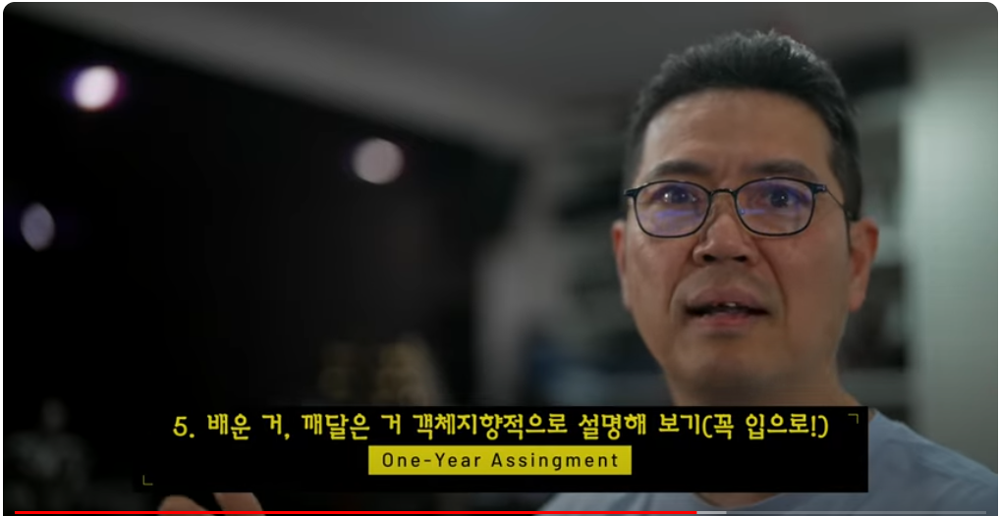

# [대두족장 인생 치트키 객체지향성 원론] Part 07 - 객체지향적 언어 공부 1년 단기 숙제

**영상링크 : https://youtu.be/OHJUou9GkHU**

> listening과 reading은 input이고, speaking과 writing은 output입니다. input이 있어야 비로소 output이 있습니다. 대량의, 탄탄한 input이 훌륭한 output을 만듭니다. 그 어떤 시스템도 input 없이 output을 만들어낼 수 없습니다. 족장님께서도 그런 취지에서 input부터 slow and steady하게 다져야 한다는 말씀을 하고 계신 것 같습니다. 그런데 저는 자꾸 output에만 집중해왔고 집중하게 됩니다. 아주 못된 버릇이죠. 의식적으로 꾹꾹 눌러 담아야만, '마음만 급한', '천재인 척 하는', '빨리 앞질러가고 싶은' 마음이 억제됩니다. 저는 항상 빨리 output부터 만들고 싶은 마음에 doing exact same fu**ing thing 해온 것일테고, 당연하게도 `this time is not different`로 귀결이 되어왔을 겁니다. 물론, 일단 recipe를 외우고 블랙박스로 남겨두는 부분이 있는 상태로 진도를 나아가야 하는 경우도 있습니다. 하지만, 그런 경우에도 여전히 제대로된 input 없이는 output도 없는건 매한가지입니다. 저 역시 점점 나이가 들고, 뭔가를 새로 배우고 익힐 수 있는 시간 없음에 마음이 자꾸 급해집니다. 그런데, 지금까지 계속 그 급한 마음에 겸손하지 못했고, 나아진 것이 없었던 겁니다. 어느덧 2024년도 2개월 남았습니다🤣

> 족장님께서 말씀하신, '정말 읽고 싶은' 원서 읽기는 정말정말 효과가 좋은 방법인 것 같습니다. '흥미를 느끼는 무언가'에 대해 사람은 상상 이상으로 정말 많은 동기를 부여 받습니다. 저의 경우 단순히 '원서를 읽자'면서 아무 책이나 집어드는 것과, 'Ted Chiang'의 스펙타클한 소설을 집어드는 것은 그 몰입도와 참여도가 완전히 다릅니다. 아 Ted Chiang의 단편 소설들은 정말정말 강력 추천합니다. 사고의 지평이 넓어지는건 보너스입니다. 

> 그리고 저의 팁인데, '기상하자마자 영어 음성으로 출력되는, 드라마든, 영화든, 애니메이션이든 틀어놓기'도 좋습니다. 분주하게 왔다갔다 하면서 계속 영어를 들을 수 있습니다. 그러다 화면을 보고 맥락 속에서 듣기도 합니다. 의식적으로든, 무의식적으로든 영어 input을 계속 넣어주는 겁니다. 함께 사는 가족이 싫어하면 할 수 없는 팁이지만, 정말 효과가 좋습니다. 가족을 설득해서 함께 해보세요!😂

솔직히 객체 지향적으로 언어를 공부하는 거에 대해서는 할 얘기가 더 많지만 1부와 2부 그 정도에서 마무리하도록 하겠습니다. 그 정도 잔소리 했으면 설마 알아들으시겠지. 근데 큰 기대를 걸지는 않아. 여러분들이 지금까지 습관이 워낙 안 좋았을 거기 때문에. 생각을 해보셔. 지금까지 언어 공부를 실패하신 분들이 보실 거거든. 그럼 다시 도전을 하신다고 해도, 그 나쁜 습관에서 상속을 받을 리스크가 굉장히 커요. 그것도 생각을 하셔야 돼. 객체 지향적인 사고라는 게 그런 거야. 왜 번번이 실패를 하는가. 다이어트 왜 번번이 실패하고, 운동 왜 번번이 실패하고, 언어에 도전했다가도, 영어든 일본어든 중국어든 번번이 실패하는가. 똑같은 방법을 쓰거든. 그간에 실패했던 방법을. 투기를 하는 주식쟁이들도 마찬가지고 똑같은 짓을 하거든. 왜 그러겠어요? 객체 지향적으로 생각해봐.

`Did I ever tell you what the definition of insanity is?`  
`Insanity is doing the exact... same fucking thing...`  
`Over and over again expecting... shit to change...`  
`That. Is. Crazy.`   
`The first time somebody told me that, I dunno, I thought they were bullshitting me, so, I shot him.`  
`The thing is... ok he was right.`  
`And then I started seeing, everywhere I looked,`  
`everywhere I looked all these fucking pricks,`  
`everywhere I looked, doing the exact same fucking thing...`  
`over and over and over and over again`  
`thinking 'this time is gonna be different' no, no, no please...`  
`This time is gonna be different, I'm sorry, I don't like... The way...`  
`you are looking at me...`  
`Okay, Do you have a fucking problem in your head,`  
`do you think I am bullshitting you, do you think I am lying? Fuck you! Okay? Fuck you!...`  
`It's okay, man. I'm gonna chill, hermano. I'm gonna chill... The thing is... Alright,`  
`the thing is I killed you once already... and it's not like I am fucking crazy.`  
`It's okay... It's like water under the bridge.`  
`Did I ever tell you the definition... of insanity?`  

실패할 수 밖에 없는 조상 클래스에서 상속을 받는다고. 그걸 오버라이딩 해야 하거든요. 오버라이딩이 무슨 말이야? 거봐. 안 봤잖아 그러면. 지금 이 시리즈에서 1편하고 2편도 제대로 소화를 못한 거잖아. 마음만 급한 거잖아. 오버라이딩 설명했어요. 그렇게 하는 습관이 아주 나쁜 습관이라고. 마음만 급한 습관. 그런 것들이 있어. 그런데 인간들이 어쩔 수 없는 부분이 있잖아요. 어쩔 수 없이 상속받는 게 있다고. 인간이기 때문에 부족한 부분들이 있고, 하다못해 투기꾼들도 제시리버모어의 나쁜 습관, 나쁜 습성을 어쩔 수 없이 상속받는다고. 저도 제시리버모어가 조상 클래스 중에 하나일 거야. 그 중에서 다중상속을 받았을 거야. 투기 성향은 모두가 있으니까. 그런데 어떻게 투기를 안 할까? 오버라이딩 한 거거든요. 애를 써서. 그 부분을 디버깅한 거야 내가. 그리고 덮어쓴 거라고. 원하는 부분만. 예를 들어 제시리버모어의 산수하는 습관? 그런 건 남겨놔도 되니까. 그런데 아주 나쁜 습관 있잖아. 그걸 오버라이딩 한 거라고. 필요한 부분만 내가 뜯어먹은 거고. 나만의 개성으로 덮어쓴 거라고.

다형성으로 이해를 해도 되지만, 그건 오버라이딩으로 이해하는 게 훨씬 쉬워요. 여러분들의 나쁜 습관. 인간이기 때문에 어쩔 수 없이 상속받는 습관이라고 하더라도 오버라이딩을 하라고. 써먹을 부분만 남겨두고. 그건 애를 써야 하는 거야. 부모님한테 뭔가 물려받았는데 거기에도 안 좋은 부분이 있는 것 같아? 있거든 사람들은. 아무리 부모님이라도. 그걸 오버라이딩 해야 된다고. 그걸 꼭 이해를 하세요. 첫 번째 제거해야 될, 오버라이딩 해야 될 나쁜 습관. 너무 원대한 꿈. '꿈은 이루어진다'가 어떤 꿈이 이루어진다고? 

humanly possible한 꿈일 때 이루어지는 거예요. 그런데 원어민처럼? 원어민처럼도 아닌데 자막 없이 영화를 보겠다? 그거 무의미한 짓이라고 했어. 그런 꿈, 그러니까 가기 어려운 거야. 그런 거 없애라고. 달성 가능한, 중장기적으로 달성 가능한 꿈을 만들라고. 여기까지 가보겠다? 1년 계획을 세우든가 그렇게 하시라고. 그냥 독해만 하겠다. 제가 지난 영상에서 분명히 짚어드렸죠. 거기까지만 하겠다. 그럼 1년도 안 걸려 솔직히. 

두 번째는 slow and steady를 안 지키는 거야. 마음만 급해서. 지름길만 찾는 거야? 어떻게 빨리 가는 방법 없나? 그래서 막 30일 완성? 이딴 강의나 보고? 상식적으로 생각하라고? 30일에 완성이 되겠어? 그런데 그걸 왜 믿냐고? 30일 완성 이딴 말을. 30일 다이어트 비법? 있겠냐고 그런 게?🤣 30일 완성, 무슨 무슨 영어 무슨 무슨 스페인어 무슨 무슨 중국어 그딴 거 찾지 말라고. 안 된다고, 안 된다는 걸 인정을 하라고. 그리고 난 느긋하게 가겠다, 목표도 달성 가능하니까 humanly possible 한 거니까. 조급할 이유 없다, 지금까지도 수십 년 낭비했는데, 조급할 이유 없다, 그렇게 가는 거예요. 그리고 세 번째로 오버라이딩 해야 되는 나쁜 습관, 중도 포기하는 습관.

중도 포기하더라도 다시 해. 이번에도 안 되겠네, 그러더라도 다음 날이라도 다시 해. 마음을 고쳐먹고. 포기하는 그 기간, 포기한 기간이 너무 길면 안 돼. 반복될 때마다 힘들어지거든, 다시 하기가. 다시 하는 겁니다. 포기하더라도 다시 하는 거야 잽싸게. 내가 왜 그랬지, 어저께 포기했더라도 오늘 다시 하는 거야. 이 세 가지만 오버라이딩 해보세요. 지금까지 실패하셨던 분들, 영어뿐만 아니고 다른 외국어 공부하는 것 뿐만 아니고 지금까지 다른 분야에서도 그렇게 하셨을 거라고. 답습을 하셨을 거라고. 그걸 객체지향적으로 보면 본인의 나쁜 습관, 실패할 수밖에 없는 템플릿 그 조상클래스에서 계속 국화빵을 찍어내는 거라고. 그러니까 실패를 하지. 실패 국화빵을 찍어내는데. 그 조상클래스 템플릿이, 국화빵 기계 클래스가, 망가져 있다고. 나쁜 국화빵을 계속 찍어내는 거야. 그런 국화빵에서 계속 찍혀 나왔더라도 매만져주라고 오버라이딩을 하면서. 본인만의 다양성을 추가하고. 그러시면서 해보시라고, 딱 1년만 해보는 겁니다. 

지금 숙제를 내드릴 테니까 딱 1년만 해보세요. 1년만 해보시면 느낄 거야. `씨바 되는구나` `내가 이걸 왜 못했지` `이렇게 쉬운 걸` 라고 하실 거야. 첫째 원대한 꿈이 없으니까, 누구든지 달성 가능해, 하기만 하면 되는 거야. 하기만 하면 되는 꿈이야. 별거 아니라 그랬어. 이거 못한다고? 안 하는 거야, 못하는 게 아니고. 특히 부모님들 자녀한테 쪽팔린 줄 알아야 돼. 이것도 못하면. 안 하는 거니까. 본인들도 안 하면서 애들한테 하라고 구박하지 말라고.

그리고 정규분포를 그려보는 겁니다. 하는 분들의 정규분포가 있어.

거기 본인은 존재하지 않는 거야. 이것도 자녀한테 부끄러운 줄 알아야 돼. 자녀가 그 정규분포에 안 들어갔으면 좋겠어? 하는 사람들의 정규분포에? 달리는 거북이 정규분포에 안 들어갔으면 좋겠어?

솔선수범, 모범을 보여야 된다고 그랬잖아 부모님들. 그래야 애들이 그 정규분포 안에 살 거 아니야. 달리면서. 평균 이상으로. 그 모습을 보여주라고. 1년 동안, 1년만 보여주면 돼. 그 1년만 하면, 왜 1년만이라고 그러겠어? 내가 정말 1년만 하고 끝내라는 얘기겠어? 1년 하면 더 이상 이런 잔소리가 필요 없다고. 여러분들은 1년도 제대로 해 본 적이 없다고, 본인 인생에서. 반백을 살았어도, 제 연배 분들도 계실 테니까. 1년도 해 본 적이 없다고. 뭘 꾸준히. 제대로. 그걸 반성하시는 기회인 거야. 그걸 성찰하시는 기회인 거고. 그 구멍을 막으면, 아까 말씀드린 거 그런 거, 구멍을 막으면, `좆도 모른다`에서 출발하라 그랬어요. 3대 덕목, `선명한 사고` `평정심 유지` 그렇게 1년만 해 보는 거야. 인생이 달라질 거라고. 이거 못 할 거잖아? 아예 시작도 하지 마세요. 책을 100권을 읽든, 영어 공부하는 책, 참고서 100권을 읽든, 무슨 강의 1000번을 듣든, 아무 소용없어. 이 정도도 못 할 거면. 그걸 못 깨닫고 아직도 영어 참고서 사러 가고 온라인 강의 등록하고 그러시는 분이 계시다? 돈 낭비 시간 낭비야. 애들한테 미안한 거고. 자꾸 강조합니다 부모님들.

애들한테 미안한 거고, 애들도 그런 삶을 살게 만들려는 거니까. 본인이 그런 모습을 보여주면 부모 따라 할 거 아니야 애들이. 적어도 핑계는 댈 거 아니야. 엄마 아빠도 그렇게 살았잖아? 뭐라고 말할 거냐니까. 뭐라고 혼낼 거야. 

자 여기까지 잔소리 그만하고, 1년 동안 숙제에요. 1년, 1년이 장기라고 생각해? 전 아니에요. 그 정도도 단기라고 생각해. 1년 숙제야, 1년 아무것도 아니잖아. 금방 가. 1년 아무것도 아닙니다. 그리고 숙제가 쉬워. 들어보면 알 거야. 여러분도. 누구나 할 수 있어. 시험 보는 거 아니고. 

첫 번째 여러분들이 배우려는 언어가 있어. 영어를 기준으로 할게. 중국어 일본어 상관없습니다 어떤 언어가 됐든.

그런 언어를 하나 선정을 해서, 책을 하나 선택하는 거예요. 지금 보기에는 좀 어려워 보여. 내용도 잘 모르겠어. 근데 그냥 읽고 싶고, 도전해 보고 싶고. 그런 소설이 있어. 이건 fiction, nonfiction 상관 없거든요. 본인이 읽고 싶은 책이 있어, 도전해 보고 싶은 책이 있어. 그런 걸 하나 선택을 하셔. 또 얍삽하게 뭐 어린이 동화 이딴 거 선택하면 제가 화내겠지? 의지 자체가 박약인 거거든 그건. 그렇다고 무조건 두꺼운 책을 선택하라는 게 아니고, 본인이 보고 읽고 싶은 책 그런 걸 선택하라는 거야. 다 읽을 필요 없어. 그런 부담 갖지도 말고. 일본어를 공부한다? 저 같으면 무라카미 하루키 그런 소설을 선택을 하겠어. 일본어를 전혀 못 해도. 소실점이 될 수 있으니까. 무라카미 하루키 소설을 일본어로 읽어볼까? 그런 마인드여야 되는 거야. 영어면 댄브라운 소설을 읽어볼까? 다빈치 코드 한 번 읽어볼까? 그런 식으로 다 못 읽어도 상관없다고. 1년 동안 도전해 볼 책 아니면 논픽션 자기계발서가 됐든 뭐가 됐든 상관없습니다. 금융을 공부해 볼까? CFA 커리큘럼 한 번 영어로 도전해 볼까? 그렇게 해서 커리큘럼에 해당하는 책, 그런 거? 그런 걸 공부하셔도 돼. 단 영어 공부한다고 영어 참고서 보라는 뜻은 아니니까. 그런 거 보지 말고 공부를 하든 소설을 읽든 자기계발서를 읽든 상관없다고? 책을 하나 선택하는 거야? 끝까지 볼 필요 없어? 근데 꾸준히는 봐야 돼? 하루에 한 페이지라도 봐야 돼? 사전 찾고 번역해 가면서 그렇게 보라는 것도 아니야? 듬성듬성이라도 눈도장을 찍어가면서 맛을 들이는 거야. 진득하니. 해당 언어로 글을 읽는 습관을 들이는 겁니다. 그렇게 들여보세요. 발음 신경 쓰지 마시고. 제가 지난 영상에서도 보여드렸어. 어떻게 중국어를 하는지. 중국어 못 읽는다고. 그런데 찾아볼 순 있어. 해석도 할 수 있고. 거기에 도전하는 거야. 독해만 할 수 있으면 돼. 발음 신경 쓰지 마세요. 특히 중국어 혹시 도전하실 분들 사성 신경 쓰지 말고, 발음 신경 쓰지 말라고. 어떻게 읽는지 몰라도 돼. 그건 다음 단계야. 앞으로 1년 동안은 그냥 이 책을 대충 눈치 까는 수준, 그 정도만 하시라고. 끝까지 읽을 필요 없고, 1년 동안 꾸준히 읽는 겁니다. 끝까지 읽을 필요 없다 그러니까 또 한 페이지 갖고 1년 동안 보고 그러지 마시고. 한 단락이라도 해보라고 '하루에 뭐 한 두 문장이라도 해보자' 그런 마음, 그걸 1년 동안 하는 겁니다. slow and steady가 중요해요. slow and steady. 

두 번째는 관심 있는 채널이 있을 거 아니에요.

본인이 관심 있는 분야, 그걸 해당 언어로 찾으세요. 게임 좋아하시는 분이면 정말 좋은데. 워낙 많으니까 게이머 채널이. 그리고 자막을 만들어주는 친구들도 있고. 영어권은 거의 자막이 없는데 그건 오토 자막도 잘 나오니까. 우리는 듣기 신경 안 쓰는 거야, 말하기 신경 안 쓰는 거야, 발음 신경 안 쓰는 거야. 근데 자막을 보면서 대충 문맥을 눈치 깔 수 있어. 영상을 보면. 그래서 가급적이면 자막이 나오는 게 좋은데, 영어권 친구들은 원래 자막을 싫어해. 그래서 영어로 된 자막은 별로 없을 거야. 그런데 일본어나 중국어나 다른 외국어들은 오토 자막 보지 마시고요. 오토 자막은 잘못 만드니까. 본인들이 만드는 자막이 있다고. 특히 게이머들, 유명한 게이밍 채널은 스트리밍 채널들은, 본인들이 자막을 만들어주거든. 특히 중국어는 거의 자막이 있습니다. 일본어도 자막이 대충 있는 편이고. 그러니까 그렇게 도전을 하시면 돼. 익숙해지는 거야. 그런 채널을, 해당 언어로 즐기는 거에 익숙해지는 거야. 못 알아들어도 되고요. 보고 해석을 전혀 못 해도 돼. 지금은, 앞으로 할 수 있을 거라는 생각으로 하는 거야. 1년 후에는, 그래도 자막 띄워놓으면 대충 눈치 깔 수 있어. '쟤가 뭐라고 하는지 대충 눈치 깔 것 같아' 그 수준까지만 올라가는 거야. 왜냐면 문맥이 있다고. 걔가 엘든링 게임을 해, 그러면 알잖아. 그래서 경험을 자꾸 해보라는 거야. 여러분들이 엘든링 게임을 해 봤어, 그럼 알아듣기 더 쉽다고, 이해하기 쉽고. 그런 채널을 하나 등록하세요. 욕심 부리지 마시고. 하나만. 그래서 1년 동안 따라 하는 거야. 가급적이면 말을 또박또박하고, 잘 알아들을 만한 재미있는 채널, 그런 채널을 선택하시라고. 제가 추천해 드리고 싶지는 않아. 그건 제 개인 취향이니까. 여러분들 취향이 있으실 거라고. 게이밍 아니어도 돼. 요리가 될 수도 있고. 그림이 될 수도 있고. 어떤 채널도 상관없습니다. 채널을 다른 걸로 대체를 하고 싶어? 그럼 프로코 강의 같은 걸 해도 돼. 그림 그리는 강의, 아니면 new masters academy, 그런데 1년 동안 공부를 하겠다 영어로, 그렇게 하셔도 상관없어. 어쨌든 그런 영상 매체를 하나 꾸준히 볼 수 있는 영상 매체. 문맥이 있잖아, 그림이면 그림 게임이면 게임. 그 문맥을 쭉 따라가는 연습을 하시라고. 문맥 연습하는 거야. 문맥을 보면서 듣는 거 아니라고 그랬어요. 리스닝에 구애받지 말라고, 못 듣겠으면 자막에 있어. 그렇게 생각을 하라고. 문맥으로라도 눈치를 까겠다여야 돼. 그렇게 생각하시면 돼요.

그리고 세 번째는 여러분들 꿈이잖아.

자막 없이 드라마나 영화 보겠다고 그런 쓸데없는 꿈 꾸지 말고, 원어민도 자막을 켜고 봐요. 우리도 우리나라 드라마 우리나라 영화 있을 때 자막 켜고 보는 게 훨씬 쉬워. 그거 다시 한 번 깨달으시고. 영화나 드라마를 보는 거야. 이거는 매일 볼 수 없을 테니까, 여러분들 바쁘잖아. 매일 볼 수 없을 테니까, 그냥 일주일에 하나, 일주일에 하나는 하세요. 영화나 드라마 일주일에 한 번은 하세요. 영화 한 편 아니면, 드라마 한 편. 해당 언어로. 근데 한글 자막 보지 말고 해당 언어 자막을 볼 수 있는 환경에서 넷플릭스 같은 거 좋겠지? 영어, 일본어, 중국어 다 나오니까 그 중에 하나를 선택하는 거야. 자기가 하고 싶은 거. 그리고 그거 언어로 보는 겁니다. '못 알아듣겠어' '자막이 틀어져 있는데도 못 읽겠어' '너무 빨리 지나가' 상관없어. 문맥이 있거든. 여러분들은 그 그림을 보는 능력이 있어. 인간이기 때문에. 슬기슬기 사람이니까. 그냥 애들이 만화 보듯이 보는 거야. 예전에 그 AFKN 만화 알아들으면서 봤어? 그냥 보는 거야. 그래도 대충 눈치까. 그렇게 보는 겁니다. 그렇게 보면서 눈도장을 찍는 연습을 하라고. 읽는 연습을 하고. 자막을 읽는 연습을 하라고 이렇게. 그렇게 하다 보면 그림이랑 맞아떨어지기 시작해. 그게 또 하나의 문맥 파악하는 능력이거든요. 그 그림에서 상속을 받으라고. 자막은 경우의 수일 뿐이야. 그 자막만 있잖아? 그림이 없고? 그러니까 영화에 화면이 안 나와, 드라마에 화면이 안 나와, 자막만 나와, 더럽게 헷갈립니다. 아무리 원어민이라고 하더라도. 그걸 도와주는 게 화면인 거야. 그게 문맥인 거고. 문맥이라는 게 뭐야? 상속성이라고. 조상 클래스라고. 문맥이라는 조상 클래스에서 상속받는 연습을 하는 거야. 그렇게 해보세요. 1년 동안. 

그리고 영화 드라마 보시고 나서 인상적인 장면 뭐 이런 거 있을 거 아니에요. 그런 거 한 장면?

한 장면 정도? 연기로 따라해 보는 거야. 내가 그 배우가 된 것처럼. 'Just when I thought I was out they pull me back in' 이런 거 제가 가끔 보여 드리잖아. 그걸 따라해 보라고. 이거 말하기 연습 이런 거 아니야 연기하는 연습이야. 

연기하는 거. 감정을 실어서 내가 그 문맥 속에 들어가 보는 거야. 제가 지금 한 건 대부 3에 나오는 알파치노 연기잖아요 그런 거. 제가 어저께 장화 신은 고양이? 은근히 재밌더라고.

장화 신은 고양이 애니메이션을 봤는데 두 번째 나온 영화죠. 그 장화 신은 고양이가 계속 배경이 스페인인 듯한, 스페인어를 계속 쓰거든. 그런 거 스페인어를 공부한다면 좋은 소스가 될 수 있죠. 연기를 해 볼 수도 있고. `미까싸 에 수까사` 뭐 이런 말 나오니까. `수까사 에 미까싸` 내 집이 네 집이야. 네 집이 내 집이지.🤣 막 이런 말도 나오고 그러니까. 그런 걸 연기를 해 보시는 거야. 그렇게 연결을 해 볼 수도 있어. `미까싸 에 수까사` 네 집이 내 집이야? `Make yourself at home` 이렇게 영어랑 연결해 볼 수도 있고. 뭐 그런 연습을 해 보시는 거야. 어떤 언어가 됐든 상관 없습니다. 한 번은 해 보세요. 어려운 숙제 아니잖아. 영화나 드라마 한 편당 하나니까. 그러니까 1년이면 뭐 54주를 다 못하신다고 해도 50문장 정도는 그렇게 연습이 되겠지? 연기를 하면서, 꼭 연기하셔야 돼. 나 이러고 막 외우고 이러면 안 돼 입 밖으로 그래서 연기를 해 보는 거야. 'Just when I thought I was out They pull me back in' 이거 꼭 하셔야 돼 쪽팔리셔도 화장실 가서라도 해.

그리고 그 날 배운 거 뭔가 깨달은 게 있을 거 아니야. 

뭐 강의를 들었든 책을 봤든 상관없어. 그날 그 말에 대해서 그 언어에 대해서 깨달은 거 '아 이게 이런 거였구나' 뭐 아까 `미까싸 에 수까사` 이런 스페인어가 영어로 가면 `Make yourself at home` 우리말도 비슷하지 않나? 뭐 그런 느낌? 그런 데서 상속을 받는 느낌? 그런 걸 설명을 막 해 보는 거야. `Casablanca` 어? 하얀 집? 백악관? `Casablanca`가 그게 백악관이거든요. 하얀 집이라고, whitehouse라고. 뭐 그런 느낌. '오 이게 그런 거였구나' 왜 그럴까? 그럼 왜 `Casa`라고 발음을 할까? `C`인데? Casa? 왜 `Casa`일까? 어? `Gracias` 아닌가? `Grathias` 아닌가? `Gracias` 아닌가? `Gracias`는 아! 식민지 때문에? 식민지 스페인어가 있고, 본토 스페인어가 있으니까. 그래서 `Gracias`가 다르거든요. 발음이 `Gracias`, `Grathias` 그럼 C 발음도 이렇게 되는구나. 스페인어로 하면 쎄니까, 쎄 발음이 이렇게 되는구나. 근데 A, E, I, O를 하면 까 세 씨 꼬 꾸가 되네? 왜 그럴까? 막 이런 걸 생각을 해 보는 거야. Casa, `미까싸 에 수까사` 그거 하나 가지고 그런 말을 해 보는 거야. '아 이게 그렇게 해서 까 발음이 나오고 세하고 씨만 쓰 발음이 나는구나' '쌍시옷 발음이 나는구나' 그리고 '스페인어는 그냥 읽어대는거구나 그대로' '그래서 발음이 쉬운 거구나' 뭐 이런 걸 막 설명을 해 보는 거야. '그래서 미카사가 아니고 미까싸가 되는구나' '어? 까사블랑까가 있었는데? 그럼 카사블랑카가 아니라 까사블랑까네' 

이거 정관사까지 붙이면, 영어처럼, 그럼 라 까사블랑까거든요. 라가 여성형이고, 남성형은 엘이고. 이건 제가 프랑스어를 했던 짬밥에서 나오는 거거든. 프랑스에서도 비슷한 정관사 여성형과 남성형이 있으니까. 라 까사라고 하면 여성형인 거고, 남성형은 엘인 거고 엘가토, 엘가토 들어보신 분 계실 거야.

이 영상 장비나 스트리밍 장비 이런 거 만드는 회사 이름이 엘가토야. 엘가토라는 회사가 있어. 그 엘가토가 뭐겠어요? 더 캣이야. 스페인어로. 그 가또, 어제 장화 신은 고양이에 나와. 고양이가 가또니까. 그런 걸 막 설명을 해보는 거야. 그러니까 막 무슨 문법 설명이 아니어도 되고, 이런 식으로 주절거리는 거야 계속. 그걸 하루에 한 10분이라도 하세요. 시간을 마련을 해서 굉장히 재미있을 거야 연습이 되면. 저 같으면 이런 촬영하는 공간을 하나 마련을 하겠어. 아이폰이 됐든, 가급적이면 마이크를 대고 할 수 있는, 전 이렇게 마이크가 있잖아요. 이렇게. 이게 재밌거든 이런 공간을 못 만드시더라도, 그런 환경을 하루에 한 번쯤은 만들어서. 좀 번거롭더라도 해보셔. 찍어서 안 보여줘도 되니까. 아무한테 안 보여줘도 되니까. 아니면 가상으로라도 상상으로라도. 연기를 할 때도 마찬가지고. 배우가 관객을 보면서 하는 것처럼. 그렇게 연기를 하시라고. `미까사 에 수까사` 좀 쪽팔리더라도 그렇게 하시라는 거야. 아무도 안 봐. 아무도 안 보는데, 그렇게 혼신을 다해서 연기를 하라고. 'just when I thought I was out they pull me back in' 이렇게 하시라고. 그러셔야 돼. 설명을 할 때도, 지금 설명한 것처럼 까사블랑까, 카사블랑카가 아니네, 까사블랑까. 장화 신은 고양이에도 나오네. 가또. 그거 꼭 하세요. 1년만 해보셔. 신세계가 열린다고. 굉장히 재밌을 거야. 그리고 온 가족이 연기를 하게 될 거야. 애들도 막 따라 할 테니까. 난 애들이 막 따라 했으면 좋겠는데. 애들은 따라쟁이니까. 기본적으로, 기본적으로 따라쟁이입니다. 그렇게 연기하는 애들을 만드세요. 설명하는 애들을 만들고. 부탁드릴게. 우리나라의 미래를 위해서라도 제발 좀 부탁드릴게. 내가 왜 그런 부탁을 드리냐면, 그 애들이 앞으로 지도자들이 될 거 아니야. 이 나라를 이끌어가는 동량이라며. 그런 애들을 좀 만들어 달라고 나 불안하지 않게. 부탁드릴게. 

그리고 이제 자막 없이 들어보고 이런 연습은 그 다음 단계야. 말하기 연습이나, 듣기 연습, 발음 연습, 다음 단계라고. 앞으로 1년 동안은 그거 신경 쓰지 말라고 발음 신경 쓰지 말고 듣기 신경 쓰지 말고 말하기 신경 쓰지 말라고. 말하기는 정말 저 끝에 있어. 가장 뒤로 미뤄. 여러분들 말할 이유 거의 없을 거야. 평생 평생 없을 거라고 진짜 제발 좀 믿어. 내가 영어쟁이로 30몇 년을 살았는데 외국인 만나서 얘기할 기회 별로 없었어. 도구로 활용을 하시라고 진짜. 실생활의 도구가 될 수 있는 방법으로. 공부를 하라고. 호라이즌을 넓히는 데 활용을 할 거라고 우리는. 아이들한테도 그걸 보여줘야 되는 거고. 그러니까 말하기에 대한 원대한 꿈을 버리라고 쓸모 없는 꿈이라고. 써먹지도 못할 꿈. 게임에서도 써먹지도 않는 방어구나 무기를 강화하는 거 짱구짓이야. 그 강화템이 몇 개 안 되는데, 그 강화템이라는 게 강화에 들어가는 소재잖아요. 그게 희소하다고? 그게 여러분의 시간과 노력이야? 그 시간과 노력을 써먹지도 않을 도구 강화하는데 쓰지 말라고. 낭비라고 그거. 그러니까 독해력을 기르는데, 눈치를 까는데, 문맥으로 눈치를 까는데 집중하시라고. 그걸 1년 동안 연습을 하면 끝이야. 그 이후에는 이런 잔소리가 필요 없어. 그럼 지금까지는 왜 못했느냐? 안 했으니까 그러는 거야. 한 번도 해본 적 없는 일일 거에요. 대부분의 여러분이. 정교분포 그려볼까? 지금 제가 말한 거 해보신 적 있어? 저는 늘 하는 거예요. 30년 동안 이러고 살았어. 

근데 그냥 여러분들은 날로 먹으려고 그러잖아. 영어 강의 하나 보고, 참고서 하나 읽고, 동사를 알면 죽은 영어도 살린다, 그거 한 두 권 보면 영어가 샬라샬라 될 것 같아? 누가 그런 개구라를 쳐? 그건 기적이야. 기적 humanly impossible. 시작일 뿐이야. 방법론일 뿐이고. 자 인사이드 킥을 배웠어? 어떻게 해야 돼? 운동장에 나가 봐야 될 거 아니야. 1년 동안 나가 보라고. 뭘 배웠으면, 인사이드 킥 배웠으면, 운동장에 나가서 자꾸 차 보라고. 다른 방법 배웠어? 바나나 킥도 배웠어? 또 나가서 차 보라고. 앉아서 주절거리지 말고. 그게 그렇게 어려운 얘기야? 안 어려운 얘기인데 여태까지 왜 못했어? 선명하게 보이지 않으니까. 지금 인사이드 킥 얘기하면 쉽게 알아들으실 거예요. 그건 선명하게 보이니까. 야 운동장에도 안 나가보는 국가대표 선수, 축구선수가 있을까? 없을 거 아니야. 여러분이 그런 선수라고. 안 나가보는. 안 차 봐. 근데 왜들 안 나가볼까? 불분명하거든요. 이게. 모호하다니까? 영어공부라는 게. 안 보여 그렇게. 축구선수처럼. 축구선수가 운동장에 나가지 않는다? 선명하게 보이잖아. 얘는 새된 거 아니야. 새된 축구선수잖아. 안 나가는데. 실생활에서 생활화를 하지 않는? 영어를 생활화하지 않는? 그런 환경에 노출되지 않는? 영어쟁이가 있어? 그 영어가 녹슬겠지? 그게 선명하게 보이지 않는 이유? 모호하니까 그래서 '좆도 모른다'에서 출발하라고. 제발 좀. '무지의 인정'에서 출발하시라고. '나는 아무것도 모르는 상태다' '영어도 이런 거였구나' '이렇게 하는 거였구나' '외국어라는 거 말 공부라는 거 이렇게 하는 거구나' '모든 공부를 이렇게 하는 거구나' 공부를 했어? 연습을 해, 공부를 했어? 연습을 해 공부를 했어? 연습을 해. '이 과정을 통해서 체득하는 거구나' 공부했어? 연습해. 공부했어? 연습해. 공부했어? 연습해. 연습량은 언제 늘려? 연비가 제일 좋을 때. 마구 늘리는 게 아니고, 이해가 잘 안 돼? 공부를 좀 더 해. 그런 다음에 연습해. 그 연습 1년 동안 하는 거야. 선명하게 보일 때까지. 한 번 선명하게 보이기 시작하면 선명하게 보인다고 착각하지 말고. 정말 선명하게 보일 때까지 연습을 하시면, 1년으로 안돼? 2년 하세요. 3년 하시고. 그런 모습을 자녀에게 보이시는 용감한 부모님이 돼주시길 정말 진심으로 기원합니다.