# [대두족장 인생 치트키 객체지향성 원론] Part 08 - 객체지향적 요리

**영상링크 : https://youtu.be/b6DXBVOljZ4**

> 너~~~무 배가 고파지는 영상이었습니다😂 제가 평일에는 여유가 있는 시간이 저녁~ 늦은 밤이다보니 공복 상태일 때가 많은데 군침이 마구 나오는걸 참느라 혼났습니다.  
>
> 요리를 하면서도 객체지향을 연습하는 사람과 그렇지 않은 사람은 분명 어떤 현상이나 사건을 볼 때마다 느끼는 것이 확연히 다를 수 밖에 없을 것 같다는 생각을 했습니다. 객체지향을 자유자재로 활용하기 위해서는 그 전에 일부러, 의식적으로라도 연습을 하고 떠올리는 시간이 충분히 쌓여야 할텐데, 한 살이라도 일찍 시작하는 것이 무조건 남는 장사인 것 같습니다.  
>
> 내가 먹는 것이 곧 나를 이루는 것이기 때문에 식습관은 정말 신경을 많이 써야 하겠습니다. 저도 한동안 빨리 먹는 습관 때문에(여전히 고치기가 무척 힘들지만 많이 개선됐습니다) 역류성 식도염을 앓은 적이 있었는데, 정말 그 때는 많이 힘들었습니다. 처음으로 저의 장기까지 나이가 들었다는 생각이 들었던 것 같아요. 이제는 밀가루가 많이 포함된 음식도 소화를 하기 쉽지 않음을 느낍니다. 잘 관리해야 오래오래 사용하겠죠. 워렌버핏이 건강 관리의 소중함에 관해 한 일화를 이야기한 적이 있는데요. '어느날 아침에 어떤 자동차를 받는다고 생각해보세요. 그런데, 그 자동차를 죽을 때까지 바꿀 수 없고 평생 그 자동차만 탈 수 있습니다. 그럼 그 자동차의 상태가 어떻든 아주 애지중지하면서 탈 겁니다. 본인의 건강과 신체를 그 자동차라고 생각해보세요' 이것 역시 어떻게 보면 객체지향적 사고일 수 있을텐데, 각자 신체는 그냥 태어날 때부터 주어진 것이고 당연하게 생각하니까, 모호하니까 관리의 중요성을 크게 못 느끼다가, 뒤늦게 깨닫게 되는 경우가 많은 것 같습니다. 예방의학과 치료의학이 발달하면서 젊은 날의 잘못이 조금씩 만회가 가능해지지만, 그래도 일찍부터 관리하는 것만 못함은 당연하겠죠.  
>
> 저는 어릴 때부터 입이 짧았던 편이긴 했지만, 조금씩 더 신경서서 식습관을 건강하게 가져가려고 노력합니다. 과일도 사과 이상의 당도가 있는 것들은 어지간하면 먹지 않으려 하고 토마토를 먹으려고 하는데, 참 신기하게도 몸에 안좋은건 맛있는 것 같아요😂 이젠 맛도 산업화 되고 상품화 되어서 점점 강렬한 맛을 내는 쪽으로 마구 개발되는 것 같습니다.  
>
> 제가 술은 좋아하는 편이 아니긴 했지만, 이젠 한방울도 안 마시고 있습니다. 거의 6개월이 되어 가네요. 담배는 2년 정도 피웠다가 끊은지 16년째인데, 저의 경우 생각보다 술을 안마시는건 (아직까지는) 그렇게 어렵지가 않은 것 같습니다. 애초에 술이 맛이 없다고 느끼는 것 같아요. 담배 끊은 것 만큼 오래오래 단주를 할 수 있도록 시간을 녹여야겠습니다.  
>
> '중독'하니까 생각나는 것입니다만 초저금리에 익숙해져서 공짜돈에 중독되었던 사람들이 고통스러운 기간이 조만간 오지 않을까 우려스럽습니다. 중동이나 러시아 상황 보면 유가가 내려가기는 쉽지 않기도 해서 물가가 쉽게 잡히지는 않을 것 같고.. 다들 금리 인하 기대하던데 과연 그리 쉽게 인하를 할 수 있을까 싶기도 하구요. 통화정책도 통화정책이지만, 미국 정부가 천문학적 재정적자와 부채 때문에라도 높은 인플레는 일부러라도 용인을 하지 않을까 싶습니다. 그리고 버핏이 언급해왔던 'GDP 대비 기업들의 세후 이익 비중의 역사적 추세치'와 현재 수치를 생각해보면 (이것을 Buffett Indicator로 일컫는 것으로 알고 있습니다 - 닷컴 버블 붕괴 직전에 했던 연설일거에요. 뉴욕 인구수 대비 뉴욕 변호사수에 관한 비유가 등장했었죠), 버크셔 주주총회 때 '재정적자 때문에 법인세율을 올릴 것에 대비하여 애플을 매도한다'고 말한 것이 이해가 되면서(물론 그의 영향력이나 입지를 생각하면 진의는 다른 것에 있고, 돌려 말하는 것일 수도 있겠죠), 결국 미 정부가 법인세율을 올릴 유인도 많은 것 같구요. 트럼프가 당선되고 공약대로 감세를 한다면 금리를 내리기는 더 쉽지 않겠고 그냥 인플레를 유발하는 수준이 되지 않을까 합니다. 언제, 어떤 계기가 될지는 결코 알 수 없겠지만, 누적이 터질만한 요소가 많은 것 같아 걱정이 됩니다. 모두가 불행한 시기는 정말 오지 않았으면 좋겠어요. 장기적으로는 AI 발 생산성 혁명과 디플레이션이 얼마나 빠르게, 크게 올지가 관건이지 않을까...하는 여러 망상들을 해봅니다.

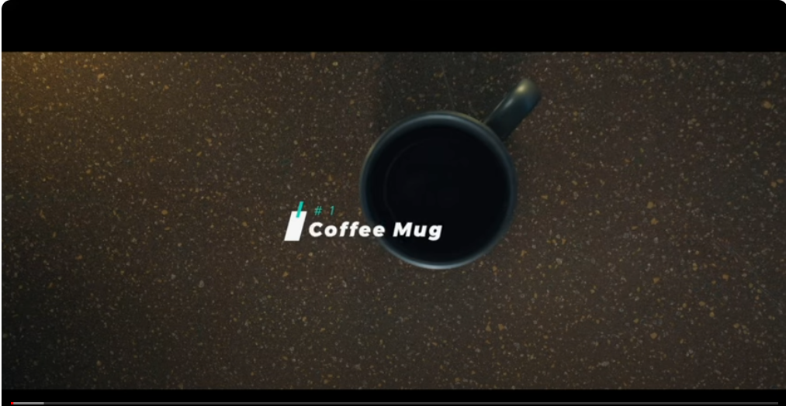
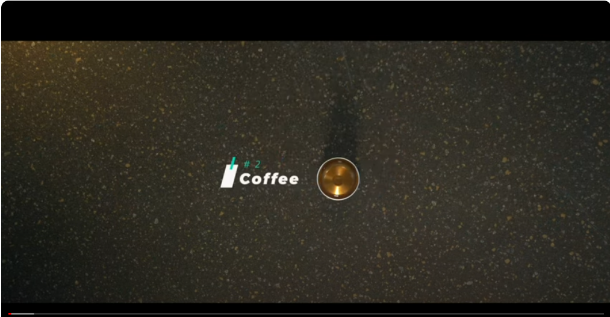
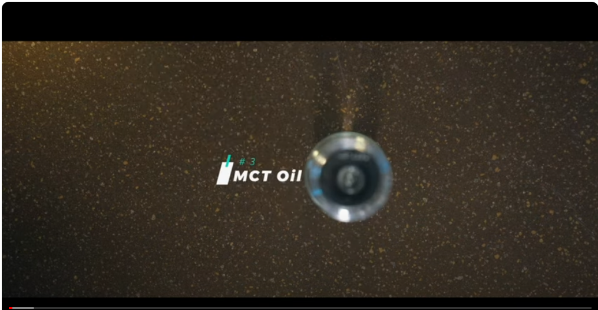
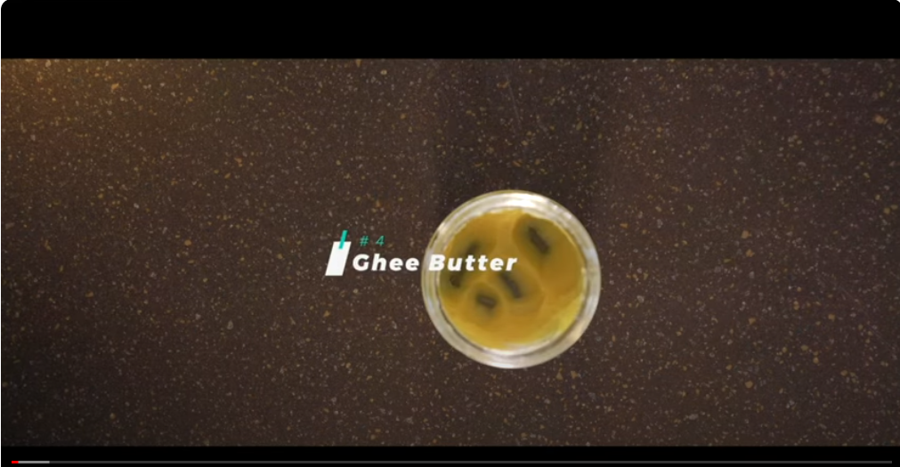
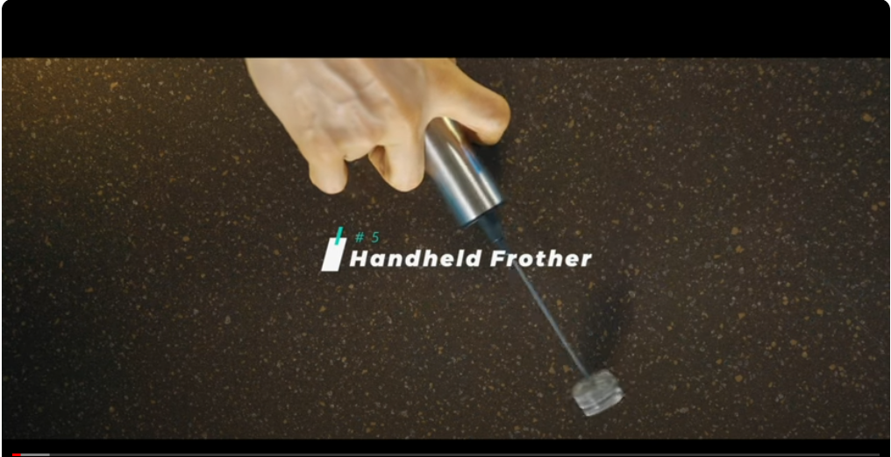
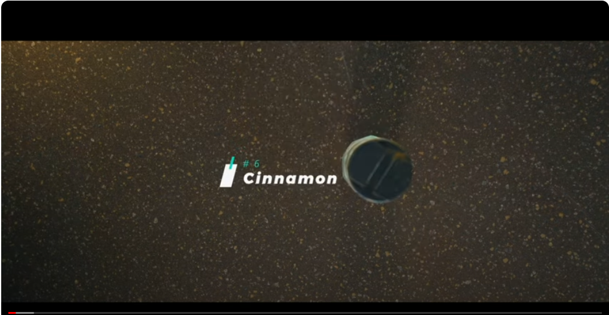
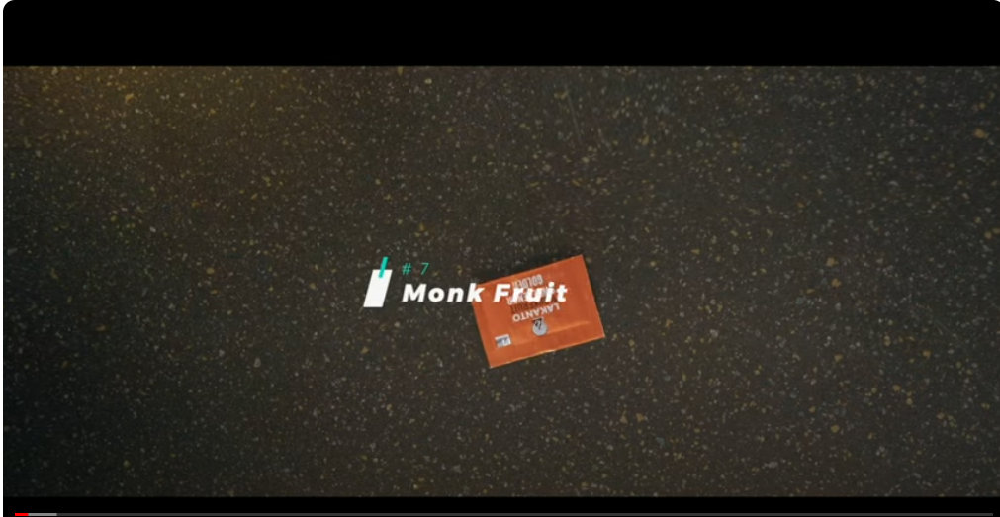
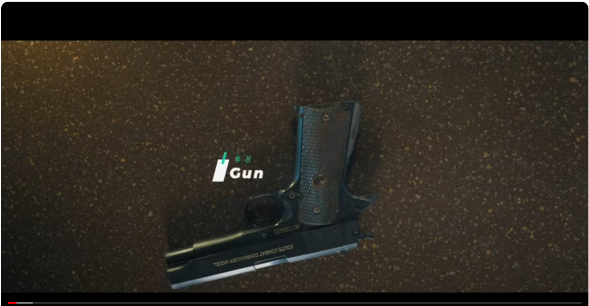
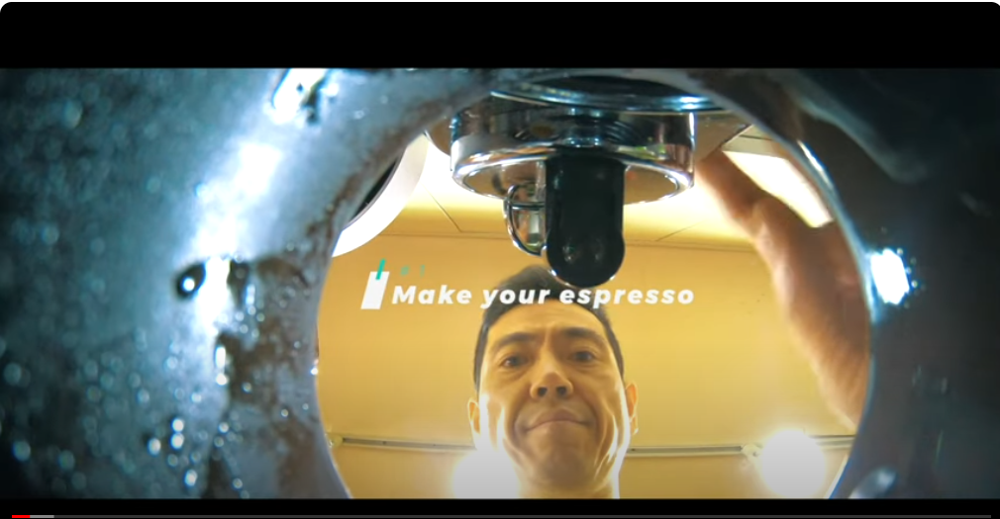
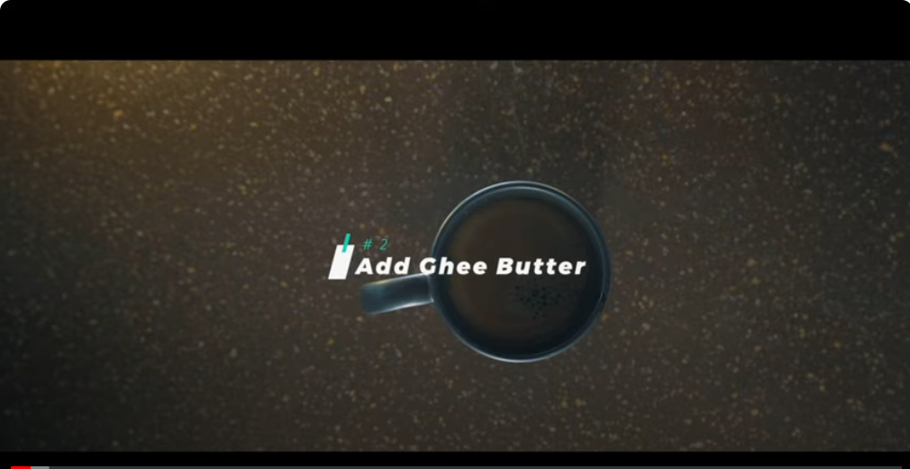
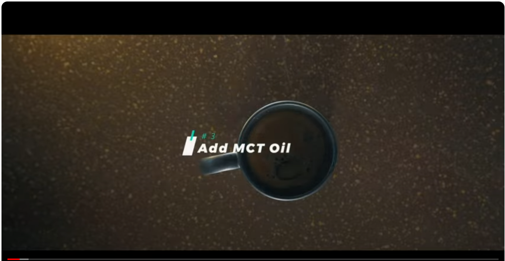
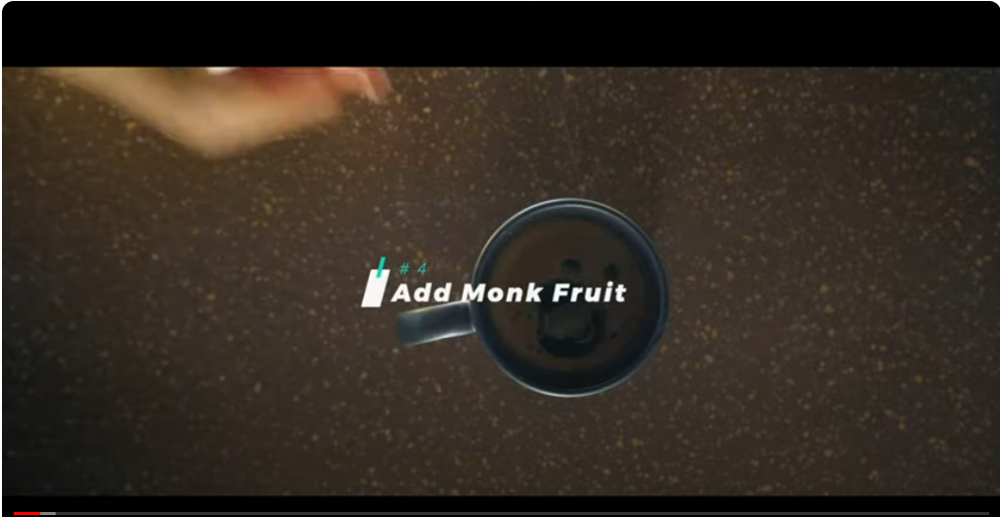
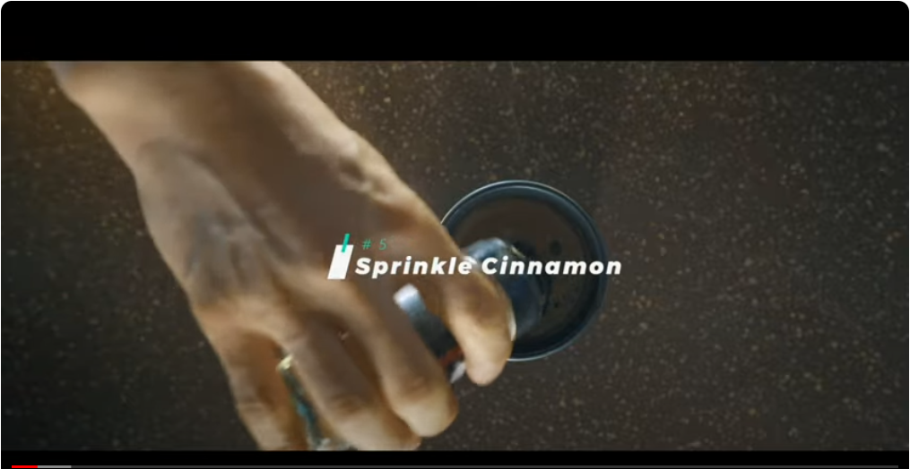
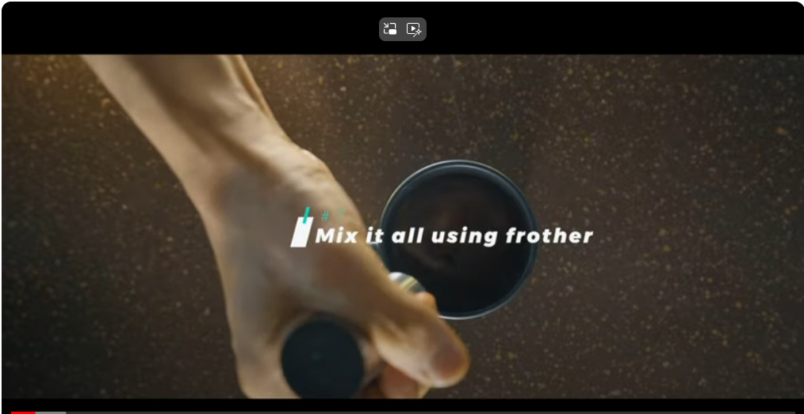
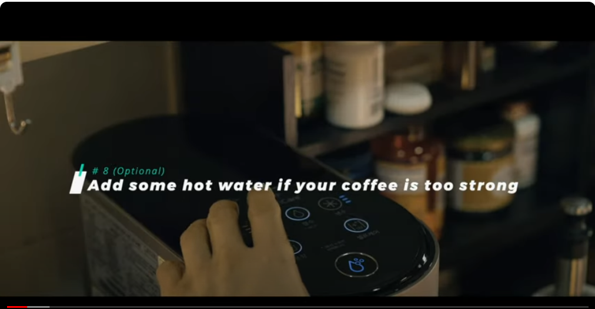

2021. 2. 14. 라면 먹방

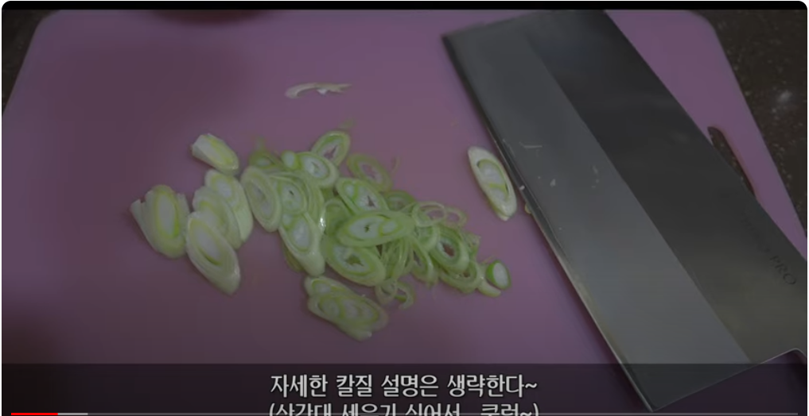

제 요리 먹방 많이 보신 분들은 아시겠지만, 한 번이라도 보신 분들은 아시겠지만 제가 비주얼을 신경 쓰지 않는 녀석이기 때문에, 비주얼 신경 쓰지 마. 혼자 먹는데 무슨 비주얼이야. 비주얼은 개뿔이니까. 좀 짜게 끓였거든요. 다들 아시겠지만, 라면 맛있게 먹는 방법 짜게 끓이는 거니까. 단맛 짠맛 기름맛, 맛의 3요소. 그래서 라면이 맛있는 거니까. 그렇게 설명을 드리면, '라면에 설탕 안 들어가는데요?' 그런 분도 계세요. 탄수화물이 당입니다. 단맛. 모든 탄수화물이. 요즘은 MSG를 안 쓴다지만, 그래도 단맛, 짠맛, 기름맛에다가 우마미를 첨가한 거거든요. MSG가 우마미 덩어리니까. 거기다 매운맛 살짝 들어가 있고. 5대 요소가 다 들어가 있는 거죠. 라면이 맛이 없을 수가 없지. 

2022. 5. 20. 군산식 고추 짜장 먹방

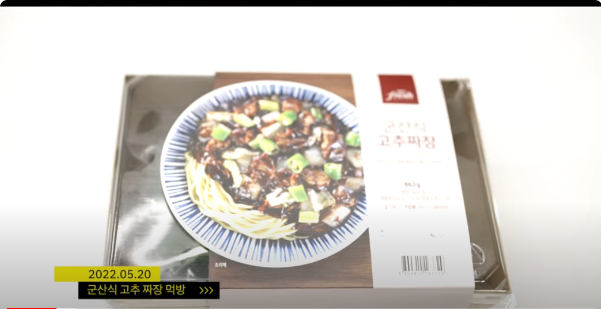

군산 고추짜장, 군산식 고추짜장, 뭐 이건 보여 드릴 테니까 제품명은. 그리고 고기를 넣습니다. 지금 상황은 보여드릴게. 고기를 넣어요. 기름으로 볶으셔도 되고. 저는 이게 더 고소하니까, 맛의 기본, 3대 기본 짠맛 단맛 기름맛. 삘이 확 와야 되잖아요? 짠맛과 단맛을 이 짜장이 담당하는 거고. 그리고 면이 어차피 탄수화물이니까, 당이잖아요. 단맛이고. 기름맛은 뭐가 담당하겠어? 고기. 또 고기에서 고소한 맛이 나오고. 이 짜장에 MSG틱한 우마미가 들어 있기 때문에. 감칠맛을 더할 수 있고. 짠맛 단맛 기름맛 플러스 감칠맛. 그리고 플러스 고추짜장이잖아. 매운맛 들어가죠. 맛이 없을 수가 없겠지? 잘만 만들면. 이 짜장도 마찬가지거든요. 짜장을 마켓컬리에 정규분포가 있다고 그랬잖아? 젊은 분들이 그 중심에 딱 버티고 있어요. 그분들이 맛있다고 그러잖아? 평균적으로. 그럼 달다고. 단맛이 강하다고요. 단맛이 강하다고요. 짜장도 그분들이 맛있다고 그러면 대부분 달아. 저는 단짜장은 정말 못 먹겠거든. 짜장이 너무 달면. 좀 덜 답니다. 이 짜장이. 그리고 매운맛이 들어가는데, 진짜 청양고추를 넣었거든요. 그냥 매운맛이 아니고. 전 매운맛 중에서도 청양고추 매운맛을 좋아하기 때문에. 그냥 막 고춧가루 매운맛이나, 뭐 스코필드 지수 뭐 그런 얘기 해가면서 막 마구 집어넣는 화학 약품 틱하게 집어넣는 매운맛은 극혐하기 때문에 청양고추를 넣은 매운맛, 속이 쓰리지 않은 매운맛, 그걸 좋아합니다. 제 느낌으로는 어느 정도 느낌이냐면, 배달해 먹는 짜장면 이상, 그 정도 맛은 나요. 배달해 먹는 간짜장. 그냥 평균적인 중국집에 간짜장 이상은 하는 거 같아. 와우 맛집 수준이다 이 정도는 아닌데. 재료가 좀 신선한 느낌이 있거든요. 그 냉동 짬뽕이랑은 다르게. 실제로 신선한 야채를 그냥 간짜장 볶듯이 볶은 거니까. 냉동도 아니고 냉장이라 며칠 안 갑니다. 유통기한이. 근데 그 청양고추가 꽤 매워요. 저는 다 넣었는데, 다 넣으면 맵다고 하실 분도 있을 거야. 마눌님은 맵다고 할 거 같아.

2022. 6. 16. 김치찜 먹방

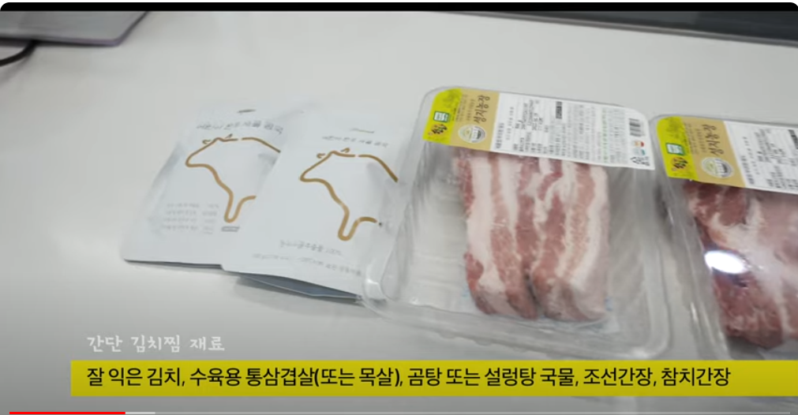
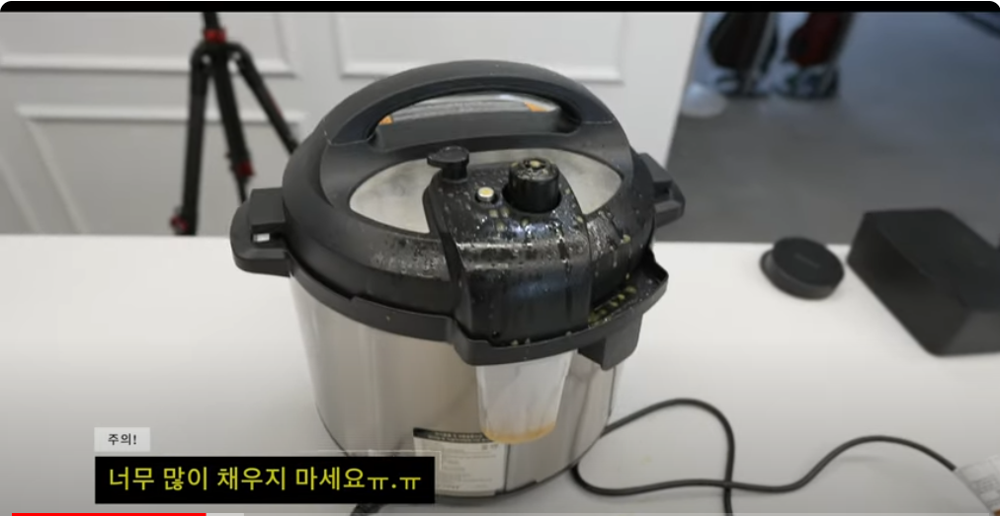
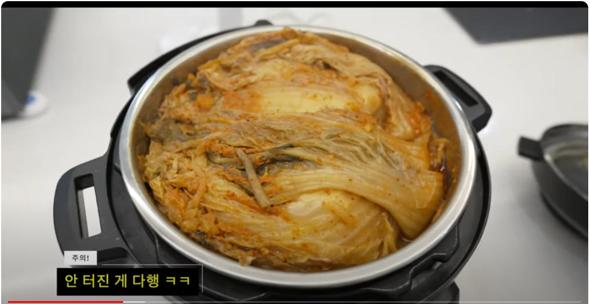
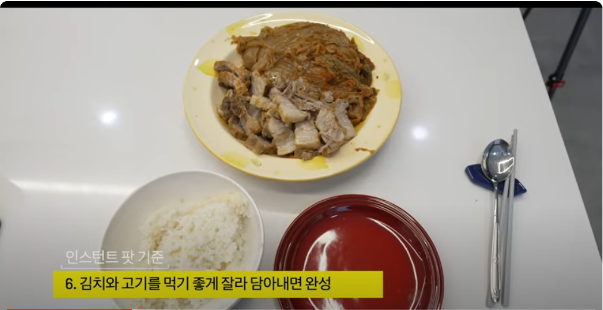

보셨겠지만 사고를 좀 쳤죠. 김치찜인데, 원래 김치찜이 더럽게 오래 걸리는 요리거든요. 제가 김치찜을 좋아하는데, 밥도둑, 밥도둑 그러지만 김치찜은 밥도둑도 밥도둑이지만 김치도둑이거든. 김치도둑인데, 그래서 함부로 해먹기도 뭐하고, 맛들여서 계속 먹으면 김장김치 다 날아가고. 지금 이게 아마 이킴 포기 김치 기준으로 한 포기? 이킴 포기 김치 기준으로 하나? 그 정도일 거예요. 

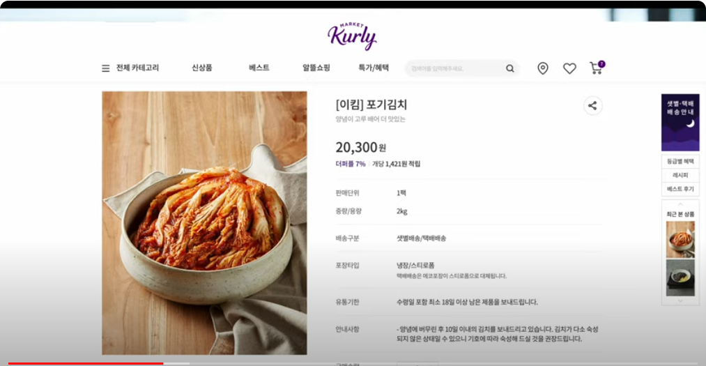

그러니까 LG 빌트인 냉장고, 저게 좀 크기가 작아서, 거기 김치냉장고가 상칸, 중칸, 하칸이 있는데 상칸이 이제 2칸 정도를 합쳐놓은 크기고, 중칸하고 하칸은 소분을 하면 6개 정도 들어가거든요. 그러니까 이킴 포기 김치기준으로 6개를 사면 그 칸을 채울 수 있는 거죠 대충. 그 정도 채울 수 있는데, 6번 먹으면 다 날아가는 거지. 살짝 이거보다 조금 더 많습니다 김치는. 이킴 포기 김치가 좀 양이 많은 편에 속해서. 김치에 고기가 혹시라도 모자란다 싶으면, 고기도 개취고 제가 먹는 지금 재료들은 다 보여드릴 텐데, 이름은 말을 안 할게 굳이. 김치는 뭐 제일 중요한 거니까 이킴 포기 김치라고 얘기를 하겠는데 나머지는 다 개취에요. 김치도 개취고, 제가 먹어본 바로는 제 입맛에 맞으니까 그냥 먹는 거지, 다 개취입니다.

근데 이제 고기가 좀 모자란다 싶으면, 좋은 방법이 두부를 넣는 거거든요. 요즘도 그 두부 나오는지 모르겠는데, 예전에는 제가 대두족장표 김치찜을 만들 때는 저걸 썼어.

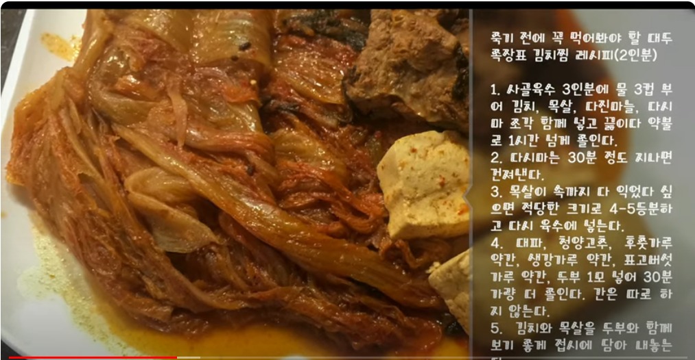

종갓집 두부를 썼는데, 종갓집 손두부인가, 확실하지 않아요. 왜냐면 요즘 나오는 손두부랑 좀 다른 거 같거든. 예전에는 그 포실포실한 두부가 있어요. 좀 공기를 많이 머금고 있는 김치찌개용, 찌개용 두부 사시면 다 망가지고. 딱딱한 두부를 써야 하는데. 그렇다고 부침용 두부는 또 맛이 없고. 포실포실해야 돼. 잘 부푼 빵같이 생긴 두부가 있거든요. 그 녀석을 넣으면 고기랑 같이 먹기 굉장히 좋아요. 김치, 두부 김치랑은 좀 맛이 달라. 그러니까 그렇게 먹는 것도 한 가지 방법입니다. 아 잘라야 되는데 안 잘랐구나. 일단 먹을게, 한번 먹을게. 

이게 지금 네 번 정도 해먹은 후에 제가 '아 이건 먹방을 하는 게 낫겠다' 싶어서 하는 거예에. 실험을 해 봤단 얘기지 네 번 정도? 이번이 네 번째 같네요. 마눌님도 만족을 하고 그래서. 소개를 해 드리려고 김치찜을 빠르게 맛있게 먹는 방법, 맛있게 만들어 먹는 방법. 일단 한 입 먹고. 제가 놀라운 이유가. 실제로 이걸 요리한 시간이 40분 밖에 안 돼요. 40분 조금 넘어갔을 거에요. 근데 좀 성급하면 그 김 빼는 과정 있잖아. 아까 김 빼다가 좀 사고 쳤잖아. 양을 너무 많이 해 갖고, 너무 많이 하지 마십시오 진짜 위험합니다. 그런데 그 김 빼는 과정을 생략할 수도 있거든? 김을 빼면 더 푹 익은 김치를 먹을 수 있는데, 그것도 호불호가 있으니까. 너무 팍 삭아버리면, 맛이 없다는 분들도 있으니까. 그러니까 그 김 빼는 과정을 생략하면, 진짜 40분이면 끝이야. 그것도 실제로 요리하는 시간은 20분이야. 앞에 20분은 예열하는 시간이거든요. 그 앞에 보셨을 거야 영상을 제가 찍어놓았는데, 그 앞에 예열하는 시간이 한 15분에서 20분 되거든? 그건 시간이 안 나와. 그래서 정확히 알 수가 없어. 근데 실제로 요리하는 시간은 20분밖에 안 나옵니다. 그러니까 40분에 김치찜을 만든다는 거야. 이건 상상할 수가 없거든. 근데 이 맛이 난다는 게. 놀라운 수준이거든요. 왜냐면 이 김치찜 정말 오래 걸려요 해보신 분 계실려나? 해보신 분은 아시겠지만 김치찜 진짜 오래 걸리는데. 김치를 푹 익히는 데 들이는 시간, 그리고 또 하나 장점이 안 타 김치가. 원래 김치찜 하다가 태워 먹거든. 그걸 계속 지켜봐야 되고. 해보시면 알아, 해보시면. 김치가 타고 아랫부분은 타고 그러니까 불 조절해 가면서 해야 되고. 근데 얘는 시간 맞춰 놓으면 그냥 밖에 산책 갔다 올 수도 있어요. 예전 방송에서도 김치찜에 대해서 몇 번 말씀드렸는데, 팁을 또 하나 드리면, 사실은 김치가 맛있잖아? 그냥 때려 넣고 끓이면 그게 김치찜이잖아. 좀 더 맛있게 끓이고 싶으시면 아까 보여드렸듯이 사골 국물을 집어넣어요. 사골 국물은 취향인데 그것도 개취인데. 또 일반적으로 김치찜 끓일 때랑 이렇게 끓일 때랑 달라요. 일반적으로 끓일 때는, 사골 국물도 많이 필요하고. 물도 많이 필요하고. 그래서 뭐 절반씩 넣는다든가, 사골 국물을 더 많이 넣는다든가. 그렇게 했는데. 이 인팟은 오히려 국물이 너무 많으면 안 돼요. 아까도 김치가 많은 것보다, 국물이 너무 많았어. 그러니까 어린이 사골이라는 거 기준으로 그게 150g인가 그런데. 그거 기준으로는 제가 지금 2개 넣은 거거든? 2개 넣고 김치 국물 좀 넣고 적당히. 물도 그 정도 넣고 그 사골 국물 넣은 만큼 정도? 오히려 그거보다 좀 자작자작할 정도. 그 정도만 넣으면 돼요. 그러니까 원래 김치찜을 그렇게 끓이잖아? 불로 끓이는 김치찜을, 그렇게 끓이면 다 타지. 감당이 안 되지. 근데 얘는 그게 된다니까? 그러니까 신기하지. 일단 육수는 그렇게 끓이면 되고요. 그리고 감칠맛을 좀 추가를 해야 되잖아. 다시, 맛의 기본은 뭐다? 짠맛, 단맛, 기름맛 플러스 감칠맛, 우마미. 그리고 온갖 다른 맛들이 있는 거잖아요. 그러니까 맛이라고 할 수 없는 매운맛, 이런 건 통각, 매운맛 들어가 있잖아. 단맛 들어가 있잖아. 단맛도 추가해서 먹잖아. 탄수화물 먹잖아. 짠맛은 당연히 들어가 있고, 그리고 기름 쳐 발라서 먹잖아. 맛이 없을 수가 없죠. 여기다가 감칠맛을 추가하면 되거든. 그럼 정말 맛있게 먹을 수 있거든. 어차피 김치에 약간 감칠맛이 있어요. 김치 담글 때. 그런데 여기에 더 감칠맛을 추가하고 싶으면 가쓰오부시틱한 맛을 내면 되니까, 다시마를 넣거나 아니면 치트키 하나 쓰면 되거든 참치 간장, 참치 간장을 좀 넣으면 돼요. 고기 덩어리를 생각해서, 고기 덩어리를 한 덩어리 정도 넣는다, 그러면 참치 간장 하나? 그 정도? 저는 지금 이걸 네 덩어리를 넣었거든요? 마눌님 걸 남겨놓느라고. 제가 반을 먹는 거고 그러니까 네 숟가락 정도 넣었는데. 그 계량은 별로 의미 없어. 그냥 감칠맛이 이 정도 나겠다 싶은 그냥 눈대중이야. 그러니까 저는 네 숟가락 정도 넣었다고. 한 두 숟가락 정도 넣으시면 될 거야. 1인분 기준으로. 한 사람이 먹는다는 생각으로. 그렇게 생각하면 될 것 같고. 그리고 이게 돼지가 냄새가 날 수 있잖아요. 이건 목살을 하거나 삼겹살을 사면 되는데 수육용을 사시면 됩니다. 근데 수용용이라는 게 딱히 따로 있다는 거라기보다 잘라놨느냐 안 잘라놨느냐거든. 그러니까 목살을 쓰거나 삼겹살을 쓰는데 삼겹살도 통으로 돼 있는 거 그걸 사셔야지 안 그러면 구이용으로 잘라놓은 거, 그걸 사시면 다 풀어지거든. 찌는 과정에서. 특히 이 인팟은 그래도 덜 부서지는데, 그냥 김치찜 하듯이 불에다 끓여서 하는 걸로 그렇게 하면 다 물르거든요. 완전히 가루 돼 버리거든. 그러니까 통으로 된 거, 목살이 됐든 삼겹살이 됐든 통으로 된 걸 쓰는데. 돼지고기가 됐든 닭고기가 됐든 냄새가 납니다 고기는. 닭고기는 약간 닭 비린내가 나고, 돼지고기는 또 돼지 비린내가 나잖아요. 누린내 같은 거. 제일 좋은 방법은, 어떻게든, 어떤 방법으로든 조선 간장을 쳐 바르는 거야. 짜지 않게. 그래서 옛날에 백숙 먹을 때도 조선 간장 찍어 먹으면 맛있었거든요. 유일하게 조선 간장 찍어 먹어서 맛있는 음식이 백숙이거든. 냄새가 안 나 그래서. 백숙 찍어 먹으면. 백숙을 조선 간장에 찍어 먹으면. 이것도 마찬가지인 게, 어떤 식으로건 조선 간장을 넣어야 돼요. 별짓을 다 해보거든 사람들이. 막 월계수잎도 넣어보고, 허브도 넣어보고, 막 커피가루도 넣어보고. 김치찜 할 때, 누린내 잡겠다고 다 부질없는 짓이고. 그냥 조선 간장 몇 숟가락 넣으면 돼요. 근데 조선 간장도 짜잖아. 짠 맛을 컨트롤 해야 되잖아. 근데 아까 참치 간장도 넣는다고 그랬잖아, 다시마 맛을 내기 위해서. 가쓰오부시 맛, 우마미 맛을 내기 위해서, 감칠맛을 내기 위해서. 그러니까 그걸 다 짱구를 살짝 굴려야 돼. 김치도 원래 짜거든. 그러니까 이걸 다 어우러지게 해서, 국물도 생각을 해야 되고. 이건 그냥 짬밥이에요. 근데 인팟의 장점이자, 단점이잖아 이게 또. 국물을 가늠할 수가 없어. 쫄지를 않으니까. 원래 불로 하면은 쪼는 걸 계산을 해서, 불로 조절을 해서 육수를 쫄여나가는 거거든. 얘는 쪼는지 안 쪼는지 볼 수도 없고, 쫄지도 않아. 그러니까 애초에 자작자작하게 집어넣는다고 생각을 하고, 간도 살짝만 해야 되는 거죠. 근데 제 경험으로 이제 한 네번 해먹어보니까, 조선 간장을 저 참치 간장 넣는 거 그거의 절반 정도? 그 정도만 넣어도 냄새가 안 납니다. 어쨌든 넣기는 넣어야 돼. 안 그러면 냄새가 나요. 

그리고 간단하고. 요리를 안 해보는 분들은 김치찜이 되게 어렵다고 생각하거든. 거의 라면 끓이는 수준인데. 근데 이런 근사한 요리를 딱 내놓으면, 집들이를 했을 때 예를 들면. 와서 드시는 분들이 대단히 정성을 들여서, 맛있게 요리를 잘하는 분이 그렇게 한 줄 알지. 김치 맛있으면 맛있고, 고기 맛있으면 맛있어. 그게 전제지. 김치가 맛있고 고기도 맛있어야죠. 그러니까 살짝 제품을 사서 할 거면, 자기 입맛에 맞는지, 검증을 해본 다음에 해야죠. 무턱대고 하면 안 되고. 입맛에 안 맞는 김치는 정말 안 맞아. 아무리 유명한 김치라도. 

2021. 2. 19. 객체지향적 요리

맛에 관해서, 요리에 관해서, 저한테 질문하시는 분이 계셔서, 제가 댓글을 달아드리다가 생각이 났어요. 이건 다른 분들한테도 좀 팁이 될 수 있겠다, 팁? 제가 요리 전문가는 아니기 때문에 그냥 제 경험을 토대로 주절주절 맨날 하는 주의사항이죠. 요리 전문가는 아닌데 요리에 관심이 많아서, 제가 할머님한테 종그레기 소리를 듣던 초딩 시절부터 요리를 했어요.

그 때는 뭣도 모르고 그냥 할 때고 근데 그 경험이 오래 쌓이면 제가 이제 반백이 넘었으니까. 한 40년 했을 거 아니에요. 본격적으로 요리를 한 건 십몇년년, 15년, 17년 그 정도고요. 그 이전에도 요리는 했는데, 요리를 연구해가면서 분석해가면서 객체지향적으로 하기 시작한 거는, 한 15, 6년, 7년 그 정도 될 겁니다. 제가 네이버에서 블로깅, 브이로깅이 아니고, 그냥 글로 쓰는 블로깅. 그걸 할 때부터 요리를 했으니까. 마침 맞게 그 때 책을 하나 번역을 했어요.

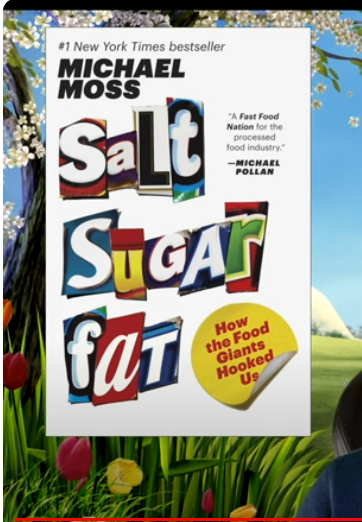

그 책 제목도 짠맛, 단맛, 기름맛인데, 그 짠맛, 단맛, 기름맛의 순서를 헷갈릴 수도 있는데. fat, salt, sugar, salt, fat, sugar, salt, sugar, fat 그 셋 중에 하나에요. 경우의 수가 그거니까. 어쨌든 그 중에 하나인데, 그 중에 하나 책 제가 또 소개를 해드릴게요. 이것도 영상에서 몇 번은 소개를 해드린 겁니다. 그 책을 번역을 하게 됐어요. 결국은 제가 그 번역을 그만두고, 다른 분한테 넘겼는데. 뭐 그건 개인적인 사정이 있어서. 다른 프로젝트를 진행을 하게 되면서 계약금 돌려드리고 그만둔 적이 있어요. 근데 그 책을 거의 다 읽었거든요. 번역을 해야 하니까. 그래서 제가 번역한 건 아니지만 시중에 나와 있을 겁니다. 혹시 관심 있으신 분은 원서를 읽으시는 걸 권해드리지만 늘. 부담스러우신 분은 역서를 보셔도 될 거예요. 그게 무슨 책이냐면, 맛의 3대 기본 원리 짠맛, 단맛, 기름맛에 관한 거예요. 근데 고발 서적입니다. 현 세태를 고발하는, 특히 음식료 업체를 고발하는 내용이거든요. 그게 무슨 내용이냐면, 어렸을 때부터 짠맛, 단맛, 기름맛을 강조를 한 음식, 과하게 짠맛, 단맛, 기름맛을 버무린 음식, 그것들을 아이들을 먹이는 거에요, 음식료 업체들이. 그래서 중독을 시키는 거죠. 대표적인 것들이 음료, 탄산음료 그리고 과자들이죠. 여러분 과자 먹으면 맛있잖아요? 맛있잖아요 그게 다 짠맛, 단맛, 기름맛 덩어리거든요. 음료 마시면 맛있잖아요. 특히 뭐 콜라, 다 아실 거예요. 그게 중독이 되는 이유가 있어요. 특히 설탕 맛 단맛에 중독되면 답 없습니다. 어렸을 때 단맛에 중독된 사람은, 나중에도 그걸 벗어나질 못하거든요. 그리고 이 짠맛, 단맛, 기름맛의 특징이, 갈수록 더 강한 짠맛, 단맛, 기름맛을 찾게 돼요. 뭐 그건 그런 얘기고. 안 좋은 면이고. 어쨌든 맛의 기본 3대 요소입니다. 짠맛, 단맛, 기름맛. 그걸 제가 보여드릴게요. 그 증거를. 이 빵이 그 증거예요. 

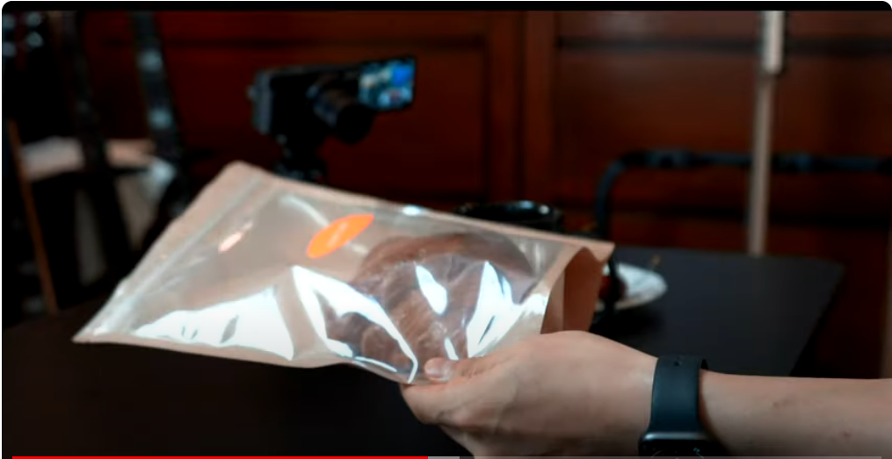

빵을 증거로 보여드리면, 이게 지금 크로와상 빵인데, 그나마 덜 몸에 안 좋은, 그나마 건강에 좀 신경을 쓴다는 분들이 먹는 크로와상 빵입니다. 거기에 제가 과일 좀 먹는 거고요. 과일도 건강에 무조건 좋을 거라고 착각하면 안 되는 게 과당이 많거든요. 그러니까 단맛이 엄청 강합니다. 이거 많이 먹으면 몸에 단맛이 엄청 들어오는 거죠. 마눌님은 그래서 거의 과일을 안 먹습니다. 좋아하는 과일도 아주 자제를 하면서 먹어요. 단맛을 굉장히 줄이는 친구이기 때문에. 어쨌든 이걸 제가 지금 크로와상 빵 성분을 한번 보여드릴게요. 

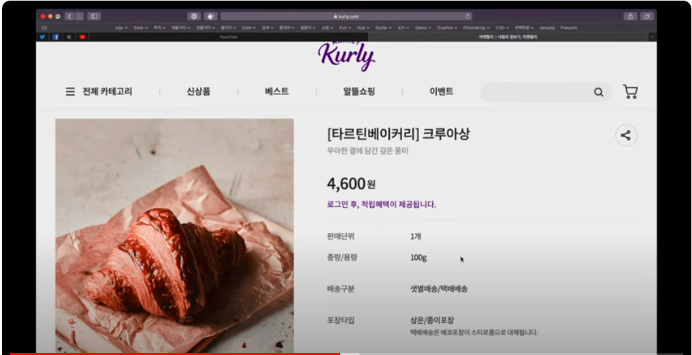

이걸 보시면 이게 지금 타르틴 베이커리라는 데서 나온 크로와상인데, 그나마 몸에 덜 나쁜, 빵은 대부분은 설탕이랑 버터를 범벅을 해서 만듭니다. 그건 다들 아실 텐데. 건강에 좋을 리가 없어요. 탄수화물 덩어리고. 그런데 그래도 빵은 먹고 살아야 되잖아요. 먹고 싶을 때가 있으니까. 잘 보시면 쭉 내려가서 볼게요. 저는 마눌님이 오케이 한 빵만 먹어요. 저보다는 성분을 훨씬 잘 보는 친구이기 때문에. 전문가 수준이기 때문에. 거의 모든 약품과, 식재료와 그 성분을 거의 다 아는 친구거든요. 그래서 마눌님만 믿습니다 저는. 

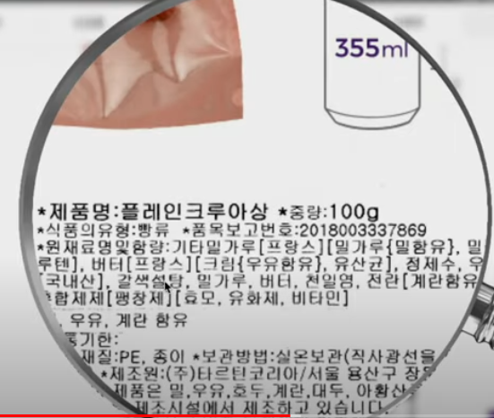

여기 잘 보시면 가장 기본적으로 들어가는 게 단맛 갈색 설탕, 그나마 갈색 설탕이죠. 그리고 탄수화물 밀가루 이거 단맛입니다. 탄수화물은 짤없이 단맛이에요. 버터 기름맛이죠. 천일염 짠맛입니다. 모든 재료들도, 식재료들이 다 기본적인 맛이 있거든요. 그걸 염두에 두셔야 하고. 탄수화물은 다 단맛입니다. 그러니까 결국 단맛 기름맛 짠맛의 향연이에요. 이 빵은. 그래서 빵을 까 볼게요. 짠맛 단맛 기름맛으로 만든 빵. 그리고 조금씩 뜯어 먹겠습니다. 뭐 그냥. 대단한 먹방을 하겠다는 건 아니니까. 이게 가장 기본적인 맛의 원리거든요. 짠맛 단맛 기름맛으로 맛을 냅니다. 여기에 제가 늘 강조하는 객체지향성 얘기를 하잖아요. 객체지향으로 설명 안 되는 현상이나, 사물이나 개념이 없어요 이 세상에. 제가 괜히 객체지향성이 이 유니버스 구동엔진을 이해하는 치트키라고 하는 게 아니거든요, 이 세상을 살아가는. 요리도 마찬가지입니다. 짠맛 단맛 기름맛 이거 어떻게 아냐면, 객체지향성의 상속성이에요. 모든 요리의 공통점이라. 상속성은 공통 분모라고 했잖아요. 그리고 요리마다 레시피마다 자기만의 나름대로 개성이 있어요. 그게 폴리몰피즘, 다형성이죠. 그리고 그 나라나, 특히 뭐 베트남이나 우리나라나 중국이나 일식이나 아니면 뭐 멕시코 음식이나, 자기들만의 고유한 맛을 내는 멋들이 있거든요. 뭔가들이. 향신료가 있다든가. 그것도 개성에 해당하고. 또 그 양념장이나 이러는 거 어떻게 만드는지 몰라도, 뭐 살사 같은 걸 직접 만드시는 분들도 계시겠지만 그냥 사서 먹기도 하잖아요. 그럼 대충 어떤 맛이 난다, 인터페이스만 아는 거예요. 그걸 어떻게 만드는지 몰라도 가져다 쓸 수 있잖아요. 우리나라 갖은 양념 같은 거. 그런 게 캡슐화에 해당합니다. 인캡슐레이션, 인터페이스만 사용을 하는 거에요. 이 맛을 내려면 이 양념을 쓰면 된다. 이게 또 재밌는 게 우리나라 제일 애매한 레시피 항목 중에 하나가 갖은 양념이거든요. 갖은 양념을 뭘 어쩌라고, 갖은 양념이 뭔 줄 아세요? 그 맛의 3대 요소 짠맛, 단맛, 기름맛을 범벅을 한 다음에 우마미, 감칠맛 더하고 매운맛 더하고 신맛 더하고 뭐 이런 거예요. 그러니까 그 범주를 벗어나지 않습니다, 객체제한성의 범주를. 어떤 분들이 그렇게 말씀하시잖아요. 요리 잘하시는 분들이 라면 맛있게 끓여 먹으려면 물 조금 넣고 끓이세요. 왜 그럴까요? 짜게 먹으라는 얘기에요. 짜게 먹으면 맛있어요 뭐든지. 인간이 짜다고 느끼는 게, 소금만 먹으면 굉장히 짠 걸 금방 느끼는데. 이 방탄 커피에도 소금이 들어 있습니다 지금. 왠지 아세요? 방탄커피의 향미가 더 강해지거든요. 풍미가. 조금만 넣으면, 저는 소금도 구운 소금 죽염을 먹습니다. 제가 풍치가 있기 때문에, 치주염이 있기 때문에 그걸 몇 년 동안 죽염으로 다스렸거든요. 그러면서 죽염을 좀 많이 먹습니다. 빵을 가끔 먹어가면서 먹을게요. 이 맛의 기본 3대 요소 짠맛, 단맛, 기름맛만 잘 다룰 줄 알아도 거의 모든 요리가 맛있습니다. 모든 레시피의 기본은 80%는 짠맛, 단맛, 기름맛이 먹고 들어가기 때문에.

근데 짠맛, 단맛, 기름맛을 꼭 무슨 버터나 이런 걸로 기름맛을 내고, 지방으로 기름맛을 내고, 설탕으로 단맛을 내고, 소금으로 짠맛을 내고, 꼭 그런 건 아니거든요. 왜냐하면 사용하는 재료 있잖아요. 식재료. 그 식재료에도 다 기본적인 맛이 있습니다. 양파, 대파, 실파, 쪽파, 파 종류 있잖아요. 이게 다 단맛이거든요. 여기에 약간의 매운맛이 있는데, 그건 불을 사용해서 재료를, 요리를 하면 그 매운맛은 많이 사라져요. 단맛만 강해지거든요. 그래서 설탕으로 단맛을 맞췄는데, 양파를 잔뜩 넣었다 그럼 단맛이 훨씬 강해집니다. 그래서 요리를 망칠 수도 있죠. 재료를 다룰 줄 모르면, 식재료의 기본 맛을 모르면, 그래서 맛이 엉망이 될 수도 있어요. 이 3대 요소를 알았으면 그 다음에 알아야 되는 게 특히 우리나라 음식, 아니면 일식, 동양 쪽 음식들이 그런데, 세상 모든 음식이 조금은 있는데 특히 우리나라 음식하고 일식이 강해요. 우마미라는 거. 이것도 제가 공교롭게 이 우마미에 관해서 번역을 한 적이 있어요. 이 우마미의 대명사 기업이 미원입니다. 미원이 지금은 대상이라는 이름으로 바뀌었죠. 그 이후로 안 바뀐 걸로 아는데, 제가 잘 모를 수도 있어요. 아직도 대상일 거예요. 코끼리, 대상. 이 분들이 옛날에는 미원이었잖아요. 그런데 미원이라는 이미지가 워낙 안 좋아서 MSG 때문에, 그게 워낙 안 좋아서 이름을 바꾼 거거든요. 그런데 예전에는 미원 안 먹으면 못 살았잖아요. 그게 우마미 덩어리입니다. 감칠맛 덩어리, 감칠맛의 기본은, 제가 그 미원의 연구소에서 나오던 브로셔 자료를 번역한 적이 있어요. 그래서 좀 우마미에 대해서 많이 알게 됐어요. 

그 우마미는 다시마에서 나오는 건데 다시다는 cj 제일제당, 그곳에서 미원이랑 상대를 하기 위해서 나온 제품이죠. 미원이랑 싸우기 위해서. 지금은 미원하고 다시다를 많이 쓰시지만, 예전에는 우마미를 첨가하는 거의 유일한 방법이 다시마였어요. 강하게 추가할 수 있는 방법이. 그리고 추출해내는 게 다 다시마에서 추출을 해내는 거고. 아니면 가쓰오부시 굉장히 강한 다시마 맛, 우마미 맛을 가쓰오부시에서 추출을 합니다. 우마미라는 게 그래서 가쓰오부시 쪽에서 나온 말이거든요. 일본어입니다. 기본적으로는 일본어니까. 우마미가 거기서 온 건데, 우리도 우마미라고 써요. 이제 일본어라는 의미가 없어졌을 정도의, 어원이 애매하게 됐어요. 이건 연구 자료 할 때도, 논문에서도 우마미라고 써요. 그냥 우마미 라고. 맛미자입니다 그게.

미원이라는 것도 원래 중국 통해서 일본으로 갔다가, 우리나라로 온 건데. 미원이라는 말이. 그래서 그게 아지모토였거든요 옛날에. 맛 미자가 아지로 읽고. 일본어로. 그 다음에 근본 본자 이거를 모토라고 읽으니까. 그래서 아지모토였거든요. 기업 자체가, 미원을 만드는 기업 자체가. 그 아지모토에서 우리가 가져와서 미원을 만든 거죠. 하여튼 다시마, 이만큼을 거기서 우마미만 뽑아내서 만들면 미원 한 티스푼 정도가 되는 겁니다. 한 티스푼이면 어마무시한 다시마를 먹는 거나 마찬가지예요. 그걸 추가하면 우리나라 국이나 찌개를 먹을 때 느끼는 그 감칠맛 있잖아요. 다른 데서는 못 느끼는. 뭐 서양 요리에서 못 느끼는 그 맛. 그 감칠맛에 해당하는 맛. 시금치국 같은 데서 느끼는. 된장국 같은 데도 다시마 집어 넣거든요. 그런 거 안 집어 넣으면 그 맛이 안 나요. 단맛 짠맛 매운맛만으로는 낼 수 없는 그 감칠맛이 있어요. 그걸 다시마로 내는 겁니다. 그래서 다시마하고 멸치를 넣는 거죠. 그렇게 해서 육수를 낸 다음에 국을 끓여야 하는데, 그걸 기본을 모르시는 분들이 그냥 끓여요. 모든 국을. 맹물에다가 그러니까 맛이 안 나죠. 나이 드신 분들 중에서도 그거 모르시는 분들이 계십니다. 그냥 끓이시는 분들 계세요. 진짜 다시마 하나 들어가는 것과 안 들어가는 건 하늘과 땅 차이에요. 그래서 단맛 짠맛 매운맛 거기다가 플러스 다시마 한 장이에요. 그러니까 우마미, 감칠맛 그걸 추가하는 거고. 또 우리나라 분들이 많이 좋아하시는 아니 거의 모든 나라 분들이 좋아하는 거 같아요. 매운맛. 일본 사람들 빼고, 일본 분들 빼고. 그 매운맛은 맛이 아니거든요. 다들 아실 텐데 통각입니다. 혀가 아픈 거죠. 그냥 통증이에요. 그걸 즐기는 거야. 메조키스트들이야. 어쨌든 그걸 즐기는데 매운맛을 즐기는 겁니다. 그 매운맛은 취향에 따라서 추가하고 빼고 그러는 거고. 그러니까 잘 생각해 보면 삼겹살 구워 먹을 때, 그 기름에다가 삼겹살 기름에다가, 김치를 범벅해서 먹잖아요. 구워서. 그게 왜 맛있을까요? 짠맛 단맛 기름맛 플러스 김치에 기본적으로 우마미가 들어가거든요. 그 우마미 맛 플러스 매운맛 통각, 그러니 맛이 없을 수가 없어요. 거기다가 밥에다가 얹어 먹어 봐요. 밥이 뭐다 탄수화물, 단맛이거든요. 엄청 맛있죠. 그러니까 모든 요리나 레시피 이런 걸 볼 때 이게 '왜 맛있을까' 딱 그것만 생각을 하면 돼요, 객체 지향성. 상속성으로 공통 분모를 뽑아냅니다. 이게 단맛 짠맛 기름맛 중에 어느 걸 강조한 걸까. 대부분은 골고루 분배가 돼 있는데. 그 중에 강조되는 맛이 있어요. 삼겹살이야 당연히 기름맛이 강조가 되겠죠. 거기다가 우마미랑 매운맛을 추가한 게 김치 구워 먹는 거고. 더 단맛을 추가하고 싶으면 밥이랑 먹는 겁니다. 그렇게 생각하면 돼요. 성분을 추가해서 먹는다고 생각을 하면, 아주 간단한 원리에요.

여기에 또 요리 잘하시는 분들이 뭐 만능 간장이니 뭐 이런 거 만들잖아요. 그 만능 간장도 한번 생각을 해보세요. 고기 집어넣거든요. 간장 집어넣고. 그리고 설탕 왕창 집어넣고. 짠맛 단맛, 간장이니까 짠맛이잖아요. 거기다 설탕 왕창 집어넣었으니까 단맛이고. 여기에 기름 집어넣잖아요. 고기. 맛이 없을 수가 없어요. 거기다 다시마 한 장 살짝. 그럼 우마미 추가. 그리고 여기다가 고춧가루 살짝 뿌리면, 통각을 추가하는 거고. 벗어나질 않죠. 여기에 나머지 있잖아요 향신료 이런 거. 향신료 이런 거는 취향 따라 가는 겁니다. 고수 안 먹는 분 계시듯이. 저는 고수 안 먹거든요. 그런 분들 계시듯이 이건 취향 따라 가는 거라. 지금 얘기한 다섯 가지 정도면 짠맛 단맛 기름맛 플러스 우마미 감칠맛 플러스 매운맛 그 정도면 세상에 맛이 없을래야 없을 수가 없습니다 모든 레시피가. 그러니까 레시피를 따로따로 외우시면, 객체지향적으로 세상을 바라보는 게 아니에요. 레시피를 봤을 때, 아니면 맛있는 음식을 봤을 때. 분석적으로 패턴을 인식을 하면, 그 다섯 가지를 안 벗어나요. 나머지는 다 비법이니 이러는 것들도 다 그걸 안 벗어나는데. 나머지들은 다 개성입니다. 다형성이에요. 그것만 찾아내면 그것만 추가하는 거에요. 나머지는 다 공통점이기 때문에. 그래서 요리를 잘하시는 분들은 그게 체득이 되어 있기 때문에 한눈에 보여요. 이 레시피는 뭐가 중심이다, 재료만 봐도 보이거든요. 뭐가 많이 들어가는가. 그것만 봐도 눈에 보이기 때문에 굳이 레시피를 외울 필요도 없고, 어디다가 써놓을 필요도 없고, 그러는 거죠. '아 저거는 그거였어' 감이 확 오니까. 그리고 자기, 자기가 배운 체득한 그 객체지향성에 맞게 요리를 해내는 겁니다.

굳이 레시피를 다 외우지 않거든요. 처음에 공부할 때나 조금 하다가 보면, 눈에 보이기 시작하니까. 공통분모가 보이고, 개성이 보이고 다형성이 보이고, 캡슐화 할 것들이 보이고. 제가 살사 소스 같은 건 안 만들거든요. 그냥 사서 쓰니까 그건 캡슐화 하면 되니까. 

그러니까 모든 레시피가 3대 원리, 3대 기본축 맛의 기본축 짠맛 단맛 기름맛 플러스 우마미 플러스 감칠맛 거기에 통각에 해당하는 매운맛 이것을 추가하는 것이고 나머지 향신료, 갖은 양념 역시 이걸 이 테두리를 벗어나지 않습니다. 여러분들이 맛있다고 생각하는 음식들 다 이 기준으로 한번 분석을 해보세요. 5초만 짱구 굴려도 딱딱딱딱 답이 나옵니다. 방탄 커피 왜 맛있는 줄 아세요. 기름맛이에요 여기에 단맛 추가하잖아요. 맛이 없을 수가 없어요. 거기다 제가 죽염 넣는다고 그랬잖아요. 안 넣는 분들도 있는데 이걸 넣으면 안 넣을 수가 없어요. 맛이 달라지기 때문에. 짠맛 단맛 기름맛 다 들어가죠. 무려 방탄 커피에도 그런 원리가 적용이 됩니다. 냉면 딱 생각해보면, 뭐 크게 다를 거 없어 보이잖아요. 거기에 겨자로 매운맛 추가하고, 신맛은 좀 얘기가 다른데. 그것도 취향이니까. 그런데 물냉면 예를 들면, 육수가 일단 단맛이 나요. 그리고 굉장히 짭니다. 인간이 느끼는 짠맛은 아까도 얘기했지만 굉장히 강한 짠맛인데도, 요리에 들어가면 잘 못 느끼는 경우가 있어요. 그래서 시원하게 맛있게 냉면을 먹었다고 생각을 했는데, 조금 지나면 막 물을 들이키죠. 그 시원한 냉면을 먹었는데 그 육수를 다 마시고. 엄청 짜다는 뜻이거든요. 그걸 맛있게 먹으면 몰라요. 라면을 먹을 때도 엄청 짜게 먹는 건데 나트륨 사발로 들이키는 건데, 그리고 나중에 물을 엄청 들이키죠. 그게 짠맛 때문에 그러는 거거든요. 먹을 땐 모릅니다, 굉장히 맛있게 먹었으니까. 그만큼 혀가 중독되거든요, 마비되거든요. 그래서 그걸 못 느끼는 거예요. 짠맛 단맛 기름맛을. 그래서 많이 먹다 보면, 특히 어렸을 때 많이 먹으면, 마비가 되기 때문에. 중독이 되기 때문에, 중독은 굉장히 무서운 거잖아요. 그게 이제 나이 들어서도 그걸 못 벗어나서 비만, 성인병 이런게 부작용으로 따라오게 되는 거죠. 그래서 아까 제가 말씀드린 책이 그런 걸 고발하는 내용이에요. 예전에, 뭐 지금도 마찬가지입니다만 담배 회사들이 발암물질이라는 걸 알고 팔아먹었거든요. 그래서 소송을 당한 거고. 그 책의 골자가 뭐냐면 음식료 업체들이 그 중독성을 알고 일부러 그렇게 만들었다는 거에요. 어렸을 때부터 아이들한테 뽕을 먹이는 거죠. 좀 위험한 발언일 수도 있지만. 뭐 책에 나온 거 없고 저는 그 책 내용을 얘기하는 겁니다. 실제도 그게 현실이고. 그래서 어렸을 때 과자 많이 먹는 아이들, 탄산음료 많이 먹는 어른들도 마찬가지고. 그 중독의 마수에서 벗어나기 힘듭니다. 그래서 건강이 나빠지는 거고. 

저도 콜라 벗어나는 데 꽤 오래 걸렸는데, 지금도 여행 가면 가끔 마시거든요. 마실 이유가 없는 음료인데. 아 얘기가 나왔으니 콜라 얘기가 나왔으니까, 제로 콜라 드시는 분들 계시잖아요. 거기에 아스파탐이라는, 아스파탐이라는 가짜 설탕이 들어갑니다. 인공 감미료. 그게 설탕보다 어마무시하게 단맛을 내는 거거든요. 제가 과거에 술 마실 때 국순당에서 나온 막걸리를 많이 마셨거든요. 그게 처음에는 국순당에서 나온 막걸리에 아스파탐이 들어있었어요. 나중에 욕을 먹고 바꿨죠. 그 아스파탐이 특징이 뭐냐면 부작용이 있습니다. 그걸 오래 복용을 하면, 복용을 하면, 오래 복용을 하면, 중독이 돼요. 첫째는 중독이 되고, 설탕도 중독이 되지만. 둘째는 집중력이 떨어집니다. 그걸 제가 실제로 느낀 거예요. 체험을 한 거라. 콜라를 안 마셔보겠다고 제로 콜라를 마신 거예요. 다이어트 콜라. 그런 거. 거기에 아스파탐이 들어가거든요. 아스파탐이 아니더라도 다른 인공 감미료가 들어갑니다. 그래서 그걸 많이 먹으면, 집중력이 떨어진다는게 어떤 의미냐면, 멍해요 하루 종일. 제가 그거를 하루에 세네 캔, 세네 페트병을 먹은 적도 있으니까. 그럴 때는 진짜 멍합니다. 왜 그런지 몰랐어요. 그거 끊으니까 그 증세가 사라지더라고요. 혹시라도 그걸 조금이라도 느끼시는 분은 그만 드세요. 건강에 안 좋습니다. 진짜 안 좋아요. 저희 집에서 먹는 설탕은, 흰색 설탕이 하나도 없고요. 마눌님이 절대 못 먹게 하기 때문에. 그나마 흑설탕 그 정도를 사용을 하고, 단맛을 내는 요리를 사용을 할 때는, 요리를 할 때는 저는 주로 꿀이나 올리고당을 사용을 하는데. 꿀 플러스 올리고당을 사용합니다. 꿀은 향이 강하고, 특히 향이 강합니다. 그 향이 강해서, 꿀만으로 예를 들어서 불고기를 했다, 그러면 못 먹는 사람들이 있어요. 향이 너무 강해서. 

그 향을 없애주려면 올리고당을 좀 섞으면 되거든요. 그건 취향에 따라서, 7대3 아니면 3대7 이렇게 섞으면 됩니다. 그러면 설탕 넣을 때보다 훨씬 맛있습니다. 진짜로. 자꾸 입맛을 들여 버릇하면.

물론 꿀도 많이 먹으면 안 좋습니다. 모든 당이 마찬가지인데. 잊지 말아야 할 게 특히 오래 영양쪽으로 공부를 안 하신 분들은 까먹으셨을 수도 있는데, 밥도 단맛입니다. 탄수화물은 다 단맛이에요. 그거 까먹으시면 안 돼요. 그러니까 가끔 좀 더 몸에 좋은 방향으로, 원재료들도 갈아치울 수 있어요. 제가 소금도, 좀 그나마 나은 죽염 같은 걸로 갈아치우듯이. 그러니까 대체할 수 있는 제품들을 찾아보세요. 이런 커피에 넣어 마시는 설탕 같은 것도, 설탕을 먹지 말고 인공 감미료 아스파탐 같은 거 먹지 말고. 멍크 프룻 같은 거, 좀 검증이 된 채식하는 분들이 먹는 거 이런 거. 키토하는 분들이 먹는 거 이런 것들을 연구를 해서 찾아보세요. 그러면 있습니다 대체품들이. 제가 지금 여기에 넣어 마시는 감미료도 멍크 프룻이거든요. 이 이름이 여러 가지가 있는데 저는 멍크 프룻으로 부릅니다. 이게 영어로 멍크프룻이고, 다른 말이 있어요. 

제가 지금 갑자기 생각이 안 나는데. 아 또 하나가 있는데, 스테비아라고. 스테비아도 원래는 천연 감미료인데, 그것도 약간 부작용이 있습니다. 스테비아는 이건 개인 마다 차이가 있어요. 아스파탐은 완전히 인공 조미료고, 사람이 만든 거고. 스테비아는 천연 재료인데 부작용이 보고된 게 뭐가 있냐면 속이 안 좋아요. 속이 더부룩하고 소화가 잘 안 되고 그걸 제가 많이 느낍니다. 스테아를 넣어서 먹으면. 그래서 스테비아를 안 먹기 시작했어요. 스테비아가 훨씬 설탕에 가까운 단맛인데, 멍크 프룻을 좀 입맛을 들이면 저는 아직까지는 멍크 프룻에서 부작용을 느낀 적이 없거든요. 멍크 프룻을 입맛을 들여서 좀 먹으면 흑설탕? 그 정도의 단맛? 그 정도 단맛은 느낄 수 있습니다. 그러니까 요리를 해서 먹을 때 흰설탕만큼 맛있을 수는 없어요. 그건 어쩔 수 없어. 요리하시는 분들이 흰설탕 쓰는 이유가 있어요. 맛있는 걸 어떻게 해. 거기다 흑설탕 쓰잖아요? 그 맛 안 나와요. 식당에서 그런 거 썼다가는 욕먹지. 맛없다 그러지. 그러니까 그걸 이해해 주세요. 요리하시는 분들이 쓰는 건 어쩔 수 없어. 밖에 나가서 사 먹으면 그 정도 트레이드 오프는 인정해줘야 합니다. 그런데 만들어 드시거나 건강을 신경 쓰면서 만들어 드시거나 이렇게 제품을 사드실 때는, 재료를 봐야 하는 거죠. 그러니까 마켓컬리 같은 데서 다시 보여드리면. 

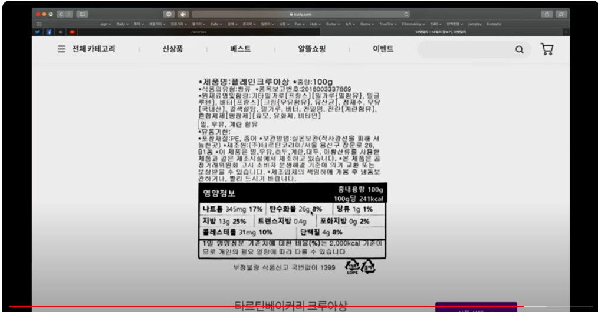

이렇게 마켓컬리 같은 데서 제품을 사면서도 요즘은 저렇게 성분을 다 볼 수 있게 해주거든요. 저거를 볼 줄 알아야 돼요. 저는 다행히도 제가 몰라도, 마눌님이 검증을 해주기 때문에. 마눌님이 저런 걸 워낙 신경을 많이 쓰고 공부를 많이 한 친구라 어지간한 약사보다도 약을 더 잘 아는 친구입니다. 화학 성분에 대해서도 굉장히 많이 아는 친구고. 그래서 마눌님이 오케이 하면 오케이인 거에요. 그래서 마눌님이 사주면 그래도 가장 덜 나쁜 빵이구나. 그러면서 먹는 거죠 이렇게. 제가 모르고 가끔 그냥 사는 경우가 있어요. 마눌님의 검증을 안 받고. 그러면 일단 혀에 닿는 맛이 달라. 어우 이건 나쁜 몸이 싫어해 오래 안 먹다가 먹으니까. 진짜로 오래 안 먹다가 미원 먹잖아요? 미원이 들어간 계란찜 같은 거, 고깃집 가도 미원을 쓴 계란찜과 안 쓴 계란찜은 단박에 티가 나거든요. 제가 미원을 안 먹은 지가 뭐 거의 20년이기 때문에. 미원을 조금이라도 넣으면, 확 혓바닥이 막 난리를 칩니다. 어우 이거 먹지 마 그러면서. 그래서 안 먹습니다. 그런 것처럼 조금 덜 몸에 나쁜 음식들을 먹어 버릇하면, 몸에 조금이라도 더 나쁜 음식이 들어왔을 때 몸이 반응해요 먼저. 그러니까 누가 봐도 안 좋은 과자나, 탄산음료나 이런 걸 마시고, 먹고 마시고 하는데도 몸이 거의 반응을 안 하고 좋아라 한다, 그럼 중독되신 거예요. 그건 살벌하게 느끼셔야 돼.

지금도 저도 뭐 그렇게 오래 건강하게 산 건 아닌데, 과자 같은 것도 신경을 많이 쓰면서 살았기 때문에. 마눌님 눈치를 봐가면서. 

안 좋은 과자를 손에 들고서, 조금이라도 손에 드는 순간 몸이 싫어하거든요. 입에 들어가면 더 그렇고. 근데 그게 신기한 게, 저 여행 가면서도, 여행 다니면서도 밖에 나가면 그냥 콜라를 가끔 마셔요. 지난해 유럽여행 했을 때도, 콜라를 마셨고. 미국 여행 했을 때도 콜라를 마셨는데. 처음에는 거부감이 듭니다. 처음엔 거부감이 들다가, 두 번째 세 번째는, 좋아라 해요. 진짜 딱 그거, 그 말이에요. 오랫동안 술을 끊었던 알코올 중독자가 딱 한 잔이면 끝나듯이. 중독의 공통점입니다. 콜라는 아무리 오래 끊었다고 해도 딱 한 잔이에요. 

'아 카 이 맛이지' 그러면 그냥 마셔요. 처음에는 거부를 하는데. 모든 몸에 안 좋은 음식들을 그렇게 받아들이는 거죠. 그냥 안 먹을 거면 평생 안 먹어야 돼요. 뭐 맛에 대해서 요리에 대해서는 솔직히 더 이상 해드릴 게 없을 정도로 이 정도면 끝이에요. 저도 그 이상 공부를 한 게 없어요. 나머지는 다 확인하는 과정이었어요. 이거 해보고 저거 해보면 '객체지향성이네' 상속성 다형성 캡슐화. 그 범주를 안 벗어나니까 왜? 이 유니버스 구동 엔진의 치트키니까. 과일이 몸에 좋죠? 그것도 약간 착각이거든요. 적당히 먹었을 때 좋은 겁니다. 이거 많이 먹으면 몸에 쌓이는 당이 너무 많거든요. 과일도 많이 못 먹게 해요 마눌님이. 저도 그렇게 많이 먹는 편은 아니고, 근데 여름에는 막 수박 같은 거 엄청 먹잖아요. 거의 설탕물인데. 그러니까 '과일은 무조건 건강하다' 이런 착각도 버려야 하고. 무한대로 퍼먹고 퍼마시고 그럴 수 있는 음식은 아마 세상에 없을 겁니다. 모든 게 적당히, 적당히. 이렇게 블로깅하니까 참 좋네요 진짜 그냥. 친구랑 만나서 얘기하듯이. 아무거나 먹으면서. 빵을 3분의 1도 못 먹었어. 얘기를 하다 보니까 이것도 하나의 팁이에요. 얘기를 하면서 천천히 먹어야 돼. 그래야 소식하거든요. 특히 나이 드신 분들. 저도 이제 나이를 많이 먹기 시작했지만. 정말 소식해야 됩니다. 

아직도 제 눈에는, 이런 빵을 막 예닐곱개씩 먹을 수 있을 것 같거든요, 젊은 시절 그 버릇이 남아있어서. 실제로 먹어보면 그렇게 못 먹어요. 늘 탈이 나고. 근데 이렇게 천천히 얘기를 하면서 지금 한 십 몇 분 얘기했죠? 꽤 오래 얘기를 했네. 뭐 그렇게 얘기를 했으니까. 저 버튼을 누르지도 않았네? 

지금 카메라를 세워놓고, 이 지금 지브이원 카메라를 녹화 버튼을 누르지도 않았어.

제가 이러고 살아요. 이게 나이 먹는 증거입니다. 이거 다 체크했는데도, 제가 리스트까지 만들어두고 있거든요. 이렇게 리스트까지 만들어서 체크를 해요. 아 이거 뭐 뭐 뭐 뭐 한다, 뭐 안 했다, 근데 이게 어저께 추가를 한 거라 깜빡한 거야. 목록이 없어요. 지금 지브이원 카메라를 켰나 안 켰나 이러는 게. 어저께 처음 육개장 먹방을 하면서 추가를 한 장비라, 수입을 한 장비라. 깜빡한 거죠. 아 뭐 이 카메라 이걸로 버텨야겠네. 근데 오늘 주로 다룬 거는 그냥 주절댄 거니까 음식이라기보단. 어쨌든 그렇습니다. 이것도 제가 뭐라고 할 수 없는 게 이게 업보예요. 젊었을 때 너무 함부로 먹고 함부로 살았으니까. 술도 엄청 먹고. 그에 벌을 받는 거죠. 당연히 죄를 졌으면 벌을 받아야지. 어쩔 수 없는 거죠. 한 살이라도 젊으셨을 때 몸한테 잘하세요. 안 그러면 이렇게 돼 ㅎㅎㅎㅎㅎㅎㅎㅎㅎ 대두족장이었습니다.