# [대두족장 인생 치트키 객체지향성 원론] Part 09 - 객체지향적 2D/3D/4D 유니버스 part 1 

**영상링크 : https://youtu.be/8d22yiMNttQ** 

---

> 업로드가 많이 늦어졌습니다. 며칠 전 이사도 하였고, 여러 면에서 제 인생에 많은 변화가 일어나고 있습니다.   
정말 너무 바빴어요. 이제 이사도 마쳤고, 큰 일들은 모두 정리를 하였습니다. 족장님의 스튜디오들에는 한~참 못 미치지만, 이사를 하면서 나름대로 신경을 써서 작업 공간도 마련하였기 때문에, 앞으로 제 업무나 호라이즌 확장의 생산성이 많이 향상될 것으로 기대하고 있습니다. 한 1주일 정도는 여전히 바쁘겠지만, 전보다 더 많은 시간을 제 본업과 호라이즌 확장에 투자할 수 있겠고, 효율성도 제고될 것이라 향후 여정이 많이 기대됩니다😁

> 이 영상에서는, 족장님의 호라이즌들이 어떻게 포개지고 어떤 식으로 시너지를 일으키는지를 다시 한번 '감상'할 수 있었는데, 참 여러번 감탄했습니다.  
호라이즌의 확장과 포개짐은 'connect the dot'이라는 표현으로는 부족함이 있다고 생각해요. 
단순히 점을 연결하는 차원이 아니라, 점, 선, 면들이 서로 포개지고 연결되면서 3차원의 공간이 새로 생겨나는 것으로 보아야 할 것 같아요.  
하나의 선, 하나의 벽은 아무 의미도 없지만 서로 연결되면서 방이 되고, 집이 되고, 건물이 되고, 성채가 되잖아요.  
족장님께선 수많은 점, 선, 면들이 포개지고 연결된 거대한 성채가 아닐까 생각을 해봅니다.  
객체지향적으로 생각해보면 이는 마치 시장 경제의 작동원리와도 같다는 생각이 드는데요.  
사람들 한 명 한 명은 큰 의미가 없고 생산성은 아주 작지만, 그들이 모두 시장 경제에 참여하면서 구성원들이 각자 비교우위를 가진 분야에 집중하고 분업하고, 협엽하면서 '보이지 않는 손'에 의해 거대한 시너지가 발생하는 것과 동일한 이치 같아요.  
1+1=2 가 아니라 1+1>2가 되고, 더 많은 구성원들, 뛰어난 구성원들이 시장 경제에 참여할 수록 단순 사칙 연산으로는 설명될 수 없는 폭증이 발생하는 것과 같습니다.  
그래서 더욱 많은, 뛰어난 사람들이 단일한 시장 경제, 단일한 세계 경제에 참여하는 것이 아주 중요해지는 것이겠구요(그런 맥락에서 보면 미국 주도의 세계 경제에 참여하지 않고 반기를 드는 국가들은 GDP 성장이라는 측면에서 큰 실수를 하고 있는 것이겠죠. 그걸 미국도 알기 때문에 항상 패권을 휘두를 수 있는 것일테고🤣, 그러면서도 한편으로는 미국 주도하의 경제 질서에 참여하는 것에 당근을 제공하려는 것이겠지요. 중국도 지금은 아쉬운대로 손을 내밀 수 밖에 없겠구요).  
마찬가지로 수없이 포개진 호라이즌을 가진 '한 사람'이 뿜어내는 생산성의 수준은 마치 수많은 국가들이 참여한 단일한 시장경제와 같이, 사칙연산으로 계산되는 수준을 아득히 넘어선 것이 아닐까 생각해요. 즉, 각 호라이즌들이 '보이지 않는 손'에 의해 거대한 시너지를 일으키는 것이죠!  
그 궁극적 사례가 일론 머스크일텐데요. 한 두개의 기업들을 넘어, 산업들을 재편하고, 이제는 미국이라는 국가를 개혁하려는 능력이 저로서는 그저 jaw-dropping이네요. 제가 너무 멀리 간 것 같은데, 아무튼 결론적으로 저는 이 영상을 보면서 다시 한번 족장님에 대한 경외, 호라이즌 확장에 대한 경외를 갖게 되었습니다.  
족장님이라는 거대한 성채 안에서 온갖 호라이즌들이 저마다의 비교 우위를 제공하면서 협업하고 분업하는 모습을 그려보면 놀랍습니다.

> 이 영상을 보면서 '바쁘다'는 것에 대해 생각해봤습니다.  
좁은 의미의 '본업'에 대한 헌신, 성실성은 참으로 소중한 미덕이고, 한 개인의 경쟁력 함수를 구성하는 여러 변수들 중 가장 큰 가중치를 갖고 있는 변수라는 생각을 하는데요. 우리가 서비스를 제공받기 위해 만나는 타인에게 기대하는 성실성과 헌신의 정도가 아주 높다는 점을 생각해보면 더 그런 것 같습니다.  
특히 공무원, 경찰, 검사, 판사 등 공적이고 중요한 문제들을 담당하고 처리하는 사람의 본업 헌신성과 성실성은 수많은 사람들의 인생까지 바꿀 수도 있다는 점에서 더욱 그렇구요.  
그렇게 생각해보면, COVID 사태를 기점으로 정말 수많은 사람들이 일을 하기 싫어하고, 조기 은퇴, 경제적 자유를 외치고 있다는 점에서 본업에 헌신적이고 성실하게 임하는 사람의 가치는 점점 소중해지지 않나 싶습니다.  
하지만, 단순히 '좁은 의미의 본업에만 헌신적이고 성실한 태도'는 경계할 필요가 있다고 생각해요.  
재미있는 일화가 있습니다. 제가 아는 지인이 대기업의 인사 담당자인데, '팔방미인은 채용하지 않는다'고 해요. 왜냐면 그 팔방미인은 회사에만 머물러있지 않을 것이기 때문이라고 해요. 그런데, 단순히 생각해봐도 팔방미인의 업무 능력은 '일방미인'의 능력보다 나을 수 밖에 없고, 일방미인의 경쟁력은 결국 이방미인, 삼방미인들보다 뒤쳐질 수 밖에 없잖아요. 일방미인들만 가득한 회사의 경쟁력이 어떨지 생각해보면 조금 걱정스러운 방향이 아닐까 해요. 물론, 뛰어난 인재는 다른 곳에 눈을 돌릴 가능성도 많겠죠. 그런데, 그런 인재가 다니고 싶은 회사를 만드는 것이 더 우선이지 않을까 하는 생각도 드는거에요.  
이건 아까 말씀드렸던 '성채', '시장경제'의 비유와도 연결된다고 생각하는데요. 면 네개로 이뤄진 초가집과, 수많은 면, 벽들로 이뤄진 성채의 내구도 차이, 시골 주민들만 참여하는 물물교환 경제와 수많은 국가들이 참여하는 시장 경제의 결과물 차이와도 비슷하지 않은가 싶어요.  
자신의 업무와 아주 밀접한, 직접적으로 연결되는 좁은 분야들에 몰두하고 집중하면서 헌신하고 성실성을 발휘하는 것은 너무 중요하고, 앞서 언급했듯 모두가 경제적 자유를 꿈꾸고 조기 은퇴를 꿈구는 현대 사회에는 점점 더 소중해지는 미덕이지만, 그 외의 분야들 - 호라이즌'들' - 까지 섭렵하고 확장하려는 태도 역시 놓칠 수 없는, 필수적으로 병행해야할 미덕인 것 같습니다.  
그러지 않으면 결국 다른 팔방미인에 의해 대체될 것이잖아요.  
이렇게 말하는 저 역시 너무 부족하고, 팔방미인들이 정말 많은 분야에 종사하고 있는데요. 단순히 제 업무 분야만 생각하며 좁게 살아왔던 과거와, 현재의 저는 정말 많이 달라졌다는 점에서 의미를 찾고 있어요.  
아, '좁은' 의미의 본업을 성실하게 수행하는 것만으로도 호라이즌이 확장되는 경우들이 많긴 해요. 특히, 본업이 다양한 사람과 사건을 접하고 처리해야하는 성격이라면 더욱 그런 면이 있죠.  
하지만, 그 외의 분야들까지 섭렵하는 노력을 적극적으로 기울인다면 그 경쟁력 향상은 더욱 눈부실 것이고, 기업의 이익 유보든, 개인의 호라이즌 확장이든 '복리 성장'의 속성을 갖고 있다는 점에서 이해가 되구요.  
족장님께서도 그런 맥락에서 계속 '호라이즌 확장'을 강조하시는 것일텐데요. 언뜻 생각하면 '3D 작업/공부를 왜 하는건가'라는 의문이 들 수 있지만, 우리는 인간으로서 지식을 끝없이 추구하는 도덕적 의무를 갖고 있을 뿐만 아니라, 본업이든 부업이든 취미든 궁극적 목표와 지향해야할 인간상은 '우주와 세계를 온전히 이해하는 것'이 되어야 한다는 점을 생각해보더라도 그 의미를 이해할 수 있스니다.  
저 역시 '제가 살면서 전혀 상관이 없을 것 같다'고 생각했던 여러 분야의 일들을 처리해 내야만하는 경우들을 만나면서 더 확신하게 되었어요. '나와는 전혀 상관이 없는 일' 따위는 존재하지 않는다는 것을요.  
'우주와 세계를 조금이라도 더 잘 이해하는 사람'이 그렇지 않은 사람보다 본업에서도 훨씬 경쟁력 있고, 대체불가능성이 높다는 점을 생각해보면 아주 쉬습니다.  
이걸 아는 척하는 저조차도 '상관없는 분야'로 자꾸 습관적으로 경계를 만드는 이유는 뭘까요? 그건 아마도, '어떻게든 지름길로 가려는' 태생적 습성 때문일 겁니다. 뭘 배우거나, 어떤 일을 할 때 '효율적으로', '최적화된 방법으로' 한다는 것은 아주 중요하지만, 그것 참 모순적 속성이 아닐 수 없어요. '뭘 모르는지도 모르는데' 어떻게 효율적인 방법으로 한다는 것이며, 어떻게 최적화를 한다는 것일까요. '천성적으로 게으르기 때문에 지름길을 찾고', '천성적으로 많이 하기 싫어하기 때문에 효율적인 방법을 찾는' 인간의 습성은, 인류의 문명의 원동력이 되어 왔지만, 개인의 성장에서는 정말 조심스레 다뤄야할 속성이 아닌가 싶어요

> 호라이즌 확장, 우주와 세계를 온전히 이해하는데 족장님 만큼이나 진심이었던 사람으로 찰리 멍거가 있는데요. 찰리 멍거는 자신이 건축비등을 기부했던 대학교 도서관과 건물을 직접 설계하였을 정도로 - 투자와 '상관없는' - 다양한 능력을 갖추고 있었다고 합니다. 그 외에도 수학, 물리학 등 온갖 분야에 관해 호라이즌 확장을 멈추지 않았던 사람입니다. 마치 족장님과 같죠. 워렌 버핏이 감정적인 이유로 버크셔 해서웨이를 인수하는 '실수'를 저지른 이후 찰리 멍거가 그 실수를 어떻게하면 교정할 수 있을지, 어떻게 하면 실수 교정을 넘어 버크셔를 위대한 기업으로 만들 수 있을지에 관해 조언을 하여 지금의 버크셔 해서웨이가 있다고 알려져 있는데요. 물론 그 방법에서 가장 중요한 핵심은 워렌 버핏의 위대한 capital allocation 능력에 있다고 할지라도, 찰리 멍거의 탁월하게 넓은 호라이즌들에서 뿜어져 나온 조언이 아니었다면 결코 지금의 워렌 버핏은 없지 않았을까 싶습니다. 찰리 멍거는 자신의 투자 아이디어를 발굴함에 있어, 생물학과 같은, 어찌보면 투자와 전혀 관련없어 보이는 분야에서도 아이디어를 차용해왔다고 알려져 있는데, 생물학 역시 '진화'와 '적자생존', '자연선택'과 같은 투자 대상으로서의 기업 발굴에 가장 근본적인 아이디어를 제공한다는 점에서 중요한 호라이즌이라는 생각이 들구요. 족장님이나 찰리 멍거나, 저보다 한참이나 뛰어나신 분들이지만 vanishing point로 삼기에는 정말 이상적인 분들이 아닌가 싶어요.

> 무엇이든 'earn'해야 함에 공감하는 요즘입니다.  
'earn'이라는 개념 안에는 수많은 개념들이 포개져있다고 생각하는데요.  
저는 개인적으로 '올바른' 이라는 개념도 포함되어 있다고 느낍니다. 아주 좁게, '돈을 번다' 목표에만 국한해서 보더라도, 단순히 '돈을 버는 방식' 뿐만 아니라 '그 돈의 출처'까지도 '올바를' 필요가 있는 것 같아요.  
족장님께서도 항상 강조하셨던 것이, '주가의 고점'이라는 것을 알았다 하더라도, short 포지션을 취하지 말라는 것인데요. 단 한번이라도 short 포지션으로 이익을 봤다면, 그 이후부터는 뇌의 사고 회로 자체가 바뀌고 결국 short으로 돈을 벌 수 있는 기회만 찾아나서는 것이 인간의 본성이잖아요.  
'이번 한번만 short으로 돈을 벌고 그 다음부터는 그러지 말아야지'가 될 것 같아도 결국 안되는 것이 인간의 본성이고 야성인지라, 계속 short으로 돈을 벌 기회만 찾는다는 것이겠죠.  
투자가 곧 세상을 사는 방식과 아주 밀접하고, 나아가 동일하지 않은가 하는 생각을 하게 되는데요. short으로 돈을 버는 방식만 찾아나서는 투자자가 세상을 어떻게 바라보고, 어떻게 삶을 영위할지 생각해보면 그렇게 번 돈을 과연 'earn'이라고 볼 수 있을까 싶은 생각이 드는 거에요.  
물론 short 포지션은 long term에서 시장을 건강하게 만드는 중요한 요소이기는 하겠지만, 시장에 참여하는 개인 투자자로서는 참으로 경계해야할 방식이 아닌가해요.  
사람들의 뇌는 여전히 수만년 동안 광야를 돌던 야성과 자연선택의 결과물인반면, 현대 사회에서의 투자와 삶은 오히려 야성과는 멀어져야 하는 면이 있잖아요.  
그래서 'earn'에는 '올바른' 이라는, 참으로 정의하기 어렵지만 반드시 필요한 개념이 포함되어야 하는 것이 아닐까 해요. 투자든 삶이든, 결국 모든 것에 경계는 없고, 모든 면에서 언행일치가 이뤄져야 하며, 건전하고 지속 가능한 방법을 택해야 할텐데, '투자는 조금 도박성 있는 방법으로 해도 돼', '투자는 어둠을 쫓아도 돼', '투자는 레밍 무리들을 따라가다가 중간에 이탈하면 돼'라고 한다면, 삶 역시 그와 동일하게 살게 된다는 점에서 진정한 'earn'이 아니라고 생각해요.  
'earn'의 방식은 참 다양하겠지만, 공통된 중요기준은 '지속 가능하고 반복 가능한가'일테고, 그렇기 때문에 '독립적으로' 사고하고 '건전한 원칙'을 갖고 있느냐가 너무 중요한 것 같습니다.  
그리스 신화의 영웅 오르페우스는 인류 중 유일하게, 죽은 사람(아내)을 하데스의 손아귀에서 데리고 나올 수 있는 기회를 얻은 능력의 소유자였지만, '고작' 자신의 감정과 야성을 통제하는 것에 실패하여 아내를 영원히 잃었다고 합니다. 그런데 과연 자신의 감정과 야성을 통제하는 능력이 우리가 쉽게 생각하는 것처럼 '고작'일까 생각해보게 되어요. 오르페우스는 실패한 이후 '다시 기회가 있다면 이번에는 에우리디케를 데리고 나올 수 있을 것'이라 생각하며 평생 후회하다가 죽었지만, 과연 그가 다시 도전했다면 성공했을까요? 감히, 저는 아니라고 생각해요. 오르페우스는 하데스를 감동시킬 정도로 훌륭한 '음악적 재능'은 있었지만, '지속 가능하고 반복 가능한, 합리적이고 건전한 원칙'을 고수하여 인간 본성의 야성과 감정을 통제하는 것이 훨씬 위대하고 갖기 어려운 능력인데 이건 사고로만 얻어질 수 있는 것이 아니기 때문일거에요. 반복된 경험, 시행착오로만 얻어지는데, 오르페우스는 그런 경험이 없었어요. 

띠리리리 띠리리리 🤣

해골입니다. 미국 아마존에서 직구한 해골. 우리나라에서도 살 수는 있는데, 이렇게 생긴 녀석이 없더라고요. 실제 스컬 정도 되는 크기 그리고 좀 비슷해야 되잖아, 진짜 스컬이랑. 그래서 결국은 직구를 했습니다. 우리나라에서 사도 해외에서 가지고 들어올걸요 아마. 그런 걸로 알고 있어요. 진짜 별짓 다하죠. 사진, 영상, 오디오, 비디오 패가망신, 대표적인 패가망신, 지름신 취미들이라고 하잖아요. 거기에 피규어 들어가잖아.

그러면 정말 이 나라에서 할 수 있는, 거의 불법적이거나 좀 불순한 그런 걸 빼고는, 아마 이 나라에서 할 수 있는 패가망신 취미는 다 하는 걸 거예요. 근데 이 스컬을 시작으로, 이게 보이시나? 이걸 해야지. 

바디꾼, 바디짱이라는 드로잉 피겨거든요. 얘가 액션 피겨처럼 움직이기 때문에 자세를 보면서 이렇게 그릴 수가 있어요. 그래서 이제 이걸 구매를 해서 좀 연습을 하다가, 그림을 좀 그리려면 연습을 좀 빡세게 하려면, anatomy를 좀 알아야 하기 때문에 제가 석정현님 책도 소개해드리고 그랬잖아요. 해부학노트.

근데 그것만으로 공부를 하기에는 좀 단순화해 볼 필요도 있고, 그래서 이제 이런 피겨를 활용하기 시작했거든요. 물론 컴퓨터에서 디지털 모델을 사용을 해도 되고, 제가 쓰는 그 일러스트레이션 프로그램, 그림 그리는 프로그램, 클립 스튜디오 이런 거에도 3D 모델을 임포트해.  이렇게 돌려 볼 수 있고 그런 기능이 있기 때문에 그렇게 해도 상관은 없는데, 그래도 이 스컬을 임포트해서 보는 거랑 이렇게 실제로 보는 거랑은 좀 다르거든요. 아, 여기가. '광대 활이라는 거구나' 뭐 이런 느낌? 이런 거 보면 여기가 광대 활이라는 거라서 이렇게 튀어나오는구나. 여기가 안와라서 이렇게 눈이 쑥 들어갔구나. 이런 확 삘이 오는 거랑 다르니까. 턱뼈가 이렇게 생겼구나. 코는 이렇게 생겼구나. 코뼈가. 그래서 주저앉기도 하는 거구나. 턱뼈는 빠지는구나. 이런 걸 해보고 싶었던 거죠. 진짜 눈으로 보고 싶었던 거고. 여기가 왜 튀어나오는지. 보는 거랑은 다르니까. 그 3D 모델만으로 느낄. 수 없는 뭔가가 있더라고요. 

3D 드로잉 피규어들.  마찬가지고.

드로잉 피규어는 제가 쓰다가 그런 생각을 했어. 이거 그림을 그리다 보니까 이 녀석들로 이렇게 자세를 보고 대충 윤곽을 잡기는 편한데, 옷이 입혀져 있는 것들도 아니고 그리고 뭔가 연출을 한 녀석들도 아니고 너무 단순화되어 있는 녀석들이기 때문에. 이런 피규어를 제가 드로잉 피규어를 이거 말고도 또 샀는데 아직 제작 중일 거예요. 요즘은 피규어 같은 것도 맞춤 제작도 할 수 있고 지브러시 같은 걸로 어차피 하시는 분들이 계시니까. 그런 분들한테 의뢰를 하거나 기성품도 있고. 그런 분들한테 의뢰를 하면 3D 프린트를 해서 . 작을 해서 이렇게 보내주시는 분들이 계시더라고요. 그래서 그런 것도 한 지금 8개쯤 오고 있을 거예요. 제작 중, 제작 거의 완료됐겠다. 지브러시 사용하시는 분들이던데 그분들한테 또 드로잉 피규어, 그거를 의뢰를 했거든요. 아, 이게 병이야.

한 번 시작하니까 책도 제가 드로잉 책을 원래 그림 그리고 3D 관심 갖고 캐릭.  만들고 이런 게 꽤 오래됐거든요. 

> 와.... 진짜 엄지척입니다.

한 2013년? 그때부터 했을 거예요. 뭐 영상도 보여드린 적이 있으니까 그 때 어떤 짓들을 했는지. 그 때도 그림책도 많이 사고 공부도 많이 하고 그랬거든요. 근데 실력이 형편없었죠. 그리고 나서 이제 그림 그릴 일은 없으려나 보다 그리고 이 대두족장 끝판왕 스튜디오로 이사 오기 전에 그 때까지도 쥐고 있다가 그림책들을 정리했거든요. 

그렇게 정리를 했었는데 다시 또 그림을 그리고 싶은 욕구가 용솟음 치는 거예요, 진짜. 그러니까 또 이제 요즘은 또 어떤 책들이 있나. 이미 정리했던 책도 또 샀어. 그리고 요즘 나온 좋은 책들 그 이후에도 많이 좋은 책들이 나왔더라고요. 아마 몇 권쯤 샀나? 한 50권 샀나요? 그러니까 한 10년 프로젝트인 거예요. 저걸 10년 안에는 다 그려보겠지? 그렇게 시작을 했어. 그렇게 시작을 해서 책도 한 50권 정도 산 것 같고. 갑자기 YES24에서 제가 프리미엄 등급으로 뛰어올랐으니까. 그리고 이 색도 한번 디지털로만 할 게 아니고 칠해봐야겠다, 실제로. 

그래서 한번 말씀을 드렸었죠, 제 커뮤니티란에. 색연필? 색연필을 사서 좀 칠을 해보고, 배색도 해보고 색상환 돌려보면서 공부도 하고, 그런 짓을 하다가 물을 좀 섞어서 수채로 해볼까? 색연필도 두 종류가 있더라고요. 유성이 있고 아무 말도 안 써 있으면 유성입니다. 그리고 수채가 있어요. 물을 묻혀서 붓으로 수채화 느낌을 낼 수 있는 그런 녀석도 있거든요. 

처음에는 유성으로 시작을 했다가 그렇게 또 칠도 해보고, 그걸 보고 마눌님도 재미가 있는지, 자기도 칠을 하기 시작하더라고요. 그래서 두 부부가 밤에 주방에 앉아서 칠도 하고 그러고 있습니다. 그러니까 어차피 피규어 드로잉 쪽에서 와야 하니까 캐주얼 드로잉을 하더라도. 이런 피규어들을 보면서 다양하게 그려보면 조금씩 조금씩 늘어나는 부분이 있어요. 아, 이 팔다리는 그리다 보면 이렇게 되는구나.

그냥 배우면서 할 수도 있는데 한 번 본다고 되는 게 아니니까. 자꾸 그려봐야 하니까. 만져봐야 하고 돌려봐야 하고. 그러니까 맨땅에 헤딩을 하면서 익히는, 무던하게 가는 제 방식이잖아요. 무던하게 가는 거. 그렇게 간다는 생각으로 지금 피규어들을 생각날 때마다 그리고 있는 거예요. 요 며칠, 올해 들어서도 몇 개 그렸죠. 어저께 그렸던 게 블라드볼에 나오는 그 인형,

그 인형을 이제 다크 소울 3에 나오는 프리데라는 보스가 있는데, 다크 소울 3의 DLC에 나오는 프리데라는 보스가 있는데. 그 보스가 들고 있는 낫 그 낫을 살짝 변형을 해서 블라드볼의 인형이 낫을 들고 있다면, 낫이 낫을 들고 반기를 들었다면 인간을 사냥하는,

그런 형태의 뭐 그런 컨셉을 머릿속에서 잡는 거죠. 그리고 한 번 그려본 거예요 그게. 그런 차원에서 지금 피규어 드로잉을 좀 해보고 있어요. 중의적인 의미죠 제가 피규어 드로잉이라고 하면 인체의 피규어를 드로잉한 걸 수도 있고, 진짜 토이에 가까운 키덜트들이 사용하는 피규어들을 사들여서 드로잉을 하는.

제가 2021년이잖아요. 2021년 맞죠? 2021년? 아니다. 2022년이죠? 2021년이 아니고 2022년이야. 시간 가는 줄 모르고 지금 한 달이 지나갔어요. 거의 아침에 일어나면 그냥 그림 그리고, 그림을 그리다가 제가 궁극적으로 하고 싶은 건, 제가 그림을 어느 정도 그리게 되면 그 씬을 3D로 만들어 보고 . 은 거거든요. 

결국은 영상쟁이 쪽이니까. 2D로 컨셉을 잡고, 그리고 나만의 캐릭터를 2D로 그릴 수 있으면. 3D로 sculpti. g을 하든, 3D로 모델링을 하든. 나만의 캐릭터를 결국은 만들어낼 수 있으니까. 2D 한 80%? 나머지 20%를 이제 3D 공부에 투자를 . 고 있어요. 그래서 블렌더도 지금 계속 공부를 하고 있고. 지금은 이제 로우 폴리 그러니까 폴리곤 수가 적은, 그 정도의 모델링만 배우고 있고 블렌더를 손에 익히는 과정이죠. 그 다음에 이제 캐릭터 디자인을 해보고 싶은 거거든요. 제가 2D로 그린 그림을, 3D로 옮기면. 왜냐.  제가 예전에도 그림을 그려보면, 그림을 그려서 콘텐츠를 만들면 웹툰틱하게 한번 해본 적이 있다고 했잖아요.

하다못해 이렇게 말하는 장면을 그리더라도 애니메이션을 보시면 아시겠지만 한 장면, 두 장면, 세 장면을 그리더라도 세 개를 그려야 되잖아. 그래서 좀 성의 없게 애니메이션을 만들면 입만 움직이잖아. 작화 욕먹을 때 그렇잖아요. 마눌님이 좀 제작비를 덜 들인 일본 애니메이션을 볼 때 아우, '저런 거 맘에 안 들어' 그러는 부분이 있는데 그게 이제 입만 움직일 경우, 그런 경우거든요. 공각기동대 2045, 아까 보여드렸던 그 피규어, 그 주인공이 나왔던 

그런 애니메이션은 3D로 만든 거잖아.. 3D로 만드니까 장면. 연출하기가 편하거든요. 어차피 3D 엔진 속에서 렌. 링을 하면서 돌아가는 거니까 따로 그릴 필요가 없는 거죠. 그러니까 인간이 일을 하는 게 아니고, 컴퓨터가 렌더링을 하면서 일을 하는 거니까 돌려도 되고 빛 계산도 인간이 하는 게 아니고 컴퓨터가 하는 거니까. 그 위에다 살짝살짝 인간의 터치가 있으면 좀 인간 냄새가 나는 거겠죠. 그렇게 할 수 있는 거니까 제가 3D 캐릭터를 만들고. 싶은 이유도 그런 거죠.

3D로 씬을 만들어 . 으면 카메라를 돌려가면서 애니메이션을 만들거나, 렌더링을 해서 카툰식의 아니면 코믹 애니메식의 컨텐츠를 만든다고 해도 그런 걸 도전을 해 본다고 해도 그게 훨씬 더 쉬워질 테니까. 제가 그리는 실력이 아무리 뛰어나다고 해도 제작 환경 차원에서도 제작 효율성 면에서도 제작의 비용 면에서도 그게 훨씬 낫겠죠. 그래서 그쪽을 생각하고 있는 거거든요. 또 그럼 궁금한 분들이 있겠죠. 아니면 지적질을 하거나. '그거 해서 뭐 할 건데' 꼭 그런 분들이 있어. '그거 해서 뭐 할 건데'

뭐하긴, 그냥 하면서 즐거운 거야 하면서. 무던히 하다 보면 그래도 전에 보다 조금 나아지는 거 같고. 며칠 전보다 좀 나아진 거 같고. 2D든 3D든. 그런 재미가. 있으니까 그런 데서 행복감을 느끼는 거죠. 

그리고 그 무던함의 철학, 그걸 보면서 계속 느끼잖아. 

역시 무던한 게 맞는 거구나. 백만 계단이 있으면 그냥 한 계단씩 꾸준히 가다 보면 어딘지 모르겠지만, 어딘지 모르겠지만 그 여정이 보상이니까. 어디쯤 와 있을 거라는 건 알잖아요. 1년 정도 지나면 제가 어디가 있을까요? 그런 건 알 거 아니야. 2013년쯤에 이 짓을 안 했으면, 준비 과정도 굉장히 오래 걸렸을 거 아니에요. 그리고 시행착오도 훨씬 많았을 거고. 근데 2013년 때 이미 한 번은 시행착오를 거쳤기 때문에, 어떤 소프트웨어를 사용해야 하고, 그리고 클립 스튜디오라는 소프트웨어도 그때 2013년쯤에 웹툰틱한 거를 그려보면서 한 번 창작물을 만들어보면서 익혔던 거라

그냥 리프레쉬하는 과정, 그 과정을 겪고 나서는 곧바로 쓸 수 있었거든요. 지금도 좀 다듬는 과정에 있지만. 그러니까 마음만 있으면, 무던히 할 마음과 의지와 욕심만 조금 있다면, 긍정적인 욕심, 그것만 있다면 못할 게 없겠는데? 라는 생각? 그림 그려서 뭐 하나? 2D, 3D 캐릭터 만들어서. 뭐 할 건데? 영화 만들 거야? 웹툰 할 거야? 그걸로 또 돈 되나? 라고 생각하시는 분들이 여전히 있을지도 몰라요. 특히 행복 줍줍 하시는 분들 중에서도 혹시라도 그런 분들이 계실지 모르는데 안 해보면 모릅니다. 해보면 어라? 행복한데?

행복감의 크기가 달라지니까. 제가 중요시하는 건 그거거든요. 마음이 이끄는대로 가봤는데 어라? 행복한데? 행복함의 크기가 찔끔찔끔 늘어난 게 아니고 그냥 폭증을 하는 그 삘이 있거든요. 물론 이것도 한계효용 체감을 하지만 폭증을 한다 싶으면 일단 가봐야 되는 거야.

이 모든 게 호라이즌이야. 이 모든 게 호라이즌인데 이걸 오해를 하면 아까 말씀드렸던 것처럼, 강의 같은 거를 해도, 강의 사이트 같은 걸 하더라도 서비스를 신청하더라도, 이걸 다 봐야 된다 그런 강박을 갖게 돼. 

그래서 안 하면 돈 낭비하는 거 같고 그래서 유지 안 하고 끊어버리고. 아 이거 몇 달 했는데 안 했다 이러고 끊어버리고 그 짐 가는 것도 마찬가지라니까? 짐 안 간다고 끊어버리고 그러면 완전히 원천 봉쇄하는 거야. 안 가겠다는 뜻이거든. 그걸 잘 생각해 보시라고. 영상을 공부하거나 사진을 공부하기 위해서 카메라를 사. 그럼 카메라를 하루 24시간 막 들고 돌아다니면서 그래야 한다는 강박을 버리라는 거지.

그 카메라가 옆에 존재한다는 것만으로도 포텐이라고요. 언제든지 들고 쓸 수 있는. 관심이 생기면 그 때 가서 쓰면 되는 거거든. 그냥 하나의 도구일 뿐이야. 여러분들 집에 드라이버 하나씩은 있을 거 아니에요. 그 드라이버를 늘 갖고 다니면서 써? 필요할 때만 쓰는 거지. 그렇게 생각하셔도 되거든. 근데 필요하긴 한거잖아. 필요하긴 한 거잖아. 제가 기타가 왜 10대가 넘을까? 막 기타 10대를 하루에 하나씩 한 번씩 쳐봐야 돼? 그러지 않는다니까. 그게 그냥 호라이즌의 포텐일 뿐이야 다. 그리고 언젠가 한 번씩은 손을 잡아볼 수도 있는 거고 1년 내내 한 녀석한테는 손이 안 갈 수도 있어. 근데 그렇다고 해서 그 녀석을 아예 구매를 안 하고 존재하지 않는다고 쳐봐. 포텐 자체가 없는 거잖아요. 우연한 기회에 그 녀석만 쓸 수도 있는 건데. 그 포텐을 막아버리지 말라고. 다 써야 되는 건 아니거든.

그렇게 조금 조금 호라이즌을 넓혀가다 보면 몰랐던 사실들을 알게 되고, 관심이 생기면서 호라이즌이 넓어짐에 따라서 

그거에 비례해서 사용하는 빈도도 늘어나고 그렇게 되는 거거든요. 기타도 마찬가지거든. 

기타를 자꾸 쳐보고 톤에 대한 감이 생기고, 더 많은 노래를 칠 수 있게 되고, 그럼 이 기타보다는 이 기타가 더 재밌네. 이런 식으로 드러나는 거거든요. 또 하나 예를 들면 제가 지금 찍고 있는 이 렌즈 있잖아요. 렌즈가 35mm 렌즈거든요. 35mm 렌즈인데 35mm 단렌즈라는 거예요. 이걸 단렌즈를 영어로 프라임 렌즈라고 합니다. 프라임 렌즈. 단렌즈라는 건 줌인아웃이 안 되는 거야. 그냥 정해져 있어, 포컬 렝스가. 화각이 정해져 있는 거야. 딱 그것만 정해서 쓸 수 있어. 그래서 발 줌한다고 하죠. 발로 가서 아니면 떨어져서, 자기 몸을 움직여서, 찍사가 몸을 움직여서 그 크기를 조정해야 되는, 거리를 조정해야 되는, 그런 렌즈를 프라임 렌즈, 단렌즈라고 하거든요. 

그 반대 개념이 줌 렌즈죠. 발로 움직이는 게 아니고 경통을 움직여서 줌인아웃을 할 수 있는, 그 개념입니다. 얘가 35mm 렌즈인데. 이게 이제 표준적으로 많이 쓰는 2470mm라는 렌즈거든요. 2470mm라면 24mm, 포컬 렝스에서 24mm에서 70mm까지 줌인아웃을 할 수 있는 거거든? 이렇게 돌려서. 경통이 들어왔다 나갔다 하잖아요. 이렇게 줌인아웃을 할 수 있는 겁니다. 그럼 2470이잖아. 24mm에서 70mm까지 되는 거잖아. 그럼 35mm가 여기 안에 포함되잖아요? 35mm를 이렇게 맞추면 되거든. 그럼 얘랑 화각이 똑같아. 근데 이걸 왜 두 개나 가지고 있을까, 제가? 이 줌 렌즈 하나면 다 퉁칠 수 있잖아. 근데 여기 보면 또 여기 또 35mm가 있거든요, 저게. 35mm 렌즈가 또 있어? 단렌즈가? 또 있고? 여기도 있네? 24mm 렌즈도 있네? 이거를 이쪽 사진 쪽이나 영상 쪽에 호라이즌이 없는 분이 보면 장비질이야. 돈 낭비고. 줌 렌즈 하나면 되는데? 라고 생각하실 거고.

근데 호라이즌을 넓혀보면 아시는 분들은 왜 그러는지 알거든. 왜 그럴까요? 자, 영상을 멈추고. 여러분 입으로 설명해보셔. 2470이라는 렌즈가 있다면, 줌 렌즈가 있다면 24mm부터 70mm까지 다 퉁칠 수 있는데, 왜 24mm, 35mm 이런 단렌즈를 또 구매를 할까? 50mm 이런 단렌즈를. 저마다 장단점이 있으니까 그럴 거 아니에요. 그 장단점이 뭐겠냐고. 안 해보신 분들은 모르실 거 아니야. 그게 호기심이 되는 거야. 그래서 들어와서 호라이즌을 넓히다 보면, 얘네들을 왜 그렇게 쓰게 되는지 알게 되는 거고. 이 세상에 빛이 있으라, 빛에 대한 관심이 생기는 거고. 광학, 빛의 과학이니까. 그럼 빛의 과학의 공통 분모가 될 수 있는, 사진을 덧붙이면 초당 뭐 24프레임이나 15프레임 이상 그렇게 붙이면 예전에 디즈니 만화가 15프레임이었거든요, 초당. 이걸 일반적으로 영화로 하면, 영화로 만들면 24프레임이고, 기본적으로. 그리고 방송으로 하면 30프레임인 거고. 게임을 좀 부드럽게 돌리고 싶으면 60프레임인 거고, 초당.

그렇게 연속으로 붙이면 그게 애니메이션이나 영상이 되는 거잖아. 공통 분모겠지, 당연히. 여기서 호라이즌을 넓혔으면 영상은 거의 거져먹는 거거든요. 반대로 그럼 사진이 subset일 거 아니야. 영상이 superset이고. 영상을 먼저 공부해서, 물론 완벽한 슈퍼셋은 아니에요. 근데. 근데 거의 슈퍼셋에 가깝거든. 영상을 먼저 공부했어, 빡세게. 

그 호라이즌을 거의 다 넓혔어. 그럼 사진은 그냥 먹어요. 어차피 빛의 예술인데다가 사진을 연속으로 붙인 게 영상이기 때문에. 영상이 배울게 훨씬 많은 거지. 그리고 이 두 가지를 했다? 그러면 언뜻 생각하게 전혀 이쪽이랑은 많이 겹치지 않을 것 같은 그림. 그 그림도 상당 부분 겹치거든요. 그림도 결국은 빛의 과학이거든. 명암에 대한 이해가 굉장히 뛰어나야 되고. 세상을 보는 눈이. 이 세계에는 거의 공통분모가 이따시만 해. 그래서 호라이즌을 어느 쪽으로 넓히든 나머지 호라이즌을 넓히는 게 그렇게 어렵지 않거든요. 근데 여기서는 슈퍼셋이, 저는 영상이라고 생각을 하거든. 물론 그림은 좀 빗나가.

그런데 그림의 상당 부분도 영상에서 배운 게 공통분모가 되기 때문에 쉽게 배울 수 있다고. 훨씬 더. 아예 안 한 사람보다는. 이게 빛의 과학이니까 빛이 필요할 거 아니야. 

사진 찍고 영상 만들고 그림 그리고, 다 빛이 필요합니다. 빛이 없으면 이 세상에 아무것도 안 보이니까. 제가 지금 검은 옷 입고 있고, 검은 옷을 입어서 그러는데 내가 만약에 빨간 옷을 입고 있어? 그럼 이 옷의 재질이 옷의 색깔이 진짜 빨간 걸까? 빛이 없으면 의미가 없거든요. 그러니까 그 빛의 과학의 기본은 exposure거든요. 노출. 노출이라고 하는 거. 노출값. 옷을 벗는, 헐벗는 노출이 아니고, 빛에 노출되는 정도를 말합니다. 그래서 기본 개념이 반드시 알아야 될 게 공통분모로 알아야 되는 거. 그게 exposure triangle이라는 거거든요. exposure triangle. 그림은 좀 얘기가 다른데 영상하고 사진만 보면 exposure triangle이 기본이에요.

그게 삼각형일 거 아니야. triangle이니까. 광량을 조절하는 방법이거든. 거기에 뭐가 있냐면 aperture, 조리개 값이라는 게 있고.

이쪽 꼭지점에는 shutter speed라는 게 있고. 이쪽 꼭지점에는 ISO라는 게 있어요. aperture라는 건 얘의 구멍이야. 우리 조리개. 어두운 곳에 들어가면 조리개를 확 열잖아. 광량을 늘려야 되니까. 우리 눈도. 카메라도 마찬가지고 렌즈들도 마찬가지라고요. 구멍을 확 열어야 빛이 많이 들어오니까. 근데 너무 밝은 곳에 갔어. 눈이 부셔? 그럼 우리 막 눈 감잖아 이러고. 이렇게 광량을 줄여야 하니까. 실제로 동공도 이렇게 줄어들거든요. 조리개가 조그매지거든. 빛이 덜 들어와야 하니까. 그렇게 조리개를 조절을 해서 광량을 조절하잖아. 광량을 조절하는 방법이야. 빛의 양을 조절하는 방법이라고요. 그게 이제 조리개라는 게 하나가 있는 거고. 두 번째는 shutter speed가 있습니다. 조리개 값은 똑같다고 하더라도. shutter를 얼마나 빨리 열고 닫느냐. 그거에 따라서 광량을 조절할 수 있잖아요. 이렇게 그래야 빛이 적게 들어오겠죠. 근데 조리개를 아무리 많이 열어도 한계가 있잖아 조리개가? 그런데도 어두운 거야. 그런데 shutter까지도 빨리 닫으면 빛이 너무 적게 들어오겠죠.

그럴 땐 shutter를 굉장히 늦게 닫는다고요. 열고 굉장히 오래 있는 거야. 밤에 별 사진 같은 거 찍을 때. 이거 조리개 왕창 열어놓고. 그리고 shutter를 굉장히 늦게 닫거든요. 그래서 그럴 때는 삼각대 같은 걸 세우는 거예요. 손으로 들고 찍으면 흔들리니까. 이게 상이 맺힐 때까지, 상을 기록을 할 때까지, 완벽하게 기록을 할 때까지, 굉장히 오래 stabilized된 상태로. 안정적인 상태로 찍어야 하니까. 삼각대 같은 걸 세워놓고 오래 기다리는 거거든요. 그리고 iso라는 거는 특별한 약자가 아니고. 별 약자가 아니고 international standard organization. 그렇게 생각하시면 되거든. 국제 표준이라는 뜻이야 그냥. 근데 이 사진 쪽에서는. iso가 다른 데도 있다는 뜻이죠. 근데 사진이나 영상에서 iso라고 하면 그 필름의 민감도라고 생각하시면 되거든. 예전에는 필름을 사용했잖아. 그러니까 필름의 민감도를 나타내는 수치였어. 얼마나 민감하게 빛에 반응을 하느냐. 민감할수록 빛이 적더라도 광량이 적더라도 기록하기가 쉽겠죠.

대신 iso 값이 높을수록 어두울 때에도 기록을 할 수 있지만 노이즈가 올라갑니다. 그 단점이 있거든. 한없이 올라갈 수는 없으니까. 그 노이즈를 신경 안 써도 되는 정도 수치까지만 올릴 수 있거든. 실제로 그걸 프로급으로 사용할 수 있으려면. 그거 신경 안 쓰면 뭐 만땅으로 올릴 수도 있어. 근데 노이즈가 잔뜩 끼죠. 근데 지금 우리가 쓰는 건 디지털이잖아. 아직도 필름에서도 필름으로 찍는 분들도 있지만, 디지털로 찍잖아. 그 디지털에서 iso라는 건 센서의 민감도라고. 센서의 민감도. 그래서 iso 값이 높은데도 노이즈가 적게 영상을 찍거나 사진을 찍을 수 있는 그런 카메라들도 있어요. 

그러니까 영상 특화바디 중에 소니 같은 경우, 영상 특화바디 중에 소니 a7s 이런 거 있잖아. a7s3 그 s가 sensitivity의 약자거든. 민감도, sensitivity. 그래서 iso 값을 굉장히 높여도, 밤에 빛이 거의 없는데도 찍을 수 있거든. 굉장히 그 카메라 처음 나왔을 때 놀라운 수준이었거든요. 그 지금 a7s3 정도 되면 뭐 영화급으로 찍을 수도 있어. 조명이 별로 없는데도. 그러니까 놀라운 바디죠. 민감도 신경 쓰는 사람들한테는 영상 특화바디로는 정말 놀라운 바디입니다. 

바디라는 말도 생소하신 분들이 있을 텐데 이게 지금 렌즈를 갈아 끼울 수 있는 카메라거든. 미러리스 카메라나 dslr같은 경우가. 그래서 바디라는 말을 쓰는 거야. 바디만 팔거든. 렌즈는 갈아 끼울 수 있으니까. 그걸 이제 렌즈까지 끼워주면 번들렌즈라고 말을 쓰는 거고. 그래서 바디바디 그러는 거예요. 그리고 소니 라인 중에 또 그런 것도 있거든. r로 끝나는. 소니 바디 중에 r로 끝나는 거. 그거는 사진 특화바디거든요. resolution. 

해상도에 몰빵한 거의. 그런 바디라. 단점은 굉장히 해상도는 높게 저장을 할 수 있는데, 단점은 해상도가 높은 대신 데이터가 많으니까 파일 크기가 엄청 커요. 일반적인 경우에 필요 없을 수준까지도 기록을 하는 거거든. 파일 크기가 너무 크지. 사진 한 장에 몇백 메가 하니까. 그걸 라이트룸 같은 데 올려놓으면 라이트룸 클라우드 같은 거. 저도 지금 라이트룸 클라우드 서비스를 쓰는데 1테라바이트가 거의 다 찼거든요.

그런데 거기 있는 파일 중에 r로 찍은, 그 녀석들이 파일이 엄청 크거든. 그런데 굳이 거기까지 진짜 필요한가 보면 확대를 해보면 거기까지 필요 없잖아 대부분. 그냥 재미 삼아 찍은 사진 몇 장. 그런 것도 파일 크기가 너무 크니까. 그런 걸 신경을 써야 하는 거죠. 어쨌든 엑스포저 트라이앵글만 알아도 사진이나 영상은 거의 반은 먹고 들어가요. 그게 기본이거든. 오토로 만약에 사진을 찍는다? 그럼 그걸 자동으로 맞춰주는 거야. 그러니까 간단하게 생각을 하면 체적의 광량은 이미 정해져 있는 거예요. 어떤 장면을 내가 찍든 체적의 광량은 정해져 있는 거야. 그 광량을 벗어나서 내가 사진을 찍겠다 싶으면 뭔가 효과를 주고 싶은 거야. 내 눈으로 보는 그 장면 그대로 남길 거면, 정해져 있다고 값이. 그 삼각형으로 정해진다고. 한쪽을 높이면 한쪽을 낮춰야 돼. 당연히. 

그러니까 334다 이러는데 하나를 사로 만들고 싶어? 그럼 4 값을 3으로 내려야 되는 거죠. 결과 값은 똑같아야 된다는 거야. 이걸 오토로 찍으면 선택권이 없어. 이 세 개를 카메라가 알아서, 알아서 지가 짱구 굴려서 지가 마음대로 찍는 거거든요. 그러니까 원하는 결과 값이 안 나올 수도 있죠. 근데 특별히 내가 원하는 효과. 어디다 주안점을 두고 찍을 것인가? 그 효과를 주는 방법이 있거든. 예를 들어 조리개 우선 모드? 그럼 조리개 값에 특화돼서 찍겠다는 뜻이고. 셔터 우선 모드라면 셔터 값을 신경 써서 찍겠다는 뜻이거든요. 일단 셔터 값을 신경 쓰겠다? 그럼 뭐 생각하면 되냐면, 모션블러 생각하시면 됩니다. 폭포가 막 떨어져. 이걸 빠른 셔터 값으로 찍으면 폭포에 물방울이 보인다고. 쉽게 생각하면. 손 막 흔들릴 때 이것도 이제 제가 그 셔터 값이나 이런 거에 따라서 다르게 보이실 거야. 이게 원래는 모션블러가 보여야 되잖아요. 인간은 모션블러를 인식하도록 그렇게 디자인이 돼 있어. 모션블러가 없잖아? 그리고 이게 막 그냥 나눠져서 보이잖아요? 그러면 어색하거든. 시네마틱하지 않고. 근데 손을 막 이렇게 했을 때 그래도 모션블러가 보인다? 그럼 셔터 값이 적당한 거야. 이걸 빨리 찍잖아요? 그럼 얘가 지금 이렇게 움직일 때 이걸 순간 포착을 하는 거잖아. 셔터를 빨리 포착을 할 수 있는 거잖아요. 그러니까 셔터를 빠르게 할수록 모션블러가 적어지는 거죠. 그 효과를 주기 위해서 주로 그 효과를 조절하기 위해서 셔터 값을 조절하는 거예요. 기본적으로는 광량을 조절하는 방법 중 하나지만 셔터 우선 모드를 쓴다, shutter priority 모드를 쓴다.,, 그러면 모션블러를 조절하겠다. 이 뜻이라고. 그리고 반대로 조리개 우선 모드를 쓴다, 그러면 aperture priority 모드를 쓴다, 그러면 그게 어떤 뜻이냐면 심도를 조절하겠다는 뜻입니다. Depth of Field. 여러분들 지금 보시면 제 뒤가 뿌옇게 보일 거야. 저 뿌연 정도. 우리는 아웃포커싱 된다라는 콩글리시를 쓰거든요. 아웃포커싱은 영어가 아니고요. 영어로는 Depth of Field를 말하는데 저 뒤에 뿌얘지는 거. 이게 지금 사진쟁이나 영상쟁이는 거의 공통으로 Bokeh라는 말을 쓰거든. 일본말인데. Bokeh.

뒷부분이 뿌얘지고 지금 이 포커스가 맞아 있는 피사체만 도드라져 보이는, 그래서 인물 사진 찍거나 음식 사진 같은 거 찍을 때 그 음식만 예쁘게 보이고 나머지는 포커스가 나가 있잖아요. 

뿌얘지잖아. 그래서 도드라져 보이는 거잖아요. 저도 지금 저만 포커스가 제대로 맞아 있고 뒤로 갈수록 포커스가 풀리잖아.

저만 포커스가 맞아 있고. 그리고 이 포커스를 바꾸고 싶으면 제가 이 짓 하잖아. 

그럼 얘가 포커스가 맞고 저는 지금 뒤쪽에 있으니까 포커스가 안 맞죠? 이 개념이라고요. 이걸 조절하겠다는 뜻이야. Aperture Priority 모드. 조리객 우선 모드를 쓰겠다면, 이걸 조절하겠다는 뜻입니다. Depth of Field라는 거. 심도를 조절하겠다는 뜻이에요. 이것도 이제 예전에 구슬치기를 해보신 분들, 이것도 PC, Politically Correct 하느라고 제가 구슬치기라고 그러지 다마치기 그걸 해보셨던 분들, 그거 해보셨던 분들 깔빼기라는 거 하잖아요. 깔빼기. 이거 해보시면 알거든? 이거 구멍이 작아질수록 작은 구멍으로 볼수록 멀리까지 볼 수 있거든요. 포커스가 멀리까지 맞는다고? 거의 인피니티로 맞는다고? 그런데 이게 클수록 앞에 부분만 보이고 멀어지는 것들은, 멀리 있는 것들은 포커스가 나가거든. 블러가 되거든 그 원리를 그대로 이용한다고 생각하면 돼요. 조리개를 열수록, 열수록 이 bokeh 효과가 더 커지는 겁니다. 그걸 오해하시면 안 되고 아이폰 같은 데 있는 그 Depth of Field 만들어주는 bokeh 효과 주는, 그건 디지털로 장난치는 거고. 실제 렌즈로만 광학 기술로만 할 수 있는 거는 조리개로 하는 거예요. 조리개를 조절한다는 게 그런 뜻이거든요. 조리개를 열면, 광량이 들어오는 빛이, 양이 많아지잖아. 

조리개를 연다는 게 눈 조리개처럼 구멍을 작게 만들면 빛이 덜 들어오고 크게 만들면 빛이 더 들어올 거 아니에요. 그래서 이 렌즈들을 보면 F 값이라는 게 있어요. 이게 써있거든? 이것도 지금 24mm 렌즈인데 F 1.4 라고 돼 있어. 그리고 대부분 표기할 때 F 하고 분수로 표시합니다. 분수 그리고 그게 지금 제가 말씀드린 1.4라는 이런 숫자, F stop 혹은 F number라고 하는데 이게 분모로 들어가는 거야. 그렇게 생각하시면 돼. 분모로 들어가니까 아래 숫자가 작을수록 값이 결과 값이 커지겠죠. 아래 숫자가 분모가 커질수록 작아지고. 이해되시죠? 그러니까 숫자가 작을수록 광량이 커지는 거예요. 조리개를 더 많이 열었다는 뜻이야. 이거 헷갈릴 수 있거든. F 16 이게 더 큰 걸로 보이거든 광량이. 근데 F 1.4 이게 훨씬 큰 거라고. 이걸 이빠이 연 거라고. 구멍을 그게 F/분모니까 그래요. 이게 실제로 지름을 나누는 거거든. 나누는 개념이거든. 그래서 숫자가 작을수록 조리개를 많이 열었다는 뜻입니다. 그걸 꼭 염두에 두셔야 돼. 그러니까 F 1.4와 F 2.8이 있어? 어느 게 더 밝아? 당연히 F 1.4가 더 밝다고. 그래서 이 숫자가 작을수록 어떤 표현을 쓰냐면, 밝은 렌즈라는 말을 써요. 우리말로도 밝은 렌즈라고 쓰고 영어로는, 흔히 쓰는 말이 Fast 렌즈예요. 빠른 렌즈. 우리말로도 빠른 렌즈라는 말을 쓰시는 분들이 있어. 그러면 F 값이 되게 작다는 뜻이야. F 값이 작을수록 빠른 렌즈야.

왜 빠른 렌즈일까? 그것도 잠깐 생각해보셔. 왜 빠른 렌즈라고 할까? 왜 Fast라는 말을 쓸까? 어떤 효과랑 비슷하냐면 셔터를 빨리 누를 수 있으니까. 그 개념이랑 비슷하기 때문에 Fast 렌즈라는 말을 쓰는 겁니다. 그래서 F 1.4로 찍잖아? 그럼 bokeh 효과를 이빠이 줄 수 있거든. 뒤를 완전히 날려버릴 수 있어요.

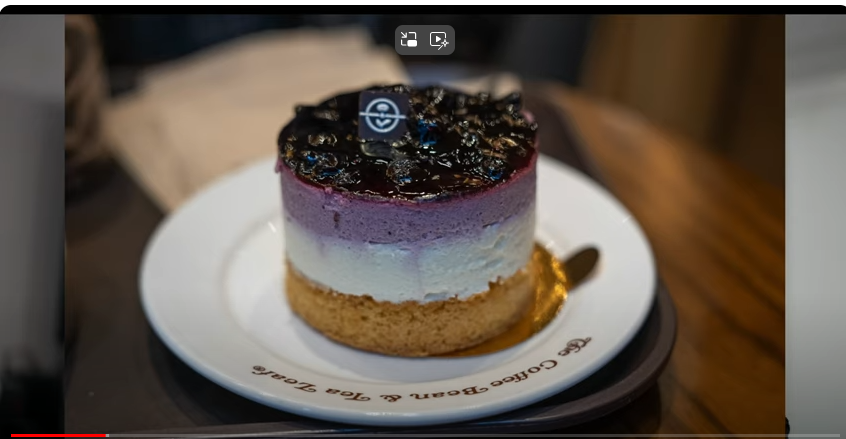

F 1.4로 음식을 찍는 거야? 그럼 음식만, 딱 포커스가 맞고 나머지가 아웃포커싱이 되거든. 너무 예쁘게 사진이 찍히거든요. 그러니까 그런 효과를 주기 위해서도 사람들이 Fast 렌즈를 선호하거든. 근데 잘 생각해보면 구멍을 많이 열어야 되잖아. 근데 밝은 날, 대낮에, 대낮에 여친을 막 그렇게 bokeh 효과를 줘가면서 예쁘게 찍어주고 싶은 거야? 그래서 F 1.4 렌즈를 들고 나가서 찍었네? 

그럼 어떻게 될 것 같아요? 뿌옇게 나오지. 하늘에 태양이 떠 있는데. 그렇잖아요? 그럴 때 어떻게 해야겠어? 그래서 그때 오토로 찍거나 이러면 조리개 값을 작게 못한다고. 이 조리개 우선 모드, Aperture Priority 모드에 놓을 때나 프로그램 모드로 할 때도 그 때나 이 조리개 값을 조절할 수 있지. 강제로 F 값을 굉장히 높인다고. 그러니까 조리개를 줄인다고 카메라가. 오토로 찍거나 프로그램 모드로 찍어도. 아니고 만약에 Aperture Priority 모드로 찍는다 그러면 셔터 값을 엄청나게 조절을 하겠죠. 그래야 광량, 정해진 광량에 맞출 수 있을 테니까. 그래도 내리는 데 한계가 있다고. 아무리 여친이나 음식 사진을 예쁘게 bokeh 효과를 줘가면서, 아웃포커싱 효과를 줘가면서 찍고 싶어도 내려가는 데 한계가 있다고. 조절을 하는데. 카메라에 그걸 의존을 하면 완전히 매뉴얼로 찍지 않는한. 이거보다 오버하면 블론아웃 될 테니까. 너무 과노출이 될 테니까. 아니면 너무 노출이 안 돼서 오히려 어둡게 나오거나. 사진은 무조건 체적의 상황에서 광량을 조절을 해서 카메라는, 그렇게 하려고 애를 쓰는 기기니까. 그걸 무시하는 게 매뉴얼 모드거든요. 그러니까 프로그램 모드까지는 반 auto야. 그런데 이거를 완전히 매뉴얼로 가고 싶다. 완전히 프로 모드로 쓰고 싶다. 이 엑스포저 트라이앵글을 깨는 거지. 내 꼴리는 대로 찍겠다. 카메라 너는 참견하지 마. 내가 너보다 더 잘 알아라고 하려면 그 엑스포저 트라이앵글을 깨고 자기 꼴리는 대로 찍어야 돼. 

그런데 이 엑스포저 트라이앵글에 대한 이해가 거의 만땅이어야 되는 거지. 그래야 제대로 찍을 수 있는 거죠. 그러니까 최대한 이 프로그램 모드에서 나온 결과값, 그거는 유지를 해야 되기 때문에 ISO도 유지를 해야 되고. 광량을 줄여야 돼? 그럼 ISO를 어떻게 해야 되겠어요? ISO 값을? ISO 값을, 민감도를 떨어뜨려야겠지. 셔터도 빨리 닫아야 되고. 그래야 광량이 유지가 될 거잖아요. 어두워? 막 aperture를 이빠이 열고 셔터를 아무리 늘려도 광량이 부족해? 그럼 ISO를 높여야 된다고. 그런데 너무 높이면 노이즈가 심해지는 거니까. 그것도 감안을 해야 되는 거고. 너무 심하다? 그럼 조명을 쏴야 돼. 어쩔 수 없어. 그럼 그런 게 힌트라고요. 너무 어두울 때, 조명이 없는 상태에서 최대한 개방을 하고 조리개를, 조리개를 끝까지 열고, 셔터도 굉장히 느리게 했는데도 광량이 부족해? 그럼 할 수 있는 방법은 ISO 민감도를 높이는 방법밖에 없거든요. 조명을 추가하지 않는다면. F-STOP의 STOP이라는 게 한 STOP을 올린다고 하거든? 그럼 지금의 밝기를 두 배로 올리는 거예요. 조명이 하나가 있다면 F-STOP을 다른 거를 일정하다고 할 때, 다른 건 일정하다고 할 때, F-STOP을 하나를 올린다는 건 조명을 두 배를 설치한다는 거거든. 근데 조명을 아예 설치를 안 할 거야? 아예 설치를 안 할 거고 지금 상황에서 체적의 상황으로 찍고 싶어? 그럼 ISO를 높이는 방법밖에 없어. 그냥 지금 주어진 광량 거기서 조리개 값하고 셔터는 최대한으로 활용을 했어. 그럼 exposure triangle에서 하나 남잖아. ISO. 그것만 높일 수 있다고. 근데 노이즈 레벨이 있다고요. 높일수록 노이즈가 올라가니까 지저분해지니까 내가 어디까지 노이즈를 허용할 수 있느냐? 그걸로 찍는 거라고. 그런데 그 소니 A7S3처럼 sensitivity? 민감한? ISO를 높여도 노이즈를 억제할 수 있는 그런 카메라가 있다? 그럼 굉장히 예쁘게 찍을 수 있는 거지. 어둡게 찍으면서도 그럴듯하게. 

그런 카메라들이 실제로 존재하니까. 그런데 그런 카메라가 아니고 일반 카메라를 써서 어두운 화면을 찍으면 그렇게 노이즈가 심한 겁니다. 그러니까 뭐 런닝맨 같은 데서 예능 프로 있잖아요. 그런 데서 VJ들이 쓰는 카메라? 그런 카메라들은 그런 기능이 없거든. 그래서 막 미궁 같은 데 들어가서, 귀신의 집 이런 데 들어가면 어둡잖아. 그때 그 카메라들을 보면 막 어마무시하게 노이즈가 끼잖아요. 그래서 그러는 거거든요. 

그럼 반대로 너무 밝아? 너무 밝은 상태인데 사진이나 영상을 찍고 싶어? 예쁘게? 그럼 줄여야 되잖아. 최대한. 그럼 ISO는 일단 어떻게 해야 되겠어요? 최대로 낮춰야겠죠? 지금 이 카메라 같은 경우도 최대로 낮출 수 있는 게 100 정도거든요. ISO 100. 기본이 그 정도니까. 그 정도로 낮출 수 있어. 그럼 거기까지 민감도를 낮추는 거야. 그리고 셔터 스피드도 빨라야겠죠? 최대한 빨리 찍어야겠죠? 그럼 이제 모션 블러는 날리는 거야. 무슨 뜻인지 이해되죠? 빨리 찍어야 되니까. 그리고 aperture도 어떻게 해야 되겠어? 조리개도 꽉 조여야겠죠? 태양이 떠 있는 상황이야 지금. 그늘도 없고 그런 상황에서 찍어야 한다면 광량을 최대한 줄여야 될 거 아니야. 너무 밝으니까. 다 지금 줄여야 하는 상황인 거라고요. 그럼 조리개 값도 조리개를 꽉 조여야 될 거 아니야. F/22 막 이 정도로 줄여야 될 거라고. 그럼 벌써 무슨 문제가 생겨? 내가 원하는 효과를 줄 수가 없잖아. 모션 블러 날라가지? 그리고 bokeh 효과 없지. 이걸 조이면 조리개를 조인다는 의미가, 이렇게 조인다는 거거든. 

그럼 멀리까지 보이잖아요. 멀리까지 포커스가 맞아서. 렌즈도 똑같다고. 멀리까지 포커스가 맞으니까 bokeh 효과를 낼 수가 없다고. 제가 지금 이거를, 조리개를 줄이면, 조리개 값을 줄이면 이 카메라를, 얘가 지금 F/1.2 카메라야. 어마무시하게 밝은 렌즈거든요. 진짜 어마무시하게 fast 렌즈라고. 그렇기 때문에 이렇게 배경을 날릴 수 있는 거거든요. 근데 이걸 어떻게 했겠냐고. 여기가 지금 굉장히 밝은데. 어떻게 F/1.2처럼 이렇게 이빠이 열어둘 수 있겠냐고 제가. 그 방법 중에 하나가 Neutral Density Filter라는 걸 쓰는 거야. 먹칠을 하는 거지 앞에. 그걸 이제 ND 필터라고 하거든요. ND 필터 같은 걸 끼우면 ND 필터를 끼우면 어두워지니까, 먹칠한 것처럼. 어두워지니까 조리개를 열 수 있는 거지. 그래서 지금 조리개를 최대로 개방을 한 거거든 이게. 그리고 앞에다가 ND 필터를 끼운 거예요. 

그렇게 광량을 조절하는 거지. 그러니까 Exposure Triangle을 건드리지 않고도 광량을 조절하는 방법. 앞에 ND 필터 같은 걸 끼워서 먹칠을 해주면 어두워질 거잖아. 그렇게 조절할 수도 있다는 거죠. 그게 이 필터를 쓰는 방법이에요. 

얘는 지금 Variable ND 필터라, 제가 이렇게 앞부분에서 돌리면 광량을 조절할 수 있거든요. 살짝 돌려볼게요. 밝아지죠? 어두워지죠? 이게 Variable ND 필터입니다. 그렇게 조절할 수도 있다는 거죠. 외부에 필터를 끼워서. 그럼 장점이, 그걸로 조절을 하면 되니까 Aperture를 최대로 개방을 해서 bokeh 효과를 노릴 수 있는 거지. 그러니까 막 뙤약변 밑에서도 여친의 사진을 예쁘게 찍어줄 수 있는 거야. 배경을 다 날려가면서. 그게 ND 필터의 효과고 ND 필터도 먹칠을 하는 정도? 어두운 정도? 그거에 따라서 뭐 ND 16? ND 64? ND 128? 숫자가 클수록 어두워지는 거죠. 이렇게 조절할 수 있거든요. 

이게 호라이즌이야. 그냥 보면 얘네들이 다 그냥 고가의 렌즈일 뿐이야. 이 2470 있잖아요. 이 녀석이 G-Master 렌즈라는 거거든요. G-Master 급이 아니면 좀 고가의 줌 렌즈가 아니면, 이 줌인 아웃을 할 때마다 조리개 값이 바뀝니다. 저가의 렌즈면. 이러면 돌아버리거든. 그러니까 이 때 조리개 값이 다르고 이 때 조리개 값이 다르고 이 때 조리개 값이 다른 거야. 그러니까 카메라 세팅 값도 다 달라야겠죠. 그 엑스포저 트라이앵글이 틀어지니까. 그러니까 이렇게 찍었을 때랑, 이렇게 찍었을 때는, 다를 거 아니야. 내가 영상을 찍는데 이렇게 줌인 아웃 할 수 있잖아요. 이 때마다 조리개 값이 달라지면 영상 나중에 포스트 처리할 때 그걸 계속 보정을 해줘야 한다거나 그래도 삑사리가 나겠지.

그럼 프로급이 아니지? 프로들이 그런 짓을 할 거 같지 않잖아요. 이걸로 밥 벌어먹고 사는 사람들이 그런 짓을 할 건 아니잖아. 그러니까 거기까지는 호라이즌을 넓힐 수 있어야 되는 거지. 

T값이라는 것도 있어요. 지금 내가 말한 건 F값이고. F값은 약간 프로스모어까지 쓰는 수치라고 생각하실 수 있고 영화계에서 쓰는 거는 F값 이외에도 T값이라는 게 있어요. 그건 이제 절대 광량을 말하거든요. F값은, 렌즈마다 동일한 F값이라고 하더라도 광량이 살짝 틀어질 수 있어요. 상대 값이기 때문에. 그래서 영화계에서 만약에 렌즈를 이렇게 갈아서 쓴다. 이걸 쓰다가 이걸 쓴다. 

그러면 동일한 F값이라도, 동일한 세팅값으로 찍었는데 두 장면이 틀어져 보이는 거야. 그것도 프로가 할 짓이 아니겠지? 밥 벌어먹고 사는 사람들이. 그래서 T값이라는 걸 사용하기 시작합니다. 좀 더 세게 들어가면. 시네마 라인 쪽으로 가면 T값이라는 걸 써요. 

그러니까 이런 렌즈들이 있는데 얘도 저가형 시네렌즈이기 때문에 T값을 안 쓰거든. F값을 쓰거든.

근데 제가 음악실에서 쓰는 거, 런닝맨 강찬희 감독님이 들고 다니시는, 메인 카메라 감독. 그분이 들고 다니시는 FX9. 

거기에 물려있는 렌즈는 T3.1이거든요. 그러니까 광량이 절대값이라고. 

T3.1 렌즈는 다 동일한 거야 광량이. 그렇게 조절할 수 있는 거야. 그럼 프로들은 그걸 지향하겠죠. 물론 방송 정도는 그렇게까지 아닌데 영화를 찍는 분들이다, 봉준호 감독이다, 그러면 T값을 지향하겠지. 

이런 렌즈 보시면 이게 200mm 렌즈거든요. 

이 대포렌즈라고 그러잖아. 라이브 같은 거, 콘서트 같은 거 가서, 방탄소년단 이런 분들 찍을 때 이렇게 당겨서 찍고 싶을 때 일단 줌 렌즈잖아요. 줌 렌즈다? 그 포컬렝스라는 게 포컬 포인트라는 게 생긴다고. 빛이 모아지는 지점. 

그 지점에서 상이 맺히는 지점. 거기까지의 거리를 포컬렝스라고 하는 거거든요. 35mm, 200mm 이게 그런 의미예요. 그래서 밀리미터를 쓰는 거야. 굉장히 짧으니까. 상이 맺힌다는 건 우리가 쓰는 디지털 카메라에서는 어디냐면 센서거든요. 그러니까 빛이 모아진다는 건 렌즈로 빛이 들어와서 이렇게 모일 거 아니야. 그 모이는 지점. 그 지점과 센서의 거리라고. 35mm라면 그게 35mm라는 뜻이야. 그 렝스가. 200mm라면 200mm라는 뜻이고요. 그러면 생각을 해보시면 화각 있잖아요, 화각. Angle of view. 그게 이 포컬렝스가 길수록 작아진다고. 빛이 들어와서 렌즈로 통과를 해서 모이는 게 점점 얇아지니까. 길수록 얇아질 거 아니야. 얘가 클수록 작아지고. 그래서 이렇게 포컬렝스가 짧은 애들 있잖아요? 35mm 이런 애들. 이런 애들이 광각이 되는 거야. 화각이 커지니까. 이런 애들은 화각이 작겠죠, 굉장히. 근데 장점이 뭐냐면 화각이 작을수록 줌인하는 효과가 있다고. 이건 큰 사진을 crop을 해보시면 알아, 잘라보시면. 잘라보시면 작아지잖아. 작아지면서 거기에 담겨있는 사물은 커진다고.

그 뺑기 효과가 생긴다고. 그래서 200mm 렌즈에 비해서 35mm 렌즈나 이런 애들은 엄청난 광각이 되는 거죠. 얘가 f1.8 14거든요. 그 포컬렝스가 14mm야. 얘는 엄청난 진짜 광각이라 어안 효과라고 하거든요. fish eye. 물고기의 눈으로 본 듯한 사각형일 때 이 꼭짓점 부근. 이 부근이 이렇게 휘죠.

거의 그런 식이 되는 거지. 그럼 딱 삘이 오실 게 또 뭐가 있냐면 투시, 제가 그림 얘기하면서 투시 얘기한 적 있잖아. perspective. 그게 원근법이라고 그랬잖아요. 이게 다초점 원근법으로 갈수록 vanishing point가 더 많아질수록 어안 효과틱하게 그렇게 그림을 그리시는 분들이 계시거든. 

김정기 같은 분. 그런 분들이 어안 효과를 내가면서 그리거든요. 그러니까 소실점이 예닐곱개 되는 그림을 그리신다고. 그것도 마찬가지입니다. 그걸 어떻게 그릴 수 있을까. 이런 렌즈의 상식으로 그리는 거야. 근데 그런 분들은 타고난 거고 그걸. 세상을 보는 눈이. 우리 같은 사람은 공부를 해야 되는 거고. 공부를 해도 그렇게 못 그리는 거고. 이게 f2.8 1224 렌즈입니다. 그러니까 포컬렝스 12mm부터 24mm까지 줌 렌즈인 거죠. 줌이라고 하지만 12에서 24까지만 줌인거야. 그리고 특징이 얘는 경통이 안으로 움직이죠. 밖으로 안 나오죠. 아까 2470은 밖으로 나왔는데. 렌즈마다 그런 차이가 있거든요. 그리고 얘도 Gmaster 렌즈이기 때문에, 가변이 아니고 조리개 값이 고정돼 있어요. 조리개 값이 고정돼 있는 줌 렌즈일수록 고급 렌즈고 비싸죠. 

이제 렌즈 다 치우고 올게요. 난 클로져가 필요해. 치우면서 해야 돼. 여러 가지를 느낄 수 있잖아요. 호라이즌을 넓힌다는 게 어떤 의미인지. 그리고 제가 강조하는, 밥 벌어먹는 수준까지 호라이즌을 넓힌다면 어떻게 되는지. 밥 벌어먹는 수준이 아니라면 그냥 2470 아까 줌 렌즈 하나, 그 정도 하나에 일반적인 바디 하나면 충분하거든요. 

그런데 밥 벌어먹을 수준이라면 모션블러 신경 써야 되고. bokeh 신경 써야 되고 이런 정도 돼야 될 거 아니야. 그러면 Exposure Triangle이라는 걸 알아야 되는 거고. ISO Sensitivity 알아야 되는 거고. 그런 걸 조절을 해야 내가 원하는 효과를 낼 수 있으니까 클라이언트가 바라는 효과를 낼 수 있으니까. 여친이 나에게 뒤 배경 다 날리고 찍어줘. 그러면서 뙤약볕 아래에 서 있는 거야. 썬텐을 하고 비키니를 입고 그런 걸 찍어줘야 될 때. 클라이언트가 원하는 걸 포착을 해서 제대로 찍어주려면 ND 필터 개념도 있어야 되고 그러는 거잖아요.

실제로 그런 분들이 프로로 활동을 하시는 거니까. 어디까지 내가 호라이즌을 넓혀야 되는지 알 수 있잖아. 그리고 지금 말씀드린 이런 호라이즌을 늘 머리에 다 담고 있는 건 아니에요. 헷갈릴 수도 있거든. F값 같은 거 있잖아.

이게 한 단계 올라갈 때마다, 광량이 두 배로 늘어나고, 한 단계 내려갈 때마다 2분의 1로 줄어들고. 이 수치인데. 그 수치가 딱 정해져 있거든요. 그런 게 생각이 안 나? 그럼 찾아보면 되는 거야 그런 건. 그리고 그 개념도 헷갈려? 그럼 또 찾아보면 돼. 아까 말씀드렸던 그 linkedin learing 같은 사이트 있잖아요. 그런데 디지털 포토그래피 같은 강좌도 있거든. 그걸 레퍼런스로 활용을 하는 거야. 꼭 머리에 다 담고 있을 필요가 없어. 내가 그 부분을 신경을 안 쓰면서 계속 작업을 해. 예를 들어 모션블러 신경 안 쓰고 계속 이렇게 작업을 해. 아니면 bokeh 신경 안 쓰고 계속 작업을 해. 그럼 가물가물거릴 수 있거든요.

어떻게 해야 그걸 극대화시킬 수 있는지. 그럴 때 레퍼런스를 찾아보는 거야. 얼마 안 걸려. 여러 번 찾아봤을 테니까. 한 번 배웠던 거고. 그러니까 끽해야 하면 10분? 그 정도 걸릴 거 아니야. 20분? 그렇게 투자해서 다시 되새김질하고 그렇게 투입을 하고 그렇게 늘 레퍼런스가 있는 거죠. 늘 나한테는 매뉴얼과 라이브러리가 있다. 그렇게 살아가면 내가 지금 넓히고 있는 호라이즌을 다 머리에 담고 있어야 한다, 항상 24x7 일주일 24시간 1년 365일 이렇게 늘 쓰고 살아야 한다, 그런 강박을 가질 필요가 없는 거지. 즐기면서도 할 수 있는 거고 부담이 없으니까 그런 부담이. 사진이 굉장한 호라이즌이거든요. 일단 과학을 해야 되잖아. 빛의 과학이니까 과학을 해야 될 거 아니에요. 그리고 빛에 대한 이해가 있어야 되고 빛이 어마무시한 거거든. Let there be light. 정말 그런 식으로 세상이 만들어졌다면 빅뱅도 마찬가지지만 처음에 이 세상에 온 게 빛이거든. 그걸 이해하는 거잖아. 광학이라는 게. 어마무시한 거잖아요. 거기서 깨닫는 호라이즌이 어마무시해. 저는 그랬어. 그렇게 생각할 수 있거든. 그럼 거기서 출발을 하면 이어 붙이면 영상인 거고. 그리고 빛의 개념이 있어야 그림도 잘 그릴 수 있고. 그러니까 호라이즌을 넓힐 때 그런 효과를 낼 수 있거든. 폭증 효과를 낼 수 있는 호라이즌이 정말 좋은 호라이즌이잖아요. 처음에 시작할 때 그게 어마무시한 슈퍼셋일 수 있거든. 광학을 공부한다는 게, 빛의 과학을 공부한다는 게. 그 빛의 과학으로 열리는 세상이. 할렐루야! 어마무시하니까. 

제가 오늘로써 오늘인가요? 어저께 밤이었죠? 어저께 밤? 오늘 아침인가? 이제 막 헷갈려. 새벽까지 그림을 그리니까 약간 솔직히 헷갈리는데 빅뱅 프리셋 1에서 그렸던 그림이 62장? 62장이었더라고요. 마지막 그렸던 게 일큐팔사 제 7장을 했었죠. 아오마메. 나비를 깨우지 않게 조용히. 그런 챕터였는데 그걸 그리고 빅뱅 프리셋 1을 갈아엎으면서 빅뱅 프리셋 2로 와서 잠깐 그림을 쉬고 그리고 다시 그리기 시작해서 한 어저께 그린 게 사조영웅전 목염자, 비무초친 하는 걸 그렸죠. 그걸 그린 게 아홉 번째. 그래서 예전 그림들은 cwkd, 드로잉이니까 제가 일러스트레이션이라고 하기에는 좀 민구스럽고 제 실력이. 그래서 드로잉이라고 하는데 드로잉 연습을 하는 거라서. 그걸 예전에는 cwkd 제가 비디오는 cwkv 오디오는 cwka 뭐 이런 식으로 한다고 그랬잖아요. 그래서 이제 그림이니까 cwkd로 했었는데 그걸 이제 빅뱅 프리셋 2로 오면서 뉴를 붙여서, n을 붙여서 하고 있거든요. 그래서 ncwkv 그리고 이건 그림이니까 ncwkd가 된 거죠. 

그래서 0001에서 시작해서 지금 0009가 됐고 처음에는 산회 소로 야청우 그렸고 두 번째 잉즈 샤오지에 그림자 소녀, 그림자 아가씨 그렸고 그건 주크박스에서 영감을 얻어서 그려본 거고. 이제 좀 쉬었으니까 몇 달 쉬었잖아요 그림을. 그러니까 감이 떨어졌을 것 같아서 잘 원래 잘 그리는 건 아니었지만. 그래서 그림을 감을 어느 정도 잃었나 테스트를 해볼 겸 그려본 거였고. 그 다음에 영감을 좀 더 얻기 위해서 요즘 관심을 갖게 된 사조영웅전, 그걸 조금 그리고 있고. 사조영웅전이라는 소설 있잖아요. 김용 소설 그 3부작 중에 하나 사조영웅전, 신조협려, 의천도룡기 이걸 이제 읽으려고 하거든. 근데 그냥 읽는 거 보다는 영감이 떠오르거나 상상을 해보거나 아님 눈으로 보거나 이런 걸 이제 옮겨보면 연습을 해가면서, 제가 1984 그렇게 했듯이. 그렇게 읽을 수 있으니까 처음 읽는 거고. 그래서 그렇게 해보려고. 그런데 이제 눈으로 보는 게 훨씬 더 좋으니까. 영감을 얻기에 장단점이 있는데 제 경험상으로는 소설로만 읽으면 상상의 나래를 펼 수 있잖아요. 근데 이걸 이제 영화나 드라마로 보면 거기에 꽂힌다고. 과거에도 조금 시도는 해봤지만 이렇게 본격적으로 한 거는 최근에 한 거, 이게 제일 세게 한 거니까, 빡세게 한 거니까 이거를 따지면 한 7, 8개월 한 거 같아요. 그중에 2개월 정도는 쉬었으니까. 6개월 정도 반 년 정도, 반 년 정도 한 거, 지난 빅뱅 프리셋 1에서도 보여드렸잖아 발전하는 단계를. 제 나름대로 느낄 때. 여러분들이 보는 거랑 제가 보는 거랑 또 다를 수 있어요. 저는 발전하는 단계를 알고 있잖아요. 어떻게 발전을 했는지 그러니까 그 단계를 봤을 때 그래도 '우상향을 하는구나' 이게 제일 중요하거든. 우상향을 하는구나. 박스권 시기가 반드시 있어. 어떤 공부든 이렇게 날아가진 않으니까. 박스권이 있거든요. 그러면서 계단식으로 상승을 하는 거죠. 계단식으로 운동도 마찬가지잖아 plateau라는 게 생기는 이유잖아요. 막 근육이 불어나고 되는 듯 싶다가 몇 개월 동안 하나도 안 불어나거든, 현상 유지만 되거든. 근데 잘 생각해보면 현상 유지가 굉장히 좋은 거야. 현상 유지가 된다는 거잖아 안 하잖아? 떨어져. 현상 유지조차 안 되는 거죠. 현상 유지를 하다가 한 단계 업그레이드. 현상 유지를 하다가 한 단계 업그레이드 그러거든요. 

자전거 타보신 분들 아시겠지만 자전거를 처음 배우면 막 넘어지고 자빠지고 그러잖아. 근데 일단 안 자빠지는 수준까지 올리잖아? 그러면 막 1년 2년 쉬었다가도 이상하게 안 자빠지거든요. 근데 느낌은 불안해. 이제는 자빠질 거 같은데 너무 오래 안 해서? 근데 안 자빠져 신기하게. 약간의 머슬메모리가 된 거지 처음엔 어색할 수 있는데 금방 회복한다는 거죠. 자기가 plateau 단계에 이르렀던 수준까지는. 그건 외국어도 마찬가지라고 그랬잖아. 외국어를 어느 수준까지 하다가 관두더라도 어느 수준까지는 허벅지를 막 찔러가면서도 해야 되느냐? 그 plateau 단계. 나중에 안 하다가 다시 돌아와도, 조금 워밍업 하면은 다시 회복할 수 있는 그 단계. 그 레벨 거기까지는 해야 된다는 거지. 그러니까 최소한 3개월, 이 정도는 빡세게 해야 아니면 1년 정도는 빡세게 해서 문법책을 처음부터 다시 보지 않는, 처음부터 다시 다 해야 되지 않는,한 번 정도 이렇게 쭉 훑어보면, 반나절 정도 쭉 훑어보면 대충 눈치 깔 수 있는, 그 정도 수준까지는 해야 된다는 거죠. 단어를 외우는 수준이 아니고, 그냥 문장 구조를 봤을 때 그래도 눈치를 깔 수 있는 수준. 거기까지는 반나절 정도 워밍업을 하면 녹을 털어내면, 될 수 있는 데까지. 거기까지는 외국어를 해야 되는 거거든. 지난 영상에서 제가 아마 기타를 쳤을 거예요. 건강검진 얘기를 하면서. 그 솔로가 Master of Puppets 솔로라고 그랬잖아요. 그거 한 20몇 년 쳤다니까 한 30년 쳤나.

근데 까먹어. 까먹습니다 분명히. 박자도 까먹고, 늘 틀리는 부분 또 틀리고. 그걸 고쳐놔도 틀리는 게 장기평균이었으면 안 틀리는 게 단기평균이거든. 그래서 그 시기에는 다시 칠 수 있을지 몰라도, 제대로 칠 수 있을지 몰라도. 오래 안 치다가 치면 틀리게 친 그 장기평균이 돌아오기 때문에, 오래 안 치다가 치면 삑사리를 내거든요. 제가 지난 영상에서도 그렇게 삑사리를 냈을 거야. 수정을 해서 다시 쳤다고 해도, 올바르게 친 평균이, 잘못 친 평균을 이기지 못하기 때문에. 그런데도 예전에 쳤던 감이 있으니까. 대충 한두 번 쳐보면 삘이 오거든요. 전체적인 그림은 그래도 들으면 '아 저거 Master of Puppets 몇 번째 솔로다' 'james hetfield의 솔로다'라는 걸 알 수 있을 정도로는 치거든. 근데 급하게 수정한 건 나중에 몇 년 있다가 보면 사라져. 그 효과는. 급하게 수정을 한 건. 급하게 뭔가 배워서 꼼수로 배운 거. 그림도 그렇거든요. 제가 최근에 배운 꼼수들 몇 개가 있거든. 그런 거를 빅뱅 프리셋 1 할 때 마지막에서 이제 막 써먹었거든? 좀 잘 그리는 듯한 그런 뺑기를 치고. 그래서 그걸 잘 그렸다고 생각하시는 분들도 계셨고. 근데 그게 두 달 석 달 지나니까 까먹는 거야. 어떻게 했는지 기억이 안 나.

왜냐면 그건 정공법이 아니거든 내가 오래 해온 6개월 정도 했던 그 정공법이 아니고 그냥 꼼수를 몇 개 배운 거거든. 급하게 시술을 하는, 원래 바탕이 그게 아닌데. 그런 걸 했기 때문에 약간의 비주얼적인 요리를 만들었는데. 비주얼적인 포인트를 좀 준 거지. 전체적인 맛이 좋아진 건 아니었더라는 거죠. 

또 3D 공부를 하고 있. 데 이번 프로젝트는 아시나? 아시는 분만 아시겠죠? 관심 있는 분만? 얘 하기로 했잖아. 얘 얘 

빠밤 빠밤 빠밤. 얘를 하기로 했는데, 얘를 켜야 되는데 안 켰다. 역시 뭔가 뻘짓을 해. sculpting하면 근육돌부터 벌써 헷갈리는 것들이 있거든. 까먹은 것들이. 기타도 벌써 까먹어요. 얼마 안 됐는데. 그러니까 계속 접시돌리기를 해야 하거든. 그래서 기록을 남기는 건데. 이번에는 제가 고민하는 과정이나 이런 것까지 좀 기록을 남기는 게 어떨까, 다큐멘터리틱하게? 3D에는 관심이 없었. 고 하더라도. 관심을 가져볼 만해요. 왜냐면 모르는 영역이잖아. 모르는 영역이니까, '자꾸 나랑 관련이 없는 분야겠지'라고 생각을 하기 쉽상이거든? 근데 어렸을 때 그런 습관이 들면 안 되니까 어렸을 땐 진짜 마구 두들겨 봐야 되니까. 

아 전 한번 공지해드렸습니다만, 이제 여러분들 인생에 참견할 생각이 없어? 알아서들 사시는 거야? 인생에 참견하겠다는 게 아니고 그냥 지식적인 관점에서 조언을 해드리는 것 뿐이야. 더 이상 인생에 참견할 생각은 없습니다. 3D 세상을 공부하는. 게 저한테 어떻게 도움이 됐는지, 그런 거나 다큐멘터리틱하게 남겨보겠다는 거야. 특히 이제 내 연배쯤 되시는 분들보다는 좀 어린 친구들? 

이걸 2D 이미지나 이런 건 많거든요 레퍼런스 자료가 근데 얘를 이렇게 보는 거랑은 전혀 다릅니다. 내가 만져보면서 3D로 이렇게 보는 . 랑 전혀 다르기 때문에, 그래서 이렇게 보면서 만들고 싶었던 거거든요. 이렇게 보면서 가까이 보면서 '얘 이렇게 생겼구나' '피스톤이 이렇게 움직이는구나' 이렇게 하고 싶어서, 그거를 제가 원하는 수준까지 갈 수 있을까. 지금 생각하면 황당한 정도의 난이도니까요. 이건 거의 끝판왕급 난이도입니다. 이 정도면 프로의 프로, 프로, 팔아먹어도 이런 걸 만약에 잘 만들었다? 팔아먹어도 꽤 오래 돈을 벌 수 있는. 거기다 혹시라도 rigging까지 했다? 그래서 이 터미네이터 T800이 움직인다? 자기가 만든 게? 그걸 마켓에 내다 판다? 이러면 뭐 그냥 짭짤하게 벌 수도 있는, 그런 정도까지 가. 그렇게까지는 제가 꿈을 꾸면 안 되고. 초짜 주제에. 이게 난이도가 높은 이유가 있거든요. 헤드 하나만 만약에 모델링을 하더라도 진짜 5만 가지 방법이 있어요. 제가 모르는 방법도 있을 거고. 그냥 이걸 랩을 씌우듯이 그렇게 그냥 면을 하나하나 한 땀 한 땀 따서 그렇게 돌아가면서 만들 수도 있고, 아니면 기본적으로 이걸 sculpting을 해서 제가 만약에 조형을 잘한다면 sculpting을 해서 그 위에다가 다시 리토폴로지를 하든가. 랩을 씌우듯이 또 면을 하나하나 따든가. 그렇게 할 수도 있고, sculpting 과정을 생략하고 처음부터 그냥 딸 수도 있고, 아예 깎아 나갈 수도 있거든요 그냥. sculpting이라는 게 진흙을 만지는 과정이라고 생각할 수도 있지만, 나무나 대리석 같은 걸 깎는 과정일 수도 있잖아. 여러 가지 방법이 있잖아 조각도. 그렇게 해 나갈 수도 있는 거거든요. 그런데 이게 유기적인 형태냐 곡선이 많고 애매하고 기울기도 애매하고, 이런 형태냐 아니면 제가 만들었던 자동차 같은, 사이버 트럭 같은 그런 각진 형태가 많고, 딱딱한 형태 그래서 하드 surface 모델링이라고 얘기를 하는 거거든요.

하드 surface 모델링을 하느냐 그 차인데. 하드 surface 모델링은 약간 산수적이라, 직선이 많잖아. 곡선보다는. bevel이라고 해서 곡선이 안 들어가고 그냥 각진 것처럼 보이는데도 줌인을 해서 들어가면 살짝 bevel이라는 곡선이 있거든요. 그 부분을 만들어야 이렇게 너무 각지지 않게 돼야, 책상을 여러분들이 만져보시더라도 모서리 부분을 보면 약간 곡선져 있잖아. 그걸 bevel이라고 하거든 그런 거를 만드는, 뭐 그 정도 들어가는 거죠. 하드 surface 모델링을 한다면. 그런데 그냥 하드 surface 모델링이라고 하더라도, 경계가 애매해져. 용 같은 크리쳐를 만든다고 하면 하드 surface 모델링은 아니잖아. 생명체를 만드는 거잖아. 그러니까 만져봐도 딱딱, 쇳덩이처럼 딱딱하진 않을 거 아니에요.

플라스틱이나 이런 것처럼, 그걸 또 경계가 애매하니까, organic 하드 surface 모델링 이런 말도 쓰거든요. 그런데 이런 애는 어떠냐는 거야. 보기에 하드 서피스야. 당연히 터미네이터니까. 그런데 인간을 닮았잖아. 그래서 곡선이 참 많습니다. 곡선이 많으니까 헷갈려. 이걸 어떻게 만들어야 되는지. 하드 서피스 모델링 기법으로 approach를 하느냐, 그렇게 접근을 하느냐, 그러니까 이런 걸 보면 organice하게 접근할 수 있는, 좀 유기적으로 생각할 수 있는, 그렇게 접근을 할 수도 있는데. 얘 자체는 하드 서피스거든요. 

고민을 하는 첫 번째 이유가 뭐냐면, 습관이 잘못 들어있거든, 잘못 들어있다기보단 그게 생존 모드니까. 이 세상은 3D인데 내 눈은 해. 을 할 때는, 2D로 봐야 하니까. 이 정보를 해석을 할 때. 그걸 어거지로 우겨넣는 거거든요. 눈이. 눈 구조가. 그리고 눈이 또 동그랗잖아요. 여러 가지 이유로 원근법이 생기는 이유, 왜곡이 생기는 이유. 그런 이유. 렌즈 같은 데서 왜곡이 생기는 이유. 그런 건 예전에도 한번 말씀을 드렸었는데. 얘가 이렇게 보기에, 여러분들 이렇게 보시면

언뜻 보기에 얘를 제대로 정면으로 보는 거 같잖아요. 정면으로 이렇게 보면 이렇게 안 생겼어. 이게 멀어질 때랑 이렇게 보면 얘가 이 부분이 이 턱 부분만 해도, V자 턱 있잖아요. V자 턱 같은 게 사실은 V자가 아니거든. 이렇게 살짝 늘어나 있거든요. 그게 Orthographic이라고 합니다. 원근법을 제거하고 그냥 보면, 투시를 제거하고 보면, 사람이 좀 예쁘지 않게 보여. 이게 투시가 적용된 얼굴이거든요. 제 얼굴만 해도. 근데 사실은 투시가 적용이 안 된다면, 원근법이 적용이 안된다면, 턱이 여기서 시작하니까 얘가 좀 뒤로 나와 있잖아. 뒤쪽으로, Depth가 생기잖아. X, Y 좌표뿐만 아니고 Z 좌표, Z 좌표가 있어야 되니까 Depth가 생긴다고. 깊이감이 생긴다고요. 그 깊이감이 얘하고 얘는 다르잖아 Z 값이. 정면에서 봤을 때. 만약에 얘가 0이라면 얘는 마이너스 값이겠죠. Z 값이. 그걸 신경을 써야 된다고. 그걸 신경을 안 쓰면 얘하고 얘하고 똑같다, 그 생각을 하면 이게 원근법에 적용이 안 되는 거죠. 그럼 당연히 얘하고 얘하고 그 원근법에 따라서 살짝 곡선이 있었는데 이거를 그냥 튀어나오게 만들면 이걸 펼쳐야 될 거 아니야. 그렇게 보인다는 거예요. 

그걸 잠깐 이 Blender에서 보여드리면, 투시가 적용이 되어 있잖아. 이 Grid인데, 격자 무늬로 되어 있는데 

앞쪽에 있는 네모칸이 뒤로 갈수록 Depth가 생길수록 멀어질수록 이쪽이 Vanishing Point죠 소실점이라고 하는 거, 멀어질수록 작아지잖아 마치 도로처럼. 도로를 하나 만들어 볼까요. 추석 귀성길 간단하게 그냥 Plane, 판떼기를 하나 깔아주면 딱 봐도 앞에 있는 게 커보이고 뒤로 가면서 작아지는 구조잖아요.

그러니까 이걸 크기를 늘려보면 부산으로 이렇게 달려간다고 이렇게. 부산으로 쭉 달려간다고 부산으로 달려갈수록 작아지잖아요. 이건 이해하시겠죠. 딱 봐도 이쪽이 서울 쪽이고, 저쪽으로 갈수록 부산이다. 경부선이 이렇게 달린다면 이 구조로 되어 있을 거라고요. 근데 이걸 위에서 내려다보잖아? 위에서 내려다보면 크기가 똑같아.

경부선은 도로 폭이 똑같다고요. 이걸 투시 원근법을 적용해서 보면 작아지잖아요. 작아지는 거예요 부산으로 갈수록. 근데 이것도 Orthographic하게 보면, 영어로 Orthographic하다고 하는데. Orthographic하게 보면 똑같죠. 투시가 적용이 안 되니까. 투시를 적용 안 하고 보면 서울에서 부산까지 크기가 똑같아야 한다고요. 근데 이걸 투시를 적용하고 보면 당연히 갈수록 작아지는 거고. 이건 Vanishing Point 생각하시면 되죠. 앞에 있는 격자가 작잖아요 이걸 Orthographic하게 보면, 원근법을 적용을 안 하면, 똑같이 생겼고 방향성만 있는 거죠. 깊이가 없고. 이 개념을 생각하시면 돼요. 건물을 생각하셔도, 큐브 하나 집어넣으면 얘가 지금 이렇게 높이가 있다면 빌딩, 63빌딩 같은 거 생각할 수 있잖아요. 63빌딩 같은 거 생각할 수 있는데, 얘도 마찬가지죠.

앞면이, 지금 face 모드를 보면 앞면이 뒷면보다, 앞면하고 뒷면하고 같아야 되거든 크기가? 근데 딱 봐도, 이렇게 보면 같아 보이지만, 각도를 틀수록 얘가 더 커 보이겠죠. 전면이 후면보다. 그게 원근법이 적용돼서 그러는 거라고요. 이게 건물이나 도로를 보면, 아니면 가로수를 보면 이해하기 쉽거든요. 근데 언뜻 보기에 사람이잖아 이게? 그럼 그렇게 생각 안 할 수가 있어. 가볍게 생각하면. 뭐 간단하게 보는데, 사람 얼굴이 원근법이 적용이 될까? 적용이 되거든요 실제로. 적용이 되는 걸 보여드릴게. 일단은 제가 만든 레퍼런스 이미지를 보면, 레퍼런스 이미지를 보면 얘가 투시가 적용이 안 된 레퍼런스 이미지거든요. 

정면 이미지, 레퍼런스 이미지가 투시가 적용이 안 된 건데, 언뜻 보기에 이상하게 보이실 거예요. 좀 넙데데하고 떡판? 이런 식으로 보이실 텐데 이걸 투시를 적용해서 만든 게 이거라고.

투시를 적용하고 만들면. 좀 곡선지고, 이렇게 V자형으로 턱이 보이고. 이쪽 관자놀이에서 이렇게 뒤로 돌아가는 광대 활 부근도 이렇게 돌아가는 걸로 보이죠. 근데 얘를 orthographic하게 보면 이렇게 보인다고요. 이게 왜 문제가 되냐면, 얘를 원근을 적용을 해서 그렇게 생각을 하잖아? 그럼 이 원근을 적용을 하고 모델링을 한다고. 그렇게 하면 안 되거든. 의식적으로 원근이 적용이 안 된 얼굴을 생각을 해야 되거든요. 넙데데하게 보이는 얼굴. 그거를 원근법을 적용해 주는 건 블렌더 같은 3D 프로그램이 해주.  거지, 내가 하는 게 아니야. 근데 그 원근법을 적용해야 될 때는 언제냐? 이런 모형을 2D로 그릴 때.

평면적으로 그릴 때 그림 그리시는 일러스트레이션을 하시거나, 만화를 그리는 분들이 그렇게 하셔야 되는 거죠. 3D를 모델링할 때는. orthographic하게, 원근법을 적용을 안 하고 그려야 하기 때문에, 레퍼런스 자료를 구하기도 힘들거든요. 이런 자료는. 어디서 모델링을 한 거를 렌더링을 다시 하지 않는 이상 orthographic하게. 예를 들어서 렌즈 있잖아요 렌즈. 렌즈를 하나 보여드릴게요. 카메라를 하나 추가를 해서, 카메라를 하나 추가하고 거기에 큐브 같은 거 하나를 봐도, 얘를 볼 때, orthographic하게 볼 수 있거든요. 이렇게 바꾸면 투시 원근법이 적용이 돼서 보이죠. 

그런데 orthographic하게 바꾸면, 원근법이 적용이 안 돼서 보이는 거죠. 3D 모델링을 할 때. 뭐 연예인을 모델링을 한다, 이쁜 사람을 모델링을 한다, 그런 사람을 모델링을 한다 할 때도 대부분은 정면을 보는 사진을 찍었다고 해도 프로필 사진 같은 걸 찍거나, 정면 보는 사진을 찍거나 반측면 보는 사진을 찍거나, 얼짱 각도로 찍거나, 다 어떻게 찍는다? 예쁘게 원근법을 적용을 해서 제일 예쁘게 보이는 각도로 찍거든. 그게 문제인 거죠. 그러니까 카메라를 봤을 때 이렇게 사진을 찍는다고 생각을 해볼게요. 영상을 찍든 사진을 찍든 이렇게 찍을 때, 얘가 지금 50mm 렌즈로 찍는 거거든요 이렇게 하면?

인간의 눈이 50에서 55mm 뭐 이 정도니까, 사람이 앞에서 찍는 것처럼 증명사진을 찍듯이. 그런데 이제 사진을 찍을 때도 그 원근법이 얼마나 적용되느냐는 이런 것 때문에 그러거든요. 광각으로 찍느냐,

24mm

50mm

85mm

200mm

그렇게 망원으로 줌인을 해서 만약에 찍는다면, 원근법이 좀 덜 적용이 되겠죠. 그러니까 증명사진을 찍거나 이럴 때 원근법을 덜 적용하고 싶다? 그럼 원근법이 덜 적용이 될 테니까, 그런 식으로 생각해 볼 수 있는 거죠. 이 렌즈에 따라서도 다르고.

그러니까 레퍼런스를 생각할 때, 그런 레퍼런스를 구하지 못한다 그러면 내 시각을 좀 바꿔야 하는 거지. 좀 와닿는 예를 들어드리면, 이 친구가 그 파이널 판타지 7 리메이크에 나오는 티파 라칼트라는 친구인데, 이 친구 얼굴을 보면 예쁘게 생겼잖아요.

모르는 분이 보시더라도. 그런데 이게 원근법이 적용된 얼짱 각도거든? 정면에서 본다고 해도 마찬가지예요. 정면에서 봐도 이게 언뜻 정면에서 보는 것 같지만 여전히 원근법이 적용되어 있습니다. 렌즈에 따라서도 다르고. 그러니까 이거를 만약에 적용을 안 하고, 정면에서 볼게요. 원근법을 적용을 안 하고 이렇게 생겼거든요. 딱 보시기에도 좀 넙데데해지잖아. 이 턱 라인이, v라인이 depth가 사라지니까, 깊이감이 사라지니까. 넙데데해 보이죠. 예전에 우리 이걸 좀 떡판 얼굴이라고 그랬는데, 안 좋게 표현했었는데 그렇게 보이기 시작하거든요. 원근법을 적용을 해야 되는 거니까. 2D 그림을 그릴 때는 상관이 없는데, 원근법을 자연스럽게 적용을 하는 게 오히려 좋은 건데, 3D를 만들 때는 이. 얼굴로 조형을 해야 되는 거지.

원근법을 적용을 안 하고. 만약에 원근법을 적용을 해서 조형을 하면, 그러니까 이 얼굴에다 조형을 하면 

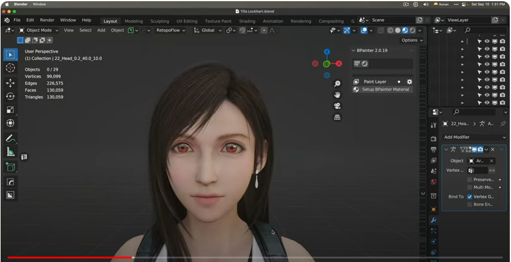

이걸 레퍼런스 이미지로 구해서 적용을 하면 이 녀석도 마찬가지죠.

이걸 보고, 이렇게 투시를 지금 이 상태에서도 투시가 적용되는 거거든요 제가 볼 때, 이렇게 볼 때. 의식적으로 투시를 풀어야 되는 거지. 약간 넙데데하게 생각을 해야 되는 거지. 안 그러고 이걸 그대로 조형을 하면, 원근법이 적용된 상태로 투시가 적용된 상태로 조형을 하면 어떻게 되느냐? 블렌더가 나중에 렌더링을 하거나 아니면 그 렌더링한 결과물을 보시는 분들이 또 투시를 적용을 하니까, 투시가 두 번 적용되는 거죠 원근법이. 그래서 이상하게 보일 수밖에 없는 거죠. 그러니까 이 친구를 만약에 조형을 한다면 이 모습으로 조형하면 안 되는 거지. 여기로 가서.

예를 들어서 Mesh를 가주고 

조형을 하고 싶으면 얼굴로 가서 여기에 맞추는데, 얼굴 크기 같은 걸 신경을 쓸 거 아니에요 이렇게.

레퍼런스 이미지를 보고 한다면, 크기를 맞출 때도 벌써, 크기를 맞출 때도 이 넙데데한 얼굴에 맞추게 되잖아 이렇게.

그렇게 되거든. 근데 이거를 투시를 적용을 한 상태로, 원근법 상태로 보면, 넙데데하지 않은 얼굴에 맞추게 되니까 이상하게 보이는 거죠. 넙데데하게 투시가 원근법이 적용되지 않은 상태로 봐야, 얼굴 형태가 오히려 맞는 거지. 그러니까 얘를 sculpting을 한다고 해도 마찬가지죠. sculpting을 한다고 해도, sculpting을 해도, 이렇게 얼굴 형태를 맞추게 되거든요.

그래야 얼굴 형태가 제대로 맞춰지는 거거든. 원근법을 적용을 하면, 이렇게 적용을 하고 하면 안 맞아 있어 왠지. 그러니까 막 집어넣는 거지. 근데 원근법을 생각을 하면, 내 눈으로 착시현상이 일어나는 걸 의식적으로 어떻게 맞춰보겠다고 하면, 자꾸 라인을 이렇게 맞추려고 하고. 그러다 보니까 이상해지기 시작하는 거죠. 그나마 이건 3D 프로그램이니까 . 충 이렇게 맞아 떨어지거든요, 면에다가 이렇게 맞춰서 하면. 근데 의식을 할 때, 내가 이걸 인지를 할 때, 잘못 인지를 하면, 원근법을 두 번 적용하는 오류를 범하게 된다는 거지. 그러니까 티파는 이렇게 볼 때가 예쁜 거야. 이렇게 볼 때가 예쁜데, 실제로는 지금 우리가 생각하는 얼짱 각도잖아요. 이 각도에서 이렇게 생긴 거죠 실제로는.

원근법이 적용이 안 되면, 굉장히 넙데데하게 보입니다. 이게 우리가 아는 티파의 얼굴이고.

실제 얼굴은 이렇게 생겼다고.

그리고 다시 T-800으로 돌아가 보면, 제가 스컬의 외형을 잡을 때 기본적으로 이 녀석,

원근법이 적용된 레퍼런스 이미지의 외형을 잡는 게 아니고, 적용이 안 된 스컬 이미지,

거기에다 외형을 잡아야 되는 거죠. 이건 지금 평면적으로 보는 거니까, 원근법이 적용이 안 된 형태로. 그래서 여기다가 만약에 메쉬를 집어넣어서 대충 생각해 볼게요. 이걸 만든다면 scuplt 모드로 가서 이 형태를 이렇게 잡아야 되는 거죠.

remesh를 좀 해주고. 해상도를 좀 높인 겁니다. 대충만 지금 하겠다는 건 아니니까. 이런 식으로 형태를 맞추고 그리고 옆면에 가서도 두상을 이렇게 맞추고. 원근법이 적용된 형태로 봐도 스컬의 형태가 만들어지는 거죠.

그런데 이 녀석의 또 큰 문제가 곡선이 많거든요. 유기적으로 곡선이 그러니까. 또 하나 착시가 벌어질 수 있는 게, 얘는 곡선이 많은 유기적으로 생긴 인간과 비슷한 그런 형태일 거다 라고 하면, 너무 디테일에 신경을 쓰는 오류를 범하는 거거든. 두 번째 오류거든요 이게. 모델링을 할 때. 저도 자꾸 빠지는 오류인데, 의식적이지 않으면 자꾸 그런 오류에 빠져. 왜 그러냐면 이 세상에 동그라미가 없거든? 동그라미? 더 자세하게 얘기를 하면 곡선이 없습니다. 진짜 곡선은 존재하지 않거든. 그게 어떤 의미냐면 아인이도 이건 잘 이해를 해야 되는데, 음.. 아인이가 초등학생이죠. 초등학생이니까, 제가 어디까지 배우는지 모르겠거든요. 저도 산수흫 잘하는 건 아니니까. 그러니까 일단 원을 하나 볼게요. 원을 하나 보고 얘기를 하면 이해가 쉬울 거야. 원을 보고 위에서 내려다볼게요. 보면 언뜻 보기에 원으로 보이지만, 약간 각져있는 부분들이 보이잖아요. 이게 폴리건이니까 각져있다고. 그럼 이거 이해하기 쉽게 생각해볼게. 32개의 Vertices로 만들어져 있거든요.

꼭지점 32개, Connect the dots를 해서 그 점을 연결을 해서 지금 원 형태를 만든 거거든. 영어로 Vertex가 꼭지점에 해당하고요. 점에 해당하고 점 하나 찍는 거예요. 다트에 해당하고 그걸 복수로 만들면 Vertices가 됩니다. 이게 좀 특이한 형태라 시험문제에도 잘 나오고. 그리고 점 두 개를 이으면 변이 되잖아요. 선이라고 하잖아요 우리는 흔히. 산수적으로는 Edge라고 합니다. 그리고 점을 세 개 이상 찍으면 삼각형이 되거나 사각형이 되거나 오각형이 될 수 있잖아? 그럴 땐 그걸 Face면이라고 하거든요. 이 3D 세상에선 그게 . 장히 중요하기 때문에 Vertex, Edge, Face 그러니까 지금 이건 32개의 Vertex로 만들어진 원인 거죠. 근데 이거를 만약에 8개로 바꾸면 팔각형이 되잖아요.

점점 Vertex가 많아질수록 원에 가까워지는 것일 뿐이야. 8개는 뭐라고요? Octagon이라고 하잖아요. UFC Fight 격투기, Octagon 같은 데서 하잖아 막 그럴듯하게. 그거 Octagon이잖아. 그리고 아인이가 기억할지 모르겠어. Pentagon, 미국 국방성, 국방성 건물이 항공사진으로 찍으면 하늘에서 내려다보면 오각형이라고 했잖아. 그러니까 Pentagon이거든요. 이걸 삼각형으로 만들면 삼각형 만들 수 있어 Triangle이 되잖아. 지금 아까 원으로 만들었는데 꼭짓점을 줄일수록 이렇게, 원이랑 거리가 멀어지는 거야. 그럼 정말 동그라미는 존재하는 걸까? 그 생각을 해보자는 거야. 2개는 못 만듭니다. 언뜻 생각해도 2개는 edge니까, 면이 만들어지려면 3개 이상이어야 되니까. 그러니까 아까 32개가 기본이고요. 줌아웃을 해서 보면 멀리서 보면 원에 가깝게 보여요. 

원에서 가깝게 보이는데 줌인을 할수록 각wu 보이는 게 보이거든 보이죠? 근데 이렇게 줌인을 하더라도 128개로 누르면 좀 더 원에 가까워지고 뭐 512개? 이 정도면 완전히 원에 가깝게 보이죠. 아무리 줌인을 해 들어가도? 그러나 우리는 알고 있죠 이게 아무리 많아지더라도 직선의 연결이다, 그걸 알게 돼요. 직선의 연결이다. 그러니까 32개쯤으로 봤을 때 이제 내려가서 봅시다. 확실히 봤으니까. Vertex 모드라는 게 있거든요. 꼭짓점이 보이는 모드, Edit 모드에서 여기서 보면 점들이 보여 32개의 점이. 점들을 이렇게 연결한 거네? 누가 봐도. 그래서 이 꼭짓점을 움직이면, 원에서 벗어나기 시작하죠.

그럼 이게 과연 원이냐는 거야. 동그라미니냐는 거야. 동그라미가 아니잖아. 여기서 중요한 개념이 생깁니다. 수학적인, 산수적인 명제라고 했잖아요. 아인아 이거 산수적인 명제야. 점 두 개를 연결한다, 그 점 두 개를 관통하는 선을 긋는다, 그럼 무슨 선이다? 직선이다. 이게 산수적인 명제입니다. 그럴 수밖에 없잖아. 이건 산수를 아무리 안 한 사람이라도 이해할 수 있잖아요. 점을 두 개를 이었어. 그걸 관통하는 선을 그어 이렇게. edge 모드에서 보면 돼요. edge 모드로 그으면 이건 직선이라고. 빼박으로. 그죠? 점을 두 개를 만들고 그 두 점을 관통하는, 중심을 관통하는, 선을 그으면 직선이다. 빼박이라고요. 이거 언제 쓰냐면 기울기 구할 때 씁니다. 기울기. 여러분들은 기울기를 왜 구했는지 이해하시나? 이거 설명해주는 선생님이 없었거든 저는? 불행하게도. 그래서 나중에 이제 굉장히 나이를 먹어서나 그런 걸 설명해주는 선생님을 만나서, 외국인 선생님, 외국인 선생님이죠. 그런 데서 강의에서 보고 유레카를 했는데, 기울기를 왜 구할까요? 기울기를. 기울기 기본을 생각을 해볼게. 잠깐 원을 지우고. 이게 점이거든요. 점 하나가 남습니다. 이렇게 세상 만물은 입자로 만들 수 있잖아요. 양자역학적으로도. 그건 누구라도 생각할 수 있는 거잖아. 원소들로 만들어져 있으니까 세상 만물이. 구성 비율만 다른 거잖아요? 그러니까 세상 만물은 점으로 만들 수 있어. 점을 이어 나가면 되거든. 내가 지금 점을 만들어 놓은 거거든요.

점점점 점이 보입니다. 얘를 이렇게 만들면 직선이 되잖아요. 점을 하나를 복사를 해서, 움직인 거거든. 내가 원하는 방향으로. 그렇잖아요? 이거를 하나를 더 빼서 이렇게 하고 이으면 삼각형이 만들어지는 뭐 그런 구조입니다.

아까 이 삼각형이 원이 되는 걸 봤잖아? 꼭지점 수가 늘어나면 되잖아. 그렇죠? 그런데 기울기라는 걸 생각을 해보자고. 기울기를 왜 만드는지. 그걸 아무도 설명을 안 해줬어. 선생님들이 지금은 설명해 주실 거야 설마. 각이 딱딱 맞진 않아요. 그냥 개념만 생각을 해 보자고. X축이 있고 Y축이 있다고 이렇게. 여기가 X축입니다 여기가 Y축이고.

그렇게 생각을 했을 때, 얘가 값이 변할 때 Y는 얼마나 변할까? 이게 기울기잖아요. 그걸 이제 좀 있어 보이는 말로 하면, 델타 X분의 델타 Y라는 거잖아요. 델타 X분의 델타 Y. 그러니까 X가 3 변했어. 그랬을 때 Y도 3이 변해. 그러면 3분의 3이니까, 1이네. 이거잖아요. 이랬을 때 우리는 어떻게 한다? 직선을 쫙 긋는데 45도 각도로 긋죠. 이게 가장 기본입니다 기울기의. 직선으로 45도를 그으면, 얘가 X값이 변하는 거에 따라서 같은 값으로 Y값이 변하니까. 그런데 이게 만약에 기울기가 달라진다? 그러면 X값에 따라서 Y값을 추정하는 게 좀 달라져야 하니까. 그걸 이제 회귀분석이라고 통계에서 얘기를 하는 거고. 그렇게 회귀분석을 하게 돼요. 그런데 직선의 회귀분석은 쉬워 딱 봐도. 이거 변화분에 변화하고 선을 그으면 되니까. 그러니까 여기서 그냥 선을 어떻게 굿느냐야, 직선을 어떻게 긋느냐. 제가 지금 필압이나 이런 거에 따라서 손이 이렇게 흔들리니까. 흔들리니까 직선이 아닌 것처럼 보이지만 일차방정식이니까 직선이라고 이렇게. 

직선이 그어진다고. 이 기울기 얼마나 가파르냐, 가파를수록 X값이 조금 변할 때 Y값은 왕창 변하는 거잖아요. 그것 때문에 기울기를 하는 거라고. 회귀분석을 하기 위해서. 온도가 얼마 변할 때, 사람들은 에어컨을 몇 대 사더라. 이런 거 하고 싶을 때 회귀분석을 하는 거거든. 그런데 고민이 생겨 직선은 이렇게 구한다고 하는데, 직선은 점 두 개를 넣고 이렇게 좀 이으면 되니까 관통하는 선, 그러니까 그 기울기 구하기가 어렵지 않을 것 같은데 

곡선은 어떻게 구해요? 얘가 이렇게 곡선이야. 그럼 어떻게 보일까요? 거기서 고민이 생겨. 그런데 이게 사실은 고민할 이유가 없거든요. 고민할 이유가 없는데, 그 고민할 이유를 선생님들이 안 가르쳐 주셨어. 안 가르쳐 주셔서 굉장히 저는 고민을 많이 했습니다. 그런데 나중에 봤더니 고민을 하는 이유가 없었어. 왜 그러냐면 다시 원으로 가볼게요. 원으로 가서 이렇게 서클을 집어넣으면 아까 집어넣었던 값이 그대로 있으니까 32개잖아요? 32개 꼭지점으로 돼있거든. 그런데 지금 우리가 하고 싶은 건 뭐냐면 곡선의 기울기를 구한다는 게 원의 특정 지점, 이런 지점, 

이런 지점, 이 지점의 기울기를 구하겠다는 거야. 그게 어떤 뜻일까요? 예를 들어서 공이 있을 때 그 위에 판 떼기를 쫙 올려놓고 

이렇게 판 떼기를 올려놓고 여기 닿는 면, 이 닿는 면에 딱 그 한 점, 그거의 기울기를 구하겠다는 거거든. 그럼 여기다 직선을 쫙 긋고, 직선을 쫙 긋고 얘의 기울기를 구하면 되겠네. 그 짱구거든요. 그런데 그걸 어떻게 할 수 있냐는 거지. 그것도 똑같은 명제에서 출발을 해요. 산수적인 정리에서 점 두 개를 관통하는 선을 그으면 직선이다 이거만 지키면 되거든. 그걸 지킵니다. 어떻게 지키는지 볼게요. 간단하게 지킬 수 있거든. 간단하게 지킬 수 있는데 Vertex로 가서 딱 보면 얘가 지금 그 명제에 맞잖아요. 그 산수적인 정리에 맞는 거잖아? 점 두 개를 관통하는 건 직선이다. 지금 여기서 잘 보세요. 이걸 구하고 싶은 거야 여기 기울기를? 한 점의 기울기? 곡선의 기울기? 그럼 얘를 지금 여기에 가까워지게 다시 이걸로 이동을 시키는 거예요. 

이동을 시키는데, 최대한 가깝게 이동을 시키면 되겠네? 이 정도면 되게 가까웠어. 그런데 줌인을 해보면 역시 공간이 있죠. 이게 힌트입니다. 더 가까이 가, 더 가까이 가, 더 가까이 가, 포개졌어. 그런데 또 줌인을 해보면 공간이 있거든. 공간이 있어. 그럼 여전히 이 두 점을 관통하는 직선이 만들어지잖아. 그리고 우린 뭘 구하면 돼? 이거에 기울기. 이걸 있어 보이는 말로 뭐라고 한다? 미분이라고 합니다. 이거 미분하는 거야. 이게 줌아웃을 해봐. 줌아웃을 하면 점이야. 아까 분명히 직선을 그었는데 점이라고. 그 기울기를 구하면 돼. 이걸 설명을 안 해주세요. 이거 설명 안 해주는 수학 선생님이다? 미분을 가르치면서? 저라면 안 배웁니다. 어차피 못 배워. 저도 처음에 고등학교 때 미분이라는 걸 얘기를 하는데 설명을 하시는데, 무슨 도함수 이런 공식 있잖아요. 그것만 잔뜩 외우게 하더라고. 그리고 시험 문제 풀라고. 무슨 의미가 있어? 그 시험 문제 풀어서. 그 답이 나와서. 이해를 못 하는데, 이게 원리가 뭔지, 왜 하는지도 모르고. 그러니까 곡선의 기울기라는 걸 이렇게 구할 수 있다는 거예요. 근데 아까 그 점이 무한대로 가까워질 수 있다는 거, 이것도 산수적으로 하는 말이잖아. 뭐라고 해? 극한, limit 개념이잖아요. 그러니까 점 두 개를 막 이렇게 가까워지게 만드는 거, 언제까지? 무한으로 그게 limit 개념이거든. 무한대까지 가까워지면 언젠가는 만날 거 아니야. 만나는데 한 점으로 그렇게 병합이 되지는 않아. 늘 공간은 존재할 거라고. 그런데도 0.999999999999 무한으로, 무한소수가 이어지면 뭐랑 같다? 1이랑 같다고. 무한으로 간다는 건 언젠가는 1을 만난다는 거거든. 그게 산수적으로도 증명이 가능한 얘기라고요. 0.99999999999999는 뭐랑 같다? 1이랑 같다. 그래서 정규분포를 냈을 때도 양쪽 꼴이 거기 부분이 닿지를 않는다가 정의인데, 언젠가는 닿는다, 수렴을 한다 극한으로. 1에 가까워지니까. 그래서 99.999999999999의 면적이기 때문에, 1과 같기 때문에, 다 합치면 100%라고 얘기를 하는 거라고요. 그러면 미분은 쉽게 이해할 수 있어. 

동그라미가 있을까요? 곡선이 있을까? 우리는 이제 알았네? 곡선은 없다. 지금까지 뺑끼였다 곡선은 없어 세상에. 다 직선이야. 해상도에 따라서 다르게 보일 뿐이야. 얼마나 줌인을 해서 들어갔는가? 줌아웃을 했는가? 거기에 따라 다른 거죠. 기본은 점이고 vertex에서 출발하는 거고 그 vertex 2개 이상이 이어져서 edge가 생기는 거고 3개 이상이 이어져서 면, face가 생기는거다. 그걸 이제 이해하게 되는 거죠. 세상을 볼 때, 세상 만물을 볼 때, 그렇게 보이기 시작합니다. vertex가 보이기 시작하고 쟤 vertex와 쟤 vertex가 이어진 직선이구나, edge구나라는 걸 알게 되고. 3개 이상, 4개 이상 모여서 만들어진 제가 지금 모니터를 봐도 그렇거든요. 그렇게 만들어진 face구나. front face가 있고 back face가 있고 side face가 있고 그렇게 보이는 거거든. 세상에 곡선은 없다. 알고 보면 다 직선에 해상도가 달라진, 직선의 연결일 뿐이다. 그걸 이제 이해하게 되는 거죠. 

미분 나온 김에 적분은 쉬워. 적분은 쉬운데, 적분은 왜 쉽냐면, 이건 우리 마눌님도, 마눌님이 1등급이거든요. 강남 1등급인데 수학을 수학으로 배운 분이야. 문제는 잘 푸시는 분이잖아 1등급이면. 근데 지금 기억하는 게 거의 없더라고. 그래서 저는 그렇게 공부하는 걸 의미가 없다라는 걸 살면서 느끼고 있기 때문에, 살면서 느끼고 있기 때문에 실생활에서 원리를 알고 어디다 응용을 하는지를 알아야 되는 거야. 근데 마눌님이 얼마 전에 화단을 꾸몄는데, 테라스에 화단을 꾸몄는데 적분을 했어요. 적분을 하는지도 모르고 적분을 한 거야. 이런 식으로 네모나게 생겼어요. 그럼 문제가 없잖아요? 이거 면적 구하기 쉽잖아. 이 화단을 꾸미기 위한 흙을 사야 돼. 얼마나 사야 되는지 대충 생각했을 때, 볼륨을 구하면 체적을 구하면, 아니면 칠을 할 때. 인테리어 같은 거 칠할 때, 벽면이 얼마나 되는지 거기에 맞춰서 페인트를 사잖아요. 이게 그냥 간단하게 살 때는 문제가 안 돼. 근데 63빌딩 같은 걸 짓는다? 그런 걸 지울 때 페인트 계산 잘못하면 낭비하기 쉽죠. 아니면 모자라거나. 그런 거 할 때 적분한다고.

그게 이제 프로그램 같은 데서도 해줘요. 스케치업 같은 프로그램 인테리어 하시는 분들이 많이 쓰시는 프로그램. 그런 거에서도 스케치업 같은 프로그램도 버전이 다른데, 에디션이 다른데, 비싼 에디션 그쪽으로 가면 내가 인테리어 디자인을 하고 나서 이 집에 난방을 하려면 그럼 공간이 나오잖아. 어느 정도의 난방 효율이 필요한가. 아니면 페인트 칠을 하려면 벽면, 기둥 칠을 할 때 어느 정도 페인트가 필요한가? 이런 거 다 계산해 줄 수 있습니다. 그거 할 때 뭘로 한다? 적분으로 하는 거고. 그리고 거기다 볼륨을 주면 되니까. 그럼 평면만 보고 적분을 해볼게요. 여기다 볼륨만 주면 되니까 깊이감만 있으면 되는 거니까. 위에서 내려다보고 orthographic하게, orthographic하게 그것만 보겠습니다. 평면을 봤을 때 사각형이다, 화단을 꾸미는데 사각형이다. 사각형이다 하면 그냥 밑변 곱하기 높이 뻔히 알잖아. 근데 이게 복잡한 거야. 구조가 다 이렇게 생기진 않았으니까. 그러면 어떻게 생겼냐면, 예를 들어서 이렇게 생겼어요. 삼각형 틱한 게 붙어 있어 구조가. 이렇게 생겼는데, 그럼 어떻게 해야 될까요?

간단하잖아. 사각형을 먼저 구하고 삼각형을 구해서, 면적을 구해서 두 개를 합치면 되잖아요. 

동그라미가 있다고 해도 마찬가지죠. 동그라미가 있다고 해도, 만약에 반원으로 걸쳐져 있다? 그럼 원을 구해서 2분의 1을 한 다음에 합치면 되잖아. 그게 적분의 개념이거든요. 근데 이건 평면적인 거고, 만약에 깊이가 있다, 화단에 흙을 집어넣는다면, 체적이어야 하니까 볼륨이 있어야 하니까, 그럼 이 볼륨을 계산하면 되거든 높이를. 그런 거를 프로그램은 쉽게 계산할 수 있으니까. 마누리는 대충 눈치를 깐 거고. 그렇게 해서 의식적으로 적분을 한 건 아니지만, 대충 흙을 이 정도 구하면 되겠다, 그런 걸 의식적으로 하진 않지만 사람이. 내가 지금 적분을 하고 있다니까 이런 생각을 하지 않지만. 상식적으로 생각을 한 거죠. 네모를 구하고 세모를 구한 다음에, 이렇게 더하면 되겠네 대충. 그래서 너무 많은 흙을 사지 않게. 그런 식의 생각을 한 거지. 이게 적분의 개념인 거고. 세상을 이렇게 볼 수 있거든요. 근데 내가 이 원을 모른다고 해도. 딱 보기엔 원으로 보이지만 줌아웃으로 하면 원으로 보이지만 아까도 보여드렸듯이. 줌인을 해 들어가면 얘 직선이라고 지금 이거. 직선이라고요?

직선이야 딱 봐도 직선이야.

어따 대고 뺑끼야 이러는 거지 아인아 미안해. 그럼 이렇게 edge를 잡으면 edge라는 게 직선이니까. 이게 직선이거든요. 누가 봐도 이런 걸 알게 됩니다. 세상에 곡선은 없다. 동그라미는 없다. 다 직선의 해상도에 따른 해석일 뿐이다. 그렇게 이해하게 되는 거죠. 티파를 보면, 티파도 해상도가 있거든요. 해상도를 보시면 이 정도의 해상도거든.

지금 이게 다 폴리곤 개수거든요. 이게 폴리곤이 많아지면 뭐가 문제냐면, 해상도가 높으면 더 예쁘게 표현할 수 있을 거 아니에요 디테일을. 당연한 거거든 왜냐면, 지금 뭐 티파 얼굴에 뾰루지가 났다? 그래서 이렇게 뾰루지를 표시한답시고 이렇게 표시를 하면 해상도가 낮기 때문에 예쁘게 표현이 안 되거든. 근데 얘가 해상도가 높잖아? 더 많이 잘게 잘라서, 그렇게 표현을 한다면 더 잘 표현할 수 있겠죠. 그런데 왜 여기다 목숨을 거냐면, 작은 폴리곤 수에 목숨을 거냐면, 게임 캐릭터나 이런 거잖아요. 거기다 메인 캐릭터라고. 티파 정도 되면. 그러니까 자유롭게 애니메이션을 하고, 자유롭게 rigging을 해서 움직일 수 있게, 게임에서 그렇게 만들어줘야 하거든. 그러려면 가벼워야 한단 말이에요. 왼쪽 상단에 보면 통계가 나오는데 이 object가 지금 Vertices가 거의 만 개죠?

만 개? 아닌가? 10만 개? 10만 개군요. 10만 개쯤에 가깝죠. Vertieces가. 꼭지점이 10만 개고, edge가 22만 개고, Face가 13만 개라고요. 13만 개 정도면 쉽게 돌려. 그러니까 요즘 좋은 컴퓨터나 좋은 컨솔이면 그 정도는 쉽게 돌리니까. 근데 이 친구가 Face가 100만 개쯤 돼 봐. 그럼 버벅일 수밖에 없습니다. 이걸 대충 보여드리면, 지금 이 얼굴을 그대로 가지고 제가 sculpting 쪽으로 가볼게요. sculpting 쪽으로 가면 어? 사탕 물었어. 이렇게 나올 수밖에 없어. 이게 해상도가 높지 않아서 이런 거거든요. 

혹 붙은 것처럼 나는 이렇게 자세하게 표현을 하고 싶은데, 예를 들어서 자세하게 표현을 하고 싶은데 그렇게 안 나와주는 거지. 아 이게 안 나와주네. 왜? 해상도가 낮기 때문에. 그럼 이걸 해상도를 높여야 되거든. 근데 거기서 딜레마가 생기는 거죠. 해상도를 높여서 더 디테일하게 하면 버벅일 수 있다. 저도 지금 이 스컬을 만들어서, 모델링을 해서 rigging도 해볼까 그러는 건데 그럴 때 고민을 해야 되는 겁니다. 외형만 만들 거면, 폴리곤 수 신경 안 써도 되거든. 어차피 그냥 외형만 만들고 렌더링만 하겠다 신경 쓰면. 근데 애니메이션이라도 하고 싶고, 그러면 가볍게 움직여야 하니까. 그리고 작업할 때도 버벅여요. 이걸 만약에 sculpting을 한다 그러는데 막 400만 개 막 Face가 그 정도다 그렇게 돌리고 이럴 때 엄청 버벅입니다. 

그러니까 그런 문제점은 프로세싱 파워가 무한으로, 극한으로 그렇게 수렴을 해서 좋아진다면 사라질 문제인데, 아직까지는 그러지 않으니까 문제인 거죠. 그래서 폴리곤 수를 적게 하면서도 디테일을 최대한 살릴 수 있는 방법들을 고민을 하게 되는 겁니다.

그래서 쓰는 방법 중에 하나가 뭐냐면 일단 해상도 신경 안 쓰고 컴퓨터가 버벅거리지 않는 선에서 디테일을 최대한 뽑아낼 수 있는 형태로 sculpting을 하거나, 이렇게 해서 외형을 잡아요. 외형을 잡은 다음에 리토폴로지라는 걸 해요. 그 위에 랩 같은 걸 씌우는 거야. 그렇게 해서 외형을 그대로 뜯어내는 거죠. 그렇게 뜯어낸다고 하면 예를 들어서 하나 해볼게요.

훨씬 더 적게 폴리곤 수를 줄일 수 있거든요. 

이건 지금 Retopoflow라는 Retopoflow3라는 add-on을 사용하는 건데, 방법은 또 5만 가지가 있습니다. 근데 이 add-on을 제가 쓰는 이유는 간단하니까. 훨씬 더 쉬우니까 이렇게 하는 게. 바닐라 블렌더로 하는 것보다. 

예를 들어서 볼 부분을, 폴리곤 수를 줄이면서도 외형은 그대로 유지를 하고 싶다? 그러면 이제 이런 식으로 하는 거거든요. 이렇게 하나 선을 그어주고, 곡선에 따라서 그 두 번째 선을 크기에 따라서 그어주면 그럼 만들어지거든요.

근데 폴리곤 수가 좀 많은 것 같아 그럼 줄이면 되고. 이렇게 적은 것 같아 이 정도 늘리면 되고. 이렇게만 해볼게요. 그리고 밑에다가 또 하나 그어주고, 그리고 또 줄여주고. 이러면 원래 폴리곤 수가 굉장히 많았던 친구잖아. 13만 개 정도 되는데 그거를 거의 한 10분의 1로 줄이는 거거든요. 그런데 문제는 디테일을 살리기는 조금 어려운 형태인 거지. 여기다가 나중에 원래 고해상도의 텍스처 질감, 그런 걸 또 입히는 방법이 있거든요. 제가 용깎기 할 때 그걸 했었는데 베이크 한다고 굽는다고. 그래서 그 위에다 다시 입힐 그런 방법들이 또 존재를 해요. 그런데 그런 건 다 컴퓨터 프로세싱 파워가 좋아지면 아무 짝에도 쓸모없는, 그러니까 이 리토폴로지라는 게 보완적인 기능인 거지 영원히 존재할 기능은 아니에요.

언제든지 컴퓨터 프로세싱 파워가 좋다면 사라질 문제입니다. 지금 창작 의욕을 꺾는 노가다 중에 하나거든요 이게. 그러니까 한번 볼게요. 이걸 이렇게 하고 나서 적용을 하면 지금 생겼거든 얘가.

리토폴을 한 게. 이걸 전체적으로 해주면 또 하나의 껍데기가 생기는 거잖아. 캐릭터가 하나 더 생기는 거라고요. 그런데 face 수, 폴리곤 수가 굉장히 적은 녀석이 하나 생기는 거 이런 식으로. 뜯어낼 수 있잖아 팩을 한 것처럼. 그럼 얘만 일단 볼게요. 이렇게 보면 지금 저해상도니까, 아까 그 티파의 얼굴보다는 저해상도니까. 곡선으로 안 보이죠.

직선으로 보이지. 근데 얘를 직선으로 안 보이게, 곡선으로 보이게 해주면 되거든. 뭐 이런 걸 해주면 됩니다. 좀 더 이런 식으로 해주고 그리고 더 곡선을 넣고 싶으면, 이런 식으로 해상도를 높여주면 돼. 아래에도 해상도를 좀 높여주고. 이럴수록 폴리곤 수가 늘어나니까 자제를 하는 것 뿐이야. 이러고 나서 보면, 훨씬 곡선에 가까워지죠. 세상에 곡선은 없다. 이거 직선에서 출발하는 거거든. 왜냐면 얘를 지금 그 곡선으로 만들어주는, 예쁘게 매끄럽게 만들어주는, 이걸 걷고 나서 쉐이드 스무드를 하면 더 매끄럽게 보이거든요. 

이거를 빼주면 이거는 직선의 연결이잖아. 보이죠. 이게 현실인데 뺑끼를 치면 이렇게 되는 거지. 마찬가지입니다. 이걸 편집을 해도 마찬가지인데, 편집을 해도 곡선틱하게 편집을 하고 싶으면 비례 편집이라는 걸 하면 되는데. 직선으로 편집이 되죠. 근데 얘를 비례 편집이라는 걸 하면 곡선으로 편집을 할 수 있거든요. 곡선으로, 곡선의 강도 이렇게 편집을 할 수 있어요. 매끄럽게 하고 싶다면. 그럼 이렇게 보이거든. 그리고 다시 적용을 해주고. 매끄럽게 표현하도록. 그럼 이렇게 보일 수 있는 거죠. 여기에 예를 들어서 좀 예쁜 텍스처를 입힌다.

그럼 이렇게 되는 거죠. 아까 분명히 직선이었거든 얘. 직선의 연결이잖아. 근데 곡선으로 보이게 만들 수 있다고. 세상에 곡선은 없어. 그러니까 이런 녀석을 만들 때, 언뜻 보기에 다시 말씀드리지만. 언뜻 보기에 디테일을 먼저 신경을 쓰면, 저도 그럴 실수를 범할 뻔했거든요. 큰 그림을 봐야 되는데 이러고. 그리고 매트릭스에서 수저는 없다, 그래야 스푼을 구부릴 수 있다 하는 것처럼 곡선은 없다 라고 생각을 해야 되는 거거든. 곡선은 없다 거기서 출발을 해야 됩니다. 곡선은 없다. 아까 그 얘기 했죠. 책상 모서리 얘기를 했잖아. 책상 모서리 한번 생각해 볼게. 책상 모서리를 생각하시면, 이렇게 생겼다고 생각해 봅시다. 

그럼 이게 모서리 부분이잖아요. 근데 이런 책상 없습니다. 90도로 딱 꺾이는 정말. 그런 책상 없거든요. 세상 만물이 거의 없어. 90도로 진짜. 칼같이 꺾이는. 칼같이 꺾이잖아? 그러면 손이 베인다고. 그러니까 이런 부분을 약간은 매끄럽게 하는 거죠. 그렇죠? 그래서 매끄럽게 해준다고 하는 게 bevel이라는 거예요. 이렇게 bevel을 줄 수 있거든. 그리고 beveld에 해상도도 줄 수 있습니다.

해상도. 그래도 여전히 각이거든. 각이 보이잖아요 이렇게? 직선의 연속이니까. 근데 이걸 멀리 보잖아. bevel로 보여. 곡선으로. 매끄럽게. 그리고 매끄럽게 보이도록 하면 되는 거고. 그런데 들어가 보면, 여전히 직선의 연속일 뿐인 거죠.

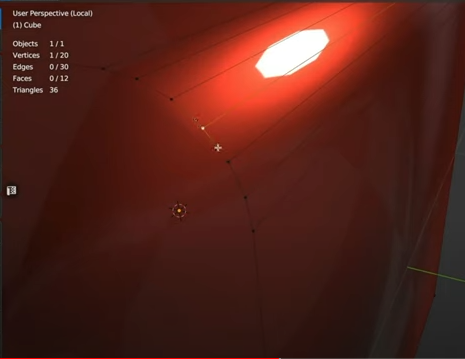

직선 직선 직선 직선 직선 직선 직선. 그러니까 지금 우리 주변에 있는 사물들을 보면 제 앞에 있는 XDR 모니터도 그렇고 베젤의 모서리 모퉁이 부분 있잖아요. 그런 게 다 곡선으로 돼 있어요. 언뜻 보기에. 돋보기 같은 걸로 보면 이제 직선의 연속이 보이겠지. 근데 90도로 꺾여있는 부분처럼 보이는 것도 어느 정도 줌인을 해보면 곡선으로 보이는 거고. 더 심하게 줌인을 하면 직선의 연속일 뿐이고. 여전히 그렇게 보이는 거죠. 

이 bevel 개념도 재밌는데. 이렇게 사각형 같은 게 있을 때도 뭐 그냥 한 면만 그렇게 할 수도 있지만, 아예 그냥 통째로 bevel을 만들 수 있거든요 이렇게.

그리고 세그먼트 늘려주고. 이러면 우리가 알고 있는 흔한 책상 같은 데 모서리의 형태가 보이죠. 이렇게 생겼습니다. 세상 만물이. 근데 줌인을 해서 보면 결국은 다 각져있다는 거야. 

그러니까 이걸 봤을 때도 마찬가지겠죠. 얘를 봤을 때, 어떤 형태가 보여야 하느냐. 일단 큐브. 사각형, 직육면체 형태가 보여야 되는 거고. 직육면체 플러스 원의 형태도 잠깐 보이네. 그리고 삼각형도 좀 보이고. 이런 생각이어야 되는 거죠. 그걸 블록아웃이라고 하는 거고. 그러니까 예를 들면 이런 거죠. 지금 이 큐브도 마찬가지인데. 다시. 아까 그 헤드로 돌아가 보면, 이걸 봤을 때가 그런 거죠.

기본적으로 생각했을 때는 큐브가 있고. 이런 형태의 큐브가 있고, 이 위는 뭐다? 원일 수 있잖아요. 원, 서클일 수 있고. 근데 이건 구의 형태여야 하니까. 이런 형태라는 거죠. 이런 게 모인 거라는 거지.

이게 블록아웃이니까, 블록아웃을 하면 이 정도로 보이는 거죠. sculpting할 때 블록아웃을 이런 식으로 하는데. 이런 식으로. 그리고 나서 합쳐서 sculpting을 하든가. 그렇게 형태를 잡으면 되는 거죠. 그러니까 큰 그림을 볼 때, 이렇게 보여야 된다는 거지. 그리고 만약에 이 사각형 부분 같은 거를 그냥 모델링을 한다면, 이런 부분은 각진 부분이잖아요. 이걸 이제 줄여주면 이렇게 만들면 한 면을, 좀 곡선 형태로 그렇게 만들 수 있는 거니까.

이건 나중에 하는 작업인 거지. 큰 그림을 보고 난 다음, 블록아웃을 한 다음에. 이게 꼭 3D 모델링에만 적용.  되는 게 아니고 세상을 볼 때 이렇게 보게 되더라고요. 2D를 하고, 3D를 하면 자꾸 디. 일을 보게 되고. 디테일을 보게 되는데, 줌인 아웃을 하면서 보게 된다는 거지. 얘를 이렇게 봤을 때 일단은 큰 그림을 보는데, 큰 그림을 보고 '아 사각형이 있으니까 그 위에 원을 올리고 적분을 하면 곡선을 한다면 곡선의 기울기 미분을 하고' 이걸 막 계산을 한다는 게 아니야. 그런 원리만 생각을 하는 거죠. 그렇게 하고 난 다음에, 이렇게 적용을 하면. 그러면 어프로치를 어떻게 하느냐. '블록아웃을 할 때 사각형과 원과 그 정도로 블록아웃을 한 다음에 대충 퉁 치면 되겠네' Face, 면의 수를 최소화하면서. 그리고 덩어리를 잡은 다음에. 'sculpting을 하고 그 위에다 포장을 하든가 그렇게 하면 되겠네'라는 생각을 하게 되는 거죠. 

근데 생각을 그렇게 하는 거고 실제 작업할 때는 꼭 그렇게 하지 않아도 되긴 합니다. 예를 들어서 여기다가 Shade Smooth 하고 대충 이쯤에 자리를 잡고. 가서도 이쯤에 자리를 잡으면 되니까, 그리고 sculpt 모드로 간다면, sculpt 모드로 가서 좀 키우고 머리 잡아주고 이건 태블릿 같은 게 있어야 가능한 작업입니다.

지금 제가 마우스로 이렇게 하는 건데요. 형태 잡는 거는 대충 마우스로 잡지만 필압 같은 게 없으면 굉장히 힘들어요. 이제 필압을 넣어서 해볼게요. 그럼 이렇게 자연스럽게 할 수 있거든요. 이렇게 맞춰주고. 이렇게 대충만 맞춰도, 대충 비슷할 거에요. 형태는 비슷해지거든. 이렇게 하면.

근데 제가 지금 뭔가를 실수했는데 뭔가를 실수한 거냐면 대칭을 켜야 하거든요. 예를 들어서 대칭을 켜놓으면, 한쪽에서 작업을 하면 옆쪽에서도 작업이 되는, 이게 됩니다. 대칭을 켜놓는 게 훨씬 더 작업하기가, 세상을 보는 눈 또 하나 중요한 게 이거거든요. 대칭 구조. 세상 만물이 대칭 구조다. 대칭의 좌표만 다른 거고. 중심축만 다른 거다. 만약에 대칭을 X로 생각한다면, X로 생각한다면, X로 켜놓고, 이쪽을 잡아당기면 X축을 중심으로, 미러 구조로, 거울에 비친 것처럼 그렇게 만들 수 있잖아요? 그러니까 한쪽만 만들면 되거든? 사실은. 한쪽만 만들면 됩니다. 그래서 실제로 모델링을 할 때도 대칭 구조다 하면 한쪽만 만들거든요. 그래서 이렇게 해서, 이렇게 맞추면 대칭을 켜놓지 않으면 서로 찌그러지기 때문에 나중에 굉장히 고생을 하거든요. 저도 이걸 익숙해지지 않아서 아까도 실수한 거야. 이런 식으로 맞추면 알아서 대칭 구조로 만들어지거든요. 대충만 하겠습니다 이걸 하겠다는 건 아니니까 지금. 이렇게 만들어지니까. 그럼 아까보다 좀 안정적으로 보일 거예요. 그죠?

대칭으로 만들어져 있으니까. 그리고 만약에 눈을 판다 해도 마찬가지인데, 대칭 구조가 정말 중요한 거고. 얘는 지금 해상도가 높지 않아서 이렇게 찌그러지는 거고요. 벌써 직선이 보이죠. 해상도를 높이고 싶으면, 해상도를 높여야 돼요. 이러면 해상도가 높아집니다. 이 박스 사이즈라는 걸로 지금 해상도를 높이는 건데, 예를 들면 이렇게 해상도를 높이는 거거든요. 

면의 크기가, 이 정도로 해상도가 높아진다는 뜻이거든요. 이 정도 너무 높아지면, 컴퓨터가 죽을 수도 있어요. 버벅거려서 움직이지 않을 수도 있고. 컴퓨터가 죽는 게 아니라 블렌더가 죽죠. 컴퓨터가 크래쉬할 수도 있어요. 그래서 이 정도 만약에 한다면. 그리고 리메쉬를 하면, 해상도를 높일 수 있거든요. 그럼 굉장히 부드럽게 눈을 팔 수도 있고. 이렇게 아까보다 훨씬 부드럽게 파지죠.

해상도가 높아졌으니까. 근데 이게 해상도 높아지는 게 뭐가 문제냐면, 아까도 말했지만 벌써 face 늘어나고 edge 늘어나고 엄청 늘어나잖아요. 그러니까 이렇게 늘어난다는 거지. 이러면서 무거워지는 거죠 모델이.

근데 이러고 나서도 또 뭘 할 수 있냐면, 리메쉬라는 걸 하는데, 리메쉬하는 방법도 여러 가지지만 자동으로 해주기도 합니다. 자동으로 해줄 수 있는 프로그램들이 또 있기 때문에. 그런 걸 쓰는데 저 같은 경우는 쿼드 리메셔라는 걸 쓰는데. 지금 예를 들면 많잖아?

많은데 5,000개 정도로 줄여라, 그러면 그냥 5,000개로 줄여주거든요. 그럼 이렇게 리메쉬를 해줍니다. 개수도 줄어들고 더 깔끔하게 보일 수도 있고. 그런데 이것도 쿼드 카운트라는 거, 쿼드라는 게 4라는 뜻이니까요. 5,000개, 1만 개, 2만 개 이렇게 늘어날수록 더 디테일을 살릴 수 있는 거고. 저는 이걸 방법을 두 가지 용도로 사용을 하는데, 하나는 제가 만든 이 구조가 워낙 개판이다, 이 개판으로 만들어도 리메쉬를 할 때 이런 좋은 프로그램을 쓰면 깔끔하게 다듬어 주거든요. 그런 용도로 사용하기도 하고. 이 face 개수를 줄이기 위해서 사용하기도 하고. 그러니까 처음부터 디테일을 막 고민하면서 그렇게까지, 방해를 받아가면서까지 사고에 방해를 받아가면서까지 고민할 필요가 없는 거죠. 그러니까 크게 크게 생각을 하고. 블록아웃을 한 다음에 나중에 리메쉬를 해도 되고. 그런 방법들이 있으니까. 리토폴로지를 해도 되고. 아까 리토폴로지 하는 거 잠깐 보여드렸잖아요. 그런 식으로 할 수도 있는 거고. 접근 방법은 5만 가지가 있는데 어느 게 제일 효율적이냐. 큼직큼직하게 시작해서 디테일로 들어가는, 줌아웃해서 본 다음에 줌인해서 들어가는. 그리고 일정 단계가 지나면, 줌인아웃을 자유롭게 하는. 자유자재로 하는. 그게 제일 낫지 않나 실제로 여러 번 해봤더니 그게 제일 낫더라. 2D, 3D뿐만 아니고 살아. 니까. **모든 분야에서 그렇지 않은가 싶더라고요.** 그걸 확인하는 과정에서 저는 2D, 3D가. 세상에 동그. 미는 없다, 곡선은 없다. 직선과 점만 존재할 뿐이야. 

근데 3D 모델링을 해보니.  제대로 관찰하는 게 아니더라고요 세상을. 아 큰 그림을 보는 습관, 이거는 어느 정도 다듬어왔는데, 거기서 줌인을 해 들어가면서 무엇을 봐야 하는지, 어디를 봐야 하는지, 왜 봐야 하는지, 뭘 봐야 하는지를 모르고 보는 거야. 이게 줌인 아웃을 자유자재로 한다는 의미겠죠. 그렇게 할 수 있는 능력을 길러간다는 게. 그래서 그림을 그리고 그림을 그릴 때 안 보이는 부분까지 생각하고 투시로 그려야 하니까 원근법 사용하고 그래야 하니까. 그렇게 그리고 3D 모델링을 할 때.  2D로는 안 보이는 부분은 자세히 안 그려도 되잖아 근데 3D는 그게 아니거든. . 실제 안 보이는 부분까지 다 봐야 하니까 거기도 빛이 튕기니까. ray tracing을 하니까. 그렇게 봐야 하고, 작동 원리를 대충은 알아야 하고. 그런 거죠. 그래서 지금 endoarm T800, 터미네이터 T800 endoarmg을 만들면서도 자꾸 관찰을 하게 되는 이유가, 작동 원리를 알아야 하니까. 제가 중장비 같은 것도 자꾸 보고 다니고. 옛날에는 못 봤던 도르래 구조도 보게 되고 그런다고 했잖아요. 그런데 이제 지금 난이도가 가장 높은 부분이 이 finger 부분이거든요.

finger 부분인데, 여러분도 영화 같은 데서 많이 보셨잖아. 터미네이터 영화에서 이렇게 움직이는 거. 근데 인간의 손도 마찬가지고 이렇게 어떻게 오므려질까요? 고민해 보셨나? 저는 좀 2D 공부하면서도 그렇고, 운동하면서도 그렇고 해부학을 좀 공부를 했거든요. 공부를 했는데도, 손가락이 오므려지는 것까지 공부하지는 않잖아. 여기에 근육이 엄청 많고, 근육의 기본이라는 게 작용근이 있고 그러니까 이렇게 수축을 한다면, 작용하는 근육이 있고 이거 그냥 막 놀면 안 되니까, 반대로 잡아당기는 작용 반작용을 해주는 길항근이라는 녀석이 있거든요. 저항근에 해당하는 녀석이. 반드시 그렇게 되어 있습니다. 잡아 다니면 살짝 저항을 주는, 그런 구조로 되어 있으니까. 거기까지 고민할 필요는 없었으니까 지금까지. 그런데 제품들을 보고 endoarm 제품들을 보고 모형들을 보고 그러다 보니까 방법이 두 가지가 있더라고요. 고민을 해야 되는 거였어. 고민을 한 번도 해본 적이 없는 거지. 난 자연스럽게 오므릴 수 있으니까 인간으로서. 그러니까 그걸 생각을 했을 때, 오므리는 방법이라는 게, 중장비를 봤을 때 중장비 크레인을 봤을 때 크레인이 어떻게 해? 포크레인 같은 것도 이렇게 되냐는 거죠. 방법은 똑같아. 인간의 근육 구조나 작용근이 있으면 잡아당기는 녀석이 있고, 밀고 당겨야 하니까 잡아 당기는 녀석이 있으면, 뒤쪽에 길항근에 해당하는 저항근에 해당하는 녀석이 있어서 잡아당겼다가 폈다가 할 수 있다고 생각을 하면 되는 거잖아요. 그런데 이제 그거를 piston으로 하느냐, piston으로 하느냐 도르래로 하느냐, 그 차이인 거거든요. piston으로 하든, 도르래로 하든 피벗 포인트라는 게 생깁니다. 회전을 할 거면. 잡아당기는 완전히 piston처럼 한 축으로만 움직이는, 한 축으로만 움직이잖아요 piston은. 이렇게 z좌표나 x좌표나 y좌표로만 움직인다고. 한 좌표만 신경 쓰면 되잖아요 piston은. 그런데 piston을 이용해서 오므릴 거면 얘기가 다르죠. 오므리면 일단 2D로 좌표가 달라지니까. 만약에 회전을 하면서 오므리면 3D로 달라지는 거고. 그런데 일단 2D로만 생각을 해도, xy좌표나 yz좌표나 xz좌표로 움직이겠죠? 좌표를 어디로 잡느냐에 따라서. 이렇게 해서 회전을 해야 되니까. 그럼 회전을 하는 축이 있는데, axle, 에 해당하는, 회전을 하는 축 이 마디도 보면 손가락 마디라는 게, 뿌리 쪽이 있고 마디 쪽이 있잖아요. 그럼 거기가 피벗 포인트일 거잖아요. 피벗이라는 게 이렇게 지탱을 하는, 그 축에 해당하는 거니까. 그래서 얘가 이렇게 움직인다면 여기 첫 번째 마디는 여기를 피벗으로 움직이는 거고.

두 번째 마디는 여기를 피벗으로 움직이는 거고. 세 번째 마디는 여기를 피벗으로 움직이는 거죠. 그러니까 사각형을 본다고 할 때 피벗 포인트라는 게 중간에 있거든요. 블렌더 같은 데 만들 때 무조건 센터에 있습니다. 처음에 시작할 때, origin이라고 하는 건데. origin이 있으면 그 origin을 중심으로 사각형이 돈다고. 근데 얘는 지금 이걸 사각형 마디를 만든다고 할 때, 길쭉한 마디를 만든다고 할 때, 중심에서 돌면 안 되잖아. 아래로 내려야 되잖아요. 피벗 포인트를 origin을 그래야 이렇게 돌겠죠.

그걸 축으로 돌겠죠. 이 세 개를 그렇게 잡아줘야 하는 거지. 그런 짱구를 살짝 굴립니다. '피벗 포인트를 아래쪽으로 내려야겠다' 근데 얘네들이 어떻게 오므려지나는 거지. 도는 건 알겠는데 오므려져야 하니까. 그러면 오므려진다는 말은 얘가 돌 때, 얘가 돌 때 얘가 돌 때, 세 마디가 돌 때 constraint가 생긴다는 거거든. 제약이 생긴다는 거거든. 얘가 제일 많이 돌고, 그다음 돌고 그다음 돌고 이런 제약이. 그 피벗 포인트를 어떻게 만드느냐. 이제 parent-child 구조로 그렇게 만들 수 있거든요. 피벗포인트 개념만 있어도, 축 회전축의 개념만 있어도, 작동원리 기계의 작동원리, 인간의 몸의 작동원리, 근육의 작동원리 이런 걸 좀 신경쓸 수 있게 된다는 거죠.

그래서 endoarm 핑거 부분, 손가락 부분은 신경을 제일 많이 써야 할 곳이 피벗포인트입니다. 작동원리를 생각을 할 때는. 그러니까 관찰을 할 때 거기다 주안점을 주고 피벗포인트에 주안점을 두고 봐야 하는 거죠. 그런데 핑거를 보면, 이따 사진도 잠깐 보면서 얘기를 할 텐데. 어디를 봐야 되는지 모르면 눈이 정보를 어떻게 취합을 해야 되는지, 큰 그림을 덩어리감을 어떻게 느껴야 되는지를 모르면 눈이 방황을 합니다. 뇌도 방황을 하고. 어디를 봐야 될지 모르니까. 그러니까 특히 뇌는 유사한 거, 객체지향적으로 세상을 보는 게 인간의 특징이기 때문에. 생명체의 특징이기 때문에. 지능이 있는 인간의. 지능이 있는 생명체의 특징이기 때문에. 상속을 받으려고 하거든요. 뭐랑 비슷할까를 생각을 해야 되거든. 손을 봤을 때도 저건 인간의 손이랑 비슷하다. endoarm을 봤을 때, 손을 봤을 때 핸드를 봤을 때 그렇게 느끼게 되거든. 그러니까 인간의 손 마디를 생각하게 되고. 그런데 자세히 들어가서 보면, 인간의 손이랑 비슷하게 생겼는데 개성이 있거든요. 그게 다형성에 해당하잖아요. 객체지향적으로 그걸 보는 능력을 키워야 되는 거죠. 상속을 받기는 쉬워. 인간의 손이랑 비슷하니까 '마디로 돼 있네'라는 건 볼 수 있거든. 그런데 그 마디가 어떻게 구성되어 있는지는 더럽게 헷갈린다고. 나머지 부분, 그게 도르래가 어떻게 연결돼서, 보면 또 케이블들이 연결돼 있거든요. 그러니까 잔근육에 해당하는 부분, 그런 게 연결돼 있는데 과연 거기까지 알아야 하는가, 3D 모델링을 하는데. 내가 3D 프린트를 해서 전 작동하는 제품을 만든다고 하면 모르겠지만. 그랬을 땐 어떻게 한다? 객체지향적으로 캡슐화를 한다. 블랙박스화를 해서 내가 작동하는 데까지 애니메이션을 만드는 거나 이러는 데까지, rigging을 하는 데까지 필요한 부분은 아니기 때문에 캡슐화를 하면 되니까. 객체지향성의 3대 원리 상속성 다형성 캡슐화, encapsulation, inheritance, polymorphism, encapsulation. 그 3대 축을 그대로 활용을 하는 거죠. 

그럼 한번 이미지를 보면서 생각을 해볼게요. 어디까지가 상속성이고 어디까지가 다형성이고 어디까지가 캡슐화인지. 그걸 한번 살펴보겠습니다. 

여기 보면 이쪽이 지금 전면으로 본 거고, 손바닥 부분에서 본 거고 이게, 손바닥 부분에서 본 거고, 이게 뒤쪽에서 본 겁니다. 손등 부분에서 본 겁니다. 근데 이렇게 보면 솔직히 엄두가 안 나. 왜냐면 난 이걸 만들어야 되니까. 대충 형태만 보겠다는 게 아니고, 그러니까 이걸 이렇게 일단 앞에서 보는 걸로 생각을 할게요. 이렇게 앞에서 보면 손바닥 부분에서 보는 거니까 이게 엄지고. 얘가 검지고 중지고 약지고, 핑키, 새끼손가락이다 그리고 여기가 손목이다. 이렇게 보는 게, 이렇게 덩어리로 큰 그림으로 보는 게 뭐다? 객체지향적으로 상속성인 겁니다. 인간의 손을 보는 거니까 이렇게 생긴 거잖아요. 이 손을 보는 거잖아요. 이렇게 보고 비슷하게 생겼다. 그러니까 상속성만으로 만약에 제가 이걸 모델링을 한다 하면 그냥 마디로 생각하면, 중지로 볼까요. 하나 둘 셋 손목, 하나 둘 셋 이렇게 생각하면 되는 거죠. 빨간 걸로 해볼까 하나 둘 셋 그리고 여기가 마디다 이거죠. 

그러니까 인간을 모델링을 할 때 제일 쉽게 하는 게 이 스틱 피규어잖아. 이렇게 바라보는 거 이게 객체지향적으로 상속성이라는 거죠. 상속적으로 바라봤을 땐 이런데, 그러면 제일 중요한 게 이 손목의 베이스에 연결되는 부분, 이걸 마디라고 치면 되죠.이스 여기 베이스 손가락의 베이스, 손가락의 루트 여기에 해당하는 거 그리고 마디, 마디에 해당하는 거. 그리고 이건 관절의 기둥이잖아요. 손가락의 기둥, 마디를 연결하는 기둥. 이렇게 보는, 여기까지 보는 게 객체지향적으로 상속성이라고요. 인간의 손에서 Inheritance, 상속을 받아서 바라보는 겁니다. 관찰의 1단계.

그럼 관찰의 2단계는 뭘까요. 다형성을 부여해야 되잖아. 왜냐면 얘는 기계니까. 그 기계 부분을 봐야 된다고. 그 기계 부분을 봤을 때 손등 부분으로 볼까요. 중지 봤으니까 여기잖아요. 여기가 지금 만약에 마디를 본다면, 이 마디를 보면 기계 부분이니까 마디를 봤을 때, 여기가 볼트 너트나 뭐 리벳 같은 걸로 고정이 돼 있는 거거든요. 연결 접합부가 있습니다. 그리고 여기 섀프트에 해당하는 기둥, 뼈대에 해당하는 거고 그건 이제 눈에 들어오거든요. 그럼 두 가지로 분리를 할 수 있어. 접합부를 어떻게 만들었는지 이 기계가, 기계가. 그럼 무슨 생각을 하면 되냐면 지금 중지 기준으로 해볼게요. 이게 Finger Tip에 해당하는 부분이고 마디가 두 번째 있고, 세 번째 마디가 있고, 여기가 뿌리 부분이겠죠. 그럼 이렇게 연결이 돼서 Copper Plate, Wrist Plate, 손목이 있는 거고 이렇게 생각했을 때 그리고 여기 관절이 있겠죠. 동그라미로 빨간 걸로 표현을 하면, 여기가 마디, 마디가 있겠죠 이렇게. 여기 마디 플러스 베이스에 해당하는 부분이 있을 거고. 이걸 구현을 하면 됩니다. 

이게 두 번째 관찰 단계거든요. 이 Endo Arm Finger의 좀 자세한, 개성에 해당하는 부분. 인간이랑 다른 점. 그게 이제 개성 Polymorphism에 해당하니까. 그걸 이해를 하면 되는 거거든요. 그럼 어떻게 생겼냐면 얘가 지금, 이 손등 부분에서 보면 일단 마디는 똑같이 생겼죠 다. 뼈대에 해당하는 부분. 파란색으로 이제 보면. 뼈대에 해당하는 부분은 얘가 지금 뼈대 하나 둘 세 개인데, 이 Finger Tip에 해당하는 부분은 다르게 만들어져 있죠. 이렇게 그러니까 이건 다른 식으로 만들어도 되고. 나머지는 그냥 실린더로 만들어도 되는 정도로 되어 있습니다. 그럼 나중에 이 부분을 파주든가, 그리고 여기다 도르래를 집어넣으면 되는 거거든요. 중요한 건, 이건 어렵지 않아. 마디는 언뜻 봐도 이게 뼈대 부분, 뼈는 그냥 보이는데. 요 마디가 중요한 거지 요. 마디가 헷갈리게 생겼거든요. 마디를 어떻게 접합을 했냐면 지금 이렇게 되어 있잖아요. 이렇게 그러니까 이렇게 되어 있습니다.

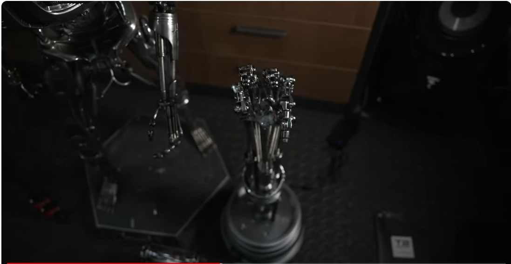

그러니까 이 중지기준으로 봤을 때, 이 마디 부분이, 마디 부분이 어떻게 생겼냐면 이렇게 생겼습니다. 그리고 여기에 볼트 너트가 들어가는 구조고요.

이게 보여야 이제 이 녀석의 다형성이 보이는 거죠. 그런데 이게 모형에 따라 다 다른데, 사실은 이 지금 블리츠 웨이에서 만든 모형은 단순화한 거예요. 그래서 이 세 개 마디가 동일하게 생겼어요. 

이렇게 얘를 1번이라고 봤을 때, 1번도 그렇고, 2번도 그렇고, 3번도 그렇고 동일하게 생겼거든요. 그러니까 이 부분을 본다면 어떻게 생겼냐면 지금, 이렇게 생겨서 마디가 연결이 되어 있고. 어떤 식으로든, 이렇게 연결이 되어 있고. 여기 뼈대가 들어가고 그러니까 이게 한 덩어리인 거죠. 한 덩어리, 이 윗부분은 다른 덩어리. 이렇게 되어 있죠. 이 부분에 이렇게 이어지고 얘는 또 다른 덩어리, 이렇게 이어지고 얘 밑부분에 보면, 이게 이렇게 또 연결이 되어 있거든요. 그러니까 이렇게 생긴 게 한 덩어리인 거죠. 이렇게 한 덩어리, 그리고 여기 베이스가 있습니다. 이걸 또 빨간색 녹색으로 표시를 해보면, 이 녀석이 베이스잖아요. 이렇게 베이스가 들어가는 거거든요.

이렇게 연결이 됩니다. 그러니까 테트리스 레고 구조인 거야. 테트리스 레고처럼 이렇게 되어 있는 거죠. 이렇게 되어 있는데 이거를 이쪽으로 뼈대를 연결할 거냐, 이쪽으로 연결할 거냐, 이것만 다른 거죠. 그러니까 얘는 지금 이렇게 생긴 겁니다. 이렇게. 잘 보이는 걸로. 이렇게 뼈대 있고, 이렇게 생긴 거죠. 이렇게 생기고, 다른 부품은 여기에 이런 구조로 연결되는. 그리고 이렇게 베이스가 이렇게 연결되면, 이게 보여야 이제 이 endo finger의, 다형성이 보이는 거죠.

나머지 부분을 보면 캡슐화라는 게 왜 생기냐면, 이런 케이블들이 있잖아요. 이게 케이블인데 이런 거 이런 거 이런 케이블인데.

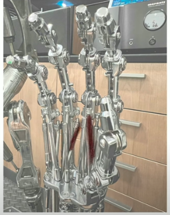

얘 케이블에, 이런 스트링이 연결이 돼서 이 도르래를 따라서 이렇게 지그재그로 X자라고 해야 될까요. S자 형식으로 이렇게 되어 있거든요. 그래서 이 스트링을 잡아당기면 얘가 오므려지는 구조입니다 얘는. 원래 실제로도 그래야 미세하게 조절이 될 것 같아요. 피벗 포인트만으로 조절을 하면 오므려진다라는 것만 있지, 미세하게 이렇게 조절하기는 작용근과 저항근을, 길항근을 이용을 해서 이렇게 뭔가 핀셋을 집듯이, 이렇게 자세하게 조절하기는 좀 어려울 거거든요. 근데 이 제품처럼 스트링으로 이렇게 조절을 한다면 이렇게 돌아가면서, 축이 이렇게 있으면 얘가 이렇게 돌아갈 수도 있고 이렇게 돌아갈 수도 있거든요.

도르래 축이 이렇게 있을 때 얘가 이렇게 해서 잡아당길 때와 이렇게 해서 잡아당길 때는 달라지는 거죠. 오므려지는 구조가.

그러면 작용근과 길항근의 구조를 만들 수 있겠죠. 그렇게 생각을 하면 이것들도 중요한 역할을 하는데, 잘 보면 이 케이블들이 하나 둘 셋 넷 여러 개가 연결되어 있거든요. 이 중에 절반은 그냥 모형이에요. 중간에 스트링이 없어. 그러니까 이걸 제가 제품을 3D 모델링을 한다고 해도, 프린팅을 해서 완전히 만들 게 아니라면, 그냥 rigging을 염두에 두고 만든다면, 이런 부분들은 인캡슐레이션, 블랙박스화 처리를 해도 되는 거죠. 왜냐면 실제로 이 모델에 rigging을 하는데 필요한 부분들은 아니기 때문에. 그래서 인터넷에서 발견할 수 있는, 혹은 구매할 수 있는 이 endoarm들이 많거든요 모형이, 3D 모형이. 그 모형들도 보면 대부분은 이 스트링이 없어요. 그렇게 만든 제품들이 아니야. 그냥 피벗 포인트를 이용한 rigging을 하는 그런 시스템으로 되어 있기 때문에 나머지는 다 인캡슐레이션을 한 거죠 그리고 이제 아랫부분 잠깐 보면 손목 copper plate에 해당하는 거. 이 copper plate에 해당하는 부분, 이렇게 copper plate가 있잖아요. 그리고 여기 구멍들이 크게 뚫려 있는 거는 손가락, 이 받침대를 만드는 거고요.

손가락의 뼈, 뼈 구조가 이렇게 올라가는 구조고. 그리고 이 가운데 부분으로, 또 이렇게 동그라미들이 조그맣게 있거든요. 

그러니까 이 녀석들도 piston입니다. piston이 이렇게 서는데, piston이 서서, piston이 서잖아요. 서서 잡아당기는 거예요.

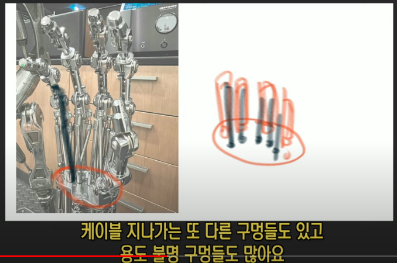

1차적으로 스트링만으로 잡아당기기에는 무리가 있으니까, 근육들 인간의 손도 근육들이 여러 근육이 있는데, 메인 근육이 있거든요. 그래서 잡아당기고 미세 조절을 잔 근육들이 하는 거죠. 잔 힘줄, 힘줄들이. 이것도 마찬가지입니다. 이 메인 piston이 잡아당겨요. 이렇게 잡아당기면 오므려지고. 나머지는 이제 스트링으로 제어하는 구조로 되어 있습니다. 그리고 이 piston이 두 개가 있는데, 하나는 고정시키는 역할을 합니다. 이런 식으로.

고정시키는 역할. 얘는 잡아당기는 역할. 다시, 중지를 생각하면 얘가 잡아당기는 역할을 하는 거고요. 빨간색으로 되어 있는 거 얘가 고정시키는 역할을 합니다. 이렇게 두 개의 piston, 메인 piston이 있고. 녹색으로 칠할 거는 스트링이죠 이게. 이게 스트링입니다 이렇게 연결되어 있습니다. 스트링들이 스트링을 감싸는 차폐체고. 실제 스트링은 이렇게 돌아가요. 

이런 식으로 연결되어 있거든요. 그 구조를 만들어야 하는 거죠. 그러니까 벌써 보기에도, 줌인아웃 단계를 생각을 하면 관찰을 한다라는 게, 줌인아웃 단계를 생각하면 어떻게 되냐면 처음 봤을 때 인간의 손처럼, 중지를 봤을 때 뼈대 하나 둘 셋 이렇게 생겼다. 그리고 관절 마디에 해당하는 거, 이건 누구나 생각할 수 있잖아요. 이게 1단계라는 거죠. 상속을 받는, inheritance. 상속을 받는 1단계고, 인간의 손에서 상속을 받아서 이해를 하는 거죠. 어려운 구조를. 이렇게 이해를 한 다음에 다형성은 뭐다? 이 마디 하나하나, 이 마디 봤을 때 이 마디들을 더 빠르게 이해를 하고. 그리고 이 뼈대에 해당하는 게 이 녀석이 되게 매칭을 해서, 뭐가 다른지, 뭐가 추가됐는지, 이게 endo finger의 개성이 뭔지, 그게 이제 plymorphism이 되는 거죠. 그리고 필요하지 않은 부분, 내가 이걸 모델링을 할 때 필요하지 않은 부분, rigging을 할 때 필요하지 않은 부분, 잔 string까지는 필요하지 않을 것 같다? 그럼 얘는 뭐를 한다? 인캡슐레이션하는거죠. 블랙박스화를 하면, 굳이 모델링을 해서 넣을 필요가 없는 거죠. 실제로 제가 string 모델, string까지 모델링을 한 모형은 아직까지 보지 못했어요. 이런 구조 도르래까지도 만들었는데, string을 걸지는 않았더라고요. 그런 식으로 되어 있습니다. 아무리 잘 만든 모형이라도, 지금 이 블릿츠웨이에서 나온 이 녀석이 제일 근사하게 만든 모형인데, 얘가 얘를 따라서 만들 거예요. 그래서 얘 지금 이 부분도 보면 이렇게 생겼잖아. 얘는 다 똑같이 생겼습니다. 이렇게. 관절 부분이 이렇게 생겼어요. 앞쪽에서 본 거고 이쪽 뒤쪽에서 보면 조금 헷갈리죠? 조금 헷갈리는데 어쨌든 이쪽 아니면 이런 식으로 되어 있는 거죠. 두 개로 되어 있는 거예요. ㄴㄱ이거나 ㄱㄴ이거나. 이 식으로 돼서 리벳이나 볼트 너트가 들어간다. 이것만 이해하면 되는 겁니다.

뼈가 있고, 뼈가 세 개가 있을 때, 관절을 어떻게 이어주느냐. 관절을, 이 관절 마디를, 뼈 마디를, 이렇게 이어주면 되는 거죠. 어떤 식으로든 ㄴㄱ, ㄴㄱ으로 이어주면 된다. ㄴㄱ으로 이어주면 된다. 그리고 ㄴ 부분을 위에 붙이고 ㄱ 부분을 아래 붙이고. 혹은 ㄴㄱ을 하나로 접합을 해서, 그냥 하나의 통째로 만들든가. 이건 이제 제 선택이 될 거예요. 모형마다 조금씩 다릅니다.

그래서 얘를 한 덩이 만들고, 얘를 두 덩이 만들고, finger tip을 한 덩이 만들고. 여기서 하나 둘 세 개를 만들든가. 그리고 나서 베이스 만들면 되겠죠. 이런 식으로 만들든가. 그러니까 처음부터 이 볼트 너트 다 신경 쓰고 연결되는 부분 다 신경 쓰고 어디를 봐야 할지 모르면, 객체지향적으로 관찰을 하지 않으면, 내가 지금 이해하고 있는 부분. 비빌 데가 필요하잖아요. 비빌 데 상속성 80% 정도는 이해하고 있다고 인간의 손가락에 익숙하니까. 그걸로 이해할 수 있는 부분은 일단은 퉁쳐야 한다는 거지. 비빌 데를 만들어야 하니까. 그 80%를 이해하고 들어가는 거죠. 그게 상속성입니다. 객체지향성의 상속성. 그리고 나서 얘에서 이해하기 가장 어려운 부분이 이 부분이거든. 접합부. ㄱㄴ으로 할 거냐, ㄴㄱ으로 할 거냐. 그리고 이 부품들을 어디에 연결할 거냐. 이건 이제 제 선택이 되는 거야. 그럼 대충 머릿속으로 그릴 수 있잖아 이제. 뼈대가 어떻게 생겼고. 이제 대충 그리거든요. 뼈대가 이렇게 있고. 뼈대가 있고 ㄴㄱ ㄴㄱ ㄴ 이건 베이스니까. 이렇게 연결하면 되겠네.

그럼 얘가 형태가 대충 나오잖아요. 이렇게 만들어도 될 것 같다. 한 덩이를. 얘도 이렇게 만들어도 한 덩이를. 될 것 같다. 이런 느낌이 있거든. 머릿속으로 이제 그려지는 거야. 근데 이걸 처음에 이 사진을 보듯이, 그냥 이러고 보면 엄두가 안 나죠. 세상이 이렇게 생겼다고. 객체지향적으로 접근을 안 하면 뭘 관찰해야 될지 모르면, 헤맬 수밖에 없는 겁니다. 

그런 실수를 많이 해 실제로. 제가 예를 들어서 지금 2D 그림이나 3D 방송을 하면, 제가 2D나 3D 방송만 하는 걸로 생각을 하시는 분들이 많거든. 프레임에 딱 갖혀서 생각을 하는 거죠. 그걸 활용을 하고 이렇게 좀 나와서 거기서 출발할 생각을 하는 게 아니고. 마찬가지입니다. 복잡한 구조라고 하니깐, tangible한 거 만져지는 거. 그것만 생각을 하는 경우도 있거든요. 꼭 그런 게 아니잖아. tangible한 게, 그렇게 원리가 적용이 되면, 원리잖아 원리. 이 유니버스를, 이 복잡해 보이는 어마무시하게 복잡할 거 아니야, 이 유니버스 엔진이. 그걸 단순화해서 볼 수 있는 치트키가 객체지향성이라고요. 상속성, 다형성, 캡슐화. inheritance, polymorphism, encapsulation. 그럼, 원리잖아. tangible한 거 만져지는 거, 유형의 것 여기만 적용이 되겠어요? 아니지 intangible한 거 안 만져지는 거 거기도 적용이 되죠. 당연한 얘기입니다. 그런데 편협하게 생각을 하면, 프레임에 갇혀서 생각을 하면, 2D는 2D고, 3D는 3D고, 블렌더는 블렌더라고 생각하는 거예요. 클립스튜디오는 클립스튜디오고. 거기서 뭘 하나를 배웠잖아? 2D, 3D 소프트웨어 하나라도 아무리 작은 프레임이라도 거기서 하나를 배웠으면 프레임을 벗어나서 응용을 할 수 있어야 되는 거잖아요. 응용을. 

왜? 우린 인간이니까 그게 인간, 인간을 넘어서서 지능이 있는 생명체의 특징이라고. 지능이 있는 생명체는, 객체지향적으로 사고하도록 디자인이 되어 있거든요. 그걸 평생 못 느끼고 살았으면 정말 큰 문제인 거야. 

전 한번 얘기했지만 여러분 삶에 참견할 생각이 없는데, 그냥 좀 안타까운 마음이 들어. 아직도 그런 사고를 한다면. 나는 객체지향적인 사고를 한다, 그렇게 디자인이 되어 있다, 그걸 못 깨닫는다면, 이 세상 난이도가 너무 높을 거거든. 그게 좀 안타까운 마음은 있어요. 참견하고 싶지는 않아. 그러니까 지난 시간에 이 endo finger의 작동원리를, 언뜻 보기에 더럽게 복잡하게 보이는 거, 이걸 tangible한 거잖아. 만져지는 거니까. 기계 구조. 그거 이해하는 데만 상속성, 다형성, 캡슐화를 쓰겠냐는 거야 아니지. intangible한 것도 안 만져지는 거 무형의 것 개념 원리를 이해하는 데도 그렇게 쓴다고요. 그거 한번 설명드렸어. 점선면 얘기하면서 이걸 제가 뭐 굳이 여러분들한테 튜토리얼이나 이런 걸 하겠다는 생각으로 주절거리는 게 아니고. 그냥 나는 사는 얘기를 하는 거야.

그러니까 참견한다 그러지 마. 나는 그대들 인생에 참견할 생각은 전혀 없으니까 이제. 그냥 객체지향적으로 사고를 하는데 이게 꼭 만져지는 것만 객체지향적으로 바라보게 되겠냐고. 개념 원리도 그렇게 바라보는 거지.

그래서 그걸 퉁 쳐서 한번 설명드렸어. 점선면 공간. 얘기하면서 똑같이 해볼까요 한번. 그림 그리는 식으로 한번 해볼게. 2D로 해볼게 2D로. 미분, 미분을 어떻게 바라보는지. 미분, 도함수 뭐 공식 외우고 그럴 거야 아직도? 델타 x 델타 y 그러면서? dx 분의 dy 그거 해볼까요? 

예를 들어볼게 미분 할 때 도함수 하면서 이거 하잖아. 델타 x 분의 델타 y 이거 하잖아요. 이거 이제 주식쟁이로 가면 이게 더 익숙하죠? 세모같이 생긴 거, 델타 x 분의 델타 y 이거라고. 근데 미분을 제가 왜 하는지는 그 영상에서 한번 설명을 드렸었는데, 1차 방정식을 생각했을 때, 얘가 x축이고 얘가 y축입니다. x값이 이렇게 변할 때. 이게 델타의 의미거든요. 변화분이니까. y는 이렇게 변한다. 얼마가 변하는가? 미분을 왜 공부를 하는지. 1차 방정식을 왜 공부하는지 회귀분석을 왜 하는지를 생각을 해야 돼. 왜 하는지를 알아야 그걸 어디다 써먹을지를 알고. 이 세상 어떤 치트키로 써먹을지를 알 거 아니에요. 회귀분석을 하기 위해서 하는 겁니다. 사실은 특히 이 정도 되면, 그러니까 이 정도 나이가 먹어서 세상을 바라보는 눈이라면 제일 응용하기 쉬운 게 통계니까, 통계가 또 하나의 치트키라고 제가 언젠가 얘기했어.

그 치트키를 활용을 하려면, 1차 방정식이 필요하고 회귀분석이 필요하거든. 그러니까 미분을 한다는 생각보다는, 1차 방정식. 일단은 회귀분석을 한다는 생각을 해야 돼. 회귀분석을. 그러니까 여름인데 예를 들어서, 여름인데 기온이 올라가? 10도에서 막 30도 이렇게 올라가? 그럼 뭔가 변화분이 생긴다고 기온이 올라갈 때. X 변수가, X라는 변수가 있을 때 독립 변수가 있을 때. 종속 변수라는 게 생기거든요. 그 변수가 있을 때 기온이 올라가면 뭔가 변하는데, 에어컨의 대수, 판매 대수가 올라간다 이런 건 짱구 굴릴 수 있잖아. 기온이 올라가면 당연히 올라가겠지. 막 30도로 올라갈수록. 근데 그냥 일정하게 변한다고 하면 일정하게, 그럼 45도 각도로 날아간다고? 얘가 1도 오를 때 한 대 더 팔린다는 개념으로. 그게 델타 X분의 델타 Y니까 이게 45도 각도일 때. 그렇다고요. 이해하기 쉽잖아요 이건. 쉽죠? 그게 무슨 뜻이야? 상속성이잖아요. 이해하기 쉽잖아. 발판을 마련하는 거야 상속성의. 미분을 이해하기 위한 상속성의 발판을 마련하는 겁니다. 이건 누구든지 이해하니까. 누구든지 이해해야 돼. 누구든지 이해한다고?

상속성? 80%는 먹고 들어가는 거라고요. 기온이 1도 변할 때 한 대 팔린다, 한 대 더 팔린다. 에어컨이. 근데 정말 그래? 그러진 않잖아 현실 세계에서는. 10도일 때 11도가 되면 에어컨이 한 대 더 팔려? 안 팔리죠. 그럼 어떻게 돼요? 기온이 올라갈수록이잖아. 올라갈수록 얘가 팔리는 대수가 달라질 거 아니에요. 폭증을 할 수도 있고. 그럼 얘는 직선이 아니고 곡선이 된다고. 곡선일 거 아니에요. 처음엔 더디게 팔린다고. 안 팔린다고 거의. 그리고 이러고 가겠죠? 다시 보면 예를 들어서 이렇게, 기온 X값 기온의 델타예요. 얘는 에어컨 Y값. 에어컨의 델타야. 에어컨 판매 대수. 판매 대수 근데 기온이 여기가 0도잖아. 여기가 한 30도 돼? 그럼 이렇게 쭉 가요? 한 20도 이쯤 가야 20도 정도 되겠죠? 20도라고 생각해 봐. 20도까지는 별로 안 팔릴 거라고. 기온이 올라도. 여기는 말도 안 되게 안 팔릴 거고. 0도니까 안 팔릴 거 아니야 그럼 이렇게 가겠죠. 이러고. 처음엔 더럽게 안 팔리다가. 30도에 가까워질수록 가파르게 올라가겠죠. 이러고 곡선이잖아 이렇게. 곡선을 그린다고.

그럼 여기서부터 제곱 이상이 나옵니다. 곡선이니까. 그래서 $y=ax+b$ 가 아니고 $y=ax^2+b$ 뭐 이러고 나가야 돼요. 여기서 제곱이 더블이 되니까 이런 식으로. 그래서 지수 로그가 필요해지는 거야. 그럼 근데 생각을 해보면, 이게 제일 쉬운 1차 방정식이거든요. 델타 X분의 델타 Y. 얘를 뭐를 생각을 하는 거냐면, 여기의 값을 생각하면 1일 때 1이고, 2일 때 2니까 되게 편하잖아. 그러니까 X가 3일 땐 얼마겠어? 3일 때? 당연히 3이겠지. 

이건 IQ 테스트잖아. IQ 한 자리 테스트잖아. 그래서 이 45도 각도, 이게 정말 쉬운 1차 방정식이거든요. 회귀분석도. 이걸 하려고 하는 거야. Y 값이 얼마인가? $y=ax+b$ 를 하고 싶은 거지. 이 방정식을 풀고 싶은 거거든요. 기온이 20도일 때, 이 a는 기울기고 b는 절편이죠. 절편에서 시작하는 거니까 이 절편은 뭐 0에서 시작하지는 않을 테니까. 0도에서. 이 정도에서 시작한다? 무조건 팔리는 기본 대수는 있다? 이렇게 생각할 수 있으니까. 그 기본상식, 이 1차 방정식을 보는 기본상식. X, Y 이게 뭐다? 상속성이라고요. 이거는 초딩 때 배우나요? 언제 배우는지 모르겠는데, 이걸 이해 못하는 사람은 별로 없어. 조금이라도 관심을 가지면, 공부를 워낙 싫어하는 사람이 아니라면. 이 정도는 다 알아듣잖아. 한 번 머리 굴릴 이유도 없이 알아듣잖아요. 그러니까 기온이 얼마 오를 때, 1 대 1로 만약에 팔린다면. 에어컨 대수가. 이렇게 되겠네. 만약에 1도 오를 때 그 에어컨이 두 대씩 팔려 막. 그러면 기울기가 이렇게 가팔라지겠죠. 

여기서 기울기라는 개념이 나오잖아. 기울기. 그러니까 X가 1일 때, Y는 1이면 1분의 1. 45도. 이게 기울기라고요. 근데 X가 1일 때 Y는 2가 나오면, 기울기가 얼마가 돼. $y=2x+0$ 이라는 얘기잖아. 이건 절편이니까. 이게 기울기고. 그럼 $2X$ 라는 얘기잖아요. 그럼 얘가 2라는 얘기잖아. 이거 쉽잖아. 이게 기울기라고. 

1차 방정식 얘기할 때 회귀분석할 때 $y=ax+b$ 이건 기본값이고 갖고 시작하는 거고. 이게 절편이라는 거고요. Y가 기본적으로 갖고 시작하는 값. 기본적인 Y, 에어컨의 판매 대수. 그리고 이게 기울기라고. 이거는 온도, 기온이 변화하는 거고. 온도가 20도일 때, 기울기가 얘는 얼마짜리야? 2다. 그러면 40대가 팔린다. 이렇게 추정을 하는 게 회귀분석입니다. 통계에서. 이것도 안 하고 주식하는 사람이 있다? 하지 말라고. 난 참견하고 싶지 않아. 하고 싶으면 계속해. 쪽박 찰테니까. 그런 참견도 하고 싶지 않아. 

그랬단 말이에요? 그럼 미분을 왜 할까요? 80% 먹고 들어간다고. 이것만 알아도. 미분의 상속성, 80%를 먹고 들어간다고. 기울기 구하기 쉽잖아. 델타 X분의 델타 Y라는 거잖아 지금. X의 변화분분에 Y의 변화분. 그렇게 하면 기울기가 나온다는 거잖아요. 기울기가. 그걸 가지고 확인을 할 수 있다는 거잖아. Y값을 추정할 수 있다는 거잖아. 기울기를 알 수 있으니까. 그 $y=ax+b$ 절편값 알고 절편은 0이라고 생각하면 없는 겁니다. 절편값 알고 $ax$ 기울기를 알고 그리고 $x$ 라는 변수값을 알면 $y$ 값을 추정할 수 있잖아 그죠? 이걸 모르시지 않잖아요. 

근데 $x$ 가 제곱이 되면 얘기가 달라진다고. 얘가 직선이 아니야. 곡선이야. 그럼 기울기 어떻게 구하냐고. 세상에 동그라미는 없다는 영상을 그래서 만든 건데, 뭣이 중헌지 모르는 분들은 안 본다고. 블렌더 얘기하나 보다. 그게 그대들의 한계라고. 그러니까 내 시간 뺏지 말라고. 뭣이 중헌지를 모르니까, 뭣이 중헌지를 모른다고 그대가. 나한테 메일도 주지 말고 조르지도 말고. 뭣이 중헌지를 모르니까 아직도. 

다시 얘기할게요. 동그라미가 있어? 동그라미가 이렇게 있다고요? 직선은 기울기 이해하기 쉽잖아. 곡선은 어떻게 할까요? 동그라미나 이렇게 생긴 애. 

일단 뭐가 문제가 생기냐면, 어디의 기울기? 곡선이잖아. 기울기가 어디 있어? 안 들어오잖아요. 머리에. 어떻게 하시겠냐고? 안 들어온다고 머리에. 그럼 첫 번째 뭐를 활용한다? 객체지향성? 상속성. 상속성을 활용한다. 80% 먹고 들어가야 되니까. 70-80% 먹고 들어가야 되니까. 비빌 데를 만들어야 된다고 지난 시간에도 얘기했죠? 지난 시간 영상을 안 보신 분, 또 뭣이 중헌지를 모르고 조르기만 하는 거야 이해도 못 하고.

웃는 게 웃는 게 아니에요. 제가 욕하는 걸 참고 있는 거야. 그러니까 곡선이 이렇게 있어? 상속성을 찾아야 될 거 아니야. 상속성을. 객체지향성을 응용해야 되는 거고. 제가 그 객체지향성을 응용하는 걸, 매일 거의 매일 보여드리고 있다고. 그걸 설명만 해달라고 좀 그러지 말고. 몸으로 보여주고 있잖아. 지금도 몸으로 보여주고 있는 겁니다. 이해되시죠? 직선, 직선의 기울기 이해됐다고? 이게 상속성이라고? 여기서 먹고 들어간다고? 그럼 곡선의 기울기는? 헷갈리지. 그럼 어떻게 해야 돼? 상속성을 동원을 해야 될 거 아니야. 뭐를 찾는다? 직선을 찾으면 된다고. 직선을 찾으라고 여기서. 세상에 동그라미는 없다고. 곡선은 없다고. 얘 어떻게 돼 있는지 보시면, 점 점 점 점 점.

이게 2D 공부를 하고, 3D 공부를 하는 인간의 시각이에요 관점이고. 왜? 곡선은 없기 때문에 이렇게 이어져 있거든요 얘가. connect the dot을 하면. 이거를 줌아웃을 해서 보면, 곡선으로 보이는 거야. 줌인해 들어가면 직선이 보여. 직선이 보이죠? 

산수적인 명제가 있다고 했어요? 산수적인 명제? 점을 찍어. 블렌드에서 Vertex라고 하는 겁니다. 점을 찍어. 두 개를 이어. 이거 뭐다? 직선입니다 짤없이. 이게 산수적인 명제예요. 정리고. 빼박이잖아 의심의 여지가 없는. 데카르트도 의심할 수 없는 팩트라고. 그죠? 점 두 개를 이으면, 블렌드에서 얘기하는 Vertex를 두 개를 이으면 뭐가 된다? 블렌드에서 얘기하는 edge가 됩니다. 라인, 선이 되는 거예요. 그리고 세 개를 이으면 Face, 면이 됩니다. 이게 2D의 기본이야. 그렇죠?

그럼 이걸 미분에 적용을 해보자고요. 곡선이 있다고 이렇게. 내가 원하는 이 곡선의 기울기를 구하고 싶어.

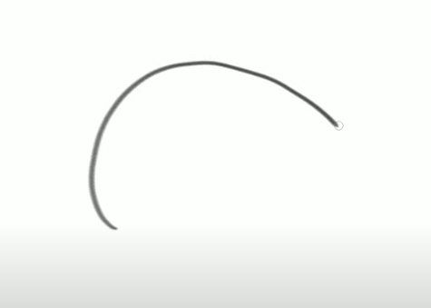

그래야 2차 방정식 이상의 회귀분석을 할 수 있으니까. 그럼 어떻게 구하겠냐고. Vertex를 찾는 거야. 직선을 찾는 거라고. 꼭짓점을 찾아서 그 두 개를 연결하면 되니까. 이쯤 있다고 생각을 합시다 대충. 이 곡선의 기울기를 구하고 싶을 때. 

그럼 얘 두 개를 이으면 뭐가 돼? 아따? 직선이 되겠네? 그럼 이거 기울기 구하면 되잖아. 여기서 출발하는 거예요. 이게 뭐다? 상속성이라고.

제가 상속성이라고 말을 안 할 뿐이야. 객체지향성을 모르는 분들한테 괜히 난이도만 높아지니까, 점선면공간 그런 거 설명을 할 때. 다시 볼게요. 이거를 지나가는 곡선이 있었어. 이렇게 지나가는 점 두 개를 봤을 때. 여긴 좀 곡선으로 보이네? 직선이 아닌 거 같네? 그럼 어떻게 해야 돼? 줌인을 해서 들어가. 그러면 또 점이 보여. 얘가 이렇게 이어진 거였어. 그러면 얘를 구하면 된다고. 얘는 직선이니까. 이 기울기를, 이 빨간 녀석의 기울기를 구하면 된다고요.

근데 얘를 줌인을 해서 들어갔네? 어라? 이 안에 또 점이 있는 거야. 얘는 살짝 곡선에 가깝고, 여기 쪽에 또 점이 있었어. 그리고 계속 들어가. 그럼 어떻게 되겠어요? 궁극적으로는, 궁극적으로는 정말 가까운 점 두 개가 있겠죠. 이 사이에 공간이 거의 없는 점, 포개져 있는, 거의 포개져 있다시피한 점 두 개가 있을 거라고. vertex 두 개가. 그거를 쫙 그으면 그리고 이걸 구하면 이 기울기를 구하면 그게 뭐다? 미분이라고. 이걸 산수적으로, 수학 시간에 뭐라고 하냐면 limit이라고 한다고요? limit 개념이라고. 무한대로 수렴한다 이런 거. 그러니까 이 점 두 개가 무한대로 가까워진다야. 그래서 어느 순간인간 하나로 포개진다. 그래도 점 두 개라고. 아무리 포개져 있어도, 지금 빨간 거랑 파란 거랑 이렇게 포개져 있다고 생각해봐 거의 포개져 있는 거야. 포개져 있다는 걸 보여주기 위해서 약간 삑사리나게 그린 거야. 

그래도 뭐를 할 수 있다? 얘 둘을 연결할 수 있다. 이게 미분의 기본이라고. 미분 처음 이해하는 거야 이게? 미분이라는 개념을? 80%는 뭘로 이해한 거야? 직선에서 이해한 거잖아요. 80% 먹고 들어간 거잖아. 그리고 다형성이 추가된 거죠. limit이라는 개념, 극한이라는 개념? 수렴이라는 개념? 이것만 이해하면 되는 거잖아. 나머지는 다 알고 있는 거잖아. 상속성 80%로 퉁 치고 들어간 거라고? 그럼 이제 미분이 이해가 되죠? 이거 보여드렸어. 영상으로. 블렌더에서 하는 방법도 보여드렸고. 다시 보여주지 않을 거야. 지난번에 했는데 점선면 공간, 그런 영상들, 제가 올렸던 과거 영상들. 제가 개인적으로 설명을 드렸던 분들 있죠? 그런 분들한테 제가 설명을 드렸었고, 미분을 그런 식으로 이해하는 거라고? 단, 객체지향성이라는 말을 쓰지 않았을 뿐이야. 이건 인간의 습관이에요. 인간의 성향이고, 인간의 디자인이야 그냥. 고등지능을 갖고 있기 때문에 상속성을 늘 발휘하게 돼 있어. 그 상속성을 보완해주기 위해서 이 직선 극한 개념을 만들어낸 거거든. 그걸 선생님들이 이해를 시켜야 된다고 애들한테 먼저. 상속성 비빌 데를 만들어줘야 되는데, 막 도함수 공식부터 외우라고 그러니까 이해가 안 가는 거라고. 비빌 데가 없는데. 상속성이 없는 애들한테 다형성을 우겨넣는 거야. 그리고 이해가 필요 없는 캡슐화를 할 부분도 분명히 있는 건데, 그것도 막 우겨넣고. 자기들은 아니까. 안다고 착각하는 거야. 그 선생님들도. 응용해보라고 하면 못해. 그걸 현실생활에 어떻게 응용할 건데?

그런 식이 되는 거죠. 2차 방정식 통계에다 응용을 해서 회귀 분석을 해서 곡선의 회귀분석을 해서. 아까 말씀드렸듯이 기온이 많이 올라갈수록 폭증을 하니까, 에어컨 판매대수는. 그런 거를 추정을 할 때. LG나 LG 휘센 같은 걸 만드는 분들이. 기온이 1도 올라갈 때 에어컨을 몇 대를 만들어야 하는지. 그런 걸 회귀분석을 한다고. 아무렇게나 찍어내는 게 아니고. 안 그러면 재고만 엄청 남지. 아무렇게나 찍어내는 회사다? 그런 회사 투자하면 안 돼. 적어도 회귀분석을 미분은 하는 인간들이어야 돼.

적분은 왜 하겠어요? 이것도 설명드렸었다고? 똑같은 개념이야. 상속성 80% 먹고 들어갔어? 그리고 미분에서 또 상속을 받잖아요. 진화를 한 거야. 그러니까 직선 방정식 이해하고, 미분도 이런 식으로 대충 개념을 이해하고. 지금 제가 5분 설명했나 10분 설명했나 이랬는데 미분이 딱 들어와야 돼. 그게 인간이 객체지향적 사고를 하는 인간이라고. 

그럼 적분을 이해하기에는 더 쉬워집니다 왜? 두 번이나 상속을 받았거든. 진화를 두 번 했다고. 그러니까 극한과 수렴 개념이 생긴 거야. 다형성이 추가된 거야. 그러니까 더 진화를 했겠죠. 객체지향성이라는 건 사실은 진화론이야. 좀 더 이해하기 쉽게 만들면 점점 진화를 해나가는 거죠. 적분까지 내려오면 미분을 거치고 오는 거거든. 그럼 더 세련됐겠지. 더 sophisticated 된 생명체가 만들어지겠죠. 그렇게 이해를 해야 되는 거거든. 극한과 수렴 개념이 생긴 거야. 그럼 더 이해하기 쉽다고. 적분은. 

봐봐 동그라미 면적 구할 수 있죠. 네모 면적 구할 수 있습니다. 못 구한다고 그러면 할 말이 없어. 원주율 같은 거 하는 이유가 있잖아. 파이 계산하고 그러는 거. 곱하면 돼 무조건. 뭔가를 곱하면. 그러니까 높이 너비, 이거 곱하면 얘 나오잖아요. 면적이. a 곱하기 b 하면 나오잖아. a를 b만큼 쌓아나가는 거잖아. 이렇게 모눈종이라면. 그러니까 이 면적이 나올 거 아니야. 그렇잖아요. 

그럼 삼각형은? 만약에 이게 정삼각형 그러니까 여기가 직각 부분이 꼭지점이 직각에 해당하는 삼각형이라면, 그래서 2분의 1을 해주는 거잖아. 이렇게 저 산수 못합니다. 수학 등급으로 따지면, 말도 안 되는 등급이에요. 나중에 나이 먹고 객체 지향적으로 사고를 해서 그냥 주절거리는 거야. 저거 계산 하라고 하면 다 틀려. 계산하는 거 중요한 게 아니라고. 뭣이 중헌디? 그래서 2분의 1을 하는 이유라고. 반쪽으로 딱 잘라 보이는 게. 이게 다 상속성을 활용하는 거예요. 벌써 네모를 구할 수 있어 면적을.

근데 2분의 1을 해? 이거 다형성이잖아. 삼각형의 다형성. 이해되시죠? 그런 식으로 해나가는 거야. 그러면 기본 도형에 해당하는 거, 블렌더 같은 데서 이게 primitive라고 하는 것들? 기본 도형에 해당하는 거는, 면적 구하기 쉽다고. 얘가 입체가 되면, 지금 이걸 원은 그냥 circle이라고 하잖아요. 저도 자꾸 섞어 쓰기도 하는데 이게 2D랑 3D랑 전혀 다른 개념이기 때문에. 얘가 circle이면 2D를 말하는 거고요. 이 꼭짓점들만 만들어서 이어 놓은 걸 말하는 거고. 얘가 만약에 이런 식으로 3D로 되어 있다? 이렇게 음영을 주면, 이게 3D로 보이잖아요? 이렇게 막 음영을 주면 이렇게? 이렇게 만들어져 있다고 하면 circle이라고 하면 안 됩니다. sphere라고 해야 되거든요. ball이라고 하거나 sphere라고 하는 거죠. 

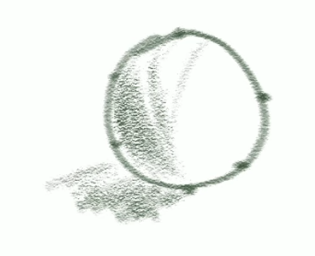

사각형도 마찬가지예요. 이렇게 생긴 녀석이 있다면, 이렇게 생긴 녀석이 지금 한 면만 보여주는 거잖아. 그럼 얘는 뭐라 그래? 얘는 plane이라고 해야 돼요. 판떼기만 있는 거니까 한쪽 면만 있는 거거든. 얘는 cube라고 해야 되는 거고. 사각형이니까. 각설탕 cube, 각설탕 그런 식이어야 하거든요. 그래서 2D, 3D 개념이 그래서 나오는 겁니다. 그럼 생각해 봐. 얘 그냥 사각형이잖아. a 곱하기 b 하면 나오는 애잖아 면적이. a 곱하기 b 하면 면적이 나온다는 게, 모눈 종이가 이렇게 있으면 얘 칸 더해 나가는 거잖아. 곱셈을 미분하잖아? 그럼 덧셈이 돼. 

곱셈이 좀 어렵잖아. 그냥 오래 걸리더라도 덧셈을 해나가면 된다고. 이해되시죠? 그러니까 하나, 둘, 셋, 넷, 다섯, 여섯, 일곱, 여덟 이렇게 더해 나가면, a 곱하기 b가 된다고. 이것도 상속성이죠. plane을, 면적을 구하는 법을 상속성으로 퉁쳤어? 곱셈은 덧셈이네, 덧셈을 빠르게 한 지름길이네. 그걸 알았어요? 그러면 이거 구할 수 있잖아 앞의 면 a, b 그쵸? 

구할 수 있어 이거? 못 구한다고 그러면 할 말이 없어. 깊이가 있잖아요. c잖아. 그럼 이거 공식을 모른다고 하더라도, 원리적으로 생각했을 때 상속성을 동원하면 뭔 짓을 하는 거겠어? 이 큐브의 체적을 구한다고 할 때, volume을 구한다고 할 때 얘는 면만 구한 거고. 이 면을 깊이만큼 깊이, 모눈 종이가 있을 거 아니야. 깊이만큼 또 더해 나가는 거네? 이 판떼기가, 이 깊이가 다섯 개야. 두께가 이 정도 모눈 종이 한 칸에 해당하는 두께, 그거에 해당하는 plane이 하나 있었어. 그걸 다섯 개 붙이면 얘가 되는 거잖아요. 체적을 그렇게 계산하는 거라고? 그럼 쉽지? 별로 어려울 거 없죠. 삼각형도 이렇게 계산할 수 있고. 원도 사실은 그렇게 계산할 수 있어요. 얘네들을 다 조각을 내면? 조각을 내면? 그게 중요해. 조각을 내면. 이해가 되는데 원은, volume을 어떻게 구할까? 물을 담아보면 되지. 그거 좋은 생각이야. 

근데 생각해보세요. 아까도 얘기했잖아. circle이 있어 언뜻 파이 동원하고 그래야 될 거 같잖아. 그래서 삑사리가 날 거 같고. 근데 얘를 이렇게 모눈 종이로 잘라봐. 그럼 일단은 이만큼을 퉁 치고 넘어가네? 

이게 또 원의 특징이거든요? 제대로 된 동그라미의 특징? perfect circle의 특징? 가운데를 이렇게 이으면, 사각형이 됩니다. 무슨 얘기 하려고 그러는 거 같아? 이만큼을 퉁 칠 수 있다고? 상속성이죠? 날아가잖아 얘. 그럼 요거만 남네? 지금 면적을 구해야 되는 게 얘만 남는 거잖아 요렇게. 요 부분만 이만큼 남죠? 이만큼 남고.

근데 이 안에도 사각형이 있네? 그럼 조낸 나누면 되겠네? 더 작게 나누면 되겠네? 그러면 한 부분만 생각할게요. 요 부분만 생각할게요. 요 부분만 요 부분? 요 부분을 잘라내서 볼게. 잘라내서 보면 이렇게 생겼을 거라고? 잘라내서 본다는 게 중요합니다. 그럼 어떻게 생겼어? 사각형이네?

또 잘라내. 얘 그리고 아까 구해놨던 거에 더해. 계속 이렇게 더해 나가는 거야. 그럼 요 부분만 남네? 그죠? 그럼 다시 요만큼은 남네? 뭐 할 줄 알겠죠? 또 잘라.

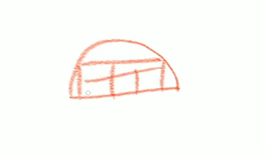

다 사각형 만들어? 사각형 만들고 얘 또 잘라내 반복이잖아요. 언뜻 보기에 곡선으로 보여도 이거 다 직선이라고. 그럼 사각형이 나온다고. 삼각형도 나오고. 그럼 다 퉁쳐가지고 날려버리는 거야. 언제까지? 안 남을 때까지. 그게 무슨 개념이야? 극한 수렴 개념이야. 어디서 퉁치고 넘어갈 수 있어? 미분에서 배웠잖아. 이게 미적분이에요. 이거 지금 한 면으로만 생각한 거고. 이걸 돌려서 3D로 생각한다면, 3D로 생각한다면 얘가 이렇게 생겼을 거냐 이렇게. 실린더틱하게 이렇게, 공이. 이거 다 그런 식으로 해나가면 된다고.

그리고 나면, 그 sphere에다가 물을 담아서 잰 것만큼이나 정확하게 잴 수 있다는 게 적분이라고요. 그래서 이런 집 같은 거 인테리어 같은 걸 할 때, 페인트가 몇 통이 필요할까 이런 거 계산을 할 때 스케치업 같은 프로그램이 그렇게 하는 거야. 적분을 해서. 우리 마눌님이, 화단에 흙을 얼마나 부어야 할까. 그런 계산할 때 이렇게 하는 거라고, 화단이 이렇게 생겼어. 이런 식으로 생겼다고 생각해봐. 그럼 여기 네모로 퉁치면 되네. 그리고 높이가 있을 테니까, 여기 세포대가 들어가. 그럼 대충 퉁쳤을 때 이런 모양, 이런 모양도 여기 사각형에다가 세포대면 이렇게 나누면 되겠네. 이만큼 들어가겠네. 네포대네. 여기 보면 이렇게 생겼네. 이거 이 정도 네모로 퉁치면, 2분의 1포대 그죠? 그러면 5분의 5.5포대가 되겠네. 

그리고 나머지 삑사리나는 부분, 그냥 생각해서 6포대. 현실 생활에서도 이렇게 응용을 할 수 있거든요. 이게 적분이야. 난방비 계산할 때도 이런 식으로 할 수 있어요. 스케치업 같은 프로그램이. 그럼 생각해봐. 1차 방정식, 점에서 시작했어. Vertex에서 시작했어. 이걸 상속받았어. 상속받아서, 언뜻 곡선으로 보이는 가짜 곡선, 세상에 곡선은 없어요. 곡선? 곡선 다른 걸로 그릴까요? 곡선인 줄 알았는데, Vertex가 이런 식으로 이어진 거였어.

요게 다형성이야. 곡선의 다형성. 이걸 상속받았잖아요. 1차 상속 그래서 진화를 했죠? 그래서 뭐를 했어? 미분을 이해를 했네? 또 상속을 받아? 또 상속을 받아서 지금 뭐를 한 거야? 적분을 이해한 거잖아. 그래서 동그라미 면적 구하고 이런 거. 면적을 구한 다음에, 곱하는 건 뭐다? 3번을 곱한다는 건 그만큼 더해주면 되는 거야. 그 적분질을 하는 거예요? 

volume을 구한다는 게? 또 상속을 받아서 얘만의 다형성 그걸 이해한 거네? 그리고 아무짝에 쓸모없는 것들이 있어? 별 도움 안 되는 것들? 이해가 잘 안 되는 것들? 근데 이 큰 그림을 이해하는데 별 무리가 없어? 그럼 캡슐화를 하는 거라고. 세상 만물이 그렇다고요. Intangible 한 거잖아요? 미적분이라는 게. 그리고 우리 고등학교 때 수학할 때 제일 발목을 잡는 분야 중에 하나고. 더 그런 것도 있지만. 통계 이해할 때도 이런 식으로 이해하는 겁니다. 그러니까 스스로 자문을 해보세요. 지금까지 어렵게 느꼈던 것들, 미적분, 통계, 샘플링, 가설 검정, 이런 식으로 이해해 보려고 노력을 하고 살았냐는 거지. 이렇게 보고 사냐고 세상을? 이렇게 보고 사는 인간들이 있다고 제가 언젠가 얘기했어.

이렇게 보고 살면 어떨 것 같냐고. 제가 지금 그림 그리다가, 블렌더 하다가, 수학적으로 설명을 드리는 거잖아요. 원리는 똑같잖아. 코딩도 이렇게 해요. 객체지향성이 코딩에서 온 거니까. 저는 코딩도 그렇게 배웠어. 2D도 이렇게 배웠고. 3D도 이렇게 배우고 있고. 보여드리고 있고요. 내가 보여주고 있다는 게 중요해요. 무엇이 중헌디의 하나야. 보여주잖아 어떻게 하는지. 어떻게 하는지 보여드리고 있잖아. 떼 쓰는 분들. 뭘 설명해 달라고 떼 쓰는 분들 보여주는데도 안 되면 어떡하라고?

그걸 밑바닥부터 시작했잖아. 그거 보여드렸잖아. 밑바닥부터 시작하는 걸.

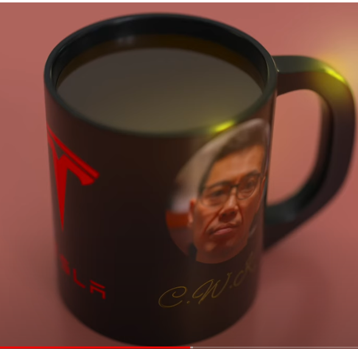

밑바닥부터 시작해서 여기까지 오는 걸 객체지향적으로 행동으로 보여드렸는데, 2D 그림 그리는 것도 그렇고. 뭣이 중헌디. 몇 분이나 보시냐고. 봐달라고 그러는 게 아니야. 안 봐도 상관없어 밥상을 차려놨으면 그 때 좀 처먹으라고. 밥상을 차려놨는데, 안 처먹고 나서 무엇이 중요한지 모르니까, 어디가 영양분인지도 모르고 뭘 제대로 먹어야 되는지도 모르는데, 그리고 나서 나중에 가서 다시 밥상 차려달래. 그러니 제가 화가 나요 안 나요.

오늘 이 영상 내용을 보시고, 스스로 한번 성찰을 해보셔. 본인이 뭘 잘못했는지. 그리고 지금 또 뭘 잘못하고 있는지, 뭣이 중헌디에 뭣이 뭔지 좀 생각을 해보시라고. 객체지향성을 이렇게 실천을 하면서 보여주는데도 안 되면, 내가 그대한테 무슨 희망을 보겠냐고. 무엇이 중허냐고. 뭘 하고 있는지를 모르니까 그대가, 내가 뭘 보여주고 있는지를 모르니까, 뭘 따라해야 될지 모르는데, 계속 설명만 해달라고 그러지. 

공부 못하는 사람들의 특징이에요. 특히 인생 공부 못하는 사람들의 특징. 설명만 바라는 사람들. 제가 영어책에서 안 차봐라고 했던 친구들 인사이드 킥을 어떻게 해야 되는지 설명만 들이따 파는 거야. 가서 차볼 생각을 안하고. 그걸 어떻게 차는지 보여주는데도 신경을 안 써. 여전히 제가 2D하고 3D하고 블렌더 하는걸 보이죠? 이런 소리를 하잖아? 그럼 또 그런 댓글을 달거나 피드백을 주는 친구가 생길 거야? 왜 화를 내냐고. 

endo finger를 이해했다고 해도 여러분들 다 마찬가지야, 뭐를 이해했든지 제가 지금 그려본 것처럼 대충이라도 그려본 것처럼, 그려볼 수 있는지 생각을 해보세요. 제가 지난 때는 그렇게 얘기했을 거야. 말로 설명을 해보는 거라고. 그게 선명하게 사고를 하고 있는지 검증하는 방법 중에 하나라고. 두 번째 더 잘 검증할 수 있는 게 그려보는 겁니다. 미적분 마찬가지예요. tangible하든 intangible하든 내가 이해를 제대로 했는지 그려봐야 안다고. 모르는 건 못 그려. 그릴 수 있을 것 같죠? 못 그려요. 그래서 엉성한 그림이 만들어지는 거야. 외형만 따고 막 트레이싱하면 그릴 수 있을 것 같지. 사람 얼굴을, 자기가 좋아하는 연예인 얼굴을 그대로 트레이싱을 해도, 예쁘게 안 나오는 이유가, 인체 구조를 모르기 때문이거든요. 원근법을 모르고. 투시를 모르고. 모르는 얼굴을 그리는 거야. 이해를 못한 대상을. 그래서 그림이 이상하게 나오는 거거든. 거기서 난이도가 더 높아지면, 모르는 건 절대 3D로 모델링을 못하거든요.

그 전 단계 난이도가 낮은 단계, 그려볼 수 있어야 되는 거죠. 내가 이해를 했다면 tangible이든 intangible이든, 유형이든 무형이든, 그려볼 수 있어야돼. 안 보고. 안 보고도 그려볼 수 있어야 거의 이해를 한 거거든요. 아직까지는 저는 레퍼런스를 봐야 인체를 그릴 수 있어요. 그러니까 완전하게 이해를 못한 거지 아직. 완전에 가깝게. 완벽한 건 없으니까. 그래서 계속 노력하는 거고, 계속 노력한다고. 무슨 개념이야? 극한 수렴 개념이라고요. 완벽에 가깝게, 계속 극한 수렴을 하는 거지. 완벽해질 수는 없다고. 똑같잖아. 이것도 객체지향적으로 이해하는 거잖아. 왜 완벽해질 수 없는지. 극한 개념으로 이해하는 거고. 상속받아서. 그 개념의 다형성만 취하는 거잖아요. 뭣이 중헌디. 여러분들 뭣이 중헌디, 뭣이 중헌디 그러면 고개 끄덕거리는 분들이 대부분이지만 지금 잠깐만 생각해봐. 이 영상 끝내시고, 5분만 생각해보세요. 대두족장이 말하는 뭣이 중헌디의 뭣이 뭘까요?

아무리 복잡해 보이는 것도, 심플리파이, 심플리피케이션을 해서 볼 수 있다. 역시 며칠 또 지났으니까 뻘짓을 하고 있죠. 스크린캐스팅을 안 켰어. 이제 화면이 보이실 텐데, 두 가지를 먼저 염두에 두고 시작을 하겠습니다. 난이도가 굉장히 높은 부분인데, 이 endo 스켈레톤에서. 터미네이터 T800 endo 스켈레톤에서 난이도가 아마 가장 높은 부분일 거예요. 핑거를 만드는 게. 그것도 workable, 그러니까 실제로 작동할 수 있는 핑거를 만든다는 게. 지난 시간에 제가 피벗 포인트랑 도르래 풀리를 이용하는 방법, 두 가지가 있을 수 있다고 했잖아요. 다른 방법도 있을 수 있습니다. 제가 모르는 다른 방법이 있을 수도 있는 거고. 

그런데 첫 번째는 모방에 관한 건데, 그림도 모작을 많이 해보라고 하잖아요. 

3D 모델링도 마찬가지인데 모작을 많이 해보면 그러니까 세상에서 내가 보는 거, 이 보는 것들을 실제로 만들어 보면, 제가 예를 들어 소니 카메라를 지금 보고 있는데, 저 카메라나 카메라 렌즈 같은 거를 만들어 보고. 이러다 보면 또 공통분모들이 생기거든요. 그 정도는 다 만들 수 있게 되는 거야. 공통분모들을 만들어 나가면. 그러니까 렌즈를 만들었다면, 동그랗게 생겼고. 줌인아웃할 수 있는 그런 형태로 만들었다면, 그거랑 비슷한 다른 건 또 상속성으로 먹고 들어갈 수 있잖아.

다른 부분만, 렌즈와 다른 부분만, 다형성으로 퉁치면 되는 거고. 그리고 추가적으로 고민할 필요가 없는 부분은 인캡슐레이션, 캡슐화를 하면 되는 거고 그런 식으로 하면 되니까. 그래서 자꾸 모작을 해봐야 되는데. 이건 제 경험인데 제 경험으로 또 말씀을 드리면, 모작만 100% 해서는 그대로 베끼는 식으로. 그렇게 해서는 좀 더디더라고요. 왜냐면 머리를 덜 굴리게 돼. 인간이 짱구 굴리는 동물이잖아. 그러니까 머리를 많이 굴려야 되는데, 그렇다고 창작을 할 단계는 아니고. 막 생각을 해서 세상에 없는 sci-fi 총을 만들어낸다거나. 근데 그것도 세상에 없는 sci-fi 총이라고 해도 내 머릿속에선 어떻게 나오는 거냐면 상속성에서 나오는 거거든요. sci-fi 총을 만들고 싶어? 뭐 사이버펑크에서 쓸만한 그런 총? 사이버펑크 2077? 이런 게임에 쓸만한 총을 만들고 싶다 해도, sci-fi 샷건이면 샷건에서 상속을 받는 거거든. 내 머릿속엔 이미 샷건이 들어가 있는 거잖아요. 그러니까 80%, 70-80% 또 먹고 들어가는 거지. 샷건을. 그리고 sci-fi 틱하게 만들려면 거기에 sci-fi의 다형성을 추가하는 거잖아. 그리고 실제 작동하는데 필요하지 않은 부분? 몰라도 되는 부분은 인캡슐레이션 캡슐화를 하는 거고 똑같은 방식을 거칩니다. 그러니까 저도 모작을 할 때, 못하지만 그림 모작할 때도 따라하기만 하면 비슷하게 나오더라도 뭘 배웠는지를 모르겠더라고. 그렇게 계속 따라하기만 하면. 그래서 조금 바꾼 게, 완전 창작만 또 하잖아? 밑바탕이 안 되어 있는데? 그 밑바탕이 안 되어 있다는 게 상속을 못 받아. 그 상속성 기반을 마련하지 못한 거죠. 샷건을 한 번도 본 적이 없는데 sci-fi 샷건을 만든다? 그거 무지하게 어려운 일이잖아요. 샷건이 어떻게 생긴지 모르는데. 여러분 샷건 어떻게 생긴지 아세요? 그러니까 샷건을 지금 그려보세요. 상상만으로. 그냥 자기가 알고 있다고 생각하는 거랑 그려보는 거랑 다르다니까. 못 그리잖아? 그럼 모르는 거야. 모르는 건 못 그린다고. 그런 기반이 마련이 돼야 되거든요. 저는 아직 그런 기반이 마련이 잘 안 되어 있으니까 모작을 계속 하는데, 2D가 됐든 3D 모델링이 됐든. 모작을 하는데 보면서 따라하고 하는데, 뭐를 추가를 하는 거냐면 완전 창작을 할 수 있는 단계는 아니니까, 창작을 한 20% 추가하는 거죠. 창작을. 내가 추가할 수 있는 부분. 이건 내가 한 번 만들어 볼까? 그런. 제가 그림을 그려도 다 보고 그리는 거예요 대부분. 인체를 보고. 그래도 제가 인체를 막 상상해서 동세를 만들어서 그림쟁이들이 쓰는 말이 동세라는 말을 쓰거든요. 영어로 하면 포즈예요. 포즈를 이렇게 이런 식으로 포즈를 내가 만든다 이러면, 이거 다 인체 해부학적으로 맞게, 원근법에 맞게 그렇게 그려야 되잖아. 근데 이게 쉬운 일이 아니거든요. 근데 레퍼런스 그림을 보고 그리면 훨씬 쉽거든요. 근데 그대로 따라 하는 게 아니고, 레퍼런스에 예를 들어서 제가 아이돌을 보고 그렸다. 아이돌 보고 그리는 경우도 있습니다. 비율이 좋은 친구들이니까. 그렸는데 저게 그 친구야? 하지 않을 정도로 그리는 거지. 그러니까 다른 사람, 내 머릿속에 있는 다른 사람을 얹어보기도 하고, 그런 식으로 한 20% 정도는 얼굴을 수정을 살짝 해서, 몸 수정하는 거야 뭐, 따로 수정을 해도 모르니까. 그 몸이 그 몸인지. 얼굴은 수정을 해보고 그러는 거죠. 코도 좀 바꿔보고. 조합을 해보고. 예능 같은 데서 막 이렇게 조합하잖아. 비율 좋은 친구들 막 여러 장 포개서 조합하듯이. 그렇게 해보고. 그게 훨씬 효과가 좋더라고요. 그림 실력이 그니까 계단식으로 늘어나는 걸 느끼거든 그러면. 내가 창작하는 부분만큼 늘어나는 거지. 그러다 보면 이제 나중에 창작 비율을 또 늘릴 수 있을 거 아니야. 처음에는 상속성 80%, 다형성 20%였는데, 20%가 이제 제가 창작하는 부분이죠.

아니면 이제 15% 플러스 인캡슐레이션 5%, 이렇게 15% 정도 비중을 가져갔는데, 좀 더, 좀 더, 좀 더 이런 식으로. 5 대 5 그러다가 이제 완전 창작으로 갈 수도 있는 거고. 아예 안 보고 그리는 단계. 모델링도 마찬가지일 거예요. 그러니까 이 endo 핑거를 만든다고 해도, 모형이 여러 개가 있는데. 모형들이 살짝 살짝 다른데, 공통 분모에 해당하는 걸 따지면 한 80-90%는 비슷하거든요. 그러니까 3D 모형을 파는 것들. 잘 만든 친구들이 파는 거. 그런 거를 연구를 해보면 그렇거든요. 

그 실제 그걸 또 3D 프린트를 해서 블릿츠 웨이나 이런 사이드 쇼 그런 친구들이 만드는 거, 그런 친구들이 만든 endo어 암을 봐도, endo어 스켈레톤 같은 걸 봐도, 모형이 완전히 똑같진 않으니까 그 친구들도 살짝 살짝 바꾼 거죠. 편의에 따라서. 예를 들면 오늘 잠깐 볼 단순화되어 있는, endo 암, endo 핑거 부분, 그 부분을 봐도, 이게 아마 저 사이드 쇼 그 제품일 것 같은데 제가 틀릴 수도 있습니다. 그건 중요한 게 아니니까. 이걸 보면 얘네들도 이걸 단순화 했거든요.

그러니까 영화에 나오는 그 모형이랑 살짝 다를 수 있다는 거예요. 예를 들어 볼게요.

원래는 제가 ㄴ, ㄱ 지난 시간에 분석한 거로는, 그간의 모형을 분석한 거로는, 이 마디 부분 톡 튀어나온 마디 부분, 이 마디 부분이 ㄴ, ㄱ 그러니까 고자거나 이게 고자로 보는 게 편한 이유, 상속성, ㄴ, ㄱ이거나 아니면 이걸 뒤집어서 ㄱ, ㄴ이거나. 손바닥으로 보느냐 손등으로 보느냐에 따라서 이렇게 본다는 거죠. 이걸 '고'자틱하게 인식을 하면, 심벌로 인식을 하면, 심벌로 인식을 안 하고 이렇게 생겼다고 생각을 했을 때 이거를 뒤집잖아요? 그럼 되게 헷갈려요. 근데 '고'자를 뒤집긴 쉬워 이렇게 뒤집으면 되니까. 이게 비빌 데거든요. 상속성으로 퉁치고 있으니까, 그 상속성 덩어리를 그냥 뒤집는 거니까. '고'자라는 걸. 그렇게 쉽게 볼 수 있잖아요. 그렇게 생각을 하면 되는데, 얘는 지금 또 어떻게 돼 있냐면, 그걸 더 단순화 한거야. 인간이 이해하기 제일 쉬운 형태일 거에요 이게. 그러니까 finger tip이 이렇게 있고. 그리고 뼈대 기둥이 있어요,

세마디, 마디라는 말이 헷갈리는데, 요 기둥에 해당하는 부분, 이것도 마디라고 하거든. 이 관절 부분도 마디라고 하고. 그러니까 좀 새겨 들으셔야 돼. 문맥에 따라서. 그러니까 이 중지를 봤을 때도, 길쭉한 이 뼈대 여기 세마디로 구분되어 있잖아요. 그리고 관절 톡 튀어나온 마디부분, 톡 튀어나온 부분. 요 관절 피벗 포인트가 있는 부분, 이 부분도 하나 둘 세 개가 있고. 그렇게 돼 있잖아. 그러니까 이걸 세 개로 봤을 때, 여기에 ㄴ, ㄱ이 들어간다는 거죠. '고'자가 들어가니까. '고'자 이 '고'자를 뒤집을 수도 있고, 다른 건 뒤집은 모형들도 있어. 실제 영화에 나오는 모형은 하나가 뒤집혀 있습니다. 그렇게 되어있는데, 솔직히 그렇게 만들고 싶지 않으면 그렇게 안 만들어도 되는 거고. 다 만들어 놓고 뒤집어도 되는 거고. 그건 생각하기 나름이죠. 그래서 일단은, 이게 세 개가 되어 있다는 걸 알고. 기둥은 어려울 게 없다는 거죠. 기둥은 딱 봐도 그냥 실린더야. 그렇게 받아들이면 되니까. 실린더 뼈대. 이 실린더는 일단 실린더로 박아 놓고, 이제 이건 앞에서 바라본 직부감으로 본 거고.

그러니깐 ortho graphic하게 본 겁니다. 투시가 적용이 안 된 거. 이걸 투시가 적용된 형태로 보면, 이런 식인 거죠. 기둥. 그리고 이런 식으로 돼 있어야죠. 모르는 건, 이해 못하는 건 못 그립니다. 자기가 그려 봐야 돼. 그려 봐야, 아 내가 이걸 이해하나? 선명하게 자기가 배운 거나, 이런걸 알고 있다고 착각하고 있는 거, 대부분 착각하고 있는 거니까. 착각하고 있는 걸 말로 설명 못한다? 내가 누군가한테. 눈높이를 낮춰서 설명 못한다, 그럼 모르는 거라고 그랬잖아. 두번째 검증하는 방법이 더 자세하게 검증하는 방법이 그려 보는거라고. 개념도 그려볼 수 있어. 제가 지난 시간에, 지지난 시간에, 지지지지난 시간인가 미적분 그려보듯이, 그렇게 그려보면서 설명을 할 수 있어야 되거든. 그게 이제 자기의 이해도를 측정하는 방법이거든. 그러니까 이 뼈대가 이렇게 생겼다라고 생각하는 건 직부감으로 본 거고, 그냥 orthographic하게 앞으로, 앞에서 정면에서 본 걸 얘기하는 거고. 이걸 이런 식으로 그리는 건 원근법을 동원해서 그리는 건, 내가 이걸 입체 구조로, 3차원으로 알고 있다.

이 세상은 3차원이니까. 이거는 XY 좌표만 있는 거잖아요. XY 이것만 있는 거잖아.

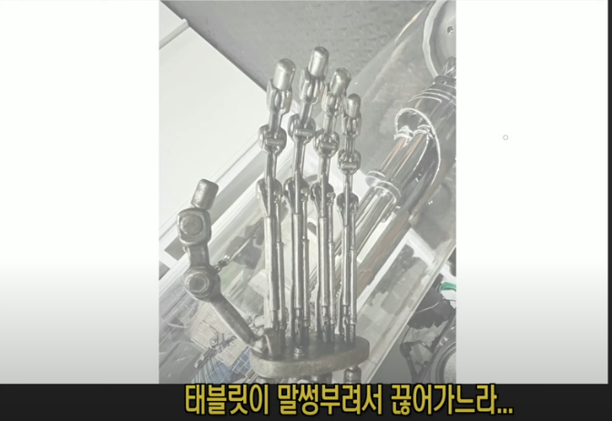

그러니까 투시가 적용 안 된 걸로 다시 예쁘게 그려보면, 투시가 적용 안 된 형태로 실린더 있잖아요. 원통형에 해당하는 거. 그걸 정면에서 보면 그냥 이렇게 생겼거든요. 

정면에서 보면 그냥 직사각형으로 보입니다. 이게 정면에서 본 형태거든요. 이걸 이제 orthographic하다고 하는 거고. 이걸 원기둥 뼈대에 해당하는 걸, 원근법을 적용해서 그리면 살짝 위에서 보거나 옆에서 보거나, 그러니까 윗면이든 아랫면이든 보이는 거죠. 그렇게 보이면 이렇게 보일 거 아니에요. 이건 살짝 윗면이 보이는 거니까 얘가 이렇게 생겼을 수는 없잖아. 위아랫면이 다 보일 수는 없잖아요. 그래서 이렇게 생겼죠. 이런 식으로 그리는 거고, 2D로 그림을 그릴 때는. 그리고 이제 여기다 쉐이딩을 이렇게 주죠. 만약에 광원이 이렇게 온다면 이것도 골때리는데 쉐이딩을 막 이렇게 여기다 새까맣게 주는 게 아니거든요. 

이쪽에서도 반사광이 오기 때문에, 이렇게 주고 뭐 이런 식입니다. 이런 식으로 생겼거든요. 그러니까 2D로 봤을 때 좀 간단하게 이렇게 봐도 3D적인 이해력 그러니까 비빌 데를 만들어 놓는, 상속성을 유지할 수 있는 그 기반을 만들어 놓는, 그 과정이 없으면 이해를 제대로 한 게 아니라는 거죠. 이 뼈대 부분도 그렇게 이해를 해야 되는 거죠. 정면에서 보면 이렇게 생겼다. 옆면에서 봐도 이렇게 생겼습니다. 위아래를 신경을 쓰지 않는다면. 

그런데 위아래를 신경을 쓰면 이렇게 생겼겠죠. 그리고 지금 orthographic하게 봐서 보면 이 가운데가 뚫려 있잖아요. 여기 이렇게 뚫려 있거든. 그럼 이제 딱 생각해도 지금까지 해온 짬밥이 있으니까 거기서 상속을 받습니다. 불리언 컷을 하면 되겠구나. 이렇게 직사각형 하나 집어넣어서 큐브 얇은 거 하나 집어넣어서, 불리언 컷을 하면 이렇게 나올 테니까. orthographic하게 보면. 가운데가 비어있는 형태로. 그리고 여기에 이제 여기에 도르래를 달면 되는 거죠. 그리고 여기에 케이블이 이렇게 지나가는 형태다라고 생각을 하면 되는 거죠.

이렇게만 생각할 게 아니고 근데 이건 정면에서 봤을 때고 그러니까 orthographic하게도 볼 수 있어야 되고 세상을. 원근법을 적용해서 perspective로 볼 수도 있어야 되는 거죠. 이거는 이제 orthographic하게 본 거고, 이걸 perspective로 가져가면 어떻게 생겼을지를 신경 쓰는 거지. 이렇게 생겼으면 얘가 이렇게 되긴 하는데 뚫리긴 하는데 이렇게도 뚫려야 하겠죠. 그런 의미지. 이렇게도 뚫려야 될 거 아니야. 이렇게 뚫려 있어야 되잖아요. 얘가 위에서 관통하면서 불리언 컷을 할 테니까. 절삭을 해도 실제로 그렇게 할 테니까. 그리고 도르래도 앞에서 보면 또 이렇게 생겼고, 도르래도 원통형이랑 비슷하게 생겼으니까. 근데 옆에서 보면 이렇게 생겼을 거 아니에요 도르래가. 여기로 이제 케이블이 지나가겠지. 그러면 도르래는 이렇게 봤을 때 살짝 이런 식으로 보이겠죠. 이렇게 돌아가는 게 보일 거고. 어디서 보는, 각도가 어떻게 보이느냐에 따라서 얘도 윗면이 살짝 보일 거고, 지금 윗면에서 보는 걸로 되어 있으니까. 얘는 윗면에서 보이는데 얘는 밑면이 보이면 안 되니까. 그렇게 도르래를 이렇게 집어넣었을 때, 쉐이딩은 이렇게 되고.

그러니까 다른 각도에서 보면 도르래가 이렇게 생겼을 거라는 거죠. 케이블이 이렇게 지나갈 거예요. 이걸 자꾸 그려봐야 되는 거지. 인체를 그리든, 미케닉을 그리든 메카닉을 그리든, 기계를 그리든 hard surface를 그리든, organic을 그리든 나뭇잎을 그리든, 그런 식의 관찰력을 키워나가야 자꾸 공통분모를 늘려야, 상속성으로 활용할 수 있는 기반, 그 공통분모를 왕창 늘려가고 다형성을 쌓아 나가면 공통분모에 해당하는 상속성 덩어리가 그냥 어마어마해질 거 아니에요. 

그 상속성으로 활용할 수 있는, 그 덩어리들이, 레고 블럭들이 엄청나게 주머니에 늘어나는 거지. 그걸 늘리려고 하는 과정이죠. 연습을 한다는 게, 2D, 3D 연습을 한다는게. 그러면 내가 세상을 바라볼 때도 그런 공통분모들이 많아지기 때문에 사물을 보는 눈이 완전히 달라지는 거죠. 굉장히 선명해지고, 공통분모들을 빼고 보면 진짜 그런 느낌이 들 때 있다니까. 매트릭스에서 네오가 이렇게 Wait Wait.

스미스 요원이 총 쏘려고 할 때 마지막에 그러잖아요. Wait. 뚜루루루루 보잖아. 그런 느낌이 들 수도 있어. 옛날에 굉장히 복잡하게 보이던 게 어? 순간적으로, 그게 연습이 좀 되면, 객체지향적으로 바라보는 연습이 되면, 순간적으로 그 네오삘을 받을 수 있거든요. 뚜뚜뚜뚜뚜뚜뚜 하고 보이니까. 1차적으로는 상속성에 해당하는 공통분모가 한 눈에 확 들어왔잖아 일단? 그럼 끝난 거야. 왜? 7,80% 먹고 들어간 거거든. 그러니까 이걸 봤을 때 지금 단순화되어 있는 모형을 봤을 때도 그렇거든요. 딱 봤을 때 얘 단순화되어 있는 모형은 어떻게 되어 있냐면 이건 많이들 보는 형태니까, 마디가 그냥 이렇게 기둥이 있고, 얘는 지금 마디를 이런 식으로 퉁쳤어요. 많이 보는 형태잖아. 이 형태는. 

그러니까 한 마디가 어떻게 되어 있냐면, 이런 형식으로 되어 있는 거죠. 스패너같이. 이게 이제 직부로 본 거고. 지금 자세가 좀 안 좋아서 이렇게 본 거고요. 이렇게 생긴 거죠. 직부로. orthographic하게 보면, 원근법이 전혀 적용이 안 되고 보면, 좌우는 같을 거고, mirror를 하면 되는 거니까. 이렇게 생긴 거죠 한 기둥이.

그리고 여기에 도르래가 지나가도 되는 거고요 이렇게. 여기에 볼트 하나 박아주면 되는 거고. 이 너트 대가리 이렇게 박아주면 되는 거잖아요. 얘는 지금 그렇게 만들었습니다. 이 부분만 봐도, 살짝 이건 orthographic하게 보면 finger tip이 있는데 finger tip은 원기둥으로 되어 있고요. 이 부분입니다. finger tip이 원기둥으로 이렇게 되어 있잖아요. 이렇게.

그리고 쉐이딩이 이렇게 되어 있고. 이쪽에 하이라이트 매치고 광원이 이렇게 온다는 거죠. 

하이라이트가 맺히는건 대부분은 90도? 90도 각도? 그쪽에 맺히니까. 그것도 이제 광원을 보는 방법 중에 하나. 꼭 그런 건 아닌데. 왜냐면 제가 이 사진을 찍었을 때가 형광등은 아니지만, 조명이 막 다양한 각도에서 날아오는 걸 찍은 거라, 꼭 그렇진 않지만 여기에 맺히는 하이라이트, 여기에 맺히는 하이라이트 이런 거. 이런 거는 대부분은 이렇게 직각에서 날아오거나 튕겨오거나 그런 녀석한테 맺히는 거라 그렇게 볼 수 있어요. 조명 위치가 대충 어디 있겠다, 이거 컴퓨터가 계산하라고 하면 거의 정확하게 계산할 겁니다. 

그래서 이제 그걸 다시 볼게요. 헷갈리니까. 이렇게 봤을 때 원기둥이 이렇게 있고 이렇게 어쨌든 내려온다는 거죠.

쉐이딩은 무시하겠습니다. 이렇게 내려오면, 얘가 이 부분은 이렇게 둥그렇게 되어 있고. 그러니까 이쪽은 좀 없는 듯이 그려야겠네요. 이게 이제 finger tip인 거죠. 그리고 이 윗부분이 이렇게 있는 거고, 이렇게 있는 거죠. 이렇게 있고, 아래 마디를 보면 지금 이 finger tip은 거의 이런 식으로, 이 아래에 도르래 부분, 이런 식으로 연결이 되어 있고. 그리고 밑 마디를 보면 아래 마디를 보면, 얘가 이런 식으로 되어 있는 거지. 이쪽으로 되어 있으니까 이쪽 면을 살짝 그리면 이렇게 리고 얘도 이쪽면으로 들어가야 되니까 이렇게 돼 있는거. 이게 안쪽면인거고 안쪽면, 이게 바깥쪽면인거고. 안쪽면 그리고 요렇게 그려주면 요 부분 빨갛게 칠해보면 이게 정면에서 보이는 부분. 그리고 검정으로 보이는게 옆면에서 보이는 부분. 그리고 안쪽으로 보이는걸 파란색으로 칠해볼까요? 안쪽으로 보이는거. 그게 이제 이쪽 안쪽인거죠.

이렇게 얘도 마찬가지로, 안쪽에서 보이는거 그게 요 부분인거고. 측면에서 보이는게 요 부분인거고. 그리고 요 정면에서 보이는 부분을 칠한다면, 요 부분인거죠. 이거는 지금 perspective하게 보는거니까, 요렇게 생겼으니까 지금. 그 부분을 이렇게 볼 수 있는겁니다. 그러니까 요 한 부분만 봐도, 이렇게 이렇게 틀어져서, 이렇게 이렇게 생겼다는거죠. 그래야 입체감이 있으니까. 그냥 이렇게 쉐이딩을 잠깐만 하면. 이런식으로 생겼다는거지. 

이건 이제 빛이 이쪽에서 왔다고 생각할 때 그림인거고. 이해하기 쉽게 그리느라고. 여기랑 똑같이 그린건 아닙니다. 이런식으로 그리면 좀 입체틱하게 보이니까. 우리 옛날에 글자 장난할때 그렇게 했잖아요. 그 ㄱ자를 만약에 입체로 그린다면 이런식으로 했잖아 이렇게 하고. 이렇게 이런식 장난했잖아요 그런것처럼.

그렇게 볼 수 있거든요. 그럼 얘는 이렇게 하고나서 요 밑부분이 요렇게 연결된거죠 지금. 이렇게 실린더 하나로, 그리고 얘는 뚫려있고 축이 들어가야 되니까. 도르래가 들어가야 되니까. 그리고 요게 한 덩어리인거잖아요. 다시 이제 앞에서 보면, 아주 단순하게 생각을 하면, 이게 기둥인거고. 아랫기둥 여기에 요 핑거가 들어간거지. finger tip이. 이렇게 도르래 축이 이렇게 연결되어 있는거고, 이건 finger tip에 연결되어 있어도 되고, 따로 놀아도 되고. 모델링을 할 때 요런식으로 만든겁니다.

이 친구는 그래서 그 아래도 뭐 이런 식으로 돼있는거죠. 그리고 베이스는 만들면 되는데 베이스는 선택이죠. 이렇게 만들건지 한쪽으로만 이렇게 만들고, 여기에 piston을 달건지. 이렇게 단순화 했거든요. 이 친구는 이렇게 이해를 해도 되는거야. 내가 모델링을 할 때 이렇게 하면 되는거야. 이건 이제 내가 창작을 해서 생각을 하는 부분인거죠.

똑같이 만들지 않더라도. 이 친구들도 그렇게 해서 단순화해서 만든거고. 왜냐면 이거는 움직이는 모형이 아니고. 좀 작은 2분의 1 모형이고 일단, 크기가. 1대1 스케일이 아니니까. 2분의 1 스케일이고 작은, 손이 작아보여요. 그리고 움직이지 않는거고, 고정되어 있는거고. 그러니까 그냥 이런식으로 단순화해서 퉁치는겁니다. 그러니까 얘를 1대1 스케일로, 1대1 스케일로 바꿔서 보면 이제 이런 모형이 되는거죠. 근데 얘는 꽤 어려워요. 

어려운 이유가 벌써 아까랑 구조가 같을수도 있는데, 얘는 이걸 요 부분 보시면 ㄱㄴ, ㄱㄴ에 해당하는 부분 이걸 나눠 놨거든요 이렇게. 근데 이게 orthographic하게 보면, orthographic하게 보면, 이렇게 보이지만 직부감으로 보면, 쟤는 익숙하지 않아서 그 표현이 직부감이라는 표현이, 직부감이라고 늘 하세요. 그림 그리시는 분들이. 원근법이 적용되지 않은 perspective가 아니고, orthographic한 비유를. 그래서 이런식으로 돼있으면 만약 ㄱㄴ 이렇게 뒤집혀있다, 요런식으로 만들어 놓은거죠. 실제로 실제 모형이 이렇게 생겼고. 이 친구도 방향은 같아. 두개 다 이렇게 생겼거든요.

근데 영화에 나오는 그 endo arm은 반대입니다 하나가. 영화에 나오는건. 그러니까 좀 난이도가 더 애매해지지. 근데 그렇게 애매해질건 없는게, 요 부분을 따로 떼서 뒤집으면 되니까. 자기가 필요하다면. 그렇게 생각할 수 있으니까. 그러니까 이렇게 생겼는데. 이게 직부로 보면, 아까 직부로 보면 그렇게 생겼고 perspective로 보면, 얘는 언뜻 이렇게 보이지만 이건 perspective가 적용이 안된거고. 요 부분이 동그랗거든. 요렇게 생겼거든 옆에서 보면. 요렇게 요런식으로 생긴거거든요. 요 부분이. 여기에 이제 볼트 넛트 식으로 들어가는거고. 요거를 앞쪽에서 원근법 사용하고 안하고 보면, 아까 실린더가 이렇게 생긴 녀석이, 그냥 이렇게 보이듯이, 이게 이렇게 보이는거지. 요 윗부분만 보니까. 이쪽에서 사람의 눈이 이렇게 요렇게 보니까.

이렇게 보니까, 이 윗부분이 요렇게 생겼지만. 그냥 orthographic하게 보면 직사각형으로 보이는거죠. 요 부분이. 그래서 살짝살짝 틀어서 사진을 찍고, 레퍼런스를 만들어서 봐야되는거고. 안그러면 헷갈리거든요. 이걸 직사각형으로 이렇게 만들어 놓으면 안되잖아. 직부감으로 보면, orthographic하게 보면, 이 녀석이랑 원기둥을 본거랑, 원기둥. 요 부분은 저거여야죠. 뚜 뚜 뚜 뚜 투시로 보는거니까. 꿰뚫어서 보는거니까. 그 투시라는 말이 그림쟁이들이 쓰는 투시라는 말은, perspective를 말합니다. 헷갈려요. 뚜뚜뚜뚜 할 때 투시는 transparent한거고. 그래서 뚜뚜뚜뚜 이것도 이렇게 보이고, 이 큐브로 생긴거. 진짜 직육면체, 얘를 정면에서 봐도 이렇게 생겼거든. 구분이 안가 3D가 아니면. 그 살짝 틀어서 그 입체감을 주려면 이런식의 이제 입체감을 주려면 얘를 살짝 틀어야 되는거지. 이렇게 틀어서 이렇게 보이는 것처럼. 그렇게 그려줘야 하는거지. 얘는 지금 이렇게 틀어진거잖아. 그걸 보고 그린다면, 자기가 모르는건 못그린다니까. 이렇게 해서 요거를 만약에 트레이싱 하잖아? 요 부분을 트레이싱 해볼까요. 트레이싱만 하는 습관이, 아주 더러운 습관이거든. 이렇게 생겼잖아. 그걸 보면 나중에 이렇게 생각하게 돼. 이렇게, 이렇게 생겼다더라. 이거 아무 의미 없습니다. 

구조를 모르고 트레이싱을 하면 이따위로 하게 되거든. 근데 트레이싱을 제대로 하려면, 얘 구조는 일단 알고 시작해야 돼. 알고 선의 굵기가 달라져야 되거든 예를 들어서. 얘를 요 앞부분은 살짝 그리고, 외곽선에 해당하는 부분을 좀 굵게 그리고. 구분이 돼야 되거든. 트레이싱을 하면서도 원근 구분이 돼야 되는거지. 아웃라인에 해당하는거랑, 그 보조선에 해당하는거랑 느낌이 달라야 되는거지 살짝. 오케이 오케이 오케이. 짠 여기는 굵어지는거고. 외곽선이니까.

이거 나중에 알게 돼. 왜 그렇게 그려야 되는지. 선화라고 하거든. 라인아트라고. 그림 그리시는 분들이. 저는 진정한 그림쟁이는 아니니까. 그래서 이제 요것도 보조선에 해당하니까, 이렇게 살짝 그리고. 그리고 여기다가 이제 좀 쉐이딩을 주고. 그리고 볼트넛트가 있고, 넛트 대가리가 있고, 요부분이, 빛이 지금 이쪽에서 온거죠. 여기가 검은거니까. 여기가 그림자가 지니까. 이렇게 생겼고. 그럼 이제 나머지 부분을 트레이싱을 했다고 해도, 이거 눈으로 트레이싱을 한거죠. 이건 직접 트레이싱을 한게 아니고. 그래도 이렇게 예상해볼 수 있겠죠. 얘가 그럼 얘 입체감이 좀 있잖아. 요렇게 생겼다. 그리고 그 위에 이건 이제 아까 얘기했던 ㄱㄴ 요 부분에서 ㄴ에 해당하니까. ㄱ이 이렇게 올라가겠네? 여기도 이제 트레이싱을 해보면 ,요렇게 생긴거잖아 그걸 봤을 때 외곽선을 생각하면 요렇게 내려와서 요렇게 내려온다. 크기는 좀 지랄맞게 됐지만. 그리고 여기 동그라미가, 찌그러진 ellipsis, 타원형으로 보이는 부분. 요렇게 생겼다, 아 요렇게, 오케이. 그리고 여기에 맞게 이제 원을 그려줘야 되는거고.

요 부분을 살짝 올려줄게. 디지털이 이게 좋은거야. 그게 안맞으면 이렇게 올려줄 수 있으니까. 그리고 전체적으로 내려줘야겠다. 이렇게 와서 내려와서 보면, 지금 높이가 안맞아서. 

이렇게 그리고 여기는 외곽에 해당하니까. 요것도 외곽에 해당하고 그럼 이렇게 생겼네 쉐이딩 좀 해주고 아 이렇게 생겼구나. 여기 구멍이 뚫려있고 요게 너트가 이렇게 지나갈거 아니에요. 요렇게 된거잖아. 모르는거 못그립니다. 이해 못 구조를 이해 못하는거. 즉 그림을 잘 그린다는 얘기가 아니고, 못 그리더라도 형태조차도 못잡아 제대로. 여전히 이게 좀 짧죠. 여전히 짧아 이 부분이. 이렇게 생각을 하면 요렇게 생긴거잖아요 지금. 축처럼 돌아가는 부분이 있고 그럼 얘는 이렇게 된거고. 이렇게 얘가 더 내려와야 되고. 그 도르래 축에 해당하는 부분. 이게 더 많이 내려와야 되는데, 이런식으로. 그리고 이제 얘는 또 점선이어야 되는거죠. 뚜뚜뚜에 해당하는 거죠 뚜 뚜 뚜 이러고 볼트 너트가 지나간다는 구조니까. 이러면 대충 눈치 까잖아. 

아까랑 비슷한 구조인데, 얘만 이게 지금 요 부분이 나눠져 있는 거잖아요. 아까는 요렇게, 요렇게 돼있고. 요기에 이렇게 들어가는 구조였는데, 요 부분을 나눈 거거든. 이 녀석은. 이거를 ㄴㄱ 그 식으로 나눈 거니까. ㄱ 이런 식으로 나눈 거니까. 얘는 지금 어떻게 돼 있는 거냐면, finger tip, 그 뼈대에 해당하는 부분이 있고. 요 부분을 이렇게 만든 거죠. 이렇게. 그리고 이걸 이런 식으로 만들어 놓은 거고. 그리고 여기 좀 내려와야겠다. 이렇게 생겼고, 여기가 볼트가 지나가는 거. 이건 선택이라는 거지. 어떻게 만들 건지. 나머지 부분도 똑같이 생겼습니다. 

똑같이 생겼는데 예를 들면 요 부분을 보면 요게 이제 또 시작이니까, 뼈대가 있고, 위에는 얘는 지금 요렇게 생긴 거였고. 요렇게 뼈대가 내려오고, 뼈대하고 이제 그 모든 부분이 너트 들어가고 볼트 들어가고 피벗 포인트가 생기거나 그런 부분은 워셔틱한 걸 넣어 주니까. 마찰을 방지하기 위해서라도. 인간의 구조도 그렇게 돼있잖아. 인대가 있는 거고, 그런 부분을 이렇게 만들어 준 거고. 그리고 나머지는 똑같아. 여기에 이게 있고 ㄴ, ㄱ에 해당하는 거. 그리고 아랫부분 뼈대에 해당하는 게 얘가 이렇게 생겨서 또 이렇게 붙어 있는 거죠. 이게 요 부분이죠.

이걸 또 perspective로 생각을 하면, 요거 요 부분을. 이렇게 그리면 되잖아요. 직사각형에 해당하는 걸 이렇게 bevel 주는 거잖아. bevel 주는 형태잖아. 요렇게 bevel 주는 형태. 

이거 실제로 블렌드해서 bevel 주면 됩니다. 플레인을 extraction해서 bevel 줘도 되고. 그림을 그려보면서 생각을 하는 거지. 블렌드에서 어떻게 하면 되겠다. 이거를 플레인을 만들어서 이런 네모난 플레인 face만 있는 거. 요 플레인을 줘서, 요 부분 있잖아. edge 부분이든지, vertex 부분이든지, 전체적으로든지. 이렇게 bevel 주면 되겠다라고 생각을 하고 그리고 요건 지금 face만 있는 거니까. 두께가 없는 거니까. 이렇게 본다면, 요렇게 생긴 거니까. 두께를 주면, Solidify Modifier를 주든가, Extraction을 하면 되겠다. 그 생각을 하면 되는 거잖아요. 이런 걸 그려보면서 얘는 그렇게 처리하면 되겠군. 플레인 머리 속으로 계속 짱구를 굴리는 거지. 기존에 해왔던 게 있으니까 거기에서 상속을 받는 겁니다.

그 다음에 밑에 ㄴㄱ 이어지는 부분 요 부분이 있으니까, 요 부분을 여기 붙여도 되겠네 이렇게. 요걸 한 덩어리로 만들어도 되겠는데? 어 그럼 블리언으로 만들어서, 이쪽에 그 이 형태로 된 거 있잖아. 사각형 위에 서클 올라가는 거. 

이건 사각형, 요 부분을 bevel을 줘서, 클램프 오버클램프 없애고. 이렇게 만들어주면 되니까. 그렇게 만든다고 생각을 하고 그러면 큐브, 찌그러진 큐브 하나 집어넣으면 되겠네라는 생각으로 하나 만들어주고. 그리고 아까 여기서 분석했던 거. 똑같은 형태로 들어가는 거일 테니까. 요렇게 해서 또 요 판떼기가 밑으로 들어가면 돼요. 얘 이.거 복사해도 되는 거잖아요. 이렇게 해도 되고, 아니면 이 통.째로 들어가서,. 기둥을 붙여도. 되는 거고. 이렇게. 하면 되겠네. 트 너트야 계.속.

만들어서. 요  피벗 .포인트에. 얘가 피벗 포인트니까, 피벗 그리고 요 부분은 이거.는 뭐 실.린더  너날 하는 짓이고.니까. 실린더에 관통하는 블리언 하면 되겠네. 아니면 그냥 블리언을 안 해도, 실린더가 있는데, 반쪽짜리 실린더를 만들어서 이렇게. mirror 해주면 되잖아.

뭐 그렇게 해도 되고, 방법은 오만가지니까. 살짝 이렇게 만들어서, 완전 반쪽은 아닐 수 있죠. 이거를 이렇게 쪼갠 건 아닐 테니까. 이만큼의 공간이 있어야 되니까. 3분의 1 반쪽 요정도 만들어서, x 좌표로 mirror를 하면 되겠다. 그럼 공간이 생길 테니까. 그리고 이 안에 축을 집어넣고. 도르래. 요거 이것도 뭐 뻔하게 생겼잖아요. circle에서 extraction을 해도 되고, 또 실린더에서 이거 작은 실린더, 예를 들면 그러니까 직접 해보기 전에 그림을 그려봐도 된다고. 작은 실린더에서 이거 찌그러뜨리면 되겠네. 이게 edge 루프 같은 거 만들어서. 요 부분을 눌러서 이렇게 찌그러주면. 그리고 짜부를 시키면. 처음에 이렇게 생겼던 게. 그런 식으로 만들면 작아지고. 일단 작아졌을 테니까. 그리고 가운데가 파이겠죠. 우리가 원하는 그 찌그러진 얇은 아령. 덤벨 형태가 되는 거잖아요. H자 처럼. 

그것을 만드는 방법은 뭐 진짜 이 실린더 하나 갖고도 만들 수도 있으니까. 그리고 나서 복사 복사 복사. 그렇게 하면 되고 이 아랫부분도 마찬가지. 

이제 아랫부분을 생각해 보면 요 이제 요게 베이스니까 얘는 이게 베이스거든요. 계속 지금 똑같잖아. 똑같은데, 베이스는 두꺼워 얘가. 요 부분을 보면 얘는, 아까 만들었던 네모 위에 반서클 올라간거. 요 구조인데. 많죠 이런 구조. 실제 생활에도 많으니까. 요렇게 생긴건데, 요 베이스를 보면 얘는 두껍잖아요. 베이스니까. 요 부분이니까. 

그러니까 요 두껍잖아. 요거를 퉁 쳐서, 아주 얇게 만든게 요기야. 실제로 이 뼈대를 보면 얘하고 얘는 다르거든요? 인간을 봤을 때 구조도. 왜냐면 여기는 긴 뼈대가 연결되는 부분이고. 요 부분은 마디가 두드러진 부분 이고 그러기 때문에. 얘도 요렇게 되고, 요렇게 짧은데 얘는 두껍다. 이렇게 들어가는거죠. 그리고 나서 이제 요 베이스 부분에 보면, 베이스 요 부분인가요. 어딘가에 그 지금 피스톤이 연결되는데 베이스를 보면 요기, 요기 보면 고정되는 피스톤이 있습니다. 이렇게 베이스에 있으면 요거죠 요거. 톡 튀어나와서 요렇게 고정되는 피스톤이 하나 작은거. 피스톤 구조는 단순하거든요. 길쭉한 실린더 하나. 그거보다 더 큰 실린더 하나 요걸로 들어왔다 나왔다 하는거니까. 근데 이제 완구 같은거를 만들 때는 여기에 이렇게 스프링을 걸어주거든요. 그럼 얘가 들어왔다 나왔다 할 때 요 스프링이 걸쇠틱한 애가 있으니까 스프링이 늘어났다 줄어들었다 그러면서 이렇게 힘을 받는 거거든.

근데 이 endo arm이 그렇게 생겼을 리는 없잖아. 터미네이터인데 스프링을 가지고 만들었을 리는 없잖아요. 유압식이다, 이러고 그냥 계속 그냥 퉁 치는거지. 그냥 피스톤은 이렇게 생겼다 라고만 만들고, 좀 그럴듯하게 더 만들려면, 요 부분에 캡을 씌워주거나. 뭐 그런 형태로 만들면 좀 더 리얼하게 만들 수 있겠죠. 그렇게 생긴 겁니다 얘가 지금. 그니까 여기 베이스가 있고, 베이스가 있고. 이렇게 튀어나온 부분에. 또 리벳 작은 게 있어서, 이렇게 연결이 되고. 피스톤 움직이는 부분. 그리고 고정되는 부분이랑 이렇게 캡으로 연결되어 있고. 그니까 이제 이것도 마찬가지인데. 이거 이제 뚜뚜뚜 에 해당하는 거지. 이렇게 들어갈 테니까 그리고 음 아랫부분, piston집. 얘가 들어다 나왔다 해야하니까. 

여기에 기름이 차있거나 유압식으로 되어있거나. 왔다갔다 거리도록. 그게 이 구조입니다. 그리고 얘는 copper plate. 고정되어있는거고 손목 판떼기에 고정되어있는거고. 그리고 얘를. 손가락을 오므리는 piston. 이거보다 좀 큰 piston.. 이거보다 큰. piston은. 여기에 연결되어있죠.. 첫번째 도르래 그래서 베이.스번째 기둥. 이렇게 기.둥에 도르래가 두 개 있는데.. 첫번째 도르래에  이렇게 .연결되어있습니다. 도르래축이.

그래서 고.얘는 옆에서 보면 이렇게 생겼죠. 지금. 이렇게. 각도가 나와야하니까. 이렇게 생겨서 내려오고, 또 캡이 있고. 큰 piston 집이 있고. 여기 구멍 뚫린거 다섯개가 있거든요. 이게 엄지부분이고. 그래서 이게 중지니까, 여기에 이렇게 연결되는 구조죠. 그래서 내려다보면 연결되는 부분에도 캡이 있구요. 여기 캡이 있죠. 이 부분. 이렇게 캡. 이렇게. 요것만 다시 그려보면. 요거. 이 piston, 이렇게 연결되고 작게. 캡이 있고 살짝 기울기가 있어서.

그리고 또 이 piston이 움직여서 안으로 들어갈 수 있는 긴 집이 있고. 이거 다 용어가 있을텐데 제가 용어를 잘 모르니까. 또 캡틱한게 있고 이렇게. 두께감이 있으니까 얘도. 이렇게 주는거고. 그리고 이렇게 내려가서, 구멍에 딱 맞게 되는거죠. 

그리고 이제 쉐이딩 주면 이렇게 입체감 살릴 수 있는거죠. 얘도 마찬가지고. 이 금속의 쉐이딩이 참 재밌기 때문에, 재질을 살리는 방법 중에 하나가 금속의 쉐이딩이, 하이라이트가 이렇게 일자로 촥 맺히니까. 그거 이제 칼라 닷지를 주던가 그렇게 하면 재밌거든요. 금속을 만든다는게. 그림을 그리면서도 금속 재질, 그걸 주는게 예를 들면 이거죠. 

이렇게 까맣게 칠한 다음에, 얘 금속 그거를 주면 여기를 이렇게 일단 까맣게 칠하고, 쉐이딩이 이렇게 들어간다면. 이렇게 잘라주면 좀 칼같이 잘라주면, 금속 틱해지거든요 하이라이트를. 그러면서 하이라이트 보면, 금속도 특징이 한두개에서 끝나지 않거든요 하이라이트가. 그럼 이런걸 각도에 따라 또 다를테니깐. 이런식으로 주고 윗부분도 이렇게 하이라이트 맺히는 부분을 칼같이 이렇게 해주면 약간 금속틱하게 만들어 줄 수 있는거에요. 또 칼라 들어가고 이건 연필로 그리는거라서 그런데, 색깔을 줄 때 그렇게 줄 수 있는거죠. 얘네들이 다 그렇게 생겼거든. 금속이니깐 하이라이트가 좀 날카롭거든요. 다른 재질이라면 플라스틱이라면, 좀 덜 날카로울거고. 패브릭이나 가죽이라면 퍼질거고. 그렇게 만들어 주는거지. 느낌이. 

그건 이제 그림 그릴 때 얘긴데, 그게 왜 중요하냐면 입체감을 살리는데 도움이 많이 되거든. 그런걸 생각하는게 요 피스톤도 봐도, 얘가 지금 피스톤이 얇으니까 요 부분 요 부분 얘가 얇잖아 얇으니까, 이 하이라이트 맺히는게 더 칼같이 맺히거든 이렇게. 이렇게 있을 때 하이라이트를 굉장히 얇게, 이렇게 그리고 줌아웃을 해보면 느낌이 더 살죠.

얘의 느낌이. 근데 이제 이게 이런 식의 그림을 자꾸 그려보고, 못그리더라도 전 못그리잖아, 못그리더라도 이걸 이렇게 그려보는 이유가 아 뭐를 알게되냐면 얘가 빛이 닿을 수 있는 면적이 작아지잖아요, 얘가 실린더잖아 얘도 이렇게 생긴 실린더, 요렇게 생긴 실린던데. 이렇게 생긴 실린던데 다른 녀석들보다 두께가 얇으니까 그리고 곡면이잖아. 이렇게 곡면 곡면이니까, 빛이 왔을 때 하이라이트가 아까 말씀드렸듯이 좀 각이 있어야 되거든. 이런 식으로. 빛이 떨어졌을 때 포톤이 광자가 툭 왔을 때, 표면에 땅 때려서 그리고 이제 눈이 어떻게 오든지, 눈이 거의 그 90도 틱하게 빛이 들어간 입사각 그거랑 튀어나오는거 그걸 눈으로 보는거거든. 그게 하이라이트 부분이니까. 그걸 생각했을 때, 이렇게 평면일 때 하이라이트가 지는거보다 튕겨나갈 확률이 크잖아. 곡면이니까. 그리고 면적도 작고 세상에 동그라미는 없고 곡선은 없기 때문에, 얘가 넓잖아요? 원통이 이따만하잖아? 그럼 언뜻 곡면으로 보여도, 빛이 닿는 광자가 얼만해. 거기에 닿는 면을 보면 얘는 곡선이 아니라고 직선이라고. 직선에 가깝다고. 요 vertex를 이렇게 이어준 나중에 실린더를 만들어 보시면 아시지만 그러니까 얘가 거기 평면에 닿는거죠. 그러니까 얘네들을 보면, 하이라이트가 두껍잖아요. 요 부분을 보면 이게 하이라이트잖아. 요 부분이 두껍잖아. 얘도 두껍고. 근데 얘는 얇잖아. 그게 면적이 얇다는 뜻이잖아. 아주 작은 곡선. 곡선에 가까워지는거잖아 얘보다는. 그러니까 하이라이트가 이런식으로 일직선에 가깝게 맺히는거죠. 그리고 빛이 어디서 와서 내 눈은 어디를 보고 찍었는가까지도 예측을 할 수 있는거지. 하이라이트가 강하게 맺히는 부분이랑 내 눈이랑 거의 눈높이가 비슷해야 되니까. 이렇게 봤을때랑 이런걸 봤을 때도 하이라이트가 이쪽으로 비치거든요. 잘 보면. 이렇게 보면 하이라이트가 다른데 비칩니다. 제가 지금 조명이 저기 하나 있고, 여기 있고 여기 있고 그러니까 조명이 이렇게 와서 팅 하고 튕겨오는거거든요.

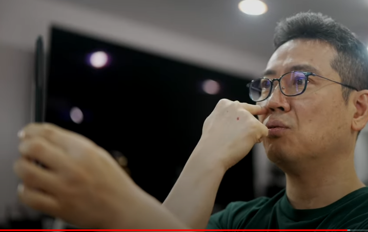

내가 눈을 지금 이렇게 보니까 여기에 양쪽 줄에 음 원기둥의 양쪽에 하이라이트가 쫙 맺히거든. 가운덴 거의 안맺혀요. 여기에 튕기는 빛이 없어서. 그런데 내가 틀잖아? 그럼 옮겨와. 하이라이트가 옮겨옵니다. 저기 빛이 있으니까 튕겨서 내 눈으로 들어오는거지. 그런 것도 알 수 있다고. 하이라이트 맺히는 걸 보고 이 사진을 어느 눈높이에서 찍었고 렌즈가, 어느 눈높이에서 찍었고 빛은 지금 어디서 오고 있다, 이게 재밌는 얘기거든. 이 사진 하나를 보고도 그렇게 생각할 수 있다고. 뒤에 배경이 없고 막 그래도, 이거 어디서 찍은 빛이 어디에 있고, 빛이 중구난방이라고 진짜로 조명이 제 방에 작업실에서 찍은거니까, 작업실에 등이 12개 13개 그 정도 되니까. 그리고 그걸 이제 이건 아이폰으로 찍은걸거에요. 그렇게 찍은거니깐 사실 레퍼런스 그림 그리는 용도로 레퍼런스를 만들기에는 안좋은 레퍼런스 사진이거든요. 조명을 한두개만 쓰거나, 특히 이제 저처럼 초심자가 그림 그릴 때나 이해를 할 때는 그게 훨씬 나은데, 입체감을 살리기에. 얘 지금 하이라이트가 너무 중구난방이거든. 그러니까 입체감을 느끼기가 좀 어려워. 차라리 불을 끄고 몽땅 다 불을 끄고, 한쪽에서만 빛을 이쪽이든지 한쪽에서만 보고, 그리고 사진을 찍었어야 더 정확하게 입체감을 느낄 수 있는거죠.

근데 저는 귀찮으니까 그런식으로 한거고. 그게 정말 중요합니다. 그 블레이드 러너 같은데서 사진을 그렇게 찍을 수 있는게, 블레이드 러너가 어떻게 생겼었냐면, 그 해리슨 포드 나오는 블레이드 러너, 옛날 블레이드 러너 원판. 그 블레이드 러너에서 살인 사건이 발생을 했는데, 욕실에서 아마 죽었을거에요. 근데 찍힌 사진이 있는데, 그 사진에는 그 살인 현장이 안나와. 예를 들면 거실이 이렇게 있고 이쪽에 화장실이 이렇게 붙어있었어. 욕실이. 여기서 살인사건이 벌어졌어. X marks the spot. 여기서 살인사건이 벌어졌는데, 데커 있잖아요. 해리슨 포드는 어디서 찍은 사진을 분석을 했냐면, 여기서 찍은 사진을 분석한거에요. 이만큼밖에 안나왔어. 여기서 찍은 사진을 분석을 하는거에요. 안보일거 아니야. 여기서 벌어진 일이 근데 그 영화를 보면 그게 진짜, 1980년대죠. 그때 그런 상상을 했다는게 놀라운 수준인데, 이렇게 볼 수 있다고 생각을 한거야.  사진만으로도 제가 지금 얘기한거랑 마찬가지거든. 튕겨오는데 빛들이, 그걸 레이트레이싱을 하면 포톤들이 튕겨오는데 광자들이 튕겨오는데 이걸 레이트레이싱을 하는거거든. 튕겨서 튕겨서 튕겨서 당구치듯이 광자들이 튀니까. 

그 뒤에 예를 들면 마란츠 앰프가 있잖아요. 얘가 있는거랑 없는거랑 달라지거든요. 자세히 들여다보면. 컴퓨터나 전자현미경 수준으로 들여다보면 여기서 튕겨오는게, 이렇게 튕겨오거든. 실제로. 빛이 이렇게 튕겨오니까. 그걸 레이를, 빛을, 트레이싱 하는거거든. 레이 트레이싱. 그래서 이 블렌더같은데서 레이트레이싱을 하거나, 엔비디아 rtx 4090도 나왔죠 이번에? 그런걸로 레이트레이싱을 하면 그럴듯 unreal하게 보이는거거든. 이 레이트레이싱을 다하니까. 주변에 사물이 있는것과 없는건 분명히 달라집니다 생긴게. 여기 하이라이트 맺히는것도 달라지고 쉐이딩도 달라지고. 음영 생기는 부분도 달라지고. 조금이라도 영향을 미치게 돼있거든. 그걸 역추적을 하면 아까 생각했던대로, 아까 봤던대로 사건은 여기서 벌어졌지만, 여기서 벌어졌지만, 요만큼밖에 찍지 않은 사진이지만, 그 사진이 빛의 예술이잖아. 빛이 없으면 사진을 못찍거든. 그러니까 여기에 반영이 됐을거라는거지. 여기서 벌어진 사건과 어 영상이라면 더 그런거고. 그게 영상이었던가요? 영상이었을수도 있는데. 사진만 생각해도 그래요. 사진만 생각해도 여기에 어떤 사물과 어떤 사람과 그 사람이 입고있던 옷과 이런거에 따라서도 이 사진은 분명히 달라진다는거지. 단 0.1%라도 달라진다는거지. 레이트레이싱을 해보면. 그런 원리로 그 장면을 찍은거거든. 대단한거거든. 아이디어가 대단한건데 기술력이 무한대로 발전을 한다면, 프로세싱 파워가. 가능한 일이죠. 이 지금 사진에는 살짝 조금만 나와있지만, 얘의 지금 나와있는 endo skleleton,, 옆에 있는 이 endo skleleton,의 전신을 볼수도 있는거지. 이 사진 하나만으로. 가능한 얘기에요. 전제가 뭐냐면, 극한 수렴. 기술력, 프로세싱 파워가 극한으로 수렴한다. 그런다면. 

사담이었는데 뭐 그냥 재밌는 얘기하는거니까. 그리고 이제 손가락의 길이들이 다르잖아요. 이렇게 분석을 했으면, 전 중지 하나만 된다고 생각하거든요 분석은. 법규만 날릴 수 있으면 돼.

법규 날리는 터미네이터를 만들 수 있으면 되니까. 일단 중지를 만들거에요 나는. 중지를 만들면 딱 봐도, 이것도 사람마다 좀 다른데. 얘는 사람이 아니니까 모델에서 찍혀 나오는 애니까. 아무리 다양하게 찍어낸다고 해도 크게 다르진 않을거에요. 그렇게 봤을 때, 제 손을 만약에 기준으로 한다면, 중지보다 왼손으로 기준으로, 오른손으로 기준으로 하면 검지가 살짝 더 길구요. 약지보다. 그리고 마디를 생각해도, 한마디 두마디, 한마디 두마디 그리고 한마디 두마디가 되겠죠? 그리고 요 부근에, 두마디쯤 부근에, 한마디 두마디 핑키 새끼손가락이 이렇게 이어지고. 이것도 손그리는 방법이 있거든요. 이런식으로. 사각형 위에. 다 도형화를 하기 때문에 인체 그릴때. 사각형 위에 살짝 벙어리 장갑처럼, 이렇게 그리는게 있기 때문에. 그리고 여기에는 이런 식으로 삼각형 하나 그리고. 이러거든요. 

요 구조를 만들어 주는거지. 그리고 이 엄지는, 여기는 세마디지만 엄지는 두 마디 밖에 없기 때문에 얘도 지금 두마디잖아요. 두 마디 빨간걸로, 두마디 이렇게 되어있습니다. 그러니까 얘는 이렇게 만들어주면 되는거고. 중지를 하나 만들고, 하나 만들고, 요걸 부품들을 이용을 해서 복사를 해주면 되는거죠. 그리고 길이를 맞춰주면 되는거고. 좀 그건 노가다에 해당하는거죠. 하나를 제대로 모델링을 했으면, 나머지는 노가다에 해당하는건데요. 엄지만 좀 다형성이 있을거고. 마찬가지입니다. 상속성 기반을 만들고 중지 하나를 만들어서. 상속성 80% 먹고 들어가고. 다형성이라는게 뭐야? 중지랑 다른점? 길이가 다르다. 검지, 약지, 핑키, 새끼손가락은 길이가 다른거 뿐이고. 그리고 얘의 다형성, 엄지의 다형성은 이걸로 그대로 복사를 해서 만든다고 해도 마디가 두개뿐이다? 그리고 두께가 다르고 그리고 이 finger tip도 보면, 두께들이 다 다르거든요.

중지가 제일 크고, 이 새끼손가락은 작아야 되잖아. 중지가 이만하다면 이거 대충 비율을 생각해야겠죠. 약지는 요정도 되야되니까. 새끼손가락. 이런 식으로. 그리고 엄지는 얘보다 커야죠. 중지보다 더 커야되니까 훨씬 더 커야지. 그렇게 생각할 수 있는거죠. 그리고 검지는 이 정도. 그럼 분석은 거의 끝난거야. 복잡해 보여도 일단 큰 그림으로 덩어리를 보고, 하나 둘 셋 넷 다섯개. 하나 둘 셋 넷 다섯개 이렇게 생겼다 벙어리장갑을 하나 그리고 이렇게 생겼다. 그런데 이 부분은 지금 piston만 있는거고. copper plate가 있다. 그리고 구멍이 다섯개 뚫려있다. 거기서 piston이 나간다 이거 다 알았고. 중지 기준으로, 하나 둘 뼈대가 세개가 있고. 여기 ㄴㄱ이든, 아니면 H든, H로 할까 간단하게. 이렇게 마디를 박아주면 된다. 그리고 여기에 piston이 두개가 있는데. 하나는 오므리는 piston이고. 이거보다 작은 piston은 고정하는 piston이다. 이제 안보고도 그리잖아요.

상속성, 인간의 손에서 상속을 받아서 얘의 다형성을 이제 이해를 했으니까 완전히. 그릴 수 있어야 돼. 그릴 수 있어야 모델링이 가능해요. 이러고 나면 이제 블렌더 들어가서 직접 맨땅에 헤딩을 해도 되는거고. 보이거든 형태가. primitive들이 보이잖아. 어떤 도형을 가지고 만들건지. 대부분은 실린더일거거든요. 기본 실린더, 기본 실린더, 실린더 다 보이잖아 다 실린더잖아. 그리고 플레인, bevel 주는 플레인 또는 큐브, 사실은 이 큐브 하나로 다 돼. 세상에 곡선은 없으니까. 이거를 곡선으로 만든거잖아. 실린더가. 이거 bevel을 많이 주든가. 이 vertex를 4개가 아니라 뭐 32개 이런 식으로 준게 얘거든요. 실제로 그렇게 만들수도 있고 블렌더에서. 그러니깐 큐브로도 다 만들수 있는거에요. 이 판떼기도 큐브를 짜부내면 되니까 이렇게. 얘가 원래 이렇게 생겼었는데 이 위쪽으로 짜부내면 되는거잖아. 두께를 줄여서. 굉장히 줄여서. 그럼 얘가 되는거죠. 이거 bevel 주면 되니까. 큐브 갖고 다 만들겠네. 여기 또 큐브 하나 붙이고. ㄱㄴ 그 형태 만들 수 있고. 그리고 이 축이라는 것도 큐브로 또 실린더를 만들면 되는거고. 도르래축. 볼트 너트도 마찬가지고. 

근데 그 단축키에 해당하는거지. 단축 숏컷에 해당하는거죠. 실린더가. 큐브에서 실린더로 갔다가 하는거보단 그냥 실린더 만들면 되니까. 그 기본 도형을 이미 블렌더가 제공을 하니까. 그렇게 만들면 되는거죠. piston? 뭐 당연히 실린더로 만들어주면 되는거고. 얘는 꺾어주면 되는거고. 스트링을 만들고 싶다? 커브로 만들면 되는거고 떠오르잖아요. 커브에다가 solidify 주면 되는거고. 다 만들었네 뭐. 상상으로 만들수 있어야 돼. 상상으로 만들 수 있는 정도가 되면, 그렇게 어렵지 않게. 좀 엉성하더라도 프로는 아니니까. 엉성하더라도 모델링은 가능하다는거지. 

그럼 다음시간에 실제로 모델링을 해보겠습니다. 이해는 했으니까, 100% 이해는 아니더라도. 분명히 실전이랑은 달라. 이것도 제가 잔소리를 하려는 건 아니고. 그 과거에 썼던 영어책에 '안차바'라고 했거든. 안차바. 그리고 맨날 연구만 하는거야. 안차바라는 축구선수는. 분석만 해. 공부만 해. 그리고 모델링을 안해봐. 실제로 그려보지도 않고 머리로만 생각하는거야. 뭐 저렇게 생겼겠지 뭐. 실린더 붙이면 오케이 실린더 실린더? vertex 32개짜리? 64개짜리? 난 알어. 이해만 하는거야. 공을 안차봐. 왜냐면 머리로는, 이렇게 이해를 해도 실제로 블렌드에서 해보면 안되는게 생겨. 이해한거랑 다른 부분들이. 그런 부분에서 트러블 슈팅을 하고 그러면서 또 성장을 하는거거든요. 

이론과 실제는 다르니까. 지금 이건 이론으로만 생각을 한거야. 블렌드에서 이렇게 될거다, 안되는 부분도 있을거거든. 그리고 지금 rigging을 생각을 안한거거든요. ㄴㄱ이 rigging에 편할건지, 이렇게 생긴 형태가 rigging에 편할건지도 생각을 안했고. 피벗 포인트 잡는 것도 그냥 그렇게 될거다라고 생각을 하는거지, 실제로 피벗 포인트 잡아봤더니 그렇게 안될 수도 있는거거든요. 공을 차봐야 돼. 인사이드킥 이렇게 차야 되는거라고 이론만 막 하는게 아니고 차봤는데 그렇게 안들어가네? 그리고 바람을 계산할 수 없거든. 바람의 방향 이런거. 정말 잘차는 선수들은 그거 감안할걸요? 바람? 모형을 만든다는 건 늘 그런식이니까. 에어로 다이내믹, 자동차를 만들건, 비행기를 만들건 바람은 없다에서 출발하니까. 단순한 모형에서. 저도 지금 단순화해서 생각하는거니까 단순한 모형에서 출발하는거니까, 더 복잡하게 가려면 현실에 적용을 하려면, 변수를 추가해야되는거잖아. 바람도 있다. 

그럼 바람을 생각해서 스나이퍼 라이플도 마찬가지잖아요. 조준경 있을때, 목표물이 여기 있어? 이거 안맞어. 이렇게 하면 절대 안맞어 이걸 사실적으로 요즘 게임들이 만들잖아. 여기 목표물이 있을때 조준경이 이렇게 돼있더라도 포물선을 그리면서 갈테니까. 총을 쏘는 놈이랑, 타겟이랑. 이렇게 갈테니까 당연히. 실제로 실전에서도 그렇게 쏘는거고. 이거 조준경 아래로 내리고 쏴야되거든. 대부분 이렇게 내려야지.

여기서 이렇게 내려가는걸로. 이것도 고저에 따라 다르죠. 타겟이 어디에 있느냐에 따라 다른거죠. 그리고 또 뭐가 다르냐면, 바람이 이쪽에서 분다 그럼, 실탄이 날아가다가 트니까. 그럼 또 이쪽에서 이렇게 쏘아줘야되는거고. 바람에 맞게. 뭐 그 스나이핑 게임같은거 중에서 정말 현실적인건, 말도 안되는거까지 다 계산해야되는거고. 바람은 없다에서 출발하면 여기다 0점을 맞추는거고, 그런거죠. 바람이라는 변수를 추가하면 얘기가 다른거고. 손떨림 이것도 생각하면 또 얘기가 다른거고. 그런 것처럼 지금 생각하기에는, 단순히 여기 실린더 붙이고 뭐 이렇게 하면 되겠다. 실전에 들어가보면, 다음시간에 해보겠지만 그대로 안됩니다. 그대로 안되기 때문에 '안차바'라는 선수가 '잘차'라는 선수로 발전을 하려면, 실전을 졸라 해봐야되는거지. 실전을. 제가 지금 그렇게 실전을 하는거야. 머리로만 공부하는게 아니고. 

특히 나이들면 그런 나쁜 습관이 들기도 해요. 공부만 해. 책만 봐. 예전에도 저 이렇게 컴퓨터 코딩 공부하시는 분들, 저는 이제 컴쟁이 출신이니까 코딩하시는 분들 중에 특히 나이 들어서 코딩 공부해보겠다는 분들 중에 그런 분들 많았어요. 누워서 책만 보는거야. 한번도 쳐보진 않고, 입력은 안해보고. 그거 그대로 안 돌아가거든. 혹시 코딩을 해보시는 분은 공감을 하시겠지만. 그대로 안돌아가. 분명해. 이게 그대로 했는데 왜 안되지? 거기서 트러블 슈팅을 하는거거든. 그게 성장포인트인거거든. 

다음시간에 아마 저는 많이 성장할거에요. 왜냐면 이대로 안될거거든. 경험을 통해서 알고 있어. 그대로 되잖아? 그럼 세상 너무 쉽지. 분명히 그대로 안될거거든. 현실 속에서 이론만으로, 상상만으로 미리 예측할 수 없는 장애물이 생긴다고. 

이해하시는데도 도움이 많이 될거고 생각도 많이 달라질거고. 현실세계를 보는 눈도 많이 달라질거고. 그래서 제가 늘 강조하는공부만 하는게 아니다, 그렇게만 공부하는게 아니고, 세상을 공부한다는 건 호라이즌을 넓혀간다는 거, 그게 세상을 폭넓게 다각도로, 오픈마인드로, 마음을 열고 그렇게 공부를 하는거거든요. 

특히 제가 좀 조심스럽지만, 제가 참견을 하는걸수도 있으니까. 그런데 이제 저는 아이들도 그래야한다고 생각하거든요. 학교 공부만 너무하면, 조심스럽지만 학교공부만 너무하면 편협하게 세상을 바라볼지도 몰라요. 그렇게 배울 위험도 있기도 하고. 그러니까 좀 다방면에서, 그렇게 생각을 해본다는, 그런 기회로 삼아볼 수도 있고. 여러 각도에서 한번 생각을 해볼게. 

특히 어저께 테슬라 AI 데이라고 그 AI가 인공지능이라는 말이에요. 알죠? 서우하고 아인이도 그정도는 알거 아니야. Artificial Intelligence를 번역을 한거거든. 인공, 지능. 그러니까 인위적으로 만들어낸 사람이 만들어낸 지능인거죠. 원래 그 로봇이나 이런 애들이 실제 지능이 있는게 아니고.

사람이 만들어서 집어 넣어 주었다는거지. 그래서 인공지능이잖아요, AI. 그래서 AI 데이라는 데서 Optimus 라는 로봇, 로봇인데, 휴머노이드 로봇, 그러니까 휴머노이드 로봇이라는 건, 인간을 닮은 로봇을 만들어서 공개를 했거든요. 그리고 스펙이 나왔거든. 사양, 어떻게 만들어져있는지. 구체적인 사양이 나왔는데, 하나 짚고 넘어갈게요, 서우나 아인이. 영어를 쓰는 이유가 있어. 이 바닥에선 다 영어를 써. 영어가 편해, 영어를 해야 편해. 그러니까 우리말 너무 고집하지 말고. 특히 음악, 컴퓨터, 디지털 이런 분야, 영어를 좀 많이 외래어틱하게 쓴다 라는 분야가 있으면 그쪽에 그렇게 적응하시는게 훨씬 편해. 우리말 고집하지 말고. 예를 들어 3D 배운다, 블렌더 배운다, 90%가 영어예요. 그걸 너무 힘들어하지 말고 영어 단어가 하나 나올때마다, 그 조각 그림 하나하나를 내걸로 만든다고 생각을 하고 접근을 하면 영어공부 할 때도 훨씬 도움이 많이 될테니까, 그렇게 생각을 해주세요. 

그래서 이제 그 테슬라 AI 데이에 나오는 옵티머스의 사양을 한번 볼게요. 사양을 한번 보시면, 호라이즌이라는게 얼마나 중요한지, 그래야 그게 이해가 될테니까. 호라이즌이라는게, 포개져서 내가 여태까지 쌓아온 배경 지식이나, 이 세상을 이해하는 그 능력, 그런 것들을 막 쌓아왔을거 아니에요. 게임으로 따지면 레벨업을 해왔을거 아니야. 그 레벨업을 해온 범위가 있을거 아니에요. 그걸 넓혀가는걸 호라이즌을 넓힌다고 하는거에요. 그렇게 호라이즌을 넓히는데, 여태까지 호라이즌을 넓혀온 부분, 그게 있잖아요. 그 넓혀온 부분, 그걸로 이해를 할 수가 없으면, 더 넓혀야 된다는 거잖아. 그걸 이제 좀 어려운 말로 하면, 이건 눈높이를 살짝 높여서 객체지향성이라고 얘기를 하는거고. 객체지향성의 공통분모를 바라보는 눈, 공통분모를 찾아내는 인간의 능력이 있는데, 아무리 복잡한걸 보더라도. 그걸 상속성이라고 하거든요. 지금까지 내가 공부한 바, 그 범위 그 호라이즌에서 상속을 받는거에요. 공통분모를 가져오는거라고. 공통분모를 가져와서 이해하는 눈으로 만드는거죠. 그리고 거기서 추가로 이해할 부분을 다형성이라고 합니다. 포개지는 부분 거기서 더 추가된 부분, 그것만 이해를 하면 되니까.

그러니깐 아인이나 서우가 이해하기에는 그렇게 생각하면 돼. 휴머노이드 로봇을 봤는데 이해가 쉽게 되는 이유가, 휴머노이드, 인간을 닮았으니까 인간 닮은 모습,

endo arm이라는 것도 사람의 손을 닮았으니까, 터미네이터가 그걸로 이해하기 쉽잖아요. 손가락이 다섯개다, 이걸 상속성이라고 한다고. 그걸 영어로 inheritance라고 하는거고. 근데 작동원리나 이런게 조금씩 다르거든요. 조금씩 다르다고? 다른 부분, 그 다른 부분을 다형성이라고 한다고. 다형이라는 말이, 여러 면이라는 뜻이에요. 형태가 여러개다. 사람도 저마다 다르잖아. 서우하고 아인이도 다르잖아. 같은 부모님 자녀인데. 서로 개성이 있고, 그렇게 생각하시면 돼요. 개성이라고 생각하면 돼. 다형성 그래서 polymorphism이라고 해요. 다형성이라는걸. poly라는거 여러개라는 뜻이고. morphism의 몰프라는게, 형태라는 뜻이거든요. 그래서 polymorphism이, 형태가 여러개다야. 형태가 여러개다. 개성이 많다. 저마다 개성이 있다 그 뜻이거든요. 

그러니까 객체지향성이라는 말은 쉽게 이해를 하면 진화론에 가깝거든요. 진화를 해나가는거야. 다형성을 추가해서 진화를 해나간다고 생각을 하면 돼요. 그러니까 서우하고 아인이도, 부모님 부모님한테 상속을 받는다고. 상속을 받는다는게 유산을 상속받는다거나 재물을 상속받는다는 개념으로 이해하면 어렵고. 진화를 한다는 개념으로 이해를 하면 편해요. 유전, 유전을 받는다고. 그래서 갖고 태어나. 많은걸 부모님이랑 닮아있고. 닮은 부분이 있을거 아니야. 엄마 아빠랑 닮은 부분이 있고 아버지가 만약에 곱슬머리면, 아들도 곱슬머리거든. 저도 그랬으니까. 그런 부분이 있어요. 갖고 같이, 그렇게 태어나는거 유전을 받는거. 그걸 이제 컴퓨터쪽에서 그렇게 번역을 한거야. 상속성이라고. 원래는 진화에 가까운건데. 

그런데 아인이나 서우만의 개성도 있잖아. 완전히 똑같진 않잖아. 그 개성을 다형성이라고 한다고. 뭐 그렇게 생각하시면 돼요. 그래서 그런식으로 이제 바라볼 수 있는거야. 휴머노이드 로봇을 볼 때도, 아 저건 인간이랑 닮아있네 라고 이해하는. 모든 인간이 그런 능력이 있어. 복잡한 사물을 봤을 때도, 공통분모를 알아채고, 개성을 추가해서 이해하려고 노력하는. 그 습성이 있거든요. 이제 그걸 의식적으로 갈고 닦으면 더 자세하고 빠르게 볼 수 있다라는 거지.

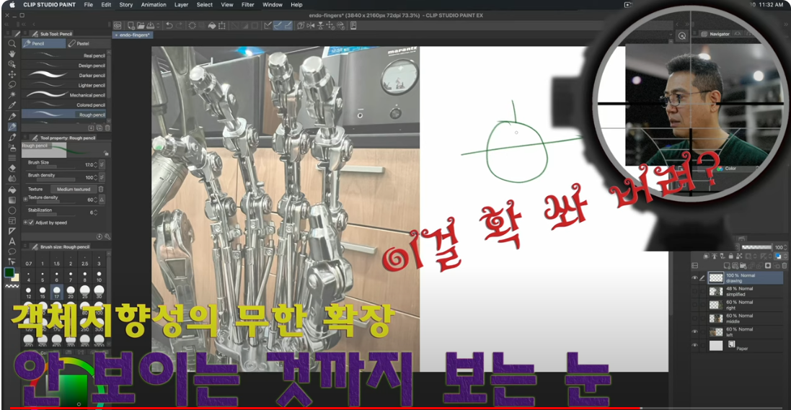

원래 탑재된 기능인데 인간의. 갈고 닦지 않으면, 갈고 닦지 않으면 좀 무뎌지거든요. 모든 능력이 그래서 제가 객체지향성을 자꾸 의식적으로 생각을 하라고 하는거고. 그래서 만약에 지금 제가 키워드를 뭐라고 넣었냐면, 테슬라 optimus 11 degrees of freedom이라고 넣었어요. 

어저께 본 사양 중에 하나니까. 그래서 보는게 hands를 보면 지금 테슬라 옵티머스의 자유도라는게, 얼마나 자유롭게 움직일 수 있느냐야 쉽게 얘기하면. 자유도라는게. degrees of freedom이라는게. 이걸 이제 degrees of freedom이 딴 데서도 써요. 통계에서도 사용을 하는데, 통계에서도 degrees of freedom이라는 말을 쓰기 때문에 거기서 자유도라는 말을 쓰기 때문에. 그냥 degrees of freedom이라고 찾으시면 wikipedia 같은 데서도 괄호치고 나오잖아, 문맥이. statistics 통계에서 찾는 자유도와 이런쪽 엔지니어링이나 3D 쪽에서 찾는 자유도가 다르기 때문에, 그게 문맥의 중요성이에요. 똑같은 말이지만 문맥이 다르다고. 지금 제가 말하는 degrees of freedom은 statistics랑 관련이 있는게 아니고 엔지니어링이나 3D 이쪽에 관련이 있는거야. 그래서 지금 11 degrees of freedom이라고 테슬라 옵티머스 설명을 할 때 스펙에 그렇게 나와 있는데, 가장 익숙한 표현은 6 degrees of freedom, 3 degrees of freedom일거에요. 많이들 들으실 수 있을거야 앞으로. 왜냐면 이런 제품들이 많이 나올거거든 앞으로도. 지금은 낯설게 느껴지실 수도 있지만, 자유도라는 개념이. degrees of freedom이라는게. 그래서 보면 지금 테슬라 옵티머스, 어제 발표한 옵티머스의 사양에 나와있는 걸로 보면, 손은 11 degrees of freedom이구요. 그리고 온몸을 봤을 땐 28 degrees of freedom이에요. 자유도가 28단계까지 올라갈 수 있다는 거구요. 굉장히 높은 건데, 30 degrees of freedom, 30 그 정도 가면 굉장히 정밀해지는 거거든요. 손을 볼게요.

그러니까 아인이하고 지금 서우도 저렇게 어려운 것까지 알아야 되나 몰라도 돼. 몰라도 되는데 endo arm endo finger 움직일 때 이게 자유도라고 그걸 이해하면 더 편해. 앞으로 더 복잡한 기계를 이해할 때, 훨씬 편하게 이해를 할 수 있거든. 그 얘기를 해주고 싶어서 그래. 너무 어렵다 싶으면 나중에 아버지한테 더 물어봐. 그러니까 이 hands를 보면요. specifications라고 나오잖아요. 스펙 줄여서 스펙이라고 하는거야 아인아 서우야. 스펙 쌓는다고 그러잖아 언니 오빠들이. 입사시험 보고 이럴 때 자격증 막 따고 그런다고 하잖아. 스펙 쌓는다는 것도 이 스펙을 말하는 거거든. 문맥이 좀 다르지만. 어쨌든 스펙이 이렇게 나와있어요. six actuators, 영어가 왜 중요한지도 느껴봐. 아인아 서우야. 

six actuators, 11 degrees of freedom, adaptive grasp non back drivable fingers 그리고 이제 퍼포먼스를 보면, 성능을 보면, 퍼포먼스는 성능이에요. 퍼포먼스, 컴퓨터의 성능, 퍼포먼스 좀 더 세게 얘기하면 thorough put, 이런 말을 하거든요. 뭐든지 성능 얘기를 하고 싶으면, perform이라는 게 뭔가를 수행하는 거거. perform 한다는 게. 인간도 perform을 할 수 있어요. 아인이나 서우도 perform을 할 수 있다고. 이걸 잘하잖아? 그럼 성능이 좋은 거잖아. 여러분 포텐을, 포텐은 potential의 약자고. 포텐이라는 게, 잠재력의 약자라고요. 가능성의 약자. 걸 십분 발휘를 하면, 거의 100% 발휘를 하면 퍼포먼스가 좋은 거거든요. 어른들이 이제 영어를 많이 섞어서 그렇게 써 퍼포먼스가 좋다고. 그것처럼 퍼포먼스를 보면 carry a 20lb bag 20 pound 이 영어권 미국 친구들이 미국 회사니까, 미국 친구들이 그 우리랑 계량하는 방법이, 단위가 다르거든요. 도량형이 다르다고 하죠. 여러분들 역사 공부할 때 아인이나 서우도 역사 공부할 때 도량형 통일 뭐 이런 걸 할 거야. 시험 볼 때 꼭 나오거든. 1번 2번 3번 4번, 이 왕이, 이 황제가 하지 않은 것은 중에 도량형 통일 이런 거 있거든. 그런 거 중에 하나예요. 도량형이라는 게 틀리면, 다르다고 해야죠. 틀리다는 말은, 틀린 말이야. 미국하고 우리나라하고 도량형이 달라서 우리는 킬로그램을 쓰잖아. 이걸 metric system이라고 하는데. 미터법을 쓰고, 미터법을 쓴다고. 근데 저 미국은 imperial 법이라는 걸 쓰거든요. 저 친구들이 파운드 쓰고, 그리고 마일 쓰고, 그러잖아. 몇 마일을 갈 수 있다 이런 말을 쓰니까, 그래서 도량형을 환산해야 되잖아. 불필요한 과정을 거쳐야 되잖아. 그래서 도량형을 통일하는 거야. 효율적으로 살기 위해서. 벌써 20파운드 그러면 헷갈리거든. 저도 헷갈려요. 이건 구글 같은데 찾아봐. 변환할 수 있으니까. 아인이나 서우도. 킬로그램으로 변환을 하면, 20파운드가 어느 정도 무게인지 알 수 있을 거야. 그 정도 되는 20파운드 정도 되는 가방을 들 수 있다는 거예요. 저 옵티머스라는 녀석이. 

그리고 use tools 툴이라는 건, 도구를 말하고요. 이건 프로그램 같은 거 쓰면서도 많이 봤죠? 포토샵 같은 거에서도 도구라고 하잖아. 도구창 할 때 그 툴 그걸 말하는 거고. 그러니까 도구를 쓸 수 있는 수준이라는 거고. 도구를 쓰려면 어떻게 해야 되겠어? 인간이 어떻게 도구를 쓸 수 있어? 동물들이랑 다른 점, 동물 중에서도 인간만큼이나 도구를 잘 쓰는 녀석이 있어. 원숭이, 왜? 손이 있으니까. 그럼 여기서 좀 생각을 해봐. 조금만 더 나아가보면 자유도가 높으니까라고 그럴듯하게 표현할 수 있는 거야. 친구들한테 인간이 손이 있으니까 도구를 쓸 수 있는 거야 이러면 이제 조금 저렙인 거고. 고렙인 척 하려면 자유도가 높아서 그래 그렇게 해주시면 돼요. 친구들한테 이렇게 좀 자랑하고 싶을 때. 자유도가 높아서 그래. 손의 자유도가 높으니까 도구를 좀 정교한 도구도 잡을 수 있다는 거야. 바느질도 할 수 있고. 

그러니까 또 도구 쓰는 녀석 중에, 제가 본 녀석 중에 제일 와우 했던 녀석이 까마귀거든요. 까마귀가 부리, 이걸로 별짓을 다 합니다. 그 녀석은 부리가 자유도가 높은 거지. 자유도가 높다는 게 꼭 인간의 손만으로 침팬지의 손, 원숭이의 손, 오랑우탕의 손 그것만으로 도구를 쓸 수 있는 건 아니니까. 도구를 쓰는 동물들이 굉장히 많은데 뭘로 쓰느냐, 입으로 쓰느냐 발로 쓰는 친구들도 있으니까. 그런 동물들을 보면, 그 부위의 자유도가 높은 거죠. 이제 이해되죠? 

precision grip for small parts, small parts는 알겠지. small 작은 거고 parts는 부분 부분을 말하는데, 이런 걸 보면 부품이라고 할 수 있어요. 부품이라는 게 전체에, 장난감 같은 걸 봤을 때도 부품을 가지고 만들잖아. 조립할 때 하나하나의 부품을 part라고 하거든. part one, part two, part three 알겠죠. 그럼 parts가 되니까 복수잖아. small parts 작은 부품들, 작은 것들을, grip하는 게 잡는 거야. 이렇게 grip 하는 거거든. 그거를 precision grip이면 아주 정밀하게 잡는 거야. precise하다는 말의 명사형이에요. 그래서 precise, precision, precise하게 아주 정교하게 바느질할 수 있을 정도로 그렇게 잡는다는 거야. 아주 작은 핀 하나도 이렇게 잡을 수 있다는 거야. precision 이걸 이제 산수에서 들어가면. 산수? 수학은 아닐 거야. 산수에 들어가면 정밀도라는 말도 써요. 정밀도. 그거 있잖아. 4사5입을 할 때, 반올림을 할 때 0.009 이거를 반올림을 하면, 0.009 반올림하면 0.01 이어야 되잖아요. 그런 게 정밀도야. 얼마나 정밀하게 표현을 할 건가. 0.01하고 분명히 0.009하고는 다르거든. 0.009가, 반올림을 안 한 녀석이 훨씬 정밀한 거잖아요. 그러니까 로켓 같은 거 쏘아 올리고 계산을 할 때 정밀도가 약하면, 정밀하지 않으면, 각도가 빗나가거든. 지구에서 멀어질수록. 그렇게 해서 잘못돼서 정밀도 때문에 로켓이 박살나고 그러는 거야. 표현을 조심하려고, 뽀개진다고 하려고 했는데, 자제할게. 표현을 많이 자제할게. 로켓이 박살나는 이유 그런 거야. 계산을 4사5입을 하는 이유가, 반올림을 하는 이유가 편하게 하려고 하는 건데, 정밀한 계산이 필요한 그런 과학 분야가 있을 거 아니에요. rocket science라고 하는. 로켓 쏘아 올리고 우주선 날려보내고 그런 걸 할 때는 정말 정밀해야 되거든. 그러니까 원주율 같은 거 계산할 때도, 우리는 그냥 대충 평균 내서 퉁 쳐서 3.14, 이렇게 얘기하잖아. 원래 그게 정밀하게 얘기하면 3.14 이러고 무한으로 나가는 수거든. 그걸 서른 몇 자리씩 계산을 하는 거지. 소수점 서른 몇 자릿수씩 계산을 해야 로켓을 제대로 쏘아올 수 있는 거지. 안 그러면 지구에서 많이 벗어났을 때 오차가 심해진다고. 점점 심해진다고. 반올림을 했으니까. 그걸 정밀도라고 해요. precision 너무 멀리 가고 있죠. 어쨌든 precision grip for small parts 그 정도로 정밀하게 잡을 수 있다는 거야. 기술력 자랑을 하는 거야. 

그리고 이제 실제 아래 부분을 봐야 좀 이해가 쉽기 때문에, 그리고 이제 specification, 스펙으로 가볼게요. 스펙으로 가보면 six actuators라고 하죠. actuator act에서 나온 걸 거 아니야. 이게 상속성이에요. 액츄에이터가 모르는 단어야? 액트는 알잖아 아인이 서우도. 액트 그래서 액트 하는 사람들을 뭐라 그래? 액터, 배우라고 하잖아. 액트 하는 사람들이니까 행동으로 뭔가를 보여주는 사람들이니까 액터인 거야. 이걸 명사형으로 하면 어떻게 돼? 액션. 그래서 행동이 많은 영화, 액션 영화 그렇게 이해를 하는 거라고. 벌써 이해할 수 있는 발판이 쉽게 마련이 되잖아. 그걸 상속성이라고 한다고. 여기에서 액츄에이터라고 하면, 액츄에이터 부분 그 부분이 다형성인 거잖아. 얘만의 개성, 액츄에이터라는 단어만의 개성이잖아. 그걸 포착을 하는 거라고. 액트는 아니까 뭔가 행동을 하게, 행동을 하는 건데, 영어를 좀 나중에 공부를 해보시면 알지만 이게 외부 요인, 자동과 타동의 차이거든. 내가 스스로 움직이느냐 아니면, 밖의 외부의 힘에 의해서 움직여지느냐 이 차이거든요. 영어 공부해보시면 수동태 있잖아. 지금도 하나? 능동, 수동 내가 움직이는 거냐 움직임을 당하는 거냐. 내가 스스로 죽느냐, 표현이 좀 그런가, 쉬우니까 그게. 이야기 쉬우니까 게임한다고 생각해. 내가 죽는 거냐, 플레이어가 죽는 거냐 아니면 몹한테 당해서 죽임을 당하는 거냐. killed 되는 거냐, he is killed하고 he kills는 다르잖아. 그런 걸 생각을 하시면 돼. 스스로 행동을 하는 거냐, 외부의 힘에 의해서 행동을 하게 되는 거냐. actuator 한다고 하는 게 그런 느낌이 있거든요. 뭔가 행동을 하게 만드는 거야. 대상을 act하게 만드는 거지. actuate 한다는 말이. 동사가 행동을 하게 만드는 거, 구동을 한다고 하거든요. 그리고 이제 or 붙잖아. 또 행위자를 나타내는 거잖아. act에서 actor가 되는 것처럼. actuator잖아. 구동기 뭐 이런 게 되는 거지 우리말로 하면. 행동을 하게 해주는 무언가잖아요. 그런 소자나 부품이라는 거잖아. actuator 구동을 해주는, 뭔가를 움직여주는, 손가락을 움직이거나 아인이나 서우도 봤죠. endo 핑거 움직이는 거> 내가 갖고 있는 모형 움직이는 거? 이거 움직이려면 모터 같은 거 있어야 되잖아. 그건 이해하시겠지. 모터 같은 게 있어야 되는데, 얘가 어떻게 움직이는 거, 이거 제어하는 모터라고. 그냥 단순한 모터가 아니고, 얘의 움직임을 제어할 수 있는 act를 actuate 할 수 있는, 움직임을 제어할 수 있는 구동기 같은 게 들어 있다는 얘기야. 그게 여섯 개가 들어 있다는 거죠. six actuators. 그런 식으로 이해하는 거예요. 어르신분들도 어른분들도 마찬가지야. 그렇게 모르는 단어라도 그렇게 보는 거야. 그냥 생판 모르는 단어가 아니고 상속성이 있다고. 그걸로 이해하는 거야. 

eleven degrees of freedom 이제 degrees of freedom 나왔죠. 이게 제일 중요한 개념이니까, 나중으로 하고요. 나중에 다시 설명을 하고. adaptive grasp는 알겠죠. 그립은 꽉 잡는 거고, grasp는 이 정도 잡는 거야. 살짝. 그립은 완전히 정밀하게 잡는 거고. 힘을 꽉 줘서 잡는 느낌, 그게 그립이야. 누군가가 여러분을, 아인이나 서우도 누군가가 그립으로 잡으면 아플 거야. 그 정도의 느낌이고. grasp는 이렇게 좀 꽉 잡는, '거기 가면 안 돼' 아빠 엄마가 이렇게 손을 잡을 때도, 이 정도 잡으면 grasp 정도에 해당하고, 정말 꽉 잡으시면, 그게 grip에 해당하는 거에요. 그래서 grasp라고 하면 이걸 비유적으로 말할 때도 사물을 잡는 것만 grasp가 아니고, 개념이나 이해, 뭔가를 이해를 하려고 할 때, 지금도 마찬가지야. 내가 설명한 상속성이나 이런 거를 여러분들이 이해를 했잖아? 그걸 뭐라고 표현하냐면 understand만 쓰는 게 아니고, grasp라고 한다고 잡았어. 감 잡았어. 그거야. 감을 잡은 거야. 그래서 grasp한 거거든. 

그걸 다른 표현으로 쓰면, 문맥이 달라지는 거죠. 문맥이 달라지는 데서 쓰면 grasp라는 게 이해한다는 말로도 쓰는 거야. 그래서 절대 아인이나 서우야, 절대 grasp는 이해하다, understand 이해하다 이러고 외우면 안 돼. 전혀 그림이 달라 understand은 그냥 일반적인 표현인 거고, understand? grasp는 이해를 아주 잘한 거야. 우리말도 비슷한 게 있어 파악하다. 나 그거 간파했으, 파악했으, 그랬을 때 파악하다는 말이 어떤 말이냐면, 손으로, 손아귀 악자거든. 손으로 잡았다는 거야. 꽉잡았다고. '제가 꽉 잡고 있는 분야가 있어요' 이런 표현도 쓰잖아. 모든 인간이 비슷해. 영어권에서도 grasp를 쓰면 우리도 그런 말을 써. '제가 꽉 잡고 있는 분야죠' 자기 전문 분야라는 뜻이잖아. grasp하고 있는 분야라는 뜻이야. 영어로도 그렇게 얘기를 해. grasp 하고 있는 분야.

adaptive grasp잖아요. adapt는 응용을 하는 거고, 적용을 하는 거고 적응을 하는 거야. 적응해나가는, 그러니까 어떻게 얘기하면 편할까. 어댑터, 어댑터. 많은 어른들이 아답터라고 하실 거야. 아답터라고 하실 텐데, 어댑터라고 하는 거 있잖아요. 110볼트 120볼트 어댑터 이러는 거. 젠더라는 말도 쓰는데. USB 젠더 이런 말 쓰잖아. 그 젠더는, 성을 바꿔준다는 개념이야. 젠더가 성이니까. 남녀 얘기할 때, 남녀 성을 얘기할 때, 젠더라는 말을 쓰거든. 그런 것처럼 이게 암수를 바꿔주는 개념, 아니면 요즘은 형태를 바꿔주는 것도 젠더라고 쓰지만. 그런 식의 개념으로 젠더를 쓰는 거고. 어댑터라는 거는, 어댑트를 시키는 거야. 110볼트인데 내가 220볼트에 꽂아야 되면, 변환을 해서 어댑트 해야 되잖아요. 그래서 어댑트라는 말을 쓰는 건데, 역시 어댑터라는 말을 쓰는 건 아까 액트, 액터 거기서 또 상속을 받으면 되잖아. 어댑트 플러스 or 어댑터 적응을 하게 해주는 것 그렇게 생각하면 되잖아. 행위자니까. 그렇게 이해할 수 있어. 근데 adaptive야, adaptive. 액트에서 또 해볼까? 액트에서 개성을 부여해서, 형용사를 또 하나 만들면. 액티브가 되잖아. 활동적인 뭐 이렇게 얘기할 때. 액티브 그것도 활동적인이라고 외우면 안 돼. 액티브 한 건 그냥 액트의 형용사인 거야. 그걸 그림으로 다 생각을 해야 되니까. 액티브는 활동적인 그렇게 생각하시면 안 되고, 그냥 액티브 한 거야. 액트를 많이 하는 듯한, 틱한, 뭐 그런 느낌인 거거든. 액티브가. 근데 어댑트, 적응을 하는, 형용사인 거잖아. adaptive. 적응할 수 있는, grasp. 그러니까 어떤 뜻이냐면 어른들이 여러분들 손을 이렇게 잡을 때, 아인이나 서우 손을 이렇게 잡으면, 힘 조절을 못한다고. 그래서 좀 아프게 잡을 때도 있잖아. 그럴 거야 아마 아빠도. 그럴 때가 있을 거야. 그거를 adaptive하게 잡으면, '아 얘는 아이니까 이 정도로 잡으면 아프겠구나' 그래서 살짝 느슨하게 잡아준다거나, 그게 adaptive grasp야. 도구도 그럴 거 아니야. 아주 약한 거, 약한 도구, 두부 같은 걸 이렇게 손으로 잡는다면 살짝 잡아야 되잖아. 안 그러면 부서지니까, 그렇잖아요. 그걸 할 수 있다는 거야. adaptive grasp, grasp로 꽉 잡는 게, 무조건 꽉 잡는 게 아니고. 무조건 꽉 잡으면, 기술력이 떨어지는 거야. adaptive grasp니까. 살짝도 잡을 수 있고, 꽉도 잡을 수 있고. 힘 조절이 가능한 녀석이라는 거야.

그러고 나서 Non-backdrivable fingers 이 말은 찾아보셔도 되는데 backdrivable 이라는 게 뭐야. 그냥 생각했을 때 백드라이브, 드라이브를 하는데 forward, 앞으로 갈 수 있고 뒤로 갈 수도 있잖아. 드라이브 백도 할 수 있는 거잖아. 거기서 나온 거잖아. 상속을 받으면 돼. 드라이버블이잖아. able이잖아. 가능하다는 거잖아. 이것도 이해하기 쉬운 거고. Non backdrivable이면 Non이 앞에 붙으면 반대 표현이잖아. 부정을 하는 거잖아. Non backdrivable, 뒤로는 갈 수 없다는 거죠. fingers가. 쉽게 이해할 수 있어. finger는 앞으로만 오므려집니다. 뒤로 못 가요. 이게 뭐 대단한 거냐라고 생각할 수 있는데, constraint라는 개념이 생겨요. constraint 이것도 어려운 표현이야. 서우나 아인이는 아마 고등학교 때까지 거의 볼 수 없을 단어일 수도 있어. 이게 아마 고등학교용 단어가 아닐 텐데, 그래도 알아두는 게 좋은게, 많이 쓰는 표현이에요. 특히 3D 이쪽에서는 constraint라는 게. constraint라고 하거든요. 그게 구속이나 제약을 말해요. 구속이나 제약이라는 게 손가락을 앞으로는 움직일 수 있지만, 뒤로는 못 움직인다. 90도 넘어가는 이 정도 한 5도? 그 정도도 안 가잖아. 정말 유연한 사람은 더 갈 수도 있지만 뒤로 못 가게 일부러 만들어 놓은거잖아. 손도 이렇게만 되지 뒤로 못 가잖아. 그럼 부러지는 거죠. 여기가 회전축이 있는데 회전축이 0도라고 생각했을 때 이렇게 하면 90도죠? 근데 일로 가면 마이너스로 가는 거잖아. 이쪽으로 만약에 내 손이 구부러진다면 마이너스 90도일 거 아니야. 그렇게는 못 간다라고 제약을 걸어놓는 게 constraint에요. 이거는 저는 3D 블렌더 같은 데서도 constraint라는 걸 걸어. 그러면 그 기어 같은 게 회전을 할 때도 한쪽 방향으로 회전할 수 있게 만들 수 있어. 그 얘기야. 그렇게 어려운 얘기는 아니야. Non backdrivable fingers란게 그런 거라고. 얘가 뒤로는 안 가게, 제약을 걸 수 있다는 거. 그러니까 인간의 손을 정말 닮았다는 뜻이고요. 엔지니어링으로 더 파고 들어가면 좀 더 복잡한 개념일 수 있는데, 쉽게 이해하면 그런 개념입니다. 

11 degrees of freedom으로 갈게. 쉬워 degrees of freedom이잖아. degrees of freedom. degree라는 게 뭐냐면, 정도를 말해. 아까 제가 아인이 서우한테 얘기했잖아. 90도, 도 있잖아 도.  1도 2도 3도 4도 그것도 degree라고 해. 1도 2도 3도 4도 90도, 90 degrees거든. degree, degree가 달라지는 거야. 그 정도가 달라지는 거라고. 그래서 11 degrees of freedom이면 1 degree of freedom이면 자유도가 1도 정도 된다는 거야. 아주 단순한 거지. 그러니까 예를 들어서 하나만 움직일 수 있는 거야. 앞으로만 가. 무조건 앞으로만 가. 운전 처음 배운 사람, 옛날에 그런 sitcom도 있었거든. 앞만 보고 가는 거지. 그게 1 degree of freedom. 앞으로만 갈 수 있어. 근데 그 친구가 운전을 할 때 뒤로도 갈 수 있어? 후진도 할 수 있는 친구가 된 거야? 앞뒤로 갈 수 있어. 그럼 몇 도겠어? 2 degrees of freedom 근데 그런 친구가 좌회전도 할 수 있고 우회전도 할 수 있게 됐어. 좌회전만 한다? 3 degrees of freedom 우회전도 한다? 방향을 좌우로 틀 수 있는 거잖아. 두 개가 된 거잖아. 4 degrees of freedom. 어 근데 날개를 달았네 자동차에. 그렇게 생각해봐. 위아래로도 움직일 수 있어. 그럼 그게 6 degrees of freedom. 방향이 6개니까. 그런데 여기에 회전이 추가가 되면, 자동차가 지면에 달릴 때나 그런 생각을 하는 거고. 하늘에 떠서 회전할 수 있잖아. 날개 달린 비행기를 생각하면 된다고? 그러면 방향에 따라서도 달라지잖아요. 추가가 되잖아. 그렇게 생각을 하면 개수가 늘어난다고. 가장 기본적으로 우리가 생각하는 건 3 degrees of freedom, 3개. 아니면 6 degrees of freedom, 6개인데. 더 넓게 생각을 하면 거의 무한대로 갈 수 있거든. 로테이션까지, 회전하는 것까지 감안을 하면. 그래서 지금 11 degrees of freedom이라고 부르는 거고. 이 몸 전체에서 옵티머스가 움직일 수 있는 자유도. 이건 28 degrees of freedom, 스물여덟 개라고 얘기를 하고 있는 거야. 

그러면 이제 이 스펙이 이해가 되지. 이 스펙을 이건 이제 어른들한테 하는 얘기에요. 이 스펙을 어떻게 이해했을까요 제가? 호라이즌. 그간의 상속성, 그걸 제가 넓혀왔으니까 그 이해의 기반을, 그냥 보고 알 수 있거든요. 일단 영어가 되죠. 말쟁이니까. 거기서 액츄에이터 이런 건 그냥 퉁칠 수도 있는 거야. 액츄에이터를 엔지니어링적으로 모른다고 해도 구동하는 걸, 그냥 일반 모터 이런 거 생각 안 해도. 근데 제가 전자공학도 했거든요. 그러니까 모터 구조도 좀 알아요. 전자회로도 좀 알고. 그게 호라이즌이야. 그럼 그냥 일반 모터가 아니고, 센서가 달린 모터거나 동작을 제어할 수 있는 약간의, 약간의 지능이 들어간 logic 회로가 들어간 모터거든. servo motor 같은 거. 그 servo가 sub이 아니에요. servo에요 servo. 

그 servo motor, 그런 거. 그런 게 들어가 있는 개념이니까. 제어가 가능한 그 액츄에이터 아는 거고. degress of freedom 같은 것도 제가 3D 했잖아. 저거 되게 쉬워. 3D로 보여드릴 거야. adaptive grasp 같은 것도 영어에서 나오는 거고. non backdrivable 이것도 3D를 해봐서 알아. inverse kinematic 같은거. rigging을 해봤으니까. 그리고 인간에서 또 다형성 가져올 수 있는 거고. 나머지는 다 Precision 아까 설명한 거 이런 것도 과학적인 상식, 코딩 베이스, 코딩 능력, 컴쟁이니까. 그런 데서 오는 거예요. 그럼 호라이즌이 몇 개 포개진 거야. 호라이즌이 그 정도 포개져야 저걸 이해할 수 있어요. 언뜻 보기에 누가 설명해주거나 이래서 여러분들이 이해하는 거. 저 스펙을 봤을 때. 그런 사람이 있고, 호라이즌으로 이해하는 사람이 있어요. 그럼 그 두 사람의, 앞으로 비전을 만들어가는 능력, 얼마나 차이가 날까요. 상상에 맡길게요.

그리고 이제 자유도에 대해서 좀 더 설명을 해드릴게요. 이제 Six Degrees of Freedom을 볼게요. 그 wikipedia 가서 찾아보시면 돼요.

wikipedia 가서 찾아보시면 아주 잘 설명이 돼있어. 또 기본적인 호라이즌은 영어입니다. 전 무조건 영어로 배우실 걸 권해드리고. 아인아 서우야 부탁할게. 평생 영어는 놓지마. 그러면 많은 걸 포기해야 돼. 그리고 많은 게 안 보일 거야 세상의. 근데 영어를 일단 기본으로 깔고 들어가면 보이는 게 너무 많아. 아주 선명하게. 꼭 영어가 주무기여야 돼. 잊지마 오늘도 내가 설명하는 걸 보면 알잖아. 기반이 거의 다 영어야. 영어로 설명했을 때, 영어로 이해를 했을 때, 이해를 했을 때 understand 정도가 아니고, grasp했을 때 훨씬 더 나한테 자양분이 된다고. 피와 살이 된다고. 계속 봐. 어떻게 영어로 설명을 하나. 

Six Degrees of Freedom 라고 나와있잖아요. refers to the freedom of movement of a rigid body, rigid body, 제가 블렌더로 가끔 보여드리는, 가끔, 최근에 보여드리는 endo skeleton도 마찬가지고. 그걸 hard surface 모델링이라고 그러잖아요. hard surface. 이런 게 다 hard surface에요. 딱딱한 거. 

그러니까 organic하지 않은 거. 사람이 대표적인 organic이잖아요. 그러니까 이게 사람 같지 않은 거, 기계 같은 거죠. 그런 걸 이제 hard surface 모델링, hard surface라고 하는데, 그거를 바디로 보면, rigid body 이런 말이 왜 나오냐면, 애니메이션을 하거나 rigging을 할 때 나오는 표현이거든요. 물리 법칙을 적용을 해서 물리 엔진을 적용을 해서, 뭔가 영향을 주고 싶을 때. 그 때 쓰는 표현입니다. hard surface나 organic surface라는 말을 쓰는 거는, modeling을 할 때 3D에서. modeling은 영어 표현이고 영어식으로 발음하는 거고, 모델링을 할 때 그렇게 표현을 하는 거예요. 그러니까 문맥이 달라진 것 뿐이이에요. hard surface는 modeling이라고 하는 거고 rigid body physics라고 얘기를 하면 물리잖아요. 그래서 rigid 바디라는 말이 나오는 거예요. 경직된 바디 이런 게 아니야. 저런걸 번역으로 조합을 하면 그렇게 된다고. rigid라는 말이 경직됐다는 표현으로 쓰는데, 그냥 딱딱하다는 거야. 경직이 딱딱하다는 표현이니까. 게임할 때 아인이 서우도 게임할 때 보면 이렇게 몹한테 맞으면 경직되잖아. 그걸 sturn됐다고 하기도 하거든. sturn, 기절하는 듯이 못 움직이게 되는, 그게 경직됐다고 쓰는 표현이 딱딱해진 거라고 몸이. 그래서 rigid 바디면, 딱딱한 몸인 거야. hard surface나 같은 말이라고. 그래서 endo skleleton을 봤을 때 사람의 손은 organic하잖아. 

endo skleleton이라는 표현이 뭐냐면, endo, endo라는 게 inner라는 뜻이야.

안쪽에 있는 뼈, 그걸 endo skleleton이라고 하거든. organic하지. 근데 이거를 터미네이터의 손을 벗겨내면 뼈가 나온다고. 뼈는 뭐야? rigid하다고. 딱딱하다고. 그러니까 세상에 딱 머물러 있는 건 없어. 변화할 수 있어. rigid body가 그런거라고. 이거는 뼈 기준으로 생각을 하는 거거든. rigid 바디로 생각을 하는 거니까. 아까 얘기했듯이 뒤로 못 넘어가는 거. 손가락이 완전히 넘어가지 못하는 거. 근데 앞으로는 좀 자유로운 거. 자유도가 달라지잖아. 방향에 따라서. 그랬을 때 얘는 어떻게 rigid하게 표현을 할 건가. 자유도는 어느 정도 매길 수 있을 건가. 그런 거를 따질 때. rigid 바디, 3 dimensional space 3차원 공간에서. 그래서 3D야. 2D도 마찬가지고. D가 Dimension의 약자거든. dimension이 차원인 거고. dimensional이니까 형용사인 거고. space는 공간이잖아. 그러니까 3차원 공간에서, rigid 바디의 freedom of movement, 자유롭게 얼마나 움직일 수 있는가. 그 자유도, 자유도를 가리킨다는 거지. six degrees of freedom이. 근데 six라는 건 degree잖아. 1도 2도 3도 4도 6개까지 가는 거잖아. 6단계까지. 점점, 움직임이, 자유로워지는 거지. 그래서 specifically, 구체적으로 얘기해보면, the body is free to change position 위치를 바꿀 수 있는 거야 몸이. 여기서 몸이 인간의 몸을 말하는 게 아니고, 이런 사물도 마찬가지라고 이걸 body라고 하거든. 본체에 해당하는 거. 그러니까 이 포지션을 바꿀 수 있는 거야. 어떻게 바꿀 수 있냐면, as forward, backward 아까 얘기했지 전진 후진. 그거 얘기할 때 surge 한다고 표현을 하는 건데, 이건 전문 용어틱하게 만들어 놓은 거예요. surge라는 게, surge는 흔히 오해할 수 있는 게 surge라고 하면 이것도 좀 어려운 단어야. 아인아 서우야 너희들이 모르는 게 거의 당연해. surge라는 표현을 쓰면 물가가 급등했다, 위로만 생각을 하거든 surge하면. 근데 사실은 위 아래 전후 앞 뒤 이걸 다 말하는 거거든요. 박지성이 요즘은 박지성이라고 하면 안 되지. 손흥민, 손흥민 같은 친구가 갑자기 이렇게 선선히 달리다가 스프린트 할 때, 골문 앞에서. 그랬을 때 surge하는 거거든. 앞쪽으로 surge하는 거고. 점프해서 위로 뛰어오른다, 위쪽으로 surge하는 거. 그런 거거든. forward backward로 움직일 수 있고. two degrees of freedom. up down 이건 heave 한다고 해. 영어로 끌어올리는 거. 위로, lift가 쉬운 단어일 거야. elevator의 다른 말이 lift야. 승강기, 승강이라는 게 뭐야 아래 위로 올라갔다 내려갔다 할 수 있는 거니까 승강기거든. 그걸 영어로 표현하면 heave 한다고. 조금 어려운 단어일 수 있어요. 그래서 up down 하는 거고. 위 아래. four degrees of freedom이지 벌써. 1 2 3 4 개수를 세봐. 아인아 서우야. 그리고 left right. sway하는 거라고 이렇게. 내가 의자에 앉아서 이렇게 돌면 이게 sway라고 좌우로. 그러면 몇 개야 여섯 개. 그래서 six degrees of freedom. 그런데 또 영어를 잘못 배우면 이렇게 되는 거야. translation, 번역? 번역 아니야. 저런 건 번역이 아니고 위치를 가리키는 거야. 위치가 달라지는 걸 translate 한다고 그래. 그러니까 한 가지만 알고 있으면 안 돼 뜻을. 문맥이 달라진 거거든. translation 그림으로 알고 있어야 된다고. translate는 뭔가 변화를 한 거라고. 한국말을 영어로 번역을 하거나, 영어를 우리말로 번역을 하면 달라진 거잖아. 그래서 translate를 하는 거라고. translation. translation은 번역이 아니고 변화를 시키는 거야. 상황에 맞게. 그래서 이 translation도 마찬가지거든. 위치를, 아래 위 전후 좌우 상하를 변화시켰을 때, translation을 바꿨다고 하는 거야. 이건 blender로 보여줄게. 그리고 three perpendicular axis 이 말이 좀 어려울 수 있을 텐데 perpendicular 하다는 건 그냥 선이 있을 때 위에 직각으로 하나를 꼽았다는 뜻이야. 직각의 구조로 돼 있을 때. 90도 각도로 찍었을 때, 축이 그렇게 돼 있을 때. 축이라는 말이 Ax 거든. 그렇게 했을 때 여기 나와 있잖아. 아인이나 서우도 blender에서 봤을 거 아니야. gizmo라는 거, 방향 바꾸고 끄집어 올리면 위로 올라가고. 잡아당기면 아래로 잡아당기면 down이잖아. up down, forward backward, 그리고 보면 돌아가는 거는 다른 표현들을 썼는데, 좀 어려운 표현들을 썼는데. left right 썼고. 회전하는 거. roll 썼고 이렇게 도는 거 yaw라고 했고. 이렇게 도는 건 pitch라고 했으니까. 이건 밑에 또 보여줄게. 

그렇게 하는데 여기에 orientation이 추가가 되면, 돌지를 못해. 아예 방향을 못 돌아 그럼 이렇게 직각으로만 움직일 거 아니야. 지금 나는 이렇게 방향을 보고 도는 거잖아. 방향을 보고 도는 건데, 방향이 가만히 되지 않는다면. 이렇게만 움직이겠지. 좌우. 방향이 있어야 이렇게 움직일 수 있지 이게 orientation이 추가된 개념이야. 그렇게 생각하면 되고. 여기에 지금 용어를 좀 어렵게 썼는데, 하나가 yaw, pitch, roll이라고 썼는데. 그 개념이야. 이건 밑에서 보고 얘기할게. pitch, yaw, roll 이걸 가지고 three degrees of freedom 얘기를 하는 거니까. 

여기 보면 cat, 고양이가 roll 뒹굴어. 이렇게 뒹구는 걸 roll이라고 하는 거고 pitch, 이건 아이들이 알라나요. 이건 아빠가 설명해 주세요. 맥주 마실 때 pitcher 있잖아. pitcher, 큰 통을 말하거든. pitcher, 큰 통에 어른들이 맥주를 마실 때 큰 통에서 따라 마시기도 하거든. 이렇게 따라 마시면 통이 회전을 하겠지. 큰 주전자라고 생각하면 돼. 주전자를 들고 이렇게 부으면 이렇게 되겠지. 그거야 그래서 pitcher라고 하는 거야. 실제로 그 통 이름이 pitcher야. 영어로 얘기할 때 yaw라고 하는 건 door를 생각하면 돼. 문 이렇게 열고 닫을 때. 근데 이 세 가지의 특징을 생각했을 때 회전축이라는 개념이 생기지. 아무 데나 도는 게 아니잖아 뭔가를 중심으로 도는 거야. 도어를 보면 경첩이라는 게 있어. 혹시 모르면 이것도 아버지한테 알려달라고 그래. 경첩이 있다고. 경첩을 어디다 박냐면 회전축에다 박는 거거든. 그걸 기준으로 문이 돈다고. 경첩 방향을 바꿔주면, 그 회전축이 달라지겠지. 이 지금 고양이가 도는 것도 고양이의 지금 이 척추 부분, 이걸 회전축으로 삼아서 도는 거잖아. 주전자를 생각했을 때 pitcher라는 것도 생각했을 때, 손잡이 있는 부분, 그 부분을 생각해서 회전축으로 삼아서 도는 거잖아. 그 회전이 거의 전부 다거든. 그래서 3 degrees of freedom 이걸 다 섞으면, 거의 무한으로 나올 수 있는 거지. 3 degrees of freedom, 6 degrees of freedom 아까 테슬라 사양에 나왔던 11 degrees of freedom. 몸 전체를 얘기하면 28 degrees of freedom 이게 더 자세히 갈 수 있으면, 30 degrees of freedom, 거의 무한으로 갈 수 있는 거야. 우리가 지금 생각하지 못하는 degrees of freedom을 적용할 수도 있는 거고. 지금 3차원 공간 얘기했잖아. 여기에 또 하나의 직각의 축을 꼽을 수 있으면, 그게 4차원인 거거든. 아직까지는 그 방법이 없으니까. 근데 그런 걸 만약에 알아냈다? 타임머신을 만들었다? 이러면 자유도가 달라지잖아. 그래서 무한 얘기를 하는 거야. 

그래서 로보틱스 보면 로보트 공학 얘기할 때 보면, 이것도 마찬가지인데 여기에 좀 어려운 개념이 나와요. This provides a direct relationship between actuator positions and the configuration of the manipulator defined by its forward and inverse kinematics. 이거는 여러분들 이해하라고 한 게 아니고 아인이 서우는 정말 어려운 말이니까, inverse kinematics라는 말이 나와요. 이것도 마찬가지야. 그냥 보면 몰라. 호라이즌을 넓혀온 사람이나, 이해를 할 수 있는 거야 저런 건. kinematics랑 inverse kinematics 이러는 건. 이건 3D에서 rigging을 해본 사람은 그냥 단박에 알거든요. 무슨 말인지 꼭 로보틱스 엔지니어링 이렇게 들어가지 않더라도, 이제 보여드릴게요. 3D로 보여드릴게요.

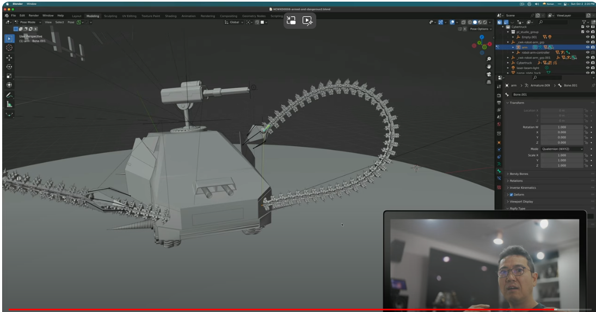

아인이 서우도 잘 봐. 먼저 inverse kinematics, kinematics 얘기를 잠깐 할게요. kinematics는 짚고 넘어가야 되니까. 그게 가능하다는 게 뭐냐면, 정말 그냥 3D 공부를 해보면 3D 모델링을 했을 때, 만약에 제가 터미네이터를 만들었다? 얘가 움직여야 할 거 아니야. 이걸 그냥 마구 움직이는 게 아니고, 인간의 뼈처럼 움직여야 되거든. 그래서 rigging이라는 걸 합니다. rig, r-i-g rig, rig-ing이라는 걸 하는데, 간단하게 얘기하면 뼈를 심는 거예요. 뼈를 심어서 그 뼈를 기준으로 움직이는 거거든. 그걸 rig-ing한다고 해요. 근데 이걸 아주 간편하게 하는 방법 중에 하나가, kinematics, inverse kinematics라는 걸 사용하는 건데. 제가 얼마 전에 만들었던 이게 테슬라 사이버 트럭이잖아. 

그 사이버 트럭에 촉수 같은 걸 달아서 무기로 삼았잖아. 이거 보면 뼈가 하나씩 들어있거든요 이렇게. 얘가 움직입니다. 뼈를 잡아서 움직여 뭐 하는 거야? translation 위치를 바꾸는 거니까. 아인아 서우야 아까 얘기했던 translation은 번역이 아니라고. 위치, 뭔가를 변환시키는 거 이런 걸 말하는 거라고. 그래서 translation을 하면 바뀌는 겁니다 translation. 이런 게 바뀌는 거거든. 그래서 바뀌었을 때 얘는 지금 따로 움직이는 건데, 혼자. 이걸 inverse로 가면 뼈가 시작되는 부분이잖아. 뼈가 시작돼서 이렇게 간다고. 얘는 뼈의 끝부분이고. 근데 잘 보세요 뼈가 시작되는 부분 이렇게 움직일 수 있고요. 뼈를 개별적으로 움직일 수 있다는 거예요. 개별적으로 움직일 수 있는데 끄트머리로 가서 끝뼈를 잡고 움직이면 다른 뼈는 따라오게 돼 있습니다. 

거기에 맞게. 뭐랑 같나면, 내가 이 손가락을 잡고 끄집어 올려 팔꿈치 따라오죠. 이게 inverse kinematics에요. 뼈의 끄트머리를 잡아당기면 따라오게 돼있다. 근데 구조들이 거의 그렇게 생겼어. 지금 아인이하고 서우가 이해를 못했던 부분도 그런 걸 거야. 여기에 그 endo finger를 봤을 때, 

이 첫 번째 마디 부분, 이 부분에 piston이 하나 연결돼있거든. 이렇게 잡아당기면 이렇게 될 수 밖에 없어 왜?

constraint가 있거든. 이 손가락이라는 건. 앞으로만 구부려진다고. 뒤로는 못 간다고. 그래서 잡아당기면 쉽게 앞으로 오게 돼있어. 이해되지? 그리고 나서 잡아당기면 이렇게만 오지 오므려지진 않잖아. 오므려지려면 어떻게 해야 되겠냐고. 오므려지려면 이 첫 번째 마디, 두 번째 마디, 세 번째 마디를 다 잡아당겨야 돼. 그렇게 되지? 이거를 이 축이 세 개가 있는데, 축이 세 개가 있잖아. 첫 번째 마디에 하나, 두 번째 마디에 하나, 세 번째 마디에 하나. 보면 알 거야. 본인 손을 이렇게 해보면. 회전하는 축이 생긴다고. 이걸 영어로 pivot point라고 해. 3D 할 때도 필요한 표현이니까 pivot point. 회전축이 생긴다고. 이거를 회전축을 따라서 회전을 하게 만들거나, actuator를 달아서 또는 string 도르래를 단다고 여기 도르래를 따라서 줄이 올라가. 그래서 끄트머리 inverse kinematics, 아까 뼈 보여준 거. 끄트머리 뼈에다 다는 거야. 그리고 잡아당겨. 줄이 그냥 이렇게 달려있다고 생각해봐. 서우야 아인아? 그럼 어떻게 될 것 같아 줄을 잡아당기면 내려가겠지 이러고. 근데 constraint가 있잖아. 얘네들은 이렇게 밖에 못 오므려지거든.

그 constraint가 생기거든. 오므려진다는 constraint가 생긴다고. 안 그러면 어떻게 되겠어? 이렇게 되겠지. 그냥.

근데 얘는 그 주름진 자루에 줄을 잡아당겼을 때처럼, 자루 있잖아 자루. 복주머니 같은 거. 그거 했을 때 줄을 잡아당기면 오므려지잖아. 그런 constraint가 있다고. 그런 제약이 있는 구조라고. 그래서 줄을 잡아당기면 이렇게 오므려지는 거야. 아주 간단하게 생각하면 돼. 근데 그 줄은 어디에 달려있다? 끄트머리에 달려있다고. 얘가 inverse kinematics니까. inverse라는 말이 반대라는 말이야, 반대. 얘에 달려있으니까 얘를 제어를 하면, 얘를 따라서 움직여야 하는 모든 뼈들이 같이 움직인다. 재밌는 건 첫 번째 마디 있지? 얘는 지 혼자도 움직일 수 있어. 근데 얘는 움직이면 다른 애들이 따라서 움직여야 돼. 그 구조가 inverse kinematics입니다. 그러니까 얘 뼈가 가운데 있는 거나 얘네들은 따로 움직일 수 있는데, 혼자서. 얘가 움직일 때는 같이 움직여야 된다는 거죠. 손가락의 끄트머리처럼. 그게 inverse kinematics거든요. 그렇게 하면 작업이 굉장히 효율적으로 바뀌어요. 따로따로 움직여야 되면, 그걸 다 따로따로 계산을 해야 되는데. 복잡해지고. 그리고 이 rigging을 한다는 것 자체가, 애니메이션을 만들 때 굉장히 어려워지는데, 실제로 실물로 만들 때도 어려워지는데, inverse kinematics를 만들면, 내가 rigging하고 애니메이션을 할 때도 손을 이렇게 움직인다는 걸 뼈를 일일이 이렇게 하는 것보다 얘를 잡아서 이렇게 움직이면, 나머지는 3D 소프트웨어가 알아서 계산을 해준다 그게 inverse kinematics거든요. 이렇게 움직여준다. 머리를 들면, 몸이 따라온다고 이렇게. inverse kinematics가 아니면 이게 끄트머리의 뼈라는 생각이 없으면, 머리를 들면 몸은 가만히 있다고. 머리만 떨어져서 나오지. 그렇게 하면 안 되잖아요. 뼈가 이어져 있을 때, 머리 끄트머리를 만약에 inverse kinematics로 잡았으면, 이 끄트머리 머리카락 하나를 가지고도 사람을 움직일 수 있어야 된다고. 이걸 puppet, 인형놀이 하는 것처럼. 꼭두각시 놀이. 그런 구조죠. 그럼 이제 inverse kinematics는 대충 이해가 되실 거예요. 찾아보셔요. 좀 어렵다 싶으시면, inverse kinematics라고 쳐서, 그냥 inverse kinematics, rigging, blender 이렇게라도 유튜브 같은데 집어넣으시면 그리고 그거를 영상을 한 번 보시면, 단박에 알 수 있습니다. 

이 개념이고요. 그리고 다시 아주 간단하게 translation, six degrees of freedom, three degrees of freedom, translation 이런 걸 살펴볼게. 서우 아인이 졸고 있나? 살짝 걱정이 되는데 여기 보면 monkey로 볼게요. 방향이 보이니까. monkey, 이 티타늄 입힌건데.

얘를 봤을 때, 얘를 볼게요. 전후 좌우가 생기잖아. 전후 좌우. 얘를 봤을 때 전후 좌우가 생겼잖아. 처음에 만들 때 이 세계의 중심, 월드 오리진 세계의 중심이라는 곳에 이 녀석이 생기잖아. 근데 작업을 할 때 위치를 바꾸잖아, 이런 식으로. 이게 뭐다? 이게 translation.

그럼 x, y, z 좌표가 다 바뀌거든, 얘가. 보면, x, y, z 좌표가 바뀌었잖아. 여기서 지금 로케이션이라고 얘기를 하잖아. 이걸 다른 표현으로 하면 translation이라고. 근데 지금 회전은 하나도 안 바뀌지? 로테이션이라고 하는 거. 회전값은 하나도 안 바뀌잖아. 0도로 돼있지? 0 degree. 이걸 회전을 하면 바뀌겠지? 마이너스 값도 나오고 그죠? 이렇게 바뀐다고요. 이게 translation의 개념이야. 근데 만약에 회전을 생각하지 않아. 회전을 생각하지 않을 때 g, y 앞뒤로만 움직인다, 앞, 뒤 2 degrees of freedom. g, x 좌우도 움직인다, 4 degrees of freedom. g, z 위, 아래도 움직인다, 6 degrees of freedom. 그리고 회전을 하면? 회전은 못하잖아 지금. 근데 회전을 해? 이거 똑같아 r, 로테이션을 하는데 그냥 이렇게 로테이션을 하는 거야. 로테이션을 하는데 이렇게 하면 어디로 움직이는지 모르잖아. 근데 r, y축을 중심으로 움직인다, 또 2 degrees of freedom이 생기지? r, z 그러면 g축을 기준으로 움직이는 거고. 또 degrees of freedom이 늘어나지? r, x, x축을 중심으로 움직이는 거. 잘 생각해보면 내가 어떻게 했어? g, x 움직이는데 x축으로만 움직여라잖아. 지금 x축으로 밖에 못 움직이잖아. 이걸 뭐라고 한다고 했어 아까? y축으로도 못 움직이고 z축으로도 못 움직이게 구속을 하는 거야. 제약을 건 거야. 그래서 constraint를 건 거라고. 얘는 이렇게 밖에 못 움직이는 애를 만들어 놓은 거야. 실제로 모터나 이런 거 만들 때도 한 방향으로만 움직이게 만들어야 되잖아. 그럴 때가 있잖아. 그걸 constraint를 건다고 한다고. 자유도를 일부러 제약하는 거야. 자유도가 무조건 높은 게 좋은 게 아니라고. 그러니까 한쪽으로만 움직여야 되는 게, 막 이렇게 돌면 뼈가 부러졌구나 그랬다는 뜻이니까. 그러니까 그 아인이 더 이해하기 쉽겠다, 메카닉을 만들 때. 로봇을 만들 때도 한쪽 방향으로만 움직여야 될 때가 있을 거 아니야. 그랬을 때 constraint를 거는 거라고. 이거는 지금 x좌표로만 움직일 수 있게 constraint를 건 거고. g, y로 치면 y좌표로만 움직일 수 있게, constraint를 건 거야. 이건 z좌표로만 움직일 수 있게 constraint를 거는 거라고. 회전을 할 때도 마찬가지라고. 너는 z좌표로만 회전을 해라, 이렇게 constraint를 거는 거고. 그럼 constraint 개념이 생기지. 쉽지. 근데 내가 constraint를 걸지 않아, 걸지 않고 그냥 막 움직여. 이러면 엉망이 될 수도 있다고. 내가 이만큼 움직여서 회전을 시켜놔 이렇게 놨어. 3D에서 크게 실수하는 부분 중에 하나가 이런 거거든. 이렇게 하고 나서 이걸 적용한다고 해. 아직 적용된 게 아니거든. 이게, 이 값이. origin은 아직도 이 세계의 중심에 있는 거야 이 녀석은. 근데 이 녀석을 적용을 하잖아? location, rotation 그럼 다 0으로 바뀌지. 

그럼 이제 얘는 이제 여기가 자기 중심이 되는 거야. 그래서 이 따위로 되는 거지, 제어하기도 어려워지. 엉망이 되는 거지. 굉장히 힘든 상황이 된 겁니다, 지금. 어떻게 원상복귀하기도 힘들고. 이래서 constraint를 거는 거야. 이러면 안 되니까. 딱 그 안에서만 돌아갈 수 있게, 한 방향 두 방향 내가 원하는 방향, 설계한 사람이 엔지니어링을 한 사람이, 돌아갈 수 있게, 돌아가야만 하는 곳으로만 돌고 움직일 수 있게. 그렇게 degrees of freedom을 일부러 구속할 수 있는 게, constraint 개념이라고. 그럼 이제 컨트롤이 아니고, 이제 나는 맥을 쓰고 있기 때문에 Command Z를 눌러서 다 원상복귀시키고. 그러고 나서 pivot point 설명해 줄게. 얘를 보면 지금 따라다니는 점이 있을 거야. 이 점, 어디로 회전해?

그 점을 중심으로 회전해. 그게 pivot point야. 회전축이라고, 회전축. 근데 이 회전축을 여기로 옮기고 싶어? 회전축을. 자기가 원하는 방향으로 옮기고 싶어. 예를 들어 회전축을 3D 커서로 바꿨다? 그러면 얘는 3D 커서를 중심으로 움직이거든? 이런 건 다 선택할 수 있거든? 3D 소프트웨어에서. 그리고 이 origin이라는 거, 회전축, pivot point 다 같은 말인데, 그걸 옮기고 싶어? 얘가 지금 중심쪽에서 돌잖아. 나는 목 부근, 턱 부근에서 돌고 싶어? 그러면 옮기는 방법이 있거든? 그냥 이렇게 옮겨.

살짝 옮겨. 옮겨서 난 이쯤에서 돌래. 이렇게 해주는 거야. 그러면 옮겨졌지? pivot point가. 그럼 얘는 이제 턱에서 돈다고? 이게 pivot point 개념이라고? 그럼 생각해봐. 손가락 마디가 있는데, 이 마디가 가운데 있는 게 아니고, 아래쪽에, 아래쪽에 pivot point, 이 오렌지 점에 해당하는 부분이 있다고. 그걸 중심으로 도는 거야. R, X 이런 식으로 손가락이. 이게 세 개가 포개져 있는데 제약이 서로 다르니까 오므려진다고 생각을 하면 돼. 

다시 오므려지는 거 잠깐 만들어 볼게. 손가락이 이렇게 생겼다고 생각해 볼게 

이렇게 생겼다고 생각해 봤을 때, 이게 지금 얘네들은 손가락 마디마디가 다 pivot point가 오렌지를 보면 중간에 있잖아. 그래서 얘를 회전을 하면, 통째로 회전하면 이렇게 되거든. 그리고 이거를 손가락이 다 자유로우니까 따로따로 회전할 수 있으니까, Individual Origins 라는 걸로 따로따로 회전축을 활용하겠다는 거야. 

Individual, 개인이라고 외웠을 수도 있는데. Individual, 개별로, 움직일 수 있게. 그럼 이렇게 따로따로 움직이지. 제약이 안 걸려 있으니까, 따로따로 움직인다고. 근데 제약을 걸 거야. 너는 중간 마디, 중간 마디는 아랫마디의 자식이어야 한다. 아버지, 엄마를 뭐라 그래? Parent. 복수니까 엄마 아빠니까 Parents. 둘 중에 한 명만 얘기를 하면 Parent. 그리고 아인이하고 서우는 아들, 딸이지만 그냥 아이라고 할 때는, 자녀라고 할 때는, Child라고 하잖아. 그걸 복수로 얘기하면 S 붙이면 안 되고. Children이라고 하잖아. 마찬가지야 Parent, Child 이렇게 만드는 거야. 이 녀석이 Child야. Parent고. 그래서 Parent를 걸어. 그게 어떤 말이냐면, 얘 혼자 움직일 수 있어. 자식은. 근데 부모는 부모가 움직이면 자식도 따라서 움직여. 이 개념이야 Child, Parent. 그래서 아래에 잘 봐.

회전하잖아. 같이 움직여. 

얘 혼자 움직이잖아? 그럼 혼자 돌아. 그 개념이야. 얘 혼자 돌지 않아. 같이 돌아. 근데 Individual로 돌면, 또 도는 방향이 다르지. 이렇게 생긴 거야. 근데 나는 뿌리 쪽에서 돌고 싶어. 그럼 아까 한 대로 내려와. 얘도 내려와야겠지? pivot point를 아래로 내려. 그리고 Magic, 돌려. 오므려지네. 근데 위의 녀석은 안 오므려지잖아. 그럼 어떻게 해야 돼? 중간 녀석의 Parent 역할을 해 주는 거야. Child, Parent, Parent를 걸어. 근데 Origin이 위에가 있지, pivot point 회전축이? 얘도 회전축을 내려.

Magic, 오므려. 이렇게 손가락이 오므려지는 거야. 

이렇게 오므려지는 원리는 똑같다고. 이거를, 이걸 해 주는 녀석, 오므리게 만드는 모터, 뭐라고 한다고 아까 했어? Accurate, Act하게 만드는, 이 녀석이 오므려지는 Act를 하게 만드는 액츄에이터. 구동기가 어딘가 있을 거 아니야. 그걸 해 주는 게 액츄에이터라는 거고. 그리고 얘는 지금 뒤로도 돌아가거든? 이러면 안 되지. 왜 인간의 손은 뒤로 이렇게 돌아가면 안 되니까. 뒤로는 오므려질 수 없으니까. 단순하게 만든 거니까 지금. 그럼 어떻게 해야 돼? Constraint를 걸어야 된다고. 저쪽, 뒤쪽으로는 넘어가지 못하게. 아까 뭐라고 그랬어? Non back drivable fingers. 거기서 나온 거야. 이리로 들어가면 이게 Back Drivable이거든.

Non back drivable finger를 만들어야 된다고. 이렇게 가면 안 되고. 그 개념이야. 그런데 얘가 회전하는 방법, 이 오므리는 액츄에이터를 만드는 방법, 액츄에이터 모터는 어떻게든 돌릴 거 아니야. 그 모터를 돌리는 방법이, 이렇게 그러니까 individual로. 오므리는 방법이 여러 가지가 있는데, 이 pivot point를 이런 식으로 활용하는 방법이 있고, 잡아당기는데 어느 회전축에서 어떻게 잡아당기느냐, 그것만으로도 작동을 할 수 있거든 엉성하게라도. 그런데 여기다 스트링을 걸면, inverse kinematics 아까처럼. 스트링을 걸면 이 녀석을 잡아당길 때, parent child 구조, 이 녀석이 parent가 되는 거거든. 제가 그걸 지금 보여 드리려면, 너무 복잡한 과정을 거치고, 저도 잘 못하기 때문에 단순하게만 설명하는 거예요. 얘가 parent가 되고 아랫녀석들이 줄줄이 child가 돼서, children이 돼서 얘를 움직일 때 알아서 계산을 하게 만드는 거지. 어차피 constraint가 걸려 있으니까. 앞으로 밖에 못 움직인다. 그러니까 여기 스트링을 걸어서 이 녀석이 스트링을 걸면 잡아당기면 오므려질 수밖에 없는 구조라고. 얘가.

아래까지 스트링을 아래로 잡아당긴다고 했을 때, 이렇게 오므려지는 구조라고. 제약이 다 있으니까 서로. 이해 돼? 아인이 서우 이해 안 돼? 이해될 거야 이 정도면. 나보다 머리 좋을 것 같은데. 이제 어른의 시각으로 돌아와서. 

어떤 걸 느끼십니까. 여전히 그냥 3D 블렌더는 블렌더고 2D 그림은 그림이고 그렇게 느끼시면 진짜 할 말 없는데. 호라이즌을 넓힌다는 게 이런 의미에요. 

뭐 제가 투자 쪽으로는 언급하고 싶지 않지만, 투자를 해도 마찬가지일 거 아니야. 이렇게 보는 사람이 있어. 이렇게 호라이즌을 넓혀온 사람이 있어. 그런 사람이 만들어가는 비전과 그냥 그 AI day 이벤트 같은 걸 그냥 볼 때, 그냥 봐도 그런가 보다, 엉성하네. 과연 정말 엉성한 걸까 그게. 어떤 기준으로 엉성하다를 평가 하셨습니까. 스펙을 보실 줄 아시냐고. 거기 나온 스펙을, 그냥 엉성하게 움직이는데, 중간 과정이잖아. 그랬을 때, 지금 얘기했잖아요. three degrees of freedom, six degrees of freedom, eleven degrees of freedom, twenty eight degrees of freedom, 그것도 무조건 높다고 좋은 것도 아니고. 그 힌트를 뭘로 줬냐면 non back drivable fingers. constraint도 걸 수 있는 기술력이고. 그건 어려운 건 아니야. 그러니까 degrees of freedom을 제어할 수 있다는 거잖아. 정밀하게. 정밀하게. precise 하게. 1년 됐거든요. optimus 보인 지가. 개발을 제대로 한 지가. 내년은 어떨까? 더 잘하겠지. 그런 걸 봐야지. 보이는 게 전부가 아니거든. 외형만 보는 게 아니거든. 그런데도 호라이즌을 왜 넓혀야 하는지 물어본다면 난 답이 없고.